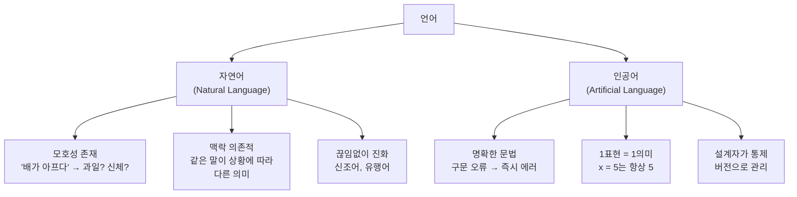
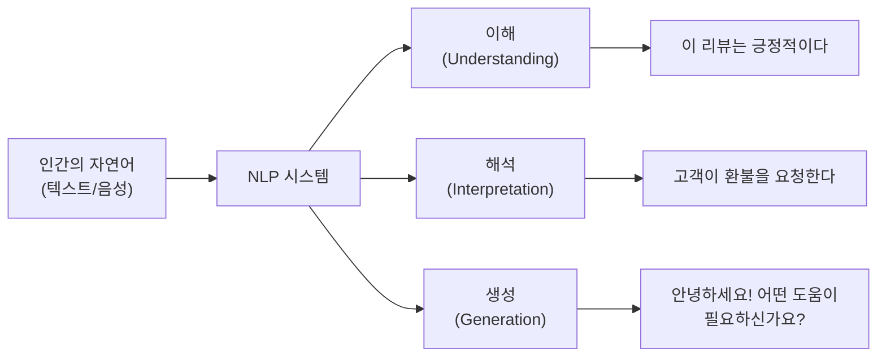
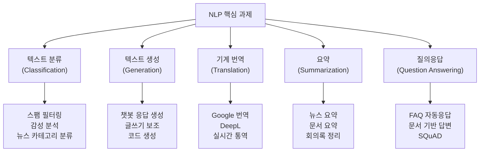
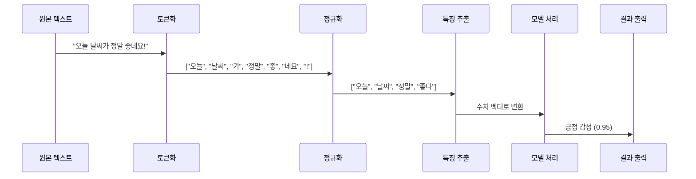

# 자연어 처리란 무엇인가

> 컴퓨터가 인간의 언어를 이해하고 활용하는 기술, 자연어 처리(NLP)의 세계로 들어가봅니다.

## 개요

이 섹션에서는 자연어 처리(Natural Language Processing, NLP)가 무엇인지, 왜 필요한지, 그리고 어떤 문제들을 해결하는지 살펴봅니다. NLP의 핵심 과제를 하나씩 짚어보고, 간단한 Python 코드로 NLP가 실제로 어떻게 동작하는지 체험해봅니다.

**선수 지식**: Python 기초 문법 (변수, 함수, 리스트)
**학습 목표**:
- 자연어 처리(NLP)의 정의와 자연어/인공어의 차이를 설명할 수 있다
- NLP의 5대 핵심 과제(분류, 생성, 번역, 요약, QA)를 구분할 수 있다
- Python으로 간단한 NLP 작업을 체험하고 결과를 해석할 수 있다

## 왜 알아야 할까?

여러분은 매일 NLP 기술을 사용하고 있습니다. 스마트폰의 자동 완성, 이메일 스팸 필터, 번역 앱, ChatGPT까지 — 이 모든 것의 근간이 바로 자연어 처리입니다.

2026년 현재 NLP 시장 규모는 약 348억 달러에 달하며, 전년 대비 15.9% 성장했습니다. 의료 기록 자동 작성부터 금융 사기 탐지, AI 튜터까지 — NLP를 이해하지 못하면 현대 AI의 절반을 놓치는 셈이죠.

이 코스 전체는 NLP의 기초부터 LLM까지 여행하는 로드맵인데요, 그 출발점이 바로 "자연어 처리란 무엇인가"를 정확히 이해하는 것입니다.

## 핵심 개념

### 개념 1: 자연어 vs 인공어 — 컴퓨터는 왜 말을 못 알아들을까?

> 💡 **비유**: 자연어는 오래된 시장의 흥정과 같습니다. "이거 좀 깎아주세요"라는 말에는 맥락, 뉘앙스, 문화적 배경이 모두 녹아 있죠. 반면 인공어(프로그래밍 언어)는 패스트푸드 주문 키오스크입니다 — "치즈버거 1개, 콜라 M" 처럼 정해진 형식으로만 소통할 수 있습니다.

**자연어(Natural Language)**는 인간이 일상에서 의사소통하기 위해 자연스럽게 발전시킨 언어입니다. 한국어, 영어, 일본어 모두 자연어입니다. 자연어는 **모호성**, **다의성**, **맥락 의존성**이라는 특성을 가지고 있어서 컴퓨터가 처리하기 매우 까다롭습니다.

**인공어(Artificial Language)**는 특정 목적을 위해 사람이 설계한 언어입니다. Python, Java 같은 프로그래밍 언어가 대표적이죠. 인공어는 문법이 엄격하고, 한 표현이 정확히 하나의 의미만 가집니다.

> 📊 **그림 1**: 자연어와 인공어의 차이



예를 들어 "나는 배가 고프다"라는 문장에서 "배"가 과일인지, 신체 부위인지, 선박인지는 맥락을 봐야 알 수 있습니다. 하지만 Python에서 `x = 5`는 언제나 "변수 x에 5를 할당한다"는 단 하나의 의미만 가집니다. 이 차이가 바로 NLP가 어려운 이유이자, NLP가 필요한 이유입니다.

```run:python
# 자연어의 모호성을 확인해 봅시다
sentences = [
    "나는 배가 고프다",      # 배 = 신체 부위 (복부)
    "나는 배를 타고 갔다",    # 배 = 선박
    "나는 배를 깎아 먹었다",  # 배 = 과일
]

for s in sentences:
    # 같은 '배'라는 글자가 3가지 다른 의미로 사용됩니다
    print(f"문장: {s}")
    if "고프다" in s:
        print("  → '배' = 신체 부위 (복부)")
    elif "타고" in s:
        print("  → '배' = 선박")
    elif "깎아" in s:
        print("  → '배' = 과일")
    print()
```

```output
문장: 나는 배가 고프다
  → '배' = 신체 부위 (복부)

문장: 나는 배를 타고 갔다
  → '배' = 선박

문장: 나는 배를 깎아 먹었다
  → '배' = 과일

```

위 코드는 단순한 키워드 매칭으로 의미를 구분했습니다. 하지만 실제 NLP는 이보다 훨씬 정교한 방법으로 맥락을 이해합니다. 이 코스를 통해 그 방법들을 하나씩 배워나갈 거예요.

### 개념 2: NLP의 정의 — 컴퓨터에게 언어를 가르치다

> 💡 **비유**: NLP는 외국어를 전혀 모르는 친구에게 통역을 가르치는 것과 비슷합니다. 처음에는 단어장을 외우게 하고(토큰화), 문법 규칙을 알려주고(구문 분석), 결국 문맥을 읽는 법까지 가르쳐야(의미 분석) 비로소 통역이 가능해지죠.

**자연어 처리(Natural Language Processing, NLP)**는 컴퓨터가 인간의 자연어를 이해(Understanding), 해석(Interpretation), 생성(Generation)하도록 하는 인공지능의 한 분야입니다. NLP는 언어학, 컴퓨터 과학, 통계학이 만나는 학제적 영역이죠.

NLP의 목표를 단순화하면 이렇습니다:

> 📊 **그림 2**: NLP의 핵심 목표



NLP는 크게 **자연어 이해(NLU, Natural Language Understanding)**와 **자연어 생성(NLG, Natural Language Generation)**으로 나뉩니다. NLU는 텍스트를 입력받아 의미를 파악하는 것이고, NLG는 의미를 텍스트로 변환하여 출력하는 것입니다. ChatGPT 같은 대화형 AI는 NLU와 NLG를 모두 수행합니다.

### 개념 3: NLP의 5대 핵심 과제

> 💡 **비유**: NLP의 핵심 과제는 언어 시험의 유형과 비슷합니다. 독해 문제(분류/QA), 작문(생성), 번역, 요약 — 시험에 이 유형들이 있듯, NLP에도 대표적인 과제 유형이 있습니다.

NLP가 해결하는 대표적인 과제를 살펴보겠습니다:

> 📊 **그림 3**: NLP의 5대 핵심 과제



| 과제 | 설명 | 일상 속 예시 |
|------|------|-------------|
| **텍스트 분류** | 텍스트에 카테고리/라벨 부여 | 스팸 메일 필터, 감성 분석, 뉴스 분류 |
| **텍스트 생성** | 새로운 텍스트를 만들어 냄 | ChatGPT, 자동 완성, 글쓰기 보조 |
| **기계 번역** | 한 언어를 다른 언어로 변환 | Google 번역, DeepL, 실시간 자막 |
| **요약** | 긴 텍스트를 핵심만 추려냄 | 뉴스 요약, 논문 요약, 회의록 정리 |
| **질의응답(QA)** | 질문에 대한 답을 텍스트에서 찾아냄 | FAQ 챗봇, 검색 엔진, SQuAD 벤치마크 |

이 5가지 과제 외에도 **개체명 인식(NER)**, **품사 태깅(POS Tagging)**, **의존 구문 분석(Dependency Parsing)** 등 다양한 하위 과제가 존재합니다. 이 코스를 통해 이 과제들을 하나씩 직접 구현해볼 거예요.

### 개념 4: NLP의 처리 단계 — 텍스트에서 의미까지

> 💡 **비유**: NLP의 처리 단계는 요리 과정과 비슷합니다. 재료를 씻고 다듬고(전처리), 조리하고(분석), 플레이팅(결과 출력)하는 것처럼, 텍스트도 여러 단계를 거쳐 의미 있는 결과물이 됩니다.

NLP 시스템은 일반적으로 다음과 같은 **개념적 파이프라인**으로 텍스트를 처리합니다:

> 📊 **그림 4**: NLP 처리 파이프라인 (개념적 흐름)



1. **토큰화(Tokenization)**: 텍스트를 단어나 서브워드 단위로 쪼갭니다
2. **정규화(Normalization)**: 소문자 변환, 불용어 제거, 표제어 추출 등
3. **특징 추출(Feature Extraction)**: 텍스트를 숫자 벡터로 변환
4. **모델 처리**: 머신러닝/딥러닝 모델이 의미를 파악
5. **결과 출력**: 분류 결과, 생성된 텍스트, 번역 결과 등

> ⚠️ **용어 구분 — 개념적 파이프라인 vs 구현 파이프라인**: 여기서 소개한 파이프라인은 NLP의 **일반적·개념적 처리 흐름**입니다. 실제 NLP 라이브러리(예: spaCy)를 사용하면 Tokenizer → tok2vec → Tagger → Parser → NER 처럼 **라이브러리 고유의 구현 파이프라인**을 사용하게 되는데요, 이는 위 개념적 단계를 해당 라이브러리의 아키텍처에 맞게 구체화한 것입니다. [04. NLP 라이브러리 소개](01-ch1-자연어-처리-개요와-개발-환경-설정/04-04-nlp-라이브러리-소개-nltk-spacy-hugging-face.md)에서 spaCy의 실제 파이프라인을 직접 다뤄보면서 이 차이를 자연스럽게 이해하게 될 거예요.

이 파이프라인의 각 단계를 이 코스에서 순서대로 깊이 있게 다룰 예정입니다. [Ch2. 텍스트 전처리](02-ch2-텍스트-전처리-토큰화와-정규화/01-01-토큰화의-기초.md)에서 토큰화와 정규화를, [Ch3. 텍스트 표현](03-ch3-텍스트-표현-bow와-tf-idf/01-01-bag-of-words-모델.md)에서 특징 추출을 배우게 됩니다.

## 실습: 직접 해보기

Python으로 간단한 NLP 작업을 체험해봅시다. 아직 라이브러리 설치 전이므로, 순수 Python만으로 NLP의 기본 개념을 느껴보겠습니다.

```run:python
# === NLP 맛보기: 순수 Python으로 간단한 감성 분석 ===

# 긍정/부정 단어 사전 (매우 단순화된 버전)
positive_words = {"좋다", "훌륭하다", "최고", "만족", "행복", "좋은", "맛있다", "재밌다", "추천"}
negative_words = {"나쁘다", "최악", "불만", "실망", "별로", "싫다", "불편", "화나다", "후회"}

def simple_sentiment(text):
    """초간단 감성 분석 함수"""
    # 단순 토큰화: 공백으로 분리
    words = text.replace(".", "").replace("!", "").replace("?", "").split()
    
    pos_count = sum(1 for w in words if w in positive_words)  # 긍정 단어 수
    neg_count = sum(1 for w in words if w in negative_words)  # 부정 단어 수
    
    if pos_count > neg_count:
        return "긍정 😊", pos_count, neg_count
    elif neg_count > pos_count:
        return "부정 😞", pos_count, neg_count
    else:
        return "중립 😐", pos_count, neg_count

# 테스트 문장들
reviews = [
    "이 영화는 정말 최고 추천합니다!",
    "서비스가 최악이고 불만입니다.",
    "그냥 보통이에요.",
]

print("=== 초간단 감성 분석 결과 ===\n")
for review in reviews:
    sentiment, pos, neg = simple_sentiment(review)
    print(f"리뷰: {review}")
    print(f"결과: {sentiment} (긍정:{pos}, 부정:{neg})\n")
```

```output
=== 초간단 감성 분석 결과 ===

리뷰: 이 영화는 정말 최고 추천합니다!
결과: 긍정 😊 (긍정:2, 부정:0)

리뷰: 서비스가 최악이고 불만입니다.
결과: 부정 😞 (긍정:0, 부정:2)

리뷰: 그냥 보통이에요.
결과: 중립 😐 (긍정:0, 부정:0)

```

위 코드는 NLP의 가장 기초적인 접근법인 **사전 기반(Lexicon-based) 감성 분석**입니다. 단어 사전에 긍정/부정 단어를 넣어두고, 텍스트에 등장하는 긍정·부정 단어의 수를 세는 방식이죠.

이 방법은 간단하지만 한계가 큽니다. "별로 좋지 않다"처럼 부정이 긍정을 뒤집는 문장, "아 진짜 대박이네 완전 실망"처럼 반어법을 사용하는 문장은 제대로 처리하지 못합니다. 이후 챕터에서 배울 머신러닝/딥러닝 기반 방법들은 이런 한계를 극복합니다.

이제 Python의 기본 문자열 처리로 NLP의 기초 작업 — 토큰화, 단어 빈도 분석 — 을 체험해봅시다:

```run:python
# === NLP 기초 작업 체험 ===
from collections import Counter

text = """자연어 처리는 인공지능의 핵심 분야입니다.
자연어 처리를 통해 컴퓨터는 인간의 언어를 이해할 수 있습니다.
인공지능과 자연어 처리는 밀접하게 연결되어 있습니다."""

# 1. 간단한 토큰화 (공백 기반)
tokens = text.replace("\n", " ").replace(".", "").split()
print(f"전체 토큰 수: {len(tokens)}")
print(f"고유 토큰 수: {len(set(tokens))}")
print()

# 2. 단어 빈도 분석
word_freq = Counter(tokens)
print("=== 단어 빈도 Top 5 ===")
for word, count in word_freq.most_common(5):
    bar = "█" * count  # 빈도를 막대로 시각화
    print(f"  {word:10s} | {bar} ({count}회)")
```

```output
전체 토큰 수: 16
고유 토큰 수: 14

=== 단어 빈도 Top 5 ===
  처리는        | █ (1회)
  인공지능의      | █ (1회)
  핵심          | █ (1회)
  분야입니다      | █ (1회)
  처리를        | █ (1회)
```

흥미로운 결과가 나왔죠? 공백 기반 토큰화에서는 "처리는"과 "처리를"이 서로 다른 토큰으로 취급됩니다. 한국어는 조사("는", "를", "와" 등)가 단어에 붙기 때문인데요, 이런 문제를 해결하려면 **형태소 분석**이 필요합니다. 이 내용은 [Ch2. 텍스트 전처리](02-ch2-텍스트-전처리-토큰화와-정규화/01-01-토큰화의-기초.md)에서 본격적으로 다룹니다.

## 더 깊이 알아보기

### NLP의 탄생 — 기계 번역의 꿈에서 시작하다

NLP의 역사는 1950년대로 거슬러 올라갑니다. 1950년, 영국의 수학자 **앨런 튜링(Alan Turing)**이 역사적인 논문 "Computing Machinery and Intelligence"를 발표했습니다. 이 논문에서 튜링은 "기계가 생각할 수 있는가?"라는 질문을 던지며, 기계와 인간을 구별하는 **튜링 테스트**를 제안했죠. 이것이 NLP 연구의 철학적 기반이 되었습니다.

실질적인 NLP의 첫 시도는 1954년의 **조지타운-IBM 실험**입니다. 조지타운 대학과 IBM이 협력하여 60개 이상의 러시아어 문장을 영어로 자동 번역하는 데 성공했는데요, 놀랍게도 이때 사용된 규칙은 고작 6개의 문법 규칙과 250개의 어휘뿐이었습니다. 이 실험의 성공에 고무된 연구자들은 "3~5년 안에 기계 번역이 완성될 것"이라고 낙관했지만, 현실은 그리 녹록하지 않았습니다.

1966년 미국 정부의 **ALPAC 보고서**는 기계 번역 연구에 찬물을 끼얹었습니다. "기계 번역은 아직 실용적이지 않다"라는 결론과 함께 연구비가 대폭 삭감된 것이죠. 이른바 **AI 겨울**의 시작이었습니다. 하지만 이 좌절이 NLP를 없앤 것은 아니었습니다 — 연구자들은 더 현실적인 목표를 향해 방향을 틀었고, 그 결과 오늘날의 ChatGPT까지 이어지는 놀라운 여정이 시작되었습니다.

### NLP의 이름은 누가 지었을까?

"Natural Language Processing"이라는 용어가 정확히 누구에 의해 처음 사용되었는지는 명확하지 않지만, 1960년대에 이 분야가 하나의 독립적인 연구 영역으로 자리 잡으면서 자연스럽게 정착되었습니다. "자연어"라는 용어는 프로그래밍 언어(인공어)와 구분하기 위해 사용되기 시작했죠 — 인간이 "자연스럽게" 사용하는 언어라는 뜻에서요.

## 흔한 오해와 팁

> ⚠️ **흔한 오해**: "NLP는 딥러닝만으로 할 수 있다"
> 
> NLP는 딥러닝 이전에도 이미 수십 년간 발전해온 분야입니다. 규칙 기반, 통계적 방법, 머신러닝을 거쳐 딥러닝에 이르기까지, 각 접근법에는 여전히 유효한 장점이 있습니다. 예를 들어, 정규표현식 기반의 패턴 매칭은 이메일 주소 추출 같은 정형화된 작업에서 딥러닝보다 빠르고 정확합니다. 이 코스가 전통적 방법(Ch1-Ch6)부터 시작하는 이유이기도 합니다.

> 💡 **알고 계셨나요?**: NLP에서 가장 기본이 되는 작업은 "토큰화"입니다. 그런데 어떤 언어는 토큰화가 매우 어렵습니다. 영어는 공백으로 단어가 구분되지만, 한국어는 교착어라서 "먹었습니다"를 "먹-었-습니다"로 분리해야 하고, 중국어는 아예 단어 사이에 공백이 없습니다. 일본어도 "東京都" 같은 경우 "東京+都"인지 "東+京都"인지 맥락을 봐야 합니다.

> 🔥 **실무 팁**: NLP 프로젝트를 시작할 때는 항상 **데이터를 먼저 보세요**. 아무리 정교한 모델도 데이터의 품질이 나쁘면 좋은 결과를 내지 못합니다. "Garbage In, Garbage Out"은 NLP에서도 진리입니다. 실무에서 NLP 엔지니어의 시간 중 60-80%는 데이터 수집과 전처리에 사용됩니다.

## 핵심 정리

| 개념 | 설명 |
|------|------|
| **자연어(Natural Language)** | 인간이 일상 소통에 사용하는 언어. 모호성과 맥락 의존성이 특징 |
| **NLP** | 컴퓨터가 자연어를 이해·해석·생성하도록 하는 AI 분야 |
| **NLU / NLG** | 자연어 이해(입력→의미) / 자연어 생성(의미→텍스트) |
| **텍스트 분류** | 텍스트에 카테고리를 부여 (스팸 필터, 감성 분석) |
| **텍스트 생성** | 새로운 텍스트를 만들어 냄 (챗봇, 자동 완성) |
| **기계 번역** | 한 언어를 다른 언어로 변환 (Google 번역) |
| **요약** | 긴 텍스트에서 핵심만 추출 |
| **질의응답(QA)** | 주어진 문서/지식에서 질문에 대한 답을 찾음 |
| **NLP 파이프라인** | 토큰화 → 정규화 → 특징 추출 → 모델 처리 → 결과 출력 (개념적 흐름) |

## 다음 섹션 미리보기

이번 섹션에서 NLP가 무엇인지, 어떤 과제를 해결하는지 살펴보았습니다. 다음 섹션 [02. NLP의 발전사: 규칙 기반에서 LLM까지](01-ch1-자연어-처리-개요와-개발-환경-설정/02-02-nlp의-발전사-규칙-기반에서-llm까지.md)에서는 1950년대 규칙 기반 시대부터 2020년대 LLM 시대까지, NLP가 어떤 패러다임을 거쳐 발전해왔는지 시대별로 깊이 있게 살펴봅니다. 조지타운 실험의 낙관에서 AI 겨울의 좌절, 그리고 딥러닝의 혁명까지 — NLP 70년의 드라마틱한 여정이 기다리고 있습니다.

## 참고 자료

- [Stanford CS 224N: Natural Language Processing with Deep Learning](https://web.stanford.edu/class/cs224n/) - Chris Manning 교수가 이끄는 NLP 최고의 대학 강의. 워드 임베딩부터 LLM까지 체계적으로 학습 가능
- [spaCy 101: Everything you need to know](https://spacy.io/usage/spacy-101) - 산업용 NLP 라이브러리 spaCy의 공식 입문 가이드. NLP 파이프라인 개념을 실습으로 익히기 좋음
- [Natural Language Processing with Deep Learning (Stanford Online)](https://online.stanford.edu/courses/cs224n-natural-language-processing-deep-learning) - CS224N의 온라인 수강 안내. 누구나 등록 가능
- [History of Natural Language Processing - Wikipedia](https://en.wikipedia.org/wiki/History_of_natural_language_processing) - NLP의 역사를 시대별로 정리한 위키피디아 문서
- [Hugging Face NLP/LLM Course](https://huggingface.co/learn/llm-course/chapter1/1) - Hugging Face에서 제공하는 무료 NLP/LLM 실습 코스