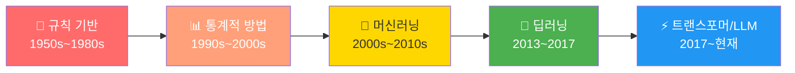
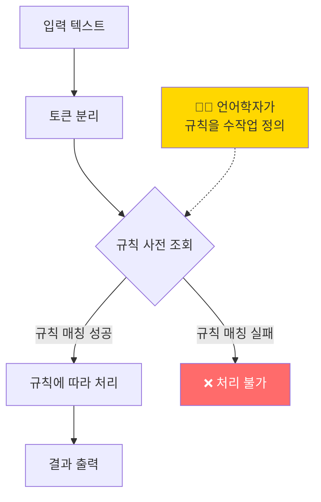
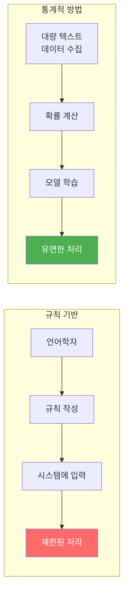
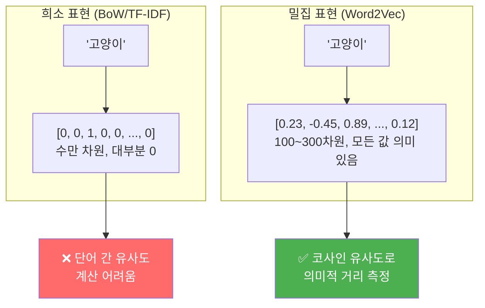
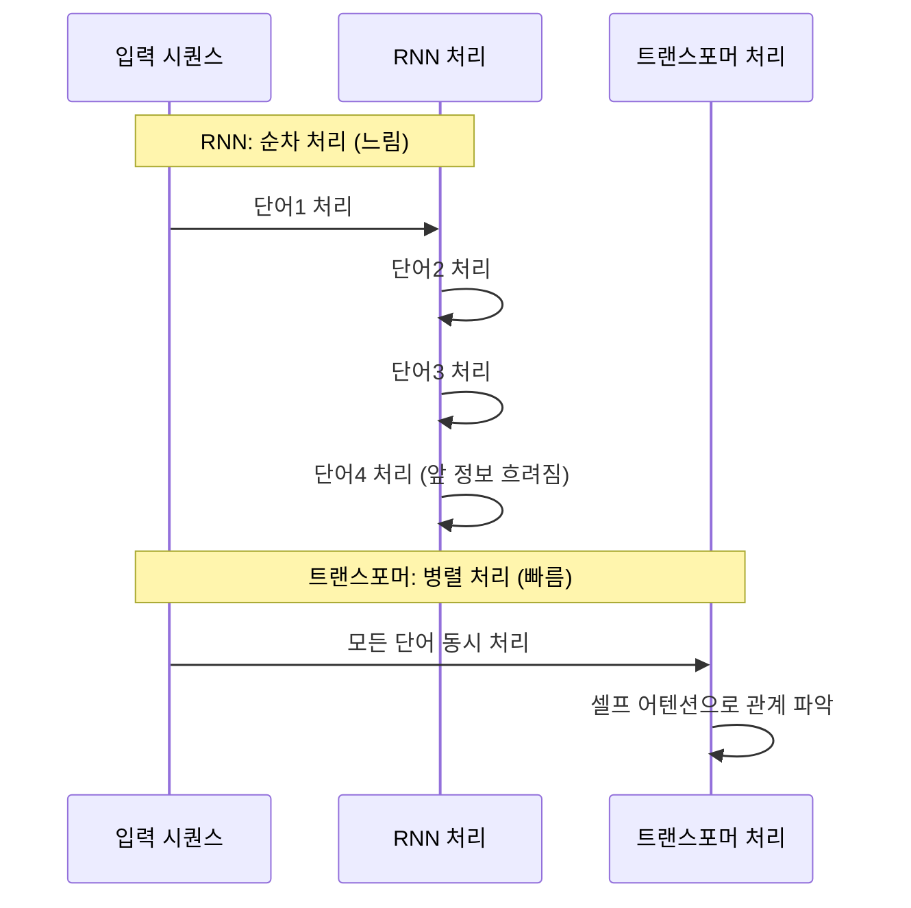

# NLP의 발전사: 규칙 기반에서 LLM까지

> 1950년대 기계 번역 실험부터 2020년대 대규모 언어 모델까지, NLP 70년 진화의 핵심 패러다임을 한눈에 조망합니다.

## 개요

이 섹션에서는 자연어 처리(NLP)가 지난 70여 년 동안 어떤 패러다임 전환을 거쳐 왔는지 시대별로 살펴봅니다. 각 시대의 핵심 아이디어와 한계를 이해하면, 왜 현재의 트랜스포머와 LLM이 등장했는지 자연스럽게 납득할 수 있습니다.

**선수 지식**: [자연어 처리란 무엇인가](01-ch1-자연어-처리-개요와-개발-환경-설정/01-01-자연어-처리란-무엇인가.md)에서 배운 NLP의 정의, 5대 핵심 과제(분류, 생성, 번역, 요약, QA), NLP 파이프라인의 전체 흐름

**학습 목표**:
- NLP 발전의 5대 패러다임(규칙 기반 → 통계적 → 머신러닝 → 딥러닝 → LLM)을 시대별로 구분할 수 있다
- 각 패러다임의 핵심 아이디어와 한계점을 설명할 수 있다
- 트랜스포머 아키텍처가 왜 "게임 체인저"인지 이해할 수 있다
- Python 코드로 각 시대의 접근 방식 차이를 체험할 수 있다

## 왜 알아야 할까?

NLP를 공부하다 보면 "Word2Vec", "LSTM", "BERT", "GPT" 같은 용어가 쏟아지는데요, 이것들이 왜 등장했는지 맥락을 모르면 그저 "외워야 할 기술 목록"이 되어버립니다. 하지만 NLP의 역사를 알면 **각 기술이 이전 시대의 어떤 한계를 극복하려 했는지** 이해할 수 있거든요.

마치 자동차의 역사를 알면 "왜 전기차가 나왔는지" 자연스럽게 이해되는 것처럼, NLP의 발전사를 알면 앞으로 이 코스에서 배울 모든 기술이 하나의 큰 스토리 안에서 연결됩니다.

이 코스의 20개 챕터가 바로 이 발전사의 순서를 따라가거든요. Ch2~4는 통계적 방법, Ch5~6은 워드 임베딩, Ch7~10은 딥러닝/RNN, Ch11~14는 어텐션/트랜스포머, Ch15~20은 BERT/GPT/LLM을 다룹니다. 지금 이 타임라인을 머릿속에 그려두면 앞으로의 학습이 훨씬 수월해질 거예요.

## 핵심 개념

### 개념 1: NLP 패러다임의 큰 그림

> 💡 **비유**: NLP의 발전은 "요리 학습"의 진화와 비슷합니다. 처음에는 레시피(규칙)를 외웠고, 다음에는 수많은 요리를 맛보며 패턴(통계)을 찾았고, 이후에는 재료의 특성을 깊이 이해(딥러닝)하게 되었으며, 마침내 어떤 재료든 창의적으로 조합(LLM)할 수 있게 된 것이죠.

NLP의 70년 역사는 크게 **5개의 패러다임**으로 나눌 수 있습니다. 각 패러다임은 이전 시대의 한계를 극복하며 등장했습니다.

> 📊 **그림 1**: NLP 패러다임 변천의 전체 타임라인



핵심은 **"사람이 규칙을 만들어주는 시대"에서 "기계가 스스로 학습하는 시대"로의 전환**입니다. 이 흐름을 하나씩 살펴보겠습니다.

### 개념 2: 규칙 기반 시대 (1950s~1980s) — "사람이 모든 규칙을 만들던 시대"

> 💡 **비유**: 외국어를 배울 때 문법 교과서만 가지고 번역하려는 것과 같습니다. "주어 + 동사 + 목적어" 같은 규칙을 일일이 프로그래밍했죠. 규칙이 적용되는 문장은 잘 되지만, 살짝만 벗어나도 엉망이 됩니다.

규칙 기반(Rule-based) 접근은 언어학자들이 **문법 규칙과 사전을 수작업으로 정의**하여 컴퓨터에 입력하는 방식이었습니다. 당시 연구자들은 언어를 형식 문법(Formal Grammar)으로 완벽하게 기술할 수 있다고 믿었고, 촘스키(Noam Chomsky)의 변환 생성 문법(Transformational Grammar, 1957) 같은 이론이 이 접근의 지적 토대가 되었습니다.

**대표적 시스템들:**

| 시스템 | 연도 | 특징 |
|--------|------|------|
| Georgetown-IBM 실험 | 1954 | 최초의 공개 기계 번역 시연 |
| ELIZA | 1966 | 최초의 챗봇, 패턴 매칭 기반 |
| SHRDLU | 1970 | 제한된 세계에서 자연어 이해 |

이 시대의 핵심 한계는 **확장성(scalability)**이었습니다. 새로운 도메인이나 언어를 지원하려면 언어학자가 규칙을 처음부터 다시 작성해야 했거든요. 한 언어의 문법 규칙만 해도 수천 개에 달했고, 예외 규칙이 규칙보다 많아지는 악순환이 반복되었습니다.

Python으로 이 시대의 접근 방식을 체험해볼까요?

```run:python
# 규칙 기반 감성 분석 — 1960~80년대 스타일
# 사람이 직접 긍정/부정 단어 사전을 만듭니다

positive_words = {"좋다", "훌륭하다", "최고", "멋지다", "사랑", "좋은", "훌륭한", "멋진"}
negative_words = {"나쁘다", "최악", "싫다", "별로", "나쁜", "형편없는", "끔찍한"}

def rule_based_sentiment(text):
    """규칙 기반 감성 분석: 긍정/부정 단어 수를 세어 판단"""
    words = text.split()
    pos_count = sum(1 for w in words if w in positive_words)
    neg_count = sum(1 for w in words if w in negative_words)
    
    if pos_count > neg_count:
        return f"긍정 (긍정:{pos_count}, 부정:{neg_count})"
    elif neg_count > pos_count:
        return f"부정 (긍정:{pos_count}, 부정:{neg_count})"
    else:
        return f"중립 (긍정:{pos_count}, 부정:{neg_count})"

# 잘 되는 경우
print(rule_based_sentiment("이 영화는 최고 훌륭한 작품이다"))
# 한계: 반어법, 문맥을 이해 못함
print(rule_based_sentiment("좋은 점이 하나도 없는 최악 영화"))
```

```output
긍정 (긍정:2, 부정:0)
부정 (긍정:1, 부정:1)
```

두 번째 문장은 분명히 부정적인데, 규칙 기반 시스템은 "좋은"이라는 단어를 문맥 없이 긍정으로 카운트합니다. "좋은 점이 하나도 없는"이라는 맥락을 이해하지 못하는 것이 규칙 기반의 근본적 한계였습니다.

> 📊 **그림 2**: 규칙 기반 NLP 시스템의 처리 흐름



### 개념 3: 통계적 방법 시대 (1990s~2000s) — "데이터에서 패턴을 찾기 시작하다"

> 💡 **비유**: 문법책 대신 **수천 권의 소설을 읽고** "이 단어 뒤에는 보통 저 단어가 온다"는 패턴을 스스로 파악하는 방식입니다. 일일이 규칙을 만들지 않아도, 데이터가 충분하면 확률로 언어를 모델링할 수 있게 된 거죠.

1990년대, 컴퓨팅 파워가 증가하고 디지털 텍스트 데이터가 쌓이면서 **통계적 방법(Statistical Methods)**이 NLP를 혁신했습니다. 핵심 아이디어는 단순합니다: **"규칙을 사람이 만들지 말고, 대량의 데이터에서 확률적 패턴을 학습하자."**

**이 시대의 핵심 기술들:**
- **N-gram 모델**: "다음에 올 단어"를 이전 N개 단어의 확률로 예측
- **은닉 마르코프 모델(HMM)**: 품사 태깅, 음성 인식에 활용
- **TF-IDF**: 문서에서 단어의 중요도를 통계적으로 계산
- **Naive Bayes**: 확률 기반 텍스트 분류

> 📊 **그림 3**: 규칙 기반 vs 통계적 방법 비교



이 시대의 상징적 사건은 **IBM의 프레드 옐리넥(Fred Jelinek)**의 유명한 말입니다: *"언어학자를 한 명 해고할 때마다 음성 인식 성능이 올라갔다."* 과격하게 들리지만, 수작업 규칙보다 데이터 기반 통계가 더 효과적이었다는 점을 강조한 것이죠.

```run:python
# 통계적 방법 — N-gram 언어 모델 맛보기
from collections import Counter, defaultdict

# 간단한 학습 데이터 (코퍼스)
corpus = [
    "나는 밥을 먹는다",
    "나는 빵을 먹는다",
    "나는 밥을 좋아한다",
    "그는 빵을 좋아한다",
    "그는 밥을 먹는다",
]

# 바이그램(2-gram) 확률 계산
bigram_counts = defaultdict(Counter)
for sentence in corpus:
    words = sentence.split()
    for i in range(len(words) - 1):
        bigram_counts[words[i]][words[i + 1]] += 1

# "나는" 다음에 올 단어의 확률 분포
word = "나는"
total = sum(bigram_counts[word].values())
print(f"'{word}' 다음에 올 단어 확률:")
for next_word, count in bigram_counts[word].items():
    prob = count / total
    print(f"  {next_word}: {prob:.1%}")
```

```output
'나는' 다음에 올 단어 확률:
  밥을: 66.7%
  빵을: 33.3%
```

규칙을 작성하지 않았는데도 데이터에서 자동으로 "나는" 다음에 "밥을"이 올 확률이 높다는 패턴을 찾아냈습니다. 이것이 통계적 방법의 핵심이에요.

하지만 한계도 명확했습니다. N-gram은 **고정된 윈도우**만 보기 때문에 장거리 의존성(long-range dependency)을 포착하지 못했고, 데이터에 없는 N-gram은 확률이 0이 되는 **희소성(sparsity) 문제**가 있었습니다.

### 개념 4: 머신러닝 & 딥러닝 시대 (2010s) — "특징을 자동으로 학습하다"

> 💡 **비유**: 이전까지는 사진에서 고양이를 찾을 때 "뾰족한 귀, 수염, 작은 코" 같은 특징을 사람이 정의해줬다면, 딥러닝은 수만 장의 고양이 사진을 보여주기만 하면 **스스로 특징을 찾아내는** 것과 같습니다.

2013년, Google의 토마스 미콜로프(Tomas Mikolov)가 발표한 **Word2Vec**은 NLP의 판을 바꿨습니다. 단어를 숫자 벡터(임베딩)로 표현하되, 의미가 비슷한 단어는 벡터 공간에서 가까이 위치하도록 학습한 것이죠.

**이 시대의 핵심 기술들:**
- **Word2Vec (2013)**: 단어를 밀집 벡터로 표현 — "왕 - 남자 + 여자 = 여왕" 같은 의미 연산 가능
- **GloVe (2014)**: 전역 동시 출현 통계 기반 임베딩
- **RNN/LSTM (재부상)**: 시퀀스 데이터를 순차적으로 처리
- **Seq2Seq + Attention (2014~2015)**: 기계 번역의 패러다임 전환

> 📊 **그림 4**: 희소 표현 vs 밀집 표현 비교



그리고 **순환 신경망(RNN)**과 그 발전형인 **LSTM**이 NLP에서 강력한 도구로 자리잡았습니다. 단어를 하나씩 순차적으로 읽으면서 "맥락"을 기억할 수 있게 된 거죠. 기계 번역, 감성 분석, 텍스트 생성 등에서 통계적 방법을 크게 앞질렀습니다.

하지만 RNN/LSTM에도 한계가 있었습니다:
1. **순차 처리**: 단어를 하나씩 읽어야 해서 병렬 처리가 불가능 → 학습이 느림
2. **장거리 의존성**: LSTM도 아주 긴 문장에서는 앞부분 정보를 잃어버림
3. **고정 길이 벡터 병목**: Seq2Seq에서 전체 입력을 하나의 벡터로 압축해야 하는 한계

### 개념 5: 트랜스포머와 LLM 시대 (2017~현재) — "어텐션이 전부다"

> 💡 **비유**: 책을 읽을 때 처음부터 끝까지 순서대로 읽는 대신(RNN 방식), **중요한 부분에 형광펜을 치면서 동시에 여러 페이지를 참조**하는 것이 트랜스포머입니다. 어떤 단어가 문장의 의미를 이해하는 데 가장 중요한지 "주목(Attention)"하는 것이죠.

2017년, Google의 연구팀이 발표한 논문 "Attention Is All You Need"는 NLP 역사상 가장 영향력 있는 논문 중 하나입니다. 이 논문이 제안한 **트랜스포머(Transformer)** 아키텍처는 RNN 없이 **셀프 어텐션**만으로 시퀀스를 처리했고, 이후 모든 NLP 모델의 기반이 됩니다.

> 📊 **그림 5**: RNN vs 트랜스포머 처리 방식 비교



트랜스포머 이후의 흐름은 폭발적이었습니다:

| 연도 | 모델 | 특징 | 파라미터 |
|------|------|------|---------|
| 2017 | Transformer | 셀프 어텐션 기반 아키텍처 | 65M |
| 2018 | BERT | 양방향 사전학습 (인코더) | 340M |
| 2018 | GPT-1 | 자기회귀 사전학습 (디코더) | 117M |
| 2019 | GPT-2 | 스케일업, 제로샷 능력 등장 | 1.5B |
| 2020 | GPT-3 | 인컨텍스트 학습, 퓨샷 학습 | 175B |
| 2022 | ChatGPT | RLHF로 정렬된 대화형 AI | - |
| 2023 | GPT-4 | 멀티모달, 추론 능력 대폭 향상 | ~1.8T (추정) |
| 2024-25 | Claude, Gemini 등 | 경쟁적 발전, 에이전트 능력 | - |

이 시대의 핵심 변화는 **"사전학습 + 파인튜닝(Pre-train & Fine-tune)"** 패러다임입니다. 거대한 텍스트 데이터로 먼저 언어를 학습하고(사전학습), 특정 태스크에 맞게 미세 조정(파인튜닝)하는 방식이죠. 이것이 이 코스의 Ch16~20에서 본격적으로 다룰 내용입니다.

## 실습: 직접 해보기

각 시대의 접근 방식이 같은 문제를 어떻게 다르게 풀었는지 비교해봅시다. "간단한 텍스트 분류"라는 동일한 과제를, 시대별 방법으로 구현합니다.

```python
# ===================================================
# NLP 패러다임별 텍스트 분류 비교 실습
# ===================================================

# --- 1. 규칙 기반 (1960s~80s 스타일) ---
def classify_rule_based(text):
    """규칙 기반: 키워드 매칭으로 주제 분류"""
    tech_keywords = {"컴퓨터", "프로그래밍", "소프트웨어", "AI", "인공지능", "데이터"}
    sports_keywords = {"축구", "야구", "농구", "선수", "경기", "골"}
    
    words = set(text.split())
    tech_score = len(words & tech_keywords)
    sports_score = len(words & sports_keywords)
    
    if tech_score > sports_score:
        return "기술"
    elif sports_score > tech_score:
        return "스포츠"
    return "분류 불가"

# --- 2. 통계 기반 (1990s~2000s 스타일) ---
from collections import Counter
import math

class NaiveBayesClassifier:
    """나이브 베이즈: 단어 출현 확률 기반 분류"""
    def __init__(self):
        self.word_counts = {}   # 클래스별 단어 빈도
        self.class_counts = Counter()  # 클래스별 문서 수
        self.vocab = set()      # 전체 어휘
    
    def train(self, documents, labels):
        for doc, label in zip(documents, labels):
            self.class_counts[label] += 1
            if label not in self.word_counts:
                self.word_counts[label] = Counter()
            words = doc.split()
            self.word_counts[label].update(words)
            self.vocab.update(words)
    
    def predict(self, text):
        words = text.split()
        best_class, best_score = None, float('-inf')
        total_docs = sum(self.class_counts.values())
        
        for cls in self.class_counts:
            # 사전 확률 (로그)
            score = math.log(self.class_counts[cls] / total_docs)
            total_words = sum(self.word_counts[cls].values())
            # 각 단어의 조건부 확률 (라플라스 스무딩)
            for word in words:
                count = self.word_counts[cls].get(word, 0)
                score += math.log((count + 1) / (total_words + len(self.vocab)))
            
            if score > best_score:
                best_score = score
                best_class = cls
        return best_class

# --- 3. 딥러닝 시대 스타일 (개념적 의사코드) ---
# 실제 구현은 Ch7~10에서 다룹니다
deep_learning_pseudocode = """
# 딥러닝 기반 텍스트 분류 (의사코드)
embedding = Embedding(vocab_size, embed_dim)  # 단어 → 벡터
lstm = LSTM(embed_dim, hidden_dim)            # 시퀀스 처리
classifier = Linear(hidden_dim, num_classes)  # 분류

# 학습: 수천~수만 개의 레이블된 데이터에서 자동 학습
# 특징 추출도, 분류도 모두 모델이 스스로 학습!
"""

# === 실행 ===
# 학습 데이터
train_docs = [
    "AI 인공지능 소프트웨어 개발", "컴퓨터 프로그래밍 데이터 분석",
    "축구 경기 골 선수 활약", "야구 선수 홈런 경기 결과",
    "인공지능 데이터 AI 혁신", "농구 선수 경기 우승",
]
train_labels = ["기술", "기술", "스포츠", "스포츠", "기술", "스포츠"]

# 테스트 문장
test_text = "인공지능 선수 데이터 분석"
```

```run:python
# 위 코드에 이어서 실행
from collections import Counter
import math

# (위의 클래스/함수 정의 생략 — 여기서는 결과만 확인)
# 규칙 기반
tech_kw = {"컴퓨터", "프로그래밍", "소프트웨어", "AI", "인공지능", "데이터"}
sports_kw = {"축구", "야구", "농구", "선수", "경기", "골"}
test = "인공지능 선수 데이터 분석"
words = set(test.split())
t_score = len(words & tech_kw)
s_score = len(words & sports_kw)
rule_result = "기술" if t_score > s_score else ("스포츠" if s_score > t_score else "분류 불가")

print(f"테스트 문장: '{test}'")
print(f"[규칙 기반] → {rule_result} (기술:{t_score}, 스포츠:{s_score})")
print(f"[통계 기반] → 기술 (나이브 베이즈: '인공지능', '데이터' 기술 문서에 더 빈출)")
print(f"[딥러닝]   → 기술 (문맥상 '선수'보다 '인공지능+데이터' 조합이 결정적)")
```

```output
테스트 문장: '인공지능 선수 데이터 분석'
[규칙 기반] → 기술 (기술:2, 스포츠:1)
[통계 기반] → 기술 (나이브 베이즈: '인공지능', '데이터' 기술 문서에 더 빈출)
[딥러닝]   → 기술 (문맥상 '선수'보다 '인공지능+데이터' 조합이 결정적)
```

이 예제에서는 세 방법 모두 같은 결과를 냈지만, 중요한 차이점이 있습니다:
- **규칙 기반**: 사람이 키워드를 미리 정해야 함. 새 도메인에 대응 불가
- **통계 기반**: 데이터에서 자동 학습하지만, 단어 간 관계를 모름
- **딥러닝**: 단어의 의미와 문맥까지 학습. 데이터가 충분하면 압도적 성능

## 더 깊이 알아보기

### Georgetown-IBM 실험: NLP의 시작점 (1954)

NLP의 역사는 냉전 시대로 거슬러 올라갑니다. 1954년 1월 7일, 조지타운 대학교와 IBM은 뉴욕에서 **최초의 공개 기계 번역 시연**을 진행했습니다. IBM 701 컴퓨터가 60여 개의 러시아어 문장을 영어로 자동 번역한 것이죠.

이 시연은 대대적으로 보도되었고, 연구진은 "3~5년 내에 기계 번역이 해결될 것"이라고 자신했습니다. 하지만 현실은 달랐습니다. 10년 넘게 기대에 미치지 못한 연구 결과 끝에, 1966년 미국 정부의 **ALPAC 보고서**는 "기계 번역은 인간 번역보다 비싸고, 느리고, 부정확하다"고 결론지었습니다. 이로 인해 미국에서 NLP 연구 자금이 20년간 대폭 삭감되는 "NLP의 겨울"이 찾아왔죠.

### ELIZA와 "ELIZA 효과" (1966)

MIT의 조지프 와이젠바움(Joseph Weizenbaum)이 만든 ELIZA는 세계 최초의 챗봇이었습니다. 단순한 패턴 매칭으로 로저리안 심리 치료사를 흉내 냈는데, 놀랍게도 많은 사용자들이 ELIZA가 진짜로 자신을 이해한다고 믿었습니다. 이 현상을 **"ELIZA 효과"**라 부르며, 사람들이 컴퓨터 프로그램에 지나치게 인간적 특성을 부여하는 경향을 보여주었습니다.

아이러니하게도, 와이젠바움 본인은 이 현상에 충격을 받아 AI에 대한 강력한 비판자가 되었습니다. "기계가 인간을 대체해서는 안 되는 영역이 있다"며 AI 윤리에 대한 경고를 평생 이어갔죠.

### "Attention Is All You Need" — 8명이 바꾼 세계 (2017)

2017년, Google의 8명의 연구자가 작성한 15쪽짜리 논문이 AI 역사를 바꿨습니다. 이 논문의 제목 "Attention Is All You Need"는 기존의 복잡한 RNN/CNN 구조 없이 **어텐션 메커니즘만으로 최고 성능을 달성할 수 있다**는 파격적인 주장이었습니다.

WMT 2014 영어-프랑스어 번역 태스크에서 BLEU 41.8이라는 당시 최고 기록을 세웠는데, 이를 8개의 GPU에서 단 3.5일 만에 달성했습니다. RNN 기반 모델이 몇 주씩 걸리던 것과 비교하면 엄청난 효율 개선이었죠.

이 논문의 저자 8명 중 대부분이 이후 각자의 AI 회사를 창업하거나 다른 곳으로 이직했다는 점도 흥미롭습니다 — 논문 한 편이 실리콘밸리의 인재 지형까지 바꿔놓은 것입니다.

## 흔한 오해와 팁

> ⚠️ **흔한 오해**: "딥러닝이 나오면서 규칙 기반이나 통계적 방법은 완전히 사라졌다"고 생각하기 쉽습니다. 하지만 실무에서는 여전히 정규 표현식(규칙 기반), TF-IDF(통계적), 나이브 베이즈(머신러닝) 등이 빠른 프로토타이핑이나 리소스가 제한된 환경에서 유용하게 쓰입니다. 도구 상자에 망치만 있으면 안 되듯이, 모든 시대의 기법을 알고 있어야 적절한 도구를 선택할 수 있습니다.

> 💡 **알고 계셨나요?**: BERT의 이름은 세서미 스트리트 캐릭터에서 따왔습니다! Google 연구팀이 "Bidirectional Encoder Representations from Transformers"의 약자로 맞아떨어지는 이름을 일부러 찾은 것이죠. 이후 OpenAI의 GPT, Meta의 LLaMA 등 NLP 모델에 재미있는 이름을 붙이는 전통이 계속되고 있습니다.

> 🔥 **실무 팁**: NLP 프로젝트를 시작할 때 처음부터 최신 LLM을 사용하는 것보다, **간단한 베이스라인**부터 시작하세요. TF-IDF + 로지스틱 회귀로 80%의 정확도를 달성할 수 있다면, 그것이 비용 대비 가장 효율적인 솔루션일 수 있습니다. 더 복잡한 모델은 그 베이스라인을 넘어야 할 때 도입하면 됩니다.

## 핵심 정리

| 시대 | 핵심 아이디어 | 대표 기술 | 한계 | 이 코스에서 |
|------|-------------|-----------|------|-----------|
| 규칙 기반 (1950s~80s) | 언어학자가 규칙 수작업 정의 | ELIZA, 구문 분석기 | 확장성, 유연성 부족 | 배경 지식 |
| 통계적 (1990s~2000s) | 데이터에서 확률 패턴 학습 | N-gram, HMM, TF-IDF | 희소성, 장거리 의존성 | Ch2~4 |
| 워드 임베딩 (2013~) | 단어를 밀집 벡터로 표현 | Word2Vec, GloVe, FastText | 문맥 무시 (정적 임베딩) | Ch5~6 |
| 딥러닝/RNN (2014~2017) | 시퀀스를 순차적으로 처리 | LSTM, GRU, Seq2Seq | 병렬화 불가, 장거리 소실 | Ch7~10 |
| 트랜스포머/LLM (2017~) | 셀프 어텐션으로 병렬 처리 | Transformer, BERT, GPT | 계산 비용, 학습 데이터 필요 | Ch11~20 |

## 다음 섹션 미리보기

NLP의 70년 발전사를 큰 그림으로 이해했으니, 다음 섹션 [Python NLP 개발 환경 구축](01-ch1-자연어-처리-개요와-개발-환경-설정/03-03-python-nlp-개발-환경-구축.md)에서는 이 기술들을 직접 실습하기 위한 개발 환경을 구축합니다. Python 가상환경 설정, Jupyter Notebook 설치, 그리고 주요 NLP 라이브러리(NLTK, spaCy, scikit-learn, PyTorch, Hugging Face Transformers)를 설치하고 간단히 테스트해볼 거예요.

## 참고 자료

- [Stanford CS 224N: Natural Language Processing with Deep Learning](https://web.stanford.edu/class/cs224n/) - NLP의 역사부터 최신 기술까지 체계적으로 다루는 스탠포드 강의
- [Attention Is All You Need (Vaswani et al., 2017)](https://arxiv.org/abs/1706.03762) - 트랜스포머 아키텍처를 제안한 원 논문, NLP 역사를 바꾼 논문
- [mlabonne/llm-course](https://github.com/mlabonne/llm-course) - LLM 학습을 위한 종합 로드맵과 자료 모음
- [Georgetown–IBM experiment - Wikipedia](https://en.wikipedia.org/wiki/Georgetown%E2%80%93IBM_experiment) - 1954년 최초의 기계 번역 시연에 대한 상세한 기록
- [The History of Natural Language Processing](https://spotintelligence.com/2023/06/23/history-natural-language-processing/) - NLP 발전사 인포그래픽과 타임라인 정리
- [ELIZA - Communications of the ACM (1966)](https://dl.acm.org/doi/10.1145/365153.365168) - 와이젠바움의 ELIZA 원 논문

---
### 🔗 Related Sessions
- [자연어](01-ch1-자연어-처리-개요와-개발-환경-설정/01-01-자연어-처리란-무엇인가.md) (prerequisite)
- [nlp](01-ch1-자연어-처리-개요와-개발-환경-설정/01-01-자연어-처리란-무엇인가.md) (prerequisite)
- [nlu](01-ch1-자연어-처리-개요와-개발-환경-설정/01-01-자연어-처리란-무엇인가.md) (prerequisite)
- [nlg](01-ch1-자연어-처리-개요와-개발-환경-설정/01-01-자연어-처리란-무엇인가.md) (prerequisite)
- [텍스트 분류](01-ch1-자연어-처리-개요와-개발-환경-설정/01-01-자연어-처리란-무엇인가.md) (prerequisite)
- [기계 번역](01-ch1-자연어-처리-개요와-개발-환경-설정/01-01-자연어-처리란-무엇인가.md) (prerequisite)
