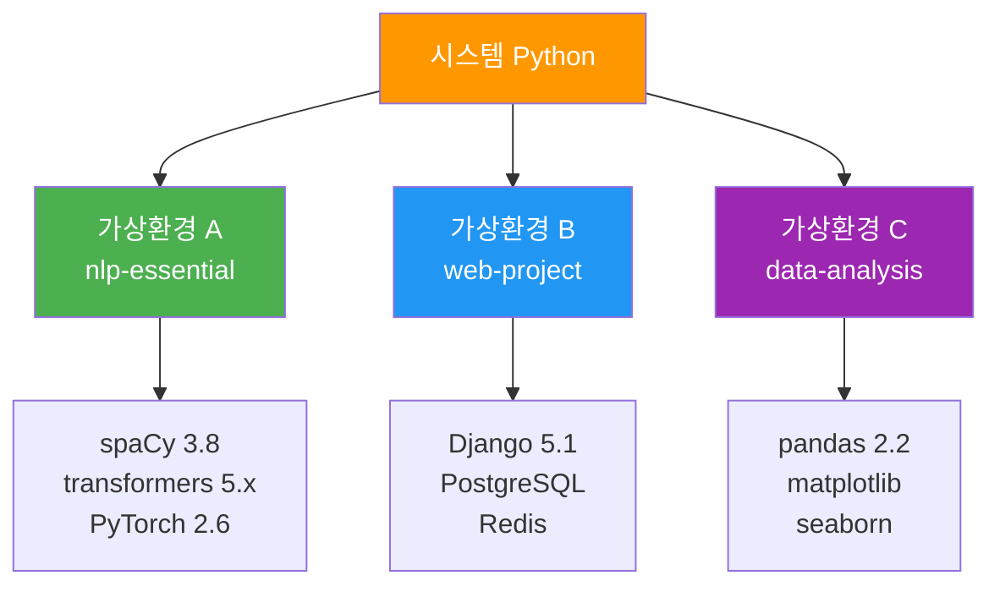
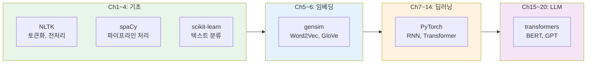
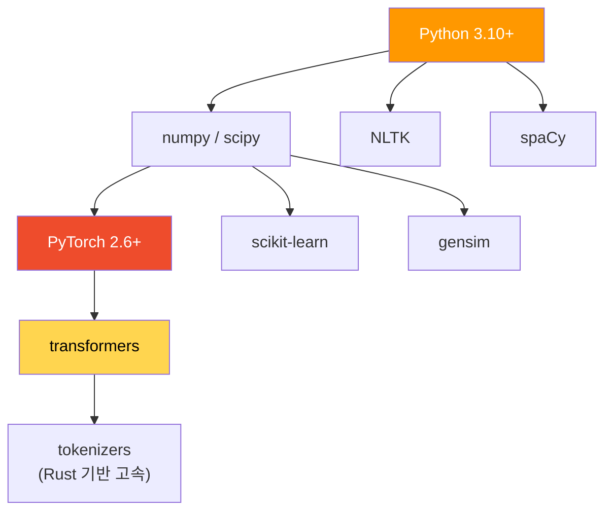
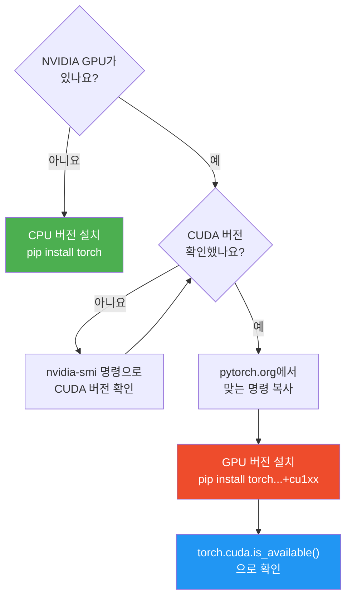
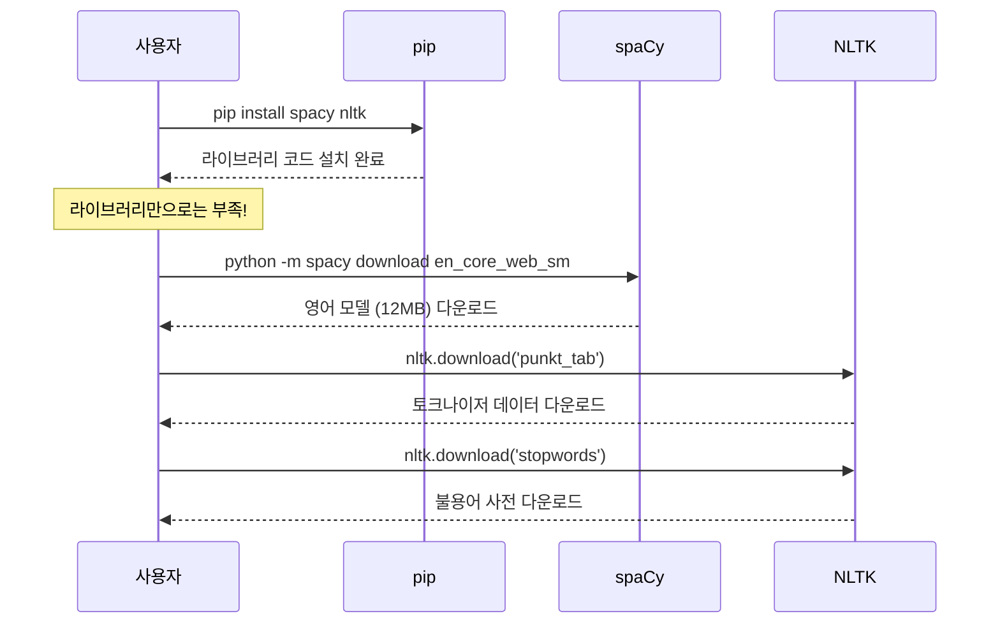

# Python NLP 개발 환경 구축

> Python 가상환경 설정부터 주요 NLP 라이브러리 설치까지, NLP 실습을 위한 완벽한 개발 환경을 구축합니다.

## 개요

이 섹션에서는 NLP 프로젝트를 시작하기 위한 Python 개발 환경을 처음부터 끝까지 구축합니다. 가상환경의 개념과 필요성을 이해하고, 앞으로 이 코스 전체에서 사용할 핵심 라이브러리들을 설치합니다.

**선수 지식**: [자연어 처리란 무엇인가](01-ch1-자연어-처리-개요와-개발-환경-설정/01-01-자연어-처리란-무엇인가.md)에서 배운 NLP의 기본 개념과 [NLP의 발전사](01-ch1-자연어-처리-개요와-개발-환경-설정/02-02-nlp의-발전사-규칙-기반에서-llm까지.md)에서 살펴본 시대별 도구들의 맥락을 알고 있으면 좋습니다.

**학습 목표**:
- Python 가상환경의 필요성을 이해하고 `venv`로 환경을 생성할 수 있다
- NLP 핵심 라이브러리(spaCy, NLTK, scikit-learn, gensim, transformers)를 설치할 수 있다
- 각 라이브러리의 역할과 사용 시점을 구분할 수 있다
- Jupyter Notebook 환경을 설정하고 기본 동작을 확인할 수 있다

## 왜 알아야 할까?

"코드를 작성하는 것보다 환경을 세팅하는 데 더 오래 걸렸어요." — NLP를 처음 시작하는 개발자들이 가장 많이 하는 말이거든요. 라이브러리 버전 충돌, 모델 다운로드 실패, CUDA 설정 오류... 이런 문제들로 반나절을 허비하고 나면 NLP 공부 자체에 대한 의욕이 뚝 떨어지죠.

이 섹션에서는 그런 삽질을 최소화하는 **검증된 환경 구축 방법**을 안내합니다. 가상환경으로 프로젝트를 깔끔하게 격리하고, 이 코스 전체에서 사용할 라이브러리들을 한 번에 설치하는 방법을 배웁니다. 지금 30분 투자하면 앞으로 수십 시간을 아낄 수 있습니다.

## 핵심 개념

### 개념 1: 가상환경 — 프로젝트별 독립 공간

> 💡 **비유**: 가상환경은 **요리사의 개인 조리대**와 같습니다. 한식 요리사와 양식 요리사가 같은 주방을 쓰더라도, 각자의 조리대에는 자기 요리에 필요한 재료와 도구만 놓아두죠. 가상환경도 마찬가지입니다 — 프로젝트마다 독립된 공간에 필요한 라이브러리만 설치하는 거예요.

Python 프로젝트를 진행하다 보면, 프로젝트 A는 `numpy 1.26`이 필요하고 프로젝트 B는 `numpy 2.0`이 필요한 상황이 생깁니다. 시스템 전역에 하나의 Python만 사용하면 이런 **의존성 충돌(dependency conflict)**이 발생하거든요. 가상환경은 이 문제를 깔끔하게 해결합니다.

> 📊 **그림 1**: 가상환경의 격리 구조



Python 3.3부터 표준 라이브러리에 포함된 `venv` 모듈을 사용하면 별도 설치 없이 가상환경을 만들 수 있습니다.

```bash
# 1. 프로젝트 디렉토리 생성
mkdir nlp-essential
cd nlp-essential

# 2. 가상환경 생성 (venv라는 이름의 환경)
python -m venv venv

# 3. 가상환경 활성화
# macOS/Linux:
source venv/bin/activate
# Windows:
# venv\Scripts\activate

# 4. 활성화 확인 — 프롬프트 앞에 (venv) 표시
which python
```

활성화된 상태에서 `pip install`로 설치하는 모든 패키지는 이 가상환경 안에만 설치됩니다. 다른 프로젝트에는 전혀 영향을 주지 않죠.

```bash
# 비활성화하려면
deactivate
```

### 개념 2: NLP 라이브러리 생태계 — 누가 무엇을 담당하는가

> 💡 **비유**: NLP 라이브러리 생태계는 **종합 병원**과 비슷합니다. NLTK는 모든 과를 갖춘 오래된 대학 병원, spaCy는 빠르고 효율적인 전문 클리닉, scikit-learn은 진단(분류)의 달인, gensim은 텍스트 내 숨겨진 패턴을 찾는 영상 의학과, 그리고 transformers는 AI 시대의 로봇 수술 팀이라고 할 수 있죠.

이 코스에서는 NLP의 기초부터 LLM까지 다루기 때문에, 각 단계에 맞는 라이브러리를 사용합니다. 아래 다이어그램은 코스 진행에 따라 어떤 라이브러리를 주로 사용하게 되는지를 보여줍니다.

> 📊 **그림 2**: 코스 진행에 따른 주요 라이브러리 사용 로드맵



각 라이브러리의 역할을 좀 더 구체적으로 살펴보겠습니다.

| 라이브러리 | 주요 역할 | 사용 챕터 | 현재 버전 |
|-----------|----------|----------|----------|
| **NLTK** | 토큰화, 불용어, 어간 추출, 교육용 코퍼스 | Ch1~4 | 3.9.x |
| **spaCy** | 산업용 NLP 파이프라인 (토큰화, 개체명 인식, 의존 구문 분석) | Ch1~4 | 3.8.x |
| **scikit-learn** | 텍스트 특징 추출(TF-IDF), 전통적 분류기(Naive Bayes, SVM) | Ch3~4 | 1.8.x |
| **gensim** | Word2Vec, FastText, 토픽 모델링 | Ch5~6 | 4.4.x |
| **PyTorch** | 신경망, RNN, LSTM, Transformer 구현 | Ch7~14 | 2.6.x |
| **transformers** | 사전학습 모델(BERT, GPT) 로드, 파인튜닝, 추론 | Ch15~20 | 5.x |

### 개념 3: 라이브러리 설치 — 올바른 순서와 방법

> 💡 **비유**: 라이브러리 설치는 **가구 조립**과 같습니다. 설명서를 무시하고 아무 순서로 나사를 끼우면 나중에 다시 뜯어야 하듯이, 의존성이 있는 패키지는 올바른 순서로 설치해야 합니다. 특히 PyTorch는 "기반 프레임(뼈대)"이고, 나머지 라이브러리는 그 위에 얹는 "서랍과 선반"이거든요.

> 📊 **그림 3**: 라이브러리 의존성 계층 구조



설치는 아래 순서를 추천합니다. 먼저 기반이 되는 PyTorch를 설치하고, 그 위에 나머지를 쌓아 올리는 방식이죠.

```bash
# 0. pip 업그레이드 (항상 먼저!)
pip install -U pip setuptools wheel

# 1. PyTorch 설치 (CPU 버전 — GPU 설정은 아래 별도 안내)
pip install torch torchvision torchaudio

# 2. NLP 기초 라이브러리
pip install nltk spacy

# 3. 머신러닝 / 임베딩
pip install scikit-learn gensim

# 4. Hugging Face transformers (PyTorch 백엔드)
pip install "transformers[torch]"

# 5. 데이터 분석 및 시각화
pip install pandas matplotlib seaborn jupyter

# 6. 유틸리티
pip install tqdm datasets
```

> ⚠️ **흔한 오해**: "GPU가 없으면 딥러닝을 못 한다"고 생각하시는 분이 많은데요, 이 코스의 실습 대부분은 **CPU만으로 충분합니다**. GPU는 대규모 모델 학습 시에만 필요하고, Ch7 이후 일부 실습에서 선택적으로 사용합니다. 지금은 CPU 버전으로 설치하고, 나중에 필요할 때 GPU 버전으로 교체하면 됩니다.

#### GPU가 있다면? — CUDA 설정 가이드 (선택 사항)

NVIDIA GPU를 가지고 계신 분은 지금 GPU 버전을 설치해두면 Ch7(딥러닝) 이후에 더 빠르게 실습할 수 있습니다. 다만 **지금 당장 필수는 아니므로**, CPU 버전으로 먼저 진행하고 나중에 전환해도 괜찮습니다.

> 📊 **그림 3-1**: GPU 버전 PyTorch 설치 판단 흐름



**Step 1: CUDA 버전 확인**

```bash
# NVIDIA 드라이버와 지원 CUDA 버전 확인
nvidia-smi
```

```console
+-----------------------------------------------------------------------------+
| NVIDIA-SMI 550.54.15    Driver Version: 550.54.15    CUDA Version: 12.4     |
+-----------------------------------------------------------------------------+
```

출력의 오른쪽 상단에서 `CUDA Version`을 확인하세요. 이것은 드라이버가 **지원하는 최대 CUDA 버전**입니다.

**Step 2: PyTorch GPU 버전 설치**

[PyTorch 공식 설치 페이지](https://pytorch.org/get-started/locally/)에 접속하면, OS/패키지 관리자/CUDA 버전을 선택하여 정확한 설치 명령을 자동으로 생성해줍니다. 예를 들어 CUDA 12.4 환경이라면:

```bash
# CUDA 12.4 예시 — 반드시 pytorch.org에서 자신의 환경에 맞는 명령을 확인하세요!
pip install torch torchvision torchaudio --index-url https://download.pytorch.org/whl/cu124
```

**Step 3: GPU 인식 확인**

```python
import torch
print(f"CUDA 사용 가능: {torch.cuda.is_available()}")
print(f"GPU 이름: {torch.cuda.get_device_name(0) if torch.cuda.is_available() else 'N/A'}")
```

> 🔥 **실무 팁**: `nvidia-smi`에서 보이는 CUDA 버전과 PyTorch가 요구하는 CUDA 버전이 정확히 일치할 필요는 없습니다. `nvidia-smi`의 버전은 드라이버가 지원하는 **상한선**이고, PyTorch는 그보다 낮은 버전의 CUDA 런타임을 자체 내장합니다. 예컨대 `nvidia-smi`가 12.4를 표시해도 CUDA 12.1용 PyTorch를 설치하면 정상 작동합니다.

**macOS Apple Silicon (M1/M2/M3/M4) 사용자**: NVIDIA GPU가 아니므로 CUDA는 해당 없습니다. 대신 PyTorch가 **MPS(Metal Performance Shaders)** 백엔드를 지원하므로, 기본 `pip install torch`만으로 GPU 가속을 사용할 수 있습니다. `torch.backends.mps.is_available()`로 확인해보세요.

### 개념 4: 모델과 데이터 다운로드

라이브러리 설치만으로는 부족합니다. spaCy와 NLTK는 **별도의 모델/데이터 다운로드**가 필요하거든요.

> 📊 **그림 4**: 라이브러리 설치 후 추가 다운로드 흐름



```bash
# spaCy 영어 모델 다운로드 (소형: 12MB)
python -m spacy download en_core_web_sm

# spaCy 한국어는 현재 공식 모델이 제한적
# 한국어 처리에는 별도 라이브러리(KoNLPy 등)를 사용하기도 합니다
```

```python
# NLTK 데이터 다운로드 (Python 코드에서)
import nltk

# 필수 데이터만 선택 다운로드
nltk.download('punkt_tab')      # 토크나이저
nltk.download('stopwords')      # 불용어
nltk.download('wordnet')        # 표제어 추출용
nltk.download('averaged_perceptron_tagger_eng')  # 품사 태깅
```

### 개념 5: Jupyter Notebook — 인터랙티브 실습 환경

> 💡 **비유**: Jupyter Notebook은 **실험 노트**와 같습니다. 과학자가 실험 절차, 관찰 결과, 분석을 한 노트에 기록하듯이, 코드와 실행 결과, 설명을 한 문서에 담을 수 있죠. NLP에서는 전처리 결과를 바로 확인하고, 모델 출력을 시각화하는 데 이보다 좋은 환경이 없습니다.

```bash
# Jupyter 실행
jupyter notebook

# 또는 JupyterLab (더 현대적인 인터페이스)
pip install jupyterlab
jupyter lab
```

Jupyter Notebook은 셀 단위로 코드를 실행하고 결과를 즉시 확인할 수 있어서, NLP 실습에 특히 적합합니다. 토큰화 결과를 한 줄씩 확인하거나, 임베딩 벡터를 시각화하거나, 모델 예측을 바로 테스트할 수 있거든요.

## 실습: 직접 해보기

환경 구축이 제대로 되었는지 확인하는 **검증 스크립트**를 만들어봅시다. 이 코드를 실행해서 모든 라이브러리가 정상적으로 설치되었는지 한 번에 확인할 수 있습니다.

```run:python
import sys

# Python 버전 확인
print(f"Python 버전: {sys.version}")
print(f"Python 경로: {sys.executable}")
print()

# 핵심 라이브러리 임포트 및 버전 확인
libraries = {}

# 1. NumPy — 수치 연산의 기반
import numpy as np
libraries['numpy'] = np.__version__

# 2. PyTorch — 딥러닝 프레임워크
import torch
libraries['torch'] = torch.__version__

# 3. NLTK — 자연어 처리 교육용 도구
import nltk
libraries['nltk'] = nltk.__version__

# 4. spaCy — 산업용 NLP 파이프라인
import spacy
libraries['spacy'] = spacy.__version__

# 5. scikit-learn — 머신러닝 분류기
import sklearn
libraries['scikit-learn'] = sklearn.__version__

# 6. gensim — 워드 임베딩
import gensim
libraries['gensim'] = gensim.__version__

# 7. transformers — 사전학습 모델
import transformers
libraries['transformers'] = transformers.__version__

# 결과 출력
print("=" * 45)
print("  NLP Essential 개발 환경 점검 결과")
print("=" * 45)
for name, ver in libraries.items():
    status = "✅"
    print(f"  {status} {name:20s} v{ver}")

print("=" * 45)
print(f"  총 {len(libraries)}개 라이브러리 확인 완료!")
print("=" * 45)
```

```output
Python 버전: 3.11.9 (main, Apr  2 2024, 08:25:04) [Clang 15.0.0 (clang-1500.3.9.4)]
Python 경로: /Users/user/nlp-essential/venv/bin/python

=============================================
  NLP Essential 개발 환경 점검 결과
=============================================
  ✅ numpy                v2.1.3
  ✅ torch                v2.6.0
  ✅ nltk                 v3.9.1
  ✅ spacy                v3.8.3
  ✅ scikit-learn          v1.8.0
  ✅ gensim               v4.4.0
  ✅ transformers          v5.0.0
=============================================
  총 7개 라이브러리 확인 완료!
=============================================
```

이어서 각 라이브러리가 실제로 동작하는지 간단한 기능 테스트를 해봅시다.

```run:python
# spaCy 동작 확인 — 영어 모델 로드 및 토큰화
import spacy

nlp = spacy.load("en_core_web_sm")
doc = nlp("Natural Language Processing is fascinating!")

print("spaCy 토큰화 결과:")
for token in doc:
    # 각 토큰의 텍스트, 품사, 의존 관계를 출력
    print(f"  {token.text:15s} → 품사: {token.pos_:6s} | 의존: {token.dep_}")
```

```output
spaCy 토큰화 결과:
  Natural         → 품사: ADJ    | 의존: amod
  Language        → 품사: PROPN  | 의존: compound
  Processing      → 품사: PROPN  | 의존: nsubj
  is              → 품사: AUX    | 의존: ROOT
  fascinating     → 품사: ADJ    | 의존: acomp
  !               → 품사: PUNCT  | 의존: punct
```

```run:python
# NLTK 동작 확인 — 불용어 목록 활용
import nltk

# 영어 불용어 목록
stop_words = set(nltk.corpus.stopwords.words('english'))
print(f"영어 불용어 수: {len(stop_words)}개")
print(f"불용어 예시: {sorted(list(stop_words))[:10]}")
print()

# 간단한 불용어 제거 실습
sentence = "This is a simple example of stopword removal"
words = sentence.lower().split()
filtered = [w for w in words if w not in stop_words]
print(f"원문: {sentence}")
print(f"불용어 제거: {' '.join(filtered)}")
```

```output
영어 불용어 수: 179개
불용어 예시: ['a', 'about', 'above', 'after', 'again', 'against', 'ain', 'all', 'am', 'an']

원문: This is a simple example of stopword removal
불용어 제거: simple example stopword removal
```

마지막으로, 나중에 환경을 재현할 수 있도록 설치된 패키지 목록을 저장하는 방법입니다.

```bash
# 현재 환경의 패키지를 requirements.txt로 저장
pip freeze > requirements.txt

# 다른 환경에서 동일하게 설치하려면
pip install -r requirements.txt
```

## 더 깊이 알아보기

### Jupyter의 탄생 — 물리학자의 노트에서 시작된 혁명

Jupyter Notebook의 역사는 흥미롭습니다. 2001년, 콜롬비아 출신 물리학자 **페르난도 페레스(Fernando Pérez)**는 박사과정 중 연구 코드를 인터랙티브하게 실행할 도구가 필요했어요. 그래서 그가 만든 것이 **IPython** — 파이썬 인터랙티브 셸의 강화 버전이었습니다.

이 작은 프로젝트가 2014년에 **Project Jupyter**로 발전했는데, 이름이 재미있습니다. **Ju**lia + **Py**thon + **R** — 세 개의 과학 컴퓨팅 언어 이름을 합친 거예요. 동시에 갈릴레오 갈릴레이가 목성(Jupiter)의 위성을 발견하며 쓴 실험 노트에 대한 경의이기도 합니다. 과학자의 실험 노트를 디지털로 재현하겠다는 비전이 이름에 담겨 있는 셈이죠.

### virtualenv에서 venv로 — 표준이 된 커뮤니티 도구

Python 가상환경의 역사도 알아둘 만합니다. 원래 가상환경은 `virtualenv`라는 서드파티 패키지로 시작했는데, 이 도구가 너무 유용해서 Python 3.3부터 `venv`라는 이름으로 **표준 라이브러리에 포함**되었습니다. 커뮤니티의 좋은 도구가 공식으로 승격된 드문 사례이죠. 다만, `virtualenv`는 여전히 더 많은 기능을 제공하기 때문에 대규모 프로젝트에서는 별도로 사용되기도 합니다.

## 흔한 오해와 팁

> ⚠️ **흔한 오해**: "Anaconda를 설치하면 모든 게 해결된다"고 생각하시는 분이 계시는데, Anaconda는 편리하지만 **용량이 수 GB에 달하고** conda와 pip의 패키지 관리가 충돌하는 경우가 종종 있습니다. 이 코스에서는 더 가볍고 범용적인 `venv + pip` 조합을 사용합니다. Anaconda에 익숙하시다면 그대로 사용해도 됩니다만, 패키지 설치 시 `conda install`과 `pip install`을 혼용하지 않도록 주의하세요.

> 💡 **알고 계셨나요?**: spaCy의 이름은 "space"에서 온 것이 아닙니다. 개발사 **Explosion AI**의 공동 창업자 **매튜 혼니벌(Matthew Honnibal)**이 만든 이 라이브러리는 "spacious(넓은)"에서 영감을 받았다고 해요. NLTK가 2001년부터 학술 중심으로 발전해온 반면, spaCy는 2015년에 **산업 현장에서 바로 쓸 수 있는 NLP**를 목표로 탄생했습니다. 그래서 속도와 정확도 모두에서 뛰어난 성능을 보여주죠.

> 🔥 **실무 팁**: `requirements.txt`를 관리할 때, `pip freeze`의 전체 출력 대신 **직접 설치한 핵심 패키지만** 기록하는 방식을 추천합니다. 의존성으로 자동 설치된 수십 개의 하위 패키지까지 버전을 고정하면 오히려 다른 환경에서 호환성 문제가 생길 수 있거든요.

```
# requirements.txt — 핵심 패키지만 기록
torch>=2.4
spacy>=3.8
nltk>=3.9
scikit-learn>=1.8
gensim>=4.4
transformers>=5.0
jupyter
matplotlib
pandas
tqdm
datasets
```

## 핵심 정리

| 개념 | 설명 |
|------|------|
| **가상환경 (venv)** | 프로젝트별 독립적인 Python 패키지 공간. `python -m venv venv`로 생성 |
| **NLTK** | 교육용 NLP 라이브러리. 풍부한 코퍼스와 전처리 도구. 별도 데이터 다운로드 필요 |
| **spaCy** | 산업용 NLP 파이프라인. 속도와 정확도에 최적화. 별도 모델 다운로드 필요 |
| **scikit-learn** | 전통적 머신러닝. TF-IDF 벡터화, Naive Bayes, SVM 등 텍스트 분류에 활용 |
| **gensim** | 워드 임베딩(Word2Vec, FastText) 학습 및 토픽 모델링 전문 |
| **transformers** | Hugging Face의 사전학습 모델 허브. BERT, GPT 등 최신 모델 활용 |
| **PyTorch** | 딥러닝 프레임워크. RNN부터 Transformer까지 직접 구현할 때 사용 |
| **Jupyter Notebook** | 코드 + 실행 결과 + 설명을 한 문서에 담는 인터랙티브 환경 |
| **requirements.txt** | 패키지 목록 기록 파일. `pip freeze`로 생성, `pip install -r`로 재현 |
| **CUDA / GPU 설정** | Ch7 이후 선택 사항. `nvidia-smi`로 확인 후 pytorch.org에서 맞는 버전 설치 |

## 다음 섹션 미리보기

개발 환경이 준비되었으니, 다음 섹션 [spaCy와 NLTK 첫 걸음](01-ch1-자연어-처리-개요와-개발-환경-설정/04-04-spacy와-nltk-첫-걸음.md)에서는 지금 설치한 spaCy와 NLTK를 본격적으로 사용해봅니다. 토큰화, 품사 태깅, 개체명 인식 등 NLP의 기본 작업을 두 라이브러리로 직접 수행하면서, 각 도구의 장단점을 체감하게 될 거예요.

## 참고 자료

- [spaCy 설치 및 시작 가이드](https://spacy.io/usage) - 공식 설치 문서. OS별, 환경별 설치 옵션을 상세히 안내합니다
- [NLTK 설치 가이드](https://www.nltk.org/install.html) - 공식 설치 문서와 데이터 다운로드 방법 안내
- [Hugging Face Transformers 설치](https://huggingface.co/docs/transformers/en/installation) - transformers 라이브러리 설치 및 PyTorch/TensorFlow 백엔드 설정 가이드
- [PyTorch 공식 설치 페이지](https://pytorch.org/get-started/locally/) - 자신의 OS, CUDA 버전에 맞는 정확한 설치 명령을 생성해주는 인터랙티브 도구
- [scikit-learn 설치 가이드](https://scikit-learn.org/stable/install.html) - 다양한 환경에서의 설치 방법과 트러블슈팅 안내
- [Gensim 공식 문서](https://radimrehurek.com/gensim/) - gensim 설치 및 Word2Vec, FastText 사용법
- [CUDA Toolkit 아카이브](https://developer.nvidia.com/cuda-toolkit-archive) - NVIDIA CUDA Toolkit 버전별 다운로드 및 호환성 정보