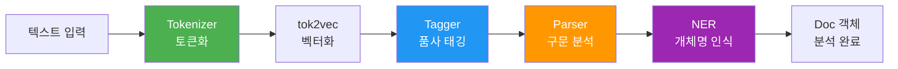
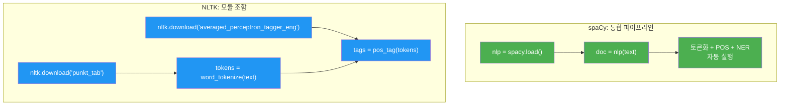
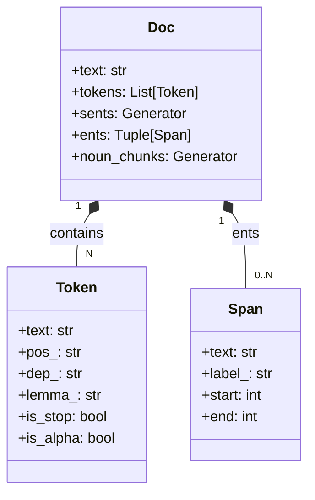
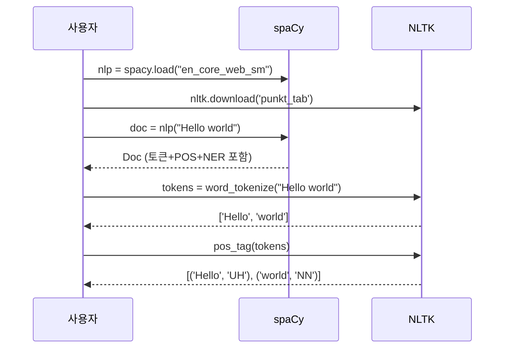
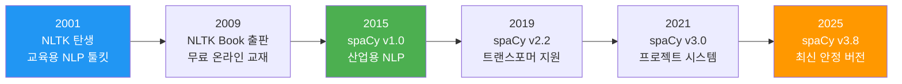

# spaCy와 NLTK 첫 걸음

> 두 대표 NLP 라이브러리의 구조를 이해하고, 간단한 텍스트 분석을 직접 실습합니다

## 개요

이 섹션에서는 [Python NLP 개발 환경 구축](01-ch1-자연어-처리-개요와-개발-환경-설정/03-03-python-nlp-개발-환경-구축.md)에서 설치한 spaCy와 NLTK를 본격적으로 사용해봅니다. 두 라이브러리의 설계 철학 차이를 이해하고, 같은 문장을 각각으로 분석하며 파이프라인의 기본 동작을 체험합니다.

**선수 지식**: Python 기본 문법, pip을 통한 라이브러리 설치 (이전 섹션에서 다룸)
**학습 목표**:
- spaCy의 파이프라인 아키텍처를 설명할 수 있다
- NLTK의 데이터 다운로드 방식과 모듈 구조를 이해한다
- 두 라이브러리로 텍스트를 분석하고 결과 객체를 탐색할 수 있다
- spaCy와 NLTK의 차이점을 비교하고 용도에 맞게 선택할 수 있다

## 왜 알아야 할까?

NLP를 공부하다 보면 가장 먼저 마주치는 질문이 있습니다. "spaCy를 쓸까, NLTK를 쓸까?" 사실 이 질문은 "망치를 쓸까, 드라이버를 쓸까?"와 비슷합니다 — 용도가 다르거든요.

NLTK는 NLP의 **교과서**입니다. 다양한 알고리즘과 코퍼스를 탐험하며 개념을 깊이 이해하기에 최적이죠. 반면 spaCy는 NLP의 **공장 라인**입니다. 빠르고 정확하게 텍스트를 처리하는 데 특화되어 있어요. 이 코스에서는 두 도구 모두 활용합니다 — NLTK로 개념을 배우고, spaCy로 실전에 적용하는 식이죠.

[자연어 처리란 무엇인가](01-ch1-자연어-처리-개요와-개발-환경-설정/01-01-자연어-처리란-무엇인가.md)에서 배운 NLP 파이프라인(토큰화 → 정규화 → 특징 추출 → 모델 → 출력)을 이제 실제 라이브러리로 실현하는 겁니다. 이 섹션에서는 라이브러리의 **구조와 사용법**에 집중하고, 토큰화의 세부 기법과 비교는 다음 챕터에서 본격적으로 다룹니다.

## 핵심 개념

### 개념 1: spaCy의 파이프라인 아키텍처

> 💡 **비유**: spaCy는 자동차 조립 공장의 **컨베이어 벨트**와 같습니다. 원자재(텍스트)가 벨트에 올라가면 각 작업장(토크나이저, 태거, 파서, NER)을 순서대로 거치며 완성품(분석된 Doc 객체)이 나옵니다. 중간에 불필요한 작업장을 건너뛸 수도 있고, 커스텀 작업장을 추가할 수도 있죠.

spaCy의 핵심은 **파이프라인(Pipeline)** 구조입니다. `nlp` 객체에 텍스트를 넣으면, 내부적으로 여러 컴포넌트가 순차적으로 실행됩니다.

> 📊 **그림 1**: spaCy 파이프라인 처리 흐름



각 컴포넌트의 역할을 정리해볼까요?

| 컴포넌트 | 역할 | 출력 예시 |
|----------|------|-----------|
| **Tokenizer** | 텍스트를 토큰으로 분할 | `["나는", "학생", "입니다"]` |
| **tok2vec** | 토큰을 벡터로 변환 (공유) | 내부 벡터 표현 |
| **Tagger** | 각 토큰에 품사(POS) 부여 | `NOUN`, `VERB`, `ADJ` |
| **Parser** | 토큰 간 의존 관계 분석 | 주어-동사-목적어 관계 |
| **NER** | 고유명사/엔티티 인식 | 사람, 장소, 조직 |
| **Lemmatizer** | 기본형(표제어) 추출 | running → run |

spaCy에서 파이프라인을 사용하는 기본 코드를 살펴봅시다:

```run:python
import spacy

# 영어 모델 로드 (소형 모델)
nlp = spacy.load("en_core_web_sm")

# 텍스트 처리 — 파이프라인이 자동 실행됨
doc = nlp("Apple is looking at buying U.K. startup for $1 billion")

# 파이프라인 컴포넌트 확인
print("파이프라인 컴포넌트:", nlp.pipe_names)

# 토큰별 분석 결과
for token in doc:
    print(f"{token.text:12s} | POS: {token.pos_:6s} | DEP: {token.dep_:10s}")
```

```output
파이프라인 컴포넌트: ['tok2vec', 'tagger', 'parser', 'attribute_ruler', 'lemmatizer', 'ner']
Apple        | POS: PROPN  | DEP: nsubj     
is           | POS: AUX    | DEP: aux       
looking      | POS: VERB   | DEP: ROOT      
at           | POS: ADP    | DEP: prep      
buying       | POS: VERB   | DEP: pcomp     
U.K.         | POS: PROPN  | DEP: dobj      
startup      | POS: NOUN   | DEP: dobj      
for          | POS: ADP    | DEP: prep      
$            | POS: SYM    | DEP: quantmod  
1            | POS: NUM    | DEP: compound  
billion      | POS: NUM    | DEP: pobj      
```

`nlp()` 한 번 호출로 토큰화, 품사 태깅, 구문 분석, 개체명 인식이 **한꺼번에** 처리된다는 점이 spaCy의 강점입니다. 결과는 모두 `Doc` 객체에 담겨 있어서 필요한 정보를 속성(attribute)으로 바로 꺼내 쓸 수 있죠.

> ⚠️ **흔한 오해**: "spaCy 모델을 로드하면 파이프라인의 모든 컴포넌트가 항상 실행된다"고 생각하기 쉽지만, `nlp.select_pipes()`나 `nlp.disable_pipes()`로 특정 컴포넌트를 끄고 속도를 높일 수 있습니다. 토큰화만 필요하다면 나머지를 비활성화하세요!

### 개념 2: NLTK의 모듈 구조와 데이터 다운로드

> 💡 **비유**: NLTK는 거대한 **도서관**에 비유할 수 있습니다. 도서관에 들어가면(import nltk) 건물 자체는 있지만, 실제 책(데이터, 코퍼스, 모델)은 별도로 대출 신청(nltk.download)해야 읽을 수 있어요. 필요한 책만 골라서 빌리는 셈이죠.

NLTK는 spaCy와 달리 하나의 통합 파이프라인이 아니라, **독립적인 모듈들의 모음**입니다. 토큰화기, 태거, 파서 등을 개별적으로 불러서 조합하는 방식이에요.

> 📊 **그림 2**: spaCy vs NLTK 설계 철학 비교



NLTK를 처음 사용할 때 가장 중요한 단계는 **데이터 다운로드**입니다:

```python
import nltk

# 필수 데이터 패키지 다운로드
nltk.download('punkt_tab')           # 토큰화 모델
nltk.download('averaged_perceptron_tagger_eng')  # 품사 태거
nltk.download('wordnet')             # 어휘 데이터베이스
nltk.download('stopwords')           # 불용어 리스트
```

왜 별도 다운로드가 필요할까요? NLTK는 50개 이상의 코퍼스와 다양한 모델을 제공하는데, 이걸 전부 설치에 포함하면 용량이 수 GB에 달합니다. 그래서 필요한 것만 골라 받는 설계를 택한 거죠.

이제 NLTK로 간단한 텍스트 분석을 해봅시다:

```run:python
import nltk
from nltk.tokenize import word_tokenize, sent_tokenize
from nltk import pos_tag

text = "Apple is looking at buying U.K. startup for $1 billion."

# 문장 분리
sentences = sent_tokenize(text)
print("문장 분리:", sentences)

# 단어 토큰화 + 품사 태깅
tokens = word_tokenize(text)
tagged = pos_tag(tokens)
print("품사 태깅:", tagged)
```

```output
문장 분리: ['Apple is looking at buying U.K. startup for $1 billion.']
품사 태깅: [('Apple', 'NNP'), ('is', 'VBZ'), ('looking', 'VBG'), ('at', 'IN'), ('buying', 'VBG'), ('U.K.', 'NNP'), ('startup', 'NN'), ('for', 'IN'), ('$', '$'), ('1', 'CD'), ('billion', 'CD'), ('.', '.')]
```

NLTK의 품사 태그가 spaCy와 다른 것을 눈치채셨나요? NLTK는 Penn Treebank 태그셋(`NNP`, `VBZ`, `VBG` 등)을 사용하고, spaCy는 Universal POS 태그셋(`PROPN`, `AUX`, `VERB` 등)을 기본으로 사용합니다. 태그셋의 차이와 토큰화 방식의 세부적인 비교는 [Ch2의 토큰화 섹션](02-ch2-텍스트-전처리의-기초/01-01-토큰화-tokenization-의-이해.md)에서 본격적으로 다루겠습니다.

> 💡 **알고 계셨나요?**: Penn Treebank 태그셋은 1990년대 펜실베이니아 대학교의 Treebank 프로젝트에서 만들어졌습니다. 영어에 대해 36개의 품사 태그와 12개의 구 수준 태그를 정의했는데, 30년이 지난 지금도 NLTK의 기본 태그셋으로 사용되고 있어요. 반면 Universal POS 태그셋은 언어에 독립적인 17개 태그로 구성되어, 다국어 NLP에 더 적합합니다.

### 개념 3: Doc, Token, Span — spaCy의 핵심 객체

> 💡 **비유**: spaCy의 결과물을 책에 비유하면, `Doc`은 **책 전체**, `Token`은 **개별 단어**, `Span`은 **형광펜으로 밑줄 친 구절**입니다. 책(Doc)에서 단어(Token)를 하나씩 읽을 수도 있고, 중요한 구절(Span)을 잘라서 따로 볼 수도 있죠.

spaCy에서 텍스트를 처리하면 `Doc` 객체가 반환됩니다. 이 객체를 통해 다양한 언어적 정보에 접근할 수 있어요.

> 📊 **그림 3**: spaCy 핵심 객체의 계층 구조



```python
import spacy
nlp = spacy.load("en_core_web_sm")
doc = nlp("Steve Jobs founded Apple in California.")

# Token 속성 탐색
for token in doc:
    print(f"{token.text:12s} | 표제어: {token.lemma_:10s} | "
          f"불용어: {token.is_stop} | 알파벳: {token.is_alpha}")

# 개체명(Named Entity) 인식
print("\n--- 개체명 ---")
for ent in doc.ents:
    print(f"{ent.text:15s} → {ent.label_:10s} ({spacy.explain(ent.label_)})")

# 명사구(Noun Chunks) 추출
print("\n--- 명사구 ---")
for chunk in doc.noun_chunks:
    print(f"{chunk.text:20s} ← 루트: {chunk.root.text}")
```

`spacy.explain()` 함수는 약어의 의미를 알려주는 편리한 도우미입니다. `PROPN`이 뭔지 기억이 안 날 때 `spacy.explain("PROPN")`이라고 하면 "proper noun"이라고 친절하게 알려주죠.

### 개념 4: 동일 작업, 다른 접근 — 두 라이브러리 비교

두 라이브러리의 차이를 한눈에 비교해볼까요? 여기서는 라이브러리의 **설계 관점** 차이에 집중합니다.

> 📊 **그림 4**: 동일 NLP 작업의 라이브러리별 처리 흐름



| 기준 | spaCy | NLTK |
|------|-------|------|
| **설계 철학** | 산업용 — 빠르고 정확 | 교육용 — 다양하고 유연 |
| **파이프라인** | 통합 (한 번 호출) | 모듈 조합 (단계별 호출) |
| **속도** | 매우 빠름 (Cython 기반) | 상대적으로 느림 (순수 Python) |
| **모델** | 사전학습 파이프라인 | 개별 모델/코퍼스 다운로드 |
| **POS 태그** | Universal POS 기본 | Penn Treebank 기본 |
| **API 스타일** | 객체 지향 (doc.ents) | 함수형 (pos_tag(tokens)) |
| **강점** | 프로덕션 배포, 속도 | 학습, 연구, 코퍼스 접근 |
| **코퍼스** | 제한적 | 50+ 코퍼스 내장 |

> 🔥 **실무 팁**: 실무에서는 spaCy를 메인으로 쓰되, NLTK의 코퍼스(Brown Corpus, WordNet 등)가 필요할 때 NLTK를 보조적으로 함께 사용하는 패턴이 가장 흔합니다. 두 라이브러리는 경쟁 관계가 아니라 **상호 보완** 관계거든요.

## 실습: 직접 해보기

이제 영어 텍스트를 두 라이브러리로 분석하는 완전한 실습을 해봅시다. 이 실습은 라이브러리의 **사용법과 객체 구조 탐색**에 초점을 맞춥니다. 토큰화 알고리즘 자체의 동작 방식이나 다양한 토크나이저 비교는 [토큰화(Tokenization)의 이해](02-ch2-텍스트-전처리의-기초/01-01-토큰화-tokenization-의-이해.md)에서 집중적으로 다룰 예정이니, 여기서는 "도구를 능숙하게 다루는 법"에 집중하세요.

```python
# ============================================
# 실습 1: spaCy로 영어 텍스트 완전 분석
# ============================================
import spacy

nlp = spacy.load("en_core_web_sm")

text = """Natural language processing (NLP) is a subfield of artificial intelligence. 
It was founded in the 1950s at Georgetown University. 
Today, companies like Google and OpenAI use NLP in their products."""

doc = nlp(text)

# 1. 문장 분리
print("=" * 50)
print("📝 문장 분리")
print("=" * 50)
for i, sent in enumerate(doc.sents, 1):
    print(f"  문장 {i}: {sent.text.strip()}")

# 2. 토큰 분석 (첫 번째 문장만)
print("\n" + "=" * 50)
print("🔍 토큰 분석 (첫 문장)")
print("=" * 50)
first_sent = list(doc.sents)[0]
print(f"{'토큰':<15} {'품사':<8} {'세부품사':<6} {'표제어':<15} {'불용어'}")
print("-" * 60)
for token in first_sent:
    print(f"{token.text:<15} {token.pos_:<8} {token.tag_:<6} "
          f"{token.lemma_:<15} {token.is_stop}")

# 3. 개체명 인식
print("\n" + "=" * 50)
print("🏷️ 개체명 인식")
print("=" * 50)
for ent in doc.ents:
    print(f"  {ent.text:<25} → {ent.label_:<10} "
          f"({spacy.explain(ent.label_)})")

# 4. 불필요한 컴포넌트 비활성화로 속도 향상
print("\n" + "=" * 50)
print("⚡ 파이프라인 최적화 (필요한 컴포넌트만 활성화)")
print("=" * 50)
# parser와 ner를 비활성화하면 2-3배 빨라짐
with nlp.select_pipes(enable=["tok2vec", "tagger"]):
    fast_doc = nlp("This is a quick tokenization test.")
    print(f"  활성 파이프라인: {nlp.pipe_names}")
    for token in fast_doc:
        print(f"  {token.text:<20} → {token.pos_}")
```

```python
# ============================================
# 실습 2: NLTK로 동일 작업 수행
# ============================================
import nltk
from nltk.tokenize import word_tokenize, sent_tokenize
from nltk import pos_tag
from nltk.chunk import ne_chunk

# 필요한 데이터가 없으면 다운로드
for pkg in ['punkt_tab', 'averaged_perceptron_tagger_eng', 
            'maxent_ne_chunker_tab', 'words']:
    nltk.download(pkg, quiet=True)

text = """Natural language processing (NLP) is a subfield of artificial intelligence. 
It was founded in the 1950s at Georgetown University. 
Today, companies like Google and OpenAI use NLP in their products."""

# 1. 문장 분리
sentences = sent_tokenize(text)
print("=" * 50)
print("📝 NLTK 문장 분리")
print("=" * 50)
for i, sent in enumerate(sentences, 1):
    print(f"  문장 {i}: {sent.strip()}")

# 2. 품사 태깅
print("\n" + "=" * 50)
print("🔍 NLTK 품사 태깅 (첫 문장)")
print("=" * 50)
tokens = word_tokenize(sentences[0])
tagged = pos_tag(tokens)
print(f"{'토큰':<20} {'Penn Treebank 태그'}")
print("-" * 40)
for word, tag in tagged:
    print(f"{word:<20} {tag}")

# 3. 개체명 인식 (NLTK 방식)
print("\n" + "=" * 50)
print("🏷️ NLTK 개체명 인식")
print("=" * 50)
for sent in sentences:
    tokens = word_tokenize(sent)
    tagged = pos_tag(tokens)
    tree = ne_chunk(tagged)  # 개체명 청킹
    for subtree in tree:
        if hasattr(subtree, 'label'):  # 개체명인 경우
            entity = " ".join(word for word, tag in subtree)
            print(f"  {entity:<25} → {subtree.label()}")
```

```python
# ============================================
# 실습 3: 두 라이브러리의 분석 결과 구조 비교
# ============================================
import spacy
from nltk.tokenize import word_tokenize
from nltk import pos_tag

nlp = spacy.load("en_core_web_sm")
test_text = "The quick brown fox jumps over the lazy dog."

# spaCy 결과 — Doc 객체에서 속성으로 접근
spacy_doc = nlp(test_text)
spacy_result = [(t.text, t.pos_, t.tag_) for t in spacy_doc]

# NLTK 결과 — 함수 호출 체이닝
nltk_tokens = word_tokenize(test_text)
nltk_result = pos_tag(nltk_tokens)

# 나란히 비교 (API 스타일의 차이에 주목!)
print(f"{'토큰':<10} {'spaCy POS':<10} {'spaCy TAG':<8} {'NLTK TAG'}")
print("-" * 45)
for (text, pos, tag), (_, nltk_tag) in zip(spacy_result, nltk_result):
    match = "✓" if tag == nltk_tag else "≠"
    print(f"{text:<10} {pos:<10} {tag:<8} {nltk_tag:<8} {match}")
```

## 더 깊이 알아보기

### NLTK의 탄생 — 스티븐 버드의 교육적 비전

NLTK(Natural Language Toolkit)는 2001년, 펜실베이니아 대학교의 **스티븐 버드(Steven Bird)**와 **에드워드 로퍼(Edward Loper)**가 만들었습니다. 당시 NLP 교육의 가장 큰 문제는 학생들이 이론을 배워도 실습할 도구가 마땅치 않다는 것이었어요. 상용 NLP 도구는 비쌌고, 연구용 코드는 문서화가 부실했거든요.

버드 교수는 "학생들이 NLP 알고리즘을 직접 만져보고 실험할 수 있는 오픈소스 플랫폼"을 꿈꿨습니다. NLTK는 처음부터 **교육용**으로 설계되었기에, API가 직관적이고 다양한 코퍼스와 예제가 풍부합니다. 2009년에 출판된 *Natural Language Processing with Python*은 무료 온라인 교재로 NLP 입문의 바이블이 되었죠.

### spaCy의 등장 — "산업용 NLP"라는 새로운 포지셔닝

반면 spaCy는 2015년, 독일 출신의 NLP 연구자 **매튜 혼니발(Matthew Honnibal)**이 창업한 Explosion AI에서 만들었습니다. 혼니발은 학계에서 NLP를 연구하다가 산업계로 넘어왔는데, 기존 도구들이 "연구에는 좋지만 실제 제품에 쓰기엔 너무 느리다"는 문제를 절감했습니다.

그래서 spaCy의 모토는 처음부터 **"Industrial-Strength NLP"**였습니다. 핵심 코드를 Cython(C와 Python의 하이브리드)으로 작성하여 속도를 극한까지 끌어올렸고, "최고의 알고리즘 하나만 제공한다"는 철학으로 API를 단순하게 유지했죠. NLTK가 같은 작업에 여러 알고리즘을 제공하는 것과 대조적입니다.

> 📊 **그림 5**: NLP 라이브러리 발전 타임라인



## 흔한 오해와 팁

> ⚠️ **흔한 오해**: "NLTK는 오래된 라이브러리라 쓸모없다"고 생각하는 분이 있는데, 이는 사실이 아닙니다. NLTK의 코퍼스 접근 기능(Brown Corpus, WordNet, Gutenberg 등)은 여전히 독보적이고, NLP 알고리즘을 **개념적으로 이해**하기에 NLTK만 한 도구가 없습니다. 반면 **프로덕션 배포**에는 spaCy가 확실히 더 적합하죠.

> 💡 **알고 계셨나요?**: spaCy의 이름은 "Space + Y"가 아닙니다! 창시자 매튜 혼니발이 키우던 고양이 이름이 "spaCy"였다는 에피소드가 유명했지만, 실제로는 "spaCe"의 변형으로, NLP에서 "벡터 공간(vector space)"의 중요성을 담았다고 합니다.

> 🔥 **실무 팁**: spaCy 모델을 로드할 때 매번 `spacy.load()`를 호출하면 수백 MB의 모델을 반복 로딩하게 됩니다. 웹 서버 등에서는 앱 시작 시 한 번만 로드하고 전역 변수로 재사용하세요. `nlp` 객체는 스레드 안전(thread-safe)하므로 멀티스레드 환경에서도 걱정 없이 공유할 수 있습니다.

## 핵심 정리

| 개념 | 설명 |
|------|------|
| spaCy 파이프라인 | 텍스트 → Tokenizer → tok2vec → Tagger → Parser → NER → Doc 객체 순서로 자동 처리 |
| NLTK 모듈 방식 | 각 기능(토큰화, 태깅 등)을 독립 함수로 호출, 데이터는 `nltk.download()`로 별도 설치 |
| Doc 객체 | spaCy의 분석 결과 컨테이너. Token과 Span을 포함 |
| Token 속성 | `text`, `pos_`, `tag_`, `lemma_`, `dep_`, `is_stop`, `is_alpha` 등 다양한 언어 정보 |
| POS 태그셋 | spaCy는 Universal POS (17개), NLTK는 Penn Treebank (36개) 기본 사용 |
| `spacy.explain()` | 태그나 레이블의 의미를 확인하는 유틸리티 함수 |
| 파이프라인 최적화 | `nlp.select_pipes()`로 불필요한 컴포넌트 비활성화하여 속도 향상 |
| 라이브러리 선택 | 학습/연구 → NLTK, 프로덕션/속도 → spaCy, 실무에서는 함께 사용 |

## 다음 섹션 미리보기

이번 섹션에서 spaCy와 NLTK의 기본 사용법을 익혔으니, 다음 섹션 [NLP 데이터셋과 코퍼스 이해](01-ch1-자연어-처리-개요와-개발-환경-설정/05-05-nlp-데이터셋과-코퍼스-이해.md)에서는 NLP 모델을 학습시키고 평가하는 데 필요한 **데이터셋과 코퍼스**의 세계로 들어갑니다. NLTK에 내장된 코퍼스를 탐험하고, Hugging Face Datasets 같은 현대적 도구로 실제 NLP 데이터를 다루는 법을 배울 거예요.

## 참고 자료

- [spaCy 101: Everything you need to know](https://spacy.io/usage/spacy-101) - spaCy 공식 입문 가이드. 파이프라인, Doc/Token/Span 객체, 언어 모델 등 핵심 개념을 체계적으로 설명
- [Language Processing Pipelines · spaCy](https://spacy.io/usage/processing-pipelines) - spaCy 파이프라인 아키텍처의 상세 문서. 컴포넌트 추가/제거, 커스텀 파이프라인 구성법
- [NLTK :: Natural Language Toolkit](https://www.nltk.org/) - NLTK 공식 사이트. API 문서, 코퍼스 목록, 무료 온라인 교재(NLP with Python) 제공
- [Stanford CS 224N: NLP with Deep Learning](https://web.stanford.edu/class/cs224n/) - 스탠퍼드 NLP 강의. 토큰화와 품사 태깅의 이론적 배경을 학습하기 좋은 자료
- [Advanced NLP with spaCy · Free Online Course](https://course.spacy.io/en/) - spaCy 공식 인터랙티브 코스. 브라우저에서 직접 코드를 실행하며 학습 가능