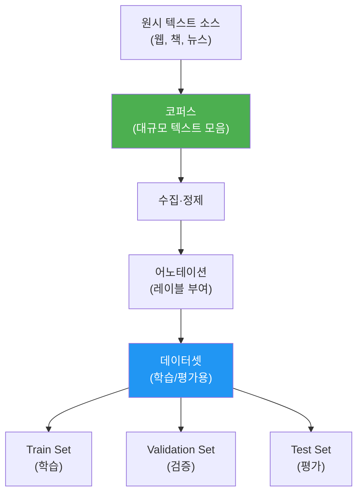
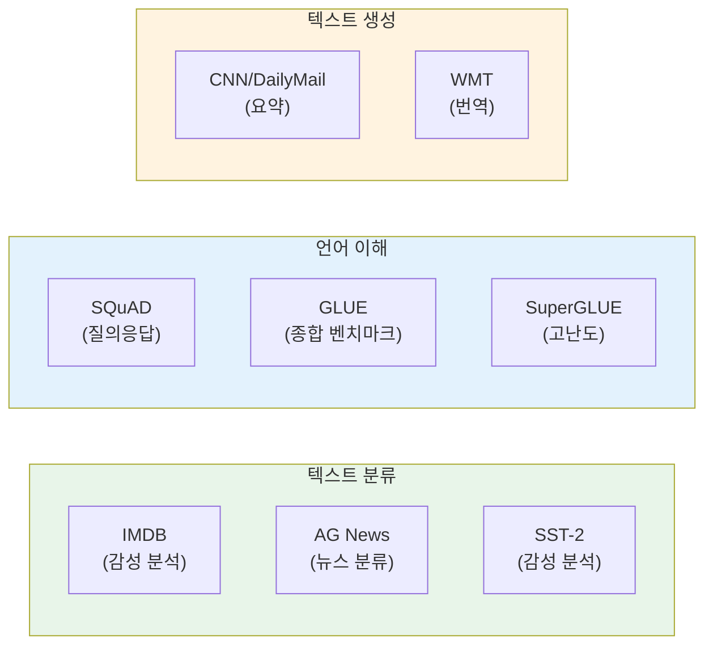
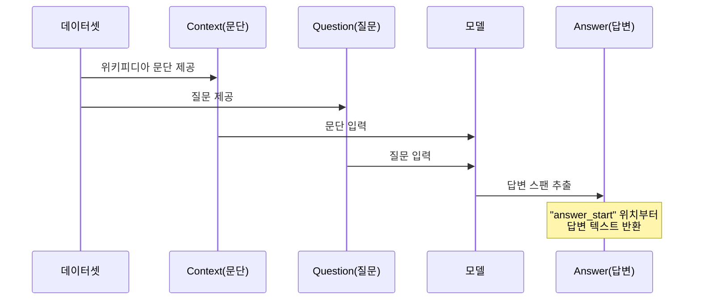
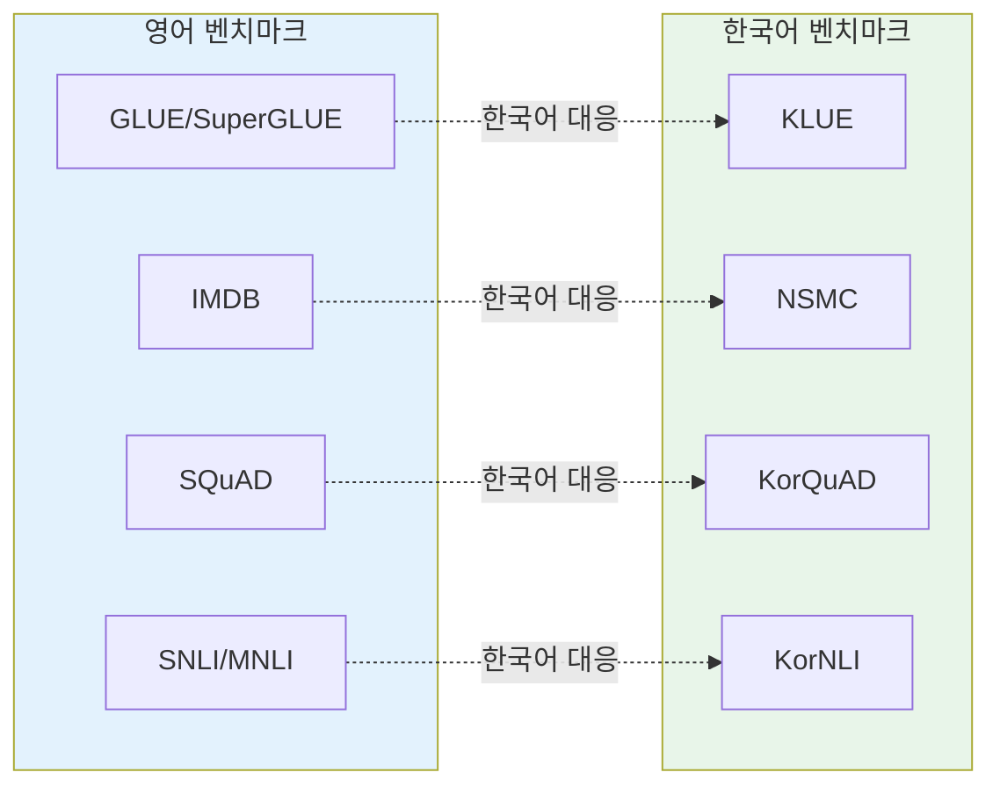
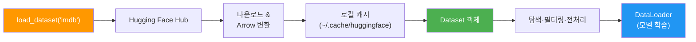

# NLP 데이터셋과 코퍼스 이해

> NLP 모델의 연료인 데이터셋과 코퍼스의 세계를 탐험하고, Python으로 직접 로딩해봅니다

## 개요

이 섹션에서는 NLP의 핵심 자원인 **코퍼스(Corpus)**와 **데이터셋(Dataset)**의 개념을 배우고, 실제 NLP 연구와 개발에서 널리 사용되는 벤치마크 데이터셋들을 살펴봅니다. 마지막으로 Hugging Face `datasets` 라이브러리를 활용해 데이터를 로딩하고 탐색하는 방법을 실습합니다.

**선수 지식**: [자연어 처리란 무엇인가](01-ch1-자연어-처리-개요와-개발-환경-설정/01-01-자연어-처리란-무엇인가.md)에서 배운 NLP의 5대 과제(분류, 생성, 번역, 요약, QA), [Python NLP 개발 환경 구축](01-ch1-자연어-처리-개요와-개발-환경-설정/03-03-python-nlp-개발-환경-구축.md)에서 설치한 라이브러리 환경

**학습 목표**:
- 코퍼스와 데이터셋의 차이를 설명할 수 있다
- IMDB, AG News, SQuAD 등 주요 NLP 벤치마크 데이터셋의 특성과 용도를 구분할 수 있다
- 한국어 NLP 데이터셋(KLUE, KorNLI 등)의 존재와 특징을 파악할 수 있다
- Hugging Face `datasets` 라이브러리로 데이터셋을 로딩하고 탐색할 수 있다

## 왜 알아야 할까?

요리사에게 좋은 재료가 필수이듯, NLP 엔지니어에게 **좋은 데이터**는 모델 성능의 80%를 결정짓는 핵심 요소입니다. 아무리 뛰어난 알고리즘이라도 엉터리 데이터로는 제대로 된 결과를 낼 수 없죠.

[NLP의 발전사](01-ch1-자연어-처리-개요와-개발-환경-설정/02-02-nlp의-발전사-규칙-기반에서-llm까지.md)에서 살펴본 것처럼, NLP는 규칙 기반에서 통계적 방법, 그리고 딥러닝으로 발전해왔는데요. 이 변화의 이면에는 항상 **대규모 데이터셋의 등장**이 있었습니다. Penn Treebank가 통계적 NLP를 열었고, ImageNet이 딥러닝 혁명을 촉발했듯, SQuAD와 GLUE 같은 벤치마크가 BERT와 GPT의 성능 경쟁을 이끌었습니다.

이번 코스 전반에 걸쳐 IMDB(감성 분석), AG News(텍스트 분류), SQuAD(질의응답) 등 다양한 데이터셋을 만나게 됩니다. 지금 이들의 구조와 특성을 이해해두면, 이후 챕터에서 모델을 학습시킬 때 "왜 이 데이터를 쓰는지", "어떻게 전처리해야 하는지"를 훨씬 쉽게 파악할 수 있습니다.

## 핵심 개념

### 개념 1: 코퍼스와 데이터셋 — 원재료와 반제품

> 💡 **비유**: 코퍼스는 광산에서 캐낸 **원석**이고, 데이터셋은 그 원석을 가공하여 **보석 세트**로 만든 것입니다. 원석(코퍼스)은 다양한 용도로 가공할 수 있지만, 보석 세트(데이터셋)는 특정 목적(반지, 목걸이)에 맞게 이미 정리되어 있죠.

**코퍼스(Corpus)**는 언어 연구나 NLP를 위해 수집된 **대규모 텍스트 모음**입니다. 복수형은 **코포라(Corpora)**라고 하는데요, 라틴어에서 온 표현이에요. 코퍼스는 특별한 레이블 없이 텍스트 자체만 있는 경우가 많습니다. 위키피디아 덤프, 뉴스 기사 아카이브, 소설 전집 등이 대표적인 코퍼스입니다.

**데이터셋(Dataset)**은 특정 NLP 태스크를 위해 **구조화되고 레이블이 부여된** 데이터 모음입니다. 입력(텍스트)과 출력(레이블, 정답)이 쌍으로 정리되어 있어, 바로 모델 학습이나 평가에 사용할 수 있죠.

> 📊 **그림 1**: 코퍼스와 데이터셋의 관계



코퍼스에서 데이터셋으로 가공되는 과정을 **어노테이션(Annotation)**이라고 합니다. 사람이 직접 텍스트를 읽고 레이블을 붙이는 작업이에요. "이 리뷰는 긍정이다", "이 문장에서 답은 여기다"처럼요. 이 작업이 엄청나게 비용이 많이 들기 때문에, 잘 만들어진 벤치마크 데이터셋은 NLP 커뮤니티에서 **공공재**처럼 소중하게 다뤄집니다.

| 구분 | 코퍼스 (Corpus) | 데이터셋 (Dataset) |
|------|----------------|-------------------|
| 레이블 | 없거나 최소 | 태스크별 레이블 포함 |
| 목적 | 언어 연구, 사전학습 | 모델 학습·평가 |
| 크기 | 매우 큼 (GB~TB) | 상대적으로 작음 (MB~GB) |
| 예시 | Wikipedia, Common Crawl | IMDB, SQuAD, KLUE |
| 분할 | 보통 없음 | Train/Val/Test 분할 |

### 개념 2: 주요 NLP 벤치마크 데이터셋

> 💡 **비유**: 벤치마크 데이터셋은 NLP 세계의 **수능 시험**입니다. 모든 모델이 같은 시험지(데이터셋)로 평가받기 때문에 공정하게 비교할 수 있죠. SQuAD는 독해력, IMDB는 감성 이해력, AG News는 주제 파악력 시험이라고 생각하면 됩니다.

NLP에는 태스크별로 대표적인 벤치마크 데이터셋들이 있습니다. 이 코스에서 자주 만나게 될 핵심 데이터셋들을 살펴보겠습니다.

> 📊 **그림 2**: NLP 태스크별 대표 벤치마크 데이터셋



**IMDB 영화 리뷰 데이터셋**

가장 유명한 감성 분석 데이터셋입니다. Stanford의 Andrew Maas가 2011년에 공개했는데요, IMDb 영화 리뷰 50,000개를 긍정(positive)과 부정(negative)으로 나눠놓았습니다. 학습용 25,000개, 테스트용 25,000개로 깔끔하게 분리되어 있죠. 이 데이터셋은 이진 감성 분류의 "Hello World"와 같은 존재로, [Ch10. 순환 신경망과 시퀀스 모델링](10-ch10-순환-신경망과-시퀀스-모델링/01-01-시퀀스-데이터의-특성과-rnn의-필요성.md)에서 RNN 기반 감성 분석에 본격적으로 활용합니다.

```python
# IMDB 데이터 구조 예시
{
    "text": "This movie was absolutely fantastic! The acting was superb...",
    "label": 1  # 1 = 긍정, 0 = 부정
}
```

**AG News**

뉴스 기사 분류 데이터셋으로, 4개 카테고리(World, Sports, Business, Sci/Tech)로 나뉜 120,000개 학습 샘플과 7,600개 테스트 샘플을 담고 있습니다. [텍스트 분류](01-ch1-자연어-처리-개요와-개발-환경-설정/01-01-자연어-처리란-무엇인가.md)의 대표적 벤치마크이죠.

**SQuAD (Stanford Question Answering Dataset)**

Stanford 대학에서 만든 독해형 질의응답 데이터셋입니다. 위키피디아 문단을 읽고 질문에 답하는 태스크인데요, SQuAD 1.1은 100,000개 이상의 질문-답변 쌍으로 구성되어 있고, SQuAD 2.0에서는 "답이 없는 질문"이 추가되어 모델이 "모르겠다"고 판단하는 능력까지 평가합니다. BERT가 처음으로 인간 수준의 성능을 달성한 데이터셋으로 유명하죠.

```python
# SQuAD 데이터 구조 예시
{
    "context": "The Normans were the people who in the 10th and 11th centuries...",
    "question": "In what century did the Normans first gain their distinct identity?",
    "answers": {
        "text": ["10th and 11th centuries"],
        "answer_start": [34]
    }
}
```

**GLUE / SuperGLUE**

단일 태스크 벤치마크의 한계를 극복하기 위해, **여러 NLP 태스크를 종합적으로 평가**하는 벤치마크입니다. GLUE는 9개 태스크(SST-2, MNLI, QQP 등)를 포함하고, BERT 등장 이후 금방 "천장"에 도달하자 더 어려운 SuperGLUE가 등장했습니다.

> 📊 **그림 3**: SQuAD 질의응답 데이터 흐름



### 개념 3: 한국어 NLP 데이터셋

> 💡 **비유**: 영어 NLP 데이터셋이 풍부한 것은 마치 서울의 교통 인프라처럼 잘 정비되어 있는 것이고, 한국어 NLP 데이터셋은 급격히 발전 중인 **신도시 인프라**와 같습니다. 아직 영어만큼 풍부하지는 않지만, KLUE를 비롯한 양질의 벤치마크가 빠르게 구축되고 있죠.

한국어 NLP를 위한 벤치마크 데이터셋도 활발히 구축되고 있습니다.

**KLUE (Korean Language Understanding Evaluation)**

한국어판 GLUE라고 할 수 있는 종합 벤치마크입니다. 2021년에 KAIST, 네이버 등이 협력하여 공개했는데요, 8개 NLU 태스크를 포함합니다:

| 태스크 | 약칭 | 설명 | 데이터 수 |
|--------|------|------|-----------|
| 주제 분류 | TC | 뉴스 헤드라인 분류 | ~63K |
| 의미 유사도 | STS | 문장 쌍 유사도 측정 | ~12.5K |
| 자연어 추론 | NLI | 전제-가설 관계 판단 | ~31K |
| 개체명 인식 | NER | 인명, 지명 등 추출 | ~22K |
| 관계 추출 | RE | 엔티티 간 관계 분류 | ~32K |
| 의존 구문 분석 | DP | 문장 구조 분석 | ~10K |
| 기계 독해 | MRC | 문단 기반 질의응답 | ~29K |
| 대화 상태 추적 | DST | 대화 의도 파악 | ~10K |

**KorNLI / KorSTS**

카카오브레인에서 공개한 한국어 자연어 추론(NLI)과 의미 유사도(STS) 데이터셋입니다. 영어 SNLI, MNLI, STS-B를 기계 번역 + 수동 검수하여 구축했는데요, KorNLI는 약 94만 개의 학습 예제를 포함하고 있어 한국어 문장 임베딩 모델 학습에 핵심 자원으로 활용됩니다.

**기타 주요 한국어 데이터셋**
- **NSMC (Naver Sentiment Movie Corpus)**: 네이버 영화 리뷰 20만 건의 감성 분석 데이터셋. 한국어판 IMDB라고 볼 수 있습니다
- **KorQuAD**: 한국어 질의응답 데이터셋. SQuAD 형식을 따르며, 위키피디아 한국어 문서 기반
- **Korpora**: 다양한 한국어 코퍼스를 통합 제공하는 파이썬 라이브러리

> 📊 **그림 4**: 영어 vs 한국어 NLP 벤치마크 대응 관계



### 개념 4: Hugging Face Datasets 라이브러리

> 💡 **비유**: Hugging Face Datasets는 NLP 데이터의 **넷플릭스**입니다. 수천 개의 데이터셋이 클라우드에 준비되어 있고, `load_dataset("imdb")`처럼 한 줄이면 원하는 데이터를 바로 스트리밍할 수 있죠. DVD를 대여하러 갈 필요가 없는 거예요!

[Python NLP 개발 환경 구축](01-ch1-자연어-처리-개요와-개발-환경-설정/03-03-python-nlp-개발-환경-구축.md)에서 설치한 Hugging Face 생태계에는 `datasets`라는 강력한 라이브러리가 포함되어 있습니다. 이 라이브러리는 수천 개의 공개 데이터셋을 **한 줄의 코드**로 로딩할 수 있게 해줍니다.

핵심 특징:
- **Apache Arrow** 기반으로 대용량 데이터도 메모리 효율적으로 처리
- **캐싱 시스템**이 있어 한 번 다운로드하면 재사용
- **스트리밍 모드**로 디스크 공간 없이도 대용량 데이터 탐색 가능
- Train/Val/Test **스플릿**이 미리 정의되어 있음

> 📊 **그림 5**: Hugging Face Datasets 라이브러리 작동 흐름



기본 사용법을 코드로 살펴보겠습니다:

```run:python
from datasets import load_dataset

# IMDB 데이터셋 로딩
dataset = load_dataset("imdb")

# 데이터셋 구조 확인
print("데이터셋 구조:")
print(dataset)
print()

# 학습 데이터 첫 번째 샘플 확인
sample = dataset["train"][0]
print(f"텍스트 (앞 100자): {sample['text'][:100]}...")
print(f"레이블: {sample['label']} ({'긍정' if sample['label'] == 1 else '부정'})")
```

```output
데이터셋 구조:
DatasetDict({
    train: Dataset({
        features: ['text', 'label'],
        num_rows: 25000
    })
    test: Dataset({
        features: ['text', 'label'],
        num_rows: 25000
    })
    unsupervised: Dataset({
        features: ['text', 'label'],
        num_rows: 50000
    })
})

텍스트 (앞 100자): I rented I AM CURIOUS-YELLOW from my video store because of all the controversy that surrounded it wh...
레이블: 0 (부정)
```

데이터셋의 컬럼 정보, 샘플 수, 데이터 타입 등을 한눈에 확인할 수 있죠. `DatasetDict`은 여러 스플릿(train, test 등)을 딕셔너리처럼 담고 있는 컨테이너입니다.

## 실습: 직접 해보기

이번 실습에서는 여러 데이터셋을 로딩하고, 구조를 탐색하며, 기본적인 통계를 살펴보겠습니다.

### 1단계: 여러 데이터셋 로딩 및 비교

```python
from datasets import load_dataset

# ① IMDB 감성 분석 데이터셋
imdb = load_dataset("imdb")

# ② AG News 뉴스 분류 데이터셋
ag_news = load_dataset("ag_news")

# ③ SQuAD 질의응답 데이터셋
squad = load_dataset("squad")
```

### 2단계: 데이터셋 구조 비교

```run:python
from datasets import load_dataset

# 데이터셋 로딩
imdb = load_dataset("imdb")
ag_news = load_dataset("ag_news")
squad = load_dataset("squad")

# 각 데이터셋의 features(컬럼) 비교
datasets_info = {
    "IMDB": imdb["train"],
    "AG News": ag_news["train"],
    "SQuAD": squad["train"]
}

for name, ds in datasets_info.items():
    print(f"=== {name} ===")
    print(f"  샘플 수: {len(ds):,}")
    print(f"  컬럼: {list(ds.features.keys())}")
    print(f"  첫 샘플 키: {list(ds[0].keys())}")
    print()
```

```output
=== IMDB ===
  샘플 수: 25,000
  컬럼: ['text', 'label']
  첫 샘플 키: ['text', 'label']

=== AG News ===
  샘플 수: 120,000
  컬럼: ['text', 'label']
  첫 샘플 키: ['text', 'label']

=== SQuAD ===
  샘플 수: 87,599
  컬럼: ['id', 'title', 'context', 'question', 'answers']
  첫 샘플 키: ['id', 'title', 'context', 'question', 'answers']
```

### 3단계: 데이터 탐색과 기본 통계

```python
from datasets import load_dataset
from collections import Counter

# AG News 레이블 분포 확인
ag_news = load_dataset("ag_news")
label_names = {0: "World", 1: "Sports", 2: "Business", 3: "Sci/Tech"}

# 레이블별 개수 세기
label_counts = Counter(ag_news["train"]["label"])
print("AG News 학습 데이터 레이블 분포:")
for label_id, count in sorted(label_counts.items()):
    name = label_names[label_id]
    bar = "█" * (count // 1000)  # 간단한 막대 그래프
    print(f"  {name:10s} ({label_id}): {count:>6,}개 {bar}")

print()

# 텍스트 길이 통계
train_texts = ag_news["train"]["text"]
lengths = [len(text.split()) for text in train_texts]
print(f"텍스트 길이 통계 (단어 수):")
print(f"  평균: {sum(lengths)/len(lengths):.1f}")
print(f"  최소: {min(lengths)}")
print(f"  최대: {max(lengths)}")
```

### 4단계: 스트리밍 모드와 데이터 필터링

```python
from datasets import load_dataset

# 스트리밍 모드 — 전체를 다운로드하지 않고 순차 접근
# 디스크 공간이 부족할 때 유용합니다
stream_dataset = load_dataset("imdb", split="train", streaming=True)

# 처음 3개 샘플만 확인
print("스트리밍 모드 — 처음 3개 샘플:")
for i, sample in enumerate(stream_dataset):
    if i >= 3:
        break
    sentiment = "긍정" if sample["label"] == 1 else "부정"
    print(f"  [{sentiment}] {sample['text'][:80]}...")
print()

# 필터링 — 긍정 리뷰만 추출
imdb = load_dataset("imdb", split="train")
positive_reviews = imdb.filter(lambda x: x["label"] == 1)
print(f"전체 학습 데이터: {len(imdb):,}개")
print(f"긍정 리뷰만 필터: {len(positive_reviews):,}개")
```

### 5단계: NLTK 코퍼스 활용

[spaCy와 NLTK 첫 걸음](01-ch1-자연어-처리-개요와-개발-환경-설정/04-04-spacy와-nltk-첫-걸음.md)에서 배운 NLTK에는 다양한 코퍼스가 내장되어 있습니다:

```run:python
import nltk
nltk.download('brown', quiet=True)
nltk.download('gutenberg', quiet=True)

from nltk.corpus import brown, gutenberg

# Brown Corpus — 장르별 텍스트 모음
print("Brown Corpus 장르:")
categories = brown.categories()
print(f"  {', '.join(categories[:5])}... (총 {len(categories)}개)")
print(f"  전체 단어 수: {len(brown.words()):,}")
print()

# Gutenberg Corpus — 고전 문학 작품
print("Gutenberg Corpus 작품 목록:")
for fileid in gutenberg.fileids()[:5]:
    words = len(gutenberg.words(fileid))
    print(f"  {fileid}: {words:,} 단어")
```

```output
Brown Corpus 장르:
  adventure, belles_lettres, editorial, fiction, government... (총 15개)
  전체 단어 수: 1,161,192

Gutenberg Corpus 작품 목록:
  austen-emma.txt: 192,427 단어
  austen-persuasion.txt: 98,171 단어
  austen-sense.txt: 141,576 단어
  bible-kjv.txt: 1,010,654 단어
  blake-poems.txt: 8,167 단어
```

## 더 깊이 알아보기

### Brown Corpus — NLP 역사의 기원

현대 NLP 데이터셋의 역사는 1961년 **브라운 대학교(Brown University)**에서 시작됩니다. 언어학자 Henry Kučera와 W. Nelson Francis가 미국 영어의 "표본"을 만들겠다는 야심 찬 목표로, 1961년에 출판된 다양한 장르(소설, 뉴스, 학술 논문 등)의 텍스트 500개를 모아 총 1,014,312단어의 코퍼스를 구축했습니다.

놀라운 점은, 이 모든 작업이 **천공 카드(punched card)**로 이루어졌다는 것입니다! 텍스트를 하나하나 카드에 입력하고, 대형 메인프레임 컴퓨터로 처리했죠. 이렇게 고생스럽게 만든 Brown Corpus는 **최초의 전산화된 언어 코퍼스**로, 이후 모든 코퍼스 언어학의 토대가 됩니다.

### Penn Treebank — 통계적 NLP의 촉매제

1989년, 펜실베이니아 대학의 **Mitchell Marcus** 교수는 DARPA와 NSF의 지원을 받아 Penn Treebank 프로젝트를 시작합니다. 목표는 수백만 단어에 품사 태그와 구문 구조를 표시하는 것이었는데요, 1992년에 초판이 공개되면서 NLP 세계에 혁명이 일어납니다.

Penn Treebank가 등장하기 전에는 각 연구팀이 자체 데이터로 연구하다 보니, 연구 결과를 비교하기가 거의 불가능했거든요. Penn Treebank는 **"모두가 같은 데이터로 평가하자"**라는 문화를 만들었고, 이것이 바로 오늘날 벤치마크 중심 연구의 시작입니다. 재미있게도, "Treebank"라는 이름은 언어학자 Geoffrey Leech가 1980년대에 만든 조어인데, 은행(bank)처럼 나무(tree, 구문 분석 트리)를 보관하는 곳이라는 뜻이에요.

### SQuAD와 리더보드 경쟁

2016년 Stanford의 Pranav Rajpurkar가 SQuAD를 공개했을 때, 함께 만든 **리더보드(leaderboard)** 웹사이트가 NLP 연구에 엄청난 경쟁을 불러일으켰습니다. 연구자들은 자신의 모델 성능을 실시간으로 비교할 수 있었고, 2018년 BERT가 처음으로 인간 수준의 성능을 달성하며 세계적인 뉴스가 되었죠. 이 "리더보드 경쟁" 모델은 이후 거의 모든 NLP 벤치마크가 채택하게 됩니다.

## 흔한 오해와 팁

> ⚠️ **흔한 오해**: "데이터가 많으면 많을수록 항상 좋다?" — 그렇지 않습니다! 데이터의 **품질**이 양보다 중요한 경우가 많아요. 레이블이 잘못된 데이터(noisy label)가 섞여 있으면 모델 성능이 오히려 떨어집니다. 최근 연구에서는 고품질 데이터 소량이 저품질 대량 데이터보다 나은 결과를 보여주는 사례가 많이 보고되고 있습니다.

> 💡 **알고 계셨나요?**: GLUE 벤치마크는 2018년에 만들어졌는데, BERT가 등장하자마자 거의 모든 태스크에서 인간 수준을 달성해버렸습니다. 그래서 불과 1년 만에 더 어려운 **SuperGLUE**가 등장했는데, 이마저도 2021년에는 인간 수준에 도달했죠. 벤치마크를 만드는 속도보다 AI가 이를 정복하는 속도가 더 빠른 시대입니다!

> 🔥 **실무 팁**: Hugging Face `datasets`의 **스트리밍 모드**(`streaming=True`)를 적극 활용하세요. 수십 GB짜리 데이터셋도 먼저 처음 몇 샘플을 빠르게 살펴보고 구조를 파악한 뒤, 필요한 부분만 다운로드할 수 있습니다. 특히 Colab이나 디스크 공간이 제한된 환경에서 매우 유용합니다.

> 🔥 **실무 팁**: 데이터셋을 처음 사용할 때는 반드시 **레이블 분포**를 확인하세요. 클래스 불균형(class imbalance)이 심하면 모델이 다수 클래스만 예측하는 함정에 빠질 수 있습니다. `Counter(dataset["label"])`로 간단히 확인할 수 있죠.

## 핵심 정리

| 개념 | 설명 |
|------|------|
| 코퍼스 (Corpus) | 언어 연구를 위해 수집된 대규모 텍스트 모음. 보통 레이블 없음 |
| 데이터셋 (Dataset) | 특정 태스크용으로 레이블이 부여된 구조화된 데이터 |
| 어노테이션 | 코퍼스에 레이블을 부여하여 데이터셋으로 가공하는 과정 |
| IMDB | 영화 리뷰 5만 건, 이진 감성 분류 벤치마크 |
| AG News | 뉴스 기사 12만 건, 4-class 주제 분류 벤치마크 |
| SQuAD | 위키피디아 기반 10만+ 질의응답, 독해력 벤치마크 |
| GLUE / SuperGLUE | 여러 NLU 태스크를 종합 평가하는 벤치마크 |
| KLUE | 한국어 종합 NLU 벤치마크 (8개 태스크) |
| NSMC | 네이버 영화 리뷰 20만 건, 한국어 감성 분석 |
| `load_dataset()` | Hugging Face Hub에서 데이터셋을 한 줄로 로딩하는 함수 |
| 스트리밍 모드 | `streaming=True`로 다운로드 없이 데이터를 순차 접근 |
| Train/Val/Test 분할 | 학습·검증·평가용으로 데이터를 나누는 표준 방식 |

## 다음 섹션 미리보기

축하합니다! Ch1의 마지막 섹션을 마쳤습니다. 자연어 처리의 정의, 발전사, 개발 환경, 핵심 도구, 그리고 데이터셋까지 — NLP의 전체 지형도를 한 바퀴 돌아본 셈이죠.

다음 챕터 [Ch2. 텍스트 전처리: 토큰화와 정규화](02-ch2-텍스트-전처리-토큰화와-정규화/01-01-토큰화의-기초.md)에서는 본격적으로 텍스트 데이터를 다루기 시작합니다. 지금 배운 데이터셋에서 가져온 텍스트를 어떻게 **토큰(token)**이라는 작은 단위로 쪼개는지, 그리고 왜 이 과정이 모든 NLP의 첫 번째 단계인지를 배웁니다. [spaCy와 NLTK](01-ch1-자연어-처리-개요와-개발-환경-설정/04-04-spacy와-nltk-첫-걸음.md)에서 잠깐 맛본 토큰화를, 이제 제대로 깊이 있게 파헤칠 시간입니다!

## 참고 자료

- [Hugging Face Datasets 공식 문서 — Load a dataset](https://huggingface.co/docs/datasets/en/loading) - `load_dataset()` 함수의 모든 옵션과 사용법을 다룬 공식 가이드
- [SQuAD: The Stanford Question Answering Dataset](https://rajpurkar.github.io/SQuAD-explorer/) - SQuAD 데이터셋 탐색기와 리더보드. 모델 성능 비교 가능
- [KLUE-benchmark GitHub](https://github.com/KLUE-benchmark/KLUE) - 한국어 NLU 벤치마크 KLUE의 공식 리포지토리. 8개 태스크 데이터 및 베이스라인 코드
- [Stanford CS 224N: Natural Language Processing with Deep Learning](https://web.stanford.edu/class/cs224n/) - NLP의 이론과 실습을 체계적으로 학습할 수 있는 스탠포드 강의
- [songys/AwesomeKorean_Data](https://github.com/songys/AwesomeKorean_Data) - 한국어 NLP 데이터셋을 포괄적으로 정리한 리포지토리
- [Hugging Face Datasets Hub](https://huggingface.co/datasets) - 수천 개의 공개 데이터셋을 검색하고 탐색할 수 있는 허브

---
### 🔗 Related Sessions
- [텍스트 분류](01-ch1-자연어-처리-개요와-개발-환경-설정/01-01-자연어-처리란-무엇인가.md) (prerequisite)
- [질의응답](01-ch1-자연어-처리-개요와-개발-환경-설정/01-01-자연어-처리란-무엇인가.md) (prerequisite)

---
### 🔗 Related Sessions
- [텍스트 분류](01-ch1-자연어-처리-개요와-개발-환경-설정/01-01-자연어-처리란-무엇인가.md) (prerequisite)
- [질의응답](01-ch1-자연어-처리-개요와-개발-환경-설정/01-01-자연어-처리란-무엇인가.md) (prerequisite)


---
### 🔗 Related Sessions
- [텍스트 분류](01-ch1-자연어-처리-개요와-개발-환경-설정/01-01-자연어-처리란-무엇인가.md) (prerequisite)
- [질의응답](01-ch1-자연어-처리-개요와-개발-환경-설정/01-01-자연어-처리란-무엇인가.md) (prerequisite)


---
### 🔗 Related Sessions
- [텍스트 분류](01-ch1-자연어-처리-개요와-개발-환경-설정/01-01-자연어-처리란-무엇인가.md) (prerequisite)
- [질의응답](01-ch1-자연어-처리-개요와-개발-환경-설정/01-01-자연어-처리란-무엇인가.md) (prerequisite)


---
### 🔗 Related Sessions
- [텍스트 분류](01-ch1-자연어-처리-개요와-개발-환경-설정/01-01-자연어-처리란-무엇인가.md) (prerequisite)
- [질의응답](01-ch1-자연어-처리-개요와-개발-환경-설정/01-01-자연어-처리란-무엇인가.md) (prerequisite)
