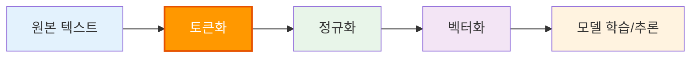
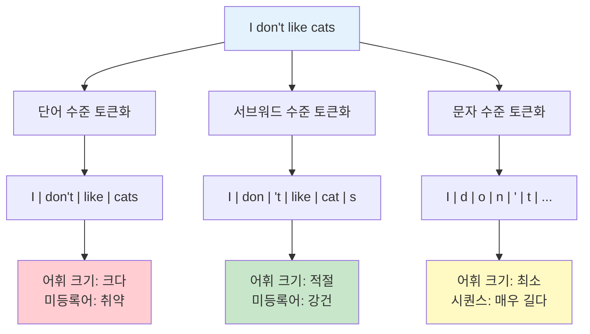
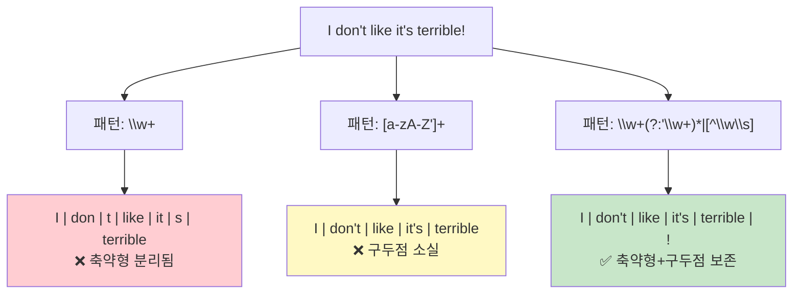
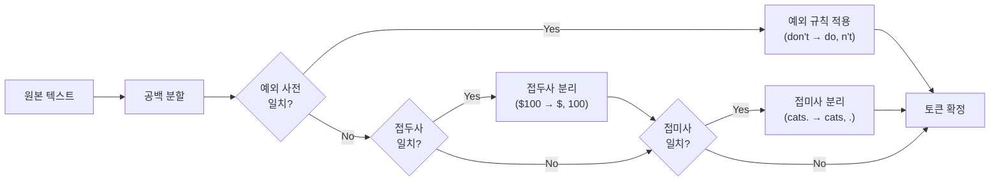
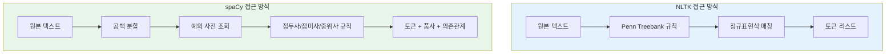
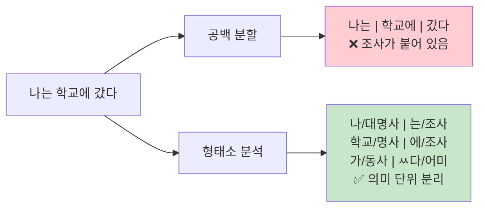

# 토큰화의 기초

> 텍스트를 의미 있는 조각으로 나누는 첫 번째 단계, 토큰화의 세계로 들어갑니다.

## 개요

이 섹션에서는 자연어 처리의 가장 기본적이면서도 핵심적인 전처리 단계인 **토큰화(Tokenization)**를 다룹니다. 텍스트를 컴퓨터가 이해할 수 있는 단위로 분할하는 다양한 방법을 비교하고, 영어와 한국어에서의 토큰화 차이를 실습합니다.

**선수 지식**: [Ch1. 자연어 처리 개요와 개발 환경 설정](01-ch1-자연어-처리-개요와-개발-환경-설정/04-04-spacy와-nltk-첫-걸음.md)에서 다룬 spaCy, NLTK 기본 설치와 사용법
**학습 목표**:
- 토큰화가 무엇이며 왜 NLP의 첫 단계인지 설명할 수 있다
- 공백 기반, 규칙 기반, 라이브러리 기반 토큰화의 차이를 비교할 수 있다
- spaCy와 NLTK로 영어 텍스트를 토큰화할 수 있다
- 한국어 토큰화가 왜 어렵고, 어떤 도구가 필요한지 이해한다

## 왜 알아야 할까?

여러분이 컴퓨터에게 "나는 오늘 학교에 갔다"라는 문장을 이해시키고 싶다고 해보세요. 컴퓨터는 이 문장을 통째로 받아들일 수 없습니다. 마치 **레고 블록**처럼, 문장을 의미 있는 조각으로 나눠야 비로소 분석이 시작되거든요. 이 "나누는 작업"이 바로 토큰화입니다.

토큰화가 잘못되면 이후의 모든 단계—정규화, 임베딩, 모델 학습—이 엉망이 됩니다. "New York"을 "New"와 "York"으로 쪼개면 도시 이름이 사라지고, "don't"를 통째로 두면 "do not"이라는 의미를 놓치게 되죠. **토큰화는 NLP 파이프라인의 기초 공사**입니다. 기초가 흔들리면 건물 전체가 위험해지는 것처럼요.

> 📊 **그림 1**: NLP 파이프라인에서 토큰화의 위치



토큰화는 파이프라인의 **맨 첫 번째** 단계입니다. 여기서 어떤 전략을 선택하느냐에 따라 모델의 어휘 크기, 미등록어(OOV) 처리 능력, 심지어 최종 성능까지 달라집니다.

## 핵심 개념

### 개념 1: 토큰이란 무엇인가?

> 💡 **비유**: 토큰화는 **요리 재료 손질**과 같습니다. 통째로 된 야채를 그냥 냄비에 넣을 수 없죠. 다지거나, 슬라이스하거나, 깍둑썰기를 해야 합니다. 어떻게 자르느냐에 따라 요리의 식감과 맛이 달라지듯, 텍스트를 어떻게 자르느냐에 따라 NLP 모델의 성능이 달라집니다.

**토큰(Token)**은 텍스트를 처리하기 위해 분할한 기본 단위입니다. 토큰은 상황에 따라 다양한 수준으로 정의될 수 있어요:

| 토큰화 수준 | 예시 ("I don't like cats") | 특징 |
|-------------|---------------------------|------|
| **단어 수준** | `["I", "don't", "like", "cats"]` | 직관적이지만 어휘 크기가 큼 |
| **서브워드 수준** | `["I", "don", "'t", "like", "cat", "s"]` | 미등록어 처리에 유리 |
| **문자 수준** | `["I", " ", "d", "o", "n", ...]` | 어휘 크기 최소, 시퀀스 길이 최대 |

> 📊 **그림 2**: 토큰화 수준별 비교



현대 NLP에서는 **서브워드 토큰화**가 주류이지만, 서브워드를 이해하려면 먼저 단어 수준 토큰화를 확실히 알아야 합니다. 서브워드 토큰화는 [Ch15. 서브워드 토크나이제이션](15-ch15-서브워드-토크나이제이션/01-01-서브워드-토크나이제이션의-필요성.md)에서 본격적으로 다루게 됩니다.

### 개념 2: 공백 기반 토큰화 — 가장 단순한 방법

> 💡 **비유**: 공백 기반 토큰화는 **칼 없이 빵을 손으로 뜯는 것**과 같습니다. 빠르고 간단하지만, 깔끔하지 않고 원하는 크기로 나누기 어렵죠.

가장 원시적인 토큰화는 공백(스페이스, 탭, 줄바꿈)을 기준으로 텍스트를 분할하는 것입니다. Python의 `split()` 메서드가 바로 이 역할을 합니다.

```run:python
text = "I don't like New York's weather, it's terrible!"
tokens = text.split()
print(f"토큰 수: {len(tokens)}")
print(f"토큰: {tokens}")
```

```output
토큰 수: 8
토큰: ["I", "don't", "like", "New", "York's", "weather,", "it's", "terrible!"]
```

문제가 보이시나요? `"weather,"`에 쉼표가 붙어 있고, `"terrible!"`에 느낌표가 포함되어 있습니다. `"don't"`는 하나의 토큰으로 남아 있어서 "do" + "not"이라는 의미 정보를 놓치게 됩니다. `"New"`와 `"York's"`가 분리되어 "뉴욕"이라는 고유명사가 사라졌고요.

**공백 기반 토큰화의 한계:**
- 구두점이 단어에 붙어서 분리됨
- 축약형(`don't`, `it's`)을 적절히 처리하지 못함
- 복합 명사(`New York`, `ice cream`)를 인식하지 못함
- 한국어, 중국어, 일본어 등 공백이 없거나 적은 언어에서 무력

### 개념 3: 규칙 기반 토큰화 — 정규표현식의 힘

> 💡 **비유**: 규칙 기반 토큰화는 **레시피북을 보고 재료를 자르는 것**입니다. "토마토는 반으로, 양파는 깍둑썰기"처럼 재료마다 규칙이 있죠. 정규표현식이 바로 이 레시피북 역할을 합니다.

Python의 `re` 모듈을 사용하면 공백보다 훨씬 정교한 토큰화가 가능합니다.

```run:python
import re

text = "I don't like New York's weather, it's terrible!"

# 단어 문자(영문자, 숫자, 밑줄)만 추출
tokens_word = re.findall(r'\w+', text)
print(f"\\w+ 패턴: {tokens_word}")

# 알파벳과 아포스트로피 포함 단어 추출
tokens_alpha = re.findall(r"[a-zA-Z']+", text)
print(f"알파벳+아포스트로피: {tokens_alpha}")

# 축약형 분리: 아포스트로피 앞뒤를 나눔
tokens_contract = re.findall(r"\w+(?:'\w+)*|[^\w\s]", text)
print(f"축약형 보존: {tokens_contract}")
```

```output
\w+ 패턴: ['I', 'don', 't', 'like', 'New', 'York', 's', 'weather', 'it', 's', 'terrible']
알파벳+아포스트로피: ["I", "don't", "like", "New", "York's", "weather", "it's", "terrible"]
축약형 보존: ["I", "don't", "like", "New", "York's", "weather", ",", "it's", "terrible", "!"]
```

정규표현식 패턴에 따라 토큰화 결과가 크게 달라지는 것이 보이시죠? `\w+`는 아포스트로피를 기준으로 단어를 분리하고, `[a-zA-Z']+`는 구두점을 제거하면서 축약형을 보존합니다. 하지만 여전히 "New York"은 분리되어 있고, 모든 엣지 케이스를 정규표현식으로 처리하려면 규칙이 끝없이 복잡해집니다.

> 📊 **그림 3**: 정규표현식 패턴별 토큰화 결과 비교



### 개념 4: 라이브러리 기반 토큰화 — NLTK와 spaCy

규칙을 일일이 작성하는 대신, 수십 년간 언어학 연구가 축적된 NLP 라이브러리를 활용하면 훨씬 정교한 토큰화가 가능합니다.

#### NLTK — 학계의 터줏대감

NLTK의 `word_tokenize`는 내부적으로 **Penn Treebank 토크나이저**를 개선한 규칙을 사용합니다. Punkt 문장 분할기와 결합하여 축약형, 구두점, 특수문자를 정교하게 처리하죠.

```run:python
import nltk
nltk.download('punkt_tab', quiet=True)
from nltk.tokenize import word_tokenize, sent_tokenize

text = "I don't like New York's weather. It's terrible! What do you think?"

# 문장 토큰화
sentences = sent_tokenize(text)
print(f"문장 수: {len(sentences)}")
for i, sent in enumerate(sentences):
    print(f"  문장 {i+1}: {sent}")

print()

# 단어 토큰화
tokens = word_tokenize(text)
print(f"토큰 수: {len(tokens)}")
print(f"토큰: {tokens}")
```

```output
문장 수: 3
  문장 1: I don't like New York's weather.
  문장 2: It's terrible!
  문장 3: What do you think?

토큰 수: 18
토큰: ['I', 'do', "n't", 'like', 'New', 'York', "'s", 'weather', '.', 'It', "'s", 'terrible', '!', 'What', 'do', 'you', 'think', '?']
```

`don't`가 `do` + `n't`로, `York's`가 `York` + `'s`로 분리된 것을 주목하세요. 이것은 Penn Treebank 규칙에 따른 것으로, 영어 문법에서 축약형의 의미를 보존하면서 분리합니다.

#### spaCy — 산업계의 강자

spaCy는 **규칙 기반 + 예외 사전** 방식으로 토큰화합니다. 먼저 공백으로 대략 나눈 뒤, 접두사(prefix), 접미사(suffix), 중위사(infix) 규칙과 예외 목록을 순서대로 적용하는 파이프라인 방식이에요.

> 📊 **그림 4**: spaCy 토크나이저의 내부 처리 흐름



```python
import spacy

# 영어 모델 로드 (소형 모델)
nlp = spacy.load("en_core_web_sm")

text = "I don't like New York's weather. It's terrible!"
doc = nlp(text)

# 토큰과 함께 품사 태그도 확인
print(f"{'토큰':<12} {'품사':<8} {'공백 뒤?'}")
print("-" * 32)
for token in doc:
    print(f"{token.text:<12} {token.pos_:<8} {token.whitespace_!r}")
```

```output
토큰         품사     공백 뒤?
--------------------------------
I            PRON     ' '
do           AUX      ''
n't          PART     ' '
like         VERB     ' '
New          PROPN    ' '
York         PROPN    ''
's           PART     ' '
weather      NOUN     ''
.            PUNCT    ' '
It           PRON     ''
's           AUX      ' '
terrible     ADJ      ''
!            PUNCT    ''
```

spaCy는 토큰화와 동시에 **품사 태깅(POS tagging)**까지 수행합니다. `New`가 `PROPN`(고유명사)으로 태깅된 것, `do`가 `AUX`(조동사)로 분류된 것을 보세요. 단순 분할을 넘어서 언어학적 분석이 함께 이루어지는 거예요.

> 📊 **그림 5**: NLTK vs spaCy 토큰화 접근 방식 비교



#### NLTK vs spaCy 비교

| 특성 | NLTK | spaCy |
|------|------|-------|
| **목적** | 교육·연구 | 산업·프로덕션 |
| **속도** | 느림 | 매우 빠름 (C/Cython) |
| **토큰화 방식** | Penn Treebank 규칙 | 규칙 + 예외 사전 + 파이프라인 |
| **추가 정보** | 토큰만 | 품사, 의존 구문, 개체명 등 |
| **커스터마이징** | 중간 | 높음 |
| **설치 크기** | 가벼움 | 모델 포함 시 큼 |

### 개념 5: 한국어 토큰화의 특수성

> 💡 **비유**: 영어 토큰화가 **블록 사이의 홈을 따라 자르기**라면, 한국어 토큰화는 **찰흙 덩어리를 의미 단위로 빚어내기**입니다. 한국어는 교착어(agglutinative language)라서 조사, 어미 등이 단어에 붙어 있거든요.

한국어에서 "나는 학교에 갔다"를 공백으로 나누면 `["나는", "학교에", "갔다"]`가 됩니다. 하지만 NLP에서 원하는 것은 `["나", "는", "학교", "에", "가", "ㅆ다"]`처럼 **형태소(morpheme)** 단위의 분리입니다.

> 📊 **그림 6**: 한국어 공백 분할 vs 형태소 분석



**왜 한국어 토큰화가 어려운가?**

1. **교착어 특성**: "학교에서는" → "학교" + "에서" + "는" (명사 + 조사 + 보조사)
2. **띄어쓰기 불규칙**: 실제 한국어 텍스트에서 띄어쓰기가 틀린 경우가 매우 많음
3. **동형이의어**: "배"가 과일인지, 신체 부위인지, 탈것인지 문맥으로 판단해야 함
4. **복합 조사/어미**: "갔었었다" → "가" + "ㅆ" + "었" + "었" + "다"

한국어 토큰화를 위해서는 **형태소 분석기(morphological analyzer)**가 필요합니다. 대표적인 도구로는 KoNLPy(MeCab, Hannanum, Kkma 등을 통합), Kiwi, 그리고 Hugging Face의 서브워드 토크나이저가 있습니다.

```python
# 한국어 형태소 분석 예시 (KoNLPy 설치 필요)
# pip install konlpy
from konlpy.tag import Mecab

mecab = Mecab()
text = "나는 자연어 처리를 공부하고 있습니다"

# 형태소 분석
morphs = mecab.morphs(text)
print(f"형태소: {morphs}")

# 품사 태깅
pos = mecab.pos(text)
print(f"품사 태깅: {pos}")
```

```output
형태소: ['나', '는', '자연어', '처리', '를', '공부', '하', '고', '있', '습니다']
품사 태깅: [('나', 'NP'), ('는', 'JX'), ('자연어', 'NNG'), ('처리', 'NNG'), ('를', 'JKO'), ('공부', 'NNG'), ('하', 'XSV'), ('고', 'EC'), ('있', 'VX'), ('습니다', 'EF')]
```

> ⚠️ **흔한 오해**: "한국어도 공백으로 나누면 되지 않나요?" — 공백 기반 토큰화는 한국어에서 거의 쓸모가 없습니다. "나는"과 "나를"은 완전히 다른 토큰이 되지만, 핵심 의미인 "나"는 같죠. 형태소 분석 없이는 같은 단어의 다른 형태를 연결할 수 없습니다.

## 실습: 직접 해보기

여러 토큰화 방법을 동일한 텍스트에 적용하고 결과를 비교해봅시다.

```python
import re
import nltk
import spacy

nltk.download('punkt_tab', quiet=True)
from nltk.tokenize import word_tokenize

# spaCy 모델 로드
nlp = spacy.load("en_core_web_sm")

# 테스트 문장들
test_sentences = [
    "Dr. Smith earned $3.5 million in 2024.",
    "I can't believe it's not butter!",
    "The U.S.A. is a country in North America.",
    "user@email.com visited https://example.com today.",
]

def compare_tokenizers(text):
    """세 가지 토큰화 방법을 비교하는 함수"""
    # 1. 공백 기반
    space_tokens = text.split()
    
    # 2. 정규표현식 기반
    regex_tokens = re.findall(r"\w+(?:'\w+)*|[^\w\s]", text)
    
    # 3. NLTK
    nltk_tokens = word_tokenize(text)
    
    # 4. spaCy
    doc = nlp(text)
    spacy_tokens = [token.text for token in doc]
    
    return {
        "공백": space_tokens,
        "정규표현식": regex_tokens,
        "NLTK": nltk_tokens,
        "spaCy": spacy_tokens,
    }

# 각 문장에 대해 비교
for sent in test_sentences:
    print(f"\n원문: {sent}")
    print("=" * 60)
    results = compare_tokenizers(sent)
    for method, tokens in results.items():
        print(f"  {method:>8}: {tokens}")
```

이 코드를 실행하면 각 방법의 강점과 약점이 명확하게 드러납니다. 특히 `Dr.`의 마침표 처리, `$3.5`의 숫자-기호 분리, `U.S.A.`의 약어 처리, 이메일·URL 처리에서 큰 차이를 볼 수 있습니다.

## 더 깊이 알아보기

### 토큰화의 역사 — Penn Treebank에서 시작된 표준

토큰화 규칙의 사실상 표준은 **1993년 Penn Treebank 프로젝트**에서 만들어졌습니다. 미국 펜실베이니아 대학교의 Mitchell Marcus 교수 팀이 이끈 이 프로젝트는 월스트리트 저널(WSJ) 기사 수만 건에 구문 분석 트리를 수작업으로 달았는데요, 이 과정에서 "영어 텍스트를 어떻게 나눌 것인가"에 대한 규칙이 정해졌습니다.

`don't → do + n't`, `they're → they + 're` 같은 축약형 분리 규칙이 이때 확립되었고, NLTK의 `word_tokenize`가 바로 이 Penn Treebank 규칙을 계승한 것입니다. 30년이 넘은 규칙이 아직도 쓰이고 있다니 놀랍죠?

### spaCy의 탄생 — "학계의 도구는 너무 느리다"

spaCy는 2015년 Matthew Honnibal이 "NLP 연구 도구들은 속도가 너무 느려서 실제 제품에 쓸 수 없다"는 불만에서 시작했습니다. 핵심 알고리즘을 Cython으로 구현하여 NLTK보다 수십 배 빠른 처리 속도를 달성했고, 토크나이저도 단순 규칙이 아닌 **파이프라인 기반 아키텍처**로 설계하여 확장성을 확보했습니다. 이름의 유래도 재미있는데, "space"(공간)에서 따왔다는 설과 "speedy"(빠른)에서 따왔다는 설이 있습니다.

## 흔한 오해와 팁

> ⚠️ **흔한 오해**: "토큰 = 단어"라고 생각하기 쉽지만, 구두점(`.`, `!`), 축약형의 일부(`n't`), 심지어 공백도 토큰이 될 수 있습니다. GPT 모델에서는 "tokenization"이 `["token", "ization"]`이라는 두 개의 서브워드 토큰으로 분리됩니다.

> 💡 **알고 계셨나요?**: GPT-4의 토크나이저(cl100k_base)는 약 100,000개의 토큰 어휘를 가지고 있습니다. 영어에서 평균적으로 1토큰 ≈ 0.75단어(약 4글자)이지만, 한국어에서는 1토큰 ≈ 0.5단어 정도로 효율이 떨어집니다. 같은 의미의 텍스트라도 한국어가 영어보다 토큰을 더 많이 소비하는 이유죠.

> 🔥 **실무 팁**: 프로젝트 초기에는 spaCy를 추천합니다. NLTK보다 빠르고, 토큰화 외에도 품사 태깅, 개체명 인식 등을 파이프라인 하나로 해결할 수 있거든요. 다만 메모리가 제한적인 환경에서는 NLTK가 더 가벼워서 유리합니다.

## 핵심 정리

| 개념 | 설명 |
|------|------|
| **토큰(Token)** | 텍스트를 분할한 기본 처리 단위. 단어, 서브워드, 문자 수준이 있음 |
| **공백 토큰화** | `split()`으로 공백 기준 분할. 빠르지만 구두점·축약형 처리 불가 |
| **규칙 기반 토큰화** | 정규표현식으로 패턴 매칭. 유연하지만 엣지 케이스 처리 한계 |
| **NLTK** | Penn Treebank 규칙 기반. 교육·연구용, 축약형 분리에 강점 |
| **spaCy** | 파이프라인 + 예외 사전 방식. 빠르고 품사 태깅까지 동시 수행 |
| **한국어 토큰화** | 형태소 분석기(MeCab 등) 필수. 교착어 특성상 공백 분할 부적합 |

## 다음 섹션 미리보기

토큰화로 텍스트를 조각냈다면, 다음 단계는 그 조각들을 **깨끗하게 다듬는 작업**입니다. [02. 텍스트 정규화와 클리닝](02-ch2-텍스트-전처리-토큰화와-정규화/02-02-텍스트-정규화와-클리닝.md)에서는 소문자 변환, 특수문자 제거, 유니코드 정규화 등을 통해 토큰의 품질을 높이는 방법을 다룹니다.

## 참고 자료

- [spaCy 101: Everything you need to know](https://spacy.io/usage/spacy-101) - spaCy 토크나이저의 동작 원리와 파이프라인 구조를 공식 문서에서 설명
- [Hugging Face Tokenizer Summary](https://huggingface.co/docs/transformers/en/tokenizer_summary) - 서브워드 토큰화(BPE, WordPiece, Unigram) 개요와 사전 토큰화(pre-tokenization) 개념 설명
- [NLTK Tokenize API](https://www.nltk.org/api/nltk.tokenize.html) - NLTK의 다양한 토크나이저(word_tokenize, TreebankWordTokenizer 등) 공식 레퍼런스
- [KoNLPy: Korean NLP in Python](https://konlpy.org/en/latest/api/konlpy.tag/) - 한국어 형태소 분석기(MeCab, Hannanum, Kkma 등) 통합 라이브러리 문서
- [spaCy Linguistic Features](https://spacy.io/usage/linguistic-features) - 토큰화를 포함한 spaCy의 언어학적 처리 기능 상세 가이드