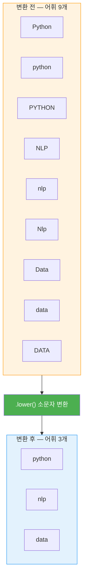
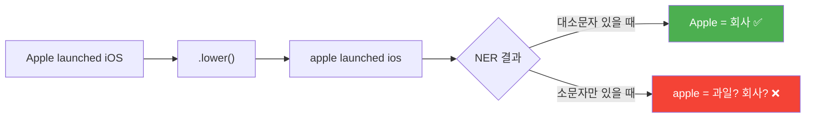
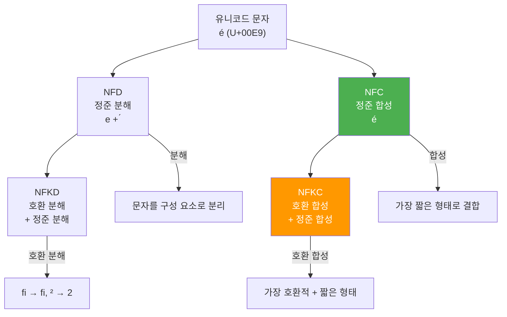
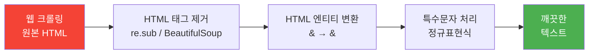
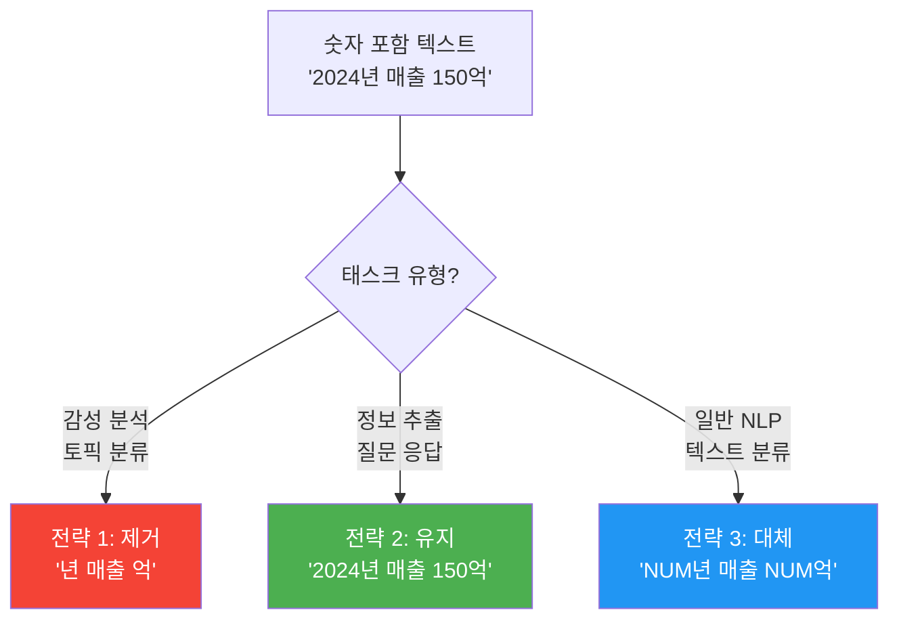
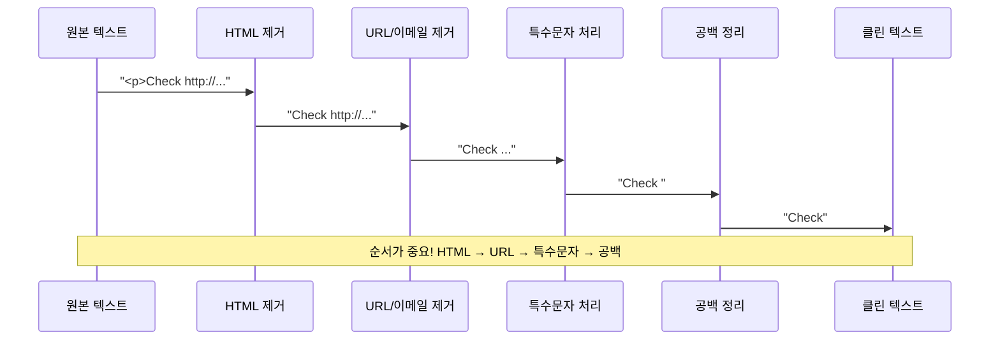
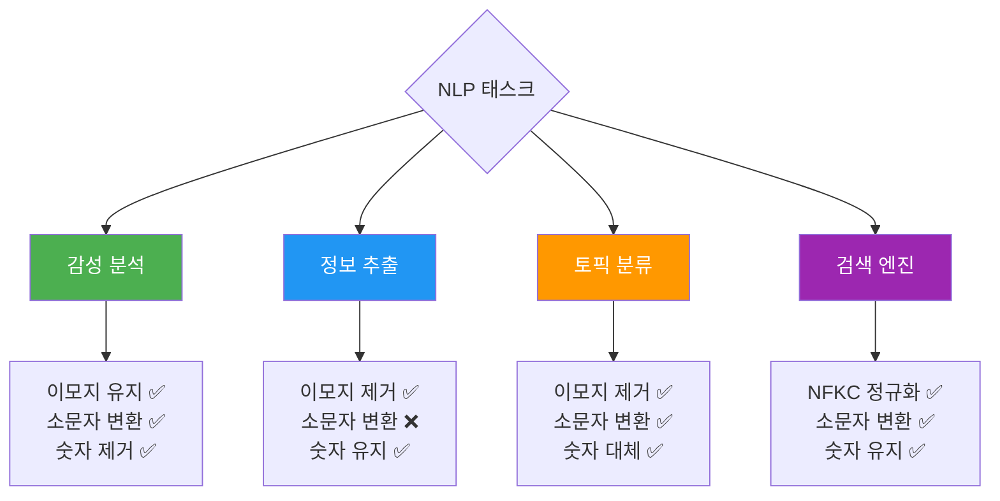

# 텍스트 정규화와 클리닝

> 토큰화된 텍스트를 일관된 형태로 변환하고, 노이즈를 제거하는 정규화와 클리닝 기법을 마스터합니다.

## 개요

이 섹션에서는 [토큰화의 기초](02-ch2-텍스트-전처리-토큰화와-정규화/01-01-토큰화의-기초.md)에서 분리한 토큰들을 **일관된 형태**로 변환하는 정규화(Normalization)와, 분석에 불필요한 노이즈를 제거하는 클리닝(Cleaning) 기법을 배웁니다.

**선수 지식**: 토큰화의 개념, Python 기본 문자열 메서드, 정규표현식 기초
**학습 목표**:
- 소문자 변환, 유니코드 정규화(NFC/NFD/NFKC/NFKD)의 차이를 이해하고 적용할 수 있다
- 정규표현식으로 HTML 태그, 특수문자, URL 등 노이즈를 제거할 수 있다
- 숫자 처리 전략(유지, 제거, 대체)을 상황에 맞게 선택할 수 있다
- 여러 클리닝 단계를 조합한 텍스트 전처리 함수를 구축할 수 있다

## 왜 알아야 할까?

실제 텍스트 데이터는 놀라울 정도로 **지저분합니다**. 웹 크롤링 데이터에는 HTML 태그가 섞여 있고, SNS 텍스트에는 이모지와 해시태그가 넘쳐나며, 같은 한글이라도 "가"가 NFC와 NFD 형식에서 다른 바이트 시퀀스로 저장될 수 있죠.

이 "더러운" 데이터를 그대로 모델에 넣으면 어떻게 될까요? "Python"과 "python"과 "PYTHON"이 모두 서로 다른 단어로 취급되고, "café"의 é가 시스템에 따라 1바이트일 수도, 2바이트일 수도 있어서 동일한 단어인데도 다르게 처리됩니다. 결국 어휘 사전은 불필요하게 부풀어 오르고, 모델 성능은 떨어집니다.

텍스트 정규화와 클리닝은 이런 혼돈에 **질서를 부여하는 과정**입니다. NLP 파이프라인에서 토큰화 바로 다음에 위치하며, 이후의 모든 분석 품질을 좌우하는 핵심 단계입니다.

## 핵심 개념

### 개념 1: 소문자 변환 — 가장 간단하지만 강력한 정규화

> 💡 **비유**: 도서관의 색인 카드를 생각해보세요. "Apple", "apple", "APPLE"을 모두 다른 항목으로 만들면 같은 주제의 책을 찾기가 세 배로 어려워집니다. 소문자 변환은 모든 색인 카드를 **소문자 하나로 통일**하는 것과 같습니다.

소문자 변환(Lowercasing)은 텍스트의 모든 대문자를 소문자로 바꾸는 가장 기본적인 정규화 기법입니다. 단순하지만, 어휘 사전 크기를 크게 줄여주는 효과가 있습니다.

> 📊 **그림 1**: 소문자 변환의 효과 — 어휘 사전 축소



```run:python
# 소문자 변환 기본 예제
texts = ["Python is GREAT", "I love NLP", "Data Science is FUN"]

for text in texts:
    print(f"원본: {text}")
    print(f"변환: {text.lower()}")
    print()
```

```output
원본: Python is GREAT
변환: python is great

원본: I love NLP
변환: i love nlp

원본: Data Science is FUN
변환: data science is fun

```

하지만 소문자 변환이 항상 정답은 아닙니다. **고유명사**(Apple 회사 vs apple 과일)나 **약어**(US, AI, NLP)의 의미가 달라질 수 있거든요. 특히 개체명 인식(NER) 태스크에서는 대소문자가 중요한 단서이므로, 소문자 변환을 생략하기도 합니다.

> 📊 **그림 2**: 소문자 변환이 문제가 되는 경우



> ⚠️ **흔한 오해**: "소문자 변환은 무조건 해야 한다"고 생각하기 쉽지만, BERT 같은 사전학습 모델은 **cased 버전**(대소문자 구분)과 **uncased 버전**(소문자 통일) 두 가지를 따로 제공합니다. 태스크에 따라 대소문자 정보가 오히려 중요할 수 있습니다.

### 개념 2: 유니코드 정규화 — 눈에 보이지 않는 차이 해결하기

> 💡 **비유**: 같은 "가" 글자를 쓰더라도, 어떤 사람은 한 획으로 쓰고(조합형), 어떤 사람은 자음 "ㄱ"과 모음 "ㅏ"를 따로 쓴 뒤 합칩니다(분해형). **눈에는 똑같아 보이지만** 컴퓨터 내부에서는 완전히 다른 바이트 시퀀스로 저장되어 있는 거죠. 유니코드 정규화는 이 "필기 스타일"을 하나로 통일하는 작업입니다.

유니코드에서 같은 문자를 표현하는 방법이 여러 가지 있을 수 있는데, 이를 **정규화 형식(Normalization Form)**으로 통일합니다. Python의 `unicodedata` 모듈이 네 가지 정규화 형식을 지원합니다.

> 📊 **그림 3**: 유니코드 정규화 네 가지 형식



| 형식 | 설명 | 예시 (é) | 용도 |
|------|------|----------|------|
| **NFD** | 정준 분해 (Canonical Decomposition) | e + ◌́ (2코드포인트) | 문자 분석, 악센트 제거 |
| **NFC** | 정준 합성 (Canonical Composition) | é (1코드포인트) | **일반적 텍스트 저장** (권장) |
| **NFKD** | 호환 분해 (Compatibility Decomposition) | e + ◌́ + 호환 변환 | 검색 인덱싱 |
| **NFKC** | 호환 합성 (Compatibility Composition) | é + 호환 변환 | **NLP 전처리** (권장) |

```run:python
import unicodedata

# 같은 "é"인데 내부 표현이 다른 경우
composed = "café"          # NFC: é가 단일 코드포인트
decomposed = "cafe\u0301"  # NFD: e + 결합용 악센트

print(f"조합형: {composed} → 길이 {len(composed)}, 바이트 {composed.encode('utf-8')}")
print(f"분해형: {decomposed} → 길이 {len(decomposed)}, 바이트 {decomposed.encode('utf-8')}")
print(f"눈에 같아 보이나? {composed} vs {decomposed}")
print(f"실제 같은가? {composed == decomposed}")
print()

# NFC로 통일
nfc_1 = unicodedata.normalize('NFC', composed)
nfc_2 = unicodedata.normalize('NFC', decomposed)
print(f"NFC 정규화 후 같은가? {nfc_1 == nfc_2}")
```

```output
조합형: café → 길이 4, 바이트 b'caf\xc3\xa9'
분해형: café → 길이 5, 바이트 b'cafe\xcc\x81'
눈에 같아 보이나? café vs café
실제 같은가? False

NFC 정규화 후 같은가? True
```

NFKC 정규화는 NFC보다 한 단계 더 적극적으로 문자를 변환합니다. 특히 NLP에서는 전각/반각 문자 통일, 합자(ligature) 분리 등에 유용합니다:

```run:python
import unicodedata

# NFKC가 유용한 사례들
examples = [
    ("finance", "합자(ligature) fi → fi"),
    ("Ｈｅｌｌｏ", "전각 영문 → 반각"),
    ("①②③", "원문자 숫자"),
    ("㈜삼성", "괄호 기호"),
]

for text, desc in examples:
    nfkc = unicodedata.normalize('NFKC', text)
    print(f"{desc}: '{text}' → '{nfkc}'")
```

```output
합자(ligature) fi → fi: 'finance' → 'finance'
전각 영문 → 반각: 'Ｈｅｌｌｏ' → 'Hello'
원문자 숫자: '①②③' → '123'
괄호 기호: '㈜삼성' → '(주)삼성'
```

한국어에서 유니코드 정규화가 특히 중요한 이유가 있습니다. macOS에서 생성된 파일명은 **NFD** 형식을 사용하는 반면, Windows와 웹은 대부분 **NFC**를 사용합니다. 그래서 macOS에서 작성된 한국어 텍스트가 다른 시스템에서 깨져 보이는 일이 종종 발생하죠.

### 개념 3: HTML 태그와 특수문자 제거

> 💡 **비유**: 웹에서 수집한 텍스트는 **포장지에 싸인 선물**과 같습니다. HTML 태그라는 포장지를 벗겨내야 진짜 내용물(텍스트)이 보이죠. `<b>중요</b>`에서 "중요"만 꺼내는 것이 HTML 클리닝입니다.

웹 크롤링이나 데이터 수집 과정에서 HTML 태그, CSS 스타일, JavaScript 코드 등이 텍스트에 섞여 들어올 수 있습니다. 이런 노이즈를 제거하는 방법은 크게 두 가지입니다.

> 📊 **그림 4**: HTML 클리닝 파이프라인



```python
import re
from html import unescape

# 웹에서 수집한 더러운 텍스트
raw_html = """
<div class="article">
    <h1>자연어 처리의 &amp; 미래</h1>
    <p>NLP는 <b>매우 중요한</b> 기술입니다.</p>
    <script>alert('hello');</script>
    <p>자세한 내용은 &lt;여기&gt;를 참조하세요.</p>
</div>
"""

# 1단계: HTML 태그 제거 (정규표현식)
clean = re.sub(r'<[^>]+>', '', raw_html)

# 2단계: HTML 엔티티 변환
clean = unescape(clean)

# 3단계: 연속 공백/줄바꿈 정리
clean = re.sub(r'\s+', ' ', clean).strip()

print(f"원본 길이: {len(raw_html)}자")
print(f"클리닝 후: {clean}")
print(f"클리닝 후 길이: {len(clean)}자")
```

위 결과를 보면 정규표현식만으로는 `<script>` 태그 안의 JavaScript 코드까지 깔끔하게 처리하지 못합니다. 더 견고한 처리를 원한다면 **BeautifulSoup** 라이브러리를 사용하는 것이 좋습니다:

```python
from bs4 import BeautifulSoup

# BeautifulSoup으로 HTML 파싱 — 더 안전하고 정확
soup = BeautifulSoup(raw_html, 'html.parser')

# script, style 태그 완전 제거
for tag in soup(['script', 'style']):
    tag.decompose()

# 텍스트만 추출
clean_text = soup.get_text(separator=' ', strip=True)
print(f"BeautifulSoup 결과: {clean_text}")
# 출력: 자연어 처리의 & 미래 NLP는 매우 중요한 기술입니다. 자세한 내용은 <여기>를 참조하세요.
```

그 외에 자주 제거하는 특수 패턴들을 정리하면:

```python
import re

def remove_special_patterns(text):
    """다양한 특수 패턴을 제거하는 함수"""
    # URL 제거
    text = re.sub(r'https?://\S+|www\.\S+', '', text)
    # 이메일 제거
    text = re.sub(r'\S+@\S+\.\S+', '', text)
    # 해시태그에서 # 제거 (단어는 유지)
    text = re.sub(r'#(\w+)', r'\1', text)
    # 멘션 제거
    text = re.sub(r'@\w+', '', text)
    # 이모지 제거 (유니코드 범위 기반)
    text = re.sub(r'[\U00010000-\U0010ffff]', '', text)
    # 연속된 공백 정리
    text = re.sub(r'\s+', ' ', text).strip()
    return text

sample = "Check https://example.com 🔥 #NLP @user email@test.com 정규화!"
print(remove_special_patterns(sample))
# 출력: Check NLP 정규화!
```

### 개념 4: 숫자 처리 전략

> 💡 **비유**: 요리 레시피에서 "200g의 밀가루"라는 문장을 생각해보세요. "200"이라는 숫자가 중요한 정보일까요? 레시피 분류라면 중요하지 않지만, 영양 정보 추출이라면 매우 중요하죠. 숫자를 어떻게 처리할지는 **무엇을 만들려는지**에 따라 달라집니다.

숫자 처리에는 세 가지 전략이 있으며, NLP 태스크에 따라 적절한 전략을 선택해야 합니다.

> 📊 **그림 5**: 숫자 처리 전략별 비교



```python
import re

text = "2024년 1분기 매출이 전년 대비 23.5% 증가하여 150억원을 달성했습니다."

# 전략 1: 숫자 완전 제거
no_numbers = re.sub(r'\d+\.?\d*', '', text)
print(f"제거: {re.sub(r' +', ' ', no_numbers).strip()}")

# 전략 2: 숫자 유지 (아무것도 하지 않음)
print(f"유지: {text}")

# 전략 3: 특수 토큰으로 대체
replaced = re.sub(r'\d+\.?\d*', '<NUM>', text)
print(f"대체: {replaced}")
```

대체 전략이 특히 효과적인 이유가 있습니다. "150억", "200억", "300억"이 모두 다른 토큰으로 처리되면 어휘 사전이 불필요하게 커지지만, 모두 `<NUM>억`으로 통일하면 **"숫자 + 억"이라는 패턴**을 학습할 수 있거든요.

### 개념 5: 정규표현식 활용 — 클리닝의 만능 도구

> 💡 **비유**: 정규표현식은 텍스트 세계의 **금속 탐지기**입니다. 해변(텍스트)에서 특정 패턴의 금속(문자열)만 정확하게 찾아내고 제거하거나 변환할 수 있죠. 다만 금속 탐지기를 능숙하게 다루려면 약간의 연습이 필요합니다.

텍스트 클리닝에서 가장 자주 사용하는 정규표현식 패턴들을 정리합니다:

```python
import re

# NLP 텍스트 클리닝에 유용한 정규표현식 패턴 모음
CLEANING_PATTERNS = {
    'html_tags': r'<[^>]+>',                          # HTML 태그
    'urls': r'https?://\S+|www\.\S+',                 # URL
    'emails': r'\S+@\S+\.\S+',                        # 이메일
    'emojis': r'[\U00010000-\U0010ffff]',              # 이모지
    'special_chars': r'[^\w\s가-힣]',                  # 특수문자 (한글/영문/숫자/공백 제외)
    'repeated_chars': r'(.)\1{2,}',                    # 반복 문자 (ㅋㅋㅋㅋ)
    'extra_spaces': r'\s+',                            # 연속 공백
    'numbers': r'\d+',                                 # 숫자
    'punctuation': r'[^\w\s]',                         # 구두점
    'hangul_jamo': r'[ㄱ-ㅎㅏ-ㅣ]+',                    # 한글 자모 단독 (ㅋㅋ, ㅎㅎ)
}

# 반복 문자 정규화 예시 (ㅋㅋㅋㅋㅋ → ㅋㅋ)
text = "이거 진짜 웃기다ㅋㅋㅋㅋㅋㅋ 대박!!!!!"
normalized = re.sub(r'(.)\1{2,}', r'\1\1', text)
print(f"원본: {text}")
print(f"정규화: {normalized}")
# 원본: 이거 진짜 웃기다ㅋㅋㅋㅋㅋㅋ 대박!!!!!
# 정규화: 이거 진짜 웃기다ㅋㅋ 대박!!
```

> 📊 **그림 6**: 정규표현식 기반 텍스트 클리닝 순서



순서에 주의하세요. HTML 태그를 먼저 제거한 다음 URL을 처리해야 합니다. 만약 순서가 바뀌면 `<a href="https://...">` 같은 태그 안의 URL이 먼저 제거되어 태그가 깨질 수 있습니다.

## 실습: 직접 해보기

실제 웹에서 수집한 것 같은 지저분한 텍스트를 단계별로 클리닝하는 완전한 파이프라인을 구축해봅시다.

```python
import re
import unicodedata
from html import unescape

def text_cleaning_pipeline(text, 
                           lowercase=True,
                           remove_html=True,
                           remove_urls=True,
                           remove_emails=True,
                           remove_emojis=True,
                           normalize_unicode='NFKC',
                           number_strategy='replace',
                           normalize_repeats=True,
                           remove_extra_spaces=True):
    """
    NLP를 위한 텍스트 클리닝 파이프라인
    
    Args:
        text: 입력 텍스트
        lowercase: 소문자 변환 여부
        remove_html: HTML 태그 제거 여부
        remove_urls: URL 제거 여부
        remove_emails: 이메일 제거 여부
        remove_emojis: 이모지 제거 여부
        normalize_unicode: 유니코드 정규화 형식 (NFC, NFD, NFKC, NFKD, None)
        number_strategy: 숫자 처리 ('keep', 'remove', 'replace')
        normalize_repeats: 반복 문자 정규화 여부
        remove_extra_spaces: 연속 공백 제거 여부
    
    Returns:
        클리닝된 텍스트
    """
    # 1단계: 유니코드 정규화 (가장 먼저!)
    if normalize_unicode:
        text = unicodedata.normalize(normalize_unicode, text)
    
    # 2단계: HTML 태그 및 엔티티 처리
    if remove_html:
        text = re.sub(r'<[^>]+>', ' ', text)  # 태그를 공백으로 대체
        text = unescape(text)                  # HTML 엔티티 변환
    
    # 3단계: URL 제거
    if remove_urls:
        text = re.sub(r'https?://\S+|www\.\S+', '', text)
    
    # 4단계: 이메일 제거
    if remove_emails:
        text = re.sub(r'\S+@\S+\.\S+', '', text)
    
    # 5단계: 이모지 제거
    if remove_emojis:
        text = re.sub(r'[\U00010000-\U0010ffff]', '', text)
    
    # 6단계: 숫자 처리
    if number_strategy == 'remove':
        text = re.sub(r'\d+\.?\d*', '', text)
    elif number_strategy == 'replace':
        text = re.sub(r'\d+\.?\d*', '<NUM>', text)
    
    # 7단계: 반복 문자 정규화 (ㅋㅋㅋㅋ → ㅋㅋ)
    if normalize_repeats:
        text = re.sub(r'(.)\1{2,}', r'\1\1', text)
    
    # 8단계: 소문자 변환
    if lowercase:
        text = text.lower()
    
    # 9단계: 연속 공백 정리 (항상 마지막에)
    if remove_extra_spaces:
        text = re.sub(r'\s+', ' ', text).strip()
    
    return text


# === 테스트 ===
dirty_texts = [
    '<p>Check out https://openai.com for <b>GPT-4</b>! 🔥🔥🔥</p>',
    '2024년 매출이 150억원!!!!! 대박ㅋㅋㅋㅋㅋ contact@company.com',
    'Ｈｅｌｌｏ　Ｗｏｒｌｄ — café vs cafe\u0301',
]

print("=" * 60)
print("텍스트 클리닝 파이프라인 결과")
print("=" * 60)

for i, text in enumerate(dirty_texts, 1):
    cleaned = text_cleaning_pipeline(text)
    print(f"\n[텍스트 {i}]")
    print(f"  원본:   {text}")
    print(f"  클리닝: {cleaned}")
```

이 파이프라인의 각 단계를 켜고 끄면서 태스크에 맞게 조정할 수 있습니다. 예를 들어, 감성 분석에서는 이모지가 유용한 신호일 수 있으므로 `remove_emojis=False`로 설정하면 됩니다.

> 📊 **그림 7**: 태스크별 권장 파이프라인 설정



## 더 깊이 알아보기

### 유니코드 정규화의 탄생 — 왜 같은 글자가 여러 방식으로 존재할까?

유니코드 정규화가 필요하게 된 배경에는 흥미로운 역사가 있습니다. 1991년 유니코드 1.0이 발표되었을 때, 각국의 기존 문자 인코딩 체계(KS C 5601, JIS X 0208 등)와의 **호환성**을 유지해야 했습니다. 그래서 이미 조합된 형태의 문자(é)와 분해된 형태(e + ◌́)를 **모두 수용**하는 타협안이 나왔죠.

이 결정은 유니코드의 보편성을 확보하는 데 큰 기여를 했지만, 동시에 "같은 글자인데 다른 바이트"라는 골치 아픈 문제를 만들었습니다. 결국 1996년 유니코드 3.0에서 **네 가지 정규화 형식(NFC, NFD, NFKC, NFKD)**이 공식 표준으로 도입되었고, 이는 지금까지 텍스트 처리의 기본 규칙으로 자리잡고 있습니다.

특히 한국어에서는 macOS가 파일명에 **NFD**를 사용하는 반면, Windows와 대부분의 웹 서비스는 **NFC**를 사용하기 때문에, Mac에서 만든 한글 파일명이 Windows에서 깨져 보이는 문제가 한국 개발자들 사이에서 유명한 이슈입니다. 이 문제는 Apple이 HFS+ 파일 시스템에서 NFD를 채택한 것에서 비롯되었습니다.

### 정규표현식의 기원 — 수학자의 발명이 프로그래밍의 필수 도구가 되기까지

정규표현식(Regular Expression)의 역사도 흥미롭습니다. 1956년 수학자 **스티븐 클리니(Stephen Kleene)**가 "정규 집합(regular sets)"이라는 수학적 개념을 발표했는데, 이것이 정규표현식의 이론적 기초가 됩니다. 이후 1968년 **켄 톰프슨(Ken Thompson)**이 이 이론을 유닉스의 텍스트 편집기 `ed`에 구현하면서, 정규표현식은 이론에서 실용 도구로 탈바꿈했습니다. `grep` 명령어의 이름 자체가 `ed`의 명령어 `g/re/p`(global/regular expression/print)에서 유래한 것이죠.

## 흔한 오해와 팁

> ⚠️ **흔한 오해**: "정규화 순서는 중요하지 않다"고 생각할 수 있지만, 실제로는 **순서가 결과를 바꿉니다**. 예를 들어, HTML 엔티티(`&amp;`)를 먼저 변환하지 않고 특수문자를 제거하면 `&amp;`가 `amp`로 남게 됩니다. 유니코드 정규화 → HTML 처리 → 특수문자 순서를 지키세요.

> 💡 **알고 계셨나요?**: Python의 `str.lower()` 메서드는 단순히 A-Z를 a-z로 바꾸는 것이 아닙니다. 유니코드 전체에 대해 소문자 변환을 수행하므로, 독일어의 "ß"(에스체트)는 `"ß".upper()`하면 "SS"가 되지만 다시 `"SS".lower()`하면 "ss"가 됩니다. **대소문자 변환은 항상 가역적이지 않습니다**. 더 강력한 비교가 필요하면 `str.casefold()`를 사용하세요.

> 🔥 **실무 팁**: 실무에서는 클리닝 함수를 만들 때 **원본 데이터를 절대 덮어쓰지 마세요**. 항상 새 컬럼이나 새 파일에 저장하세요. 클리닝 규칙을 잘못 적용해서 중요한 정보를 날리면, 원본이 없으면 복구가 불가능합니다. Pandas라면 `df['clean_text'] = df['raw_text'].apply(cleaning_fn)` 패턴을 사용하세요.

## 핵심 정리

| 개념 | 설명 |
|------|------|
| 소문자 변환 | `text.lower()`로 대소문자 통일. NER 등에서는 생략 가능 |
| 유니코드 정규화 | `unicodedata.normalize()`로 동일 문자의 다른 표현을 통일. NLP에는 NFKC 권장 |
| HTML 클리닝 | 정규표현식(`re.sub`)이나 BeautifulSoup으로 태그/엔티티 제거 |
| 특수문자 제거 | URL, 이메일, 이모지, 해시태그 등 태스크에 맞게 선택적 제거 |
| 숫자 처리 | 유지/제거/대체(`<NUM>`) 중 태스크에 따라 전략 선택 |
| 반복 문자 정규화 | `(.)\1{2,}` 패턴으로 과도한 반복을 축소 |
| 처리 순서 | 유니코드 → HTML → URL → 특수문자 → 숫자 → 소문자 → 공백 순서 권장 |

## 다음 섹션 미리보기

텍스트를 깨끗하게 정규화했으니, 다음은 [불용어 처리](02-ch2-텍스트-전처리-토큰화와-정규화/03-03-불용어-처리.md)를 배웁니다. "은", "는", "이", "가" 같은 빈번하지만 의미 분석에 기여하지 않는 단어를 어떻게 식별하고 제거하는지, 그리고 불용어 제거가 **항상 좋은 것은 아닌** 경우를 알아봅니다.

## 참고 자료

- [Python unicodedata 공식 문서](https://docs.python.org/3/library/unicodedata.html) - 유니코드 정규화 함수와 문자 데이터베이스의 공식 레퍼런스
- [spaCy 101: Everything you need to know](https://spacy.io/usage/spacy-101) - spaCy의 텍스트 전처리와 파이프라인 구조 공식 가이드
- [scikit-learn Text Feature Extraction](https://scikit-learn.org/stable/modules/feature_extraction.html) - 텍스트 벡터화 시 전처리 옵션과 파라미터 설명
- [Text Normalization: Unicode Forms, Case Folding & Whitespace Handling for NLP](https://mbrenndoerfer.com/writing/text-normalization-unicode-nlp) - 유니코드 정규화와 대소문자 처리의 실전 가이드
- [Python 정규표현식 HOWTO](https://docs.python.org/3/howto/regex.html) - 텍스트 패턴 매칭의 공식 튜토리얼

---
### 🔗 Related Sessions
- [토큰화](02-ch2-텍스트-전처리-토큰화와-정규화/01-01-토큰화의-기초.md) (prerequisite)
- [토큰](02-ch2-텍스트-전처리-토큰화와-정규화/01-01-토큰화의-기초.md) (prerequisite)
