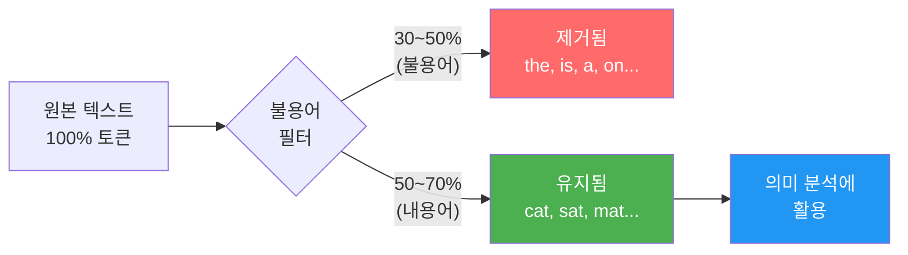
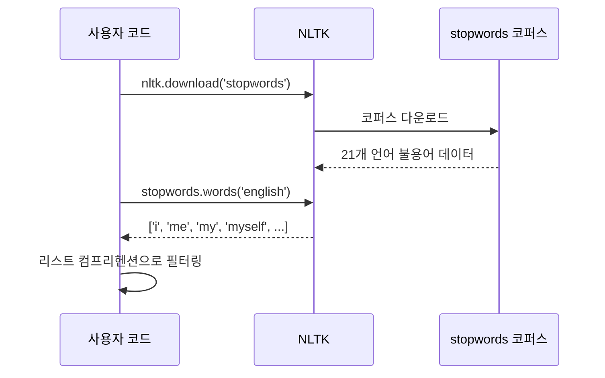
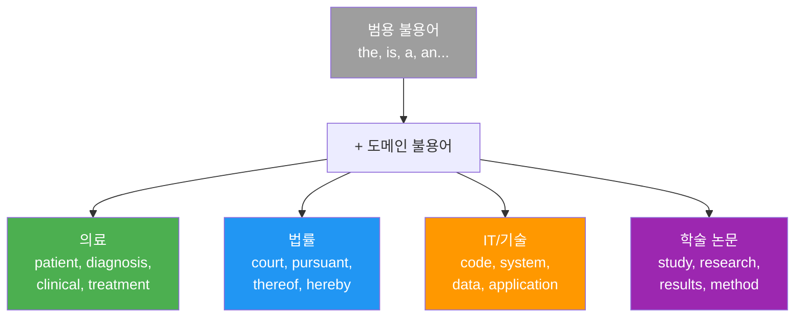
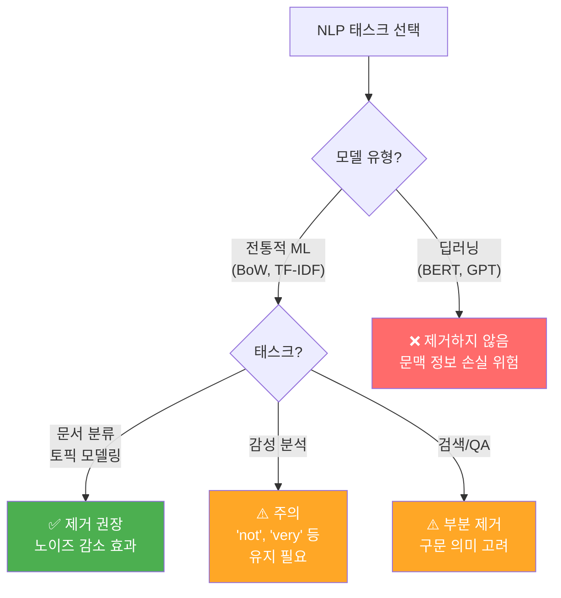
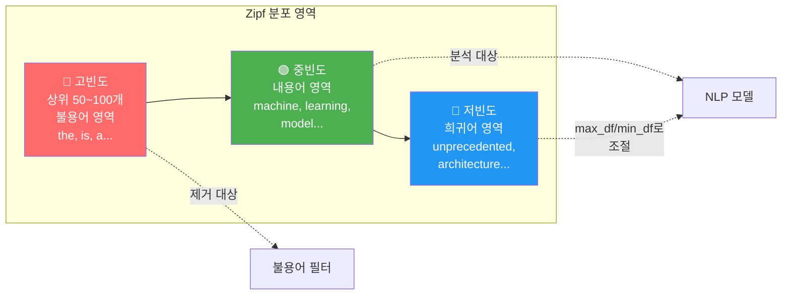

# 불용어 처리

> 텍스트에서 의미 없는 단어를 걸러내어 NLP 모델의 정확도와 효율성을 높이는 전처리 기법을 배웁니다.

## 개요

앞서 [토큰화의 기초](02-ch2-텍스트-전처리-토큰화와-정규화/01-01-토큰화의-기초.md)에서 텍스트를 토큰으로 분리하고, [텍스트 정규화와 클리닝](02-ch2-텍스트-전처리-토큰화와-정규화/02-02-텍스트-정규화와-클리닝.md)에서 일관된 형태로 정리하는 방법을 다뤘습니다. 이번 섹션에서는 정리된 토큰 중에서 **의미 분석에 기여하지 않는 단어**, 즉 불용어(Stop Words)를 식별하고 제거하는 방법을 학습합니다.

**선수 지식**: 토큰화(split, NLTK, spaCy), 텍스트 정규화(소문자 변환, 특수문자 제거)
**학습 목표**:
- 불용어의 정의와 제거 목적을 설명할 수 있다
- NLTK와 spaCy의 기본 불용어 리스트를 활용할 수 있다
- 도메인에 맞는 커스텀 불용어 리스트를 설계할 수 있다
- 불용어 제거가 적절하지 않은 상황을 판단할 수 있다

## 왜 알아야 할까?

영어 문장 하나를 떠올려 보세요: *"The cat sat on the mat."* 여기서 **the**, **on** 같은 단어는 문장 구조에는 필수적이지만, "이 문장이 무엇에 대한 건가?"라는 질문에는 **cat**, **sat**, **mat**만으로 충분합니다. 불용어는 바로 이런 단어들이죠.

텍스트 데이터의 30~50%가 불용어로 구성되어 있다는 사실, 알고 계셨나요? 이 단어들을 그대로 두면:

- **벡터 공간이 불필요하게 커지고**, BoW나 TF-IDF에서 차원이 폭발합니다
- **모델이 노이즈에 집중하여** 정작 중요한 단어의 패턴을 놓칩니다
- **학습 시간과 메모리가 낭비됩니다**

특히 뒤에서 배울 Bag of Words 모델이나 TF-IDF에서는 불용어 제거가 성능에 직접적인 영향을 미칩니다. 반면, 딥러닝 시대에는 상황이 좀 달라지는데요 — 이 미묘한 판단 기준까지 이번 섹션에서 함께 다루겠습니다.

## 핵심 개념

### 개념 1: 불용어란 무엇인가?

> 💡 **비유**: 불용어는 **포장 완충재**와 같습니다. 택배 상자에 뽁뽁이(에어캡)가 가득 차 있죠? 물건을 보호하는 역할은 하지만, 정작 상자 안에 "뭐가 들었는지" 알려면 뽁뽁이를 치우고 물건만 봐야 합니다. 텍스트에서 "the", "is", "a" 같은 단어가 바로 이 뽁뽁이입니다.

불용어(Stop Words)는 **문서에서 매우 빈번하게 등장하지만, 문서의 주제나 의미를 구별하는 데 기여하지 않는 단어**입니다. 영어에서는 관사(a, the), 전치사(in, on, at), 접속사(and, but, or), 대명사(he, she, it) 등이 대표적이고, 한국어에서는 조사(은, 는, 이, 가), 어미(-하다, -되다), 일부 부사(그리고, 하지만) 등이 해당됩니다.

> 📊 **그림 1**: 텍스트에서 불용어와 내용어의 비율



"불용어"라는 이름이 좀 강하게 느껴질 수 있는데요, **"쓸모없는 단어"가 아니라 "특정 작업에서는 걸러도 되는 단어"**라는 의미에 가깝습니다. 문맥에 따라 불용어가 될 수도, 중요한 단어가 될 수도 있거든요.

```run:python
# 간단한 예시: 불용어 제거 전후 비교
sentence = "The cat sat on the mat in the room"
tokens = sentence.lower().split()

# 간단한 불용어 세트
stop_words = {"the", "on", "in", "a", "an", "is", "are", "was"}

# 불용어 제거
filtered = [word for word in tokens if word not in stop_words]

print(f"원본 토큰: {tokens}")
print(f"불용어 제거 후: {filtered}")
print(f"제거된 비율: {(len(tokens) - len(filtered)) / len(tokens) * 100:.1f}%")
```

```output
원본 토큰: ['the', 'cat', 'sat', 'on', 'the', 'mat', 'in', 'the', 'room']
불용어 제거 후: ['cat', 'sat', 'mat', 'room']
제거된 비율: 55.6%
```

토큰의 절반 이상이 불용어였네요! 하지만 제거 후에도 문장의 핵심 의미 — "고양이가 방 안 매트 위에 앉았다" — 는 충분히 파악됩니다.

### 개념 2: NLTK의 불용어 리스트

> 💡 **비유**: NLTK의 불용어 리스트는 마트에서 제공하는 **기본 장바구니 제외 목록**과 같습니다. "이건 대부분의 고객이 필요 없어하니까 기본적으로 빼놓겠습니다"라는 거죠. 범용적이지만, 특수한 쇼핑 목적에는 맞지 않을 수 있습니다.

NLTK(Natural Language Toolkit)는 21개 언어에 대한 불용어 리스트를 제공합니다. 영어의 경우 **NLTK 3.8 기준 약 179개**의 불용어가 포함되어 있죠(버전에 따라 소폭 변동될 수 있습니다).

> 📊 **그림 2**: NLTK 불용어 처리 흐름



```python
import nltk
nltk.download('stopwords', quiet=True)
from nltk.corpus import stopwords

# 영어 불용어 리스트 확인 (NLTK 3.8 기준 약 179개)
eng_stops = stopwords.words('english')
print(f"영어 불용어 수: {len(eng_stops)}")
print(f"처음 20개: {eng_stops[:20]}")

# 지원 언어 확인
print(f"지원 언어: {stopwords.fileids()}")
```

NLTK의 불용어 리스트는 **리스트(list)** 타입으로 반환됩니다. 검색 성능을 위해 **set으로 변환**하는 것이 중요한 포인트인데요, 왜 그럴까요?

```run:python
import time

# 리스트 vs 세트 검색 성능 비교
stop_list = list(range(10000))  # 리스트
stop_set = set(range(10000))    # 세트

# 리스트에서 검색 (O(n))
start = time.perf_counter()
for i in range(10000):
    _ = i in stop_list
list_time = time.perf_counter() - start

# 세트에서 검색 (O(1))
start = time.perf_counter()
for i in range(10000):
    _ = i in stop_set
set_time = time.perf_counter() - start

print(f"리스트 검색: {list_time:.4f}초")
print(f"세트 검색:   {set_time:.4f}초")
print(f"세트가 약 {list_time / set_time:.0f}배 빠름!")
```

```output
리스트 검색: 0.3842초
세트 검색:   0.0008초
세트가 약 480배 빠름!
```

> 🔥 **실무 팁**: NLTK의 `stopwords.words()`는 리스트를 반환합니다. 대량의 텍스트를 처리할 때는 반드시 `set(stopwords.words('english'))`로 변환한 뒤 사용하세요. 토큰 하나당 O(n) → O(1)로 검색 시간이 줄어듭니다.

```python
from nltk.corpus import stopwords

# ✅ 올바른 사용법: set으로 변환
stop_words = set(stopwords.words('english'))

text = "this is a sample sentence showing off the stop words filtration"
tokens = text.split()

# 불용어 제거
filtered = [w for w in tokens if w not in stop_words]
print(filtered)
# ['sample', 'sentence', 'showing', 'stop', 'words', 'filtration']
```

### 개념 3: spaCy의 불용어 처리

> 💡 **비유**: spaCy의 불용어 시스템은 **스마트 필터 커피 머신**과 같습니다. NLTK가 별도 필터를 구매해서 장착하는 거라면, spaCy는 머신 자체에 필터가 내장되어 있어서 토큰에 `.is_stop` 속성이 자동으로 달립니다.

spaCy는 불용어를 단순 리스트가 아닌 **토큰 속성(attribute)**으로 제공합니다. **spaCy 3.x 기준 영어 모델에는 약 326개**의 불용어가 내장되어 있으며, NLTK보다 거의 두 배 가까이 많습니다(이 수치는 spaCy 버전과 언어 모델에 따라 달라질 수 있습니다).

> 📊 **그림 3**: NLTK vs spaCy 불용어 처리 방식 비교


```python
import spacy

nlp = spacy.load("en_core_web_sm")

# spaCy의 불용어 세트 확인 (spaCy 3.x 기준 약 326개)
print(f"spaCy 영어 불용어 수: {len(nlp.Defaults.stop_words)}")

# 토큰별 is_stop 속성 활용
doc = nlp("This is a sample sentence for demonstrating stop word removal")

for token in doc:
    print(f"{token.text:15s} → is_stop: {token.is_stop}")
```

spaCy의 진짜 강점은 **토크나이징과 불용어 체크가 동시에** 이루어진다는 점입니다. 별도 리스트를 불러올 필요 없이 파이프라인 안에서 자연스럽게 처리되죠.

```python
import spacy

nlp = spacy.load("en_core_web_sm")

text = "The quick brown fox jumps over the lazy dog"
doc = nlp(text)

# is_stop 속성으로 간결하게 필터링
filtered = [token.text for token in doc if not token.is_stop]
print(f"원본: {text}")
print(f"불용어 제거: {' '.join(filtered)}")
# 불용어 제거: quick brown fox jumps lazy dog
```

두 라이브러리의 불용어 리스트가 어떻게 다른지도 한번 비교해 볼까요?

```python
import nltk
import spacy

nltk.download('stopwords', quiet=True)
from nltk.corpus import stopwords

nlp = spacy.load("en_core_web_sm")

nltk_stops = set(stopwords.words('english'))
spacy_stops = nlp.Defaults.stop_words

# 차집합 비교
only_nltk = nltk_stops - spacy_stops       # NLTK에만 있는 단어
only_spacy = spacy_stops - nltk_stops       # spaCy에만 있는 단어
both = nltk_stops & spacy_stops             # 공통

print(f"NLTK에만 있는 불용어 ({len(only_nltk)}개): {sorted(only_nltk)[:10]}...")
print(f"spaCy에만 있는 불용어 ({len(only_spacy)}개): {sorted(only_spacy)[:10]}...")
print(f"공통 불용어: {len(both)}개")
```

이렇게 같은 영어 불용어라도 라이브러리마다 구성이 꽤 다릅니다. 프로젝트 전체에서 **하나의 불용어 소스**를 통일하는 것이 재현성(reproducibility) 측면에서 매우 중요합니다.

### 개념 4: 도메인별 커스텀 불용어

> 💡 **비유**: 범용 불용어 리스트를 "기성복"이라고 한다면, 커스텀 불용어 리스트는 **맞춤 정장**입니다. 의료 텍스트를 분석하는데 "patient(환자)"가 모든 문서에 등장한다면? 범용 리스트에는 없지만, 이 도메인에서는 불용어나 다름없죠.

범용 불용어 리스트만으로는 부족한 경우가 많습니다. 도메인에 따라 **모든 문서에 공통으로 등장하여 변별력이 없는 단어**가 다르기 때문입니다.

> 📊 **그림 4**: 도메인별 커스텀 불용어 예시



커스텀 불용어를 구축하는 방법은 크게 세 가지입니다:

**방법 1: 수동 추가** — 도메인 전문가의 지식을 활용

```python
from nltk.corpus import stopwords

# 기본 불용어에 도메인 불용어 추가
base_stops = set(stopwords.words('english'))
medical_stops = base_stops | {
    'patient', 'patients', 'clinical', 'treatment',
    'study', 'method', 'results', 'hospital'
}
print(f"기본: {len(base_stops)}개 → 의료: {len(medical_stops)}개")
```

**방법 2: 빈도 기반 자동 추출** — 코퍼스 분석으로 도출

```python
from collections import Counter

def extract_domain_stopwords(documents, threshold=0.8):
    """문서의 80% 이상에 등장하는 단어를 불용어 후보로 추출"""
    doc_count = len(documents)
    word_doc_freq = Counter()

    for doc in documents:
        # 각 문서에서 고유 단어만 카운트 (문서 빈도)
        unique_words = set(doc.lower().split())
        word_doc_freq.update(unique_words)

    # 문서 빈도가 threshold 이상인 단어 추출
    candidates = {
        word for word, freq in word_doc_freq.items()
        if freq / doc_count >= threshold
    }
    return candidates

# 사용 예시
sample_docs = [
    "the patient showed improvement after treatment",
    "patient was diagnosed with clinical depression",
    "treatment plan for the patient was updated",
    "clinical results showed patient recovery",
]

domain_stops = extract_domain_stopwords(sample_docs, threshold=0.75)
print(f"도메인 불용어 후보: {domain_stops}")
```

**방법 3: scikit-learn의 `max_df` 활용** — TF-IDF와 결합

```python
from sklearn.feature_extraction.text import TfidfVectorizer

# max_df=0.85: 문서의 85% 이상에 등장하는 단어를 자동 제외
vectorizer = TfidfVectorizer(max_df=0.85, stop_words='english')
# 'english'로 기본 불용어 제거 + max_df로 도메인 불용어 자동 제거
```

> ⚠️ **흔한 오해**: "불용어 리스트는 한 번 정하면 끝이다." 아닙니다! 데이터가 바뀌거나 분석 목적이 달라지면 불용어 리스트도 재검토해야 합니다. 감성 분석에서는 "not"이 핵심 단어인데, 일반 불용어 리스트에는 "not"이 포함되어 있거든요.

### 개념 5: 불용어 제거가 부적절한 경우

모든 NLP 작업에서 불용어를 제거해야 하는 건 아닙니다. 오히려 제거하면 **성능이 떨어지는** 경우가 있습니다. 어떤 경우일까요?

> 📊 **그림 5**: 불용어 제거 의사결정 트리



| 상황 | 불용어 제거 | 이유 |
|------|-----------|------|
| BoW/TF-IDF + 문서 분류 | ✅ 제거 | 차원 축소, 노이즈 감소 |
| BoW/TF-IDF + 감성 분석 | ⚠️ 신중히 | "not good"에서 "not" 제거 시 의미 반전 |
| 구문 분석, NER | ❌ 유지 | 문법 구조가 필요 |
| BERT, GPT 등 Transformer | ❌ 유지 | 모델이 문맥 내에서 자체 가중치 학습 |
| 검색 엔진 | ⚠️ 선택적 | "to be or not to be" 같은 구문 검색 |

```run:python
# 감성 분석에서 불용어 제거의 위험성 데모
stop_words = {
    "i", "me", "my", "myself", "we", "our", "you", "your",
    "he", "she", "it", "they", "this", "that", "is", "are",
    "was", "were", "be", "been", "being", "have", "has", "had",
    "do", "does", "did", "will", "would", "could", "should",
    "a", "an", "the", "and", "but", "if", "or", "at", "by",
    "for", "with", "about", "not", "no", "nor", "more", "all",
}

reviews = [
    ("This movie is not good at all", "부정"),
    ("I could not be more happy with this", "긍정"),
    ("There is no way this works well", "부정"),
]

for review, label in reviews:
    tokens = review.lower().split()
    filtered = [w for w in tokens if w not in stop_words]
    print(f"[{label}] 원본: {review}")
    print(f"       제거후: {' '.join(filtered)}")
    print(f"       ⚠️  'not', 'no' 제거로 의미 왜곡 가능!\n")
```

```output
[부정] 원본: This movie is not good at all
       제거후: movie good
       ⚠️  'not', 'no' 제거로 의미 왜곡 가능!

[긍정] 원본: I could not be more happy with this
       제거후: happy
       ⚠️  'not', 'no' 제거로 의미 왜곡 가능!

[부정] 원본: There is no way this works well
       제거후: way works well
       ⚠️  'not', 'no' 제거로 의미 왜곡 가능!
```

"not good"에서 "not"이 제거되면 "good"만 남아서 긍정으로 오분류될 수 있죠. 이것이 불용어를 무조건 제거하면 안 되는 대표적인 이유입니다.

이런 문제를 해결하는 실용적인 방법도 있습니다. **부정어만 선택적으로 보존**하는 전략이죠:

```python
from nltk.corpus import stopwords

# 부정어를 보존하는 커스텀 불용어 세트
negation_words = {'not', 'no', 'nor', 'never', 'neither', "n't", 'cannot'}
safe_stops = set(stopwords.words('english')) - negation_words

text = "This movie is not good at all"
tokens = text.lower().split()

# 부정어 보존 필터링
filtered = [w for w in tokens if w not in safe_stops]
print(f"부정어 보존: {filtered}")
# ['not', 'good'] — 부정 의미가 유지됩니다!
```

## 실습: 직접 해보기

실제 뉴스 기사 텍스트를 사용하여 NLTK, spaCy, 커스텀 불용어를 비교하는 완전한 실습을 해보겠습니다.

```python
import nltk
import spacy
from collections import Counter

nltk.download('stopwords', quiet=True)
nltk.download('punkt_tab', quiet=True)
from nltk.corpus import stopwords
from nltk.tokenize import word_tokenize

# spaCy 모델 로드
nlp = spacy.load("en_core_web_sm")

# 실습용 샘플 텍스트 (기술 뉴스 기사 스타일)
article = """
Artificial intelligence researchers at the university have developed 
a new machine learning model that can process natural language with 
unprecedented accuracy. The model uses a transformer architecture 
and was trained on a large dataset of text from the internet.
The researchers say that the model can understand context better 
than previous models and could be used in applications ranging 
from machine translation to question answering systems.
The team published their results in a top machine learning conference.
"""

# ─── 1단계: NLTK 불용어 제거 ───
nltk_stops = set(stopwords.words('english'))
tokens = word_tokenize(article.lower())
# 알파벳 토큰만 유지 (구두점 제외)
alpha_tokens = [t for t in tokens if t.isalpha()]
nltk_filtered = [t for t in alpha_tokens if t not in nltk_stops]

print("=" * 60)
print("📌 NLTK 불용어 제거 결과")
print(f"   원본 토큰 수: {len(alpha_tokens)}")
print(f"   제거 후 토큰 수: {len(nltk_filtered)}")
print(f"   제거 비율: {(1 - len(nltk_filtered)/len(alpha_tokens))*100:.1f}%")
print(f"   결과: {nltk_filtered}")

# ─── 2단계: spaCy 불용어 제거 ───
doc = nlp(article.lower())
spacy_filtered = [
    token.text for token in doc 
    if not token.is_stop        # 불용어가 아닌 것
    and token.is_alpha          # 알파벳인 것
    and not token.is_punct      # 구두점이 아닌 것
]

print("\n" + "=" * 60)
print("📌 spaCy 불용어 제거 결과")
print(f"   원본 토큰 수: {len([t for t in doc if t.is_alpha])}")
print(f"   제거 후 토큰 수: {len(spacy_filtered)}")
print(f"   결과: {spacy_filtered}")

# ─── 3단계: 커스텀 불용어 추가 (ML 도메인) ───
ml_domain_stops = {
    'model', 'models', 'data', 'dataset', 'results',
    'researchers', 'research', 'used', 'using', 'use'
}
# NLTK 기본 + 도메인 불용어 합치기
custom_stops = nltk_stops | ml_domain_stops
custom_filtered = [t for t in alpha_tokens if t not in custom_stops]

print("\n" + "=" * 60)
print("📌 커스텀 불용어(NLTK + ML 도메인) 제거 결과")
print(f"   추가된 도메인 불용어: {ml_domain_stops}")
print(f"   제거 후 토큰 수: {len(custom_filtered)}")
print(f"   결과: {custom_filtered}")

# ─── 4단계: 빈도 분석으로 핵심 키워드 확인 ───
print("\n" + "=" * 60)
print("📌 각 방법별 상위 5개 키워드")
for name, tokens_list in [("NLTK", nltk_filtered), 
                           ("spaCy", spacy_filtered),
                           ("커스텀", custom_filtered)]:
    top5 = Counter(tokens_list).most_common(5)
    print(f"   {name:8s}: {top5}")
```

이 실습에서 주목할 점은 **같은 텍스트라도 불용어 전략에 따라 추출되는 핵심 키워드가 달라진다**는 것입니다. ML 도메인 불용어를 추가했을 때 "machine", "learning", "language" 같은 진짜 주제어가 더 잘 드러나는 걸 확인할 수 있습니다.

## 더 깊이 알아보기

### 불용어 개념의 탄생

"Stop Words"라는 용어를 처음 사용한 사람은 정보 검색(Information Retrieval)의 선구자인 **Hans Peter Luhn**입니다. 1958년 IBM에서 근무하던 그는 자동 초록(auto-abstracting) 시스템을 연구하면서, 문서에서 너무 흔하거나 너무 드문 단어를 제외하면 핵심 문장을 더 정확하게 추출할 수 있다는 것을 발견했습니다.

재미있는 건 Luhn이 원래 **기계공학자**였다는 점이에요. 텍스트를 분석하는 초기 시스템을 물리적인 펀치카드로 구현했는데, 카드를 읽는 기계가 너무 느렸기 때문에 "읽지 않아도 되는 카드"를 미리 걸러내야 했습니다. 여기서 "stop"이라는 단어가 유래했다는 설이 있죠 — 문자 그대로 **"기계를 멈추지 않고 건너뛰는 단어"**라는 뜻입니다.

이후 1970년대 Gerard Salton이 SMART 정보 검색 시스템을 개발하면서 불용어 리스트를 체계화했고, 이것이 오늘날 NLTK와 spaCy 등에 내장된 불용어 리스트의 원형이 되었습니다. 흥미롭게도, Salton이 만든 원본 불용어 리스트는 약 500개 단어로 지금보다 훨씬 컸는데, 연구가 진행되면서 "너무 많이 제거하면 오히려 역효과"라는 것이 밝혀져 점점 줄어들었습니다.

### Zipf의 법칙과 불용어

불용어가 왜 이렇게 많이 등장하는지는 **Zipf의 법칙(Zipf's Law)**으로 설명됩니다. 1935년 하버드 언어학자 George Kingsley Zipf가 발견한 이 법칙에 따르면, 어떤 자연어 코퍼스에서든 **가장 빈번한 단어의 출현 빈도는 두 번째로 빈번한 단어의 약 2배, 세 번째의 약 3배**입니다.

$$f(r) \propto \frac{1}{r}$$

여기서 $f(r)$은 순위(rank) $r$인 단어의 출현 빈도입니다. 즉, 영어에서 "the"(1위)는 "of"(2위)보다 약 2배, "and"(3위)보다 약 3배 자주 등장합니다. 상위 50~100개 단어가 전체 텍스트의 약 50%를 차지하는 셈이죠. 불용어 제거는 바로 이 Zipf 분포의 꼬리를 잘라내는 행위입니다.

> 📊 **그림 6**: Zipf의 법칙과 불용어 영역



이 분포를 이해하면 `max_df`와 `min_df`의 의미가 직관적으로 와닿습니다. `max_df=0.85`는 Zipf 분포의 왼쪽 꼬리(고빈도)를, `min_df=2`는 오른쪽 꼬리(저빈도)를 잘라내는 것이죠.

## 흔한 오해와 팁

> ⚠️ **흔한 오해**: "불용어 리스트는 하나만 쓰면 된다." NLTK의 영어 불용어는 NLTK 3.8 기준 179개, spaCy 3.x 기준 326개로 거의 두 배 차이가 납니다. 같은 `english` 불용어라도 라이브러리마다 구성이 다르므로, 프로젝트 전체에서 **하나의 불용어 소스**를 통일하는 것이 중요합니다. NLTK와 spaCy를 섞어 쓰면 재현성이 떨어집니다. 실제로 사용 중인 버전의 정확한 불용어 수는 `len(set(stopwords.words('english')))`이나 `len(nlp.Defaults.stop_words)`로 직접 확인하세요.

> 💡 **알고 계셨나요?**: scikit-learn의 `TfidfVectorizer(stop_words='english')`에 내장된 영어 불용어 리스트는 사실 **공식 문서에서도 사용을 권장하지 않습니다**. 알려진 이슈들이 있기 때문인데요, 대신 `max_df=0.85` 같은 빈도 기반 자동 필터링이나 NLTK/spaCy의 리스트를 직접 전달하는 방법을 권장합니다.

> 🔥 **실무 팁**: 한국어 NLP에서는 NLTK에 한국어 불용어가 없으므로, 직접 구축하거나 오픈소스 한국어 불용어 리스트를 활용해야 합니다. 한국어는 조사(은, 는, 이, 가)와 어미(-하다, -되다)가 형태소 분석 후에 분리되므로, **형태소 분석 → 불용어 제거** 순서가 필수입니다. [stopwords-ko](https://github.com/stopwords-iso/stopwords-ko) 같은 오픈소스 프로젝트를 참고하세요.

## 핵심 정리

| 개념 | 설명 |
|------|------|
| 불용어(Stop Words) | 문서에서 빈번하지만 의미 구별에 기여하지 않는 단어 (the, is, a 등) |
| NLTK 불용어 | 21개 언어 지원, 영어 약 179개(v3.8 기준). `set()`으로 변환 필수 |
| spaCy 불용어 | `token.is_stop` 속성으로 자동 태깅, 영어 약 326개(v3.x 기준) |
| 커스텀 불용어 | 도메인 전문 용어를 기본 리스트에 추가하여 맞춤 구축 |
| 빈도 기반 추출 | 문서 빈도(DF) 임계값이나 `max_df`로 자동 불용어 식별 |
| `max_df` 전략 | scikit-learn에서 빈도 기반으로 자동 불용어 추출 |
| 제거 금지 상황 | 감성 분석(부정어), 구문 분석, Transformer 모델 입력 |
| 부정어 보존 | 감성 분석 시 not, no 등을 불용어에서 제외하는 전략 |
| Zipf의 법칙 | 소수 단어가 텍스트 대부분을 차지 → 불용어 제거의 이론적 근거 |

## 다음 섹션 미리보기

불용어를 제거했다면, 남은 토큰들의 형태를 더 다듬어볼 차례입니다. 다음 섹션 [어간 추출과 표제어 추출](02-ch2-텍스트-전처리-토큰화와-정규화/04-04-어간-추출과-표제어-추출.md)에서는 "running", "runs", "ran"을 모두 "run"이라는 하나의 형태로 통합하는 기법을 배웁니다. 어간 추출(Stemming)의 단순하지만 거친 방식과 표제어 추출(Lemmatization)의 정교한 방식을 비교하면서, 전처리 파이프라인의 다음 단계를 완성해 보겠습니다.

## 참고 자료

- [spaCy 101: Everything you need to know](https://spacy.io/usage/spacy-101) - spaCy의 기본 개념과 불용어 처리를 포함한 파이프라인 안내
- [scikit-learn Text Feature Extraction](https://scikit-learn.org/stable/modules/feature_extraction.html) - TfidfVectorizer의 `stop_words`, `max_df` 파라미터 공식 문서
- [NLTK Installing Data](https://www.nltk.org/data.html) - NLTK 코퍼스(불용어 포함) 다운로드 및 관리 가이드
- [Korean Stopwords Collection (stopwords-ko)](https://github.com/stopwords-iso/stopwords-ko) - 한국어 불용어 오픈소스 프로젝트
- [spaCy Stop Words Source Code](https://github.com/explosion/spaCy/blob/master/spacy/lang/en/stop_words.py) - spaCy 영어 불용어 전체 리스트 원본

---
### 🔗 Related Sessions
- [토큰화](02-ch2-텍스트-전처리-토큰화와-정규화/01-01-토큰화의-기초.md) (prerequisite)
- [텍스트 정규화](02-ch2-텍스트-전처리-토큰화와-정규화/02-02-텍스트-정규화와-클리닝.md) (prerequisite)


---
### 🔗 Related Sessions
- [토큰화](02-ch2-텍스트-전처리-토큰화와-정규화/01-01-토큰화의-기초.md) (prerequisite)
- [텍스트 정규화](02-ch2-텍스트-전처리-토큰화와-정규화/02-02-텍스트-정규화와-클리닝.md) (prerequisite)


---
### 🔗 Related Sessions
- [토큰화](02-ch2-텍스트-전처리-토큰화와-정규화/01-01-토큰화의-기초.md) (prerequisite)
- [텍스트 정규화](02-ch2-텍스트-전처리-토큰화와-정규화/02-02-텍스트-정규화와-클리닝.md) (prerequisite)


---
### 🔗 Related Sessions
- [토큰화](02-ch2-텍스트-전처리-토큰화와-정규화/01-01-토큰화의-기초.md) (prerequisite)
- [텍스트 정규화](02-ch2-텍스트-전처리-토큰화와-정규화/02-02-텍스트-정규화와-클리닝.md) (prerequisite)


---
### 🔗 Related Sessions
- [토큰화](02-ch2-텍스트-전처리-토큰화와-정규화/01-01-토큰화의-기초.md) (prerequisite)
- [텍스트 정규화](02-ch2-텍스트-전처리-토큰화와-정규화/02-02-텍스트-정규화와-클리닝.md) (prerequisite)
