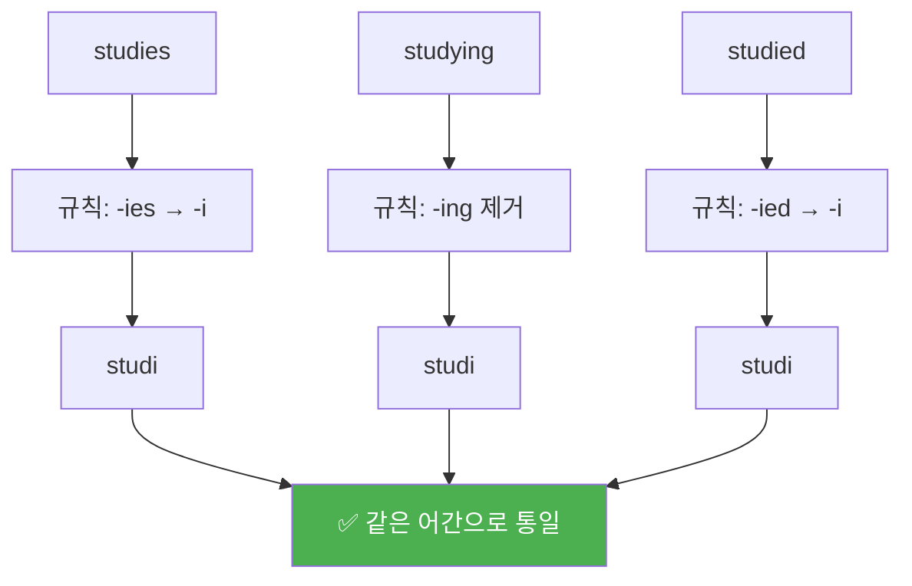
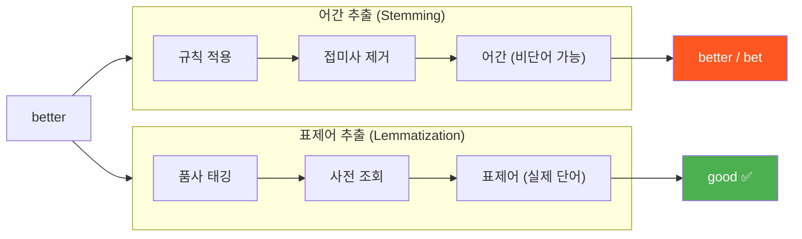
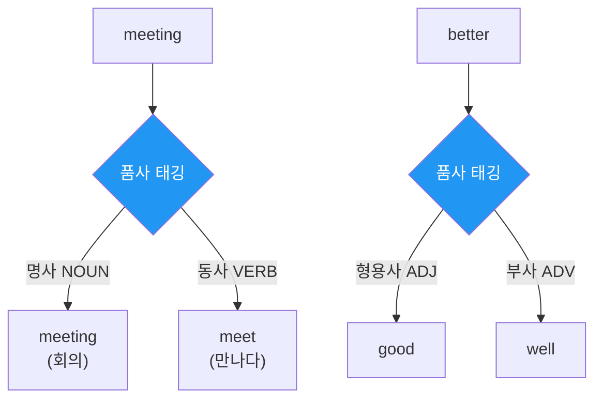
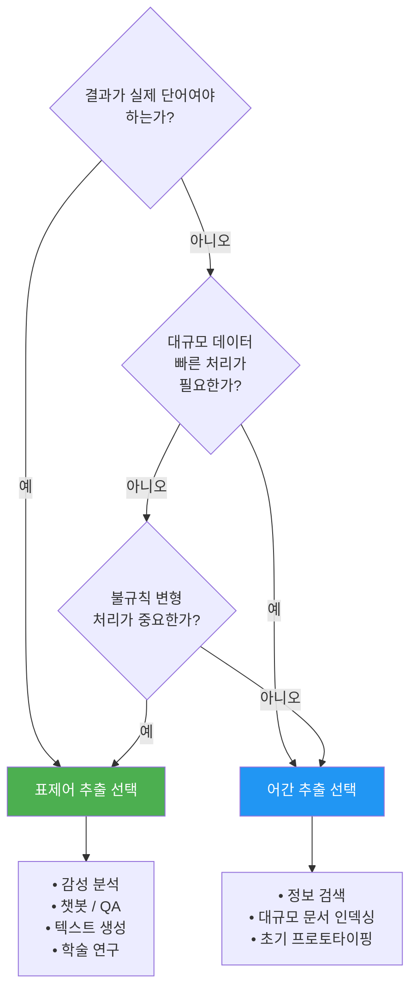

# 어간 추출과 표제어 추출

> 단어의 뿌리를 찾는 두 가지 접근법 — 빠르고 거친 어간 추출 vs. 정확하고 우아한 표제어 추출

## 개요

이 섹션에서는 토큰화와 정규화, 불용어 처리를 마친 텍스트에서 단어의 형태를 통일하는 두 가지 핵심 기법을 배웁니다. 어간 추출(Stemming)은 규칙 기반으로 접미사를 잘라내고, 표제어 추출(Lemmatization)은 사전과 품사 정보를 활용해 단어의 기본형을 복원합니다.

**선수 지식**: [토큰화의 기초](02-ch2-텍스트-전처리-토큰화와-정규화/01-01-토큰화의-기초.md)에서 배운 토큰화 방법, [불용어 처리](02-ch2-텍스트-전처리-토큰화와-정규화/03-03-불용어-처리.md)에서 다룬 전처리 흐름

**학습 목표**:
- 어간 추출과 표제어 추출의 차이를 명확히 설명할 수 있다
- Porter Stemmer와 Snowball Stemmer를 사용하고 결과를 비교할 수 있다
- spaCy Lemmatizer로 품사 기반 표제어 추출을 수행할 수 있다
- 태스크에 따라 어간 추출과 표제어 추출 중 적절한 방법을 선택할 수 있다

## 왜 알아야 할까?

"running", "runs", "ran" — 이 세 단어는 모두 "달리다"라는 같은 의미를 담고 있죠. 하지만 컴퓨터는 이 단어들을 완전히 다른 세 개의 토큰으로 인식합니다. 만약 "running shoes" 문서와 "I ran yesterday" 문서가 같은 주제인지 판단해야 한다면? 단어의 표면 형태가 다르기 때문에 유사도가 뚝 떨어지게 됩니다.

앞서 [텍스트 정규화와 클리닝](02-ch2-텍스트-전처리-토큰화와-정규화/02-02-텍스트-정규화와-클리닝.md)에서 소문자 변환이나 특수문자 제거로 표면적 차이를 줄였다면, 이번에는 **문법적 변형(굴절)**까지 통일하는 단계입니다. 검색 엔진이 "연구하다"를 검색했을 때 "연구했던", "연구하는", "연구할" 문서까지 찾아주는 것도 바로 이 기술 덕분이거든요.

> 📊 **그림 1**: NLP 전처리 파이프라인에서 어간/표제어 추출의 위치


어간 추출과 표제어 추출은 **BoW**, **TF-IDF** 같은 전통적 텍스트 표현에서 특히 중요합니다. 어휘 크기를 줄여 희소성(sparsity) 문제를 완화하고, 같은 의미의 단어들을 하나로 묶어 모델 성능을 높여주죠. [BoW 모델](03-ch3-텍스트-표현-bow와-tf-idf/01-01-bag-of-words-모델.md)과 [TF-IDF](03-ch3-텍스트-표현-bow와-tf-idf/03-03-tf-idf의-이론.md)에서 이 효과를 직접 확인하게 됩니다.

## 핵심 개념

### 개념 1: 어간 추출(Stemming) — 가지치기의 기술

> 💡 **비유**: 나무의 가지를 쳐서 줄기(stem)만 남기는 것과 같습니다. 가위로 잘라내니 빠르지만, 때로는 살짝 울퉁불퉁한 단면이 남죠. "studies"에서 "-ies"를 잘라내면 "studi"가 되는데 — 사전에 없는 단어지만, 같은 줄기에서 나온 단어들은 모두 "studi"로 통일됩니다.

어간 추출은 **규칙 기반**으로 접미사(suffix)를 제거하여 단어의 어간(stem)을 추출하는 방법입니다. 핵심은 "정확한 기본형"이 아니라 "같은 의미 단어들의 공통 형태"를 찾는 데 있습니다.

> 📊 **그림 2**: 어간 추출의 동작 원리



#### Porter Stemmer — 1980년의 전설

Porter Stemmer는 Martin Porter가 1980년에 발표한 알고리즘으로, 5단계의 규칙을 순서대로 적용합니다. 가장 오래되었지만 여전히 널리 사용되는 스테머거든요.

```run:python
from nltk.stem import PorterStemmer

stemmer = PorterStemmer()

# 다양한 단어의 어간 추출
words = ["running", "runs", "ran", "runner",
         "studies", "studying", "studied",
         "happiness", "happily", "happy",
         "generalization", "generalize", "general"]

for word in words:
    stem = stemmer.stem(word)
    print(f"  {word:20s} → {stem}")
```

```output
  running              → run
  runs                 → run
  ran                  → ran
  runner               → runner
  studies              → studi
  studying             → studi
  studied              → studi
  happiness            → happi
  happily              → happili
  happy                → happi
  generalization       → gener
  generalize           → gener
  general              → gener
```

결과를 보면 몇 가지 특징이 보이죠? "ran"은 불규칙 변형이라 "run"으로 바뀌지 않고, "happily"는 "happili"라는 어색한 형태가 됩니다. 이것이 어간 추출의 한계입니다 — 규칙만으로는 불규칙 변형을 처리할 수 없거든요.

#### Snowball Stemmer — 더 똑똑한 후계자

Snowball Stemmer(Porter2 Stemmer)는 Porter가 직접 개선한 버전으로, 원래 알고리즘의 몇 가지 약점을 보완했습니다. 또한 영어 외 다양한 언어를 지원합니다.

```run:python
from nltk.stem import SnowballStemmer

# 지원 언어 확인
print("지원 언어:", SnowballStemmer.languages)
print()

# 영어 Snowball Stemmer
snowball = SnowballStemmer("english")
porter = PorterStemmer()

# Porter vs Snowball 비교
test_words = ["generously", "fairly", "sportingly",
              "caresses", "ponies", "cats"]

print(f"{'단어':20s} {'Porter':15s} {'Snowball':15s}")
print("-" * 50)
for word in test_words:
    p = porter.stem(word)
    s = snowball.stem(word)
    diff = " ← 차이!" if p != s else ""
    print(f"{word:20s} {p:15s} {s:15s}{diff}")
```

```output
지원 언어: ('arabic', 'danish', 'dutch', 'english', 'finnish', 'french', 'german', 'hungarian', 'italian', 'norwegian', 'porter', 'portuguese', 'romanian', 'russian', 'spanish', 'swedish')

단어                   Porter          Snowball       
--------------------------------------------------
generously           gener           generous        ← 차이!
fairly               fairli          fair            ← 차이!
sportingly           sportingli      sport           ← 차이!
caresses             caress          caress         
ponies               poni            poni           
cats                 cat             cat            
```

Snowball이 "generously → generous", "fairly → fair"처럼 더 자연스러운 어간을 추출하는 것을 볼 수 있죠. 실무에서는 특별한 이유가 없다면 Snowball Stemmer를 사용하는 것이 좋습니다.

### 개념 2: 표제어 추출(Lemmatization) — 사전을 펼치는 정공법

> 💡 **비유**: 모르는 단어를 만나면 사전에서 기본형을 찾아보는 것과 같습니다. "went"를 사전에서 찾으면 "→ go의 과거형"이라고 나오죠. 어간 추출이 가위로 자르는 것이라면, 표제어 추출은 사전을 뒤져서 정확한 기본형(lemma)을 찾는 겁니다. 시간은 더 걸리지만, 결과는 항상 실제 단어입니다.

표제어 추출은 단어의 **품사(POS)**를 고려하여 사전의 기본형(표제어, lemma)으로 변환합니다. "better"가 형용사면 "good"으로, "ran"이 동사면 "run"으로 정확하게 변환되죠.

> 📊 **그림 3**: 어간 추출 vs. 표제어 추출 비교



#### spaCy Lemmatizer 사용하기

spaCy는 파이프라인 내에서 자동으로 품사 태깅과 표제어 추출을 수행합니다. 토큰의 `.lemma_` 속성으로 바로 접근할 수 있어 매우 편리하죠.

```run:python
import spacy

# 영어 모델 로드 (품사 태깅 + 표제어 추출 포함)
nlp = spacy.load("en_core_web_sm")

text = "The children were running happily and the geese flew better than expected"
doc = nlp(text)

print(f"{'토큰':15s} {'표제어':15s} {'품사':8s}")
print("-" * 40)
for token in doc:
    print(f"{token.text:15s} {token.lemma_:15s} {token.pos_:8s}")
```

```output
토큰              표제어              품사      
----------------------------------------
The             the             DET     
children        child           NOUN    
were            be              AUX     
running         run             VERB    
happily         happily         ADV     
and             and             CCONJ   
the             the             DET     
geese           goose           NOUN    
flew            fly             VERB    
better          well            ADV     
than            than            ADP     
expected        expect          VERB    
```

"children → child", "geese → goose", "flew → fly" — 불규칙 변형도 완벽하게 처리합니다! 이것이 사전 기반 접근법의 강점이에요.

### 개념 3: 품사 태깅이 표제어 추출에 미치는 영향

> 💡 **비유**: 같은 "meeting"이라는 단어도 "회의(명사)"인지 "만나는 중(동사)"인지에 따라 기본형이 달라집니다. 마치 같은 소리의 한국어 단어가 문맥에 따라 다른 뜻이 되는 것처럼, 품사가 표제어 추출의 방향을 결정합니다.

표제어 추출에서 품사(Part of Speech)는 결정적인 역할을 합니다. 같은 단어라도 품사에 따라 완전히 다른 표제어가 나올 수 있거든요.

> 📊 **그림 4**: 품사에 따른 표제어 추출 분기



NLTK의 WordNetLemmatizer에서 이 차이를 직접 확인해볼까요?

```run:python
from nltk.stem import WordNetLemmatizer
from nltk.corpus import wordnet

lemmatizer = WordNetLemmatizer()

# 품사 지정 없이 (기본: 명사)
print("품사 미지정 (기본=명사):")
print(f"  better  → {lemmatizer.lemmatize('better')}")
print(f"  running → {lemmatizer.lemmatize('running')}")
print(f"  went    → {lemmatizer.lemmatize('went')}")
print()

# 품사를 지정하면 결과가 달라짐
print("품사 지정:")
print(f"  better (adj) → {lemmatizer.lemmatize('better', pos='a')}")
print(f"  better (adv) → {lemmatizer.lemmatize('better', pos='r')}")
print(f"  running (v)  → {lemmatizer.lemmatize('running', pos='v')}")
print(f"  went (v)     → {lemmatizer.lemmatize('went', pos='v')}")
```

```output
품사 미지정 (기본=명사):
  better  → better
  running → running
  went    → went

품사 지정:
  better (adj) → good
  better (adv) → well
  running (v)  → run
  went (v)     → go
```

놀랍게도, 품사를 지정하지 않으면 WordNetLemmatizer는 거의 아무 변환도 하지 않습니다! 기본값이 명사(noun)라서 "better"를 명사로 해석하면 그대로 "better"가 나오는 거죠. 품사를 형용사(`'a'`)로 지정하면 비로소 "good"이 됩니다.

이것이 바로 spaCy가 편리한 이유입니다 — 파이프라인에서 품사 태깅을 자동으로 수행한 뒤 표제어 추출에 반영하니까요.

### 개념 4: 어간 추출 vs. 표제어 추출 — 언제 무엇을 쓸까?

두 방법의 핵심적인 차이를 정리하면 이렇습니다:

| 기준 | 어간 추출 (Stemming) | 표제어 추출 (Lemmatization) |
|------|---------------------|---------------------------|
| **방법** | 규칙 기반 접미사 제거 | 사전 + 품사 기반 변환 |
| **속도** | 매우 빠름 | 상대적으로 느림 |
| **결과** | 실제 단어가 아닐 수 있음 | 항상 실제 단어 |
| **불규칙 처리** | 못 함 (ran → ran) | 가능 (ran → run) |
| **언어 의존성** | 낮음 (규칙만 정의) | 높음 (사전 필요) |

> 📊 **그림 5**: 태스크별 적합한 방법 선택 가이드



**정보 검색(IR)이나 대규모 문서 인덱싱**에서는 속도가 중요하고 약간의 부정확성이 허용되므로 어간 추출이 적합합니다. 반면 **감성 분석, 챗봇, 텍스트 생성** 등 의미가 중요한 태스크에서는 표제어 추출이 더 나은 결과를 줍니다.

> ⚠️ **흔한 오해**: "표제어 추출이 항상 더 좋다"고 생각하기 쉽지만, 실제로 정보 검색 벤치마크에서는 어간 추출이 표제어 추출과 비슷하거나 더 나은 성능을 보이는 경우가 있습니다. 어간 추출의 "공격적인 통일"이 오히려 재현율(recall)을 높여주기 때문이죠.

## 실습: 직접 해보기

전체 전처리 파이프라인에서 어간 추출과 표제어 추출을 적용하고 결과를 비교해봅시다.

```python
import nltk
import spacy
from nltk.stem import PorterStemmer, SnowballStemmer, WordNetLemmatizer
from nltk.tokenize import word_tokenize
from nltk.corpus import stopwords

# 필요한 데이터 다운로드
nltk.download('punkt_tab', quiet=True)
nltk.download('stopwords', quiet=True)
nltk.download('wordnet', quiet=True)
nltk.download('averaged_perceptron_tagger_eng', quiet=True)

# spaCy 모델 로드
nlp = spacy.load("en_core_web_sm")

# 예제 텍스트
text = """
The researchers were studying the effects of different learning strategies.
Their studies showed that children who ran regularly performed better
on cognitive tests. The findings were better than expected, suggesting
that running improves memory and organizational abilities.
"""

# 1단계: 토큰화 + 소문자 변환 + 불용어 제거
tokens = word_tokenize(text.lower())
stop_words = set(stopwords.words('english'))
filtered = [t for t in tokens if t.isalpha() and t not in stop_words]

print("전처리된 토큰:")
print(filtered)
print(f"\n토큰 수: {len(filtered)}")
```

```python
# 2단계: 세 가지 방법 비교
porter = PorterStemmer()
snowball = SnowballStemmer("english")
wnl = WordNetLemmatizer()

# 어간 추출 적용
porter_result = [porter.stem(t) for t in filtered]
snowball_result = [snowball.stem(t) for t in filtered]

# NLTK 표제어 추출 (품사 미지정 — 한계 확인용)
wnl_result = [wnl.lemmatize(t) for t in filtered]

# spaCy 표제어 추출 (품사 자동 태깅)
doc = nlp(text)
spacy_result = [
    token.lemma_.lower() for token in doc
    if token.is_alpha and not token.is_stop
]

# 결과 비교 출력
print(f"\n{'원본':15s} {'Porter':15s} {'Snowball':15s} {'WNL(명사)':15s}")
print("=" * 60)
for i, token in enumerate(filtered[:12]):
    print(f"{token:15s} {porter_result[i]:15s} {snowball_result[i]:15s} {wnl_result[i]:15s}")
```

```python
# 3단계: 어휘 크기 비교 — 핵심 효과 확인
print("\n=== 어휘 크기 비교 ===")
print(f"원본 토큰:            {len(set(filtered))}개 고유 단어")
print(f"Porter Stemmer:      {len(set(porter_result))}개 고유 어간")
print(f"Snowball Stemmer:    {len(set(snowball_result))}개 고유 어간")
print(f"WordNet Lemmatizer:  {len(set(wnl_result))}개 고유 표제어")
print(f"spaCy Lemmatizer:    {len(set(spacy_result))}개 고유 표제어")
```

```python
# 4단계: 실전 — spaCy로 한 번에 처리하는 깔끔한 파이프라인
def preprocess_with_lemma(text, nlp_model):
    """spaCy 기반 전처리 파이프라인 (토큰화 + 불용어 + 표제어)"""
    doc = nlp_model(text)
    return [
        token.lemma_.lower()        # 표제어 추출 + 소문자
        for token in doc
        if token.is_alpha            # 알파벳만
        and not token.is_stop        # 불용어 제거
        and len(token.text) > 1      # 단일 문자 제거
    ]

# 두 문장이 같은 내용인지 비교
sent1 = "The dogs were running through the parks"
sent2 = "A dog runs through the park"

lemmas1 = preprocess_with_lemma(sent1, nlp)
lemmas2 = preprocess_with_lemma(sent2, nlp)

print(f"문장 1 표제어: {lemmas1}")
print(f"문장 2 표제어: {lemmas2}")

# 교집합으로 공통 의미 확인
common = set(lemmas1) & set(lemmas2)
print(f"\n공통 표제어: {common}")
print(f"겹침 비율: {len(common) / len(set(lemmas1) | set(lemmas2)):.1%}")
```

이 실습에서 핵심은 마지막 부분입니다. 표면적으로 다른 두 문장("dogs/dog", "running/runs", "parks/park")이 표제어 추출 후에는 거의 동일한 토큰으로 통일된다는 점이에요. 이것이 [문서 유사도와 검색](03-ch3-텍스트-표현-bow와-tf-idf/05-05-문서-유사도와-검색.md)에서 큰 차이를 만들어냅니다.

## 더 깊이 알아보기

### Martin Porter와 스테밍의 역사

어간 추출의 역사는 1968년 Julie Beth Lovins가 최초의 스테밍 알고리즘을 발표하면서 시작됩니다. 하지만 이 분야의 진정한 전환점은 1980년, 영국 캠브리지 대학의 Martin Porter가 **"An algorithm for suffix stripping"**이라는 논문을 발표하면서 찾아왔습니다.

Porter의 알고리즘은 놀라울 정도로 단순했습니다 — 5단계의 접미사 제거 규칙을 순서대로 적용하는 것이 전부였죠. 그런데 이 단순한 알고리즘이 Google Scholar 기준 **8,000회 이상 인용**될 정도로 엄청난 영향력을 발휘합니다. 정보 검색 분야의 사실상 표준(de facto standard)이 된 거예요.

2000년경, Porter는 한 발 더 나아갑니다. 스테밍 알고리즘을 작성하기 위한 프로그래밍 언어 **Snowball**을 직접 개발하고, 이를 이용해 영어를 포함한 16개 언어의 스테머를 구현한 것이죠. "Snowball"이라는 이름은 "작은 눈덩이가 굴러 점점 커지듯" 다양한 언어로 확장해나가겠다는 의미를 담고 있습니다. 2000년에는 정보 검색에 대한 공로로 Tony Kent Strix Award를 수상하기도 했습니다.

한편, 표제어 추출의 역사는 사전학(lexicography)과 더 밀접합니다. 모든 단어를 사전의 표제어 형태로 돌려놓겠다는 발상은 사실 컴퓨터 이전 시대의 도서관 사서들이 이미 하고 있던 일이었죠. 이를 자동화한 것이 WordNet(1985, Princeton 대학) 같은 어휘 데이터베이스이고, 현대의 spaCy가 이를 계승하고 있습니다.

## 흔한 오해와 팁

> ⚠️ **흔한 오해**: "어간 추출은 구식이니까 항상 표제어 추출을 써야 한다." 이건 사실이 아닙니다. Elasticsearch 같은 대규모 검색 엔진은 여전히 어간 추출(Snowball)을 기본으로 사용합니다. 수억 건의 문서를 인덱싱할 때 속도 차이가 결정적이거든요.

> 💡 **알고 계셨나요?**: NLTK의 WordNetLemmatizer에서 품사를 지정하지 않으면 기본값이 명사('n')입니다. 그래서 "running"을 넣어도 "running" 그대로 반환되죠 — 명사로서의 "running"(달리기)은 이미 기본형이니까요! 이 함정에 빠지는 초보자가 정말 많습니다.

> 🔥 **실무 팁**: 표제어 추출이 필요한 실무에서는 spaCy를 강력 추천합니다. NLTK의 WordNetLemmatizer는 품사를 직접 매핑해줘야 하지만, spaCy는 `nlp(text)` 한 줄로 토큰화 + 품사 태깅 + 표제어 추출이 모두 끝납니다. 한국어의 경우 형태소 분석기(Mecab, Komoran 등)가 이 역할을 수행합니다.

> 🔥 **실무 팁**: Transformer 기반 모델(BERT, GPT 등)을 사용할 때는 어간 추출이나 표제어 추출을 **하지 마세요**. 이 모델들은 자체 서브워드 토크나이저가 있고, 문맥에서 단어의 의미를 직접 학습합니다. 전처리를 과도하게 하면 오히려 성능이 떨어질 수 있습니다. 이 내용은 [서브워드 토크나이제이션](15-ch15-서브워드-토크나이제이션/01-01-서브워드-토크나이제이션의-필요성.md)에서 자세히 다룹니다.

## 핵심 정리

| 개념 | 설명 |
|------|------|
| 어간 추출 (Stemming) | 규칙 기반으로 접미사를 제거하여 어간을 추출. 빠르지만 결과가 실제 단어가 아닐 수 있음 |
| 표제어 추출 (Lemmatization) | 사전과 품사 정보를 활용해 기본형(표제어)으로 변환. 정확하지만 상대적으로 느림 |
| Porter Stemmer | 1980년 발표된 최초의 실용적 스테밍 알고리즘. 5단계 접미사 제거 규칙 |
| Snowball Stemmer | Porter2라고도 불리는 개선 버전. 16개 언어 지원. 실무 권장 |
| WordNetLemmatizer | NLTK의 표제어 추출기. 품사 지정 필수 (기본값: 명사) |
| spaCy Lemmatizer | 파이프라인 내 자동 품사 태깅 + 표제어 추출. 가장 편리한 선택 |
| 품사 태깅 (POS Tagging) | 표제어 추출의 정확도를 결정하는 핵심 전처리 단계 |

## 다음 섹션 미리보기

지금까지 토큰화, 정규화, 불용어 처리, 어간/표제어 추출을 개별적으로 배웠습니다. 다음 섹션 [전처리 파이프라인 구축 실습](02-ch2-텍스트-전처리-토큰화와-정규화/05-05-전처리-파이프라인-구축-실습.md)에서는 이 모든 단계를 하나의 파이프라인으로 통합하여 실제 데이터셋에 적용해봅니다. 재사용 가능한 전처리 클래스를 만들고, 파이프라인의 각 단계가 텍스트 분류 성능에 미치는 영향을 실험적으로 확인할 거예요.

## 참고 자료

- [NLTK Stem 공식 문서](https://www.nltk.org/howto/stem.html) - Porter, Snowball, Lancaster 등 NLTK 지원 스테머의 사용법과 예제
- [spaCy Lemmatizer API 문서](https://spacy.io/api/lemmatizer) - spaCy v3.x의 Lemmatizer 컴포넌트 설정과 사용법
- [Martin Porter의 Snowball 홈페이지](https://tartarus.org/martin/PorterStemmer/) - Porter Stemmer 원본 논문, Snowball 프로젝트, 알고리즘 상세 설명
- [spaCy Linguistic Features](https://spacy.io/usage/linguistic-features) - 토큰화, 품사 태깅, 표제어 추출 등 spaCy의 언어 처리 기능 종합 가이드
- [Stanford CS 224N](https://web.stanford.edu/class/cs224n/) - NLP 심화 강의. 텍스트 전처리부터 딥러닝 모델까지의 전체 흐름 이해에 유용

---
### 🔗 Related Sessions
- [토큰화](02-ch2-텍스트-전처리-토큰화와-정규화/01-01-토큰화의-기초.md) (prerequisite)
- [토큰](02-ch2-텍스트-전처리-토큰화와-정규화/01-01-토큰화의-기초.md) (prerequisite)
- [불용어](02-ch2-텍스트-전처리-토큰화와-정규화/03-03-불용어-처리.md) (prerequisite)


---
### 🔗 Related Sessions
- [토큰화](02-ch2-텍스트-전처리-토큰화와-정규화/01-01-토큰화의-기초.md) (prerequisite)
- [토큰](02-ch2-텍스트-전처리-토큰화와-정규화/01-01-토큰화의-기초.md) (prerequisite)
- [불용어](02-ch2-텍스트-전처리-토큰화와-정규화/03-03-불용어-처리.md) (prerequisite)


---
### 🔗 Related Sessions
- [토큰화](02-ch2-텍스트-전처리-토큰화와-정규화/01-01-토큰화의-기초.md) (prerequisite)
- [토큰](02-ch2-텍스트-전처리-토큰화와-정규화/01-01-토큰화의-기초.md) (prerequisite)
- [불용어](02-ch2-텍스트-전처리-토큰화와-정규화/03-03-불용어-처리.md) (prerequisite)


---
### 🔗 Related Sessions
- [토큰화](02-ch2-텍스트-전처리-토큰화와-정규화/01-01-토큰화의-기초.md) (prerequisite)
- [토큰](02-ch2-텍스트-전처리-토큰화와-정규화/01-01-토큰화의-기초.md) (prerequisite)
- [불용어](02-ch2-텍스트-전처리-토큰화와-정규화/03-03-불용어-처리.md) (prerequisite)


---
### 🔗 Related Sessions
- [토큰화](02-ch2-텍스트-전처리-토큰화와-정규화/01-01-토큰화의-기초.md) (prerequisite)
- [토큰](02-ch2-텍스트-전처리-토큰화와-정규화/01-01-토큰화의-기초.md) (prerequisite)
- [불용어](02-ch2-텍스트-전처리-토큰화와-정규화/03-03-불용어-처리.md) (prerequisite)
