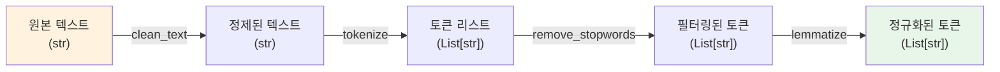
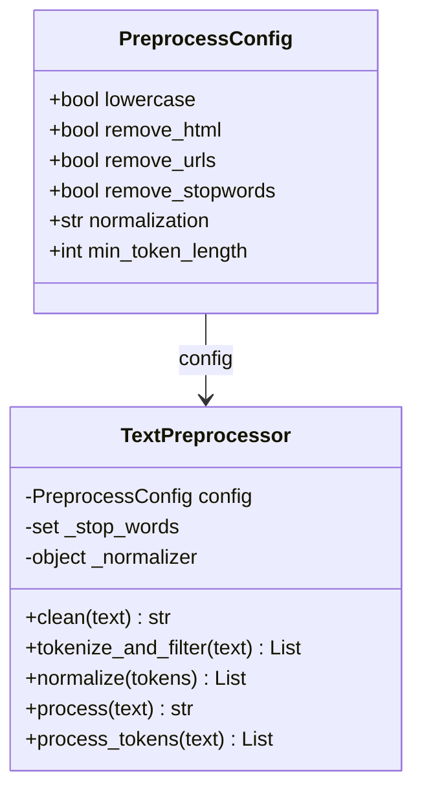
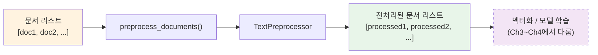
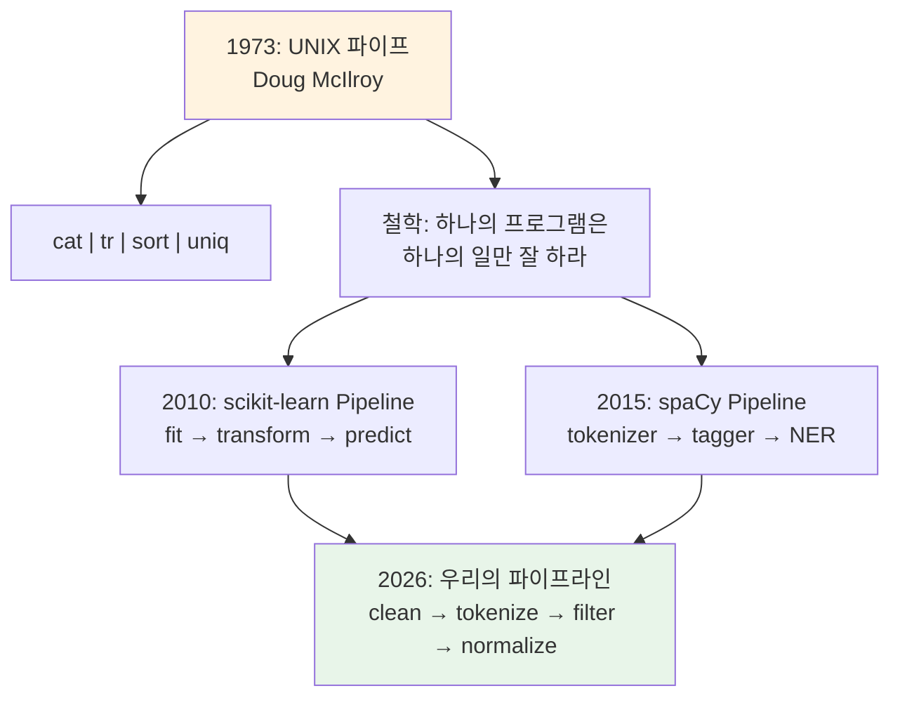

# 전처리 파이프라인 구축 실습

> 토큰화, 정규화, 불용어 처리, 어간/표제어 추출을 하나의 재사용 가능한 파이프라인으로 통합하고, 실제 뉴스 기사 데이터에 적용합니다.

## 개요

이번 섹션에서는 Ch2에서 배운 모든 전처리 기법을 하나의 재사용 가능한 파이프라인으로 통합합니다. 개별 함수를 모듈화하고, 설정 가능한 클래스로 감싸서 실제 뉴스 기사 데이터에 적용하는 종합 실습을 진행합니다. 마지막에는 이 파이프라인이 나중에 scikit-learn과 어떻게 연결되는지 맛보기로 살펴봅니다.

**선수 지식**: [토큰화의 기초](02-ch2-텍스트-전처리-토큰화와-정규화/01-01-토큰화의-기초.md), [텍스트 정규화와 클리닝](02-ch2-텍스트-전처리-토큰화와-정규화/02-02-텍스트-정규화와-클리닝.md), [불용어 처리](02-ch2-텍스트-전처리-토큰화와-정규화/03-03-불용어-처리.md), [어간 추출과 표제어 추출](02-ch2-텍스트-전처리-토큰화와-정규화/04-04-어간-추출과-표제어-추출.md)에서 배운 모든 개념

**학습 목표**:
- 전처리 단계를 독립된 함수로 모듈화할 수 있다
- 설정 가능한(configurable) 전처리 파이프라인 클래스를 설계하고 구현할 수 있다
- 함수 기반 파이프라인을 실제 뉴스 기사 데이터에 적용하고 효과를 비교할 수 있다
- scikit-learn Pipeline과의 연동이 왜 유용한지 이해하고, 연결 방향을 미리 파악할 수 있다

## 왜 알아야 할까?

지금까지 우리는 토큰화, 정규화, 불용어 처리, 어간/표제어 추출을 각각 따로 배웠습니다. 하지만 실제 프로젝트에서는 이 단계들을 매번 수동으로 순서대로 호출하는 건 비효율적이고, 무엇보다 **실수하기 쉽죠**. 어떤 프로젝트에서는 불용어를 제거했는데 다른 프로젝트에서는 깜빡 잊거나, 학습 데이터와 테스트 데이터에 서로 다른 전처리를 적용해 버리는 문제가 발생합니다.

파이프라인은 이런 문제를 근본적으로 해결합니다. 한 번 정의해두면 어디서든 동일한 전처리를 **재현 가능하게(reproducibly)** 적용할 수 있거든요. 마치 레시피를 한 번 적어두면 누가 만들어도 같은 음식이 나오는 것처럼요.

> 📊 **그림 1**: 개별 함수 호출 vs 파이프라인 방식 비교


## 핵심 개념

### 개념 1: 전처리 함수 모듈화

> 💡 **비유**: 요리할 때를 떠올려보세요. 재료 손질(세척, 껍질 벗기기, 다지기)을 매번 처음부터 하는 대신, "세척 담당", "다지기 담당"처럼 역할을 나눠두면 주방이 훨씬 효율적이 되죠. 전처리 함수도 마찬가지입니다. 각 단계를 독립된 함수로 분리하면, 필요한 조합만 골라 쓸 수 있습니다.

함수 모듈화의 핵심 원칙은 **단일 책임(Single Responsibility)**입니다. 각 함수는 딱 하나의 전처리 작업만 수행하고, 입력과 출력 타입을 명확히 정의합니다.

```python
import re
import unicodedata
from typing import List

import nltk
from nltk.corpus import stopwords
from nltk.stem import PorterStemmer, WordNetLemmatizer
from nltk.tokenize import word_tokenize

# 필요한 데이터 다운로드
nltk.download('punkt_tab', quiet=True)
nltk.download('stopwords', quiet=True)
nltk.download('wordnet', quiet=True)
nltk.download('averaged_perceptron_tagger_eng', quiet=True)

# ── 1단계: 텍스트 클리닝 ──
def clean_text(text: str) -> str:
    """유니코드 정규화, HTML 제거, 소문자 변환"""
    text = unicodedata.normalize('NFKC', text)          # 유니코드 정규화
    text = re.sub(r'<[^>]+>', '', text)                  # HTML 태그 제거
    text = re.sub(r'https?://\S+|www\.\S+', '', text)   # URL 제거
    text = text.lower()                                   # 소문자 변환
    text = re.sub(r'[^a-z0-9가-힣\s]', ' ', text)       # 특수문자 → 공백
    text = re.sub(r'\s+', ' ', text).strip()             # 다중 공백 정리
    return text

# ── 2단계: 토큰화 ──
def tokenize(text: str) -> List[str]:
    """NLTK word_tokenize로 토큰화"""
    return word_tokenize(text)

# ── 3단계: 불용어 제거 ──
def remove_stopwords(tokens: List[str], lang: str = 'english') -> List[str]:
    """지정된 언어의 불용어를 제거"""
    stop_words = set(stopwords.words(lang))
    return [t for t in tokens if t not in stop_words]

# ── 4단계: 표제어 추출 ──
def lemmatize(tokens: List[str]) -> List[str]:
    """WordNet 기반 표제어 추출"""
    lemmatizer = WordNetLemmatizer()
    return [lemmatizer.lemmatize(t) for t in tokens]
```

> 📊 **그림 2**: 모듈화된 전처리 함수의 데이터 흐름



각 함수가 입력 타입과 출력 타입을 명확히 하고 있다는 점에 주목하세요. `clean_text`는 `str → str`, 나머지는 `List[str] → List[str]`으로 일관됩니다. 이렇게 하면 함수를 자유롭게 조합할 수 있습니다.

```run:python
# 모듈화된 함수들을 순서대로 호출
sample = "The researchers published <b>3 papers</b> on NLP! Visit https://arxiv.org"

cleaned = clean_text(sample)
tokens = tokenize(cleaned)
filtered = remove_stopwords(tokens)
lemmas = lemmatize(filtered)

print(f"원본:      {sample}")
print(f"클리닝:    {cleaned}")
print(f"토큰화:    {tokens}")
print(f"불용어 제거: {filtered}")
print(f"표제어:    {lemmas}")
```

```output
원본:      The researchers published <b>3 papers</b> on NLP! Visit https://arxiv.org
클리닝:    the researchers published 3 papers on nlp visit
토큰화:    ['the', 'researchers', 'published', '3', 'papers', 'on', 'nlp', 'visit']
불용어 제거: ['researchers', 'published', '3', 'papers', 'nlp', 'visit']
표제어:    ['researcher', 'published', '3', 'paper', 'nlp', 'visit']
```

이렇게 함수를 나란히 호출하는 것만으로도 충분히 동작하지만, 매번 4줄을 반복 작성해야 한다는 번거로움이 있죠. 다음 개념에서 이걸 깔끔하게 정리해봅시다.

### 개념 2: 설정 가능한 파이프라인 클래스

> 💡 **비유**: 커피 머신을 생각해보세요. 원두 종류, 물의 양, 추출 시간을 설정한 뒤 버튼 하나로 커피가 나옵니다. 좋은 전처리 파이프라인도 마찬가지예요—어떤 단계를 켜고 끌지 설정하고, `process()` 한 번으로 결과를 받는 거죠.

개별 함수를 클래스로 감싸면 **설정(configuration)**을 저장하고 **재사용**할 수 있습니다. 프로젝트마다 다른 전처리 옵션이 필요할 때, 클래스 인스턴스를 다르게 생성하면 됩니다.

```python
from dataclasses import dataclass, field
from typing import List, Optional

@dataclass
class PreprocessConfig:
    """전처리 파이프라인 설정"""
    lowercase: bool = True                # 소문자 변환
    remove_html: bool = True              # HTML 태그 제거
    remove_urls: bool = True              # URL 제거
    remove_special_chars: bool = True     # 특수문자 제거
    remove_numbers: bool = False          # 숫자 제거 여부
    remove_stopwords: bool = True         # 불용어 제거
    stopword_lang: str = 'english'        # 불용어 언어
    custom_stopwords: List[str] = field(default_factory=list)
    normalization: str = 'lemma'          # 'lemma', 'stem', 'none'
    min_token_length: int = 2             # 최소 토큰 길이


class TextPreprocessor:
    """설정 기반의 재사용 가능한 텍스트 전처리 파이프라인"""

    def __init__(self, config: Optional[PreprocessConfig] = None):
        self.config = config or PreprocessConfig()
        self._setup()

    def _setup(self):
        """불용어 셋과 정규화 도구를 미리 로드"""
        if self.config.remove_stopwords:
            self._stop_words = set(stopwords.words(self.config.stopword_lang))
            self._stop_words.update(self.config.custom_stopwords)
        
        if self.config.normalization == 'lemma':
            self._normalizer = WordNetLemmatizer()
        elif self.config.normalization == 'stem':
            self._normalizer = PorterStemmer()

    def clean(self, text: str) -> str:
        """텍스트 클리닝 단계"""
        text = unicodedata.normalize('NFKC', text)
        
        if self.config.remove_html:
            text = re.sub(r'<[^>]+>', '', text)
        if self.config.remove_urls:
            text = re.sub(r'https?://\S+|www\.\S+', '', text)
        if self.config.lowercase:
            text = text.lower()
        if self.config.remove_numbers:
            text = re.sub(r'\d+', '', text)
        if self.config.remove_special_chars:
            text = re.sub(r'[^a-z0-9가-힣\s]', ' ', text)
        
        text = re.sub(r'\s+', ' ', text).strip()
        return text

    def tokenize_and_filter(self, text: str) -> List[str]:
        """토큰화 + 불용어 제거 + 길이 필터링"""
        tokens = word_tokenize(text)
        
        if self.config.remove_stopwords:
            tokens = [t for t in tokens if t not in self._stop_words]
        
        tokens = [t for t in tokens if len(t) >= self.config.min_token_length]
        return tokens

    def normalize(self, tokens: List[str]) -> List[str]:
        """어간 추출 또는 표제어 추출"""
        if self.config.normalization == 'lemma':
            return [self._normalizer.lemmatize(t) for t in tokens]
        elif self.config.normalization == 'stem':
            return [self._normalizer.stem(t) for t in tokens]
        return tokens  # 'none'이면 원본 반환

    def process(self, text: str) -> str:
        """전체 파이프라인 실행: str → str (공백으로 합침)"""
        cleaned = self.clean(text)
        tokens = self.tokenize_and_filter(cleaned)
        normalized = self.normalize(tokens)
        return ' '.join(normalized)

    def process_tokens(self, text: str) -> List[str]:
        """전체 파이프라인 실행: str → List[str]"""
        cleaned = self.clean(text)
        tokens = self.tokenize_and_filter(cleaned)
        return self.normalize(tokens)
```

> 📊 **그림 3**: TextPreprocessor 클래스 구조



이렇게 만들어두면, 프로젝트마다 설정만 바꿔서 사용할 수 있습니다:

```run:python
# 기본 설정으로 파이프라인 생성
default_pipe = TextPreprocessor()

# 감성 분석용 (불용어 유지, 숫자 제거)
sentiment_config = PreprocessConfig(
    remove_stopwords=False,    # "not", "very" 등 감성어 보존
    remove_numbers=True,
    normalization='lemma'
)
sentiment_pipe = TextPreprocessor(sentiment_config)

# 검색 엔진용 (어간 추출, 공격적 필터링)
search_config = PreprocessConfig(
    remove_stopwords=True,
    remove_numbers=True,
    normalization='stem',
    min_token_length=3
)
search_pipe = TextPreprocessor(search_config)

test_text = "The movie was NOT very good! I wouldn't recommend it to 10 friends."

print(f"기본:     {default_pipe.process(test_text)}")
print(f"감성분석: {sentiment_pipe.process(test_text)}")
print(f"검색엔진: {search_pipe.process(test_text)}")
```

```output
기본:     movie good would recommend 10 friend
감성분석: the movie was not very good would recommend it to friend
검색엔진: movi good would recommend friend
```

감성 분석 파이프라인은 "not"을 보존하고, 검색 엔진용은 어간 추출로 "movie"를 "movi"로 줄인 것이 보이시죠? 태스크에 맞는 설정이 결과를 완전히 바꿔놓습니다.

### 개념 3: 여러 문서를 한 번에 처리하기

> 💡 **비유**: 세탁소에 옷 한 벌씩 맡기는 것보다, 바구니에 모아서 한꺼번에 맡기는 게 효율적이죠. 실제 NLP 프로젝트에서도 문서 수백~수천 개를 한꺼번에 전처리해야 하는 경우가 대부분입니다.

`TextPreprocessor`를 여러 문서에 적용하는 것은 간단한 반복문이면 충분합니다. 하지만 여기서 한 가지 중요한 패턴을 만들어두면 나중에 큰 도움이 됩니다—바로 **함수 하나로 문서 리스트를 받아 처리하는 래퍼(wrapper)**입니다.

```python
def preprocess_documents(docs: List[str], config: PreprocessConfig = None) -> List[str]:
    """문서 리스트에 전처리 파이프라인을 일괄 적용
    
    Args:
        docs: 원본 문서 리스트
        config: 전처리 설정 (None이면 기본값)
    
    Returns:
        전처리된 문서 리스트
    """
    pipe = TextPreprocessor(config)
    return [pipe.process(doc) for doc in docs]
```

> 📊 **그림 4**: 문서 리스트 일괄 처리 흐름



이 `preprocess_documents()` 함수가 왜 중요할까요? 나중에 Ch3에서 BoW/TF-IDF를 배울 때, 그리고 Ch4에서 scikit-learn Pipeline을 배울 때, 이 함수를 그대로 가져다 쓸 수 있거든요. **지금은 함수 기반으로 깔끔하게 만들어두고, 나중에 필요할 때 scikit-learn과 연결하는 게 가장 자연스러운 학습 순서**입니다.

```run:python
# 여러 문서를 한 번에 전처리
sample_docs = [
    "The quick brown fox jumps over the lazy dog.",
    "Natural Language Processing is <b>fascinating</b>!",
    "Visit https://example.com for 5 more NLP tutorials."
]

processed = preprocess_documents(sample_docs)

for i, (original, result) in enumerate(zip(sample_docs, processed)):
    print(f"[문서 {i+1}]")
    print(f"  원본: {original}")
    print(f"  결과: {result}\n")
```

```output
[문서 1]
  원본: The quick brown fox jumps over the lazy dog.
  결과: quick brown fox jump lazy dog

[문서 2]
  원본: Natural Language Processing is <b>fascinating</b>!
  결과: natural language processing fascinating

[문서 3]
  원본: Visit https://example.com for 5 more NLP tutorials.
  결과: visit nlp tutorial
```

### 개념 4: scikit-learn 연동 맛보기 (미리보기)

> 💡 **비유**: 우리가 만든 `TextPreprocessor`는 독립적으로 잘 작동하는 요리 도구예요. 그런데 큰 식당(scikit-learn)에서 일하려면, 그 식당의 규격에 맞게 도구를 등록해야 하거든요. "이 도구는 `fit()`하면 준비 완료, `transform()`하면 재료 가공 완료"라는 약속을 지키는 거죠.

여기서는 scikit-learn과의 연동이 **왜 유용한지, 어떤 모양인지**만 간단히 살펴봅니다. 완전한 구현과 실습은 [Ch4. 머신러닝 기초와 텍스트 분류](04-ch4-머신러닝-기초와-텍스트-분류/04-04-scikit-learn-pipeline과-실전-분류.md)에서 본격적으로 다룰 예정이에요.

scikit-learn의 `Pipeline`은 여러 처리 단계를 **컨베이어 벨트**처럼 연결합니다. 전처리 → 벡터화 → 분류까지 한 줄로 실행되죠. 이걸 가능하게 하려면 각 단계가 `fit()`과 `transform()`이라는 두 메서드를 가져야 합니다.

> 📊 **그림 5**: scikit-learn Pipeline의 컨베이어 벨트 구조


우리의 `TextPreprocessor`를 scikit-learn에 연결하는 최소한의 코드는 이렇게 생겼습니다:

```python
from sklearn.base import BaseEstimator, TransformerMixin

class SklearnPreprocessor(BaseEstimator, TransformerMixin):
    """scikit-learn Pipeline 호환 전처리 변환기 (맛보기 버전)
    
    BaseEstimator: get_params()/set_params() 자동 제공
    TransformerMixin: fit_transform() 자동 제공
    → 이 두 클래스를 상속하면 scikit-learn의 Pipeline에 끼울 수 있음
    """

    def __init__(self, normalization='lemma', remove_stopwords=True):
        self.normalization = normalization
        self.remove_stopwords = remove_stopwords

    def fit(self, X, y=None):
        # 전처리는 데이터에서 학습할 것이 없으므로 그냥 self 반환
        return self

    def transform(self, X, y=None):
        # 우리가 만든 TextPreprocessor를 내부에서 활용
        config = PreprocessConfig(
            normalization=self.normalization,
            remove_stopwords=self.remove_stopwords
        )
        pipe = TextPreprocessor(config)
        return [pipe.process(doc) for doc in X]
```

> ⚠️ **지금은 이 코드를 깊이 이해하지 않아도 괜찮습니다!** `BaseEstimator`와 `TransformerMixin`이 뭔지, `fit()`과 `transform()`의 역할이 정확히 뭔지는 Ch4에서 scikit-learn의 전체 구조를 배운 뒤에 자연스럽게 이해됩니다. 여기서는 "아, 우리가 만든 파이프라인이 나중에 이렇게 연결되는구나" 정도만 느끼면 충분합니다.

이렇게 연결하면 어떤 장점이 있을까요? 미리 보여드리자면:

```python
from sklearn.pipeline import Pipeline
from sklearn.feature_extraction.text import TfidfVectorizer
from sklearn.naive_bayes import MultinomialNB

# 전처리 → 벡터화 → 분류를 한 줄로 연결 (Ch4에서 본격 실습)
nlp_pipeline = Pipeline([
    ('preprocessor', SklearnPreprocessor(normalization='lemma')),
    ('vectorizer', TfidfVectorizer(max_features=5000)),
    ('classifier', MultinomialNB())
])

# 이 한 줄로 전처리 + 벡터화 + 학습이 모두 실행됨!
# nlp_pipeline.fit(X_train, y_train)
# predictions = nlp_pipeline.predict(X_test)
```

지금은 이 코드를 실행하지 않습니다. Ch3에서 TF-IDF를 배우고, Ch4에서 scikit-learn Pipeline의 동작 원리를 제대로 이해한 뒤에 직접 구현하고 실험해볼 거예요. 그때 오늘 만든 `TextPreprocessor`가 빛을 발하게 됩니다!

## 실습: 직접 해보기

실제 20 Newsgroups 데이터셋을 사용하여 전처리 파이프라인의 효과를 눈으로 확인하고, 어휘 크기 변화를 측정해봅시다.

```python
from sklearn.datasets import fetch_20newsgroups
from sklearn.feature_extraction.text import CountVectorizer

# ── 데이터 로드 ──
# 4개 카테고리만 선택 (실습 속도를 위해)
categories = ['alt.atheism', 'sci.space', 'comp.graphics', 'rec.sport.baseball']

newsgroups = fetch_20newsgroups(
    subset='train',
    categories=categories,
    remove=('headers', 'footers', 'quotes'),  # 메타 정보 제거
    random_state=42
)

X = newsgroups.data       # 뉴스 기사 텍스트 리스트
y = newsgroups.target     # 카테고리 라벨

print(f"문서 수: {len(X)}")
print(f"카테고리: {newsgroups.target_names}")
print(f"\n─── 샘플 문서 (처음 200자) ───")
print(X[0][:200])
```

```python
# ── 전처리 전후 비교: 샘플 문서 3개 ──
preprocessor = TextPreprocessor()

for i in range(3):
    original = X[i][:150]  # 처음 150자만
    processed = preprocessor.process(X[i])[:100]  # 처리 결과 100자만
    print(f"\n[문서 {i+1}]")
    print(f"  원본:   {original}...")
    print(f"  전처리: {processed}...")
```

```python
# ── 설정별 전처리 결과 비교 ──
configs = {
    "기본 (Lemma)": PreprocessConfig(normalization='lemma'),
    "Stem 모드": PreprocessConfig(normalization='stem'),
    "불용어 유지": PreprocessConfig(remove_stopwords=False, normalization='lemma'),
    "공격적 필터": PreprocessConfig(normalization='stem', min_token_length=4, remove_numbers=True),
}

sample = X[0][:200]
print(f"원본: {sample}\n")

for name, config in configs.items():
    pipe = TextPreprocessor(config)
    result = pipe.process(sample)
    print(f"{name:15s} → {result[:80]}...")
```

```python
# ── 전처리 전후 어휘 크기 비교 ──
# 전처리 없이 어휘 크기
vec_raw = CountVectorizer()
vec_raw.fit(X)
vocab_raw = len(vec_raw.vocabulary_)

# 기본 전처리 적용 후
X_default = preprocess_documents(X)
vec_default = CountVectorizer()
vec_default.fit(X_default)
vocab_default = len(vec_default.vocabulary_)

# 공격적 전처리 적용 후
aggressive_config = PreprocessConfig(
    normalization='stem',
    min_token_length=3,
    remove_numbers=True
)
X_aggressive = preprocess_documents(X, aggressive_config)
vec_agg = CountVectorizer()
vec_agg.fit(X_aggressive)
vocab_agg = len(vec_agg.vocabulary_)

print("전처리 방식별 어휘 크기 비교")
print("=" * 50)
print(f"{'전처리 없음':20s} | {vocab_raw:>6,} 단어")
print(f"{'기본 (Lemma)':20s} | {vocab_default:>6,} 단어 | "
      f"축소율 {(1 - vocab_default/vocab_raw)*100:.1f}%")
print(f"{'공격적 (Stem)':20s} | {vocab_agg:>6,} 단어 | "
      f"축소율 {(1 - vocab_agg/vocab_raw)*100:.1f}%")
```

> 🔥 **실무 팁**: 전처리 파이프라인을 설계할 때는 **항상 baseline과 비교**하세요. 위 실험처럼 전처리 없는 버전과 전처리 적용 버전의 어휘 크기를 비교하면, 전처리가 실제로 얼마나 데이터를 압축하는지 수치로 확인할 수 있습니다. 분류 성능 비교는 Ch4에서 scikit-learn Pipeline을 배운 뒤에 체계적으로 실험할 예정입니다.

```python
# ── 전처리 품질 검증: 반드시 눈으로 확인하기 ──
# 실무에서는 최소 10개 샘플을 전처리 전후로 비교합니다
import random

random.seed(42)
sample_indices = random.sample(range(len(X)), 5)

preprocessor = TextPreprocessor()
print("전처리 품질 검증 (5개 샘플)")
print("=" * 60)

for idx in sample_indices:
    original_tokens = X[idx].split()[:8]  # 처음 8단어
    processed = preprocessor.process_tokens(X[idx])[:8]
    
    print(f"\n문서 #{idx}")
    print(f"  원본 시작: {' '.join(original_tokens)}...")
    print(f"  전처리 후: {' '.join(processed)}...")
```

## 더 깊이 알아보기

### UNIX 파이프라인 철학과 NLP 전처리

파이프라인이라는 개념의 원조는 1973년 **Doug McIlroy**가 UNIX에 도입한 **파이프(|)** 연산자입니다. McIlroy의 철학은 간단했어요: "하나의 프로그램은 하나의 일만 잘 하라. 프로그램의 출력이 다른 프로그램의 입력이 되게 하라." 이 아이디어가 `cat file.txt | tr '[:upper:]' '[:lower:]' | sort | uniq -c`처럼 작은 도구들을 연결하는 UNIX 문화를 만들었죠.

우리가 만든 `clean_text() → tokenize() → remove_stopwords() → lemmatize()` 체인도 정확히 이 철학을 따릅니다. 각 함수는 하나의 일만 하고, 출력이 다음 함수의 입력이 되죠.

의외로, NLP에서 전처리 파이프라인이 표준 관행으로 자리잡은 것은 비교적 최근입니다. 2010년대 초반까지만 해도 대부분의 연구자들이 전처리 코드를 프로젝트마다 새로 작성했거든요. spaCy(2015)가 토크나이저, POS 태거, NER 등을 하나의 파이프라인으로 묶어 제공하면서, NLP 커뮤니티에서도 파이프라인 패턴이 보편화되었습니다.

> 📊 **그림 6**: UNIX 파이프 철학에서 NLP 파이프라인까지



## 흔한 오해와 팁

> ⚠️ **흔한 오해**: "전처리는 많이 할수록 좋다"고 생각하기 쉽지만, 사실 **태스크에 따라 최적의 전처리 수준이 다릅니다**. BERT 같은 Transformer 모델에 입력할 때는 소문자 변환이나 불용어 제거를 하지 않는 것이 일반적입니다. 모델 자체가 문맥에서 중요도를 학습하기 때문이죠. 전처리는 BoW나 TF-IDF 같은 전통적 방법에서 가장 큰 효과를 발휘합니다.

> 💡 **알고 계셨나요?**: scikit-learn의 `Pipeline` 클래스는 2010년 v0.5에서 처음 도입되었는데, 처음에는 `FeatureUnion`이 없어서 병렬 특성 추출이 불가능했습니다. `FeatureUnion`이 추가된 것은 2012년이고, 최근에는 `ColumnTransformer`(2018)까지 도입되면서 더 유연한 전처리 파이프라인 구성이 가능해졌습니다. 이런 도구들은 Ch4에서 자세히 다룹니다.

> 🔥 **실무 팁**: 전처리 파이프라인을 만들 때는 반드시 **`process()`의 결과를 눈으로 확인**하세요. 자동화의 함정은 내부에서 무슨 일이 일어나는지 보지 않는 것입니다. 최소 10개 이상의 샘플을 전처리 전후로 출력해서 의도한 대로 변환되는지 검증하는 습관이 중요합니다.

## 핵심 정리

| 개념 | 설명 |
|------|------|
| 함수 모듈화 | 각 전처리 단계를 독립된 함수로 분리하여 재사용성과 테스트 용이성 확보 |
| PreprocessConfig | `@dataclass`로 전처리 옵션을 구조화하여 설정과 로직을 분리 |
| TextPreprocessor | 설정 기반으로 `clean → tokenize → filter → normalize` 단계를 실행하는 클래스 |
| preprocess_documents() | 문서 리스트에 파이프라인을 일괄 적용하는 래퍼 함수 |
| scikit-learn 연동 | `BaseEstimator` + `TransformerMixin` 상속으로 Pipeline 호환 가능 (Ch4에서 본격 실습) |

## 다음 섹션 미리보기

Ch2에서 텍스트 전처리의 기초를 완성했습니다! 다음 [Ch3. 텍스트 표현: BoW와 TF-IDF](03-ch3-텍스트-표현-bow와-tf-idf/01-01-bag-of-words-모델.md)에서는 전처리된 텍스트를 **숫자 벡터로 변환**하는 방법을 배웁니다. 지금까지 텍스트를 "깨끗하게 다듬는" 작업을 했다면, 이제는 컴퓨터가 실제로 계산할 수 있는 수학적 표현으로 바꾸는 단계입니다. 오늘 만든 `TextPreprocessor`가 Ch3의 BoW, TF-IDF와 어떻게 연결되는지 직접 확인하게 될 거예요. 그리고 Ch4에서는 오늘 맛보기로 살펴본 scikit-learn Pipeline을 본격적으로 활용하여 전처리 → 벡터화 → 분류까지 한 번에 연결하는 실전 실습을 진행합니다.

## 참고 자료

- [scikit-learn Pipeline and Composite Estimators](https://scikit-learn.org/stable/modules/compose.html) - Pipeline 클래스의 공식 문서. 전처리 파이프라인의 전체 구조를 이해하는 데 유용
- [scikit-learn Text Feature Extraction](https://scikit-learn.org/stable/modules/feature_extraction.html) - `CountVectorizer`, `TfidfVectorizer`의 전처리 옵션과 텍스트 파이프라인 구성 방법
- [spaCy 101: Everything you need to know](https://spacy.io/usage/spacy-101) - spaCy의 파이프라인 아키텍처와 커스텀 컴포넌트 작성법
- [spaCy Language Processing Pipelines](https://spacy.io/usage/processing-pipelines) - spaCy의 내장 파이프라인 컴포넌트 구조와 커스텀 파이프라인 확장 가이드
- [Python dataclasses 공식 문서](https://docs.python.org/3/library/dataclasses.html) - `@dataclass` 데코레이터의 동작 원리와 활용법

---
### 🔗 Related Sessions
- [토큰화](02-ch2-텍스트-전처리-토큰화와-정규화/01-01-토큰화의-기초.md) (prerequisite)
- [텍스트 정규화](02-ch2-텍스트-전처리-토큰화와-정규화/02-02-텍스트-정규화와-클리닝.md) (prerequisite)
- [불용어](02-ch2-텍스트-전처리-토큰화와-정규화/03-03-불용어-처리.md) (prerequisite)
- [어간 추출](02-ch2-텍스트-전처리-토큰화와-정규화/04-04-어간-추출과-표제어-추출.md) (prerequisite)
- [표제어 추출](02-ch2-텍스트-전처리-토큰화와-정규화/04-04-어간-추출과-표제어-추출.md) (prerequisite)
