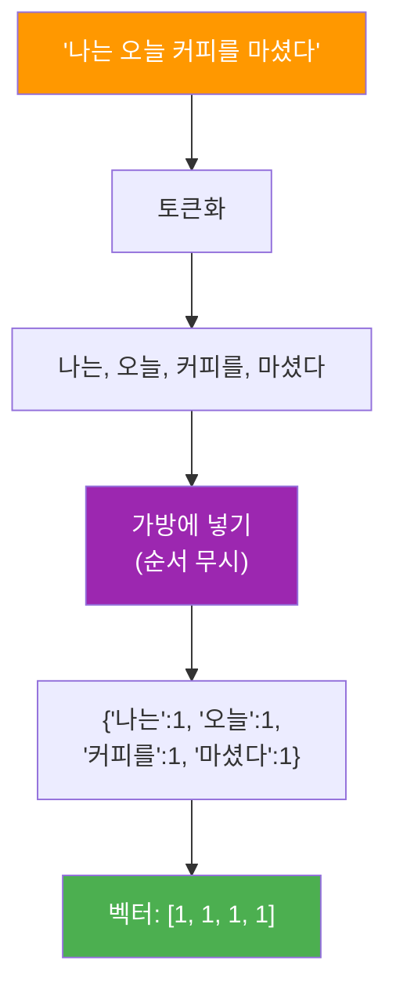
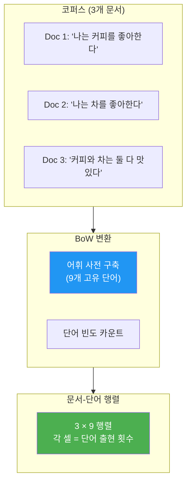
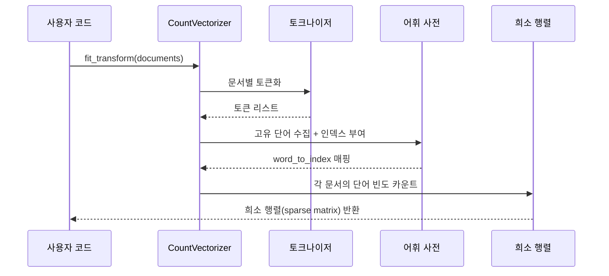
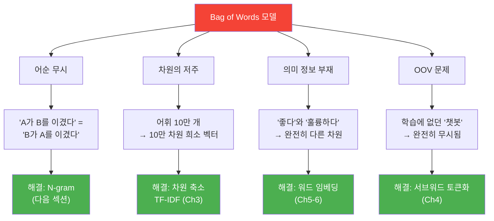

# Bag of Words 모델

> 텍스트를 숫자로 바꾸는 가장 직관적인 첫걸음, Bag of Words를 마스터합니다.

## 개요

이 섹션에서는 텍스트를 컴퓨터가 이해할 수 있는 숫자 벡터로 변환하는 가장 기본적인 방법인 **Bag of Words(BoW)** 모델을 배웁니다. 어휘 사전을 구축하고, 문서-단어 행렬을 생성하는 전 과정을 직접 구현하며, BoW의 강점과 한계를 파악합니다.

**선수 지식**: [토큰화의 기초](02-ch2-텍스트-전처리-토큰화와-정규화/01-01-토큰화의-기초.md)에서 배운 토큰화 개념과 [전처리 파이프라인 구축 실습](02-ch2-텍스트-전처리-토큰화와-정규화/05-05-전처리-파이프라인-구축-실습.md)에서 다룬 텍스트 정규화 과정

**학습 목표**:
- Bag of Words 모델의 원리를 비유와 함께 직관적으로 이해한다
- 어휘 사전(Vocabulary)을 구축하고 문서-단어 행렬을 직접 만들 수 있다
- scikit-learn의 `CountVectorizer`를 활용하여 BoW 벡터를 효율적으로 생성한다
- BoW의 근본적 한계(어순 무시, 차원의 저주, OOV 문제)를 구체적으로 설명할 수 있다

## 왜 알아야 할까?

컴퓨터는 문자를 직접 이해하지 못합니다. "이 영화 정말 재미있다"라는 문장을 머신러닝 모델에 넣으려면, 먼저 이 텍스트를 **숫자**로 바꿔야 하죠. 그런데 어떻게 바꿀까요?

가장 단순하면서도 강력한 첫 번째 방법이 바로 **Bag of Words**입니다. 이름 그대로 단어들을 "가방"에 쏟아 넣는 거예요. 순서는 잊어버리고, 어떤 단어가 몇 번 나왔는지만 세는 겁니다.

"그게 뭐가 대단해?"라고 생각할 수 있지만, 이 단순한 아이디어가 **스팸 필터**, **뉴스 분류**, **감성 분석** 등 수많은 실전 NLP 시스템의 기초가 되었습니다. BoW를 이해하면 이후에 배울 TF-IDF, 워드 임베딩이 **왜 등장했는지** 자연스럽게 이해할 수 있습니다.

> 📊 **그림 1**: 텍스트를 숫자로 변환하는 전체 흐름


## 핵심 개념

### 개념 1: Bag of Words란 무엇인가?

> 💡 **비유**: 쇼핑백에서 영수증 만들기

마트에서 장을 봤다고 상상해 보세요. 쇼핑백 안에는 사과 3개, 우유 1개, 빵 2개가 들어있습니다. 영수증에는 **어떤 순서로 담았는지**는 기록되지 않고, **무엇이 몇 개인지**만 적혀 있죠.

Bag of Words도 똑같습니다. 문장을 쇼핑백이라고 생각하면, 우리는 그 안에 들어있는 단어(상품)의 **종류와 개수**만 기록하는 겁니다. 단어가 어떤 순서로 나왔는지는 완전히 무시합니다.

```python
# 두 문장이 BoW에서는 동일하게 표현됩니다! (의사코드)
sentence_positive = "고양이가 개를 쫓았다"
sentence_negative = "개가 고양이를 쫓았다"
# BoW: {고양이: 1, 개: 1, 쫓았다: 1} → 같은 벡터!
```

이것이 BoW의 핵심이자 한계인데요, 이 부분은 뒤에서 자세히 다루겠습니다.

> 📊 **그림 2**: Bag of Words의 핵심 아이디어



### 개념 2: 어휘 사전(Vocabulary) 구축

> 💡 **비유**: 도서관의 색인 카드

옛날 도서관에는 모든 책의 키워드를 정리한 **색인 카드 서랍**이 있었습니다. BoW에서 어휘 사전은 바로 이 색인 카드와 같은 역할을 합니다. 전체 문서 모음(코퍼스)에 등장하는 **모든 고유 단어를 수집하고 번호를 매기는** 과정이죠.

어휘 사전 구축 과정은 다음과 같습니다:

1. 모든 문서를 토큰화한다
2. 고유한 단어를 수집한다 (중복 제거)
3. 각 단어에 고유한 인덱스를 부여한다

```run:python
# 어휘 사전을 직접 구축해 봅시다
documents = [
    "나는 커피를 좋아한다",
    "나는 차를 좋아한다",
    "커피와 차는 둘 다 맛있다"
]

# 1단계: 토큰화 (간단한 공백 기준)
tokenized = [doc.split() for doc in documents]

# 2단계: 고유 단어 수집 + 정렬
vocab = sorted(set(word for doc in tokenized for word in doc))

# 3단계: 인덱스 부여
word_to_idx = {word: idx for idx, word in enumerate(vocab)}

print("어휘 사전:")
for word, idx in word_to_idx.items():
    print(f"  '{word}' → 인덱스 {idx}")
print(f"\n어휘 크기: {len(vocab)}개")
```

```output
어휘 사전:
  '나는' → 인덱스 0
  '다' → 인덱스 1
  '둘' → 인덱스 2
  '맛있다' → 인덱스 3
  '좋아한다' → 인덱스 4
  '차는' → 인덱스 5
  '차를' → 인덱스 6
  '커피를' → 인덱스 7
  '커피와' → 인덱스 8
```

> ⚠️ **흔한 오해**: "어휘 사전은 학습 데이터에서만 만든다"
> 
> 맞습니다! 테스트 데이터에만 등장하는 새로운 단어는 어휘 사전에 없으므로 무시됩니다. 이를 **미등록어(Out-of-Vocabulary, OOV)** 문제라고 하며, 이는 BoW의 중요한 한계 중 하나입니다.

### 개념 3: 문서-단어 행렬(Document-Term Matrix)

> 💡 **비유**: 출석부와 같은 체크리스트

학교 출석부를 떠올려 보세요. 세로축에 학생 이름(=문서), 가로축에 날짜(=단어)가 있고, 해당 칸에 출석 횟수를 기록하죠. 문서-단어 행렬도 같은 구조입니다. 각 문서에서 각 단어가 **몇 번 등장했는지**를 행렬로 정리합니다.

> 📊 **그림 3**: 문서-단어 행렬 생성 과정



```run:python
import numpy as np

# 앞에서 만든 어휘 사전 활용
documents = [
    "나는 커피를 좋아한다",
    "나는 차를 좋아한다",
    "커피와 차는 둘 다 맛있다"
]

# 어휘 사전
vocab = sorted(set(word for doc in documents for word in doc.split()))
word_to_idx = {word: idx for idx, word in enumerate(vocab)}

# 문서-단어 행렬 생성
dtm = np.zeros((len(documents), len(vocab)), dtype=int)

for doc_idx, doc in enumerate(documents):
    for word in doc.split():
        if word in word_to_idx:
            dtm[doc_idx][word_to_idx[word]] += 1

# 결과 출력
print("어휘 사전:", vocab)
print("\n문서-단어 행렬:")
print(dtm)
print(f"\n행렬 크기: {dtm.shape} (문서 수 × 어휘 크기)")
```

```output
어휘 사전: ['나는', '다', '둘', '맛있다', '좋아한다', '차는', '차를', '커피를', '커피와']

문서-단어 행렬:
[[1 0 0 0 1 0 0 1 0]
 [1 0 0 0 1 0 1 0 0]
 [0 1 1 1 0 1 0 0 1]]

행렬 크기: (3, 9) (문서 수 × 어휘 크기)
```

첫 번째 행 `[1, 0, 0, 0, 1, 0, 0, 1, 0]`은 "나는 커피를 좋아한다"를 벡터로 표현한 결과입니다. '나는', '좋아한다', '커피를'에 해당하는 위치만 1이고 나머지는 0이죠.

### 개념 4: scikit-learn의 CountVectorizer

직접 구현하는 것도 의미가 있지만, 실무에서는 scikit-learn의 `CountVectorizer`를 사용합니다. 토큰화, 어휘 사전 구축, 벡터 변환을 한 번에 처리해 주거든요.

> 📊 **그림 4**: CountVectorizer의 내부 동작 흐름



```run:python
from sklearn.feature_extraction.text import CountVectorizer

# 영문 예제 (scikit-learn 기본 토크나이저는 영문에 최적화)
documents = [
    "I love coffee",
    "I love tea",
    "coffee and tea are both delicious"
]

# CountVectorizer 생성 및 변환
vectorizer = CountVectorizer()
bow_matrix = vectorizer.fit_transform(documents)

# 결과 확인
print("어휘 사전:", vectorizer.get_feature_names_out())
print("\nBoW 행렬 (밀집 형태):")
print(bow_matrix.toarray())
print(f"\n행렬 타입: {type(bow_matrix)}")
print(f"행렬 크기: {bow_matrix.shape}")
```

```output
어휘 사전: ['and' 'are' 'both' 'coffee' 'delicious' 'love' 'tea']

BoW 행렬 (밀집 형태):
[[0 0 0 1 0 1 0]
 [0 0 0 0 0 1 1]
 [1 1 1 1 1 0 1]]

행렬 타입: <class 'scipy.sparse._csr.csr_matrix'>
행렬 크기: (3, 7)
```

주목할 점이 있습니다. `CountVectorizer`가 반환하는 것은 **희소 행렬(sparse matrix)**이에요. 왜 그럴까요? 실제 문서에서 한 문서가 사용하는 단어는 전체 어휘의 극히 일부입니다. 대부분의 셀이 0이므로, 메모리를 절약하기 위해 0이 아닌 값만 저장하는 희소 행렬을 사용하는 거죠.

### 개념 5: BoW의 한계

BoW는 단순하고 효과적이지만, 근본적인 한계가 있습니다.

**한계 1: 어순 무시 (Loss of Word Order)**

```python
# BoW에서 이 두 문장은 동일한 벡터를 가집니다!
sentence_a = "영화가 지루하지 않고 재미있다"  # 긍정
sentence_b = "영화가 재미있지 않고 지루하다"  # 부정
# BoW 변환 시 두 벡터가 동일 → 의미 구분 불가!
```

가방에 단어를 쏟아 넣으면 순서가 사라지니까, **정반대 의미**의 문장도 같은 벡터가 될 수 있습니다.

**한계 2: 차원의 저주 (Curse of Dimensionality)**

어휘 크기가 곧 벡터의 차원입니다. 뉴스 기사 수만 건을 분석하면 어휘가 수만~수십만 개에 달하는데, 이렇게 되면 벡터가 극도로 **고차원이면서 대부분 0**인 희소 벡터가 됩니다. 이는 모델 학습의 효율성과 성능을 크게 떨어뜨립니다.

**한계 3: 의미 정보 부재**

"좋다"와 "훌륭하다"는 비슷한 의미이지만, BoW에서는 완전히 다른 차원의 별개 단어입니다. 단어 간 **의미적 유사성**을 전혀 반영하지 못합니다.

**한계 4: 미등록어 문제 (Out-of-Vocabulary, OOV)**

BoW 모델은 학습 데이터(코퍼스)에서 어휘 사전을 구축하기 때문에, **학습 시 한 번도 등장하지 않은 단어는 아예 표현할 수 없습니다.** 이를 **OOV(Out-of-Vocabulary)** 문제라고 합니다.

예를 들어, 학습 데이터에 "챗봇"이라는 단어가 없었다면 테스트 시 "챗봇"이 포함된 문서가 들어와도 해당 단어는 완전히 무시됩니다. 마치 영수증에 없는 상품은 존재하지 않는 것처럼 취급하는 거죠. 이는 특히 **신조어, 전문 용어, 오타**가 빈번한 실제 텍스트 데이터에서 심각한 문제가 됩니다. `CountVectorizer`의 `min_df` 파라미터로 희귀 단어를 제거하면 OOV가 더 늘어날 수 있으므로, 어휘 크기와 커버리지 사이의 적절한 균형을 찾는 것이 중요합니다.

> 📊 **그림 5**: BoW의 네 가지 근본적 한계



이 한계들은 이후 챕터에서 하나씩 해결해 나갑니다. [N-gram과 CountVectorizer](03-ch3-텍스트-표현-bow와-tf-idf/02-02-n-gram과-countvectorizer.md)에서는 어순 문제를, [TF-IDF](03-ch3-텍스트-표현-bow와-tf-idf/03-03-tf-idf의-이론.md)에서는 단어 중요도를, [Word2Vec](05-ch5-워드-임베딩-word2vec/01-01-분포-가설과-밀집-벡터-표현.md)에서는 의미 표현 문제를 다룹니다.

## 실습: 직접 해보기

한국어 영화 리뷰 3개를 BoW로 변환하고, 두 리뷰 간의 코사인 유사도를 측정해 봅시다.

```python
import numpy as np
from sklearn.feature_extraction.text import CountVectorizer
from sklearn.metrics.pairwise import cosine_similarity

# 한국어 영화 리뷰 데이터
reviews = [
    "이 영화 정말 재미있고 감동적이다",       # 리뷰 1: 긍정
    "영화 스토리가 재미있고 배우 연기가 좋다",  # 리뷰 2: 긍정
    "이 영화 너무 지루하고 별로였다",          # 리뷰 3: 부정
]

# 한국어는 공백 기준 토큰화 사용 (실무에서는 형태소 분석기 권장)
vectorizer = CountVectorizer(token_pattern=r"(?u)\b\w+\b")
bow_matrix = vectorizer.fit_transform(reviews)

# 어휘 사전 확인
print("=== 어휘 사전 ===")
feature_names = vectorizer.get_feature_names_out()
print(feature_names)
print()

# BoW 행렬 확인
print("=== BoW 행렬 ===")
bow_array = bow_matrix.toarray()
for i, (review, vec) in enumerate(zip(reviews, bow_array)):
    print(f"리뷰 {i+1}: {vec}")
print()

# 코사인 유사도 계산
print("=== 코사인 유사도 ===")
similarity = cosine_similarity(bow_matrix)
for i in range(len(reviews)):
    for j in range(i+1, len(reviews)):
        print(f"리뷰 {i+1} ↔ 리뷰 {j+1}: {similarity[i][j]:.4f}")
```

이 코드를 실행하면 긍정 리뷰끼리("재미있고"를 공유)의 유사도가 부정 리뷰와의 유사도보다 높게 나옵니다. 단순히 단어 출현 빈도만으로도 문서의 유사성을 어느 정도 파악할 수 있다는 뜻이죠!

> 🔥 **실무 팁**: 한국어 BoW를 제대로 하려면 공백 분할 대신 **형태소 분석기**(KoNLPy의 Okt, Mecab 등)를 사용해야 합니다. "좋아한다"와 "좋아했다"를 같은 단어로 인식하려면 형태소 분석이 필수이기 때문입니다. 이 부분은 [어간 추출과 표제어 추출](02-ch2-텍스트-전처리-토큰화와-정규화/04-04-어간-추출과-표제어-추출.md)에서 다뤘던 내용이기도 하죠.

## 더 깊이 알아보기

### BoW의 역사: 언어학에서 컴퓨터 과학으로

"Bag of Words"라는 표현이 언어학에서 처음 등장한 것은 **1954년**입니다. 미국 펜실베이니아 대학의 언어학자 **젤리그 해리스(Zellig Harris)**가 그의 기념비적 논문 *"Distributional Structure"*에서 이 용어를 사용했는데요, 재미있게도 해리스는 이 비유를 **부정적인 의미**로 쓴 겁니다. "단어를 가방에 쏟아 넣으면 언어 구조가 사라진다"는 경고였죠.

그런데 아이러니하게도, 이 "단점"이 컴퓨터 과학에서는 오히려 **장점**으로 활용되었습니다. 1990년대 정보 검색(Information Retrieval) 분야에서 연구자들은 문서를 빠르게 비교하고 분류하는 데 이 단순한 표현이 놀라울 정도로 잘 작동한다는 것을 발견했습니다.

컴퓨터 비전 분야에서도 BoW가 활약했다는 사실, 알고 계셨나요? 2004년 Csurka 등의 연구에서 이미지를 "시각적 단어(visual words)"의 가방으로 표현하는 **Bag of Visual Words** 기법이 등장했는데, 이는 딥러닝 이전까지 이미지 분류의 주요 방법이었습니다.

### 왜 "가방(Bag)"인가?

수학에서 **bag**은 **multiset**(다중집합)의 비공식적 이름입니다. 일반 집합(set)은 원소의 중복을 허용하지 않지만, 다중집합은 같은 원소가 여러 번 포함될 수 있죠. BoW 모델에서 단어가 여러 번 등장하면 그 횟수를 세는 것이 바로 이 다중집합의 성질입니다.

## 흔한 오해와 팁

> ⚠️ **흔한 오해**: "BoW는 너무 단순해서 쓸모없다"
> 
> 오히려 그 단순함이 강점인 경우가 많습니다. 스팸 필터링이나 문서 분류 같은 태스크에서는 BoW + Naive Bayes 조합이 딥러닝 못지않은 성능을 내면서도 훨씬 빠르고 해석 가능합니다. 데이터가 적을 때는 특히 더 유리하죠.

> 💡 **알고 계셨나요?**: Gmail의 초기 스팸 필터는 BoW 기반의 Naive Bayes 분류기로 만들어졌습니다. Paul Graham의 2002년 에세이 *"A Plan for Spam"*에서 소개된 이 방법은, 이메일에 등장하는 단어의 빈도만으로 스팸 여부를 98% 이상의 정확도로 판별했습니다.

> 🔥 **실무 팁**: `CountVectorizer`의 `max_features` 파라미터로 어휘 크기를 제한하면 차원의 저주를 완화할 수 있습니다. 또한 `min_df`(최소 문서 빈도)와 `max_df`(최대 문서 빈도)를 설정하면 너무 희귀하거나 너무 흔한 단어를 자동으로 제거할 수 있어요.

```python
# 실무에서 자주 쓰는 CountVectorizer 설정
vectorizer = CountVectorizer(
    max_features=10000,  # 상위 10,000개 단어만 사용
    min_df=2,            # 최소 2개 문서에 등장한 단어만
    max_df=0.95,         # 95% 이상 문서에 등장하는 단어 제외
    stop_words='english' # 영어 불용어 제거
)
```

## 핵심 정리

| 개념 | 설명 |
|------|------|
| **Bag of Words** | 문서를 단어 출현 빈도 벡터로 표현하는 방법. 어순을 무시하고 빈도만 기록 |
| **어휘 사전(Vocabulary)** | 코퍼스의 모든 고유 단어를 수집하고 인덱스를 부여한 매핑 |
| **문서-단어 행렬(DTM)** | 행=문서, 열=단어, 값=출현 빈도인 행렬. 희소(sparse) 행렬로 저장 |
| **CountVectorizer** | scikit-learn의 BoW 구현체. 토큰화~벡터 변환을 한 번에 수행 |
| **희소 행렬(Sparse Matrix)** | 대부분의 값이 0인 행렬을 효율적으로 저장하는 자료 구조 |
| **어순 무시** | BoW의 근본적 한계. "A가 B를 이겼다"와 "B가 A를 이겼다"를 구분 불가 |
| **차원의 저주** | 어휘가 커질수록 벡터 차원이 폭증하여 모델 성능이 저하되는 현상 |
| **OOV 문제** | 학습 시 어휘 사전에 없던 단어(Out-of-Vocabulary)가 테스트에 등장하면 표현 불가능하여 무시되는 문제 |

## 다음 섹션 미리보기

BoW의 가장 큰 한계 중 하나인 **어순 무시** 문제를 어떻게 완화할 수 있을까요? 다음 섹션 [N-gram과 CountVectorizer](03-ch3-텍스트-표현-bow와-tf-idf/02-02-n-gram과-countvectorizer.md)에서는 연속된 N개의 단어를 하나의 단위로 묶는 **N-gram** 기법을 배웁니다. "not good"처럼 연속된 단어가 만들어내는 의미를 포착할 수 있게 되죠. 또한 `CountVectorizer`의 `ngram_range` 파라미터를 활용하여 유니그램과 바이그램을 조합하는 방법도 실습합니다.

## 참고 자료

- [scikit-learn Text Feature Extraction (공식 문서)](https://scikit-learn.org/stable/modules/feature_extraction.html) - BoW, CountVectorizer, TF-IDF의 이론과 구현을 다루는 공식 레퍼런스
- [CountVectorizer API 문서 (scikit-learn 1.8.0)](https://scikit-learn.org/stable/modules/generated/sklearn.feature_extraction.text.CountVectorizer.html) - CountVectorizer의 모든 파라미터와 메서드 상세 설명
- [Stanford CS 224N: Natural Language Processing with Deep Learning](https://web.stanford.edu/class/cs224n/) - NLP 이론 전반을 다루는 스탠포드 강의. 텍스트 표현 방법론 비교에 유용
- [Bag-of-words model (Wikipedia)](https://en.wikipedia.org/wiki/Bag-of-words_model) - BoW의 역사, 수학적 정의, 관련 분야 응용 사례 종합