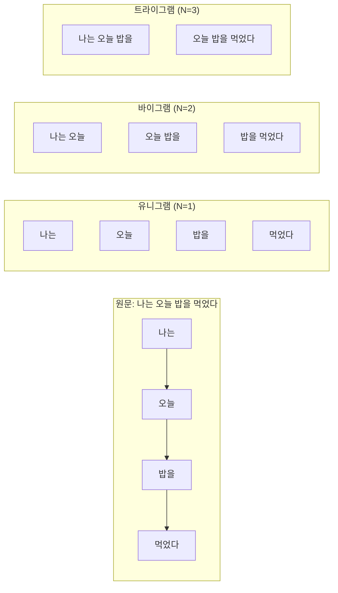
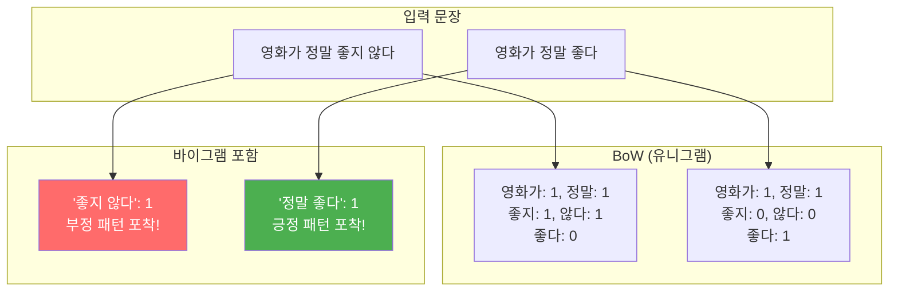
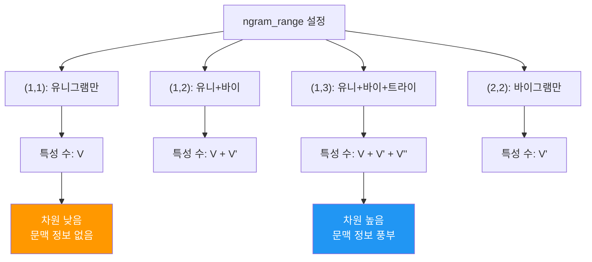
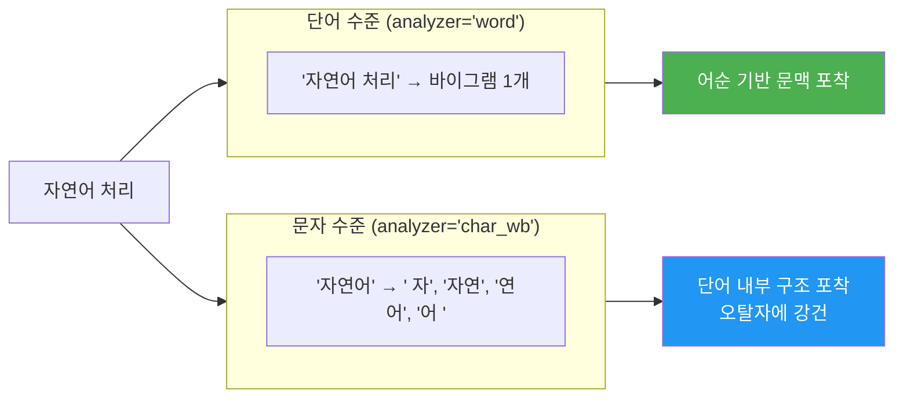
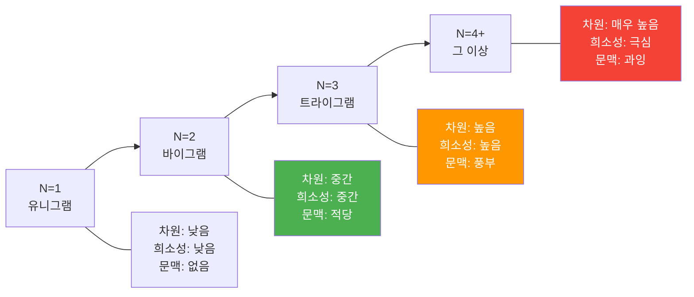

# N-gram과 CountVectorizer

> 단어의 순서를 살리는 첫 번째 방법 — N-gram으로 문맥 정보를 포착하고, ngram_range로 벡터화 범위를 제어하기

## 개요

이 섹션에서는 Bag of Words의 가장 큰 한계인 **어순 정보 손실**을 부분적으로 해결하는 N-gram 기법을 배웁니다. 단어 하나하나가 아닌, 연속된 단어 조합을 특성(feature)으로 활용하면 "좋지 않다"와 "않다 좋지"를 구분할 수 있게 되죠.

**선수 지식**: [01. Bag of Words 모델](03-ch3-텍스트-표현-bow와-tf-idf/01-01-bag-of-words-모델.md)에서 배운 BoW 개념, 어휘 사전, CountVectorizer 기초
**학습 목표**:
- 유니그램, 바이그램, 트라이그램의 개념을 이해하고 직접 추출할 수 있다
- N-gram이 문맥 정보를 보존하는 원리를 설명할 수 있다
- `ngram_range` 파라미터로 N-gram 추출 범위를 자유자재로 제어할 수 있다
- 문자 수준 N-gram과 단어 수준 N-gram의 차이를 이해한다

> 💡 **참고**: CountVectorizer의 기본 사용법(`fit_transform`, `get_feature_names_out`, 어휘 사전 구축 등)은 [이전 섹션](03-ch3-텍스트-표현-bow와-tf-idf/01-01-bag-of-words-모델.md)에서 다뤘습니다. 이 섹션에서는 기본 사용법을 전제하고, **N-gram 확장**에만 집중합니다.

## 왜 알아야 할까?

[이전 섹션](03-ch3-텍스트-표현-bow와-tf-idf/01-01-bag-of-words-모델.md)에서 Bag of Words가 어순을 완전히 무시한다는 걸 확인했습니다. "영화가 정말 좋다"와 "영화가 정말 좋지 않다"를 BoW로 표현하면, "않다"라는 단어 하나의 유무만 다를 뿐 **부정의 맥락**을 제대로 담아내지 못합니다.

N-gram은 이 문제를 우아하게 완화합니다. "좋지 않다"를 하나의 특성으로 잡아내면, 긍정과 부정을 구분하는 강력한 단서가 됩니다. 실제로 스팸 필터, 감성 분석, 저자 식별 같은 실무 태스크에서 바이그램이나 트라이그램을 추가하면 성능이 눈에 띄게 향상되는 경우가 많습니다.

게다가 N-gram은 NLP의 역사에서 가장 오래되고 강력한 아이디어 중 하나입니다. 나중에 배울 언어 모델(Language Model)의 출발점이기도 하죠. 사실 오늘날의 GPT 같은 거대 언어 모델도 근본적으로는 "이전 토큰들이 주어졌을 때 다음 토큰의 확률"을 예측하는 모델인데, 이 발상의 뿌리가 바로 N-gram입니다 (이 연결 고리는 훨씬 뒤인 [Ch20. LLM의 이해와 활용](20-ch20-llm의-이해와-활용/01-01-스케일링-법칙과-창발적-능력.md)에서 자세히 다룹니다).

## 핵심 개념

### 개념 1: N-gram이란 무엇인가?

> 💡 **비유**: 롤러코스터 창문을 떠올려 보세요. 창문 크기가 1칸이면 풍경을 한 조각씩만 보지만, 2칸이면 연결된 풍경을, 3칸이면 더 넓은 맥락을 봅니다. N-gram의 N이 바로 이 "창문 크기"입니다.

**N-gram**은 연속된 N개의 항목(보통 단어)으로 이루어진 시퀀스입니다. 텍스트 위를 N 크기의 슬라이딩 윈도우로 한 칸씩 이동하면서 추출한다고 생각하면 됩니다.

| N | 명칭 | 예시 ("나는 오늘 밥을 먹었다") |
|---|------|------|
| 1 | 유니그램(Unigram) | "나는", "오늘", "밥을", "먹었다" |
| 2 | 바이그램(Bigram) | "나는 오늘", "오늘 밥을", "밥을 먹었다" |
| 3 | 트라이그램(Trigram) | "나는 오늘 밥을", "오늘 밥을 먹었다" |

> 📊 **그림 1**: N-gram 슬라이딩 윈도우 추출 과정



핵심 공식은 간단합니다. 단어가 $m$개인 문장에서 N-gram의 수는:

$$\text{N-gram 개수} = m - N + 1$$

"나는 오늘 밥을 먹었다"는 4개 단어이므로, 바이그램은 $4 - 2 + 1 = 3$개가 됩니다.

Python으로 직접 N-gram을 추출해 봅시다:

```run:python
def extract_ngrams(words, n):
    """단어 리스트에서 N-gram을 추출하는 함수"""
    return [' '.join(words[i:i+n]) for i in range(len(words) - n + 1)]

sentence = "나는 오늘 밥을 먹었다"
words = sentence.split()

for n in range(1, 4):
    ngrams = extract_ngrams(words, n)
    names = {1: "유니그램", 2: "바이그램", 3: "트라이그램"}
    print(f"{names[n]} (N={n}): {ngrams}")
```

```output
유니그램 (N=1): ['나는', '오늘', '밥을', '먹었다']
바이그램 (N=2): ['나는 오늘', '오늘 밥을', '밥을 먹었다']
트라이그램 (N=3): ['나는 오늘 밥을', '오늘 밥을 먹었다']
```

### 개념 2: N-gram이 문맥을 보존하는 원리

> 💡 **비유**: 단어 하나는 퍼즐 조각 하나와 같습니다. 조각 하나만 보면 전체 그림을 알 수 없지만, 2~3개를 이어 붙이면 맥락이 보이기 시작하죠. N-gram은 퍼즐 조각을 이어 붙여서 보는 것입니다.

BoW(유니그램만 사용)가 놓치는 핵심은 **단어 간의 관계**입니다. 바이그램을 사용하면 인접한 단어 쌍이 하나의 특성이 되어, 어순에서 오는 의미를 부분적으로 잡아냅니다.

> 📊 **그림 2**: BoW vs N-gram의 문맥 보존 비교



"좋지 않다"라는 바이그램은 부정을 담는 강력한 특성입니다. 유니그램만으로는 "좋지"와 "않다"가 따로 놀지만, 바이그램은 이 둘을 하나로 묶어 줍니다.

```run:python
from sklearn.feature_extraction.text import CountVectorizer

docs = [
    "영화가 정말 좋다",
    "영화가 정말 좋지 않다"
]

# 유니그램만 vs 바이그램 포함 — 특성 차이 비교
uni_vec = CountVectorizer(ngram_range=(1, 1))
bi_vec = CountVectorizer(ngram_range=(1, 2))

X_uni = uni_vec.fit_transform(docs)
X_bi = bi_vec.fit_transform(docs)

print("=== 유니그램: 부정 구분 불가 ===")
print(f"특성: {uni_vec.get_feature_names_out().tolist()}")
print(f"벡터 차이: {abs(X_uni[0].toarray() - X_uni[1].toarray()).sum()}개 특성만 다름\n")

print("=== 바이그램 추가: 부정 패턴 포착 ===")
bigram_features = [f for f in bi_vec.get_feature_names_out() if ' ' in f]
print(f"새로 생긴 바이그램: {bigram_features}")
print(f"벡터 차이: {abs(X_bi[0].toarray() - X_bi[1].toarray()).sum()}개 특성이 다름")
```

```output
=== 유니그램: 부정 구분 불가 ===
특성: ['않다', '영화가', '정말', '좋다', '좋지']
벡터 차이: 3개 특성만 다름

=== 바이그램 추가: 부정 패턴 포착 ===
새로 생긴 바이그램: ['영화가 정말', '정말 좋다', '정말 좋지', '좋지 않다']
벡터 차이: 5개 특성이 다름
```

"정말 좋다"와 "좋지 않다" 같은 바이그램이 새로운 특성으로 등장하면서, 두 문장의 감성 차이를 더 풍부하게 표현할 수 있게 되었습니다.

### 개념 3: ngram_range — N-gram 추출 범위 제어

> 💡 **비유**: `ngram_range`는 카메라의 줌 범위와 같습니다. `(1, 1)`은 단어 하나씩만 찍고, `(1, 3)`은 단어 1개부터 3개 묶음까지 모든 줌 레벨에서 찍는 겁니다.

CountVectorizer의 `ngram_range=(min_n, max_n)` 튜플이 핵심입니다. 이 파라미터 하나로 추출할 N-gram의 범위를 완전히 제어할 수 있습니다.

| 설정 | 추출하는 N-gram | 용도 |
|------|----------------|------|
| `(1, 1)` | 유니그램만 | 기본값, 일반적인 BoW |
| `(2, 2)` | 바이그램만 | 구문 패턴에 집중 |
| `(1, 2)` | 유니그램 + 바이그램 | 가장 일반적인 확장 |
| `(1, 3)` | 유니그램 ~ 트라이그램 | 풍부한 문맥, 주의: 고차원 |

> 📊 **그림 3**: ngram_range 설정에 따른 특성 수 변화



여기서 중요한 트레이드오프가 있습니다. N을 키울수록 문맥 정보는 풍부해지지만, **어휘 사전(특성)의 크기가 폭발적으로 증가**합니다. 이것을 **차원의 저주(Curse of Dimensionality)**라고 부르는데요, 실무에서는 대부분 `(1, 2)` 또는 `(1, 3)`까지만 사용합니다.

```run:python
from sklearn.feature_extraction.text import CountVectorizer

corpus = [
    "자연어 처리는 인공지능의 한 분야입니다",
    "인공지능은 자연어를 이해하고 생성할 수 있습니다",
    "자연어 처리 기술은 빠르게 발전하고 있습니다"
]

# 다양한 ngram_range별 특성 수 폭발 확인
for ngram in [(1,1), (1,2), (1,3), (2,2)]:
    vec = CountVectorizer(ngram_range=ngram)
    X = vec.fit_transform(corpus)
    print(f"ngram_range={ngram}: 특성 수 = {X.shape[1]}")
```

```output
ngram_range=(1,1): 특성 수 = 13
ngram_range=(1,2): 특성 수 = 25
ngram_range=(1,3): 특성 수 = 34
ngram_range=(2,2): 특성 수 = 12
```

문서 3개뿐인데도 `(1,3)`으로 가면 특성 수가 유니그램 대비 2.6배로 뛰는 것을 확인할 수 있습니다. 실제 대규모 코퍼스에서는 이 차이가 수십~수백 배까지 벌어집니다.

### 개념 4: 문자 수준 N-gram

> 💡 **비유**: 단어 수준 N-gram이 문장에서 단어 조합을 보는 것이라면, 문자 수준 N-gram은 단어 안에서 **글자 조합**을 보는 현미경입니다. 오타가 있어도 글자 패턴으로 원래 단어를 짐작할 수 있죠.

CountVectorizer는 `analyzer` 파라미터를 통해 **문자 수준 N-gram**도 지원합니다. 단어의 내부 구조를 활용하기 때문에 오탈자에 강하고, 형태가 풍부한 언어(한국어, 터키어 등)에서 유용합니다.

> 📊 **그림 4**: 단어 수준 vs 문자 수준 N-gram 비교



- `analyzer='word'`: 기본값, 단어 단위 N-gram
- `analyzer='char'`: 문자 단위, 공백 포함
- `analyzer='char_wb'`: 문자 단위, 단어 경계 내에서만 (추천)

```python
from sklearn.feature_extraction.text import CountVectorizer

words = ['natural', 'natrual']  # 오타 포함

# 단어 수준: 완전히 다른 특성 → 유사도 0
word_vec = CountVectorizer(analyzer='word')
X_word = word_vec.fit_transform(words)

# 문자 N-gram: 공통 패턴 존재 → 유사도 > 0
char_vec = CountVectorizer(analyzer='char_wb', ngram_range=(2, 3))
X_char = char_vec.fit_transform(words)
shared = (X_char.toarray().min(axis=0) > 0).sum()

print(f"단어 수준: 공통 특성 0/{X_word.shape[1]}개 (완전 불일치)")
print(f"문자 N-gram: 공통 특성 {shared}/{X_char.shape[1]}개 (부분 일치)")
```

단어 수준에서는 "natural"과 "natrual"이 완전히 다른 특성이지만, 문자 N-gram에서는 상당수 특성을 공유합니다. 이것이 문자 N-gram이 **오탈자에 강건한(robust)** 이유입니다.

> ⚠️ **흔한 오해**: "문자 N-gram은 항상 단어 N-gram보다 좋다"고 생각하기 쉽지만, 그렇지 않습니다. 문자 N-gram은 특성 수가 훨씬 많아지고, 대부분의 분류 태스크에서는 단어 수준 바이그램이 더 효과적입니다. 문자 N-gram은 **짧은 텍스트**, **오탈자가 많은 데이터**, **저자 식별** 같은 특수한 상황에서 빛을 발합니다.

## 실습: 직접 해보기

N-gram 범위에 따른 특성 공간의 변화를 체감해 봅시다. 같은 코퍼스에 다른 `ngram_range`를 적용하여 차원 폭발과 희소성을 직접 관찰합니다.

```python
from sklearn.feature_extraction.text import CountVectorizer
import numpy as np

# 간단한 뉴스 제목 데이터 (스포츠 vs IT)
titles = [
    "프로야구 시즌 개막전 관중 기록 경신",
    "인공지능 반도체 시장 급성장 전망",
    "축구 국가대표 월드컵 예선 승리",
    "클라우드 서비스 기업 매출 급증",
    "야구 선수 트레이드 소식 전해져",
    "자율주행 기술 상용화 본격 시작",
    "프로야구 올스타전 팬 투표 시작",
    "빅데이터 분석 플랫폼 신규 출시",
    "축구 리그 우승 팀 확정",
    "사이버 보안 위협 증가 대응 방안",
    "농구 챔피언십 결승전 접전",
    "생성형 인공지능 활용 사례 확대",
]

# ngram_range별 특성 공간 비교
configs = {
    "유니그램 (1,1)": (1, 1),
    "유니+바이 (1,2)": (1, 2),
    "유니+바이+트라이 (1,3)": (1, 3),
}

print("=== N-gram 범위에 따른 특성 공간 분석 ===\n")
for name, ngram in configs.items():
    vec = CountVectorizer(ngram_range=ngram)
    X = vec.fit_transform(titles)
    
    # 희소성 = 0인 원소의 비율
    sparsity = 1 - (X.nnz / (X.shape[0] * X.shape[1]))
    
    print(f"{name}:")
    print(f"  특성 수: {X.shape[1]}")
    print(f"  희소성: {sparsity:.1%}")
    
    # N-gram 종류별 분포 확인
    if ngram[1] >= 2:
        features = vec.get_feature_names_out()
        unigrams = [f for f in features if ' ' not in f]
        bigrams = [f for f in features if f.count(' ') == 1]
        trigrams = [f for f in features if f.count(' ') == 2]
        print(f"  구성: 유니그램 {len(unigrams)}개"
              + (f", 바이그램 {len(bigrams)}개" if bigrams else "")
              + (f", 트라이그램 {len(trigrams)}개" if trigrams else ""))
        print(f"  바이그램 예시: {bigrams[:3]}")
    print()

# max_features로 차원 제한하기
print("=== max_features로 차원 폭발 제어 ===\n")
for max_f in [None, 30, 20]:
    vec = CountVectorizer(ngram_range=(1, 2), max_features=max_f)
    X = vec.fit_transform(titles)
    label = f"max_features={max_f}" if max_f else "제한 없음"
    print(f"  {label}: 특성 수 = {X.shape[1]}")
```

> 🔥 **실무 팁**: 실제 프로젝트에서는 `max_features`, `min_df`, `max_df`를 `ngram_range`와 함께 조합하여 특성 공간을 제어합니다. `CountVectorizer(ngram_range=(1, 2), max_features=10000, min_df=2)`처럼 설정하면 — 빈도 상위 10,000개 중 2개 이상 문서에 등장한 것만 남겨서 노이즈를 효과적으로 제거합니다.

## 더 깊이 알아보기

### N-gram의 아버지, 클로드 섀넌

N-gram의 역사는 놀랍게도 **1948년**까지 거슬러 올라갑니다. 정보 이론의 창시자인 클로드 섀넌(Claude Shannon)이 그의 기념비적 논문 *"A Mathematical Theory of Communication"*에서 처음 이 아이디어를 제시했습니다.

섀넌의 핵심 통찰은 이런 것이었습니다: "언어는 무작위가 아니다. 어떤 단어 다음에 올 수 있는 단어는 제한되어 있다." 예를 들어, "I am"이라는 바이그램 다음에는 "happy", "going", "a" 같은 단어가 올 확률이 높지만, "the"나 "banana"가 올 확률은 낮습니다.

섀넌은 문법 규칙이나 의미론을 분석하는 대신, **통계적 규칙성**만으로도 언어의 많은 부분을 포착할 수 있다는 사실을 보여줬습니다. 이 발상은 엔지니어링적 실용주의에서 태어났지만, 이후 자동완성, 기계 번역, 음성 인식 등 거의 모든 NLP 시스템의 기초가 되었습니다.

재미있는 사실이 하나 더 있습니다. 오늘날의 GPT 같은 거대 언어 모델(LLM)도 근본적으로는 "이전 토큰들이 주어졌을 때 다음 토큰의 확률"을 예측하는 모델입니다. 섀넌의 N-gram 모델이 78년이 지나 수천억 파라미터의 트랜스포머로 진화한 셈이죠!

### N-gram과 차원 폭발

N을 키우면 이론적으로 더 풍부한 문맥을 잡을 수 있습니다. 그런데 왜 실무에서는 보통 3-gram(트라이그램)까지만 쓸까요?

어휘 크기가 $V$일 때, 가능한 N-gram의 이론적 최대 수는 $V^N$입니다. 어휘가 10,000개만 되어도:
- 유니그램: $10^4 = 10,000$개
- 바이그램: $10^8 = 1억$개 (이론적 최대)
- 트라이그램: $10^{12} = 1조$개 (이론적 최대)

물론 실제로 등장하는 N-gram은 이론적 최대보다 훨씬 적지만, 그래도 N이 커질수록 **대부분의 N-gram이 데이터에서 한 번도 등장하지 않는** 희소성 문제가 심해집니다. 이를 **데이터 희소성(Data Sparsity)** 문제라고 합니다.

> 📊 **그림 5**: N-gram 크기에 따른 차원과 희소성 관계



## 흔한 오해와 팁

> ⚠️ **흔한 오해**: "N-gram의 N을 높이면 항상 성능이 좋아진다"고 생각하기 쉽습니다. 하지만 N이 커지면 특성 수가 폭발적으로 증가하면서 과적합(overfitting) 위험이 높아지고, 대부분의 N-gram은 학습 데이터에서 한 번밖에 등장하지 않아 오히려 노이즈가 됩니다. 실무에서는 `(1, 2)` 또는 `(1, 3)`이 최적인 경우가 많습니다.

> 💡 **알고 계셨나요?**: Google Books Ngram Viewer(books.google.com/ngrams)는 1500년부터 2019년까지 출판된 수백만 권의 책에서 추출한 N-gram 빈도를 보여줍니다. 이 도구로 "artificial intelligence"라는 바이그램을 검색하면 1960년대부터 급격히 증가하다가 2010년대에 폭발적으로 늘어나는 것을 확인할 수 있습니다. N-gram은 단순한 NLP 기법이 아니라, 문화와 역사를 연구하는 디지털 인문학 도구이기도 합니다.

> 🔥 **실무 팁**: `min_df`(최소 문서 빈도)와 `max_df`(최대 문서 빈도) 파라미터를 N-gram과 함께 사용하세요. `min_df=2`로 설정하면 2개 이상의 문서에 등장한 N-gram만 남겨 노이즈를 자동 제거하고, `max_df=0.9`로 설정하면 90% 이상 문서에 등장하는 너무 흔한 N-gram도 걸러냅니다. 이 두 파라미터는 N-gram의 차원 폭발을 제어하는 첫 번째 방어선입니다.

## 핵심 정리

| 개념 | 설명 |
|------|------|
| N-gram | 연속된 N개 단어(또는 문자)의 시퀀스. 텍스트 위 슬라이딩 윈도우로 추출 |
| 유니그램/바이그램/트라이그램 | 각각 N=1, 2, 3인 N-gram. 이름은 라틴어 접두사에서 유래 |
| `ngram_range=(min, max)` | 추출할 N-gram 범위를 지정하는 튜플. `(1,2)`가 가장 범용적 |
| 문맥 보존 | 바이그램은 "좋지 않다" 같은 구문을 하나의 특성으로 포착하여 어순 정보를 보존 |
| 차원 폭발 | N이 커지면 특성 수가 급증하여 희소성과 과적합 위험 증가 |
| 문자 N-gram | `analyzer='char_wb'`로 문자 단위 N-gram 추출. 오탈자에 강건 |
| `min_df` / `max_df` | 너무 드물거나 너무 흔한 N-gram을 필터링하여 차원 폭발 제어 |

## 다음 섹션 미리보기

N-gram으로 문맥 정보를 포착하는 방법을 배웠습니다. 하지만 아직 한 가지 문제가 남았습니다 — 모든 단어(와 N-gram)가 동일한 가중치를 갖는다는 점이죠. "의", "는", "이" 같은 흔한 단어와 "트랜스포머", "어텐션" 같은 핵심 단어가 같은 무게로 취급됩니다. [다음 섹션 03. TF-IDF의 이론](03-ch3-텍스트-표현-bow와-tf-idf/03-03-tf-idf의-이론.md)에서는 단어의 **중요도**를 수학적으로 측정하는 TF-IDF를 배웁니다.

## 참고 자료

- [scikit-learn Text Feature Extraction](https://scikit-learn.org/stable/modules/feature_extraction.html) - CountVectorizer의 N-gram 관련 공식 문서. `ngram_range`, `analyzer` 파라미터의 상세 설명과 예제 포함
- [CountVectorizer API Reference (scikit-learn 1.8)](https://scikit-learn.org/stable/modules/generated/sklearn.feature_extraction.text.CountVectorizer.html) - 모든 파라미터의 레퍼런스 문서
- [Stanford CS 224N: N-gram Language Models](https://web.stanford.edu/~jurafsky/slp3/slides/3_LM_2024.pdf) - Jurafsky & Martin의 언어 모델 강의 슬라이드. N-gram의 이론적 배경과 확률 모델 설명
- [Shannon's N-gram Model - The Foundation of Statistical Language Processing](https://mbrenndoerfer.com/writing/history-shannon-ngram-language-model) - 클로드 섀넌의 N-gram 모델 역사와 배경 스토리

---
### 🔗 Related Sessions
- [bag_of_words](03-ch3-텍스트-표현-bow와-tf-idf/01-01-bag-of-words-모델.md) (prerequisite)
- [vocabulary](03-ch3-텍스트-표현-bow와-tf-idf/01-01-bag-of-words-모델.md) (prerequisite)
- [document_term_matrix](03-ch3-텍스트-표현-bow와-tf-idf/01-01-bag-of-words-모델.md) (prerequisite)
- [sparse_matrix](03-ch3-텍스트-표현-bow와-tf-idf/01-01-bag-of-words-모델.md) (prerequisite)
