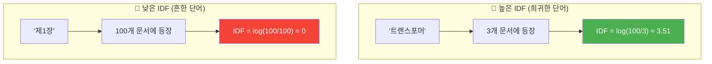
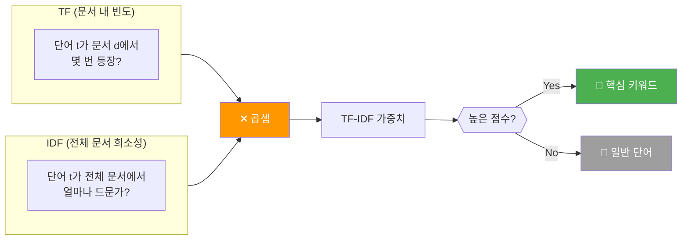
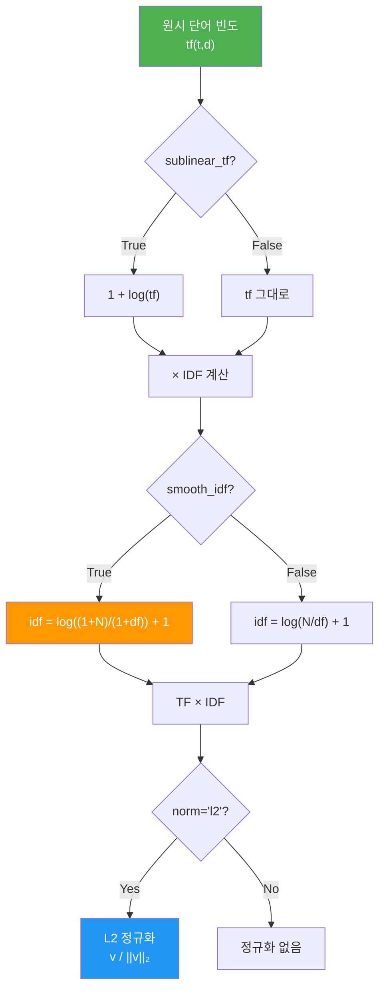
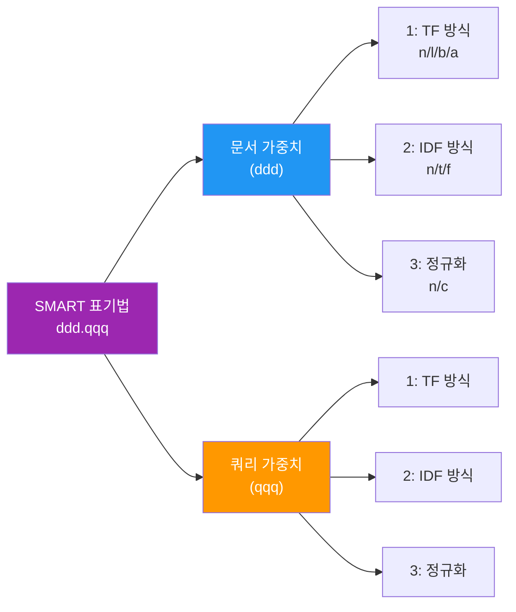

# TF-IDF의 이론

> 단어의 "진짜 중요도"를 수학적으로 측정하는 가중치 기법, TF-IDF의 원리를 파헤칩니다

## 개요

이 섹션에서는 Bag of Words와 CountVectorizer가 단순히 단어 출현 빈도만 세는 한계를 넘어, **단어의 실질적인 중요도**를 수학적으로 계량하는 TF-IDF(Term Frequency–Inverse Document Frequency)의 이론적 기반을 학습합니다.

**선수 지식**: [01. Bag of Words 모델](03-ch3-텍스트-표현-bow와-tf-idf/01-01-bag-of-words-모델.md)에서 배운 문서-단어 행렬(DTM)과 희소 행렬 개념, [02. N-gram과 CountVectorizer](03-ch3-텍스트-표현-bow와-tf-idf/02-02-n-gram과-countvectorizer.md)에서 다룬 CountVectorizer의 사용법

**학습 목표**:
- TF(단어 빈도)와 IDF(역문서 빈도)의 수학적 정의를 이해하고 직접 계산할 수 있다
- TF-IDF가 BoW의 한계를 어떻게 극복하는지 설명할 수 있다
- scikit-learn의 TF-IDF 구현이 사용하는 정확한 수식을 알 수 있다
- 손으로 TF-IDF 가중치를 계산하여 결과를 검증할 수 있다
- TF-IDF의 탄생 배경과 역사적 맥락(Karen Spärck Jones의 IDF 발명)을 설명할 수 있다

## 왜 알아야 할까?

앞서 Bag of Words와 CountVectorizer로 문서를 숫자 벡터로 바꾸는 방법을 배웠죠. 하지만 한 가지 큰 문제가 있었습니다. "은", "는", "이", "가" 같은 단어, 또는 영어 문서에서 "the", "is", "a" 같은 단어가 빈도수 1위를 차지하는 거예요. 이런 단어들이 정말 문서의 핵심을 대표할까요? 당연히 아니죠.

검색 엔진에 "파이썬 머신러닝 튜토리얼"이라고 검색했을 때, "튜토리얼"이라는 단어가 거의 모든 문서에 등장한다면 이 단어는 검색 결과를 구분하는 데 별 도움이 안 됩니다. 반면 "파이썬"이 특정 문서들에만 집중적으로 등장한다면, 그 단어야말로 문서를 분류하는 핵심 키워드인 셈이죠.

TF-IDF는 바로 이 직관을 수학으로 옮긴 것입니다. **"많이 나오면서, 동시에 소수의 문서에만 나오는 단어"**에 높은 점수를 주는 거죠. 이 간단하지만 강력한 아이디어는 1972년에 탄생한 이래 50년 넘게 정보 검색, 텍스트 분류, 추천 시스템의 핵심 기술로 살아남았습니다. Google 검색의 초기 알고리즘에도, 2015년 조사에서 디지털 라이브러리 텍스트 추천 시스템의 83%에도 TF-IDF가 사용되고 있었거든요.

## 핵심 개념

### 개념 1: TF — 단어 빈도(Term Frequency)

> 💡 **비유**: 여러분이 어떤 책에 대해 독후감을 쓴다고 상상해보세요. 독후감에서 "주인공"이라는 단어를 10번 쓰고, "서문"이라는 단어를 1번 썼다면, 이 독후감에서 "주인공"이 훨씬 중요한 키워드라고 짐작할 수 있겠죠? TF는 바로 이 직관—**한 문서 안에서 많이 등장할수록 그 문서에 중요한 단어**—을 숫자로 표현한 것입니다.

TF(Term Frequency)는 특정 단어 $t$가 문서 $d$에서 등장하는 횟수를 나타냅니다. 가장 기본적인 형태는 단순히 원시 빈도(raw count)를 사용하는 것입니다:

$$\text{tf}(t, d) = f_{t,d}$$

여기서 $f_{t,d}$는 단어 $t$가 문서 $d$에 등장한 횟수입니다.

> 📊 **그림 1**: TF 계산의 기본 흐름


하지만 원시 빈도를 그대로 쓰면, 길이가 긴 문서가 무조건 높은 TF를 갖게 되는 문제가 있습니다. 이를 보완하는 여러 변형이 있는데요:

| 변형 | 수식 | 설명 |
|------|------|------|
| 원시 빈도 | $f_{t,d}$ | 가장 단순, scikit-learn 기본값 |
| 로그 스케일링 | $1 + \log(f_{t,d})$ | 빈도 차이를 완화 |
| 정규화 | $\frac{f_{t,d}}{\max_{t' \in d} f_{t',d}}$ | 문서 내 최대 빈도로 나눔 |
| 불리언 | $1 \text{ if } f_{t,d} > 0, \text{ else } 0$ | 존재 여부만 |

scikit-learn에서는 `sublinear_tf=True` 옵션을 사용하면 로그 스케일링 $1 + \log(f_{t,d})$이 적용됩니다. 기본값은 원시 빈도를 그대로 사용하는 것이에요.

```run:python
# TF를 직접 계산해봅시다
doc = "고양이가 좋아 고양이가 귀여워 강아지도 좋아"
tokens = doc.split()

# 단어별 빈도 카운트
from collections import Counter
tf = Counter(tokens)
print("단어별 TF (원시 빈도):")
for word, count in tf.most_common():
    print(f"  '{word}': {count}")
```

```output
단어별 TF (원시 빈도):
  '고양이가': 2
  '좋아': 2
  '귀여워': 1
  '강아지도': 1
```

### 개념 2: IDF — 역문서 빈도(Inverse Document Frequency)

> 💡 **비유**: 대학교 수업 교재 100권을 조사한다고 해봅시다. "제1장"이라는 단어는 100권 전부에 나오겠죠? 반면 "트랜스포머"라는 단어는 AI 관련 책 3권에만 나올 겁니다. 모든 책에 나오는 "제1장"은 특정 책을 찾는 데 쓸모가 없고, 소수의 책에만 나오는 "트랜스포머"야말로 **그 책을 특정 짓는 핵심 단어**입니다. IDF는 "얼마나 드물게 등장하는가"를 측정합니다.

IDF(Inverse Document Frequency)는 단어의 **문서 간 희소성**을 측정합니다. 핵심 아이디어는 간단합니다: **많은 문서에 등장하는 단어일수록 가치가 낮다**.

기본 IDF 수식:

$$\text{idf}(t) = \log \frac{N}{\text{df}(t)}$$

여기서:
- $N$ = 전체 문서 수
- $\text{df}(t)$ = 단어 $t$가 등장하는 문서의 수 (document frequency)

> 📊 **그림 2**: IDF의 직관 — 문서 빈도와 가중치의 반비례 관계



IDF의 수학적 특성을 살펴볼까요?

- 모든 문서에 등장하는 단어: $\text{df}(t) = N$ → $\text{idf} = \log(1) = 0$ (가치 없음!)
- 단 1개 문서에만 등장: $\text{df}(t) = 1$ → $\text{idf} = \log(N)$ (최대 가치)
- $\text{df}$가 커질수록 $\text{idf}$는 **로그 스케일로 감소**

로그를 사용하는 이유가 궁금하시죠? 만약 로그 없이 $N / \text{df}(t)$를 그대로 쓰면, 100개 문서에서 1개에만 등장하는 단어의 가중치가 100이 되고 50개에 등장하는 단어는 2가 됩니다. 차이가 50배나 나죠. 로그를 취하면 이 차이가 $\log(100) - \log(2) \approx 4.6 - 0.7 = 3.9$로 완화됩니다. 단어 간 가중치 차이가 극단적으로 벌어지는 것을 방지하는 **댐퍼(damper)** 역할을 하는 거예요.

```run:python
import math

# 전체 문서 수
N = 100

# 다양한 df 값에 대한 IDF 계산
test_cases = [
    ("'트랜스포머' (3개 문서)", 3),
    ("'딥러닝' (15개 문서)", 15),
    ("'학습' (60개 문서)", 60),
    ("'제1장' (100개 문서)", 100),
]

print(f"전체 문서 수 N = {N}")
print(f"{'단어':<25} {'df':>5} {'IDF (log)':>10}")
print("-" * 45)
for name, df in test_cases:
    idf = math.log(N / df)  # 자연로그
    print(f"{name:<25} {df:>5} {idf:>10.4f}")
```

```output
전체 문서 수 N = 100
단어                           df  IDF (log)
---------------------------------------------
'트랜스포머' (3개 문서)           3     3.5066
'딥러닝' (15개 문서)             15     1.8971
'학습' (60개 문서)               60     0.5108
'제1장' (100개 문서)            100     0.0000
```

### 개념 3: TF-IDF — 두 값의 결합

> 💡 **비유**: TF를 **"현지인의 평판"**, IDF를 **"글로벌 희소성"**이라고 생각해보세요. 어떤 식당이 동네에서 인기가 높고(TF 높음), 전국적으로도 흔하지 않은 독특한 메뉴를 가졌다면(IDF 높음), 그 식당이야말로 "이 동네를 대표하는 맛집"이 됩니다. TF-IDF는 이 두 가지를 **곱하여** 단어의 최종 중요도를 결정합니다.

TF-IDF는 TF와 IDF를 곱한 값입니다:

$$\text{tf-idf}(t, d) = \text{tf}(t, d) \times \text{idf}(t)$$

이 수식이 의미하는 바는 명확합니다:

- **TF 높고 + IDF 높으면** → TF-IDF 높음 → *특정 문서에서 많이 나오고, 다른 문서에서는 드문 단어* → **핵심 키워드!**
- **TF 높고 + IDF 낮으면** → TF-IDF 낮음 → *어디서나 많이 나오는 평범한 단어* → 불용어에 가까움
- **TF 낮고 + IDF 높으면** → TF-IDF 중간 → *드물게 나타나지만 이 문서에서도 적음* → 잠재적 키워드
- **TF 낮고 + IDF 낮으면** → TF-IDF 낮음 → *의미 없는 단어*

> 📊 **그림 3**: TF-IDF의 작동 원리 — TF와 IDF의 곱으로 최종 가중치 결정



이 단순한 곱셈이 어떻게 BoW의 한계를 극복하는지 정리해볼까요?

| BoW의 한계 | TF-IDF의 해결 |
|-----------|--------------|
| 모든 단어에 동일한 가중치 | IDF로 희귀한 단어에 높은 가중치 |
| 불용어가 높은 빈도 차지 | 불용어는 IDF ≈ 0 → 자동으로 억제 |
| 문서 특성 단어 구분 불가 | TF × IDF → 문서 고유 키워드 부각 |

### 개념 4: scikit-learn의 TF-IDF 구현 — 표준 수식과의 차이

scikit-learn은 교과서 수식을 그대로 쓰지 않습니다. 실무에서 생기는 문제를 해결하기 위한 **세 가지 조정**이 기본 적용되어 있거든요. 이 차이를 모르면 수작업 계산과 scikit-learn 결과가 달라서 당황할 수 있어요.

> 📊 **그림 4**: scikit-learn TF-IDF 처리 파이프라인



**조정 1: Smooth IDF (기본값 `smooth_idf=True`)**

교과서 수식: $\text{idf}(t) = \log \frac{N}{\text{df}(t)}$

scikit-learn 기본 수식:

$$\text{idf}(t) = \log \frac{1 + N}{1 + \text{df}(t)} + 1$$

왜 이렇게 바꿨을까요? 분모와 분자에 1을 더하는 이유는 **제로 디비전(0으로 나누기) 방지**입니다. 학습 데이터에 없던 단어가 새 문서에 등장하면 $\text{df}(t) = 0$이 되어 수식이 터지는데, 스무딩으로 이를 방지합니다. 그리고 마지막에 +1을 더하는 것은 IDF가 0이 되는 것을 막아 **모든 단어가 최소한의 가중치를 갖도록** 보장합니다.

**조정 2: 서브리니어 TF (옵션 `sublinear_tf=True`)**

기본 TF: $\text{tf}(t, d) = f_{t,d}$

서브리니어 TF: $\text{tf}(t, d) = 1 + \log(f_{t,d})$

단어가 10번 나오는 것이 1번 나오는 것보다 10배 중요하지는 않잖아요? 로그로 차이를 완화하는 거예요. 긴 문서에서 특히 효과적입니다.

**조정 3: L2 정규화 (기본값 `norm='l2'`)**

최종 TF-IDF 벡터를 유클리드 노름(L2 norm)으로 나누어 **단위 벡터**로 만듭니다:

$$v_{\text{norm}} = \frac{v}{\|v\|_2} = \frac{v}{\sqrt{v_1^2 + v_2^2 + \cdots + v_n^2}}$$

이 정규화 덕분에 문서 길이에 관계없이 벡터의 크기가 1로 통일되어, **코사인 유사도 계산이 내적(dot product)만으로 가능**해집니다.

```run:python
import math

# 예제: 3개 문서, scikit-learn 방식으로 수동 계산
docs = [
    "고양이 좋아 고양이 귀여워",  # doc 0
    "강아지 좋아",                # doc 1
    "고양이 강아지 좋아"           # doc 2
]

N = len(docs)  # 전체 문서 수 = 3
tokens_list = [doc.split() for doc in docs]

# 1단계: 어휘 사전
vocab = sorted(set(word for tokens in tokens_list for word in tokens))
print(f"어휘 사전: {vocab}")

# 2단계: df 계산
df = {}
for word in vocab:
    df[word] = sum(1 for tokens in tokens_list if word in tokens)
print(f"\n문서 빈도(df): {df}")

# 3단계: IDF 계산 (scikit-learn smooth 방식)
idf = {}
for word in vocab:
    idf[word] = math.log((1 + N) / (1 + df[word])) + 1
print(f"\nIDF (smooth): ", end="")
print({w: round(v, 4) for w, v in idf.items()})
```

```output
어휘 사전: ['강아지', '고양이', '귀여워', '좋아']

문서 빈도(df): {'강아지': 2, '고양이': 2, '귀여워': 1, '좋아': 3}

IDF (smooth): {'강아지': 1.2877, '고양이': 1.2877, '귀여워': 1.6931, '좋아': 1.0}
```

결과를 보면, 모든 문서에 등장하는 "좋아"의 IDF가 1.0으로 가장 낮고, 1개 문서에만 등장하는 "귀여워"의 IDF가 1.6931로 가장 높습니다. 스무딩 + 1 덕분에 IDF가 0이 되지 않고 최소 1.0을 유지하는 것도 확인할 수 있죠.

## 실습: 직접 해보기

수동 계산 결과가 scikit-learn과 정확히 일치하는지 검증해봅시다. 이 과정을 통해 TF-IDF의 내부 작동 방식을 완전히 이해할 수 있습니다.

```python
import math
import numpy as np
from sklearn.feature_extraction.text import TfidfVectorizer

# ========================================
# 1. 예제 문서 준비
# ========================================
docs = [
    "고양이 좋아 고양이 귀여워",  # doc 0: "고양이" 2번
    "강아지 좋아",                # doc 1
    "고양이 강아지 좋아"           # doc 2
]

# ========================================
# 2. scikit-learn TfidfVectorizer로 계산
# ========================================
vectorizer = TfidfVectorizer()
tfidf_matrix = vectorizer.fit_transform(docs)

# 어휘 사전과 IDF 확인
feature_names = vectorizer.get_feature_names_out()
print("=== scikit-learn 결과 ===")
print(f"어휘 사전: {list(feature_names)}")
print(f"IDF 값:   {np.round(vectorizer.idf_, 4)}")
print(f"\nTF-IDF 행렬 (L2 정규화 적용):")
print(np.round(tfidf_matrix.toarray(), 4))

# ========================================
# 3. 수동 계산으로 검증
# ========================================
print("\n=== 수동 계산 검증 (doc 0) ===")
N = 3  # 전체 문서 수
tokens_0 = docs[0].split()  # ['고양이', '좋아', '고양이', '귀여워']

# TF: 각 단어의 원시 빈도
from collections import Counter
tf_0 = Counter(tokens_0)
print(f"doc 0의 TF: {dict(tf_0)}")

# 어휘 사전 순서에 맞춰 TF-IDF 계산
vocab = list(feature_names)  # ['강아지', '고양이', '귀여워', '좋아']
df_dict = {'강아지': 2, '고양이': 2, '귀여워': 1, '좋아': 3}

tfidf_manual = []
for word in vocab:
    tf = tf_0.get(word, 0)
    idf = math.log((1 + N) / (1 + df_dict[word])) + 1
    tfidf_manual.append(tf * idf)

print(f"TF-IDF (정규화 전): {[round(v, 4) for v in tfidf_manual]}")

# L2 정규화
norm = math.sqrt(sum(v**2 for v in tfidf_manual))
tfidf_normalized = [v / norm for v in tfidf_manual]
print(f"TF-IDF (L2 정규화): {[round(v, 4) for v in tfidf_normalized]}")

# scikit-learn 결과와 비교
sklearn_result = tfidf_matrix.toarray()[0]
print(f"scikit-learn 결과:  {[round(v, 4) for v in sklearn_result]}")
print(f"일치 여부: {np.allclose(tfidf_normalized, sklearn_result)}")

# ========================================
# 4. 단어별 TF-IDF 랭킹 (doc 0)
# ========================================
print("\n=== doc 0의 단어 중요도 랭킹 ===")
word_scores = list(zip(vocab, sklearn_result))
word_scores.sort(key=lambda x: x[1], reverse=True)
for word, score in word_scores:
    indicator = "⭐" if score > 0 else "  "
    print(f"  {indicator} '{word}': {score:.4f}")
```

> 🔥 **실무 팁**: `TfidfVectorizer`는 `CountVectorizer` + `TfidfTransformer`를 합친 편의 클래스입니다. 파이프라인에서 카운트 행렬을 재사용해야 한다면 두 클래스를 분리하여 사용하세요.

## 더 깊이 알아보기

### Karen Spärck Jones — IDF의 어머니

TF-IDF의 핵심 혁신인 IDF 개념은 1972년 영국의 컴퓨터 과학자 **Karen Spärck Jones**가 발표한 논문 *"A Statistical Interpretation of Term Specificity and Its Application in Retrieval"*에서 처음 제안되었습니다.

놀랍게도 Spärck Jones는 원래 언어학과 철학을 전공한 학자였어요. 1950년대 케임브리지 대학에서 기계 번역 연구를 하다가, "단어의 중요도를 어떻게 자동으로 측정할 수 있을까?"라는 질문에 빠져들었습니다. 당시 정보 검색(Information Retrieval) 분야에서는 모든 단어를 동등하게 취급하거나, 사람이 직접 키워드를 지정하는 수동 방식을 사용하고 있었죠.

Spärck Jones의 통찰은 우아할 정도로 단순했습니다: **"단어의 특이성(specificity)은 그 단어가 등장하는 문서 수의 역수로 측정할 수 있다."** 이 아이디어를 논문으로 발표했지만, 처음에는 크게 주목받지 못했습니다. 그녀의 연구가 재조명된 것은 1990년대 웹 검색 엔진이 폭발적으로 성장하면서부터였어요. IDF는 검색 결과의 관련성(relevance)을 계산하는 핵심 도구가 되었고, 오늘날 Google을 비롯한 모든 검색 엔진의 기초를 이루고 있습니다.

Spärck Jones는 2007년 타계할 때까지 케임브리지 대학에서 연구를 이어갔으며, 그녀의 유명한 말을 남겼습니다: *"Computing is too important to be left to men."* ACM은 2022년부터 그녀의 이름을 딴 상(Karen Spärck Jones Award)을 수여하고 있습니다.

### SMART 표기법 — TF-IDF 변형을 체계적으로 기술하기

앞서 TF의 변형(원시 빈도, 로그 스케일링, 정규화, 불리언)과 IDF의 변형(기본, smooth), 정규화 방식(없음, L2, L1)을 살펴봤는데요. 이렇게 다양한 조합이 존재하다 보니, "내가 사용하는 TF-IDF가 정확히 어떤 변형인지"를 간결하게 표기할 방법이 필요했습니다.

이를 위해 **SMART(System for the Mechanical Analysis and Retrieval of Text) 표기법**이 사용됩니다. Cornell 대학의 Gerard Salton 연구팀이 1960년대에 개발한 SMART 정보 검색 시스템에서 유래한 이 표기법은, TF-IDF 가중치 스킴을 **`ddd.qqq`** 형식의 6글자로 압축합니다.

앞 3글자(`ddd`)는 **문서(document)** 측 가중치, 뒤 3글자(`qqq`)는 **쿼리(query)** 측 가중치를 나타내며, 각 자리는 순서대로 **TF 방식 · IDF 방식 · 정규화 방식**을 의미합니다.

| 자리 | 의미 | 주요 옵션 |
|------|------|-----------|
| 1번째 (TF) | Term Frequency 변형 | `n` = natural(원시), `l` = logarithm($1+\log$), `b` = boolean, `a` = augmented |
| 2번째 (IDF) | Document Frequency 변형 | `n` = none(IDF 미적용), `t` = idf($\log N/\text{df}$), `f` = smooth idf |
| 3번째 (Norm) | 정규화 방식 | `n` = none, `c` = cosine(L2) |

예를 들어 볼까요?

- **`ntc.ntn`** → 문서: natural TF + idf + cosine 정규화 / 쿼리: natural TF + idf + 정규화 없음
- **`lnc.ltc`** → 문서: log TF + IDF 없음 + cosine / 쿼리: log TF + idf + cosine

scikit-learn의 `TfidfVectorizer` 기본 설정은 대략 **`nfc.nfn`** (natural TF, smooth IDF에 +1 오프셋, cosine 정규화)에 해당합니다. 다만 scikit-learn의 smooth IDF 수식($\log \frac{1+N}{1+\text{df}} + 1$)은 전통적인 SMART 표기와 정확히 일대일 대응하지 않아서, 논문에서 TF-IDF 변형을 비교할 때 SMART 표기법을 참고하되, 구현의 세부 수식은 항상 확인하는 습관이 필요합니다.

> 📊 **그림 5**: SMART 표기법 구조



## 흔한 오해와 팁

> ⚠️ **흔한 오해**: "TF-IDF에서 로그의 밑(base)은 반드시 10이어야 한다." — 사실 로그의 밑은 결과의 스케일만 바꿀 뿐, 단어 간 상대적 순위에는 영향을 미치지 않습니다. $\log_2$, $\log_{10}$, $\ln$(자연로그) 중 어떤 것을 써도 결론은 같아요. scikit-learn은 자연로그($\ln$)를 사용합니다.

> 💡 **알고 계셨나요?**: scikit-learn의 IDF 수식 $\log \frac{1+N}{1+\text{df}} + 1$에서 마지막 "+1"을 빼면, 모든 문서에 등장하는 단어의 IDF가 $\log(1) = 0$이 되어 그 단어가 완전히 무시됩니다. +1을 더해서 최소 가중치 1.0을 보장하는 건 의도적인 설계예요. 만약 진짜로 불용어를 완전히 제거하고 싶다면, TF-IDF에 의존하지 말고 `stop_words` 파라미터를 사용하는 것이 정석입니다.

> 🔥 **실무 팁**: 긴 문서와 짧은 문서가 섞인 코퍼스에서는 `sublinear_tf=True`를 켜세요. 긴 문서에서 특정 단어가 수십 번 등장해도 로그로 눌러주기 때문에, 문서 길이에 따른 편향이 크게 줄어듭니다. 실제로 텍스트 분류 작업에서 정확도가 2-5% 개선되는 경우가 흔합니다.

## 핵심 정리

| 개념 | 설명 |
|------|------|
| TF (Term Frequency) | 문서 내 단어 출현 빈도. 문서에서 많이 등장할수록 높은 값 |
| IDF (Inverse Document Frequency) | 전체 문서 중 단어의 희소성. 적은 문서에 등장할수록 높은 값 |
| TF-IDF | TF × IDF. "이 문서에서 중요하면서 전체적으로 드문" 단어에 높은 가중치 |
| Smooth IDF | scikit-learn 기본값. 분모/분자에 +1로 제로 디비전 방지, 결과에 +1로 최소 가중치 보장 |
| Sublinear TF | $1 + \log(\text{tf})$로 빈도 차이를 로그 스케일로 완화 |
| L2 정규화 | 벡터를 단위 벡터로 변환. 문서 길이 차이 보정, 코사인 유사도 계산 효율화 |
| SMART 표기법 | `ddd.qqq` 6글자로 TF-IDF 변형(TF방식·IDF방식·정규화)을 체계적으로 기술하는 표준 표기법 |

## 다음 섹션 미리보기

TF-IDF의 수학을 이해했으니, 다음 섹션 [04. TfidfVectorizer 실습](03-ch3-텍스트-표현-bow와-tf-idf/04-04-tfidfvectorizer-실습.md)에서는 scikit-learn의 `TfidfVectorizer`를 실제 한국어/영어 코퍼스에 적용합니다. `max_df`, `min_df`, `max_features` 등 실무에서 핵심적인 하이퍼파라미터 튜닝 방법과, 다양한 옵션 조합이 결과에 미치는 영향을 실험합니다.

## 참고 자료

- [scikit-learn Feature Extraction — TF-IDF 공식 문서](https://scikit-learn.org/stable/modules/feature_extraction.html) - scikit-learn의 정확한 TF-IDF 수식과 파라미터 설명
- [Karen Spärck Jones — Wikipedia](https://en.wikipedia.org/wiki/Karen_Sp%C3%A4rck_Jones) - IDF 개념의 창시자와 그 역사적 배경
- [tf–idf — Wikipedia](https://en.wikipedia.org/wiki/Tf%E2%80%93idf) - TF-IDF의 다양한 변형과 SMART 표기법 참고
- [Stanford CS 224N: Natural Language Processing with Deep Learning](https://web.stanford.edu/class/cs224n/) - TF-IDF를 포함한 NLP 기초 이론의 학술적 관점
- [Analyzing Documents with TF-IDF — Programming Historian](https://programminghistorian.org/en/lessons/analyzing-documents-with-tfidf) - TF-IDF의 실무적 활용 사례와 튜토리얼

---
### 🔗 Related Sessions
- [bag_of_words](03-ch3-텍스트-표현-bow와-tf-idf/01-01-bag-of-words-모델.md) (prerequisite)
- [vocabulary](03-ch3-텍스트-표현-bow와-tf-idf/01-01-bag-of-words-모델.md) (prerequisite)
- [document_term_matrix](03-ch3-텍스트-표현-bow와-tf-idf/01-01-bag-of-words-모델.md) (prerequisite)
- [sparse_matrix](03-ch3-텍스트-표현-bow와-tf-idf/01-01-bag-of-words-모델.md) (prerequisite)
