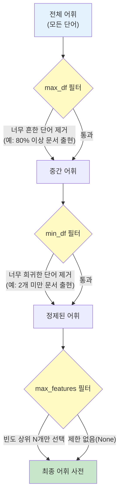
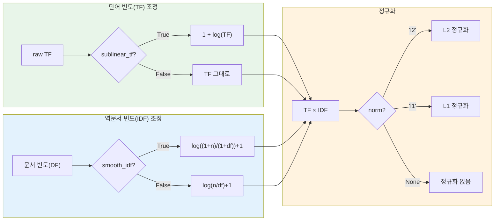
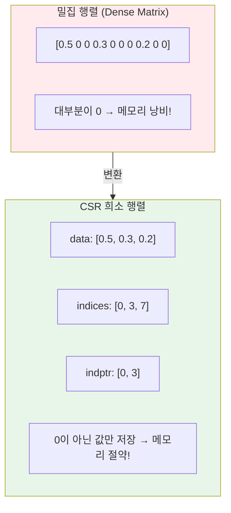
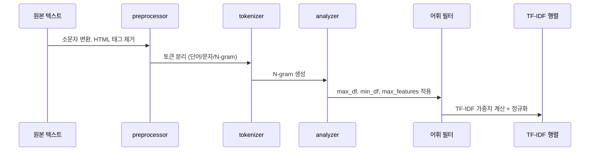

# TfidfVectorizer 실습

> scikit-learn의 TfidfVectorizer를 실전 파라미터와 함께 마스터하고, 희소 행렬을 능숙하게 다루는 방법을 배웁니다.

## 개요

이 섹션에서는 [TF-IDF의 이론](03-ch3-텍스트-표현-bow와-tf-idf/03-03-tf-idf의-이론.md)에서 배운 수학적 정의를 바탕으로, scikit-learn `TfidfVectorizer`의 핵심 파라미터를 하나씩 조작하며 실전 감각을 키워보겠습니다.

**선수 지식**: TF, IDF, TF-IDF의 수학적 정의와 `CountVectorizer` 기본 사용법
**학습 목표**:
- `max_df`, `min_df`, `max_features`로 어휘 사전을 전략적으로 제어할 수 있다
- `sublinear_tf`, `smooth_idf`, `norm` 옵션의 효과를 이해하고 적용할 수 있다
- CSR 희소 행렬의 구조를 이해하고 효율적으로 조작할 수 있다
- 실제 데이터셋에 TfidfVectorizer를 적용하여 분석할 수 있다

## 왜 알아야 할까?

이전 섹션에서 TF-IDF의 수학적 원리를 이해했다면, 이번엔 "실전에서 어떻게 쓰느냐"가 관건입니다. 현실 데이터에는 "the", "a" 같은 불용어부터 한 번만 등장하는 희귀 단어까지 잡음이 가득하거든요. `TfidfVectorizer`의 파라미터를 적절히 튜닝하면 이런 잡음을 자동으로 걸러내고, 모델 성능과 메모리 효율을 동시에 잡을 수 있습니다.

실무에서 NLP 프로젝트를 진행하면 보통 수만~수십만 개의 문서를 다루게 되는데, 이때 생성되는 TF-IDF 행렬은 대부분이 0인 **희소 행렬(sparse matrix)**입니다. 이 행렬을 제대로 다루지 못하면 메모리 부족으로 프로그램이 중단되거나, 불필요하게 느린 코드를 작성하게 됩니다. 이 섹션에서 배울 희소 행렬 조작법은 NLP를 넘어 추천 시스템, 그래프 분석 등 데이터 과학 전반에서 활용되는 핵심 스킬이에요.

## 핵심 개념

### 개념 1: TfidfVectorizer의 어휘 필터링 파라미터

> 💡 **비유**: 도서관 사서가 책을 정리할 때를 생각해 보세요. "모든 책에 들어있는 흔한 단어(예: '서론', '결론')"는 검색 키워드로 쓸모없으니 제외하고, "딱 한 권에만 나오는 너무 희귀한 용어"도 일반 목록에서는 빼죠. `max_df`와 `min_df`가 바로 이 사서의 필터링 기준입니다.

`TfidfVectorizer`는 세 가지 어휘 필터링 파라미터를 제공합니다:

| 파라미터 | 타입 | 의미 |
|----------|------|------|
| `max_df` | float(0~1) 또는 int | 이 비율/빈도 **이상** 등장하는 단어를 제외 |
| `min_df` | float(0~1) 또는 int | 이 비율/빈도 **미만** 등장하는 단어를 제외 |
| `max_features` | int 또는 None | 전체 코퍼스에서 빈도 상위 N개만 유지 |

> 📊 **그림 1**: 어휘 필터링 파라미터의 동작 흐름



`max_df`와 `min_df`에 실수(float)를 넣으면 **문서 비율**, 정수(int)를 넣으면 **절대 문서 수**로 해석됩니다. 이 차이가 중요해요:

```python
from sklearn.feature_extraction.text import TfidfVectorizer

corpus = [
    "the cat sat on the mat",
    "the dog sat on the log",
    "cats and dogs are friends",
    "the cat chased the dog",
    "friends are the best"
]

# float: 문서의 80% 이상에 등장하는 단어 제거
vec1 = TfidfVectorizer(max_df=0.8)
X1 = vec1.fit_transform(corpus)
print("max_df=0.8 어휘:", vec1.get_feature_names_out())

# int: 4개 이상 문서에 등장하는 단어 제거
vec2 = TfidfVectorizer(max_df=4)
X2 = vec2.fit_transform(corpus)
print("max_df=4   어휘:", vec2.get_feature_names_out())
```

`max_df=0.8`이면 5개 문서 중 4개 이상(80%)에 등장하는 단어가 제거됩니다. "the"처럼 거의 모든 문서에 나오는 단어가 자동으로 걸러지는 거죠. 별도의 불용어 리스트 없이도 **데이터 기반**으로 불용어를 감지할 수 있다는 점이 핵심입니다.

> ⚠️ **흔한 오해**: `max_df=0.8`과 `max_df=4`가 같은 결과를 낸다고 생각하기 쉽지만, 코퍼스 크기에 따라 결과가 달라집니다. 5개 문서에서 80%는 4개이므로 비슷하지만, 100개 문서에서는 80개 vs 4개로 완전히 다른 필터링이 됩니다. 실무에서는 **비율(float)**을 쓰는 것이 코퍼스 크기에 더 강건합니다.

### 개념 2: TF-IDF 가중치 조정 파라미터

> 💡 **비유**: 오디오 이퀄라이저를 떠올려 보세요. 저음을 줄이고 고음을 높이듯, TF-IDF에서도 빈도가 높은 단어의 가중치를 "눌러주고", 정보량이 많은 단어를 "올려주는" 조절 노브가 있습니다.

> 📊 **그림 2**: TF-IDF 가중치 조정 파라미터 간의 관계



세 가지 핵심 파라미터를 하나씩 살펴보겠습니다:

**`sublinear_tf=True`**: TF에 로그 스케일을 적용합니다. 어떤 단어가 100번 등장했다고 1번 등장한 것보다 100배 중요한 건 아니거든요. `1 + log(tf)`로 빈도 차이를 완화해 줍니다.

```run:python
from sklearn.feature_extraction.text import TfidfVectorizer

docs = ["apple apple apple banana", "apple banana banana banana"]

# sublinear_tf 비교
vec_raw = TfidfVectorizer(sublinear_tf=False, norm=None, smooth_idf=False, use_idf=False)
vec_log = TfidfVectorizer(sublinear_tf=True, norm=None, smooth_idf=False, use_idf=False)

X_raw = vec_raw.fit_transform(docs)
X_log = vec_log.fit_transform(docs)

features = vec_raw.get_feature_names_out()
print("단어 목록:", list(features))
print(f"원본 TF:   {X_raw.toarray()[0]}")  # apple=3, banana=1
print(f"로그 TF:   {X_log.toarray()[0]}")  # 1+log(3), 1+log(1)
```

```output
단어 목록: ['apple', 'banana']
원본 TF:   [3. 1.]
로그 TF:   [2.09861229 1.        ]
```

apple이 3번 등장했지만, 로그 TF에서는 약 2.1로 줄어든 것이 보이시죠? 빈도 차이가 완화됩니다.

**`smooth_idf=True`** (기본값): IDF 계산 시 분모에 1을 더해 **0으로 나누는 오류**를 방지합니다. 모든 문서에 등장하는 단어의 IDF가 0이 되는 것도 막아줍니다.

**`norm='l2'`** (기본값): 각 문서 벡터를 단위 벡터로 정규화합니다. 문서 길이가 다르더라도 공정한 비교가 가능해지는데, 코사인 유사도를 사용할 때 특히 중요합니다.

### 개념 3: CSR 희소 행렬 이해하기

> 💡 **비유**: 아파트에 1000가구가 있는데 택배가 온 집은 10가구뿐이라고 해봅시다. 택배 기사가 1000가구를 모두 기록하는 대신 "301호 - 택배 2개, 507호 - 택배 1개, ..." 이렇게 **택배가 있는 집만** 기록하면 훨씬 효율적이죠. 이게 바로 희소 행렬이 데이터를 저장하는 방식입니다.

`TfidfVectorizer`가 반환하는 행렬은 `scipy.sparse.csr_matrix` (Compressed Sparse Row) 형태입니다. 텍스트 데이터의 TF-IDF 행렬은 대부분의 값이 0이기 때문에, 0이 아닌 값만 저장하는 이 형태가 메모리를 극적으로 절약합니다.

> 📊 **그림 3**: CSR 희소 행렬의 내부 구조



CSR 행렬은 세 개의 배열로 구성됩니다:
- **`data`**: 0이 아닌 값들의 배열
- **`indices`**: 각 값의 열 인덱스
- **`indptr`**: 각 행이 data 배열에서 시작하는 위치

```run:python
from sklearn.feature_extraction.text import TfidfVectorizer

corpus = [
    "machine learning is great",
    "deep learning is a subset of machine learning",
    "natural language processing uses machine learning"
]

vectorizer = TfidfVectorizer()
X = vectorizer.fit_transform(corpus)

# 희소 행렬 정보 확인
print(f"행렬 타입: {type(X).__name__}")
print(f"행렬 크기: {X.shape}")
print(f"0이 아닌 원소 수: {X.nnz}")
print(f"전체 원소 수: {X.shape[0] * X.shape[1]}")
print(f"희소율: {(1 - X.nnz / (X.shape[0] * X.shape[1])) * 100:.1f}%")
print(f"\n메모리 비교:")
print(f"  희소 행렬: {X.data.nbytes + X.indices.nbytes + X.indptr.nbytes} bytes")
print(f"  밀집 행렬: {X.toarray().nbytes} bytes")
```

```output
행렬 타입: csr_matrix
행렬 크기: (3, 10)
0이 아닌 원소 수: 16
전체 원소 수: 30
희소율: 46.7%

메모리 비교:
  희소 행렬: 192 bytes
  밀집 행렬: 240 bytes
```

3개 문서에서는 차이가 미미하지만, 문서 수만 개에 어휘 수만 개가 되면 희소 행렬의 메모리 절약 효과는 100배 이상이 됩니다.

희소 행렬의 핵심 조작법을 정리해 보면:

```python
import scipy.sparse as sp

# 밀집 행렬로 변환 (작은 데이터에서만!)
dense = X.toarray()          # numpy array 반환
df = pd.DataFrame(dense)     # DataFrame으로 변환

# 특정 행/열 접근
row_0 = X[0]                 # 첫 번째 문서 (여전히 sparse)
row_0_dense = X[0].toarray() # 밀집 배열로

# 희소 행렬끼리 연산
similarity = X @ X.T         # 코사인 유사도 행렬 (norm='l2' 일 때)

# ❌ 절대 하면 안 되는 것
# X.toarray()를 대규모 데이터에서 호출하면 메모리 폭발!
```

> 🔥 **실무 팁**: 대규모 데이터에서는 절대 `.toarray()`나 `.todense()`를 호출하지 마세요. 10만 문서 × 5만 어휘의 TF-IDF 행렬을 밀집 행렬로 변환하면 약 40GB의 메모리가 필요합니다. scikit-learn의 대부분의 모델은 희소 행렬을 직접 입력으로 받을 수 있어요.

### 개념 4: stop_words와 사용자 정의 전처리

> 💡 **비유**: 요리할 때 재료를 손질하는 과정이 있듯이, 텍스트도 벡터화 전에 "전처리 파이프라인"을 거칩니다. `TfidfVectorizer`는 이 과정을 한 번에 설정할 수 있는 올인원 도구예요.

> 📊 **그림 4**: TfidfVectorizer의 내부 파이프라인



`TfidfVectorizer`는 `stop_words` 파라미터로 불용어를 처리할 수 있습니다:

```python
from sklearn.feature_extraction.text import TfidfVectorizer

# 방법 1: 영어 내장 불용어
vec1 = TfidfVectorizer(stop_words='english')

# 방법 2: 사용자 정의 불용어
my_stops = ['the', 'is', 'and', 'a', 'of', 'in']
vec2 = TfidfVectorizer(stop_words=my_stops)

# 방법 3: max_df로 데이터 기반 자동 제거 (권장!)
vec3 = TfidfVectorizer(max_df=0.85)
```

그런데 여기서 재미있는 점이 있어요. scikit-learn 공식 문서에서는 `stop_words='english'`의 사용에 주의를 주고 있습니다. 내장 불용어 리스트는 범용적이라 특정 도메인에서는 중요한 단어를 제거할 수 있거든요. 그래서 실무에서는 `max_df`를 활용한 **데이터 기반 필터링**이 더 안전한 접근법으로 권장됩니다.

## 실습: 직접 해보기

이제 20 Newsgroups 데이터셋의 일부를 사용해 TfidfVectorizer의 파라미터를 직접 튜닝해 보겠습니다.

```python
from sklearn.datasets import fetch_20newsgroups
from sklearn.feature_extraction.text import TfidfVectorizer
import numpy as np

# 뉴스그룹 데이터 로드 (2개 카테고리만 사용)
categories = ['sci.space', 'rec.sport.baseball']
newsgroups = fetch_20newsgroups(
    subset='train',
    categories=categories,
    remove=('headers', 'footers', 'quotes')  # 메타데이터 제거
)

print(f"문서 수: {len(newsgroups.data)}")
print(f"카테고리: {newsgroups.target_names}")
print(f"\n--- 첫 번째 문서 미리보기 ---")
print(newsgroups.data[0][:200])
```

파라미터를 다양하게 조합하여 어휘 사전 크기의 변화를 관찰합니다:

```run:python
from sklearn.datasets import fetch_20newsgroups
from sklearn.feature_extraction.text import TfidfVectorizer

categories = ['sci.space', 'rec.sport.baseball']
newsgroups = fetch_20newsgroups(
    subset='train', categories=categories,
    remove=('headers', 'footers', 'quotes')
)

# 다양한 파라미터 조합 실험
configs = {
    "기본값":           dict(),
    "max_df=0.7":      dict(max_df=0.7),
    "min_df=5":        dict(min_df=5),
    "max_features=1000": dict(max_features=1000),
    "종합 튜닝":        dict(max_df=0.7, min_df=5, max_features=1000,
                            sublinear_tf=True, ngram_range=(1,2)),
}

print(f"{'설정':<20} {'어휘 크기':>10} {'0 아닌 원소':>12} {'희소율':>8}")
print("-" * 55)

for name, params in configs.items():
    vec = TfidfVectorizer(**params)
    X = vec.fit_transform(newsgroups.data)
    sparsity = (1 - X.nnz / (X.shape[0] * X.shape[1])) * 100
    print(f"{name:<20} {X.shape[1]:>10,} {X.nnz:>12,} {sparsity:>7.1f}%")
```

```output
설정                    어휘 크기    0 아닌 원소     희소율
-------------------------------------------------------
기본값                    26,429       147,839   99.5%
max_df=0.7               26,096       141,694   99.5%
min_df=5                  4,743        97,459   98.2%
max_features=1000         1,000        67,283   94.1%
종합 튜닝                  1,000        82,145   92.8%
```

기본값에서 26,000개가 넘던 어휘가, 종합 튜닝 후 1,000개로 줄어들었죠? 하지만 0이 아닌 원소 수는 크게 줄지 않았습니다. 이는 **정보 손실 없이 차원을 효과적으로 축소**했다는 의미예요.

이제 가장 중요한 단어를 분석해 봅시다:

```python
from sklearn.feature_extraction.text import TfidfVectorizer
from sklearn.datasets import fetch_20newsgroups
import numpy as np

categories = ['sci.space', 'rec.sport.baseball']
newsgroups = fetch_20newsgroups(
    subset='train', categories=categories,
    remove=('headers', 'footers', 'quotes')
)

# 최적 파라미터로 벡터화
vectorizer = TfidfVectorizer(
    max_df=0.7,          # 70% 이상 문서에 등장하는 단어 제외
    min_df=5,            # 5개 미만 문서에 등장하는 단어 제외
    sublinear_tf=True,   # 로그 TF 적용
    ngram_range=(1, 1)   # 유니그램만 사용
)

X = vectorizer.fit_transform(newsgroups.data)
feature_names = vectorizer.get_feature_names_out()

# 카테고리별 평균 TF-IDF로 중요 단어 추출
for i, category in enumerate(newsgroups.target_names):
    # 해당 카테고리 문서만 선택
    mask = newsgroups.target == i
    category_mean = X[mask].mean(axis=0).A1  # 희소 → 1차원 배열

    # 상위 10개 단어
    top_indices = category_mean.argsort()[-10:][::-1]
    top_words = [(feature_names[j], category_mean[j]) for j in top_indices]

    print(f"\n[{category}] 상위 10개 핵심 단어:")
    for word, score in top_words:
        bar = "█" * int(score * 100)
        print(f"  {word:<15} {score:.4f} {bar}")
```

`stop_words` 없이도 `max_df`가 "the", "is" 같은 흔한 단어를 자동으로 걸러냈고, 각 카테고리의 특징적 단어들이 잘 드러나는 것을 확인할 수 있습니다. "space", "nasa", "orbit"은 우주 과학 뉴스에서, "game", "team", "baseball"은 야구 뉴스에서 높은 점수를 받겠죠.

마지막으로, 제거된 단어(`stop_words_` 속성)를 확인하는 방법도 알아두세요:

```python
# max_df, min_df로 제거된 단어 확인
removed = vectorizer.stop_words_
print(f"\n제거된 단어 수: {len(removed)}")
print(f"제거된 단어 예시: {list(removed)[:10]}")
```

## 더 깊이 알아보기

### scikit-learn과 텍스트 분석의 역사

scikit-learn의 `TfidfVectorizer`가 지금처럼 편리한 형태가 되기까지는 흥미로운 과정이 있었습니다. 사실 초기 scikit-learn(2010년경)에는 `CountVectorizer`와 `TfidfTransformer`만 따로 존재했어요. 사용자가 이 두 단계를 직접 `Pipeline`으로 연결해야 했죠.

그런데 텍스트 분석 태스크에서 이 조합이 너무 자주 쓰이다 보니, 2012년경 scikit-learn 0.11 버전에서 두 단계를 하나로 합친 `TfidfVectorizer`가 등장했습니다. 하나의 클래스에서 토큰화 → 카운팅 → TF-IDF 변환을 한 번에 처리할 수 있게 된 거죠. 이 "사용자 편의를 위한 래퍼 클래스" 패턴은 이후 scikit-learn의 설계 철학에도 영향을 미쳤습니다.

참고로 `TfidfVectorizer`와 `CountVectorizer` + `TfidfTransformer` 파이프라인은 **수학적으로 동일한 결과**를 냅니다. 하지만 `TfidfVectorizer`가 코드가 더 간결하고, 내부적으로 최적화되어 있어서 실무에서는 대부분 `TfidfVectorizer`를 씁니다.

### smooth_idf의 탄생 배경

`smooth_idf=True`가 기본값인 이유도 재미있습니다. 원래 IDF 공식 `log(N/df)`에서, 모든 문서에 등장하는 단어는 `df = N`이 되어 `log(1) = 0`이 됩니다. 이러면 그 단어의 TF-IDF가 완전히 0이 되어 정보가 사라져 버리죠. 또한 학습 데이터에 없던 단어가 테스트 데이터에 나타나면 `df = 0`이 되어 0으로 나누는 오류가 발생할 수 있습니다. `smooth_idf`는 분자와 분모에 각각 1을 더해(`log((1+N)/(1+df))+1`) 이 두 문제를 모두 해결합니다.

## 흔한 오해와 팁

> ⚠️ **흔한 오해**: `max_features=1000`이면 각 문서에서 상위 1000개 단어를 뽑는다고 생각하기 쉽지만, 실제로는 **전체 코퍼스**에서 문서 빈도(DF) 기준 상위 1000개를 선택합니다. 개별 문서 수준이 아니라 전체 데이터셋 수준의 필터링이에요.

> 💡 **알고 계셨나요?**: scikit-learn 1.8.0 기준으로 `TfidfVectorizer`는 내부적으로 SciPy의 CSR(Compressed Sparse Row) 행렬을 반환합니다. CSR은 행(row) 단위 접근에 최적화되어 있어서, 문서별 벡터를 꺼내는 `X[i]` 연산이 빠릅니다. 반면 열(column) 단위 접근이 잦다면 `.tocsc()`로 CSC 형식으로 변환하는 것이 효율적이에요.

> 🔥 **실무 팁**: 파라미터 튜닝의 황금 조합은 프로젝트마다 다르지만, 좋은 출발점이 있습니다:
> - **뉴스/블로그 분류**: `max_df=0.7, min_df=5, sublinear_tf=True`
> - **짧은 텍스트(트윗, 리뷰)**: `max_df=0.9, min_df=2, ngram_range=(1,2)`
> - **학술 논문**: `max_df=0.5, min_df=3, sublinear_tf=True`
>
> 핵심은 `min_df`로 노이즈를 제거하고, `sublinear_tf`로 빈도 편향을 완화하는 것입니다.

## 핵심 정리

| 개념 | 설명 |
|------|------|
| `max_df` | 너무 흔한 단어를 제거. float은 비율, int는 절대 문서 수 |
| `min_df` | 너무 희귀한 단어를 제거. 노이즈 감소에 효과적 |
| `max_features` | 어휘 사전 크기 상한. 전체 코퍼스의 DF 기준 상위 N개 유지 |
| `sublinear_tf` | `1 + log(tf)` 적용. 빈도 편향을 완화 |
| `smooth_idf` | IDF 계산에서 0 나누기 방지와 안정화 |
| `norm='l2'` | 문서 벡터를 단위 벡터로 정규화. 코사인 유사도와 함께 사용 |
| CSR 희소 행렬 | 0이 아닌 값만 저장. 대규모 텍스트에서 메모리 효율 극대화 |
| `stop_words_` | 필터링으로 제거된 단어 확인 가능한 속성 |

## 다음 섹션 미리보기

지금까지 텍스트를 TF-IDF 벡터로 변환하는 방법을 배웠으니, 다음 섹션 [05. 문서 유사도와 검색](03-ch3-텍스트-표현-bow와-tf-idf/05-05-문서-유사도와-검색.md)에서는 이 벡터들 사이의 **코사인 유사도**를 계산하여 "비슷한 문서 찾기"와 간단한 검색 엔진을 구현해 봅니다. TfidfVectorizer로 만든 벡터가 실제로 어떤 실용적 가치를 갖는지 직접 확인하게 될 거예요.

## 참고 자료

- [TfidfVectorizer — scikit-learn 1.8.0 공식 문서](https://scikit-learn.org/stable/modules/generated/sklearn.feature_extraction.text.TfidfVectorizer.html) - 모든 파라미터와 예제가 정리된 공식 API 레퍼런스
- [Feature Extraction — scikit-learn 1.8.0](https://scikit-learn.org/stable/modules/feature_extraction.html) - 텍스트 특성 추출의 전체 그림을 이해할 수 있는 사용자 가이드
- [How to Use TfidfTransformer & TfidfVectorizer — Kavita Ganesan](https://kavita-ganesan.com/tfidftransformer-tfidfvectorizer-usage-differences/) - 두 클래스의 차이와 사용법을 비교한 실용 튜토리얼
- [Analyzing tf-idf Results in scikit-learn — datawerk](https://buhrmann.github.io/tfidf-analysis.html) - TF-IDF 결과를 분석하고 시각화하는 방법을 다룬 상세 가이드

---
### 🔗 Related Sessions
- [tfidf](03-ch3-텍스트-표현-bow와-tf-idf/03-03-tf-idf의-이론.md) (prerequisite)
- [vocabulary](03-ch3-텍스트-표현-bow와-tf-idf/01-01-bag-of-words-모델.md) (prerequisite)
- [tf](03-ch3-텍스트-표현-bow와-tf-idf/03-03-tf-idf의-이론.md) (prerequisite)
- [idf](03-ch3-텍스트-표현-bow와-tf-idf/03-03-tf-idf의-이론.md) (prerequisite)
- [l2_normalization](03-ch3-텍스트-표현-bow와-tf-idf/03-03-tf-idf의-이론.md) (prerequisite)
