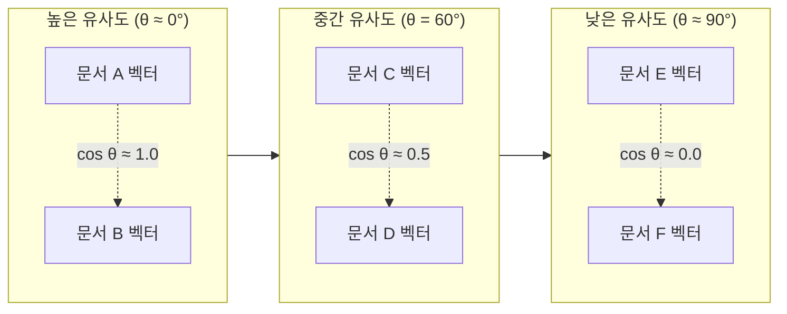
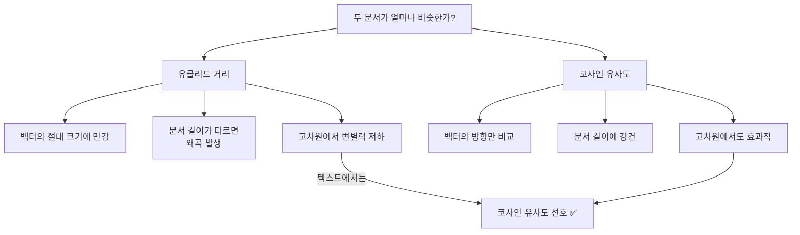
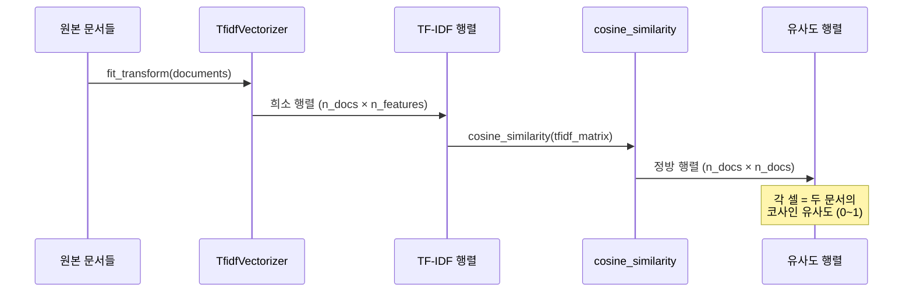
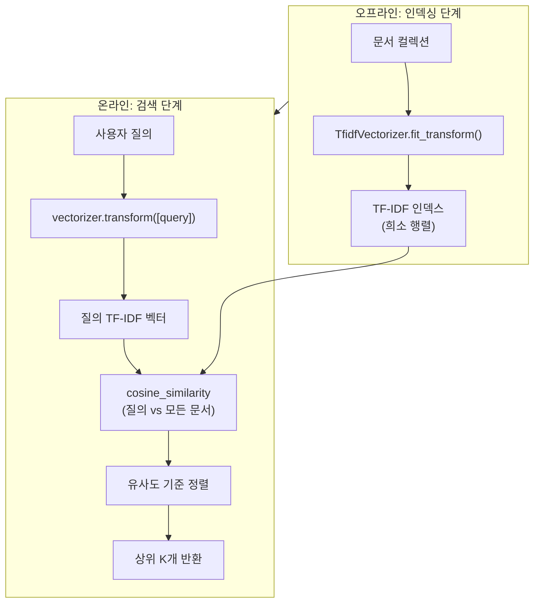
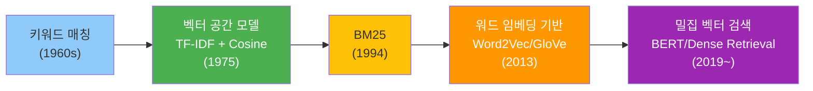

# 문서 유사도와 검색

> TF-IDF 벡터로 문서 간 유사도를 측정하고, 간단한 검색 엔진을 직접 구현해봅니다.

## 개요

이번 섹션에서는 Ch3의 마지막 주제로, 지금까지 배운 TF-IDF 벡터를 실제로 **활용**하는 방법을 다룹니다. 텍스트를 벡터로 변환했으니, 이제 벡터 사이의 거리를 재서 "이 문서와 가장 비슷한 문서는 무엇인가?"라는 질문에 답할 수 있습니다.

**선수 지식**: [03. TF-IDF의 이론](03-ch3-텍스트-표현-bow와-tf-idf/03-03-tf-idf의-이론.md)에서 배운 TF-IDF 수식, [04. TfidfVectorizer 실습](03-ch3-텍스트-표현-bow와-tf-idf/04-04-tfidfvectorizer-실습.md)에서 다룬 scikit-learn 사용법

**학습 목표**:
- 코사인 유사도의 수학적 정의를 이해하고 직접 계산할 수 있다
- 유클리드 거리와 코사인 유사도의 차이를 설명할 수 있다
- scikit-learn의 `cosine_similarity`로 문서 유사도를 측정할 수 있다
- TF-IDF 기반 간단한 문서 검색 엔진을 구현할 수 있다

## 왜 알아야 할까?

여러분이 구글에서 검색어를 입력하면, 수십억 개의 웹 페이지 중 가장 관련 있는 문서가 순서대로 나타납니다. 이 마법 같은 일의 출발점이 바로 **문서 유사도**입니다. "사용자의 질의와 가장 비슷한 문서를 찾아라" — 이것이 정보 검색(Information Retrieval)의 핵심 문제죠.

TF-IDF로 텍스트를 벡터로 변환하는 방법을 배웠으니, 이제 그 벡터들 사이의 **거리**를 재는 법만 알면 검색 엔진의 기본 원리를 완성할 수 있습니다. 이 개념은 뒤에서 배울 [워드 임베딩의 유사도 계산](05-ch5-워드-임베딩-word2vec/04-04-임베딩-활용-유사도와-유추.md)이나 [BERT 기반 의미 검색](16-ch16-bert-양방향-사전학습-모델/04-04-bert-다운스트림-태스크.md)의 토대가 됩니다.

## 핵심 개념

### 개념 1: 코사인 유사도 — 벡터의 방향으로 비교하기

> 💡 **비유**: 두 사람이 같은 방향을 바라보고 있다면, 한 사람이 1m 앞에 있든 100m 앞에 있든 **같은 쪽을 보고 있다**는 점은 변함없습니다. 코사인 유사도는 바로 이 "방향"을 비교하는 방법입니다. 벡터의 크기(길이)가 아니라 벡터가 가리키는 **방향**이 얼마나 일치하는지를 측정하거든요.

코사인 유사도(Cosine Similarity)는 두 벡터 사이의 각도의 코사인 값을 이용합니다. 값의 범위는 -1에서 1 사이인데, TF-IDF 벡터는 모든 값이 0 이상이므로 실제로는 **0~1 사이**가 됩니다.

$$\text{cosine\_similarity}(\mathbf{A}, \mathbf{B}) = \frac{\mathbf{A} \cdot \mathbf{B}}{||\mathbf{A}|| \times ||\mathbf{B}||} = \frac{\sum_{i=1}^{n} A_i B_i}{\sqrt{\sum_{i=1}^{n} A_i^2} \times \sqrt{\sum_{i=1}^{n} B_i^2}}$$

- $\mathbf{A} \cdot \mathbf{B}$: 두 벡터의 내적(dot product)
- $||\mathbf{A}||$: 벡터 A의 L2 노름(크기)
- 결과가 **1에 가까울수록** 두 문서가 유사, **0에 가까울수록** 무관

> 📊 **그림 1**: 코사인 유사도의 직관적 이해 — 각도가 작을수록 유사



직접 코사인 유사도를 계산해보겠습니다:

```run:python
import numpy as np

# 두 문서의 TF-IDF 벡터 (간소화 예시)
# 어휘: ["머신러닝", "딥러닝", "요리", "레시피"]
doc_a = np.array([0.7, 0.5, 0.0, 0.0])  # 기술 문서
doc_b = np.array([0.6, 0.4, 0.0, 0.0])  # 기술 문서 (유사)
doc_c = np.array([0.0, 0.0, 0.8, 0.6])  # 요리 문서

def cosine_similarity_manual(a, b):
    """코사인 유사도를 수동 계산"""
    dot_product = np.dot(a, b)           # 내적
    norm_a = np.linalg.norm(a)           # A의 크기
    norm_b = np.linalg.norm(b)           # B의 크기
    return dot_product / (norm_a * norm_b)

sim_ab = cosine_similarity_manual(doc_a, doc_b)
sim_ac = cosine_similarity_manual(doc_a, doc_c)
sim_bc = cosine_similarity_manual(doc_b, doc_c)

print(f"기술 문서 A ↔ 기술 문서 B: {sim_ab:.4f}")
print(f"기술 문서 A ↔ 요리 문서 C: {sim_ac:.4f}")
print(f"기술 문서 B ↔ 요리 문서 C: {sim_bc:.4f}")
```

```output
기술 문서 A ↔ 기술 문서 B: 1.0000
기술 문서 A ↔ 요리 문서 C: 0.0000
기술 문서 B ↔ 요리 문서 C: 0.0000
```

기술 문서끼리는 유사도 1.0(완벽히 같은 방향), 기술 문서와 요리 문서는 0.0(직교, 전혀 무관)이 나옵니다. 벡터의 **크기**가 달라도 **방향**이 같으면 유사도가 1이라는 점이 핵심이에요.

### 개념 2: 유클리드 거리 vs 코사인 유사도

> 💡 **비유**: 지도에서 두 도시 사이의 직선 거리(유클리드)와, 두 도시가 서울에서 **같은 방향에** 있는지(코사인)는 전혀 다른 질문입니다. "부산과 대구는 가까운가?" vs "부산과 대구는 서울에서 보면 같은 쪽인가?" — 이 차이가 유클리드 거리와 코사인 유사도의 차이입니다.

텍스트 유사도에서는 왜 유클리드 거리보다 코사인 유사도를 선호할까요?

> 📊 **그림 2**: 유클리드 거리 vs 코사인 유사도 비교



핵심 차이를 코드로 확인해봅시다:

```run:python
import numpy as np

# 같은 주제, 다른 길이의 문서 (단어 빈도 기준)
short_doc = np.array([1, 2, 0, 0, 1])    # 짧은 기술 문서
long_doc = np.array([10, 20, 0, 0, 10])   # 긴 기술 문서 (같은 비율)
other_doc = np.array([0, 0, 3, 5, 0])     # 다른 주제

# 유클리드 거리 (작을수록 유사)
euc_short_long = np.linalg.norm(short_doc - long_doc)
euc_short_other = np.linalg.norm(short_doc - other_doc)

# 코사인 유사도 (클수록 유사)
cos_short_long = np.dot(short_doc, long_doc) / (np.linalg.norm(short_doc) * np.linalg.norm(long_doc))
cos_short_other = np.dot(short_doc, other_doc) / (np.linalg.norm(short_doc) * np.linalg.norm(other_doc))

print("=== 유클리드 거리 (작을수록 유사) ===")
print(f"짧은 기술 ↔ 긴 기술: {euc_short_long:.2f}")
print(f"짧은 기술 ↔ 다른 주제: {euc_short_other:.2f}")
print()
print("=== 코사인 유사도 (클수록 유사) ===")
print(f"짧은 기술 ↔ 긴 기술: {cos_short_long:.4f}")
print(f"짧은 기술 ↔ 다른 주제: {cos_short_other:.4f}")
```

```output
=== 유클리드 거리 (작을수록 유사) ===
짧은 기술 ↔ 긴 기술: 22.05
짧은 기술 ↔ 다른 주제: 5.92
=== 코사인 유사도 (클수록 유사) ===
짧은 기술 ↔ 긴 기술: 1.0000
짧은 기술 ↔ 다른 주제: 0.0000
```

놀랍죠? 유클리드 거리로는 짧은 기술 문서가 "다른 주제" 문서에 더 가깝다고 판단합니다. 단순히 벡터의 크기가 비슷하니까요. 반면 코사인 유사도는 단어 빈도의 **비율**(방향)만 보기 때문에, 같은 주제의 문서를 정확히 1.0으로 잡아냅니다. 이것이 텍스트 분석에서 코사인 유사도를 압도적으로 선호하는 이유입니다.

### 개념 3: scikit-learn으로 문서 유사도 계산

> 💡 **비유**: 도서관 사서가 "이 책과 비슷한 책을 찾아주세요"라는 요청을 받으면, 모든 책의 목차와 핵심 키워드를 비교합니다. `cosine_similarity`는 이 사서의 역할을 자동으로 수행하는 함수입니다.

scikit-learn의 `cosine_similarity` 함수는 TF-IDF 행렬을 입력받아 모든 문서 쌍의 유사도를 한 번에 계산합니다.

> 📊 **그림 3**: TF-IDF → 코사인 유사도 파이프라인



```python
from sklearn.feature_extraction.text import TfidfVectorizer
from sklearn.metrics.pairwise import cosine_similarity

# 샘플 문서 컬렉션
documents = [
    "머신러닝은 데이터에서 패턴을 학습하는 인공지능 기술이다",
    "딥러닝은 신경망을 활용한 머신러닝의 한 분야이다",
    "자연어 처리는 인공지능이 텍스트를 이해하는 기술이다",
    "오늘 날씨가 좋아서 공원에서 산책했다",
    "주말에 맛있는 요리를 만들어 가족과 함께 먹었다",
]

# 1. TF-IDF 벡터화
vectorizer = TfidfVectorizer()
tfidf_matrix = vectorizer.fit_transform(documents)

# 2. 모든 문서 쌍의 코사인 유사도 계산
similarity_matrix = cosine_similarity(tfidf_matrix)

# 3. 결과 출력
import numpy as np
np.set_printoptions(precision=3)

print("문서 유사도 행렬:")
print(similarity_matrix)
print(f"\n행렬 크기: {similarity_matrix.shape}")
print(f"\n문서0 ↔ 문서1 (AI 관련): {similarity_matrix[0][1]:.4f}")
print(f"문서0 ↔ 문서3 (무관):     {similarity_matrix[0][3]:.4f}")
```

유사도 행렬은 **대각선이 1.0**(자기 자신과의 유사도)이고, **대칭 행렬**입니다. AI 관련 문서 3개(문서 0, 1, 2)는 서로 유사도가 높고, 일상 문서(문서 3, 4)와는 유사도가 낮게 나옵니다.

> ⚠️ **흔한 오해**: `cosine_similarity`의 결과가 높다고 해서 두 문서의 "의미"가 같다는 뜻은 아닙니다. TF-IDF 기반 유사도는 **단어 겹침**을 측정하는 것이지, 의미적 유사성을 파악하지는 못합니다. "강아지가 뛰어다닌다"와 "개가 달린다"는 코사인 유사도가 0에 가깝게 나올 수 있어요. 의미적 유사도는 [워드 임베딩](05-ch5-워드-임베딩-word2vec/01-01-분포-가설과-밀집-벡터-표현.md) 이후에서 다룹니다.

### 개념 4: TF-IDF 기반 문서 검색

> 💡 **비유**: 도서관에서 "인공지능 학습"이라고 검색하면, 사서가 모든 책의 색인 카드를 꺼내서 여러분의 질문과 가장 비슷한 카드를 찾아줍니다. TF-IDF 검색도 정확히 이 과정 — 질의(query)를 벡터로 변환하고, 모든 문서 벡터와의 유사도를 비교해서 순위를 매기는 거죠.

검색에서의 핵심 트릭은 **질의(query)도 하나의 문서로 취급**한다는 점입니다. 기존 어휘 사전에 맞춰 질의를 TF-IDF 벡터로 변환한 뒤, 모든 문서와의 코사인 유사도를 계산하면 됩니다.

> 📊 **그림 4**: TF-IDF 기반 검색 엔진의 동작 흐름



여기서 중요한 점은 `fit_transform`과 `transform`의 구분입니다:
- **`fit_transform(documents)`**: 어휘 사전을 구축하면서 문서를 벡터화 (인덱싱 시 1회)
- **`transform([query])`**: 기존 어휘 사전으로 질의를 벡터화 (검색 시 매번)

이미 구축된 어휘 사전에 없는 단어가 질의에 포함되면 무시됩니다. 이것이 TF-IDF 검색의 한계 중 하나이기도 합니다.

## 실습: 직접 해보기

이제 간단한 뉴스 기사 검색 엔진을 만들어보겠습니다.

```python
from sklearn.feature_extraction.text import TfidfVectorizer
from sklearn.metrics.pairwise import cosine_similarity
import numpy as np

# ============================================================
# 1. 뉴스 기사 컬렉션 (간소화 데이터)
# ============================================================
news_corpus = [
    "삼성전자가 새로운 반도체 공정 기술을 발표했다. 3나노 GAA 트랜지스터 기술이 적용된다.",
    "애플이 아이폰 신모델을 공개했다. 새로운 AI 칩이 탑재된 스마트폰이다.",
    "구글 딥마인드가 새로운 언어 모델을 발표했다. 자연어 처리 성능이 크게 향상되었다.",
    "테슬라 전기차 판매량이 전년 대비 50% 증가했다. 배터리 기술 개선이 주요 원인이다.",
    "올해 프로야구 시즌이 개막했다. 새로운 외국인 선수들이 합류했다.",
    "정부가 인공지능 산업 육성 정책을 발표했다. AI 스타트업 지원 예산이 증가한다.",
    "반도체 수출이 지난달 역대 최고를 기록했다. 메모리 반도체 수요 증가가 원인이다.",
    "자율주행 기술이 레벨 4 수준으로 발전했다. 도심 주행 테스트가 시작된다.",
    "네이버가 초거대 AI 모델 하이퍼클로바X를 공개했다. 한국어 성능이 뛰어나다.",
    "LG에너지솔루션이 전고체 배터리 양산 계획을 발표했다. 전기차 시장 판도가 바뀔 전망이다.",
]

# ============================================================
# 2. TF-IDF 인덱스 구축
# ============================================================
vectorizer = TfidfVectorizer(
    max_df=0.8,        # 전체 문서의 80% 이상에 나오는 단어 제외
    min_df=1,          # 최소 1개 문서에 등장
    sublinear_tf=True  # TF에 로그 스케일링 적용
)
tfidf_matrix = vectorizer.fit_transform(news_corpus)

print(f"인덱스 구축 완료!")
print(f"  - 문서 수: {tfidf_matrix.shape[0]}")
print(f"  - 어휘 크기: {tfidf_matrix.shape[1]}")
print(f"  - 행렬 밀도: {tfidf_matrix.nnz / (tfidf_matrix.shape[0] * tfidf_matrix.shape[1]):.2%}")
```

```python
# ============================================================
# 3. 검색 함수 구현
# ============================================================
def search(query, vectorizer, tfidf_matrix, documents, top_k=3):
    """
    TF-IDF 기반 문서 검색

    Parameters:
        query: 검색 질의 문자열
        vectorizer: 학습된 TfidfVectorizer
        tfidf_matrix: 문서 컬렉션의 TF-IDF 행렬
        documents: 원본 문서 리스트
        top_k: 반환할 상위 결과 수

    Returns:
        (순위, 유사도, 문서) 튜플의 리스트
    """
    # 질의를 기존 어휘 사전으로 TF-IDF 벡터 변환
    query_vector = vectorizer.transform([query])

    # 질의 벡터와 모든 문서의 코사인 유사도 계산
    similarities = cosine_similarity(query_vector, tfidf_matrix).flatten()

    # 유사도 기준 내림차순 정렬 (상위 top_k)
    top_indices = similarities.argsort()[::-1][:top_k]

    results = []
    for rank, idx in enumerate(top_indices, 1):
        if similarities[idx] > 0:  # 유사도가 0인 결과 제외
            results.append((rank, similarities[idx], documents[idx]))

    return results

# ============================================================
# 4. 검색 테스트
# ============================================================
queries = ["반도체 기술", "인공지능 언어 모델", "전기차 배터리"]

for query in queries:
    print(f"\n{'='*60}")
    print(f"🔍 검색어: \"{query}\"")
    print(f"{'='*60}")
    results = search(query, vectorizer, tfidf_matrix, news_corpus, top_k=3)
    for rank, score, doc in results:
        print(f"  [{rank}위] (유사도: {score:.4f}) {doc[:50]}...")
```

```python
# ============================================================
# 5. 문서 간 유사도 히트맵 (선택: matplotlib)
# ============================================================
try:
    import matplotlib.pyplot as plt
    import matplotlib

    # 한글 폰트 설정 (환경에 따라 조정)
    matplotlib.rcParams['font.family'] = 'DejaVu Sans'

    # 전체 문서 유사도 행렬 계산
    sim_matrix = cosine_similarity(tfidf_matrix)

    fig, ax = plt.subplots(figsize=(10, 8))
    im = ax.imshow(sim_matrix, cmap='YlOrRd', vmin=0, vmax=1)

    # 축 설정
    labels = [f"Doc {i}" for i in range(len(news_corpus))]
    ax.set_xticks(range(len(labels)))
    ax.set_yticks(range(len(labels)))
    ax.set_xticklabels(labels, rotation=45, ha='right')
    ax.set_yticklabels(labels)

    # 각 셀에 값 표시
    for i in range(len(sim_matrix)):
        for j in range(len(sim_matrix)):
            ax.text(j, i, f"{sim_matrix[i][j]:.2f}",
                    ha='center', va='center', fontsize=8,
                    color='white' if sim_matrix[i][j] > 0.5 else 'black')

    plt.colorbar(im, label='Cosine Similarity')
    plt.title('Document Similarity Heatmap')
    plt.tight_layout()
    plt.savefig('doc_similarity_heatmap.png', dpi=150)
    print("히트맵이 doc_similarity_heatmap.png로 저장되었습니다!")
except ImportError:
    print("matplotlib가 설치되지 않았습니다. pip install matplotlib")
```

```python
# ============================================================
# 6. 질의 확장: 검색어에 가장 중요한 단어 확인
# ============================================================
def analyze_query(query, vectorizer):
    """검색어가 어떤 TF-IDF 특성으로 변환되는지 분석"""
    query_vec = vectorizer.transform([query])
    feature_names = vectorizer.get_feature_names_out()

    # 0이 아닌 특성만 추출
    nonzero_indices = query_vec.nonzero()[1]
    print(f"\n질의 \"{query}\"의 TF-IDF 특성:")
    for idx in nonzero_indices:
        print(f"  {feature_names[idx]}: {query_vec[0, idx]:.4f}")

    # 어휘 사전에 없는 단어 확인 (OOV)
    query_tokens = query.split()
    vocab = set(feature_names)
    oov = [t for t in query_tokens if t not in vocab]
    if oov:
        print(f"  ⚠️ OOV(미등록 단어): {oov}")

analyze_query("반도체 기술", vectorizer)
analyze_query("양자 컴퓨터 개발", vectorizer)  # OOV 예시
```

## 더 깊이 알아보기

### 벡터 공간 모델의 아버지, Gerard Salton

코사인 유사도를 정보 검색에 적용한 사람은 **Gerard Salton**(1927-1995)입니다. 독일 출신으로 미국 코넬 대학교 교수였던 그는 "정보 검색의 아버지(Father of Information Retrieval)"라 불립니다.

1960년대, 그는 하버드 대학교에서 **SMART 시스템**(System for the Mechanical Analysis and Retrieval of Text)을 개발했습니다. 이 시스템이 혁명적이었던 이유는, 그 이전에는 문서 검색이 주로 사람이 붙인 키워드 태그에 의존했는데, Salton은 **문서와 질의를 모두 벡터로 표현하고 코사인으로 비교**하는 아이디어를 제시했기 때문입니다.

1975년 발표한 논문 "A Vector Space Model for Automatic Indexing"에서 이 개념을 정립했고, 여기서 TF-IDF 가중치와 코사인 유사도를 결합한 프레임워크가 탄생했습니다. 놀라운 것은 이 50년 전의 아이디어가 오늘날 검색 엔진의 기본 원리로 여전히 사용된다는 점입니다. 구글 검색도 초기에는 이 벡터 공간 모델을 기반으로 출발했죠.

재밌는 일화로, Salton은 학생들에게 "모든 것을 벡터로 표현할 수 있다면, 그 사이의 관계도 수학적으로 정의할 수 있다"고 자주 강조했다고 합니다. 이 철학은 이후 워드 임베딩, 문장 임베딩, 나아가 현대 벡터 데이터베이스에 이르기까지 면면히 이어지고 있습니다.

### TF-IDF를 넘어서: 밀집 벡터 검색의 시대

TF-IDF 기반 검색은 **어휘 불일치 문제**(vocabulary mismatch)가 있습니다. "강아지"로 검색하면 "개"가 포함된 문서를 찾지 못하죠. 이 한계를 극복하기 위해 현대 검색 시스템은 BERT와 같은 모델로 생성한 **밀집 벡터**(dense vector)를 사용합니다. 이를 **시맨틱 검색**(semantic search)이라 하며, [Ch16. BERT](16-ch16-bert-양방향-사전학습-모델/01-01-사전학습과-파인튜닝-패러다임.md) 이후에 본격적으로 다룹니다.

> 📊 **그림 5**: 텍스트 검색 기술의 진화



## 흔한 오해와 팁

> ⚠️ **흔한 오해**: "코사인 유사도가 높으면 두 문서는 같은 의미다." — 아닙니다! TF-IDF 기반 코사인 유사도는 **단어 겹침**(lexical overlap)만 측정합니다. "강아지가 뛰어다닌다"와 "개가 달린다"는 의미는 같지만, 공통 단어가 없어 유사도가 0에 가깝습니다. 반대로, "사과를 먹었다"와 "사과를 드립니다"는 단어 겹침이 있어 유사도가 높게 나오지만 의미는 전혀 다르죠.

> 💡 **알고 계셨나요?**: scikit-learn의 `TfidfVectorizer`는 기본적으로 L2 정규화를 적용합니다(`norm='l2'`). 이는 모든 문서 벡터의 크기를 1로 만들어주는데, 이 경우 **코사인 유사도가 단순 내적(dot product)과 동일**해집니다! 그래서 `cosine_similarity` 대신 `tfidf_matrix @ tfidf_matrix.T`로 계산해도 같은 결과를 얻습니다. L2 정규화 덕분에 연산이 훨씬 빨라지는 거죠.

> 🔥 **실무 팁**: 실제 검색 엔진에서는 TF-IDF + 코사인 유사도 대신 **BM25** 알고리즘을 많이 씁니다. BM25는 TF-IDF의 개선판으로, 문서 길이 정규화와 TF 포화(saturation) 효과를 추가한 것입니다. Python에서는 `rank-bm25` 라이브러리로 쉽게 사용할 수 있습니다. Elasticsearch, Solr 같은 검색 엔진도 기본 랭킹 알고리즘으로 BM25를 사용합니다.

## 핵심 정리

| 개념 | 설명 |
|------|------|
| 코사인 유사도 | 두 벡터의 방향(각도)으로 유사도 측정. TF-IDF에서는 0~1 범위. 1이면 같은 방향, 0이면 무관 |
| 유클리드 거리 vs 코사인 | 유클리드은 크기에 민감(문서 길이 영향). 코사인은 방향만 비교(길이 무관) |
| `cosine_similarity` | scikit-learn 함수. TF-IDF 행렬을 넣으면 전체 유사도 행렬 반환 |
| 문서 검색 흐름 | `fit_transform` → 인덱스 구축, `transform` → 질의 벡터화, 코사인 유사도 → 순위 |
| 어휘 불일치 문제 | TF-IDF 검색의 근본적 한계. 같은 의미의 다른 단어를 매칭하지 못함 |
| 벡터 공간 모델 | Salton이 제안. 문서와 질의를 벡터로 표현하여 수학적으로 유사도를 계산 |

## 다음 섹션 미리보기

Ch3에서 BoW, N-gram, TF-IDF, 코사인 유사도까지 전통적인 텍스트 표현 방법을 모두 다뤘습니다. 이 방법들은 강력하지만, **단어의 의미적 관계를 포착하지 못한다**는 근본적 한계가 있었죠. 다음 챕터 [Ch4. 전통적 텍스트 분류](04-ch4-전통적-텍스트-분류/01-01-naive-bayes-텍스트-분류.md)에서는 TF-IDF 벡터를 Naive Bayes, SVM 같은 머신러닝 모델의 입력으로 사용해 실제 분류 문제를 풀어봅니다. 그리고 [Ch5](05-ch5-워드-임베딩-word2vec/01-01-분포-가설과-밀집-벡터-표현.md)에서는 TF-IDF의 희소 벡터를 넘어, 단어의 의미를 담은 **밀집 벡터(워드 임베딩)**의 세계로 진입합니다.

## 참고 자료

- [cosine_similarity — scikit-learn 1.8.0 공식 문서](https://scikit-learn.org/stable/modules/generated/sklearn.metrics.pairwise.cosine_similarity.html) - `cosine_similarity` 함수의 파라미터와 사용법 공식 레퍼런스
- [TfidfVectorizer — scikit-learn 1.8.0 공식 문서](https://scikit-learn.org/stable/modules/generated/sklearn.feature_extraction.text.TfidfVectorizer.html) - TF-IDF 벡터화의 모든 옵션 상세 설명
- [A Vector Space Model for Automatic Indexing (Salton et al., 1975)](https://dl.acm.org/doi/10.1145/361219.361220) - 벡터 공간 모델의 원조 논문. 정보 검색의 수학적 기반을 정립
- [Gerard Salton — Wikipedia](https://en.wikipedia.org/wiki/Gerard_Salton) - 정보 검색의 아버지와 SMART 시스템의 역사
- [Stanford CS 224N: NLP with Deep Learning](https://web.stanford.edu/class/cs224n/) - 전통적 NLP부터 딥러닝까지 체계적으로 다루는 강의

---
### 🔗 Related Sessions
- [tfidf](03-ch3-텍스트-표현-bow와-tf-idf/03-03-tf-idf의-이론.md) (prerequisite)
- [sparse_matrix](03-ch3-텍스트-표현-bow와-tf-idf/01-01-bag-of-words-모델.md) (prerequisite)
- [l2_normalization](03-ch3-텍스트-표현-bow와-tf-idf/03-03-tf-idf의-이론.md) (prerequisite)
