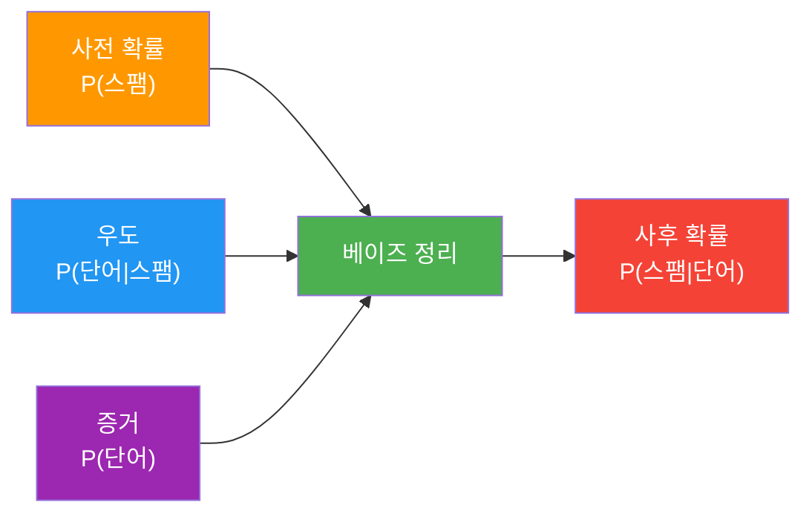
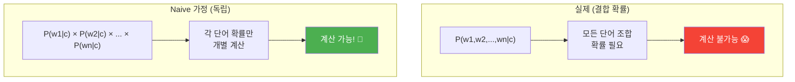
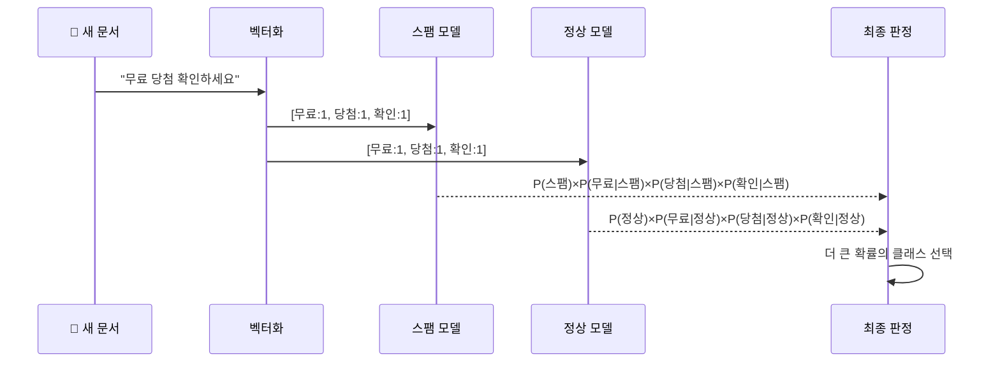
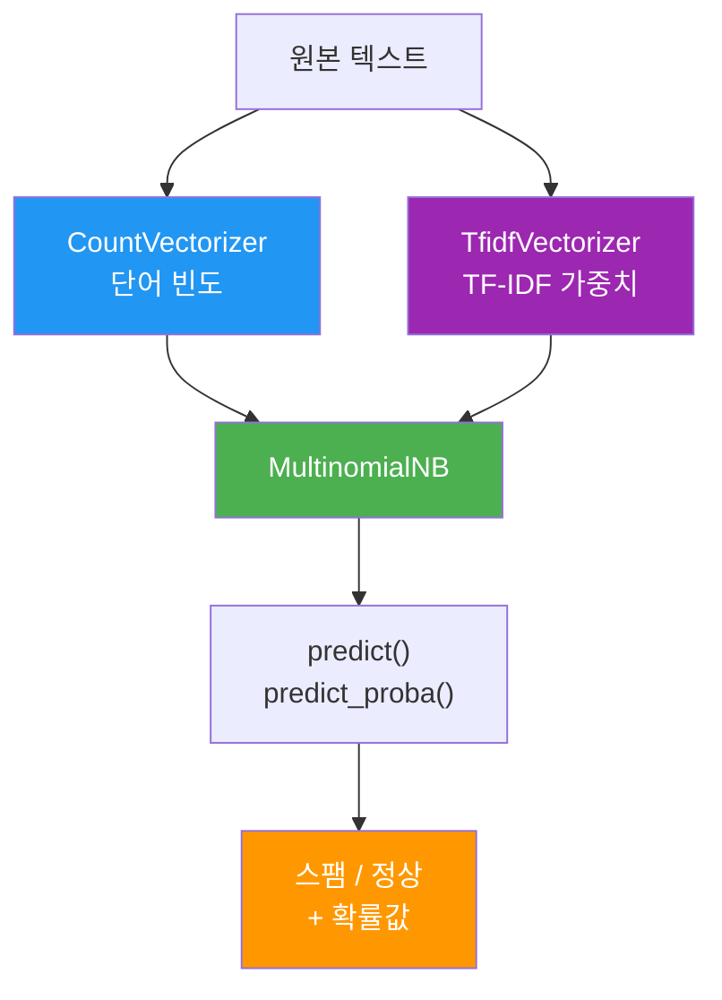

# Naive Bayes 텍스트 분류

> 확률의 힘으로 스팸을 걸러내는 첫 번째 텍스트 분류기를 만들어 봅니다.

## 개요

이 섹션에서는 베이즈 정리(Bayes' Theorem)를 복습하고, 이를 기반으로 한 Multinomial Naive Bayes 분류기가 어떻게 텍스트를 분류하는지 배웁니다. 단어 빈도를 특성(feature)으로 활용하여 스팸 메일을 자동으로 걸러내는 분류기를 직접 구현해 봅니다.

**선수 지식**: [TF-IDF의 이론과 직관](03-텍스트-표현-bow와-tf-idf/03-tf-idf의-이론과-직관.md)에서 배운 단어 빈도 기반 문서 표현, [TfidfVectorizer 실습](03-텍스트-표현-bow와-tf-idf/04-tfidfvectorizer-실습.md)에서 다룬 scikit-learn 벡터화

**학습 목표**:
- 베이즈 정리의 핵심 아이디어를 직관적으로 이해한다
- Multinomial Naive Bayes가 텍스트를 분류하는 원리를 설명할 수 있다
- scikit-learn의 `MultinomialNB`로 스팸 분류기를 구현한다

## 왜 알아야 할까?

Ch3에서 우리는 텍스트를 숫자 벡터로 바꾸는 방법을 배웠습니다. BoW, TF-IDF 등으로 문서를 수치화했죠. 그런데 벡터를 만드는 것 자체가 목적은 아닙니다. **벡터는 입력이고, 진짜 하고 싶은 일은 "이 문서가 어떤 카테고리에 속하는가"를 판단하는 것**이거든요. 텍스트 표현은 분류 모델이 이해할 수 있는 언어로 문서를 번역하는 과정이었고, 이제부터는 그 번역된 문서를 실제로 읽고 판단하는 **분류기(classifier)**를 만들 차례입니다.

> 📊 **그림 0**: Ch3 텍스트 표현에서 Ch4 텍스트 분류로의 연결


여러분의 이메일 받은 편지함을 떠올려 보세요. 매일 수십 통의 메일이 오지만, 스팸은 자동으로 걸러지죠. 이 "마법" 뒤에는 Naive Bayes 분류기가 있습니다. Gmail이 초창기에 스팸 필터링에 사용한 핵심 알고리즘이 바로 Naive Bayes였거든요.

Naive Bayes는 놀랍도록 단순한 알고리즘이지만, 텍스트 분류에서 여전히 강력한 성능을 보여줍니다. 학습 속도가 빠르고, 적은 데이터에서도 잘 작동하며, 확률적 해석이 가능하다는 장점 덕분에 실무에서 "첫 번째 베이스라인 모델"로 자주 선택됩니다. 딥러닝 모델을 쓰기 전에 "이 정도면 되는데?" 하고 깜짝 놀라는 경우가 많은 알고리즘이기도 합니다.

## 핵심 개념

### 개념 1: 베이즈 정리 복습

> 💡 **비유**: 의사의 진단을 생각해 보세요. 환자가 기침을 한다고 해서 무조건 감기라고 진단하지 않죠. "기침 환자 중 감기일 확률"뿐 아니라, "감기에 걸린 사람이 기침할 확률"과 "전체 감기 환자 비율"까지 종합적으로 고려합니다. 이것이 바로 베이즈 정리의 핵심입니다.

베이즈 정리는 **사전 지식(prior)**을 **새로운 증거(evidence)**로 업데이트하여 **사후 확률(posterior)**을 구하는 공식입니다.

$$P(A|B) = \frac{P(B|A) \cdot P(A)}{P(B)}$$

- $P(A|B)$: **사후 확률** — 증거 B를 관찰한 후 A가 참일 확률
- $P(B|A)$: **우도(likelihood)** — A가 참일 때 증거 B가 나타날 확률
- $P(A)$: **사전 확률(prior)** — 증거 없이 A가 참일 기본 확률
- $P(B)$: **증거(evidence)** — 증거 B가 나타날 전체 확률

텍스트 분류에 적용하면, "이 문서에 이런 단어들이 등장할 때, 이 문서가 스팸일 확률은?"이라는 질문에 답하는 것과 같습니다.

> 📊 **그림 1**: 베이즈 정리의 구성 요소와 흐름



스팸 분류에서 구체적으로 보면:

$$P(\text{스팸}|\text{문서}) = \frac{P(\text{문서}|\text{스팸}) \cdot P(\text{스팸})}{P(\text{문서})}$$

이게 의미하는 바는, "스팸일 기본 확률"에 "스팸 메일에서 이런 문서가 나올 확률"을 곱한 값을, "전체에서 이런 문서가 나올 확률"로 나눈 것입니다. 다시 말해, 사전에 알고 있던 스팸 비율(사전 확률)을 문서의 내용(우도)이라는 증거로 업데이트하여, 해당 문서가 정말 스팸인지에 대한 최종 판단(사후 확률)을 내리는 과정이죠. 분모인 $P(\text{문서})$는 스팸이든 정상이든 상관없이 해당 문서가 나타날 전체 확률인데, 분류 시에는 모든 클래스에 대해 동일한 값이므로 실제로는 무시하고 분자만 비교해도 됩니다.

```run:python
# 베이즈 정리 직관 예제: 스팸 확률 계산
# 전체 메일의 30%가 스팸이라고 가정
p_spam = 0.30          # 사전 확률: P(스팸)
p_ham = 0.70           # 사전 확률: P(정상)

# "무료"라는 단어가 스팸에 등장할 확률 vs 정상 메일에 등장할 확률
p_free_given_spam = 0.80   # P("무료"|스팸)
p_free_given_ham = 0.10    # P("무료"|정상)

# P("무료") = P("무료"|스팸)·P(스팸) + P("무료"|정상)·P(정상)
p_free = p_free_given_spam * p_spam + p_free_given_ham * p_ham

# 베이즈 정리 적용: "무료"가 포함된 메일이 스팸일 확률
p_spam_given_free = (p_free_given_spam * p_spam) / p_free

print(f"'무료'가 포함된 메일이 스팸일 확률: {p_spam_given_free:.1%}")
print(f"원래 스팸 사전 확률: {p_spam:.1%}")
print(f"→ '무료' 단어 하나로 확률이 {p_spam:.0%} → {p_spam_given_free:.0%}로 업데이트!")
```

```output
'무료'가 포함된 메일이 스팸일 확률: 77.4%
원래 스팸 사전 확률: 30.0%
→ '무료' 단어 하나로 확률이 30% → 77%로 업데이트!
```

### 개념 2: Naive Bayes가 "Naive"한 이유

> 💡 **비유**: 음식점 리뷰를 평가한다고 상상해 보세요. "맛있고", "서비스가 좋고", "분위기도 훌륭하다"는 세 가지 평가가 있을 때, 실제로는 맛있는 곳이 서비스도 좋을 가능성이 높죠(이 특성들은 서로 연관됨). 하지만 Naive Bayes는 이런 연관성을 무시하고, 각 특성이 **독립적**이라고 "순진하게(naive)" 가정합니다. 이 단순한 가정 덕분에 계산이 놀랍도록 간단해집니다.

문서의 단어가 $w_1, w_2, \ldots, w_n$일 때, 실제로 계산해야 하는 것은:

$$P(c|w_1, w_2, \ldots, w_n) \propto P(c) \cdot P(w_1, w_2, \ldots, w_n | c)$$

단어들이 모두 독립이라는 **조건부 독립 가정**을 적용하면:

$$P(c|w_1, w_2, \ldots, w_n) \propto P(c) \cdot \prod_{i=1}^{n} P(w_i|c)$$

이게 핵심이에요. 수천 개의 단어가 있어도 각 단어의 확률을 **곱하기만** 하면 됩니다. 단어 조합의 확률을 일일이 구할 필요가 없어지니, 계산량이 획기적으로 줄어드는 거죠.

> 📊 **그림 2**: 독립 가정의 효과 — 결합 확률 vs 개별 확률의 곱



### 개념 3: Multinomial Naive Bayes

> 💡 **비유**: 주머니 속 구슬 뽑기를 생각해 보세요. "스팸 주머니"에는 "무료" 구슬이 80개, "당첨" 구슬이 60개, "안녕" 구슬이 5개 들어있고, "정상 주머니"에는 "무료" 구슬이 10개, "당첨" 구슬이 3개, "안녕" 구슬이 50개 들어있습니다. 새 메일의 단어들을 보고 "이 단어 조합은 어느 주머니에서 나올 확률이 높을까?"를 판단하는 것이 Multinomial Naive Bayes입니다.

Multinomial Naive Bayes는 단어의 **출현 빈도(count)**를 특성으로 사용합니다. 여기서 핵심은 입력 형태인데요 — Ch3에서 배운 [CountVectorizer](03-텍스트-표현-bow와-tf-idf/02-n-gram과-countvectorizer.md)가 만들어 주는 단어 빈도 행렬이 바로 Multinomial NB의 입력이 됩니다. 벡터화 자체에 대해서는 Ch3을 참고하시고, 여기서는 **그 벡터를 Naive Bayes가 어떻게 활용하는지**에 집중하겠습니다.

각 클래스 $c$에서 단어 $w_i$의 확률은:

$$P(w_i|c) = \frac{\text{클래스 } c \text{에서 } w_i \text{의 총 출현 횟수} + \alpha}{\text{클래스 } c \text{의 전체 단어 수} + \alpha \cdot |V|}$$

여기서 $\alpha$는 **라플라스 스무딩(Laplace smoothing)** 파라미터이고, $|V|$는 전체 어휘 크기입니다. 학습 데이터에 한 번도 등장하지 않은 단어가 있으면 확률이 0이 되어 전체 곱이 0이 되는 문제를 방지하기 위해 $\alpha$(보통 1)를 더해줍니다.

> 📊 **그림 3**: Multinomial Naive Bayes의 분류 과정



최종 분류는 각 클래스에 대한 점수를 비교하여 결정합니다:

$$\hat{c} = \arg\max_c \left[ \log P(c) + \sum_{i=1}^{n} f_i \cdot \log P(w_i|c) \right]$$

실제로는 확률을 직접 곱하면 값이 너무 작아지므로(언더플로), **로그 확률**의 합으로 계산합니다. $f_i$는 단어 $w_i$의 출현 빈도입니다.

```run:python
import numpy as np

# Multinomial NB 직접 계산 예시
# 학습 데이터: 스팸 3개, 정상 2개
spam_docs = ["무료 당첨 무료 혜택", "무료 이벤트 당첨", "특별 무료 제공"]
ham_docs = ["오늘 회의 참석 부탁", "내일 미팅 일정 확인"]

# 어휘 사전 구축
all_words = set()
for doc in spam_docs + ham_docs:
    all_words.update(doc.split())

vocab = sorted(all_words)
print(f"어휘 사전: {vocab}")
print(f"어휘 크기 |V|: {len(vocab)}")

# 스팸에서 각 단어의 출현 횟수
spam_text = " ".join(spam_docs)
ham_text = " ".join(ham_docs)

alpha = 1  # 라플라스 스무딩
spam_total = len(spam_text.split()) + alpha * len(vocab)
ham_total = len(ham_text.split()) + alpha * len(vocab)

# "무료"의 조건부 확률 계산
free_in_spam = spam_text.split().count("무료") + alpha  # 4 + 1 = 5
free_in_ham = ham_text.split().count("무료") + alpha     # 0 + 1 = 1

p_free_spam = free_in_spam / spam_total
p_free_ham = free_in_ham / ham_total

print(f"\nP('무료'|스팸) = ({free_in_spam-1}+1) / ({spam_total-alpha*len(vocab)}+{alpha*len(vocab)}) = {p_free_spam:.4f}")
print(f"P('무료'|정상) = ({free_in_ham-1}+1) / ({ham_total-alpha*len(vocab)}+{alpha*len(vocab)}) = {p_free_ham:.4f}")
print(f"→ '무료'는 스팸에서 {p_free_spam/p_free_ham:.1f}배 더 자주 등장!")
```

```output
어휘 사전: ['갈', '당첨', '무료', '미팅', '부탁', '이벤트', '일정', '오늘', '제공', '참석', '특별', '확인', '혜택', '회의', '내일']
어휘 크기 |V|: 15

P('무료'|스팸) = (4+1) / (10+15) = 0.2000
P('무료'|정상) = (0+1) / (8+15) = 0.0435
→ '무료'는 스팸에서 4.6배 더 자주 등장!
```

### 개념 4: scikit-learn에서 Vectorizer + NB 결합하기

Naive Bayes의 진짜 힘은 Ch3에서 배운 벡터화 도구와 결합할 때 드러납니다. [CountVectorizer](03-텍스트-표현-bow와-tf-idf/02-n-gram과-countvectorizer.md)나 [TfidfVectorizer](03-텍스트-표현-bow와-tf-idf/04-tfidfvectorizer-실습.md)로 만든 수치 행렬을 `MultinomialNB`에 바로 넘기면 됩니다. 벡터화 방법에 따라 분류 성능이 달라지는데, 이 선택이 모델 성능에 미치는 영향을 이해하는 것이 이 섹션의 핵심입니다.

> 📊 **그림 4**: Vectorizer 선택에 따른 Naive Bayes 파이프라인 비교



```python
from sklearn.feature_extraction.text import CountVectorizer, TfidfVectorizer
from sklearn.naive_bayes import MultinomialNB

# 방법 1: CountVectorizer + NB — 단어 빈도 기반
vectorizer = CountVectorizer()       # Ch3에서 배운 벡터화
X_train = vectorizer.fit_transform(train_texts)
clf = MultinomialNB(alpha=1.0)       # 라플라스 스무딩
clf.fit(X_train, y_train)

# 방법 2: TfidfVectorizer + NB — TF-IDF 가중치 기반
# TF-IDF 값은 음수가 아니므로 MultinomialNB와 호환됨
tfidf_vec = TfidfVectorizer()
X_train_tfidf = tfidf_vec.fit_transform(train_texts)
clf_tfidf = MultinomialNB(alpha=1.0)
clf_tfidf.fit(X_train_tfidf, y_train)

# 새 문서 예측
X_new = vectorizer.transform(["무료 당첨 기회를 놓치지 마세요"])
prediction = clf.predict(X_new)      # 클래스 레이블
proba = clf.predict_proba(X_new)     # 각 클래스 확률
```

주요 파라미터:
| 파라미터 | 기본값 | 설명 |
|---------|--------|------|
| `alpha` | 1.0 | 라플라스 스무딩 계수. 0이면 스무딩 없음 |
| `fit_prior` | True | 사전 확률을 학습 데이터에서 추정할지 여부 |
| `class_prior` | None | 직접 사전 확률을 지정할 경우 사용 |

## 실습: 직접 해보기

SMS 스팸 분류기를 처음부터 끝까지 만들어 보겠습니다. 벡터화에는 Ch3에서 배운 `CountVectorizer`를 사용하되, 여기서는 벡터화 자체보다 **Naive Bayes 모델의 학습과 해석**에 집중합니다.

```python
import numpy as np
from sklearn.feature_extraction.text import CountVectorizer, TfidfVectorizer
from sklearn.naive_bayes import MultinomialNB
from sklearn.model_selection import train_test_split
from sklearn.metrics import classification_report, confusion_matrix

# ─── 1. 샘플 데이터 준비 ───
# 실제로는 SMS Spam Collection 데이터셋 등을 사용합니다
messages = [
    # 스팸 메시지 (label: 1)
    "무료 쿠폰이 도착했습니다 지금 바로 확인하세요",
    "축하합니다 당첨되셨습니다 경품 수령 링크를 클릭하세요",
    "무료 체험 이벤트 특별 혜택을 놓치지 마세요",
    "긴급 당첨 안내 무료 상품권을 받아가세요",
    "한정 이벤트 무료 경품 당첨 축하드립니다",
    "특별 할인 무료 배송 지금 바로 주문하세요",
    "VIP 회원 전용 무료 혜택 이벤트 참여하세요",
    "무료 포인트 적립 이벤트 당첨자 발표",
    # 정상 메시지 (label: 0)
    "내일 오후 3시에 회의가 있습니다 참석 부탁드립니다",
    "프로젝트 보고서를 첨부합니다 검토 부탁드립니다",
    "오늘 점심은 어떤 메뉴로 할까요",
    "주간 업무 보고 자료를 공유합니다",
    "내일 출장 일정을 확인해 주세요",
    "팀 미팅 안건을 정리해서 보내드립니다",
    "이번 주 금요일 워크숍 참석 여부를 알려주세요",
    "신규 프로젝트 킥오프 미팅 안내입니다",
]

labels = [1, 1, 1, 1, 1, 1, 1, 1,   # 스팸
          0, 0, 0, 0, 0, 0, 0, 0]    # 정상

# ─── 2. 데이터 분할 ───
X_train, X_test, y_train, y_test = train_test_split(
    messages, labels, test_size=0.25, random_state=42, stratify=labels
)

print(f"학습 데이터: {len(X_train)}개, 테스트 데이터: {len(X_test)}개")
```

```python
# ─── 3. 텍스트 벡터화 + Naive Bayes 학습 ───
# CountVectorizer로 단어 빈도 행렬 생성 (Ch3 참고)
vectorizer = CountVectorizer()
X_train_vec = vectorizer.fit_transform(X_train)
X_test_vec = vectorizer.transform(X_test)

print(f"어휘 사전 크기: {len(vectorizer.get_feature_names_out())}개")
print(f"특성 행렬 크기: {X_train_vec.shape}")

# ─── 4. Naive Bayes 모델 학습 ───
nb_clf = MultinomialNB(alpha=1.0)
nb_clf.fit(X_train_vec, y_train)

# 학습된 사전 확률 확인
print(f"\n학습된 사전 확률:")
print(f"  P(정상) = {np.exp(nb_clf.class_log_prior_[0]):.2f}")
print(f"  P(스팸) = {np.exp(nb_clf.class_log_prior_[1]):.2f}")
```

```python
# ─── 5. 예측 및 평가 ───
y_pred = nb_clf.predict(X_test_vec)

print("=== 분류 결과 ===")
print(classification_report(y_test, y_pred, target_names=["정상", "스팸"]))

# 혼동 행렬
cm = confusion_matrix(y_test, y_pred)
print("혼동 행렬:")
print(f"  정상→정상: {cm[0][0]}, 정상→스팸: {cm[0][1]}")
print(f"  스팸→정상: {cm[1][0]}, 스팸→스팸: {cm[1][1]}")
```

```python
# ─── 6. 새 메시지 분류 테스트 ───
new_messages = [
    "무료 이벤트 당첨을 축하합니다",
    "내일 오전 회의 참석 가능한가요",
    "특별 할인 쿠폰을 드립니다 클릭하세요",
    "프로젝트 진행 상황을 공유합니다"
]

new_vec = vectorizer.transform(new_messages)
predictions = nb_clf.predict(new_vec)
probabilities = nb_clf.predict_proba(new_vec)

for msg, pred, proba in zip(new_messages, predictions, probabilities):
    label = "🚫 스팸" if pred == 1 else "✅ 정상"
    confidence = max(proba) * 100
    print(f"{label} ({confidence:.1f}%) | {msg}")
```

```python
# ─── 7. 단어별 스팸 기여도 확인 ───
# 각 단어가 스팸/정상에 얼마나 기여하는지 로그 확률로 확인
feature_names = vectorizer.get_feature_names_out()
log_probs = nb_clf.feature_log_prob_  # [n_classes, n_features]

# 스팸에서 가장 확률이 높은 단어 Top 5
spam_top_idx = np.argsort(log_probs[1])[-5:][::-1]
print("=== 스팸 키워드 Top 5 ===")
for idx in spam_top_idx:
    print(f"  '{feature_names[idx]}': log P = {log_probs[1][idx]:.3f}")

# 정상에서 가장 확률이 높은 단어 Top 5
ham_top_idx = np.argsort(log_probs[0])[-5:][::-1]
print("\n=== 정상 키워드 Top 5 ===")
for idx in ham_top_idx:
    print(f"  '{feature_names[idx]}': log P = {log_probs[0][idx]:.3f}")
```

## 더 깊이 알아보기

### 토마스 베이즈와 사후에 발표된 논문

베이즈 정리의 이름이 된 토마스 베이즈(Thomas Bayes, 1701~1761)는 영국의 장로교 목사이자 수학자였습니다. 흥미롭게도, 그는 자신의 가장 유명한 업적을 **생전에 출판하지 않았습니다**. 베이즈의 원고는 그가 세상을 떠난 후 친구인 리처드 프라이스(Richard Price)가 정리하여 1763년 왕립학회에 "우연의 교리에서 한 문제를 풀기 위한 시론(An Essay Towards Solving a Problem in the Doctrine of Chances)"이라는 제목으로 발표했습니다.

더 흥미로운 것은 베이즈가 이 문제에 관심을 갖게 된 동기인데요. 일부 학자들은 베이즈가 데이비드 흄(David Hume)의 "기적은 증거만으로 믿을 수 없다"는 주장에 반박하기 위해 확률 연구를 시작했다고 봅니다. 종교적 동기에서 시작된 연구가 오늘날 스팸 필터링, 의료 진단, 기계 학습의 핵심 도구가 된 셈이죠!

### 스팸 필터링의 역사

Naive Bayes가 스팸 필터로 널리 알려진 계기는 폴 그레이엄(Paul Graham)의 2002년 에세이 "A Plan for Spam"입니다. 그는 단순한 베이지안 필터가 기존의 규칙 기반 필터보다 훨씬 효과적임을 보여주었고, 이후 SpamAssassin, Gmail 등 주요 이메일 서비스에 베이지안 필터가 도입되었습니다.

## 흔한 오해와 팁

> ⚠️ **흔한 오해**: "Naive Bayes는 단어가 독립이라는 비현실적 가정을 하니까 성능이 나쁠 것이다"라고 생각하기 쉽습니다. 하지만 실제로는 이 가정이 정확하지 않아도 **분류 결과 자체는 놀랍도록 좋은** 경우가 많습니다. 확률의 정확한 값은 틀릴 수 있지만, "스팸 확률 > 정상 확률"이라는 순서(ranking)는 잘 유지되기 때문입니다.

> 💡 **알고 계셨나요?**: `MultinomialNB`는 `partial_fit()` 메서드를 지원하여 **온라인 학습(incremental learning)**이 가능합니다. 데이터가 메모리에 다 들어가지 않을 때 배치 단위로 학습할 수 있어서, 대규모 스팸 필터링 시스템에서 실시간으로 모델을 업데이트하는 데 활용됩니다.

> 🔥 **실무 팁**: `CountVectorizer` 대신 `TfidfVectorizer`를 사용하면 성능이 올라가는 경우가 많습니다. 단, TF-IDF 값은 음수가 될 수 없으므로 `MultinomialNB`와 호환되며, 빈도만 쓸 때보다 불용어의 영향을 자연스럽게 줄여줍니다. 또한 `alpha` 값을 0.1~1.0 사이에서 튜닝해 보세요.

## 핵심 정리

| 개념 | 설명 |
|------|------|
| 베이즈 정리 | 사전 확률을 새로운 증거(데이터)로 업데이트하여 사후 확률을 구하는 공식 |
| 조건부 독립 가정 | 각 단어가 클래스가 주어졌을 때 서로 독립이라는 "naive"한 가정 |
| Multinomial NB | 단어 출현 빈도를 특성으로 사용하는 Naive Bayes 변형 |
| 라플라스 스무딩 | 학습 데이터에 없는 단어의 확률이 0이 되는 것을 방지하는 기법 ($\alpha=1$) |
| 로그 확률 | 확률의 곱 대신 로그 확률의 합을 사용하여 언더플로를 방지 |
| `MultinomialNB` | scikit-learn의 다항 Naive Bayes 구현 클래스 |
| `feature_log_prob_` | 학습된 각 단어의 클래스별 로그 조건부 확률 |

## 다음 섹션 미리보기

Naive Bayes가 확률 기반의 "순진한" 분류기였다면, 다음 섹션 [SVM과 로지스틱 회귀 텍스트 분류](04-전통적-텍스트-분류/02-svm과-로지스틱-회귀-텍스트-분류.md)에서는 결정 경계(decision boundary)를 학습하는 판별 모델을 배웁니다. SVM은 고차원 텍스트 데이터에서 특히 강력한 성능을 보이는데, Naive Bayes와 어떤 차이가 있는지 비교해 볼 거예요.

## 참고 자료

- [1.9. Naive Bayes — scikit-learn 1.8.0 공식 문서](https://scikit-learn.org/stable/modules/naive_bayes.html) - Naive Bayes의 세 가지 변형(Gaussian, Multinomial, Bernoulli)에 대한 공식 설명과 수학적 배경
- [MultinomialNB API — scikit-learn](https://scikit-learn.org/stable/modules/generated/sklearn.naive_bayes.MultinomialNB.html) - MultinomialNB의 파라미터, 메서드, 속성에 대한 공식 API 레퍼런스
- [Working With Text Data — scikit-learn Tutorial](https://scikit-learn.org/1.4/tutorial/text_analytics/working_with_text_data.html) - 뉴스그룹 텍스트 분류 실습을 통한 전체 파이프라인 가이드
- [Stanford CS 224N: NLP with Deep Learning](https://web.stanford.edu/class/cs224n/) - NLP 전반에 대한 스탠포드 강의. 텍스트 분류의 학술적 배경을 다룸
- [Naive Bayes Classifier Tutorial — DataCamp](https://www.datacamp.com/tutorial/naive-bayes-scikit-learn) - Python과 scikit-learn을 활용한 실습 중심 Naive Bayes 튜토리얼