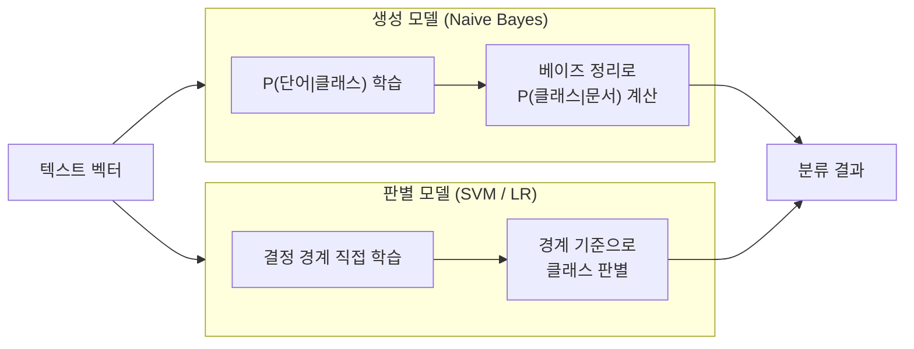
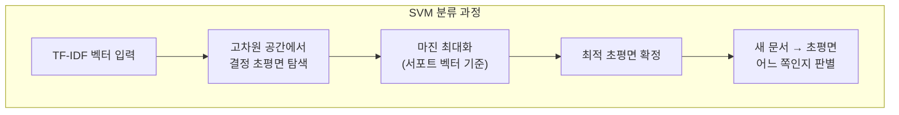
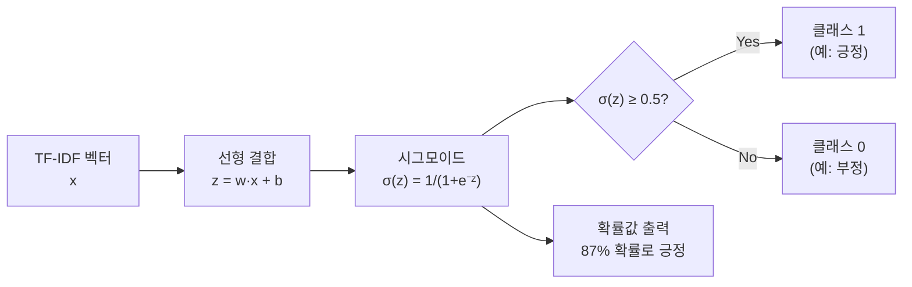
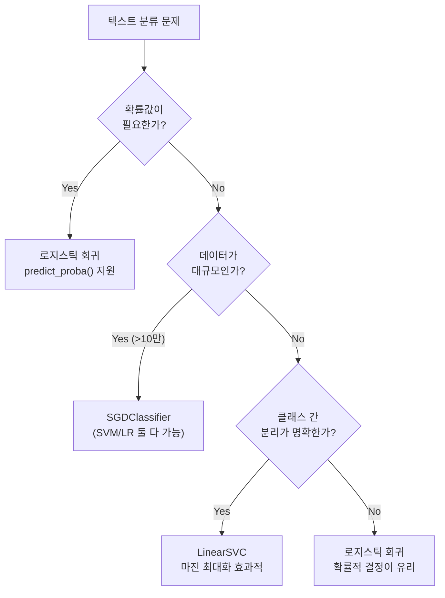

# SVM과 로지스틱 회귀 텍스트 분류

> 결정 경계 기반 판별 모델로 텍스트를 분류하는 방법을 배웁니다

## 개요

이 섹션에서는 **SVM(Support Vector Machine)**과 **로지스틱 회귀(Logistic Regression)** — 두 가지 대표적인 판별 모델을 활용한 텍스트 분류를 학습합니다. 앞서 [01. Naive Bayes 텍스트 분류](04-ch4-전통적-텍스트-분류/01-01-naive-bayes-텍스트-분류.md)에서 배운 확률 기반 생성 모델과는 근본적으로 다른 접근법이죠.

**선수 지식**:
- [TF-IDF의 이론](03-ch3-텍스트-표현-bow와-tf-idf/03-03-tf-idf의-이론.md)과 [TfidfVectorizer 실습](03-ch3-텍스트-표현-bow와-tf-idf/04-04-tfidfvectorizer-실습.md)의 벡터화 개념
- Naive Bayes의 확률 기반 분류 원리 (이전 섹션)

**학습 목표**:
- SVM이 "최적의 결정 경계"를 찾는 원리를 직관적으로 이해한다
- 선형 SVM이 고차원 텍스트 데이터에 특히 효과적인 이유를 설명할 수 있다
- 로지스틱 회귀의 확률적 분류 원리를 이해하고 Naive Bayes와 비교할 수 있다
- 생성 모델과 판별 모델의 차이를 명확히 구분할 수 있다
- scikit-learn의 `LinearSVC`와 `LogisticRegression`으로 텍스트 분류를 구현한다

## 왜 알아야 할까?

Naive Bayes는 빠르고 간단하지만, "단어들이 서로 독립적"이라는 다소 비현실적인 가정을 합니다. 실제 텍스트에서는 단어들이 함께 등장하는 패턴이 분류에 중요한 단서가 되거든요. SVM과 로지스틱 회귀는 이런 가정 없이도 강력한 분류 성능을 발휘합니다.

특히 **SVM은 텍스트 분류의 전성기(2000년대~2010년대)를 이끈 알고리즘**입니다. 딥러닝 이전 시대에 스팸 필터, 감성 분석, 뉴스 분류 등에서 가장 높은 성능을 보여주었고, 지금도 데이터가 적거나 빠른 추론이 필요한 상황에서 현역으로 활약합니다. 로지스틱 회귀는 분류 결과에 **확률값**을 함께 제공하므로, "이 이메일이 스팸일 확률이 87%"처럼 의사결정에 바로 활용할 수 있다는 큰 장점이 있습니다.

이 두 알고리즘을 이해하려면 먼저 **생성 모델**과 **판별 모델**이라는 근본적인 분류 방식의 차이를 알아야 합니다.

### 생성 모델 vs 판별 모델

머신러닝 분류 알고리즘은 크게 두 가지 패러다임으로 나뉩니다:

- **생성 모델(Generative Model)**: 각 클래스가 데이터를 어떻게 "생성"하는지를 학습합니다. 즉 $P(x|y)$ — "이 클래스라면 이런 데이터가 나올 확률"을 모델링한 뒤, 베이즈 정리로 뒤집어서 $P(y|x)$를 구합니다. Naive Bayes가 대표적이죠. 데이터의 전체 분포를 학습하므로, 적은 데이터에서도 비교적 잘 작동하지만 불필요한 정보까지 모델링하는 비효율이 있을 수 있습니다.

- **판별 모델(Discriminative Model)**: 클래스 간의 **경계**를 직접 학습합니다. $P(y|x)$ — "이 데이터가 주어졌을 때 어느 클래스인지"를 바로 구하거나, 결정 경계 자체를 찾습니다. SVM과 로지스틱 회귀가 여기에 해당합니다. 분류에 필요한 정보만 집중적으로 학습하므로, 충분한 데이터가 있으면 보통 더 높은 성능을 보입니다.

> 📊 **그림 1**: 생성 모델 vs 판별 모델 비교



> 💡 **비유**: 생성 모델은 "고양이 사진을 수천 장 외워서, 새 사진이 왔을 때 내가 아는 고양이와 비슷한지 따져보는" 방식이고, 판별 모델은 "고양이와 개 사이의 차이점만 집중해서, 경계선 어느 쪽에 있는지 판단하는" 방식입니다. 전자는 데이터의 전체 모습을 학습하고, 후자는 구분에 필요한 핵심만 학습하죠.

## 핵심 개념

### 개념 1: SVM — 최적의 경계선 찾기

> 💡 **비유**: 운동장에 빨간 팀과 파란 팀 학생들이 서 있다고 상상해 보세요. 두 팀 사이에 줄넘기 줄을 놓아서 팀을 나누려고 합니다. 줄을 놓을 수 있는 위치는 여러 가지가 있지만, SVM은 **양쪽 팀 학생들로부터 최대한 멀리 떨어진 위치**에 줄을 놓습니다. 이렇게 하면 새로운 학생이 와도 어느 팀인지 가장 확실하게 구분할 수 있죠.

SVM의 핵심 아이디어는 **마진(margin) 최대화**입니다. 클래스를 구분하는 결정 경계(초평면) 중에서, 가장 가까운 데이터 포인트까지의 거리가 최대인 경계를 선택합니다. 이 "가장 가까운 데이터 포인트"들을 **서포트 벡터(Support Vector)**라고 부르는데, 이 소수의 데이터만으로 결정 경계가 결정되기 때문에 이런 이름이 붙었습니다.

> 📊 **그림 2**: SVM의 마진 최대화 원리



수학적으로, 선형 SVM은 다음 최적화 문제를 풉니다:

$$\min_{w, b} \frac{1}{2} \|w\|^2 \quad \text{subject to} \quad y_i(w \cdot x_i + b) \geq 1$$

- $w$: 결정 경계의 법선 벡터 (경계의 방향)
- $b$: 바이어스 (경계의 위치)
- $y_i$: 클래스 레이블 (+1 또는 -1)
- $x_i$: 데이터 포인트의 특성 벡터
- $\|w\|$를 최소화 = 마진($\frac{2}{\|w\|}$)을 최대화

이게 의미하는 바는, "모든 데이터를 올바르게 분류하면서(`y_i(w \cdot x_i + b) \geq 1`), 동시에 결정 경계의 폭을 최대한 넓게 만들어라"입니다.

#### 왜 텍스트 데이터에 SVM이 잘 맞을까?

텍스트를 TF-IDF로 변환하면 수만 차원의 희소 벡터가 됩니다. 직관적으로 "차원이 높으면 복잡해서 안 좋지 않나?"라고 생각할 수 있지만, **SVM에게 고차원은 오히려 유리합니다**:

1. **고차원 공간의 선형 분리 가능성**: 차원이 높을수록 데이터를 선형으로 분리할 수 있는 초평면을 찾기가 쉬워집니다
2. **희소 벡터의 이점**: TF-IDF 벡터는 대부분의 값이 0이므로, 서포트 벡터만으로 효율적인 결정 경계를 구축할 수 있습니다
3. **커널 트릭 불필요**: 텍스트의 고차원 특성 덕분에 비선형 커널 없이 선형 SVM만으로도 충분한 성능을 달성합니다

> 📊 **그림 3**: 텍스트 분류에서 SVM의 고차원 처리 흐름


```python
from sklearn.svm import LinearSVC
from sklearn.feature_extraction.text import TfidfVectorizer

# TF-IDF 벡터화
vectorizer = TfidfVectorizer(max_features=10000)
X_train_tfidf = vectorizer.fit_transform(train_texts)

# LinearSVC — 선형 SVM 분류기
# C: 정규화 강도 (작을수록 마진↑, 오분류 허용↑)
svm_clf = LinearSVC(C=1.0, max_iter=1000)
svm_clf.fit(X_train_tfidf, train_labels)
```

> ⚠️ **흔한 오해**: "SVM은 `SVC(kernel='linear')`로 써야 한다" — 텍스트 분류에서는 **`LinearSVC`를 사용하세요**. `SVC`는 내부적으로 libsvm을 사용해서 $O(n^2)$~$O(n^3)$의 시간 복잡도를 가지지만, `LinearSVC`는 liblinear를 사용해서 대규모 데이터에서 훨씬 빠릅니다. scikit-learn 공식 문서에서도 샘플이 만 개를 넘으면 `LinearSVC`나 `SGDClassifier`를 권장합니다.

### 개념 2: 로지스틱 회귀 — 확률을 말해주는 분류기

> 💡 **비유**: SVM이 "이쪽이다, 저쪽이다"라고 딱 잘라 말하는 판사라면, 로지스틱 회귀는 "이쪽일 확률이 87%입니다"라고 근거와 함께 의견을 제시하는 전문가입니다. 결과뿐 아니라 **얼마나 확신하는지**까지 알려주죠.

로지스틱 회귀(Logistic Regression)는 이름에 "회귀"가 들어가지만, 실제로는 **분류** 알고리즘입니다. 핵심은 **시그모이드(sigmoid) 함수**로, 임의의 실수 값을 0~1 사이의 확률로 변환합니다:

$$\sigma(z) = \frac{1}{1 + e^{-z}}, \quad z = w \cdot x + b$$

- $z$: 선형 결합 (SVM의 결정 함수와 동일한 형태)
- $\sigma(z)$: 클래스 1에 속할 확률
- 0.5를 기준으로 클래스를 결정 (임계값 조정 가능)

> 📊 **그림 4**: 로지스틱 회귀의 분류 과정



#### Naive Bayes vs 로지스틱 회귀: 생성 vs 판별

둘 다 확률을 출력하지만, 접근 방식이 근본적으로 다릅니다:

| 구분 | Naive Bayes (생성 모델) | 로지스틱 회귀 (판별 모델) |
|------|----------------------|------------------------|
| 학습 대상 | $P(\text{단어}\|\text{클래스})$ — 각 클래스가 단어를 생성하는 확률 | $P(\text{클래스}\|\text{문서})$ — 문서가 주어졌을 때 클래스 확률을 직접 |
| 가정 | 단어 간 조건부 독립 | 특별한 독립성 가정 없음 |
| 장점 | 적은 데이터에도 잘 작동 | 단어 간 상관관계 활용 가능 |
| 확률 품질 | 보정이 필요한 경우 많음 | 일반적으로 더 잘 보정됨 |

```python
from sklearn.linear_model import LogisticRegression

# 로지스틱 회귀 분류기
# solver='lbfgs': 대규모 데이터에 적합한 최적화 알고리즘
# max_iter=1000: 수렴을 위한 충분한 반복 횟수
lr_clf = LogisticRegression(C=1.0, solver='lbfgs', max_iter=1000)
lr_clf.fit(X_train_tfidf, train_labels)

# 확률 예측 — 로지스틱 회귀만의 강점
probabilities = lr_clf.predict_proba(X_test_tfidf)
# probabilities[0] → [0.13, 0.87] — 클래스 0일 확률 13%, 클래스 1일 확률 87%
```

### 개념 3: SVM vs 로지스틱 회귀 — 언제 무엇을 쓸까?

> 💡 **비유**: SVM은 벽돌담을 쌓는 것처럼 단단한 경계를 만들고, 로지스틱 회귀는 안개처럼 부드러운 경계를 만듭니다. 벽돌담 가까이 가면 어느 쪽인지 불확실하지만, 안개 속에서는 "이쪽에 70% 가까이 있다"는 정보를 얻을 수 있죠.

> 📊 **그림 5**: SVM과 로지스틱 회귀 선택 가이드



실무에서의 선택 기준을 정리하면:

| 기준 | SVM (`LinearSVC`) | 로지스틱 회귀 (`LogisticRegression`) |
|------|-------------------|-------------------------------------|
| **확률 출력** | 기본 미지원 (`decision_function`) | `predict_proba()`로 확률 직접 제공 |
| **다중 클래스** | One-vs-Rest | One-vs-Rest 또는 Multinomial |
| **정규화** | L2 기본 | L1, L2, ElasticNet 선택 가능 |
| **속도** | 매우 빠름 | 빠름 |
| **해석 가능성** | 서포트 벡터로 설명 가능 | 계수(coefficient)로 특성 중요도 확인 |
| **추천 상황** | 이진 분류, 명확한 경계 | 확률 필요, 다중 클래스, 해석 필요 |

## 실습: 직접 해보기

20 Newsgroups 데이터셋을 사용해서 Naive Bayes, SVM, 로지스틱 회귀 세 모델을 비교해 봅시다.

```run:python
from sklearn.datasets import fetch_20newsgroups
from sklearn.feature_extraction.text import TfidfVectorizer
from sklearn.svm import LinearSVC
from sklearn.linear_model import LogisticRegression
from sklearn.naive_bayes import MultinomialNB
from sklearn.metrics import accuracy_score, classification_report
import time

# 4개 카테고리만 선택 (학습 속도를 위해)
categories = ['alt.atheism', 'talk.religion.misc',
              'comp.graphics', 'sci.space']

# 데이터 로드
train = fetch_20newsgroups(subset='train', categories=categories,
                           remove=('headers', 'footers', 'quotes'))
test = fetch_20newsgroups(subset='test', categories=categories,
                          remove=('headers', 'footers', 'quotes'))

print(f"학습 데이터: {len(train.data)}개")
print(f"테스트 데이터: {len(test.data)}개")
print(f"카테고리: {train.target_names}")
```

```output
학습 데이터: 2034개
테스트 데이터: 1353개
카테고리: ['alt.atheism', 'comp.graphics', 'sci.space', 'talk.religion.misc']
```

```python
# TF-IDF 벡터화
vectorizer = TfidfVectorizer(
    max_features=10000,   # 상위 10000개 단어만 사용
    sublinear_tf=True,    # TF에 로그 스케일링 적용
    min_df=2              # 최소 2개 문서에 등장한 단어만
)
X_train = vectorizer.fit_transform(train.data)
X_test = vectorizer.transform(test.data)

print(f"특성 행렬 크기: {X_train.shape}")
print(f"희소 행렬 밀도: {X_train.nnz / (X_train.shape[0] * X_train.shape[1]):.4f}")
```

```python
# === 3가지 모델 비교 ===
models = {
    'Naive Bayes': MultinomialNB(alpha=1.0),
    'LinearSVC': LinearSVC(C=1.0, max_iter=1000),
    'Logistic Regression': LogisticRegression(C=1.0, solver='lbfgs', max_iter=1000)
}

results = {}
for name, model in models.items():
    # 학습 시간 측정
    start = time.time()
    model.fit(X_train, train.target)
    train_time = time.time() - start
    
    # 예측 및 평가
    predictions = model.predict(X_test)
    accuracy = accuracy_score(test.target, predictions)
    results[name] = {'accuracy': accuracy, 'time': train_time}
    
    print(f"\n{'='*50}")
    print(f"[{name}]")
    print(f"정확도: {accuracy:.4f} | 학습 시간: {train_time:.4f}초")
```

```run:python
# 로지스틱 회귀의 확률 예측 예시
sample_text = "NASA launched a new spacecraft to explore Mars"
sample_vec = vectorizer.transform([sample_text])

# 로지스틱 회귀 — 확률 제공
lr_model = models['Logistic Regression']
proba = lr_model.predict_proba(sample_vec)[0]

print("=== 로지스틱 회귀: 확률 예측 ===")
print(f"입력: '{sample_text}'\n")
for cls_name, prob in zip(train.target_names, proba):
    bar = '█' * int(prob * 30)
    print(f"  {cls_name:25s} {prob:.4f} {bar}")

predicted_class = train.target_names[proba.argmax()]
print(f"\n예측 클래스: {predicted_class} ({proba.max():.1%} 확률)")
```

```output
=== 로지스틱 회귀: 확률 예측 ===
입력: 'NASA launched a new spacecraft to explore Mars'

  alt.atheism               0.0156 
  comp.graphics             0.0203 
  sci.space                 0.9438 ████████████████████████████
  talk.religion.misc        0.0203 

예측 클래스: sci.space (94.4% 확률)
```

```run:python
# SVM의 결정 함수 vs 로지스틱 회귀의 확률
svm_model = models['LinearSVC']

# SVM은 decision_function 사용 (확률이 아닌 부호 있는 거리)
svm_decision = svm_model.decision_function(sample_vec)[0]

print("=== SVM: 결정 함수 값 (확률 아님) ===")
for cls_name, score in zip(train.target_names, svm_decision):
    sign = '+' if score > 0 else ''
    print(f"  {cls_name:25s} {sign}{score:.4f}")

print(f"\nSVM 예측: {train.target_names[svm_decision.argmax()]}")
print("\n💡 SVM의 decision_function 값은 확률이 아니라")
print("   결정 경계로부터의 '부호 있는 거리'입니다.")
```

```output
=== SVM: 결정 함수 값 (확률 아님) ===
  alt.atheism               -1.0234
  comp.graphics             -0.8917
  sci.space                 +1.5623
  talk.religion.misc        -0.9145

SVM 예측: sci.space

💡 SVM의 decision_function 값은 확률이 아니라
   결정 경계로부터의 '부호 있는 거리'입니다.
```

```python
# 로지스틱 회귀의 특성 중요도 분석
import numpy as np

feature_names = vectorizer.get_feature_names_out()

# 각 클래스별 가장 중요한 단어 TOP 5
for i, cls_name in enumerate(train.target_names):
    # 계수가 큰 단어 = 해당 클래스에 기여하는 단어
    top_indices = lr_model.coef_[i].argsort()[-5:][::-1]
    top_words = [feature_names[j] for j in top_indices]
    print(f"{cls_name:25s} → {', '.join(top_words)}")
```

## 더 깊이 알아보기

### SVM의 탄생: 소련에서 시작된 여정

SVM의 기원은 1960년대 소련으로 거슬러 올라갑니다. **블라디미르 바프닉(Vladimir Vapnik)**과 알렉세이 체르보넨키스(Alexey Chervonenkis)는 1963년, 모스크바의 러시아 과학 아카데미 제어과학 연구소에서 **"일반화된 초상화 방법(Generalised Portrait Method)"**이라는 이름으로 최초의 최대 마진 선형 분류기를 제안했습니다.

놀라운 점은, 이 알고리즘이 당시 소련의 폐쇄적 학술 환경 때문에 서방 세계에 거의 알려지지 않았다는 것입니다. 1991년 소련 붕괴 후, 바프닉은 미국으로 이주하여 AT&T 벨 연구소에 합류했고, 1992년에 **커널 트릭**을 적용한 비선형 SVM을 발표합니다. 그리고 1995년 코르테스(Corinna Cortes)와 함께 발표한 "Support Vector Networks" 논문이 기계 학습 역사를 바꾸어 놓았죠.

바프닉은 나중에 이렇게 회고했습니다: *"좋은 이론은 30년이 지나도 유효합니다."* 실제로 1963년의 핵심 아이디어 — 마진 최대화 — 는 60년이 지난 지금도 기계 학습의 기본 원리로 남아 있습니다.

### 로지스틱 회귀의 뿌리

"로지스틱(logistic)"이라는 이름은 19세기 벨기에 수학자 피에르 프랑수아 베르율스트(Pierre-François Verhulst)가 인구 증가 모델에 사용한 **로지스틱 함수**에서 유래했습니다. 원래 S자 곡선으로 인구 포화를 모델링하기 위한 것이었는데, 이 함수가 확률 분류에도 완벽하게 맞아떨어졌던 거죠. 수학이 전혀 다른 분야에서 연결되는 아름다운 사례입니다.

## 흔한 오해와 팁

> ⚠️ **흔한 오해**: "로지스틱 '회귀'니까 연속값을 예측하는 회귀 모델이다" — 이름 때문에 혼동하기 쉽지만, 로지스틱 회귀는 엄연한 **분류** 알고리즘입니다. "회귀"라는 이름은 내부적으로 선형 회귀와 유사한 계산($w \cdot x + b$)을 수행한 뒤 시그모이드로 확률을 변환하기 때문에 붙었습니다.

> ⚠️ **흔한 오해**: "생성 모델은 이미지나 텍스트를 생성하는 GPT 같은 모델이다" — 여기서 말하는 **생성 모델(Generative Model)**은 GPT나 Stable Diffusion 같은 "생성형 AI"와는 다른 개념입니다. 머신러닝 분류에서의 생성 모델은 **데이터의 확률 분포 $P(x|y)$를 학습하는 모델**을 뜻합니다. 이름이 같아서 혼동하기 쉽지만, 전혀 다른 맥락이니 주의하세요. (물론 GPT도 넓은 의미에서는 $P(x)$를 학습하는 생성 모델이긴 합니다.)

> 💡 **알고 계셨나요?**: SVM의 발명자 바프닉은 2024년 현재 컬럼비아 대학교 교수로, **VC 차원(Vapnik-Chervonenkis dimension)**이라는 통계학습 이론의 핵심 개념도 만들었습니다. VC 차원은 "모델이 얼마나 복잡한 패턴을 학습할 수 있는가"를 정량화하는 척도로, 오버피팅을 이론적으로 이해하는 데 필수적입니다.

> 🔥 **실무 팁**: 텍스트 분류에서 `LinearSVC`와 `LogisticRegression` 중 고민이라면, **먼저 로지스틱 회귀를 시도하세요**. 이유는 세 가지입니다:
> 1. `predict_proba()`로 확률을 얻을 수 있어서 임계값 조정이 자유롭습니다
> 2. L1 정규화(`penalty='l1'`)로 자동 특성 선택이 가능합니다
> 3. 성능 차이가 거의 없는 경우가 많고, 해석이 더 쉽습니다
> 성능이 부족할 때 SVM을 추가로 시도해 보는 전략이 효율적입니다.

## 핵심 정리

| 개념 | 설명 |
|------|------|
| **SVM** | 마진을 최대화하는 결정 초평면을 찾는 판별 분류기 |
| **서포트 벡터** | 결정 경계에 가장 가까운 데이터 포인트. 경계를 결정하는 핵심 |
| **`LinearSVC`** | liblinear 기반 선형 SVM. 텍스트 분류에서 `SVC`보다 권장 |
| **로지스틱 회귀** | 시그모이드로 확률을 출력하는 선형 판별 분류기 |
| **시그모이드 함수** | $\sigma(z) = \frac{1}{1+e^{-z}}$, 실수를 0~1 확률로 변환 |
| **생성 모델** | $P(x\|y)$를 학습하여 베이즈 정리로 분류. Naive Bayes가 대표적 |
| **판별 모델** | $P(y\|x)$를 직접 학습하거나 결정 경계를 찾는 모델. SVM, 로지스틱 회귀가 대표적 |
| **C 파라미터** | 정규화 강도. 작을수록 마진↑ 오분류 허용↑, 클수록 마진↓ 정확 분류↑ |
| **`predict_proba()`** | 로지스틱 회귀의 핵심 장점 — 클래스별 확률값 반환 |

## 다음 섹션 미리보기

모델을 학습하고 예측까지 했는데, "이 모델이 정말 좋은 건가?"를 판단하려면 어떻게 해야 할까요? 다음 섹션 [03. 모델 평가와 성능 지표](04-ch4-전통적-텍스트-분류/03-03-모델-평가와-성능-지표.md)에서는 정확도만으로는 부족한 이유, 정밀도·재현율·F1-score의 의미, 그리고 혼동 행렬(Confusion Matrix)을 활용한 체계적인 모델 평가법을 배웁니다.

## 참고 자료

- [scikit-learn SVM 공식 문서](https://scikit-learn.org/stable/modules/svm.html) - SVM의 이론적 배경과 scikit-learn 구현 상세 설명
- [scikit-learn LinearSVC API 문서](https://scikit-learn.org/stable/modules/generated/sklearn.svm.LinearSVC.html) - LinearSVC의 파라미터와 사용법
- [scikit-learn 텍스트 분류 예제: 20newsgroups](https://scikit-learn.org/stable/auto_examples/text/plot_document_classification_20newsgroups.html) - 희소 특성을 이용한 문서 분류 공식 튜토리얼
- [Support Vector Machine — Wikipedia](https://en.wikipedia.org/wiki/Support_vector_machine) - SVM의 역사, 수학적 배경, 커널 트릭 설명
- [scikit-learn Feature Extraction](https://scikit-learn.org/stable/modules/feature_extraction.html) - TfidfVectorizer 포함 텍스트 특성 추출 공식 문서
- [Ng & Jordan (2001) "On Discriminative vs. Generative Classifiers"](https://ai.stanford.edu/~ang/papers/nips01-discriminativegenerative.pdf) - 생성 모델과 판별 모델의 이론적 비교를 다룬 고전 논문

---
### 🔗 Related Sessions
- [multinomialnb](04-ch4-전통적-텍스트-분류/01-01-naive-bayes-텍스트-분류.md) (prerequisite)
- [베이즈 정리](04-ch4-전통적-텍스트-분류/01-01-naive-bayes-텍스트-분류.md) (prerequisite)


---
### 🔗 Related Sessions
- [multinomialnb](04-ch4-전통적-텍스트-분류/01-01-naive-bayes-텍스트-분류.md) (prerequisite)
- [베이즈 정리](04-ch4-전통적-텍스트-분류/01-01-naive-bayes-텍스트-분류.md) (prerequisite)


---
### 🔗 Related Sessions
- [multinomialnb](04-ch4-전통적-텍스트-분류/01-01-naive-bayes-텍스트-분류.md) (prerequisite)
- [베이즈 정리](04-ch4-전통적-텍스트-분류/01-01-naive-bayes-텍스트-분류.md) (prerequisite)


---
### 🔗 Related Sessions
- [multinomialnb](04-ch4-전통적-텍스트-분류/01-01-naive-bayes-텍스트-분류.md) (prerequisite)
- [베이즈 정리](04-ch4-전통적-텍스트-분류/01-01-naive-bayes-텍스트-분류.md) (prerequisite)


---
### 🔗 Related Sessions
- [multinomialnb](04-ch4-전통적-텍스트-분류/01-01-naive-bayes-텍스트-분류.md) (prerequisite)
- [베이즈 정리](04-ch4-전통적-텍스트-분류/01-01-naive-bayes-텍스트-분류.md) (prerequisite)
