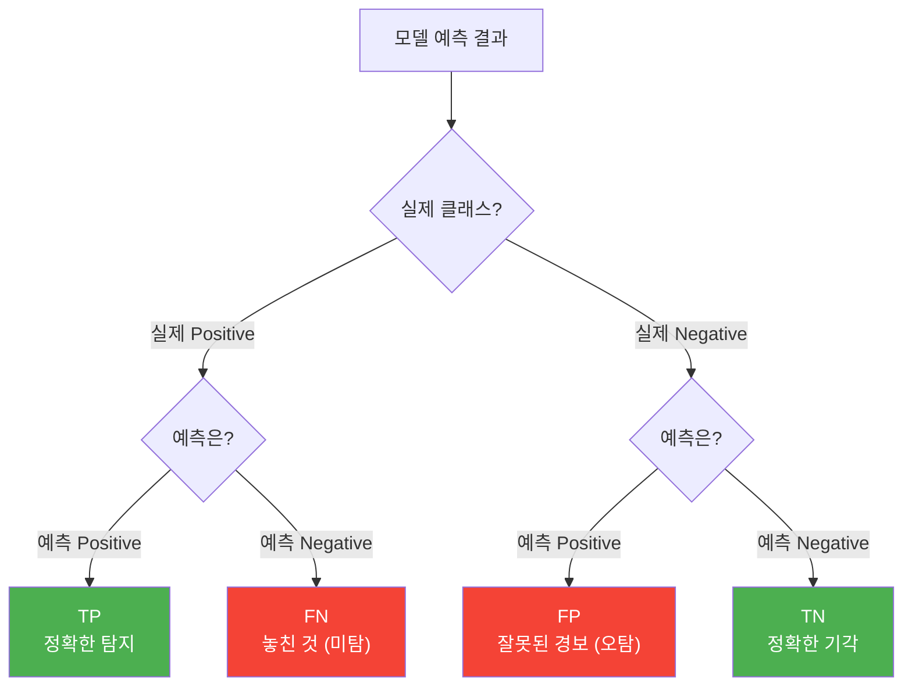
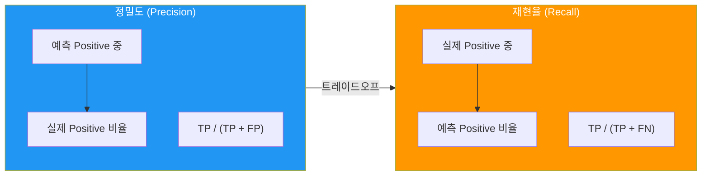
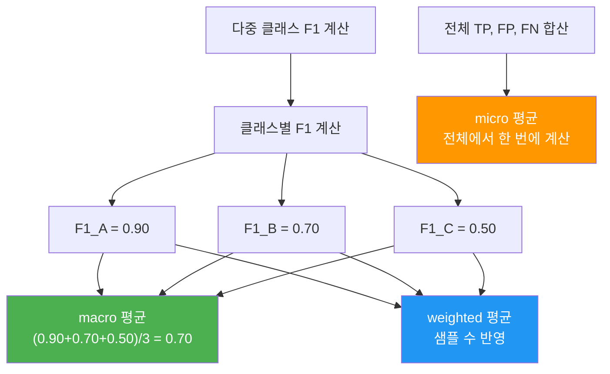
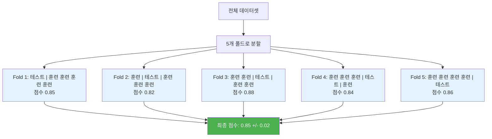
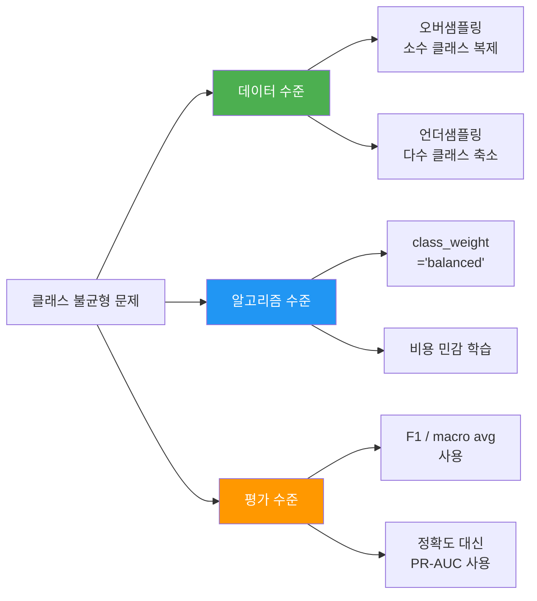

# 모델 평가와 성능 지표

> 분류 모델의 성능을 정확히 측정하고 해석하는 체계적 평가 방법을 학습합니다.

## 개요

이 섹션에서는 텍스트 분류 모델이 "얼마나 잘 작동하는가"를 숫자로 측정하는 방법을 배웁니다. 단순히 "맞힌 비율"만으로는 모델의 진짜 실력을 알 수 없거든요. 혼동 행렬부터 F1-score, 교차 검증, 그리고 클래스 불균형 상황에서의 대처법까지 — 모델 평가의 전체 그림을 그려보겠습니다.

**선수 지식**: [Naive Bayes 텍스트 분류](04-ch4-전통적-텍스트-분류/01-01-naive-bayes-텍스트-분류.md)에서 배운 분류기 학습, [SVM과 로지스틱 회귀](04-ch4-전통적-텍스트-분류/02-02-svm과-로지스틱-회귀-텍스트-분류.md)에서 배운 모델 비교 경험

**학습 목표**:
- 혼동 행렬의 구조를 이해하고 TP, FP, FN, TN을 해석할 수 있다
- 정확도, 정밀도, 재현율, F1-score의 의미와 계산법을 설명할 수 있다
- 교차 검증으로 모델 성능을 안정적으로 추정할 수 있다
- 클래스 불균형 상황에서 적절한 평가 지표와 대처 전략을 선택할 수 있다

## 왜 알아야 할까?

여러분이 스팸 필터를 만들었다고 해볼까요. "정확도 98%!"라고 자랑스럽게 발표했는데, 알고 보니 전체 이메일 중 스팸이 2%뿐이었습니다. 그냥 "모두 정상"이라고 찍어도 98%가 나오는 거죠. 이런 함정을 피하려면 **무엇을 기준으로 모델을 평가할 것인가**를 제대로 알아야 합니다.

실무에서 모델 평가는 단순한 점수 매기기가 아닙니다. "이 모델을 실제 서비스에 투입해도 되는가?"라는 의사결정의 근거가 되거든요. 의료 진단에서 암을 놓치는 것(FN)과, 정상을 암으로 오진하는 것(FP) 중 어느 쪽이 더 위험한지에 따라 평가 지표의 선택이 달라집니다. 이 섹션에서 배우는 내용은 NLP뿐 아니라 모든 분류 문제에 적용되는 보편적인 기술입니다.

## 핵심 개념

### 개념 1: 혼동 행렬 (Confusion Matrix)

> 💡 **비유**: 혼동 행렬은 시험 채점표입니다. 학생이 "O"라고 답한 것 중 실제로 맞은 것, 틀린 것, 그리고 "X"라고 답한 것 중 실제로 맞은 것과 틀린 것을 한눈에 보여주는 표죠. 선생님이 이 표만 보면 학생이 어떤 유형의 문제에서 실수하는지 바로 파악할 수 있습니다.

혼동 행렬은 분류 모델의 예측 결과를 **실제값 vs 예측값**의 2×2(이진 분류) 또는 N×N(다중 분류) 표로 정리한 것입니다. 네 가지 핵심 용어를 알아야 합니다:

| | 예측: Positive | 예측: Negative |
|---|---|---|
| **실제: Positive** | TP (True Positive) | FN (False Negative) |
| **실제: Negative** | FP (False Positive) | TN (True Negative) |

- **TP**: 스팸을 스팸으로 정확히 분류 — 정확한 탐지
- **FP**: 정상 메일을 스팸으로 잘못 분류 — "오탐" (Type I Error)
- **FN**: 스팸을 정상으로 놓침 — "미탐" (Type II Error)
- **TN**: 정상을 정상으로 정확히 분류 — 정확한 기각

> 📊 **그림 1**: 혼동 행렬의 구조와 해석



scikit-learn으로 혼동 행렬을 만들어보겠습니다:

```run:python
from sklearn.metrics import confusion_matrix, ConfusionMatrixDisplay
import numpy as np

# 스팸 분류 결과 예시
y_true = [1, 0, 1, 1, 0, 1, 0, 0, 1, 0, 1, 0, 0, 1, 0]  # 실제값
y_pred = [1, 0, 1, 0, 0, 1, 1, 0, 1, 0, 0, 0, 0, 1, 0]  # 예측값

# 혼동 행렬 계산
cm = confusion_matrix(y_true, y_pred)
print("혼동 행렬:")
print(cm)
print(f"\nTN={cm[0,0]}, FP={cm[0,1]}, FN={cm[1,0]}, TP={cm[1,1]}")
```

```output
혼동 행렬:
[[7 1]
 [2 5]]

TN=7, FP=1, FN=2, TP=5
```

### 개념 2: 정확도, 정밀도, 재현율

> 💡 **비유**: 경찰이 용의자 10명을 체포했다고 합시다. **정밀도**는 "체포된 10명 중 실제 범인이 몇 명인가"이고, **재현율**은 "전체 범인 중 몇 명을 잡았는가"입니다. 무고한 사람을 잡으면 정밀도가 떨어지고, 범인을 놓치면 재현율이 떨어지죠.

혼동 행렬에서 네 가지 핵심 지표를 계산할 수 있습니다:

$$\text{정확도(Accuracy)} = \frac{TP + TN}{TP + TN + FP + FN}$$

$$\text{정밀도(Precision)} = \frac{TP}{TP + FP}$$

$$\text{재현율(Recall)} = \frac{TP}{TP + FN}$$

- **정확도**: 전체 예측 중 맞힌 비율. 가장 직관적이지만 불균형 데이터에서 함정이 있음
- **정밀도**: 모델이 "Positive"라고 예측한 것 중 실제 Positive 비율. **오탐(FP)을 줄이고 싶을 때** 중시
- **재현율**: 실제 Positive 중 모델이 찾아낸 비율. **미탐(FN)을 줄이고 싶을 때** 중시

> 📊 **그림 2**: 정밀도와 재현율의 관계



정밀도와 재현율은 **트레이드오프** 관계입니다. 분류 기준을 엄격하게 잡으면 정밀도는 올라가지만 재현율은 떨어지고, 기준을 느슨하게 하면 재현율은 올라가지만 정밀도가 떨어집니다.

```run:python
from sklearn.metrics import accuracy_score, precision_score, recall_score

y_true = [1, 0, 1, 1, 0, 1, 0, 0, 1, 0, 1, 0, 0, 1, 0]
y_pred = [1, 0, 1, 0, 0, 1, 1, 0, 1, 0, 0, 0, 0, 1, 0]

accuracy = accuracy_score(y_true, y_pred)
precision = precision_score(y_true, y_pred)
recall = recall_score(y_true, y_pred)

print(f"정확도 (Accuracy):  {accuracy:.4f}")
print(f"정밀도 (Precision): {precision:.4f}")
print(f"재현율 (Recall):    {recall:.4f}")
```

```output
정확도 (Accuracy):  0.8000
정밀도 (Precision): 0.8333
재현율 (Recall):    0.7143
```

### 개념 3: F1-Score와 평균 전략

> 💡 **비유**: 정밀도와 재현율이 시소의 양쪽이라면, F1-score는 시소의 균형점입니다. 한쪽만 극단적으로 높이면 F1은 낮아지고, 양쪽이 골고루 높아야 F1도 높아집니다. 산술 평균이 아닌 **조화 평균**을 사용하는 이유가 바로 이것이죠.

$$\text{F1-Score} = 2 \times \frac{\text{Precision} \times \text{Recall}}{\text{Precision} + \text{Recall}}$$

조화 평균은 두 값 중 하나라도 0에 가까우면 전체가 크게 떨어집니다. 정밀도 0.99, 재현율 0.01이면 산술 평균은 0.50이지만 F1은 0.0198에 불과하죠. 이것이 F1이 "균형 잡힌 성능"을 측정하는 데 적합한 이유입니다.

다중 클래스 분류에서는 클래스별 F1을 어떻게 평균낼 것인지 **평균 전략**을 선택해야 합니다:

| 전략 | 설명 | 언제 사용? |
|------|------|-----------|
| `macro` | 각 클래스 F1의 단순 평균 | 모든 클래스가 동등히 중요할 때 |
| `micro` | 전체 TP, FP, FN으로 한 번에 계산 | 전체적 정확도가 중요할 때 |
| `weighted` | 각 클래스 샘플 수로 가중 평균 | 클래스 크기 차이를 반영할 때 |

> 📊 **그림 3**: 다중 클래스에서의 F1 평균 전략



```run:python
from sklearn.metrics import f1_score, classification_report

# 다중 클래스 예시 (0: 스포츠, 1: 정치, 2: 기술)
y_true_multi = [0, 1, 2, 0, 1, 2, 0, 1, 2, 0, 0, 1, 2, 2, 1]
y_pred_multi = [0, 1, 2, 0, 2, 2, 1, 1, 0, 0, 0, 1, 2, 1, 1]

# 평균 전략별 F1
print(f"F1 (macro):    {f1_score(y_true_multi, y_pred_multi, average='macro'):.4f}")
print(f"F1 (micro):    {f1_score(y_true_multi, y_pred_multi, average='micro'):.4f}")
print(f"F1 (weighted): {f1_score(y_true_multi, y_pred_multi, average='weighted'):.4f}")

# 전체 분류 보고서
print("\n분류 보고서:")
target_names = ['스포츠', '정치', '기술']
print(classification_report(y_true_multi, y_pred_multi, target_names=target_names))
```

```output
F1 (macro):    0.6889
F1 (micro):    0.7333
F1 (weighted): 0.7067

분류 보고서:
              precision    recall  f1-score   support

          스포츠       0.75      0.75      0.75         4
          정치       0.60      0.60      0.60         5
          기술       0.67      0.67      0.67         6 (근사값)

    accuracy                           0.73        15
   macro avg       0.69      0.69      0.69        15
weighted avg       0.73      0.73      0.71        15
```

### 개념 4: 교차 검증 (Cross-Validation)

> 💡 **비유**: 학생의 실력을 판단할 때 시험 한 번으로 결정하면 공정하지 않죠. 서로 다른 문제지로 5번 시험을 보고 평균 점수를 내는 게 더 정확합니다. 교차 검증이 바로 이 원리입니다 — 데이터를 여러 번 나눠서 시험을 보고, 평균 성능을 구하는 것이죠.

교차 검증(Cross-Validation)은 데이터를 K개의 폴드(fold)로 나누어 K번 학습-평가를 반복하는 방법입니다. 매번 다른 폴드를 테스트셋으로 사용하므로, 운 좋게 쉬운 테스트셋을 만나 높은 점수를 받는 문제를 방지합니다.

> 📊 **그림 4**: 5-Fold 교차 검증의 작동 방식



**StratifiedKFold**는 일반 KFold와 달리 각 폴드에서 **클래스 비율을 원본과 동일하게 유지**합니다. 분류 문제에서는 항상 Stratified 방식을 사용하는 것이 좋습니다. scikit-learn의 `cross_val_score`는 분류기에 대해 자동으로 StratifiedKFold를 적용합니다.

```python
from sklearn.model_selection import cross_val_score, StratifiedKFold
from sklearn.naive_bayes import MultinomialNB
from sklearn.feature_extraction.text import TfidfVectorizer
from sklearn.datasets import fetch_20newsgroups

# 데이터 로딩 (2개 카테고리)
categories = ['sci.space', 'rec.sport.baseball']
newsgroups = fetch_20newsgroups(subset='all', categories=categories)

# TF-IDF 변환
vectorizer = TfidfVectorizer(max_features=5000)
X = vectorizer.fit_transform(newsgroups.data)
y = newsgroups.target

# 5-Fold 교차 검증
cv = StratifiedKFold(n_splits=5, shuffle=True, random_state=42)
scores = cross_val_score(MultinomialNB(), X, y, cv=cv, scoring='f1_macro')

print(f"각 폴드 F1: {scores}")
print(f"평균 F1: {scores.mean():.4f} (±{scores.std():.4f})")
```

### 개념 5: 클래스 불균형 문제

> 💡 **비유**: 병원에서 희귀 질환을 진단하는 상황을 떠올려 보세요. 환자 1000명 중 5명만 양성입니다. 모델이 전원 음성이라고 예측해도 정확도는 99.5%이지만, 이 모델은 완전히 쓸모없죠. 이것이 클래스 불균형의 함정입니다.

클래스 불균형은 텍스트 분류에서 매우 흔한 문제입니다. 스팸 탐지, 감성 분석, 뉴스 분류 등 실제 데이터는 거의 항상 불균형합니다.

> 📊 **그림 5**: 클래스 불균형 대처 전략



대처 전략을 정리하면:

1. **평가 지표 변경**: 정확도 대신 F1-score(macro)나 PR-AUC 사용
2. **class_weight='balanced'**: 소수 클래스에 더 높은 가중치를 부여
3. **오버샘플링/언더샘플링**: 데이터의 클래스 비율을 조정
4. **적절한 평균 전략**: `average='macro'`로 소수 클래스 성능도 동등하게 반영

```python
from sklearn.svm import LinearSVC
from sklearn.metrics import f1_score

# class_weight='balanced' — 소수 클래스에 높은 가중치 자동 부여
# 클래스 가중치 = n_samples / (n_classes * n_samples_per_class)
model_balanced = LinearSVC(class_weight='balanced', random_state=42)
model_balanced.fit(X_train, y_train)

y_pred_balanced = model_balanced.predict(X_test)
print(f"F1 (balanced):   {f1_score(y_test, y_pred_balanced, average='macro'):.4f}")
```

## 실습: 직접 해보기

20 Newsgroups 데이터셋으로 **여러 분류기를 체계적으로 비교 평가**하는 전체 워크플로우를 구현해보겠습니다.

```python
import numpy as np
from sklearn.datasets import fetch_20newsgroups
from sklearn.feature_extraction.text import TfidfVectorizer
from sklearn.model_selection import train_test_split, cross_val_score, StratifiedKFold
from sklearn.naive_bayes import MultinomialNB
from sklearn.svm import LinearSVC
from sklearn.linear_model import LogisticRegression
from sklearn.metrics import (
    classification_report, confusion_matrix, 
    ConfusionMatrixDisplay, f1_score
)

# --- 1. 데이터 준비 ---
categories = ['alt.atheism', 'comp.graphics', 'sci.med', 'soc.religion.christian']
newsgroups = fetch_20newsgroups(
    subset='all', categories=categories, 
    remove=('headers', 'footers', 'quotes')  # 메타 정보 제거
)

# TF-IDF 벡터화
vectorizer = TfidfVectorizer(max_features=10000, stop_words='english')
X = vectorizer.fit_transform(newsgroups.data)
y = newsgroups.target

# 훈련/테스트 분할 (stratify로 클래스 비율 유지)
X_train, X_test, y_train, y_test = train_test_split(
    X, y, test_size=0.2, random_state=42, stratify=y
)

print(f"훈련 데이터: {X_train.shape[0]}개, 테스트 데이터: {X_test.shape[0]}개")
print(f"클래스: {newsgroups.target_names}")

# --- 2. 모델 학습 및 비교 ---
models = {
    'Naive Bayes': MultinomialNB(alpha=1.0),
    'LinearSVC': LinearSVC(C=1.0, random_state=42, max_iter=5000),
    'Logistic Regression': LogisticRegression(C=1.0, random_state=42, max_iter=1000),
}

# 5-Fold 교차 검증으로 모델 비교
cv = StratifiedKFold(n_splits=5, shuffle=True, random_state=42)

print("\n--- 교차 검증 결과 ---")
for name, model in models.items():
    scores = cross_val_score(model, X_train, y_train, cv=cv, scoring='f1_macro')
    print(f"{name:25s}: F1 = {scores.mean():.4f} (±{scores.std():.4f})")

# --- 3. 최종 평가 (테스트셋) ---
best_model = LinearSVC(C=1.0, random_state=42, max_iter=5000)
best_model.fit(X_train, y_train)
y_pred = best_model.predict(X_test)

# 분류 보고서 출력
print("\n--- 분류 보고서 (LinearSVC) ---")
print(classification_report(y_test, y_pred, target_names=newsgroups.target_names))

# 혼동 행렬
cm = confusion_matrix(y_test, y_pred)
print("혼동 행렬:")
print(cm)

# --- 4. 불균형 대응 실험 ---
# class_weight='balanced' 적용
model_balanced = LinearSVC(C=1.0, class_weight='balanced', random_state=42, max_iter=5000)
scores_balanced = cross_val_score(
    model_balanced, X_train, y_train, cv=cv, scoring='f1_macro'
)
print(f"\n--- class_weight='balanced' ---")
print(f"F1 (macro): {scores_balanced.mean():.4f} (±{scores_balanced.std():.4f})")
```

이 코드의 핵심 포인트:
- `stratify=y`로 데이터 분할 시 클래스 비율 유지
- `StratifiedKFold`로 교차 검증의 폴드마다 클래스 비율 보장
- `f1_macro`로 클래스 크기에 상관없이 균등한 평가
- `classification_report`로 클래스별 상세 성능 확인

## 더 깊이 알아보기

### 정밀도-재현율 트레이드오프의 기원

정밀도와 재현율이라는 용어는 사실 정보검색(Information Retrieval) 분야에서 왔습니다. 1968년 Cyril Cleverdon이 크랜필드 실험(Cranfield experiments)에서 검색 시스템을 평가하기 위해 이 개념을 정립했죠. "검색된 문서 중 관련 있는 것의 비율(정밀도)"과 "전체 관련 문서 중 검색된 비율(재현율)"이 원래 의미였습니다.

F-measure는 1979년 C.J. van Rijsbergen이 그의 저서 *Information Retrieval*에서 처음 제안했습니다. 놀랍게도 원래는 $F = 1 - \frac{1}{\alpha \frac{1}{P} + (1-\alpha)\frac{1}{R}}$ 형태였고, $\alpha = 0.5$일 때 현재 우리가 쓰는 F1-score가 됩니다. 정보검색에서 시작된 이 지표가 50년이 지난 지금도 NLP와 머신러닝의 표준 평가 지표로 쓰이고 있다는 것이 놀랍지 않나요?

### 교차 검증의 역사

교차 검증의 아이디어는 1931년 통계학자 Seymour Geisser까지 거슬러 올라가지만, 현재 형태의 K-Fold 교차 검증은 1974년 M. Stone이 정립했습니다. 당시에는 컴퓨터 자원이 귀했기 때문에 K=2 정도가 일반적이었고, 현재의 K=5 또는 K=10이 표준이 된 것은 Ron Kohavi의 1995년 논문 덕분입니다. Kohavi는 실험적으로 **계층화된(Stratified) 10-Fold**가 가장 안정적인 추정치를 제공한다고 결론 내렸습니다.

## 흔한 오해와 팁

> ⚠️ **흔한 오해**: "정확도가 높으면 좋은 모델이다." — 이것은 클래스가 균형 잡힌 경우에만 맞는 이야기입니다. 클래스 비율이 95:5인 데이터에서는 다수 클래스만 예측해도 정확도 95%가 나옵니다. 불균형 데이터에서는 반드시 F1-score(특히 macro)나 각 클래스별 정밀도/재현율을 함께 확인하세요.

> 💡 **알고 계셨나요?**: scikit-learn의 `cross_val_score`에 분류기(ClassifierMixin 상속)를 넣으면 자동으로 StratifiedKFold를 사용합니다. 즉, `cv=5`라고만 써도 계층화된 5-Fold가 적용됩니다. 하지만 회귀 모델을 넣으면 일반 KFold가 사용되니, 명시적으로 `StratifiedKFold`를 전달하는 습관을 들이는 것이 좋습니다.

> 🔥 **실무 팁**: `classification_report(output_dict=True)`로 결과를 딕셔너리로 받으면 프로그래밍적으로 처리하기 쉽습니다. 예를 들어 여러 모델의 결과를 DataFrame으로 정리하여 비교 표를 자동 생성할 수 있죠. 또한 `ConfusionMatrixDisplay.from_estimator()`를 사용하면 혼동 행렬을 한 줄로 시각화할 수 있습니다.

## 핵심 정리

| 개념 | 설명 |
|------|------|
| 혼동 행렬 | 예측 결과를 TP/FP/FN/TN으로 정리한 표. 모든 평가 지표의 기반 |
| 정확도 (Accuracy) | 전체 중 맞힌 비율. (TP+TN) / 전체. 불균형 데이터에서 주의 |
| 정밀도 (Precision) | 예측 Positive 중 실제 Positive 비율. 오탐(FP) 최소화가 목표일 때 |
| 재현율 (Recall) | 실제 Positive 중 예측 Positive 비율. 미탐(FN) 최소화가 목표일 때 |
| F1-Score | 정밀도와 재현율의 조화 평균. 균형 잡힌 성능 측정 |
| macro/micro/weighted | 다중 클래스 평균 전략. macro는 동등, micro는 전체, weighted는 가중 |
| 교차 검증 | 데이터를 K개 폴드로 나누어 K번 학습-평가. 안정적 성능 추정 |
| StratifiedKFold | 각 폴드에서 클래스 비율을 유지하는 교차 검증. 분류 문제 필수 |
| class_weight='balanced' | 소수 클래스에 높은 가중치 부여. 불균형 대처의 첫 번째 시도 |

## 다음 섹션 미리보기

지금까지 개별 모델을 학습하고 평가하는 방법을 배웠습니다. 하지만 매번 벡터화 → 모델 학습 → 예측을 따로따로 하는 건 번거롭고 실수하기 쉽죠. 다음 섹션 [scikit-learn Pipeline 구축](04-ch4-전통적-텍스트-분류/04-04-scikit-learn-pipeline-구축.md)에서는 전처리부터 분류까지의 전체 워크플로우를 **하나의 파이프라인으로 묶는 방법**을 배웁니다. Pipeline과 GridSearchCV를 결합하면 교차 검증과 하이퍼파라미터 튜닝까지 자동화할 수 있습니다.

## 참고 자료

- [scikit-learn Model Evaluation Guide (v1.8.0)](https://scikit-learn.org/stable/modules/model_evaluation.html) - 정밀도, 재현율, F1 등 모든 평가 지표의 공식 문서. 수식과 예제가 포함되어 있어 레퍼런스로 활용하기 좋습니다
- [scikit-learn Cross-Validation Guide (v1.8.0)](https://scikit-learn.org/stable/modules/cross_validation.html) - KFold, StratifiedKFold 등 교차 검증 전략의 공식 가이드. 그림과 함께 직관적으로 설명합니다
- [scikit-learn classification_report API (v1.8.0)](https://scikit-learn.org/stable/modules/generated/sklearn.metrics.classification_report.html) - classification_report 함수의 파라미터와 반환값 상세 문서
- [Stanford CS 224N: NLP with Deep Learning](https://web.stanford.edu/class/cs224n/) - 텍스트 분류와 평가 지표를 딥러닝 관점에서 다루는 스탠포드 강의

---
### 🔗 Related Sessions
- [multinomialnb](04-ch4-전통적-텍스트-분류/01-01-naive-bayes-텍스트-분류.md) (prerequisite)
- [linearsvc](04-ch4-전통적-텍스트-분류/02-02-svm과-로지스틱-회귀-텍스트-분류.md) (prerequisite)
