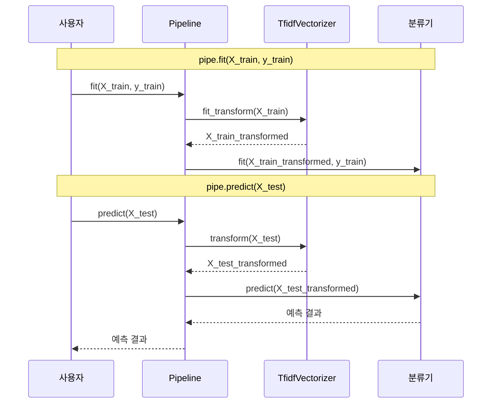
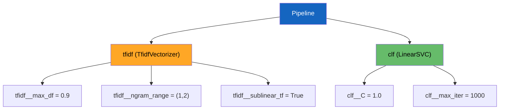
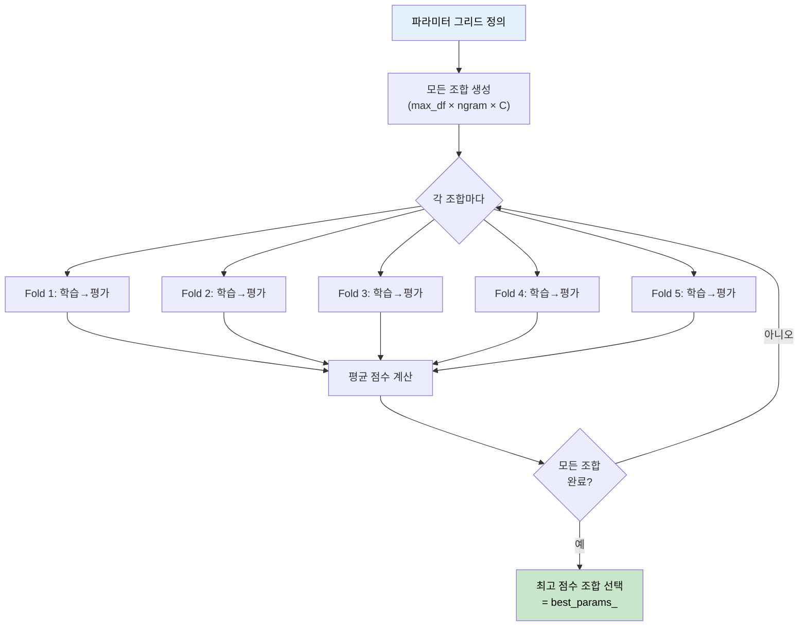

# scikit-learn Pipeline 구축

> 전처리, 벡터화, 분류를 하나의 파이프라인으로 일체화하고, GridSearchCV로 최적의 하이퍼파라미터를 자동으로 찾아보자

## 개요

이 섹션에서는 scikit-learn의 `Pipeline`을 활용해 텍스트 전처리부터 분류까지 모든 단계를 하나의 객체로 묶는 방법을 배웁니다. 나아가 `GridSearchCV`를 결합하여 하이퍼파라미터 튜닝을 자동화하고, 재현 가능한 실험 환경을 구축하는 방법까지 익힙니다.

**선수 지식**: [Naive Bayes 텍스트 분류](04-ch4-전통적-텍스트-분류/01-01-naive-bayes-텍스트-분류.md)에서 배운 CountVectorizer와 MultinomialNB, [SVM과 로지스틱 회귀](04-ch4-전통적-텍스트-분류/02-02-svm과-로지스틱-회귀-텍스트-분류.md)의 LinearSVC와 LogisticRegression, 그리고 [모델 평가와 성능 지표](04-ch4-전통적-텍스트-분류/03-03-모델-평가와-성능-지표.md)에서 배운 교차 검증과 F1-score 개념

**학습 목표**:
- Pipeline의 개념과 필요성을 이해하고, 텍스트 분류 파이프라인을 구축할 수 있다
- `__` (더블 언더스코어) 표기법으로 파이프라인 내부 파라미터에 접근할 수 있다
- GridSearchCV와 Pipeline을 결합하여 최적의 하이퍼파라미터 조합을 탐색할 수 있다
- 실험 결과를 체계적으로 기록하고 재현 가능한 워크플로우를 관리할 수 있다

## 왜 알아야 할까?

지금까지 우리는 텍스트 분류를 할 때 벡터화 → 분류기 학습 → 예측이라는 단계를 각각 따로 작성했습니다. 코드가 3~4줄이면 괜찮지만, 실무에서는 문제가 생기기 시작하거든요.

예를 들어, TF-IDF 벡터화기를 학습 데이터로 `fit_transform`하고, 테스트 데이터에는 `transform`만 해야 하는데 실수로 `fit_transform`을 쓰면 어떻게 될까요? **데이터 누출(data leakage)** 이 발생해서 테스트 성능이 비현실적으로 높게 나옵니다. 실전에 배포하면 성능이 뚝 떨어지죠.

Pipeline은 이런 실수를 **구조적으로 불가능**하게 만듭니다. 한 번 구축해두면 `fit`과 `predict`만 호출하면 내부적으로 모든 단계가 올바른 순서로 실행되니까요. 여기에 GridSearchCV를 결합하면 "어떤 벡터화 설정과 어떤 분류기 파라미터가 최적인가?"를 자동으로 탐색할 수 있습니다.

## 핵심 개념

### 개념 1: Pipeline — 머신러닝 조립 라인

> 💡 **비유**: 자동차 공장의 **조립 라인**을 떠올려보세요. 철판이 들어가면 → 프레스 → 용접 → 도장 → 조립 → 완성차가 나옵니다. 각 공정이 순서대로 연결되어 있고, "프레스 공정"을 건너뛰거나 순서를 바꾸면 차가 만들어지지 않죠. scikit-learn의 Pipeline이 바로 이 조립 라인입니다. 데이터가 들어가면 → 전처리 → 벡터화 → 분류 → 결과가 나옵니다.

scikit-learn의 `Pipeline`은 여러 데이터 처리 단계(Transformer)와 최종 추정기(Estimator)를 **순차적으로 연결**하는 도구입니다. Pipeline 안의 마지막 단계를 제외한 모든 단계는 `transform` 메서드를 가진 Transformer여야 하고, 마지막 단계는 `fit`을 가진 Estimator(분류기, 회귀기 등)입니다.

> 📊 **그림 1**: Pipeline의 기본 구조와 데이터 흐름


Pipeline을 사용하지 않는 코드와 사용하는 코드를 비교해보면 차이가 명확합니다:

```python
# ❌ Pipeline 없이 — 실수 가능성 높음
vectorizer = TfidfVectorizer()
X_train_vec = vectorizer.fit_transform(X_train)  # fit_transform
X_test_vec = vectorizer.transform(X_test)         # transform만! (헷갈림)
clf = LinearSVC()
clf.fit(X_train_vec, y_train)
predictions = clf.predict(X_test_vec)
```

```python
# ✅ Pipeline 사용 — 깔끔하고 안전함
from sklearn.pipeline import Pipeline

pipe = Pipeline([
    ('tfidf', TfidfVectorizer()),
    ('clf', LinearSVC())
])
pipe.fit(X_train, y_train)           # 내부에서 알아서 fit_transform → fit
predictions = pipe.predict(X_test)   # 내부에서 알아서 transform → predict
```

Pipeline의 `fit`을 호출하면 내부적으로 이런 일이 벌어집니다:

> 📊 **그림 2**: Pipeline의 fit()과 predict() 내부 동작



Pipeline 객체 자체가 하나의 Estimator처럼 동작하기 때문에, `fit`, `predict`, `score` 같은 메서드를 그대로 사용할 수 있습니다. 이것이 바로 Pipeline의 핵심 가치입니다.

```run:python
from sklearn.pipeline import Pipeline
from sklearn.feature_extraction.text import TfidfVectorizer
from sklearn.svm import LinearSVC

# Pipeline 생성 — (이름, 객체) 튜플의 리스트
pipe = Pipeline([
    ('tfidf', TfidfVectorizer()),   # 1단계: 벡터화
    ('clf', LinearSVC())            # 2단계: 분류
])

# Pipeline 구조 확인
print("Pipeline 단계:")
for name, step in pipe.steps:
    print(f"  {name}: {step.__class__.__name__}")
print(f"\n총 {len(pipe.steps)}단계 파이프라인")
```

```output
Pipeline 단계:
  tfidf: TfidfVectorizer
  clf: LinearSVC

총 2단계 파이프라인
```

### 개념 2: 더블 언더스코어(`__`) 표기법

> 💡 **비유**: 대형 빌딩에서 특정 사무실을 찾으려면 "3층 → 마케팅부서 → 김과장 자리"처럼 계층적으로 지정하죠? Pipeline의 `__` 표기법도 마찬가지입니다. `tfidf__max_df`는 "Pipeline 안의 tfidf 단계에서 max_df 파라미터를 찾아줘"라는 의미입니다.

Pipeline 내부의 개별 단계에 접근하려면 `단계이름__파라미터이름` 형식의 더블 언더스코어 표기법을 사용합니다. 이것은 Pipeline과 GridSearchCV를 연결하는 핵심 메커니즘이에요.

> 📊 **그림 3**: 더블 언더스코어 표기법의 파라미터 접근 경로



```run:python
from sklearn.pipeline import Pipeline
from sklearn.feature_extraction.text import TfidfVectorizer
from sklearn.linear_model import LogisticRegression

# Pipeline 생성
pipe = Pipeline([
    ('tfidf', TfidfVectorizer()),
    ('clf', LogisticRegression())
])

# __ 표기법으로 파라미터 설정
pipe.set_params(
    tfidf__max_df=0.9,          # tfidf 단계의 max_df
    tfidf__ngram_range=(1, 2),  # tfidf 단계의 ngram_range
    clf__C=0.5                  # clf 단계의 C
)

# 현재 파라미터 확인
params = pipe.get_params()
print(f"tfidf__max_df: {params['tfidf__max_df']}")
print(f"tfidf__ngram_range: {params['tfidf__ngram_range']}")
print(f"clf__C: {params['clf__C']}")
```

```output
tfidf__max_df: 0.9
tfidf__ngram_range: (1, 2)
clf__C: 0.5
```

### 개념 3: GridSearchCV — 최적의 조합을 자동으로 탐색

> 💡 **비유**: 맛있는 커피를 만들려면 원두 종류, 분쇄도, 물 온도, 추출 시간을 조합해야 합니다. 모든 조합을 일일이 시도해서 최고의 커피를 찾는 것이 바로 Grid Search입니다. "에티오피아 원두 + 중간 분쇄 + 92도 + 25초"가 최고라는 걸 **체계적으로** 찾아내는 거죠.

`GridSearchCV`는 지정한 파라미터 후보들의 **모든 조합**을 교차 검증으로 평가하고, 가장 좋은 조합을 자동으로 선택합니다. Pipeline과 결합하면 벡터화 설정과 분류기 파라미터를 **동시에** 최적화할 수 있습니다.

```python
from sklearn.model_selection import GridSearchCV

# 탐색할 파라미터 그리드 정의
param_grid = {
    'tfidf__max_df': [0.8, 0.9, 1.0],      # 3가지
    'tfidf__ngram_range': [(1,1), (1,2)],    # 2가지
    'clf__C': [0.1, 1.0, 10.0]              # 3가지
}
# 총 조합: 3 × 2 × 3 = 18가지, 각각 5-fold CV → 90번 학습!

grid_search = GridSearchCV(
    pipe,                   # Pipeline 객체
    param_grid,             # 파라미터 후보
    cv=5,                   # 5-fold 교차 검증
    scoring='f1_macro',     # 평가 지표
    n_jobs=-1,              # 모든 CPU 코어 사용
    verbose=1               # 진행 상황 출력
)
```

GridSearchCV의 동작 과정을 시각화하면 다음과 같습니다:

> 📊 **그림 4**: GridSearchCV의 파라미터 조합 탐색 과정



GridSearchCV가 완료되면, 결과를 다양한 속성으로 확인할 수 있습니다:

| 속성 | 설명 |
|------|------|
| `best_params_` | 최적 파라미터 조합 |
| `best_score_` | 최적 조합의 교차 검증 평균 점수 |
| `best_estimator_` | 최적 파라미터로 학습된 Pipeline 객체 |
| `cv_results_` | 모든 조합의 상세 결과 (딕셔너리) |

### 개념 4: make_pipeline — 더 간편한 Pipeline 생성

`Pipeline`은 각 단계에 이름을 직접 지정해야 하지만, `make_pipeline`은 클래스 이름을 자동으로 사용합니다. 빠른 프로토타이핑에 편리하죠.

```python
from sklearn.pipeline import make_pipeline

# make_pipeline은 이름을 자동 생성
pipe = make_pipeline(
    TfidfVectorizer(),   # 이름: 'tfidfvectorizer'
    LinearSVC()          # 이름: 'linearsvc'
)
# GridSearchCV에서는 자동 생성된 이름 사용:
# 'tfidfvectorizer__max_df', 'linearsvc__C' 등
```

> ⚠️ **흔한 오해**: `make_pipeline`이 항상 편한 건 아닙니다. 같은 종류의 Transformer를 두 번 쓰면(예: 두 개의 StandardScaler) 이름이 충돌합니다. 이름을 명시적으로 지정해야 할 때는 `Pipeline`을 쓰세요.

## 실습: 직접 해보기

20 Newsgroups 데이터셋으로 완전한 Pipeline + GridSearchCV 워크플로우를 구축해봅시다.

```python
import warnings
warnings.filterwarnings('ignore')

from sklearn.datasets import fetch_20newsgroups
from sklearn.pipeline import Pipeline
from sklearn.feature_extraction.text import TfidfVectorizer
from sklearn.svm import LinearSVC
from sklearn.linear_model import LogisticRegression
from sklearn.naive_bayes import MultinomialNB
from sklearn.model_selection import GridSearchCV, cross_val_score
from sklearn.metrics import classification_report
import numpy as np

# ── 1. 데이터 로드 ──
categories = ['alt.atheism', 'comp.graphics', 'sci.med', 'soc.religion.christian']
train = fetch_20newsgroups(subset='train', categories=categories, 
                           shuffle=True, random_state=42)
test = fetch_20newsgroups(subset='test', categories=categories,
                          shuffle=True, random_state=42)

print(f"학습 데이터: {len(train.data)}개")
print(f"테스트 데이터: {len(test.data)}개")
print(f"카테고리: {train.target_names}")
```

```python
# ── 2. 기본 Pipeline 구축 ──
pipe_svm = Pipeline([
    ('tfidf', TfidfVectorizer(stop_words='english')),
    ('clf', LinearSVC(random_state=42, max_iter=10000))
])

# Pipeline 하나로 학습과 예측 끝!
pipe_svm.fit(train.data, train.target)
y_pred = pipe_svm.predict(test.data)

print("=== LinearSVC Pipeline 결과 ===")
print(classification_report(test.target, y_pred, 
                            target_names=train.target_names))
```

```python
# ── 3. GridSearchCV로 하이퍼파라미터 최적화 ──
param_grid = {
    'tfidf__max_df': [0.8, 0.95],           # 최대 문서 빈도
    'tfidf__ngram_range': [(1, 1), (1, 2)],  # 유니그램 vs 바이그램
    'tfidf__sublinear_tf': [True, False],    # 로그 스케일링
    'clf__C': [0.1, 1.0, 10.0]              # 정규화 강도
}

grid_search = GridSearchCV(
    pipe_svm,
    param_grid,
    cv=5,                   # 5-fold 교차 검증
    scoring='f1_macro',     # macro 평균 F1 사용
    n_jobs=-1,              # 병렬 처리
    verbose=1,
    return_train_score=True # 학습 점수도 기록
)

grid_search.fit(train.data, train.target)

print(f"\n최적 파라미터: {grid_search.best_params_}")
print(f"최적 CV F1 (macro): {grid_search.best_score_:.4f}")
```

```python
# ── 4. 최적 모델로 테스트 세트 평가 ──
best_pipe = grid_search.best_estimator_  # 이미 최적 파라미터로 학습 완료

y_pred_best = best_pipe.predict(test.data)
print("=== 최적화된 Pipeline 결과 ===")
print(classification_report(test.target, y_pred_best,
                            target_names=train.target_names))
```

```python
# ── 5. 결과 분석 — 상위 5개 조합 확인 ──
import pandas as pd

results = pd.DataFrame(grid_search.cv_results_)
results = results.sort_values('rank_test_score')

# 상위 5개 조합의 핵심 정보
top5 = results[['params', 'mean_test_score', 'std_test_score', 
                'mean_train_score', 'rank_test_score']].head(5)
                
for i, row in top5.iterrows():
    print(f"[Rank {int(row['rank_test_score'])}] "
          f"F1={row['mean_test_score']:.4f} (±{row['std_test_score']:.4f})")
    params = row['params']
    print(f"  max_df={params['tfidf__max_df']}, "
          f"ngram={params['tfidf__ngram_range']}, "
          f"sublinear_tf={params['tfidf__sublinear_tf']}, "
          f"C={params['clf__C']}")
```

```python
# ── 6. 다른 분류기와 비교 Pipeline ──
pipelines = {
    'Naive Bayes': Pipeline([
        ('tfidf', TfidfVectorizer(stop_words='english', sublinear_tf=True)),
        ('clf', MultinomialNB())
    ]),
    'Logistic Regression': Pipeline([
        ('tfidf', TfidfVectorizer(stop_words='english', sublinear_tf=True)),
        ('clf', LogisticRegression(max_iter=1000, random_state=42))
    ]),
    'LinearSVC': Pipeline([
        ('tfidf', TfidfVectorizer(stop_words='english', sublinear_tf=True)),
        ('clf', LinearSVC(random_state=42, max_iter=10000))
    ])
}

# 교차 검증으로 비교
print("=== 분류기별 5-fold CV F1 (macro) ===")
for name, pipe in pipelines.items():
    scores = cross_val_score(pipe, train.data, train.target, 
                             cv=5, scoring='f1_macro', n_jobs=-1)
    print(f"{name:25s}: {scores.mean():.4f} (±{scores.std():.4f})")
```

```python
# ── 7. 최종 모델 저장과 재현 ──
import joblib
import json
from datetime import datetime

# 모델 저장
# joblib.dump(best_pipe, 'best_text_clf_pipeline.pkl')

# 실험 기록 저장
experiment_log = {
    'timestamp': datetime.now().isoformat(),
    'best_params': grid_search.best_params_,
    'best_cv_score': float(grid_search.best_score_),
    'dataset': '20newsgroups_4categories',
    'n_train': len(train.data),
    'n_test': len(test.data),
    'scoring': 'f1_macro'
}

print("\n=== 실험 기록 ===")
print(json.dumps(experiment_log, indent=2, default=str))
```

## 더 깊이 알아보기

### scikit-learn Pipeline의 탄생 배경

scikit-learn은 2007년 **David Cournapeau**가 Google Summer of Code 프로젝트로 시작했습니다. 원래 이름은 `scikits.learn` — SciPy의 서드파티 확장이었죠. 2010년에 INRIA의 **Fabian Pedregosa**, **Gaël Varoquaux** 등이 리더십을 맡으면서 첫 공식 릴리스가 나왔습니다.

Pipeline 기능은 머신러닝 실험에서 반복되는 "전처리 → 학습 → 예측"의 보일러플레이트 코드를 줄이기 위해 도입되었습니다. 특히 교차 검증 시 **데이터 누출(data leakage)** 문제가 심각했거든요. 전처리를 전체 데이터에 먼저 적용한 뒤 교차 검증을 하면, 검증 폴드의 정보가 학습에 이미 반영되어버립니다. Pipeline과 교차 검증을 결합하면 각 폴드마다 전처리가 독립적으로 수행되므로 이 문제가 자연스럽게 해결됩니다.

> 💡 **알고 계셨나요?**: scikit-learn이라는 이름은 "**Sci**entific tool**kit** for machine **learn**ing"의 줄임말입니다. SciPy 생태계의 일원이라는 정체성과 머신러닝 목적을 이름에 담았죠.

### Unix 철학과의 연결

Pipeline의 설계 철학은 Unix의 **"한 가지를 잘 하는 작은 프로그램들을 파이프로 연결한다"**는 원칙에서 영감을 받았습니다. `cat file.txt | grep "error" | wc -l`처럼 Unix 파이프가 데이터를 흘려보내듯, scikit-learn Pipeline도 데이터를 단계별로 변환하여 흘려보냅니다.

## 흔한 오해와 팁

> ⚠️ **흔한 오해**: "GridSearchCV를 돌리면 항상 최고의 모델을 찾을 수 있다"고 생각하기 쉽습니다. 하지만 GridSearchCV는 **여러분이 제공한 후보 중에서만** 최적을 찾습니다. 후보 자체가 잘못되면 결과도 좋지 않아요. 예를 들어 `C=[0.001, 0.01]`만 줬는데 실제 최적이 `C=10`이라면 찾을 수 없습니다. 합리적인 범위를 설정하는 것이 중요합니다.

> 🔥 **실무 팁**: GridSearchCV의 `n_jobs=-1`은 모든 CPU 코어를 사용합니다. 파라미터 조합이 수백 개일 때 속도 차이가 크지만, 노트북에서는 팬 소음과 발열에 주의하세요. 또한 `verbose=1`이나 `verbose=2`로 진행 상황을 모니터링하는 것이 좋습니다. 대규모 탐색이 필요하면 `GridSearchCV` 대신 `RandomizedSearchCV`를 고려하세요 — 조합을 랜덤 샘플링하여 더 넓은 공간을 효율적으로 탐색합니다.

> 💡 **알고 계셨나요?**: `GridSearchCV`의 `refit=True` (기본값)로 설정하면, 최적 파라미터를 찾은 뒤 **전체 학습 데이터**로 다시 학습합니다. 즉, `best_estimator_`는 교차 검증 중 일부 데이터로 학습한 모델이 아니라, 전체 데이터로 학습된 최종 모델입니다. 따로 다시 `fit`할 필요가 없죠.

## 핵심 정리

| 개념 | 설명 |
|------|------|
| **Pipeline** | 전처리와 분류를 하나의 객체로 묶어 데이터 누출을 방지하고 코드를 간결하게 만드는 도구 |
| **`__` 표기법** | `단계이름__파라미터`로 Pipeline 내부 파라미터에 접근하는 방법 |
| **GridSearchCV** | 파라미터 후보의 모든 조합을 교차 검증으로 평가하여 최적 조합을 선택 |
| **make_pipeline** | 단계 이름을 자동 생성하는 간편 Pipeline 생성 함수 |
| **best_estimator_** | GridSearchCV가 찾은 최적 파라미터로 전체 데이터에 학습된 모델 |
| **best_params_** | GridSearchCV가 찾은 최적 파라미터 조합 딕셔너리 |
| **cv_results_** | GridSearchCV의 모든 조합별 점수, 학습/검증 시간 등 상세 결과 |
| **data leakage** | 테스트 데이터 정보가 학습에 유출되어 성능이 과대 추정되는 문제 |

## 다음 섹션 미리보기

이제 Pipeline과 GridSearchCV를 자유자재로 쓸 수 있게 되었으니, 다음 섹션 [뉴스 기사 분류 프로젝트](04-ch4-전통적-텍스트-분류/05-05-뉴스-기사-분류-프로젝트.md)에서는 이번 챕터에서 배운 모든 것을 종합합니다. 20 Newsgroups 전체 카테고리를 대상으로 데이터 탐색 → 전처리 → Pipeline 구축 → 모델 선택 → 평가까지 **완전한 프로젝트 워크플로우**를 처음부터 끝까지 경험해보겠습니다.

## 참고 자료

- [Pipelines and composite estimators — scikit-learn 1.8.0](https://scikit-learn.org/stable/modules/compose.html) - Pipeline의 공식 사용자 가이드. FeatureUnion, ColumnTransformer 등 고급 기능까지 포함
- [Sample pipeline for text feature extraction and evaluation — scikit-learn 1.8.0](https://scikit-learn.org/stable/auto_examples/model_selection/plot_grid_search_text_feature_extraction.html) - 텍스트 분류에서 Pipeline + GridSearchCV를 사용하는 공식 예제
- [GridSearchCV — scikit-learn 1.8.0](https://scikit-learn.org/stable/modules/generated/sklearn.model_selection.GridSearchCV.html) - GridSearchCV API 레퍼런스. 모든 파라미터와 속성 설명
- [scikit-learn: About us](https://scikit-learn.org/stable/about.html) - scikit-learn의 역사와 주요 기여자 정보
- [Text Feature Extraction — scikit-learn 1.8.0](https://scikit-learn.org/stable/modules/feature_extraction.html) - TfidfVectorizer, CountVectorizer 등 텍스트 벡터화 도구의 상세 문서

---
### 🔗 Related Sessions
- [multinomialnb](04-ch4-전통적-텍스트-분류/01-01-naive-bayes-텍스트-분류.md) (prerequisite)
- [linearsvc](04-ch4-전통적-텍스트-분류/02-02-svm과-로지스틱-회귀-텍스트-분류.md) (prerequisite)
- [교차 검증](04-ch4-전통적-텍스트-분류/03-03-모델-평가와-성능-지표.md) (prerequisite)
- [f1-score](04-ch4-전통적-텍스트-분류/03-03-모델-평가와-성능-지표.md) (prerequisite)
- [stratifiedkfold](04-ch4-전통적-텍스트-분류/03-03-모델-평가와-성능-지표.md) (prerequisite)


---
### 🔗 Related Sessions
- [multinomialnb](04-ch4-전통적-텍스트-분류/01-01-naive-bayes-텍스트-분류.md) (prerequisite)
- [linearsvc](04-ch4-전통적-텍스트-분류/02-02-svm과-로지스틱-회귀-텍스트-분류.md) (prerequisite)
- [교차 검증](04-ch4-전통적-텍스트-분류/03-03-모델-평가와-성능-지표.md) (prerequisite)
- [f1-score](04-ch4-전통적-텍스트-분류/03-03-모델-평가와-성능-지표.md) (prerequisite)
- [stratifiedkfold](04-ch4-전통적-텍스트-분류/03-03-모델-평가와-성능-지표.md) (prerequisite)


---
### 🔗 Related Sessions
- [multinomialnb](04-ch4-전통적-텍스트-분류/01-01-naive-bayes-텍스트-분류.md) (prerequisite)
- [linearsvc](04-ch4-전통적-텍스트-분류/02-02-svm과-로지스틱-회귀-텍스트-분류.md) (prerequisite)
- [교차 검증](04-ch4-전통적-텍스트-분류/03-03-모델-평가와-성능-지표.md) (prerequisite)
- [f1-score](04-ch4-전통적-텍스트-분류/03-03-모델-평가와-성능-지표.md) (prerequisite)
- [stratifiedkfold](04-ch4-전통적-텍스트-분류/03-03-모델-평가와-성능-지표.md) (prerequisite)


---
### 🔗 Related Sessions
- [multinomialnb](04-ch4-전통적-텍스트-분류/01-01-naive-bayes-텍스트-분류.md) (prerequisite)
- [linearsvc](04-ch4-전통적-텍스트-분류/02-02-svm과-로지스틱-회귀-텍스트-분류.md) (prerequisite)
- [교차 검증](04-ch4-전통적-텍스트-분류/03-03-모델-평가와-성능-지표.md) (prerequisite)
- [f1-score](04-ch4-전통적-텍스트-분류/03-03-모델-평가와-성능-지표.md) (prerequisite)
- [stratifiedkfold](04-ch4-전통적-텍스트-분류/03-03-모델-평가와-성능-지표.md) (prerequisite)


---
### 🔗 Related Sessions
- [multinomialnb](04-ch4-전통적-텍스트-분류/01-01-naive-bayes-텍스트-분류.md) (prerequisite)
- [linearsvc](04-ch4-전통적-텍스트-분류/02-02-svm과-로지스틱-회귀-텍스트-분류.md) (prerequisite)
- [교차 검증](04-ch4-전통적-텍스트-분류/03-03-모델-평가와-성능-지표.md) (prerequisite)
- [f1-score](04-ch4-전통적-텍스트-분류/03-03-모델-평가와-성능-지표.md) (prerequisite)
- [stratifiedkfold](04-ch4-전통적-텍스트-분류/03-03-모델-평가와-성능-지표.md) (prerequisite)
