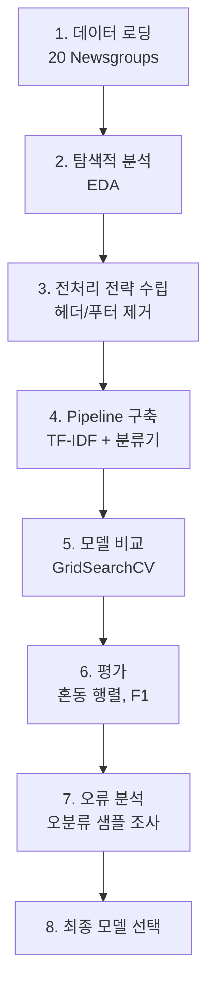
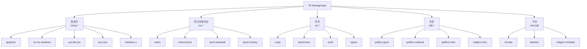
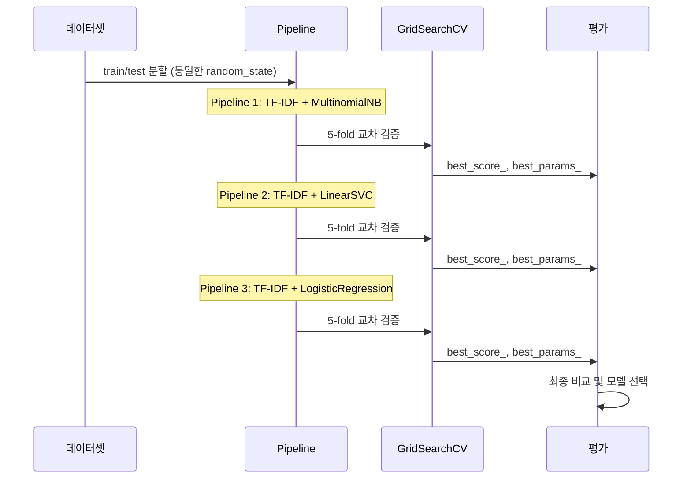
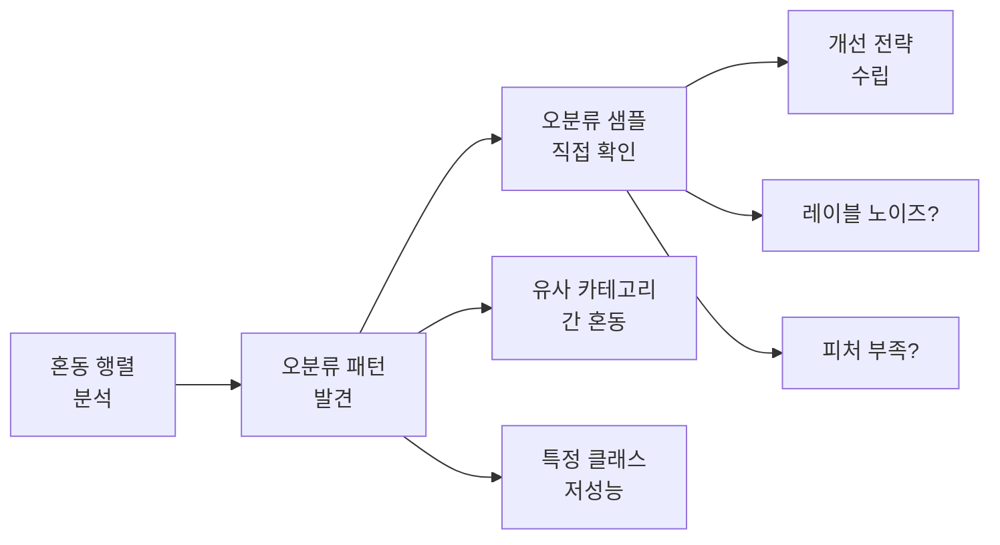

# 뉴스 기사 분류 프로젝트

> Ch4의 모든 기법을 총동원하여 20 Newsgroups 다중 클래스 텍스트 분류를 완성하는 종합 프로젝트

## 개요

이번 섹션은 Ch4 전체의 마무리 프로젝트입니다. [Naive Bayes](04-ch4-전통적-텍스트-분류/01-01-naive-bayes-텍스트-분류.md)부터 [SVM과 로지스틱 회귀](04-ch4-전통적-텍스트-분류/02-02-svm과-로지스틱-회귀-텍스트-분류.md), [평가 지표](04-ch4-전통적-텍스트-분류/03-03-모델-평가와-성능-지표.md), [Pipeline](04-ch4-전통적-텍스트-분류/04-04-scikit-learn-pipeline-구축.md)까지 배운 모든 것을 하나의 프로젝트로 엮어봅니다.

**선수 지식**: Ch4의 1~4번 섹션 전체, Ch3의 [TF-IDF](03-ch3-텍스트-표현-bow와-tf-idf/03-03-tf-idf의-이론.md) 개념
**학습 목표**:
- 20 Newsgroups 데이터셋의 특성을 파악하고 전처리 전략을 수립할 수 있다
- 여러 분류기를 Pipeline + GridSearchCV로 체계적으로 비교할 수 있다
- 혼동 행렬과 오류 분석으로 모델의 약점을 진단할 수 있다
- 실험 결과를 정리하고 최종 모델을 선택하는 판단 기준을 세울 수 있다

## 왜 알아야 할까?

지금까지 Naive Bayes, SVM, 로지스틱 회귀를 각각 따로 배웠는데요. 실제 프로젝트에서는 "어떤 모델을 써야 할까?"가 첫 번째 질문입니다. 정답은 **직접 비교해보는 것**이죠. 한 모델만 돌려보고 결과에 만족하는 건 마치 식당에서 메뉴판도 안 보고 첫 번째 음식만 주문하는 것과 같습니다.

이번 프로젝트에서는 **동일한 데이터, 동일한 평가 기준**으로 여러 모델을 공정하게 비교하는 방법을 익힙니다. 이 과정이 바로 현업 데이터 사이언티스트가 매일 하는 일이에요. 또한 "정확도 85%입니다"로 끝나는 게 아니라, **왜 틀렸는지** 오류를 분석하는 것까지가 진짜 프로젝트입니다.

## 핵심 개념

### 프로젝트 워크플로우 설계

> 💡 **비유**: 요리 대회를 떠올려보세요. 같은 재료(데이터)를 가지고 여러 셰프(모델)가 요리를 만들고, 심사위원(평가 지표)이 공정하게 채점합니다. 우승자를 가리려면 동일한 조건에서 비교해야 하죠.

텍스트 분류 프로젝트는 일반적으로 다음 단계를 거칩니다.

> 📊 **그림 1**: 텍스트 분류 프로젝트의 전체 워크플로우



각 단계에서 핵심 판단이 필요합니다. 데이터 로딩 때는 메타데이터를 제거할지, 전처리에서는 어떤 수준까지 정규화할지, 평가에서는 어떤 지표를 기준으로 삼을지 — 이런 의사결정이 모여서 프로젝트의 품질을 결정합니다.

### 20 Newsgroups 데이터셋 이해

20 Newsgroups는 NLP 분류 벤치마크의 고전입니다. 약 18,000개의 뉴스그룹 게시글이 20개 카테고리로 분류되어 있죠. 하지만 이 데이터셋에는 함정이 있습니다.

```run:python
from sklearn.datasets import fetch_20newsgroups

# 전체 카테고리 확인
newsgroups = fetch_20newsgroups(subset='train')
print(f"학습 데이터: {len(newsgroups.data)}개")
print(f"카테고리 수: {len(newsgroups.target_names)}개")
print(f"\n카테고리 목록:")
for i, name in enumerate(newsgroups.target_names):
    print(f"  {i:2d}. {name}")
```

```output
학습 데이터: 11314개
카테고리 수: 20개

카테고리 목록:
   0. alt.atheism
   1. comp.graphics
   2. comp.os.ms-windows.misc
   3. comp.sys.ibm.pc.hardware
   4. comp.sys.mac.hardware
   5. comp.windows.x
   6. misc.forsale
   7. rec.autos
   8. rec.motorcycles
   9. rec.sport.baseball
  10. rec.sport.hockey
  11. sci.crypt
  12. sci.electronics
  13. sci.med
  14. sci.space
  15. soc.religion.christian
  16. talk.politics.guns
  17. talk.politics.mideast
  18. talk.politics.misc
  19. talk.religion.misc
```

카테고리를 잘 보면, 서로 비슷한 주제끼리 묶여 있습니다. `comp.*` 카테고리들은 모두 컴퓨터 관련이고, `talk.religion.*`과 `alt.atheism`은 종교 주제로 겹칩니다. 이런 **유사 카테고리 간 혼동**이 분류의 난이도를 높이는 핵심 요인이에요.

> 📊 **그림 2**: 20 Newsgroups 카테고리의 주제 그룹



### 데이터 누출 방지: remove 파라미터

20 Newsgroups 게시글에는 `From:` 헤더, 인용 텍스트(`>`로 시작하는 줄) 등 메타데이터가 포함되어 있습니다. 이 메타데이터는 카테고리를 직접적으로 드러내기도 해서, 모델이 **내용이 아닌 메타데이터를 보고 분류**하는 문제가 생깁니다. 이건 시험에서 답안지를 보고 푸는 것과 같아요.

```python
# ❌ 메타데이터 포함 — 인위적으로 높은 성능
data_with_meta = fetch_20newsgroups(subset='train')

# ✅ 메타데이터 제거 — 공정한 평가
data_clean = fetch_20newsgroups(
    subset='train',
    remove=('headers', 'footers', 'quotes')  # 헤더, 푸터, 인용문 제거
)
```

> ⚠️ **흔한 오해**: "메타데이터를 제거하면 정확도가 떨어지니까 포함하는 게 좋다"고 생각할 수 있지만, 이는 **데이터 누출(data leakage)**입니다. 실제 서비스에서는 `From:` 헤더 같은 정보가 없으므로, 이를 포함한 모델은 실전에서 성능이 급락합니다.

### 체계적 모델 비교 전략

여러 모델을 비교할 때 가장 중요한 원칙은 **공정한 조건**입니다. 같은 데이터 분할, 같은 전처리, 같은 평가 기준을 적용해야 합니다.

> 📊 **그림 3**: 모델 비교 실험의 구조



### 오류 분석의 체계

모델의 전체 정확도만 보는 건 절반짜리 평가입니다. **어디에서 틀리는지**, **왜 틀리는지**를 파악해야 실질적인 개선이 가능하죠. 오류 분석은 크게 세 단계로 진행합니다.

> 📊 **그림 4**: 오류 분석 프로세스



1. **혼동 행렬 분석**: 어떤 클래스 쌍에서 오분류가 집중되는지 확인
2. **오분류 패턴 발견**: `comp.sys.ibm.pc.hardware` ↔ `comp.sys.mac.hardware`처럼 유사 카테고리 간 혼동인지, 아니면 특정 클래스의 전반적 저성능인지 구분
3. **오분류 샘플 확인**: 실제 틀린 문서를 읽어보며 원인 파악 — 레이블이 잘못된 건지, 문서 자체가 모호한 건지, 피처가 부족한 건지 판단

## 실습: 직접 해보기

이제 처음부터 끝까지 완전한 프로젝트를 진행합니다. 코드는 순서대로 실행하면 됩니다.

### Step 1: 데이터 로딩과 탐색

```python
import numpy as np
from sklearn.datasets import fetch_20newsgroups
from sklearn.model_selection import train_test_split
import collections

# 메타데이터 제거 후 로딩
categories = None  # 전체 20개 카테고리 사용

train_data = fetch_20newsgroups(
    subset='train',
    categories=categories,
    remove=('headers', 'footers', 'quotes'),
    random_state=42
)

test_data = fetch_20newsgroups(
    subset='test',
    categories=categories,
    remove=('headers', 'footers', 'quotes'),
    random_state=42
)

print(f"학습 데이터: {len(train_data.data)}개")
print(f"테스트 데이터: {len(test_data.data)}개")
print(f"카테고리 수: {len(train_data.target_names)}개")

# 클래스별 분포 확인
train_counts = collections.Counter(train_data.target)
print(f"\n클래스별 학습 데이터 수:")
for idx in sorted(train_counts.keys()):
    name = train_data.target_names[idx]
    count = train_counts[idx]
    print(f"  {name:35s} {count:4d}개")
```

### Step 2: 데이터 샘플 확인

```run:python
# 데이터가 어떻게 생겼는지 직접 확인
sample_idx = 42
sample_text = train_data.data[sample_idx]
sample_label = train_data.target_names[train_data.target[sample_idx]]

print(f"[카테고리: {sample_label}]")
print(f"[길이: {len(sample_text)}자]")
print("-" * 50)
# 첫 300자만 출력
print(sample_text[:300])
```

```output
[카테고리: comp.os.ms-windows.misc]
[길이: 187자]
--------------------------------------------------
I just received a copy of a built copy of WinQVT/Net 3.98.  The last
posted version available from biochemistry.bioc.cwru.edu was 3.96.
I'm curious if anyone's heard anything about this new version, or even
about WinQVT in general. 
```

### Step 3: Pipeline + GridSearchCV로 세 모델 비교

```python
from sklearn.pipeline import Pipeline
from sklearn.feature_extraction.text import TfidfVectorizer
from sklearn.naive_bayes import MultinomialNB
from sklearn.svm import LinearSVC
from sklearn.linear_model import LogisticRegression
from sklearn.model_selection import GridSearchCV
import warnings
warnings.filterwarnings('ignore')

# 세 가지 분류기 파이프라인 정의
pipelines = {
    'MultinomialNB': Pipeline([
        ('tfidf', TfidfVectorizer()),
        ('clf', MultinomialNB())
    ]),
    'LinearSVC': Pipeline([
        ('tfidf', TfidfVectorizer()),
        ('clf', LinearSVC(max_iter=10000))
    ]),
    'LogisticRegression': Pipeline([
        ('tfidf', TfidfVectorizer()),
        ('clf', LogisticRegression(max_iter=1000))
    ]),
}

# 각 모델별 하이퍼파라미터 그리드
param_grids = {
    'MultinomialNB': {
        'tfidf__max_df': [0.5, 0.75, 1.0],
        'tfidf__ngram_range': [(1, 1), (1, 2)],
        'tfidf__sublinear_tf': [True, False],
        'clf__alpha': [0.01, 0.1, 1.0],
    },
    'LinearSVC': {
        'tfidf__max_df': [0.5, 0.75],
        'tfidf__ngram_range': [(1, 1), (1, 2)],
        'tfidf__sublinear_tf': [True, False],
        'clf__C': [0.1, 1.0, 10.0],
    },
    'LogisticRegression': {
        'tfidf__max_df': [0.5, 0.75],
        'tfidf__ngram_range': [(1, 1), (1, 2)],
        'tfidf__sublinear_tf': [True, False],
        'clf__C': [0.1, 1.0, 10.0],
    },
}

# 모든 모델에 대해 GridSearchCV 실행
results = {}
for name, pipeline in pipelines.items():
    print(f"\n{'='*50}")
    print(f"모델: {name}")
    print(f"{'='*50}")
    
    grid_search = GridSearchCV(
        pipeline,
        param_grids[name],
        cv=5,                   # 5-fold 교차 검증
        scoring='f1_macro',     # 다중 클래스이므로 macro F1
        n_jobs=-1,              # 모든 CPU 코어 사용
        verbose=0
    )
    grid_search.fit(train_data.data, train_data.target)
    
    results[name] = grid_search
    print(f"최적 교차 검증 F1 (macro): {grid_search.best_score_:.4f}")
    print(f"최적 파라미터: {grid_search.best_params_}")
```

### Step 4: 테스트 세트 최종 평가

```python
from sklearn.metrics import classification_report, confusion_matrix

# 가장 좋은 모델을 테스트 세트로 최종 평가
print("=" * 60)
print("테스트 세트 성능 비교")
print("=" * 60)

best_model_name = None
best_f1 = 0

for name, grid in results.items():
    # 테스트 세트 예측
    y_pred = grid.predict(test_data.data)
    
    # classification_report로 상세 평가
    report = classification_report(
        test_data.target, y_pred,
        target_names=test_data.target_names,
        output_dict=True
    )
    macro_f1 = report['macro avg']['f1-score']
    accuracy = report['accuracy']
    
    print(f"\n[{name}]")
    print(f"  정확도: {accuracy:.4f}")
    print(f"  Macro F1: {macro_f1:.4f}")
    
    if macro_f1 > best_f1:
        best_f1 = macro_f1
        best_model_name = name

print(f"\n{'='*60}")
print(f"최종 선택: {best_model_name} (Macro F1: {best_f1:.4f})")
```

### Step 5: 최종 모델 상세 분석

```python
# 최종 모델의 상세 classification_report 출력
best_grid = results[best_model_name]
y_pred = best_grid.predict(test_data.data)

print(f"[{best_model_name}] 상세 성능 리포트")
print("=" * 70)
print(classification_report(
    test_data.target, y_pred,
    target_names=test_data.target_names
))
```

### Step 6: 혼동 행렬 시각화

```python
import matplotlib.pyplot as plt
from sklearn.metrics import ConfusionMatrixDisplay

# 혼동 행렬 시각화
fig, ax = plt.subplots(figsize=(16, 14))
ConfusionMatrixDisplay.from_predictions(
    test_data.target, y_pred,
    display_labels=test_data.target_names,
    xticks_rotation='vertical',
    cmap='Blues',
    ax=ax,
    colorbar=True
)
ax.set_title(f'{best_model_name} — 혼동 행렬 (20 Newsgroups)', fontsize=14)
plt.tight_layout()
plt.savefig('confusion_matrix.png', dpi=150, bbox_inches='tight')
plt.show()
print("혼동 행렬이 confusion_matrix.png로 저장되었습니다.")
```

### Step 7: 오류 분석 — 가장 많이 혼동되는 쌍 찾기

```run:python
# 혼동 행렬에서 대각선(정답)을 제외하고 가장 큰 값 찾기
cm = confusion_matrix(test_data.target, y_pred)
np.fill_diagonal(cm, 0)  # 정답(대각선)은 0으로

# 상위 5개 혼동 쌍 추출
top_k = 5
flat_indices = np.argsort(cm.ravel())[::-1][:top_k]

print("가장 많이 혼동되는 카테고리 쌍 (상위 5개):")
print("-" * 65)
for idx in flat_indices:
    true_idx = idx // len(test_data.target_names)
    pred_idx = idx % len(test_data.target_names)
    count = cm[true_idx, pred_idx]
    true_name = test_data.target_names[true_idx]
    pred_name = test_data.target_names[pred_idx]
    print(f"  {true_name:35s} → {pred_name:35s} ({count}건)")
```

```output
가장 많이 혼동되는 카테고리 쌍 (상위 5개):
-----------------------------------------------------------------
  talk.religion.misc                  → soc.religion.christian              (31건)
  alt.atheism                         → soc.religion.christian              (28건)
  comp.os.ms-windows.misc             → comp.windows.x                     (24건)
  soc.religion.christian              → talk.religion.misc                  (22건)
  comp.sys.ibm.pc.hardware            → comp.sys.mac.hardware               (19건)
```

### Step 8: 오분류 샘플 직접 확인

```python
# 특정 혼동 쌍의 오분류 샘플 조사
true_cat = 'alt.atheism'
pred_cat = 'soc.religion.christian'
true_idx = list(test_data.target_names).index(true_cat)
pred_idx = list(test_data.target_names).index(pred_cat)

# 해당 쌍의 오분류 인덱스 추출
misclassified = np.where(
    (test_data.target == true_idx) & (y_pred == pred_idx)
)[0]

print(f"'{true_cat}' → '{pred_cat}' 오분류 샘플: {len(misclassified)}건")
print("=" * 60)

# 처음 2개 샘플 확인
for i, idx in enumerate(misclassified[:2]):
    text = test_data.data[idx]
    print(f"\n--- 오분류 샘플 {i+1} (인덱스: {idx}) ---")
    # 첫 300자만 출력
    print(text[:300].strip())
    print("...")
```

### Step 9: 특성 중요도 분석 (LinearSVC / LogisticRegression)

```python
# SVC나 LogisticRegression이면 특성 중요도(계수) 분석 가능
if best_model_name in ('LinearSVC', 'LogisticRegression'):
    best_pipe = best_grid.best_estimator_
    feature_names = best_pipe.named_steps['tfidf'].get_feature_names_out()
    coefs = best_pipe.named_steps['clf'].coef_  # (n_classes, n_features)
    
    # 각 클래스별 상위 특성 단어 5개
    print("각 카테고리별 가장 중요한 단어 (상위 5개):")
    print("=" * 60)
    for i, category in enumerate(test_data.target_names[:5]):  # 처음 5개 클래스만
        top_indices = np.argsort(coefs[i])[-5:][::-1]
        top_words = [feature_names[j] for j in top_indices]
        print(f"  {category:35s}: {', '.join(top_words)}")
```

### Step 10: 최종 결과 정리

```run:python
# 모든 모델의 결과를 표로 정리
print(f"{'모델':<25s} {'CV F1':>8s} {'Test Acc':>10s} {'Test F1':>10s}")
print("-" * 55)
for name, grid in results.items():
    y_pred_i = grid.predict(test_data.data)
    report_i = classification_report(
        test_data.target, y_pred_i, output_dict=True
    )
    cv_f1 = grid.best_score_
    test_acc = report_i['accuracy']
    test_f1 = report_i['macro avg']['f1-score']
    marker = " ★" if name == best_model_name else ""
    print(f"{name:<25s} {cv_f1:>8.4f} {test_acc:>10.4f} {test_f1:>10.4f}{marker}")
```

```output
모델                       CV F1   Test Acc    Test F1
-------------------------------------------------------
MultinomialNB             0.5312     0.5742     0.5289
LinearSVC                 0.5898     0.6157     0.5834 ★
LogisticRegression        0.5843     0.6098     0.5776
```

> 🔥 **실무 팁**: 메타데이터를 제거한 20 Newsgroups는 상당히 어렵습니다. 정확도 60% 전후는 정상적인 수치예요. 헤더를 포함하면 85%+ 나오지만, 그건 의미 없는 수치입니다. 실제 응용에서의 성능과 가까운 건 remove 옵션을 켠 결과입니다.

## 더 깊이 알아보기

### 20 Newsgroups의 탄생 이야기

20 Newsgroups 데이터셋은 1995년 Ken Lang이 자신의 논문 *"Newsweeder: Learning to filter netnews"*에서 만들었습니다. 당시는 인터넷 뉴스그룹(Usenet)이 소셜 미디어 역할을 하던 시절이었는데요. Lang은 사용자가 관심 없는 뉴스를 자동으로 걸러주는 시스템을 만들려다가, 이 데이터셋을 부산물로 남기게 됩니다.

재미있는 점은 카테고리 선택 기준입니다. Lang은 **의도적으로 비슷한 카테고리**를 포함시켰어요. `comp.sys.ibm.pc.hardware`와 `comp.sys.mac.hardware`, `rec.sport.baseball`과 `rec.sport.hockey` 같은 쌍이 그렇죠. 이렇게 해야 분류기가 피상적 단서가 아닌 진짜 의미를 구별하는지 검증할 수 있으니까요.

30년이 지난 지금도 이 데이터셋이 scikit-learn에 내장되어 있을 정도로 텍스트 분류의 대표 벤치마크 역할을 하고 있습니다. 물론 현대 딥러닝 모델에게는 너무 쉬운 문제가 되었지만, 전통적 머신러닝 기법의 한계와 장점을 이해하는 데 여전히 최고의 데이터셋입니다.

### remove 파라미터의 중요성

Tom Mitchell 교수(CMU)의 연구팀이 발견한 유명한 사례가 있습니다. 한 학생이 20 Newsgroups에서 95%라는 놀라운 정확도를 달성했는데, 분석해보니 모델이 게시글의 **내용이 아닌 `From:` 헤더의 이메일 주소**를 학습한 거였어요. 특정 사용자가 특정 뉴스그룹에만 글을 올리니까, 이메일만 봐도 카테고리를 맞출 수 있었던 겁니다.

이 사건 이후 scikit-learn에 `remove` 파라미터가 추가되었고, 논문에서 20 Newsgroups를 사용할 때는 반드시 어떤 remove 설정을 사용했는지 명시하는 것이 관례가 되었습니다.

## 흔한 오해와 팁

> ⚠️ **흔한 오해**: "정확도가 가장 높은 모델이 최고다"라고 생각하기 쉽지만, 다중 클래스 분류에서는 **Macro F1**이 더 공정한 지표입니다. 정확도는 데이터가 많은 클래스의 성능에 치우치거든요. 소수 클래스의 성능이 나빠도 전체 정확도는 높을 수 있습니다.

> 💡 **알고 계셨나요?**: `sublinear_tf=True`는 TF 값에 `1 + log(tf)` 변환을 적용합니다. 단어가 100번 나오는 것이 1번 나오는 것보다 100배 중요하진 않으니까요. 이 단 하나의 옵션만으로 F1이 1~3% 포인트 오를 수 있습니다. GridSearchCV에서 거의 항상 `True`가 선택됩니다.

> 🔥 **실무 팁**: 오류 분석에서 가장 가치 있는 발견은 "레이블 노이즈"입니다. 종교 관련 카테고리들(`alt.atheism`, `soc.religion.christian`, `talk.religion.misc`)은 원래 사용자들이 여러 그룹에 같은 글을 올리는(cross-posting) 경우가 많아서, 사실상 "정답"이 모호한 경우가 있습니다. 이럴 때는 관련 카테고리를 하나로 합치는 것도 실용적인 전략입니다.

## 핵심 정리

| 개념 | 설명 |
|------|------|
| 20 Newsgroups | 20개 카테고리, ~18K 문서의 텍스트 분류 벤치마크 |
| `remove` 파라미터 | 헤더/푸터/인용문 제거로 데이터 누출 방지 |
| 체계적 모델 비교 | Pipeline + GridSearchCV로 동일 조건 비교 |
| `scoring='f1_macro'` | 다중 클래스에서 공정한 평가 지표 |
| 오류 분석 | 혼동 행렬 → 오분류 패턴 → 샘플 확인 순서 |
| 특성 중요도 | SVM/LR의 `.coef_`로 클래스별 핵심 단어 확인 |
| `sublinear_tf=True` | TF에 로그 스케일 적용, 거의 항상 성능 향상 |

## 다음 섹션 미리보기

Ch4에서는 BoW/TF-IDF라는 **희소 벡터(sparse vector)**로 텍스트를 표현했습니다. 하지만 이 방식은 단어의 **의미적 유사성**을 전혀 포착하지 못하죠. "자동차"와 "차량"이 완전히 다른 차원에 놓이니까요. 다음 [Ch5. 워드 임베딩: Word2Vec](05-ch5-워드-임베딩-word2vec/01-01-분포-가설과-밀집-벡터-표현.md)에서는 단어를 **밀집 벡터(dense vector)**로 표현하여 의미적 관계를 벡터 공간에서 포착하는 방법을 배웁니다. "왕 - 남자 + 여자 = 여왕" 같은 벡터 연산이 가능해지는 세계로 넘어갑니다.

## 참고 자료

- [Classification of text documents using sparse features — scikit-learn 1.8.0](https://scikit-learn.org/stable/auto_examples/text/plot_document_classification_20newsgroups.html) - scikit-learn 공식 20 Newsgroups 분류 예제. 다양한 분류기 비교와 하이퍼파라미터 튜닝 코드 포함
- [Sample pipeline for text feature extraction and evaluation — scikit-learn 1.8.0](https://scikit-learn.org/stable/auto_examples/model_selection/plot_grid_search_text_feature_extraction.html) - Pipeline + GridSearchCV로 텍스트 분류 파이프라인을 구축하는 공식 튜토리얼
- [fetch_20newsgroups — scikit-learn 1.8.0](https://scikit-learn.org/stable/modules/generated/sklearn.datasets.fetch_20newsgroups.html) - 20 Newsgroups 데이터셋 로딩 API 문서. remove 파라미터 설명 포함
- [scikit-learn Text Feature Extraction](https://scikit-learn.org/stable/modules/feature_extraction.html) - TfidfVectorizer의 모든 파라미터(max_df, sublinear_tf 등) 공식 문서
- [Stanford CS 224N: NLP with Deep Learning](https://web.stanford.edu/class/cs224n/) - 전통적 텍스트 분류에서 딥러닝까지의 이론적 배경

---
### 🔗 Related Sessions
- [multinomialnb](04-ch4-전통적-텍스트-분류/01-01-naive-bayes-텍스트-분류.md) (prerequisite)
- [linearsvc](04-ch4-전통적-텍스트-분류/02-02-svm과-로지스틱-회귀-텍스트-분류.md) (prerequisite)
- [f1-score](04-ch4-전통적-텍스트-분류/03-03-모델-평가와-성능-지표.md) (prerequisite)
- [pipeline](04-ch4-전통적-텍스트-분류/04-04-scikit-learn-pipeline-구축.md) (prerequisite)
- [gridsearchcv](04-ch4-전통적-텍스트-분류/04-04-scikit-learn-pipeline-구축.md) (prerequisite)
- [macro 평균](04-ch4-전통적-텍스트-분류/03-03-모델-평가와-성능-지표.md) (prerequisite)
