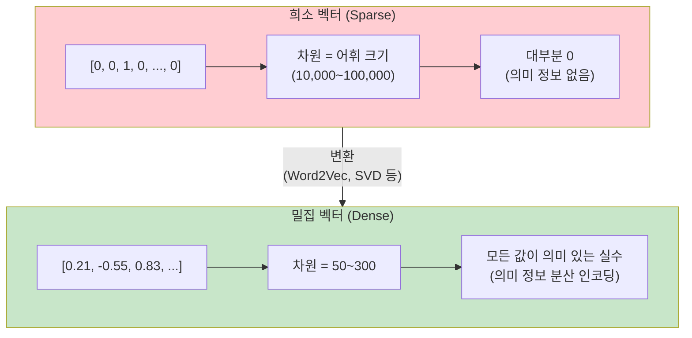
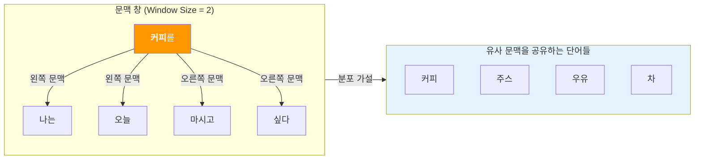
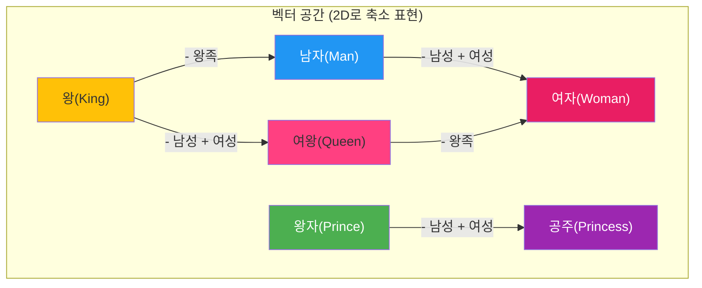
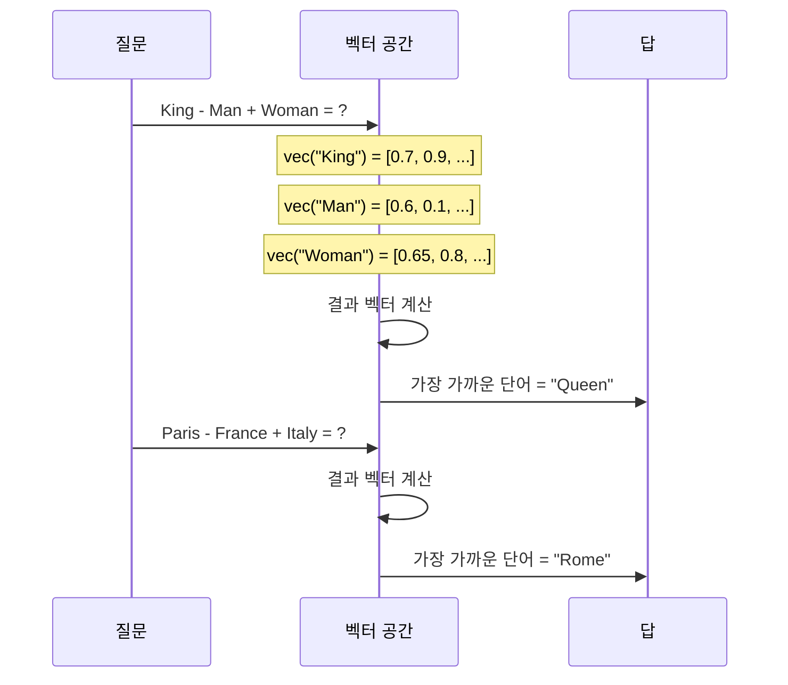
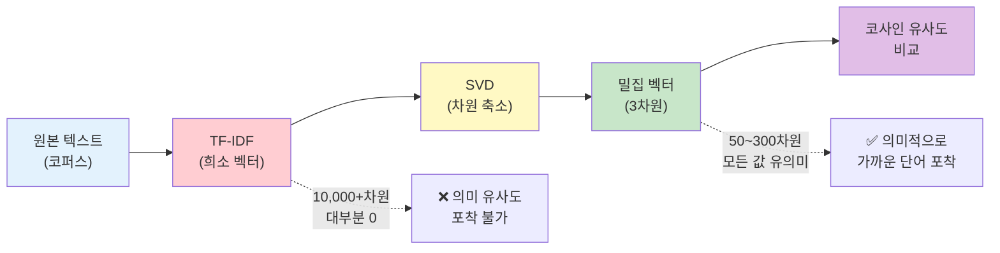

# 분포 가설과 밀집 벡터 표현

> 단어의 의미는 어떻게 숫자로 표현할 수 있을까? 희소 벡터의 한계를 넘어 밀집 벡터의 세계로 들어갑니다.

## 개요

이 섹션에서는 단어를 벡터로 표현하는 방법의 근본적인 전환점을 다룹니다. 앞서 배운 BoW와 TF-IDF 방식의 한계를 짚고, **분포 가설(Distributional Hypothesis)**이라는 언어학 원리가 어떻게 현대 워드 임베딩의 토대가 되었는지 살펴봅니다.

**선수 지식**: [BoW 모델](03-ch3-텍스트-표현-bow와-tf-idf/01-01-bag-of-words-모델.md)과 [TF-IDF 이론](03-ch3-텍스트-표현-bow와-tf-idf/03-03-tf-idf의-이론.md)에서 배운 희소 벡터 표현 방식

**학습 목표**:
- 희소 벡터(BoW, TF-IDF)의 구조적 한계 3가지를 설명할 수 있다
- 분포 가설의 핵심 원리를 이해하고, 단어 의미가 맥락에서 나온다는 개념을 설명할 수 있다
- 밀집 벡터(Dense Vector)가 희소 벡터 대비 갖는 장점을 코드로 확인할 수 있다

## 왜 알아야 할까?

여러분이 "사과"라는 단어를 떠올릴 때, 머릿속에서 무슨 일이 벌어지나요? "빨갛다", "달다", "과일", "아이폰" 같은 **관련 단어들**이 자동으로 연상되죠. 우리 뇌는 단어를 고립된 기호가 아니라, **다른 단어들과의 관계망** 속에서 이해합니다.

그런데 앞서 배운 BoW나 TF-IDF는 이런 관계를 전혀 포착하지 못합니다. "강아지"와 "개"가 의미적으로 거의 같은 단어인데도, 이 방식으로는 완전히 다른 차원에 놓이거든요. 현대 NLP의 거의 모든 모델 — BERT, GPT, 그리고 ChatGPT까지 — 은 단어를 **밀집 벡터**로 표현하는 데서 출발합니다. 이 섹션에서 배울 개념은 그 출발점입니다.

## 핵심 개념

### 개념 1: 희소 벡터의 한계 — 왜 BoW와 TF-IDF로는 부족할까?

> 💡 **비유**: BoW와 TF-IDF는 마치 **도서관의 서가 번호**와 같습니다. 책마다 고유한 번호가 있지만, 번호만 보고는 "파이썬 프로그래밍"과 "자바 프로그래밍"이 비슷한 주제인지 알 수 없죠. 단지 다른 번호일 뿐입니다.

[TF-IDF 실습](03-ch3-텍스트-표현-bow와-tf-idf/04-04-tfidfvectorizer-실습.md)에서 다뤘던 벡터를 떠올려보세요. 어휘 사전에 10,000개의 단어가 있다면, 각 문서는 10,000차원의 벡터가 됩니다. 이 벡터의 대부분은 0이에요 — 이것이 바로 **희소 벡터(Sparse Vector)**입니다.

희소 벡터에는 세 가지 근본적인 한계가 있습니다:

**1) 차원의 저주 (Curse of Dimensionality)**

어휘가 50,000개면 벡터도 50,000차원입니다. 대부분이 0인 이런 고차원 공간에서는 거리 계산이 무의미해지고, 머신러닝 모델의 성능도 떨어집니다.

**2) 의미적 유사도 부재**

"강아지"와 "개"는 의미가 거의 같지만, 원-핫 인코딩에서 두 벡터의 코사인 유사도는 **정확히 0**입니다. 어떤 의미적 관계도 포착하지 못하죠.

**3) 일반화 불가능**

학습 데이터에 "맛있는 파스타"는 있지만 "맛있는 리조또"는 없다면? 희소 벡터 모델은 "파스타"와 "리조또"가 비슷한 맥락에 쓰인다는 걸 전혀 알지 못합니다.

> 📊 **그림 1**: 희소 벡터 vs 밀집 벡터 비교



코드로 직접 확인해봅시다:

```run:python
from sklearn.feature_extraction.text import CountVectorizer
import numpy as np

# 간단한 문서 3개
docs = ["강아지가 공원에서 뛴다", "개가 잔디밭에서 달린다", "고양이가 소파에서 잔다"]

# BoW 희소 벡터 생성
vectorizer = CountVectorizer()
sparse_vectors = vectorizer.fit_transform(docs).toarray()

print("=== 희소 벡터 (BoW) ===")
print(f"어휘 사전: {vectorizer.get_feature_names_out()}")
print(f"벡터 차원: {sparse_vectors.shape[1]}")
print(f"\n'강아지가 공원에서 뛴다': {sparse_vectors[0]}")
print(f"'개가 잔디밭에서 달린다':   {sparse_vectors[1]}")

# 코사인 유사도 계산
from numpy.linalg import norm
cos_sim_01 = np.dot(sparse_vectors[0], sparse_vectors[1]) / (norm(sparse_vectors[0]) * norm(sparse_vectors[1]))
cos_sim_02 = np.dot(sparse_vectors[0], sparse_vectors[2]) / (norm(sparse_vectors[0]) * norm(sparse_vectors[2]))

print(f"\n'강아지...' vs '개...': 유사도 = {cos_sim_01:.4f}")
print(f"'강아지...' vs '고양이...': 유사도 = {cos_sim_02:.4f}")
print("\n→ 의미적으로 비슷한 문장도 유사도가 0!")
```

```output
=== 희소 벡터 (BoW) ===
어휘 사전: ['강아지가' '개가' '고양이가' '공원에서' '달린다' '뛴다' '소파에서' '잔다' '잔디밭에서']
벡터 차원: 9

'강아지가 공원에서 뛴다': [1 0 0 1 0 1 0 0 0]
'개가 잔디밭에서 달린다':   [0 1 0 0 1 0 0 1 0]

'강아지...' vs '개...': 유사도 = 0.0000
'강아지...' vs '고양이...': 유사도 = 0.0000

→ 의미적으로 비슷한 문장도 유사도가 0!
```

놀랍죠? "강아지가 공원에서 뛴다"와 "개가 잔디밭에서 달린다"는 거의 같은 의미인데, 코사인 유사도가 **0**입니다. 단어가 하나도 겹치지 않기 때문이에요. 이것이 희소 벡터의 근본적 한계입니다.

### 개념 2: 분포 가설 — "단어는 주변 단어로 정의된다"

> 💡 **비유**: 친구를 알고 싶다면, 그 친구가 **누구와 어울리는지** 보면 됩니다. 축구 동아리 친구들과 어울리면 운동을 좋아할 확률이 높고, 독서 모임 친구들과 어울리면 책을 좋아할 확률이 높죠. 단어도 마찬가지입니다 — **어떤 단어와 함께 등장하는지**가 곧 그 단어의 의미입니다.

이것이 바로 **분포 가설(Distributional Hypothesis)**의 핵심입니다. 1957년 영국 언어학자 **존 루퍼트 퍼스(J.R. Firth)**는 이렇게 말했습니다:

> *"You shall know a word by the company it keeps."*
> (단어는 그것이 동반하는 단어들에 의해 알 수 있다.)

예를 들어볼까요?

- "오늘 ___를 마셨다" → 커피, 주스, 우유 (음료!)
- "___가 나무 위에 앉아 있다" → 새, 고양이, 다람쥐 (동물!)
- "___를 신고 나갔다" → 운동화, 구두, 슬리퍼 (신발!)

빈칸에 들어갈 수 있는 단어들은 서로 **의미적으로 유사**하다는 걸 알 수 있죠. 비슷한 맥락에 등장하는 단어들은 비슷한 의미를 가진다 — 이것이 분포 가설입니다.

분포 가설을 실제 알고리즘으로 구현하려면, "주변"의 범위를 정해야 합니다. 이때 사용하는 것이 **문맥 창(Context Window)**이라는 개념인데요, 대상 단어를 중심으로 좌우 몇 개의 단어까지를 "문맥"으로 볼 것인지를 정하는 파라미터입니다. 예를 들어 문맥 창 크기가 2라면, 대상 단어 좌우 각 2개씩 총 4개의 단어가 문맥이 됩니다.

> 📊 **그림 2**: 분포 가설의 작동 원리 — 문맥 창(Context Window)



문맥 창의 크기는 학습 결과에 큰 영향을 미칩니다. 작은 창(2~5)은 문법적으로 가까운 관계를, 큰 창(5~10)은 주제적으로 관련된 관계를 더 잘 포착하는 경향이 있어요. 문맥 창과 슬라이딩 윈도우가 실제 Word2Vec 학습에서 어떻게 작동하는지는 다음 섹션 [Word2Vec: CBOW와 Skip-gram](05-ch5-워드-임베딩-word2vec/02-02-word2vec-cbow와-skip-gram.md)에서 본격적으로 다루겠습니다.

이 원리를 확장하면, 대량의 텍스트에서 각 단어의 **주변 문맥 패턴**을 통계적으로 수집할 수 있습니다. 비슷한 문맥 패턴을 가진 단어들은 벡터 공간에서도 가까이 위치하게 되는 거죠.

```run:python
# 분포 가설을 간단한 코드로 체험해보기
corpus = [
    "나는 오늘 커피를 마셨다",
    "나는 어제 주스를 마셨다",
    "나는 오늘 우유를 마셨다",
    "그는 오늘 커피를 샀다",
    "강아지가 공원에서 뛰었다",
    "고양이가 공원에서 놀았다",
    "강아지가 잔디밭에서 뛰었다",
]

# 각 단어의 주변 단어(문맥) 수집 — 간단한 윈도우 기반
from collections import defaultdict

def get_context(corpus, window=1):
    """각 단어 주변에 어떤 단어가 등장하는지 수집"""
    context_map = defaultdict(list)
    for sentence in corpus:
        words = sentence.split()
        for i, word in enumerate(words):
            # 왼쪽/오른쪽 윈도우 내의 단어를 문맥으로 수집
            for j in range(max(0, i - window), min(len(words), i + window + 1)):
                if i != j:
                    context_map[word].append(words[j])
    return context_map

contexts = get_context(corpus, window=1)

# 음료 단어들의 문맥 비교
print("=== 분포 가설: 주변 단어로 의미 파악 ===\n")
for word in ["커피를", "주스를", "우유를"]:
    print(f"'{word}' 주변 단어: {contexts[word]}")

print()
for word in ["강아지가", "고양이가"]:
    print(f"'{word}' 주변 단어: {contexts[word]}")

print("\n→ 비슷한 맥락에 등장하는 단어 = 비슷한 의미!")
```

```output
=== 분포 가설: 주변 단어로 의미 파악 ===

'커피를' 주변 단어: ['오늘', '마셨다', '오늘', '샀다']
'주스를' 주변 단어: ['어제', '마셨다']
'우유를' 주변 단어: ['오늘', '마셨다']

'강아지가' 주변 단어: ['공원에서', '잔디밭에서']
'고양이가' 주변 단어: ['공원에서']

→ 비슷한 맥락에 등장하는 단어 = 비슷한 의미!
```

"커피를", "주스를", "우유를"은 모두 "마셨다"라는 문맥을 공유합니다. "강아지가"와 "고양이가"는 "공원에서"라는 문맥을 공유하죠. 이 패턴을 대규모 코퍼스에서 수집하면, 단어 간의 의미적 관계를 자동으로 학습할 수 있습니다.

### 개념 3: 밀집 벡터 — 모든 차원이 의미를 담다

> 💡 **비유**: 희소 벡터가 "이 사람은 서울시 강남구 역삼동 123번지에 산다"라는 **주소**라면, 밀집 벡터는 "이 사람은 외향적이고, 음악을 좋아하며, 아침형 인간이다"라는 **성격 프로필**입니다. 주소는 정확하지만 두 사람이 비슷한지 알 수 없고, 성격 프로필은 두 사람을 쉽게 비교할 수 있죠.

**밀집 벡터(Dense Vector)**는 적은 차원(보통 50~300차원)에 단어의 의미를 **압축**해서 담는 표현 방식입니다. 희소 벡터와 달리, **모든 차원의 값이 의미 있는 정보**를 담고 있어요.

> 📊 **그림 3**: 벡터 공간에서의 단어 관계



밀집 벡터의 핵심 장점을 정리하면:

| 특성 | 희소 벡터 (BoW/TF-IDF) | 밀집 벡터 (임베딩) |
|------|------------------------|--------------------|
| **차원** | 10,000~100,000 | 50~300 |
| **값** | 대부분 0 | 모든 값이 실수 |
| **유사도** | 단어 겹침에만 의존 | 의미적 유사도 포착 |
| **일반화** | 불가능 | 비슷한 맥락 → 비슷한 벡터 |
| **메모리** | 비효율적 | 효율적 |
| **학습** | 단순 카운팅 | 신경망 또는 행렬 분해 |

### 개념 4: 벡터 공간 모델 — 의미의 기하학

> 💡 **비유**: 지도에서 서울과 부산은 멀리 떨어져 있고, 서울과 인천은 가까이 있습니다. 마찬가지로 벡터 공간에서 "강아지"와 "개"는 가까이, "강아지"와 "자동차"는 멀리 위치합니다. 단어의 **의미적 거리**를 실제 **공간적 거리**로 표현하는 것이죠.

**벡터 공간 모델(Vector Space Model)**은 단어를 다차원 공간의 한 점으로 표현하고, 단어 간의 의미적 관계를 벡터 연산으로 다루는 프레임워크입니다.

가장 유명한 예시가 바로 **단어 유추(Word Analogy)**입니다:

$$\vec{King} - \vec{Man} + \vec{Woman} \approx \vec{Queen}$$

이게 의미하는 바는 놀랍습니다. "왕"에서 "남성성"을 빼고 "여성성"을 더하면 "여왕"이 된다는 거죠. 벡터 공간이 **성별**, **왕족 여부** 같은 의미적 축을 자동으로 학습한 겁니다.

> 📊 **그림 4**: 벡터 연산으로 단어 유추 수행



단어 유추가 작동하는 이유는, 밀집 벡터가 단순히 단어를 구분하는 것이 아니라 **의미의 구조**를 기하학적으로 인코딩하기 때문입니다. "수도"라는 관계, "성별"이라는 관계가 벡터 공간에서 일정한 방향으로 표현되는 거죠.

```python
import numpy as np

# 가상의 밀집 벡터 (실제로는 Word2Vec 등이 학습)
embeddings = {
    "왕":   np.array([0.7,  0.9, 0.3, -0.1]),
    "여왕": np.array([0.72, 0.88, 0.85, -0.05]),
    "남자": np.array([0.1,  0.15, 0.3,  0.8]),
    "여자": np.array([0.12, 0.13, 0.82, 0.75]),
}

# 벡터 유추: 왕 - 남자 + 여자 ≈ ?
result = embeddings["왕"] - embeddings["남자"] + embeddings["여자"]

# 가장 가까운 단어 찾기
from numpy.linalg import norm

print("=== 벡터 유추: 왕 - 남자 + 여자 = ? ===\n")
for word, vec in embeddings.items():
    similarity = np.dot(result, vec) / (norm(result) * norm(vec))
    print(f"  '{word}'와의 유사도: {similarity:.4f}")
```

## 실습: 직접 해보기

이제 실제 데이터로 희소 벡터와 밀집 벡터의 차이를 체험해봅시다. 아직 Word2Vec을 배우기 전이니, **SVD(특이값 분해)**를 사용해 간단한 밀집 벡터를 만들어보겠습니다.

```python
import numpy as np
from sklearn.feature_extraction.text import TfidfVectorizer
from sklearn.decomposition import TruncatedSVD
from sklearn.metrics.pairwise import cosine_similarity

# 한국어 코퍼스 (간단한 예시)
corpus = [
    "강아지가 공원에서 뛰어다닌다",
    "개가 잔디밭에서 달린다",
    "고양이가 소파에서 잠을 잔다",
    "고양이가 방석 위에서 눕는다",
    "자동차가 도로를 달린다",
    "버스가 도로에서 달린다",
    "학생이 교실에서 공부한다",
    "아이가 학교에서 공부한다",
    "강아지가 뛰어다니며 논다",
    "개가 공원에서 산책한다",
]

# 1단계: TF-IDF 희소 벡터
tfidf = TfidfVectorizer()
sparse_matrix = tfidf.fit_transform(corpus)

print("=== 1단계: TF-IDF 희소 벡터 ===")
print(f"벡터 차원: {sparse_matrix.shape[1]} (어휘 수)")
print(f"희소도(0의 비율): {1 - sparse_matrix.nnz / (sparse_matrix.shape[0] * sparse_matrix.shape[1]):.1%}")

# 희소 벡터 유사도
sparse_sim = cosine_similarity(sparse_matrix)
print(f"\n[희소 벡터 유사도]")
print(f"'강아지가 공원에서 뛰어다닌다' vs '개가 잔디밭에서 달린다': {sparse_sim[0][1]:.4f}")
print(f"'강아지가 공원에서 뛰어다닌다' vs '자동차가 도로를 달린다':  {sparse_sim[0][4]:.4f}")

# 2단계: SVD로 밀집 벡터 생성 (차원 축소)
svd = TruncatedSVD(n_components=3, random_state=42)  # 3차원으로 축소
dense_matrix = svd.fit_transform(sparse_matrix)

print(f"\n=== 2단계: SVD 밀집 벡터 ===")
print(f"벡터 차원: {dense_matrix.shape[1]} (3차원으로 축소!)")
print(f"설명된 분산: {svd.explained_variance_ratio_.sum():.1%}")

# 밀집 벡터 유사도
dense_sim = cosine_similarity(dense_matrix)
print(f"\n[밀집 벡터 유사도]")
print(f"'강아지가 공원에서 뛰어다닌다' vs '개가 잔디밭에서 달린다': {dense_sim[0][1]:.4f}")
print(f"'강아지가 공원에서 뛰어다닌다' vs '자동차가 도로를 달린다':  {dense_sim[0][4]:.4f}")

# 3단계: 유사도 비교 시각화
print(f"\n=== 유사도 비교 ===")
pairs = [
    (0, 1, "강아지 뛰다 vs 개 달리다"),
    (2, 3, "고양이 자다 vs 고양이 눕다"),
    (4, 5, "자동차 달리다 vs 버스 달리다"),
    (6, 7, "학생 공부 vs 아이 공부"),
    (0, 4, "강아지 뛰다 vs 자동차 달리다"),
]

print(f"{'문장 쌍':<30} {'희소':>8} {'밀집':>8}")
print("-" * 50)
for i, j, desc in pairs:
    print(f"{desc:<30} {sparse_sim[i][j]:>8.4f} {dense_sim[i][j]:>8.4f}")
```

> 📊 **그림 5**: 실습 파이프라인 — 희소 벡터에서 밀집 벡터로



이 실습에서 SVD는 일종의 **맛보기**입니다. 다음 섹션에서 배울 Word2Vec은 신경망을 사용해 훨씬 더 정교한 밀집 벡터를 학습합니다.

## 더 깊이 알아보기

### 분포 가설의 두 아버지: 퍼스와 해리스

분포 가설에는 두 명의 선구자가 있습니다. 미국의 **젤리그 해리스(Zellig Harris)**와 영국의 **존 루퍼트 퍼스(J.R. Firth)**입니다.

해리스는 1954년 논문 "Distributional Structure"에서 **언어의 구조는 요소들의 분포 패턴으로 분석할 수 있다**고 주장했습니다. 그는 순수하게 형식적인 접근을 취했는데, 의미를 직접 다루기보다는 분포적 유사성이 의미적 유사성과 상관관계가 있음을 보였죠.

반면 퍼스는 1957년에 보다 실용적인 관점에서 접근했습니다. 그의 유명한 격언 "You shall know a word by the company it keeps"는 단어의 의미가 그 **사용 맥락**에 의해 결정된다는 생각을 담고 있습니다.

흥미로운 것은, 두 사람의 이론이 사실 상당히 **다른 철학적 기반**을 가지고 있다는 점입니다. 해리스는 분포를 구조 분석의 도구로, 퍼스는 의미 이해의 도구로 보았거든요. 하지만 현대 NLP에서는 두 관점이 하나로 합쳐져, Word2Vec과 같은 알고리즘의 이론적 토대가 되었습니다.

### Mikolov의 혁신: Word2Vec의 탄생

2013년, Google의 **토마스 미콜로프(Tomas Mikolov)**와 동료들은 "Efficient Estimation of Word Representations in Vector Space"라는 논문을 발표합니다. 놀랍게도 이 논문은 처음에 ICLR 2013 학회에서 **거절**당했습니다. 그리고 코드를 오픈소스로 공개하는 데에도 몇 달이 걸렸죠.

하지만 결과는 혁명적이었습니다. 50,000차원의 희소 벡터 대신 **300차원의 밀집 벡터**로 단어를 표현하면서, "King - Man + Woman ≈ Queen" 같은 벡터 산술이 가능하다는 것을 보여줬거든요. 이 논문은 현재까지 **40,000회 이상 인용**되며 현대 NLP의 전환점이 되었습니다.

## 흔한 오해와 팁

> ⚠️ **흔한 오해**: "밀집 벡터의 각 차원은 특정 의미(예: '성별', '크기')를 나타낸다"고 생각하기 쉽지만, 이는 정확하지 않습니다. 각 차원은 **해석 가능한 단일 의미**를 담고 있지 않고, 여러 의미적 특성이 분산(distributed)되어 인코딩됩니다. "King - Man + Woman ≈ Queen"은 결과적으로 성별 축이 있는 것처럼 보이지만, 실제로는 수백 개 차원에 걸친 복합적인 패턴입니다.

> 💡 **알고 계셨나요?**: 분포 가설은 언어학에서 NLP로 넘어오기까지 약 **60년**이 걸렸습니다. 퍼스가 1957년에 이 개념을 제시했고, Word2Vec이 2013년에 이를 실용적으로 구현한 거죠. 이론이 기술로 구현되기까지 이렇게 오랜 시간이 걸린 이유는, 대규모 텍스트 데이터와 이를 처리할 컴퓨팅 파워가 갖춰지기까지 시간이 필요했기 때문입니다.

> 🔥 **실무 팁**: 워드 임베딩의 차원 수를 결정할 때, 무조건 크다고 좋은 것이 아닙니다. 일반적으로 **100~300차원**이 대부분의 태스크에 적합합니다. 구글의 원래 Word2Vec은 300차원을 사용했고, 연구에 따르면 300차원을 넘어서면 성능 향상이 미미한 반면 연산 비용은 계속 증가합니다. 소규모 코퍼스에서는 50~100차원으로도 충분합니다.

## 핵심 정리

| 개념 | 설명 |
|------|------|
| **희소 벡터** | BoW/TF-IDF 방식. 차원 = 어휘 크기, 대부분 0, 의미 유사도 포착 불가 |
| **분포 가설** | "단어는 주변 단어로 정의된다." 비슷한 맥락에 등장하는 단어 = 비슷한 의미 |
| **문맥 창** | 대상 단어 좌우로 몇 개의 단어를 문맥으로 볼지 정하는 파라미터. 작을수록 문법적, 클수록 주제적 관계 포착 |
| **밀집 벡터** | 50~300차원의 실수 벡터. 모든 값이 의미 있는 정보를 담음 |
| **벡터 공간 모델** | 단어를 공간의 점으로 표현, 의미적 관계를 벡터 연산으로 다루는 프레임워크 |
| **단어 유추** | King - Man + Woman ≈ Queen. 밀집 벡터가 의미 구조를 기하학적으로 인코딩한 결과 |
| **차원 축소** | SVD 등으로 고차원 희소 벡터를 저차원 밀집 벡터로 변환하는 기법 |

## 다음 섹션 미리보기

밀집 벡터의 힘을 확인했으니, 이제 **어떻게** 이런 벡터를 학습할 수 있는지 알아볼 차례입니다. 다음 섹션 [Word2Vec: CBOW와 Skip-gram](05-ch5-워드-임베딩-word2vec/02-02-word2vec-cbow와-skip-gram.md)에서는 Mikolov가 제안한 두 가지 핵심 아키텍처 — 주변 단어로 중심 단어를 예측하는 **CBOW**와, 중심 단어로 주변 단어를 예측하는 **Skip-gram** — 의 구조와 학습 원리를 자세히 살펴봅니다. 이 섹션에서 소개한 문맥 창이 슬라이딩 윈도우 방식으로 코퍼스를 순회하며 학습 데이터를 만드는 과정도 함께 다룰 예정입니다.

## 참고 자료

- [The Illustrated Word2Vec](https://jalammar.github.io/illustrated-word2vec/) - Jay Alammar의 시각적 가이드. 분포 가설부터 Word2Vec 학습까지 직관적인 다이어그램으로 설명
- [Efficient Estimation of Word Representations in Vector Space (Mikolov et al., 2013)](https://arxiv.org/abs/1301.3781) - Word2Vec의 원 논문. 밀집 벡터 표현의 효율성과 벡터 산술의 가능성을 최초로 보임
- [Stanford CS 224N: Natural Language Processing with Deep Learning](https://web.stanford.edu/class/cs224n/) - Stanford의 NLP 강의. 워드 임베딩과 분포 의미론을 체계적으로 다룸
- [What company do words keep? Revisiting the distributional semantics of J.R. Firth & Zellig Harris](https://arxiv.org/abs/2205.07750) - 분포 가설의 두 선구자(퍼스와 해리스)의 이론을 현대적 관점에서 재조명한 논문
- [Word2Vec - Wikipedia](https://en.wikipedia.org/wiki/Word2vec) - Word2Vec의 역사, 아키텍처, 영향을 종합적으로 정리

---
### 🔗 Related Sessions
- [bag_of_words](03-ch3-텍스트-표현-bow와-tf-idf/01-01-bag-of-words-모델.md) (prerequisite)
- [tfidf](03-ch3-텍스트-표현-bow와-tf-idf/03-03-tf-idf의-이론.md) (prerequisite)
- [cosine_similarity](03-ch3-텍스트-표현-bow와-tf-idf/05-05-문서-유사도와-검색.md) (prerequisite)


---
### 🔗 Related Sessions
- [bag_of_words](03-ch3-텍스트-표현-bow와-tf-idf/01-01-bag-of-words-모델.md) (prerequisite)
- [tfidf](03-ch3-텍스트-표현-bow와-tf-idf/03-03-tf-idf의-이론.md) (prerequisite)
- [cosine_similarity](03-ch3-텍스트-표현-bow와-tf-idf/05-05-문서-유사도와-검색.md) (prerequisite)


---
### 🔗 Related Sessions
- [bag_of_words](03-ch3-텍스트-표현-bow와-tf-idf/01-01-bag-of-words-모델.md) (prerequisite)
- [tfidf](03-ch3-텍스트-표현-bow와-tf-idf/03-03-tf-idf의-이론.md) (prerequisite)
- [cosine_similarity](03-ch3-텍스트-표현-bow와-tf-idf/05-05-문서-유사도와-검색.md) (prerequisite)


---
### 🔗 Related Sessions
- [bag_of_words](03-ch3-텍스트-표현-bow와-tf-idf/01-01-bag-of-words-모델.md) (prerequisite)
- [tfidf](03-ch3-텍스트-표현-bow와-tf-idf/03-03-tf-idf의-이론.md) (prerequisite)
- [cosine_similarity](03-ch3-텍스트-표현-bow와-tf-idf/05-05-문서-유사도와-검색.md) (prerequisite)


---
### 🔗 Related Sessions
- [bag_of_words](03-ch3-텍스트-표현-bow와-tf-idf/01-01-bag-of-words-모델.md) (prerequisite)
- [tfidf](03-ch3-텍스트-표현-bow와-tf-idf/03-03-tf-idf의-이론.md) (prerequisite)
- [cosine_similarity](03-ch3-텍스트-표현-bow와-tf-idf/05-05-문서-유사도와-검색.md) (prerequisite)
