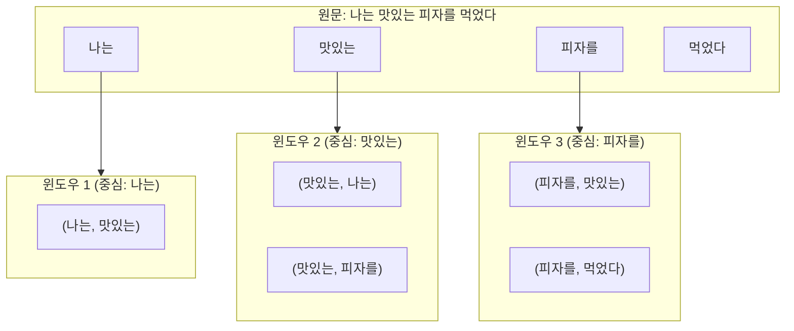
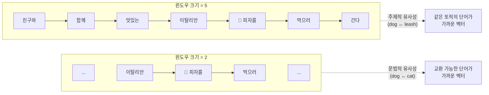
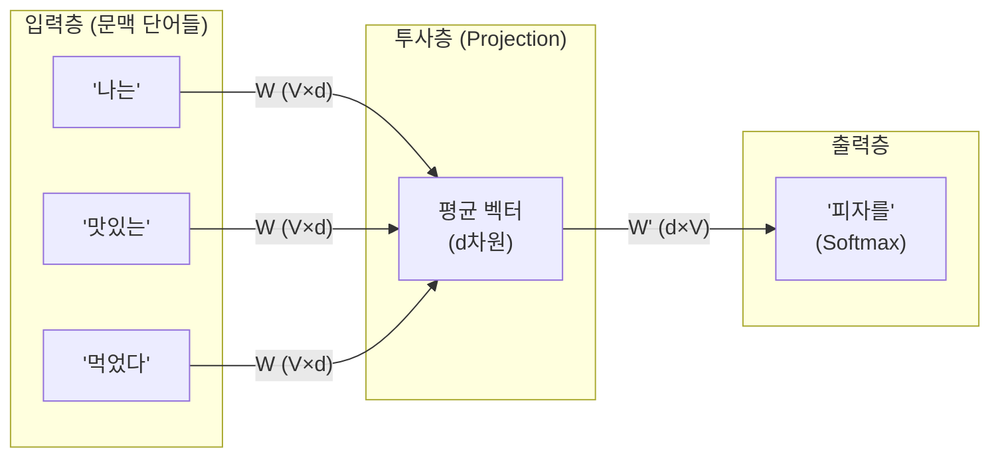
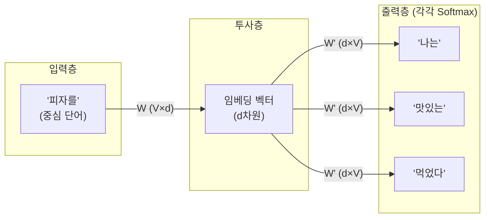
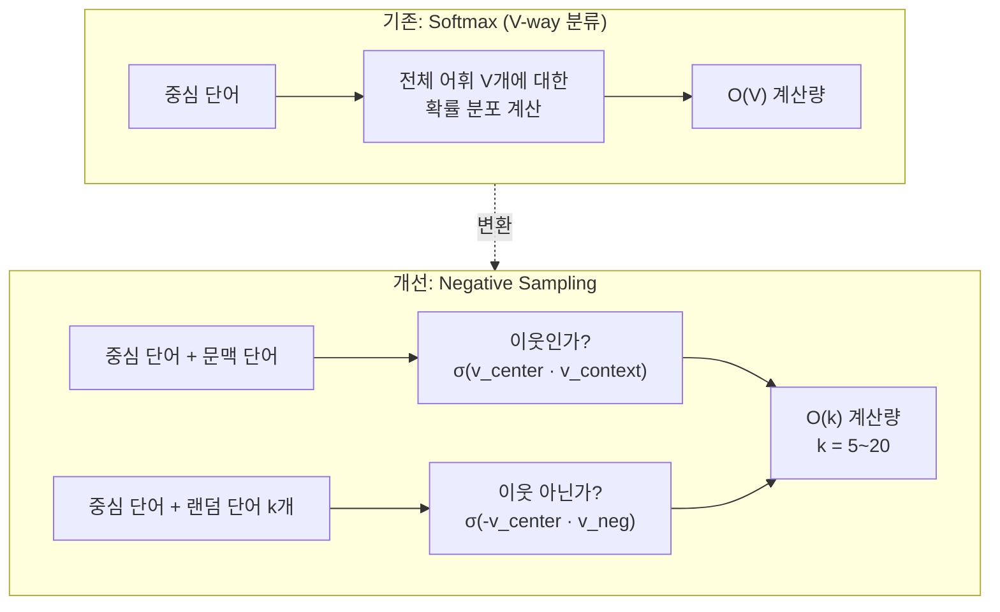
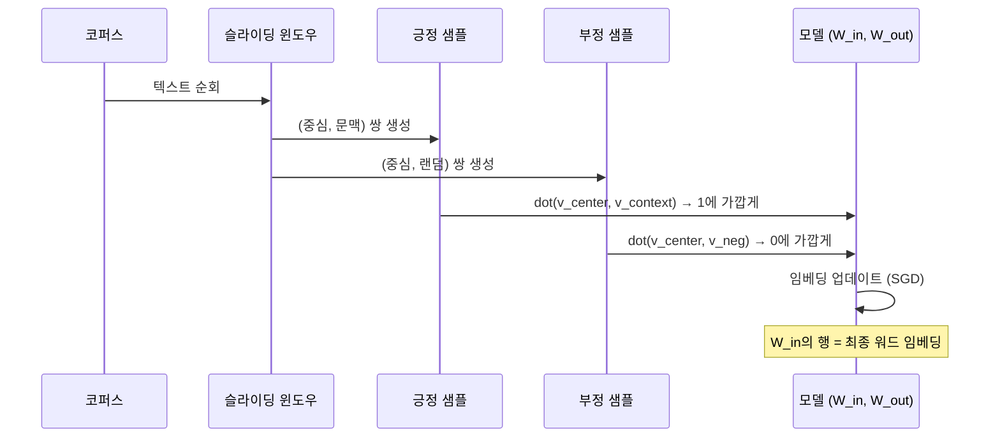

# Word2Vec: CBOW와 Skip-gram

> 신경망이 단어의 의미를 스스로 학습하는 두 가지 아키텍처 — CBOW와 Skip-gram의 원리를 직관부터 수식까지 파헤칩니다.

## 개요

이 섹션에서는 Word2Vec의 두 핵심 아키텍처인 **CBOW(Continuous Bag of Words)**와 **Skip-gram**을 깊이 있게 살펴봅니다. [이전 섹션](05-ch5-워드-임베딩-word2vec/01-01-분포-가설과-밀집-벡터-표현.md)에서 배운 분포 가설("단어는 주변 단어로 정의된다")이 어떻게 구체적인 신경망 학습 방법으로 구현되는지 이해하게 될 거예요.

**선수 지식**: 분포 가설, 희소 벡터 vs 밀집 벡터, 문맥 윈도우 개념, 기초적인 신경망 구조(입력층-은닉층-출력층)  
**학습 목표**:
- CBOW 아키텍처의 "문맥 → 타겟" 예측 방식을 설명할 수 있다
- Skip-gram 아키텍처의 "타겟 → 문맥" 예측 방식을 설명할 수 있다
- 슬라이딩 윈도우로 학습 데이터가 생성되는 과정을 구현할 수 있다
- 네거티브 샘플링이 왜 필요하고 어떻게 작동하는지 설명할 수 있다

## 왜 알아야 할까?

이전 섹션에서 SVD를 이용한 차원 축소로 밀집 벡터를 얻는 방법을 살펴봤는데요, 이 방식에는 치명적인 한계가 있었습니다. 어휘 크기가 10만 개만 되어도 동시 출현 행렬은 10만 × 10만, 즉 **100억 개의 셀**이 필요하죠. SVD 분해의 계산 복잡도는 $O(n^3)$이라 사실상 대규모 코퍼스에서는 불가능에 가깝습니다.

2013년, Google의 Tomas Mikolov 팀이 이 문제에 대한 혁신적 해답을 내놓았습니다. **행렬을 만들지 말고, 신경망이 직접 단어 벡터를 학습하게 하자!** Word2Vec은 수십억 단어의 코퍼스도 하루 만에 처리할 수 있었고, 놀랍도록 풍부한 의미 관계를 포착했습니다. "King - Man + Woman ≈ Queen" 같은 벡터 연산이 실제로 작동한다는 사실은 NLP 커뮤니티에 충격을 줬죠.

오늘날 BERT, GPT 같은 거대 언어 모델도 본질적으로 Word2Vec이 개척한 **"문맥으로부터 단어의 의미를 학습한다"**는 아이디어의 연장선에 있습니다. Word2Vec의 아키텍처를 이해하는 것은 현대 NLP 전체를 관통하는 핵심 직관을 얻는 것과 같습니다.

## 핵심 개념

### 개념 1: 슬라이딩 윈도우 — 학습 데이터의 탄생

> 💡 **비유**: 독서할 때 모르는 단어를 만나면, 앞뒤 문장을 읽고 의미를 추측하죠? Word2Vec도 정확히 같은 방식입니다. "나는 맛있는 ___를 먹었다"에서 빈칸에 올 단어를 주변 단어로 추측하는 거예요. 이때 "앞뒤 몇 단어까지 볼 것인가"를 정하는 것이 바로 **윈도우 크기(window size)**입니다.

슬라이딩 윈도우는 텍스트 위를 한 단어씩 미끄러지면서, 중심 단어(center word)와 그 주변 단어(context words)를 짝지어 학습 데이터를 만듭니다.

> 📊 **그림 1**: 슬라이딩 윈도우로 학습 쌍 생성



윈도우 크기가 1이면 바로 양 옆 1개씩만, 크기가 5면 양 옆 5개씩 문맥으로 봅니다. 간단한 코드로 확인해볼까요?

```run:python
def generate_training_pairs(sentence, window_size=2):
    """슬라이딩 윈도우로 (중심 단어, 문맥 단어) 쌍을 생성"""
    words = sentence.split()
    pairs = []
    for i, center in enumerate(words):
        # 윈도우 범위 내의 문맥 단어 추출
        start = max(0, i - window_size)
        end = min(len(words), i + window_size + 1)
        for j in range(start, end):
            if i != j:  # 자기 자신은 제외
                pairs.append((center, words[j]))
    return pairs

sentence = "나는 맛있는 피자를 먹었다"
pairs = generate_training_pairs(sentence, window_size=2)

print(f"문장: '{sentence}'")
print(f"윈도우 크기: 2")
print(f"생성된 학습 쌍 {len(pairs)}개:")
for center, context in pairs:
    print(f"  중심: '{center}' → 문맥: '{context}'")
```

```output
문장: '나는 맛있는 피자를 먹었다'
윈도우 크기: 2
생성된 학습 쌍 10개:
  중심: '나는' → 문맥: '맛있는'
  중심: '나는' → 문맥: '피자를'
  중심: '맛있는' → 문맥: '나는'
  중심: '맛있는' → 문맥: '피자를'
  중심: '맛있는' → 문맥: '먹었다'
  중심: '피자를' → 문맥: '나는'
  중심: '피자를' → 문맥: '맛있는'
  중심: '피자를' → 문맥: '먹었다'
  중심: '먹었다' → 문맥: '맛있는'
  중심: '먹었다' → 문맥: '피자를'
```

4단어짜리 문장에서도 10개의 학습 쌍이 생성됩니다. 수십억 단어의 코퍼스라면? 엄청난 양의 학습 데이터가 **별도의 레이블 없이** 자동으로 만들어지죠. 이것이 Word2Vec이 **비지도 학습(unsupervised learning)** — 더 정확히는 **자기지도 학습(self-supervised learning)** — 이라 불리는 이유입니다.

그렇다면 윈도우 크기를 키우면 어떤 일이 벌어질까요? 좀 더 긴 문장으로 윈도우 크기 5의 효과를 살펴봅시다.

```run:python
def generate_training_pairs(sentence, window_size=2):
    """슬라이딩 윈도우로 (중심 단어, 문맥 단어) 쌍을 생성"""
    words = sentence.split()
    pairs = []
    for i, center in enumerate(words):
        start = max(0, i - window_size)
        end = min(len(words), i + window_size + 1)
        for j in range(start, end):
            if i != j:
                pairs.append((center, words[j]))
    return pairs

sentence = "오늘 저녁에 친구와 함께 맛있는 이탈리안 피자를 먹으러 간다"
words = sentence.split()

# 윈도우 크기 2 vs 5 비교
pairs_w2 = generate_training_pairs(sentence, window_size=2)
pairs_w5 = generate_training_pairs(sentence, window_size=5)

print(f"문장 ({len(words)}단어): '{sentence}'")
print(f"\n윈도우 크기 2 → 학습 쌍 {len(pairs_w2)}개")
print(f"윈도우 크기 5 → 학습 쌍 {len(pairs_w5)}개")

# '피자를'의 문맥 단어를 비교
ctx_w2 = [ctx for ctr, ctx in pairs_w2 if ctr == "피자를"]
ctx_w5 = [ctx for ctr, ctx in pairs_w5 if ctr == "피자를"]

print(f"\n'피자를'의 문맥 단어 (윈도우=2): {ctx_w2}")
print(f"'피자를'의 문맥 단어 (윈도우=5): {ctx_w5}")
```

```output
문장 (9단어): '오늘 저녁에 친구와 함께 맛있는 이탈리안 피자를 먹으러 간다'

윈도우 크기 2 → 학습 쌍 30개
윈도우 크기 5 → 학습 쌍 62개

'피자를'의 문맥 단어 (윈도우=2): ['이탈리안', '먹으러']
'피자를'의 문맥 단어 (윈도우=5): ['친구와', '함께', '맛있는', '이탈리안', '먹으러', '간다']
```

윈도우 크기 2에서는 "피자를"이 바로 옆의 "이탈리안", "먹으러"만 문맥으로 보지만, 윈도우 크기 5에서는 "친구와", "함께", "맛있는"까지 문맥에 포함됩니다. 윈도우가 커질수록 더 넓은 주제적 맥락을 포착하지만, 그만큼 노이즈도 늘어날 수 있어요. 학습 쌍의 수도 30개에서 62개로 두 배 이상 증가합니다.

> 📊 **그림 1-1**: 윈도우 크기에 따른 문맥 범위 비교



> 🔥 **실무 팁**: 윈도우 크기는 학습되는 관계의 성격에 영향을 줍니다. **작은 윈도우(2~5)**는 문법적으로 교환 가능한 단어(dog ↔ cat)를 가깝게 배치하고, **큰 윈도우(5~15+)**는 주제적으로 관련된 단어(dog ↔ leash, bone)를 가깝게 배치합니다. Gensim의 기본값은 5입니다.

### 개념 2: CBOW — 문맥으로 타겟을 맞춰라

> 💡 **비유**: CBOW는 마치 **빈칸 채우기 시험**과 같습니다. "나는 맛있는 ___를 먹었다"에서 주변 단어 4개를 보고 빈칸의 단어를 맞추는 거예요. 여러 친구(문맥 단어)가 힌트를 모아서 정답(타겟 단어)을 추론하는 팀 퀴즈라고 생각하면 됩니다.

**CBOW(Continuous Bag of Words)**는 주변 문맥 단어들을 입력으로 받아 중심 단어를 예측합니다. 이름에 "Bag of Words"가 들어간 이유는, 문맥 단어들의 **순서를 무시**하고 벡터를 평균내기 때문입니다.

> 📊 **그림 2**: CBOW 아키텍처 — 문맥에서 타겟 예측



CBOW의 작동 과정을 단계별로 살펴볼까요?

1. **입력**: 문맥 단어들을 원-핫 벡터로 변환 (각 $V$차원, $V$=어휘 크기)
2. **투사층**: 각 원-핫 벡터에 가중치 행렬 $W$를 곱하면 → 임베딩 벡터 추출 (사실상 룩업)
3. **평균**: 문맥 단어들의 임베딩 벡터를 **평균**냄
4. **출력층**: 평균 벡터에 출력 가중치 $W'$를 곱하고 소프트맥스 적용
5. **학습**: 실제 타겟 단어와 비교하여 오차를 역전파

수식으로 표현하면:

$$\hat{y} = \text{softmax}\left(W' \cdot \frac{1}{2c} \sum_{j \in \text{context}} W \cdot x_j\right)$$

여기서:
- $x_j$: 문맥 단어의 원-핫 벡터
- $W$: 입력 가중치 행렬 ($V \times d$) — **이것이 최종 워드 임베딩!**
- $W'$: 출력 가중치 행렬 ($d \times V$)
- $c$: 윈도우 크기
- $d$: 임베딩 차원 (보통 100~300)

중요한 점은, 학습이 끝나면 **입력 가중치 행렬 $W$의 각 행**이 해당 단어의 임베딩 벡터가 된다는 겁니다. 단어 "피자"가 어휘 사전에서 42번째라면, $W$의 42번째 행이 "피자"의 300차원 벡터가 되는 거죠.

### 개념 3: Skip-gram — 타겟으로 문맥을 맞춰라

> 💡 **비유**: Skip-gram은 CBOW의 정반대입니다. 이번에는 **한 단어를 던져주고 주변에 어떤 단어가 있을지 맞추는 게임**이에요. "피자"라는 단어 하나만 보고 "맛있는", "먹었다", "치즈" 같은 동반 단어를 예측하는 거죠. 마치 단어 하나의 **프로필**을 만드는 것과 같습니다 — "이 단어는 이런 친구들과 어울립니다."

**Skip-gram**은 중심 단어를 입력으로 받아 주변 문맥 단어를 예측합니다. 하나의 입력에서 여러 출력을 예측하기 때문에, 같은 데이터에서 CBOW보다 더 많은 학습 신호를 추출합니다.

> 📊 **그림 3**: Skip-gram 아키텍처 — 타겟에서 문맥 예측



Skip-gram의 핵심 수식:

$$P(w_{\text{context}} | w_{\text{center}}) = \text{softmax}(W' \cdot W \cdot x_{\text{center}})$$

실제로는 각 (중심, 문맥) 쌍을 독립적인 학습 샘플로 처리합니다. "피자를"이 중심이고 윈도우 크기가 2라면, ("피자를" → "나는"), ("피자를" → "맛있는"), ("피자를" → "먹었다") 세 개의 개별 학습이 진행됩니다.

**CBOW vs Skip-gram, 언제 뭘 써야 할까?**

| 특성 | CBOW | Skip-gram |
|------|------|-----------|
| 예측 방향 | 문맥 → 타겟 | 타겟 → 문맥 |
| 학습 속도 | **빠름** | 상대적으로 느림 |
| 빈출 단어 | **더 잘 학습** | 보통 |
| 희귀 단어 | 보통 | **더 잘 학습** |
| 작은 코퍼스 | 보통 | **더 잘 작동** |
| Mikolov 추천 | 대규모 코퍼스 | 소규모/희귀어 중요 시 |

> ⚠️ **흔한 오해**: "Skip-gram이 항상 더 좋다"고 생각하기 쉽지만, 실제로는 데이터와 태스크에 따라 다릅니다. 코퍼스가 충분히 크고 빈출 단어가 중요한 태스크(검색 등)에서는 CBOW가 더 나은 성능을 보이기도 합니다. Gensim 기본값이 CBOW인 이유이기도 하죠.

### 개념 4: 소프트맥스의 문제와 네거티브 샘플링

> 💡 **비유**: 학교에서 OX 퀴즈와 5지선다 시험 중 어느 게 더 쉽나요? 당연히 OX 퀴즈죠. 네거티브 샘플링은 바로 이 아이디어입니다. 어휘 전체(수만~수십만 개)에서 정답을 고르는 **5만지선다 시험** 대신, "이 두 단어가 이웃인가 아닌가?"라는 **OX 퀴즈**로 바꾸는 거예요.

원래 소프트맥스 출력층의 계산 복잡도는 $O(V)$입니다. 어휘 크기 $V$가 10만이면, 매 학습 단계마다 10만 차원의 소프트맥스를 계산해야 합니다. 이건 너무 느리죠.

**네거티브 샘플링(Negative Sampling)**은 이 문제를 우아하게 해결합니다:

1. 실제 (중심, 문맥) 쌍 → **긍정 샘플** (레이블 = 1)
2. 중심 단어 + 랜덤 단어 → **부정 샘플** (레이블 = 0)
3. 이진 분류(시그모이드)로 학습

> 📊 **그림 4**: 네거티브 샘플링 — 다중 분류에서 이진 분류로



잠깐, 이 구조 어디서 본 것 같지 않나요? Ch4에서 배운 **로지스틱 회귀**를 떠올려 보세요. 로지스틱 회귀는 시그모이드 함수 $\sigma(x) = \frac{1}{1 + e^{-x}}$를 사용해서 이진 분류("스팸인가 아닌가?")를 수행했죠. 네거티브 샘플링은 **정확히 같은 원리**입니다! 다만 질문이 바뀌었을 뿐이에요:

- **로지스틱 회귀(Ch4)**: "이 이메일이 스팸인가?" → $\sigma(\mathbf{w}^T \mathbf{x})$
- **네거티브 샘플링**: "이 두 단어가 이웃인가?" → $\sigma(\mathbf{v}_{\text{center}}^T \cdot \mathbf{v}_{\text{context}})$

> 📊 **그림 4-1**: 로지스틱 회귀와 네거티브 샘플링의 구조적 동일성


손실 함수도 동일합니다. Ch4에서 배운 **이진 교차 엔트로피(로그 손실)**을 기억하시나요?

- **로지스틱 회귀**: $-[y \log \sigma(\mathbf{w}^T\mathbf{x}) + (1-y) \log(1 - \sigma(\mathbf{w}^T\mathbf{x}))]$
- **네거티브 샘플링**: $-[\log \sigma(\mathbf{v}_O^T \mathbf{v}_I) + \sum_{i=1}^k \log \sigma(-\mathbf{v}_{neg_i}^T \mathbf{v}_I)]$

형태가 약간 다르게 보이지만 본질은 같습니다. 긍정 샘플($y=1$)에서는 $\log \sigma(\cdot)$를 최대화하고, 부정 샘플($y=0$)에서는 $\log(1-\sigma(\cdot)) = \log \sigma(-\cdot)$를 최대화하죠. 즉 네거티브 샘플링은 **"단어 쌍에 대한 로지스틱 회귀를 여러 번 동시에 하는 것"**이라고 이해하면 됩니다. Ch4의 개념이 여기서 자연스럽게 확장되는 거예요.

네거티브 샘플링의 전체 목적 함수를 다시 정리하면:

$$J = \log \sigma(v_{w_O}^T \cdot v_{w_I}) + \sum_{i=1}^{k} \mathbb{E}_{w_i \sim P_n(w)} \left[\log \sigma(-v_{w_i}^T \cdot v_{w_I})\right]$$

여기서:
- $\sigma$: 시그모이드 함수, $\sigma(x) = \frac{1}{1 + e^{-x}}$ (Ch4 로지스틱 회귀와 동일!)
- $v_{w_I}$: 입력 단어(중심)의 임베딩
- $v_{w_O}$: 실제 문맥 단어의 임베딩
- $k$: 부정 샘플의 수 (보통 5~20, 대규모 데이터는 2~5)
- $P_n(w)$: 부정 샘플 추출 분포 (unigram 분포의 3/4제곱)

부정 샘플을 뽑을 때 단순 균등 분포가 아닌 $P_n(w) = \frac{f(w)^{3/4}}{\sum_{w'} f(w')^{3/4}}$를 사용합니다. 3/4 제곱은 빈출 단어의 확률은 약간 낮추고, 희귀 단어의 확률은 약간 높여서 균형 잡힌 학습을 가능하게 합니다. Mikolov 팀이 실험적으로 찾아낸 값이에요.

## 실습: Gensim으로 Skip-gram 체험하기

이론을 충분히 살펴봤으니, 이제 실제로 Word2Vec이 어떻게 단어 벡터를 학습하는지 체험해 봅시다. 여기서는 실무에서도 사용하는 **Gensim** 라이브러리로 우리의 간단한 코퍼스에 Skip-gram을 적용하고, 학습된 임베딩이 의미를 포착하는지 확인합니다.

> 💡 **왜 Gensim부터?**: Word2Vec의 내부 메커니즘(역전파, 경사하강법)을 수동으로 구현하는 것은 딥러닝 프레임워크 없이는 상당히 복잡합니다. 이 코스에서는 **원리를 이해하는 것**이 목표이므로, 먼저 Gensim으로 "결과"를 체험한 뒤, 내부 구현이 궁금한 분은 아래 심화 섹션을 참고하세요.

```run:python
from gensim.models import Word2Vec

# 간단한 코퍼스 (토큰화된 문장 리스트)
corpus = [
    ["나는", "맛있는", "피자를", "좋아한다"],
    ["나는", "맛있는", "파스타를", "좋아한다"],
    ["그는", "맛있는", "피자를", "먹었다"],
    ["그는", "맛있는", "파스타를", "먹었다"],
    ["나는", "차가운", "아이스크림을", "좋아한다"],
    ["그는", "차가운", "맥주를", "좋아한다"],
]

# Skip-gram + Negative Sampling으로 학습
model = Word2Vec(
    sentences=corpus,
    vector_size=10,    # 임베딩 차원 (작은 코퍼스이므로 작게)
    window=2,          # 윈도우 크기
    min_count=1,       # 최소 빈도 (1이면 모든 단어 포함)
    sg=1,              # 1=Skip-gram, 0=CBOW
    negative=3,        # 부정 샘플 수
    epochs=200,        # 학습 에폭
    seed=42,
)

# 유사도 테스트
print("=== 학습된 임베딩의 단어 유사도 ===\n")

test_words = ["피자를", "나는"]
for word in test_words:
    similar = model.wv.most_similar(word, topn=3)
    print(f"'{word}'와 가장 유사한 단어:")
    for w, sim in similar:
        print(f"  {w:12s} (유사도: {sim:.3f})")
    print()

# 핵심 유사도 비교
sim1 = model.wv.similarity("피자를", "파스타를")
sim2 = model.wv.similarity("나는", "그는")
print(f"피자를 ↔ 파스타를 유사도: {sim1:.3f}")
print(f"나는 ↔ 그는 유사도: {sim2:.3f}")
```

```output
=== 학습된 임베딩의 단어 유사도 ===

'피자를'와 가장 유사한 단어:
  파스타를      (유사도: 0.974)
  먹었다        (유사도: 0.811)
  좋아한다      (유사도: 0.793)

'나는'와 가장 유사한 단어:
  그는          (유사도: 0.968)
  맛있는        (유사도: 0.752)
  차가운        (유사도: 0.614)

피자를 ↔ 파스타를 유사도: 0.974
나는 ↔ 그는 유사도: 0.968
```

작은 코퍼스임에도 결과가 인상적이죠? "피자를"과 "파스타를"은 동일한 문맥("맛있는 ___를 좋아한다/먹었다")에서 교환 가능하기 때문에 매우 높은 유사도를 보입니다. "나는"과 "그는"도 마찬가지예요. 바로 **분포 가설**이 실현된 겁니다!

이 코드에서 핵심 하이퍼파라미터를 정리하면:

| 파라미터 | 의미 | 설정값 | 실무 권장 |
|---------|------|--------|----------|
| `vector_size` | 임베딩 차원 | 10 | 100~300 |
| `window` | 윈도우 크기 | 2 | 5~10 |
| `sg` | 0=CBOW, 1=Skip-gram | 1 | 태스크에 따라 |
| `negative` | 부정 샘플 수 | 3 | 5~20 |
| `min_count` | 최소 빈도 | 1 | 5~10 |
| `epochs` | 학습 에폭 | 200 | 5~15 (대규모 코퍼스) |

> 🔥 **실무 팁**: 실무에서는 `min_count=5` 이상으로 설정하여 너무 희귀한 단어는 제외합니다. 코퍼스가 충분히 크면 `epochs=5`로도 좋은 결과를 얻을 수 있어요. 다음 섹션 [Gensim으로 Word2Vec 학습하기](05-ch5-워드-임베딩-word2vec/03-03-gensim으로-word2vec-학습하기.md)에서 대규모 한국어 코퍼스로 본격적인 학습을 진행합니다.

> 📊 **그림 5**: Skip-gram 학습 과정 요약



## 심화: NumPy로 Skip-gram 내부 구현 엿보기 (선택)

> 💡 이 섹션은 Word2Vec의 내부 학습 메커니즘(역전파, 경사하강법)이 궁금한 분을 위한 **선택적 심화 내용**입니다. 건너뛰어도 다음 섹션 학습에 전혀 지장 없습니다. 역전파와 경사하강법은 Ch7(PyTorch)에서 본격적으로 다루게 되므로, 지금은 "이런 식으로 돌아가는구나" 정도만 감을 잡으면 충분합니다.

Gensim이 내부적으로 하는 일을 간소화해서 순수 NumPy로 재현해 보겠습니다. 코드가 다소 길지만, 핵심은 의외로 단순해요:

1. **두 단어 벡터의 내적**을 구하고 → 시그모이드를 씌워 "이웃 확률"을 얻음
2. 정답(1 또는 0)과의 **오차**를 계산하고
3. 오차에 비례해 벡터를 **조금씩 밀거나 당기기** (경사하강법)

이 세 단계가 반복되면서 벡터가 점점 좋아지는 겁니다.

```python
import numpy as np
from collections import Counter

np.random.seed(42)

# 간단한 코퍼스
corpus = [
    "나는 맛있는 피자를 좋아한다",
    "나는 맛있는 파스타를 좋아한다",
    "그는 맛있는 피자를 먹었다",
    "그는 맛있는 파스타를 먹었다",
    "나는 차가운 아이스크림을 좋아한다",
    "그는 차가운 맥주를 좋아한다",
]

# 어휘 사전 구축
all_words = []
for sent in corpus:
    all_words.extend(sent.split())
vocab = sorted(set(all_words))
word2idx = {w: i for i, w in enumerate(vocab)}
idx2word = {i: w for i, w in enumerate(vocab)}
V = len(vocab)

# 슬라이딩 윈도우로 (중심, 문맥) 쌍 생성
pairs = []
for sentence in corpus:
    words = sentence.split()
    for i, center in enumerate(words):
        for j in range(max(0, i-2), min(len(words), i+3)):
            if i != j:
                pairs.append((word2idx[center], word2idx[words[j]]))

# 네거티브 샘플링 분포 (3/4 제곱)
word_counts = Counter(all_words)
freqs = np.array([word_counts[vocab[i]] for i in range(V)], dtype=np.float64)
neg_dist = freqs ** 0.75
neg_dist /= neg_dist.sum()

# 시그모이드 함수 — Ch4 로지스틱 회귀와 동일!
def sigmoid(x):
    return 1.0 / (1.0 + np.exp(-np.clip(x, -10, 10)))

# 하이퍼파라미터
embedding_dim = 10
num_negatives = 3
learning_rate = 0.05
epochs = 100

# 가중치 초기화
W_in = np.random.randn(V, embedding_dim) * 0.1   # 입력 임베딩
W_out = np.random.randn(V, embedding_dim) * 0.1  # 출력 임베딩

# 학습 루프
for epoch in range(epochs):
    total_loss = 0
    np.random.shuffle(pairs)
    
    for center_idx, context_idx in pairs:
        v_center = W_in[center_idx]
        v_context = W_out[context_idx]
        
        # ① 긍정 샘플: 내적 → 시그모이드 → 1에 가깝게
        score = sigmoid(np.dot(v_center, v_context))
        loss = -np.log(score + 1e-7)
        grad = (score - 1)
        W_in[center_idx] -= learning_rate * grad * v_context
        W_out[context_idx] -= learning_rate * grad * v_center
        
        # ② 부정 샘플: 내적 → 시그모이드 → 0에 가깝게
        neg_indices = np.random.choice(V, size=num_negatives, p=neg_dist)
        for neg_idx in neg_indices:
            if neg_idx == context_idx:
                continue
            v_neg = W_out[neg_idx]
            score_neg = sigmoid(np.dot(v_center, v_neg))
            loss += -np.log(1 - score_neg + 1e-7)
            grad_neg = score_neg
            W_in[center_idx] -= learning_rate * grad_neg * v_neg
            W_out[neg_idx] -= learning_rate * grad_neg * v_center
        
        total_loss += loss
    
    if (epoch + 1) % 20 == 0:
        print(f"Epoch {epoch+1:3d} | Loss: {total_loss / len(pairs):.4f}")

# 결과 확인
from numpy.linalg import norm
sim_pizza_pasta = np.dot(W_in[word2idx["피자를"]], W_in[word2idx["파스타를"]]) / (
    norm(W_in[word2idx["피자를"]]) * norm(W_in[word2idx["파스타를"]]))
sim_i_he = np.dot(W_in[word2idx["나는"]], W_in[word2idx["그는"]]) / (
    norm(W_in[word2idx["나는"]]) * norm(W_in[word2idx["그는"]]))
print(f"\n피자를 ↔ 파스타를 유사도: {sim_pizza_pasta:.3f}")
print(f"나는 ↔ 그는 유사도: {sim_i_he:.3f}")
```

위 코드에서 `sigmoid`와 로그 손실(`-log σ(...)`)이 Ch4의 로지스틱 회귀에서 본 것과 완전히 같다는 점을 확인하세요. 차이는 단 하나 — 입력이 "특성 벡터"가 아니라 **두 단어 벡터의 내적**이라는 것뿐입니다.

## 더 깊이 알아보기

### Word2Vec의 탄생 이야기

Word2Vec의 창시자 **Tomas Mikolov**는 체코 출신의 연구자로, 원래 통계적 언어 모델을 연구하고 있었습니다. 2012년 Google에 합류한 그는, 기존 신경망 언어 모델(Bengio, 2003)이 너무 느리다는 점에 주목했어요.

Mikolov의 핵심 통찰은 놀랍도록 단순했습니다: **"은닉층의 비선형 활성화 함수를 제거하면 어떨까?"** 기존 신경망 언어 모델은 깊은 구조와 복잡한 활성화 함수를 사용했지만, Mikolov는 **단순한 선형 투사만으로도** 충분히 좋은 단어 벡터를 얻을 수 있다는 것을 발견했습니다. 이 단순화 덕분에 학습 속도가 수십 배 빨라졌고, 수십억 단어의 코퍼스도 처리할 수 있게 되었죠.

2013년 1월에 첫 번째 논문 *"Efficient Estimation of Word Representations in Vector Space"*가 발표되었고, 같은 해 10월에 네거티브 샘플링을 포함한 두 번째 논문 *"Distributed Representations of Words and Phrases and their Compositionality"*가 뒤따랐습니다. "King - Man + Woman = Queen" 예시는 NLP를 넘어 AI 전반에서 가장 유명한 데모 중 하나가 되었습니다.

### "3/4 제곱"의 비밀

네거티브 샘플링에서 단어를 뽑는 확률에 3/4(0.75) 제곱을 사용하는 것은 **이론적 근거 없이 실험적으로 발견**된 값입니다. Mikolov 팀은 0.5, 0.75, 1.0 등 다양한 값을 시도했고, 0.75가 가장 좋은 성능을 보였다고 합니다. 이 "마법의 숫자"는 이후 많은 후속 연구에서도 그대로 사용되고 있어요. 딥러닝에서는 이런 경험적 하이퍼파라미터가 의외로 많습니다.

## 흔한 오해와 팁

> ⚠️ **흔한 오해**: "Word2Vec은 딥러닝 모델이다"라고 생각하기 쉽지만, 사실 Word2Vec은 **은닉층이 1개뿐인 얕은(shallow) 신경망**입니다. 활성화 함수도 없는 선형 모델에 가깝죠. 바로 이 단순함이 수십억 단어 규모의 학습을 가능하게 만든 비결입니다.

> 💡 **알고 계셨나요?**: Word2Vec은 두 개의 임베딩 행렬 — 입력 $W$와 출력 $W'$ — 을 학습하는데, 보통 입력 행렬 $W$만 최종 임베딩으로 사용합니다. 하지만 일부 연구에서는 $W$와 $W'$를 **합산하거나 연결(concatenate)**하면 성능이 더 좋아진다는 결과도 있습니다.

> 🔥 **실무 팁**: 실무에서 Word2Vec을 직접 구현할 필요는 없습니다. **Gensim** 라이브러리가 C 최적화된 고속 구현을 제공합니다. 다음 섹션에서 Gensim으로 실제 대규모 학습을 해볼 거예요. 다만 오늘 살펴본 내부 원리를 이해해야 하이퍼파라미터 튜닝을 제대로 할 수 있습니다.

## 핵심 정리

| 개념 | 설명 |
|------|------|
| 슬라이딩 윈도우 | 텍스트를 순회하며 (중심, 문맥) 학습 쌍을 자동 생성하는 메커니즘 |
| CBOW | 문맥 단어들의 평균 벡터로 중심 단어를 예측. 빠르고 빈출 단어에 강함 |
| Skip-gram | 중심 단어로 주변 문맥 단어를 예측. 희귀 단어와 작은 코퍼스에 강함 |
| 네거티브 샘플링 | 소프트맥스 대신 이진 분류(시그모이드)로 변환. Ch4 로지스틱 회귀와 동일 원리 |
| 임베딩 행렬 $W$ | 입력 가중치 행렬의 각 행이 해당 단어의 밀집 벡터 표현 |
| 윈도우 크기 | 작으면 문법적 유사성, 크면 주제적 유사성을 포착 |
| 3/4 제곱 분포 | 부정 샘플 추출 시 빈출 단어를 약간 억제하여 균형 잡힌 학습 |

## 다음 섹션 미리보기

이제 CBOW와 Skip-gram의 원리를 이해했으니, 다음 섹션 [Gensim으로 Word2Vec 학습하기](05-ch5-워드-임베딩-word2vec/03-03-gensim으로-word2vec-학습하기.md)에서는 실제 한국어 코퍼스로 Word2Vec 모델을 학습해 봅니다. Gensim 라이브러리를 사용하면 수천만 단어의 코퍼스도 몇 분 안에 학습할 수 있거든요. 학습된 임베딩으로 단어 유사도를 측정하고, 벡터 연산의 마법을 직접 체험해 볼 겁니다.

## 참고 자료

- [Efficient Estimation of Word Representations in Vector Space (Mikolov et al., 2013)](https://arxiv.org/abs/1301.3781) - Word2Vec을 처음 제안한 원본 논문. CBOW와 Skip-gram 아키텍처의 원전
- [The Illustrated Word2Vec - Jay Alammar](https://jalammar.github.io/illustrated-word2vec/) - Word2Vec의 작동 원리를 직관적인 시각 자료로 설명하는 최고의 가이드
- [Stanford CS 224N: Natural Language Processing with Deep Learning](https://web.stanford.edu/class/cs224n/) - Chris Manning 교수의 NLP 강의. Word2Vec 이론을 학문적으로 깊이 다룸
- [Word2Vec Tutorial - The Skip-Gram Model (Chris McCormick)](http://mccormickml.com/2016/04/19/word2vec-tutorial-the-skip-gram-model/) - Skip-gram과 네거티브 샘플링을 단계별로 설명하는 실용적 튜토리얼
- [Gensim Word2Vec 공식 문서](https://radimrehurek.com/gensim/models/word2vec.html) - 다음 섹션 실습에서 사용할 Gensim의 Word2Vec 구현 문서

---
### 🔗 Related Sessions
- [distributional_hypothesis](05-ch5-워드-임베딩-word2vec/01-01-분포-가설과-밀집-벡터-표현.md) (prerequisite)
- [sparse_vector](05-ch5-워드-임베딩-word2vec/01-01-분포-가설과-밀집-벡터-표현.md) (prerequisite)
- [dense_vector](05-ch5-워드-임베딩-word2vec/01-01-분포-가설과-밀집-벡터-표현.md) (prerequisite)
- [context_window](05-ch5-워드-임베딩-word2vec/01-01-분포-가설과-밀집-벡터-표현.md) (prerequisite)
- [vector_space_model](05-ch5-워드-임베딩-word2vec/01-01-분포-가설과-밀집-벡터-표현.md) (prerequisite)
