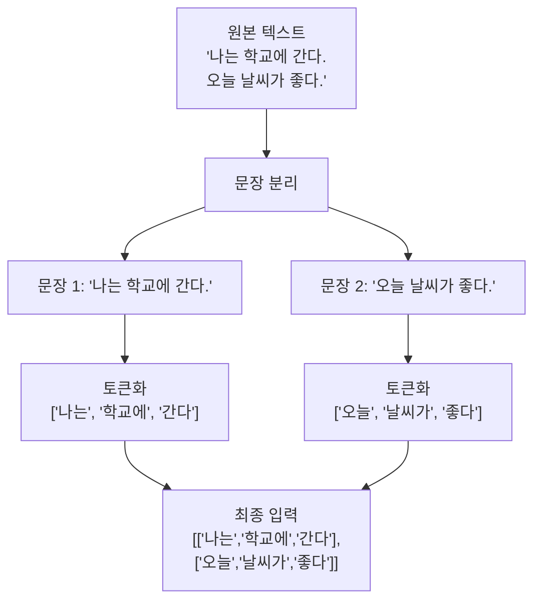
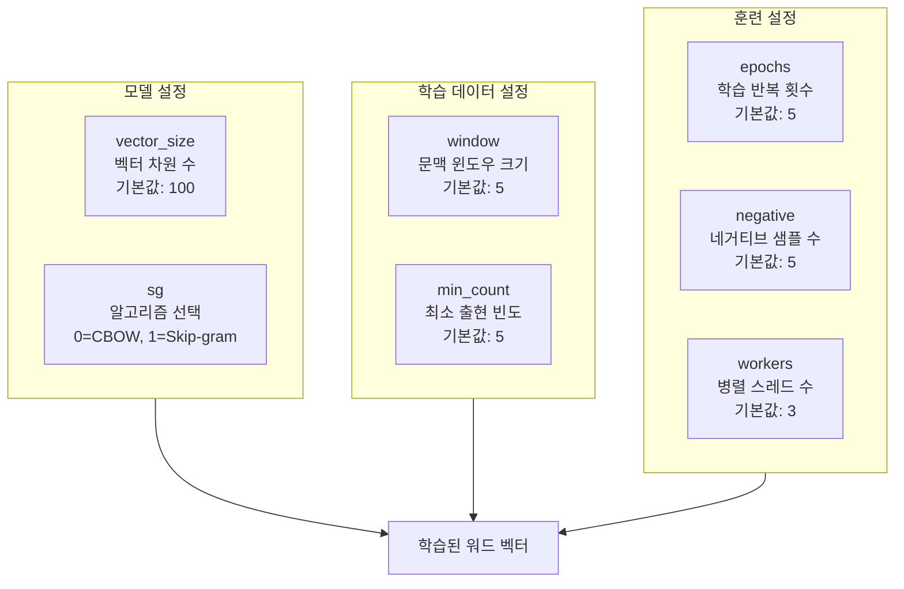
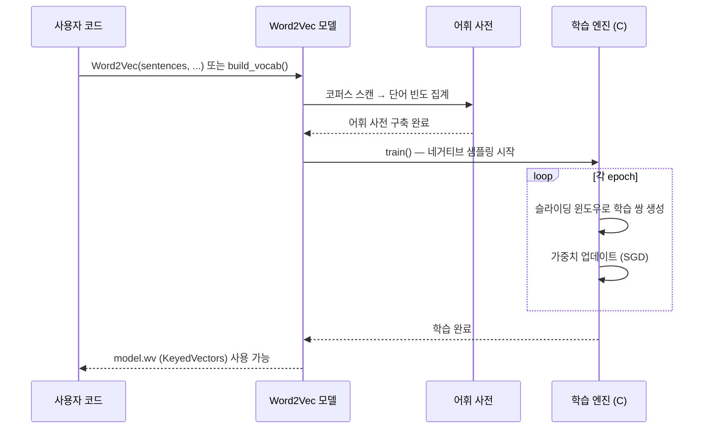
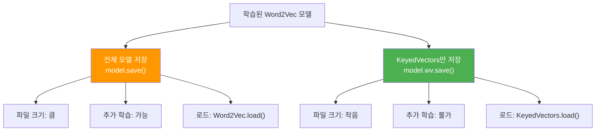

# Gensim으로 Word2Vec 학습하기

> Gensim 라이브러리로 실제 코퍼스에서 Word2Vec 모델을 학습하고, 저장·로드하는 전체 워크플로를 익힙니다.

## 개요

이 섹션에서는 앞서 NumPy로 직접 구현했던 Word2Vec을 **산업 수준의 라이브러리**인 Gensim으로 학습하는 방법을 배웁니다. 코퍼스 준비부터 하이퍼파라미터 튜닝, 모델 저장/로드까지 실무에서 바로 쓸 수 있는 전체 워크플로를 다룹니다.

**선수 지식**: [분포 가설과 밀집 벡터 표현](05-ch5-워드-임베딩-word2vec/01-01-분포-가설과-밀집-벡터-표현.md)에서 배운 희소/밀집 벡터 개념, [Word2Vec: CBOW와 Skip-gram](05-ch5-워드-임베딩-word2vec/02-02-word2vec-cbow와-skip-gram.md)에서 배운 두 아키텍처의 원리

**학습 목표**:
- Gensim의 `Word2Vec` API 구조와 핵심 파라미터를 이해한다
- 한국어/영어 코퍼스를 Word2Vec 학습에 맞게 전처리할 수 있다
- `vector_size`, `window`, `min_count`, `sg` 등 하이퍼파라미터의 효과를 설명할 수 있다
- 학습된 모델을 저장·로드하고 `KeyedVectors`로 효율적으로 활용할 수 있다

## 왜 알아야 할까?

이전 섹션에서 NumPy로 Skip-gram을 직접 구현해봤죠? 원리를 이해하는 데는 훌륭했지만, 실제로 수만~수백만 문장의 코퍼스를 학습하려면 **최적화된 C 코드 기반의 라이브러리**가 필요합니다.

Gensim의 Word2Vec은 Google의 원본 C 구현과 동일한 알고리즘을 사용하면서도, Python에서 편리하게 쓸 수 있도록 감싸놓은 라이브러리입니다. 실무에서 워드 임베딩을 학습할 때 **가장 많이 사용되는 도구**이기도 하죠. Hugging Face가 트랜스포머 시대의 허브라면, Gensim은 전통적 임베딩 시대의 허브라고 할 수 있습니다.

> 📊 **그림 1**: Word2Vec 학습의 전체 워크플로


이번 섹션을 마치면 "데이터만 있으면 나만의 워드 임베딩을 학습할 수 있다"는 자신감이 생길 겁니다.

## 핵심 개념

### 개념 1: Gensim이란?

> 💡 **비유**: Gensim은 요리사에게 전문 주방 같은 존재입니다. 집에서도 요리할 수 있지만(NumPy 구현), 전문 주방의 대형 오븐과 산업용 믹서기가 있으면 대량의 요리를 훨씬 빠르고 일관되게 만들 수 있죠.

Gensim(Generate Similar의 줄임말)은 체코 출신의 NLP 연구자 **Radim Řehůřek**이 2008년경 개발한 토픽 모델링과 문서 유사도 분석 라이브러리입니다. Word2Vec, FastText, Doc2Vec 등 다양한 임베딩 알고리즘을 고성능 C 확장으로 구현해 제공합니다.

Gensim 4.x(현재 최신 버전 4.4.0)에서 주요 변경사항은:

| 항목 | Gensim 3.x | Gensim 4.x |
|------|-----------|-----------|
| 벡터 차원 파라미터 | `size` | `vector_size` |
| 유사도 메서드 접근 | `model.most_similar()` | `model.wv.most_similar()` |
| 반복 횟수 파라미터 | `iter` | `epochs` |
| 메모리 최적화 | 전체 모델 유지 | `KeyedVectors` 분리 권장 |

> ⚠️ **흔한 오해**: 인터넷의 많은 튜토리얼이 Gensim 3.x 문법을 사용합니다. `size=100`이나 `model.most_similar()` 같은 코드를 보면 구버전이니, `vector_size=100`과 `model.wv.most_similar()`로 바꿔야 합니다.

### 개념 2: 코퍼스 준비 — 학습 데이터의 형태

> 💡 **비유**: Word2Vec에게 코퍼스를 먹이는 건 아기에게 이유식을 주는 것과 비슷합니다. 통째로 큰 덩어리를 주면 안 되고, **한 입 크기로 잘라서**(토큰화) 적절한 크기로(문장 단위) 나눠줘야 하죠.

Gensim의 Word2Vec은 입력으로 **"리스트의 리스트"** 형태를 기대합니다. 각 내부 리스트는 하나의 문장을 토큰으로 분리한 것이죠.

> 📊 **그림 2**: 코퍼스 데이터 형태 변환



```python
# Gensim Word2Vec이 기대하는 입력 형태
corpus = [
    ["나는", "학교에", "간다"],      # 문장 1의 토큰 리스트
    ["오늘", "날씨가", "좋다"],      # 문장 2의 토큰 리스트
    ["학교에서", "공부를", "한다"],   # 문장 3의 토큰 리스트
]
```

대규모 코퍼스의 경우 메모리에 모두 올리기 어려울 수 있는데요, Gensim은 **이터레이터(iterator)** 패턴도 지원합니다. 파일에서 한 줄씩 읽어오는 제너레이터를 만들면 메모리를 절약할 수 있죠.

```python
class MyCorpus:
    """대규모 코퍼스를 한 줄씩 읽어오는 이터레이터"""
    def __init__(self, filepath):
        self.filepath = filepath
    
    def __iter__(self):
        with open(self.filepath, 'r', encoding='utf-8') as f:
            for line in f:
                # 각 줄을 공백 기준으로 토큰화
                yield line.strip().split()
```

### 개념 3: 핵심 하이퍼파라미터 이해

> 💡 **비유**: Word2Vec의 하이퍼파라미터는 카메라의 설정값과 비슷합니다. `vector_size`는 해상도(높을수록 세밀하지만 파일이 커짐), `window`는 화각(넓을수록 많은 것을 담지만 세부가 흐려짐), `min_count`는 노이즈 필터(잡티를 걸러냄)라고 생각하면 됩니다.

> 📊 **그림 3**: Word2Vec 핵심 하이퍼파라미터



각 파라미터를 하나씩 살펴보겠습니다.

**`vector_size`** (기본값: 100)
- 각 단어를 표현할 벡터의 차원 수입니다
- 작은 코퍼스에는 50~100, 대규모 코퍼스에는 200~300이 적절합니다
- Google News 사전학습 모델은 300차원을 사용했습니다

**`window`** (기본값: 5)
- 현재 단어와 예측 대상 단어 사이의 최대 거리입니다
- 작은 윈도우(2~3): 문법적(syntactic) 관계를 잘 포착합니다
- 큰 윈도우(5~10): 의미적(semantic) 관계를 더 잘 포착합니다

**`min_count`** (기본값: 5)
- 이 빈도 미만으로 등장하는 단어는 어휘에서 제외됩니다
- 오타, 고유명사 등 노이즈를 제거하는 역할을 합니다
- 작은 코퍼스에서는 1~2로 낮추는 것이 좋습니다

**`sg`** (기본값: 0)
- `0`: CBOW (문맥으로 타겟 예측) — 빠르고, 빈출 단어에 유리
- `1`: Skip-gram (타겟으로 문맥 예측) — 느리지만, 희귀 단어에 유리

**`negative`** (기본값: 5)
- 네거티브 샘플링에서 사용할 "오답" 단어 수입니다
- 5~20 사이가 일반적이고, 작은 코퍼스에는 5~10이 적절합니다

**`epochs`** (기본값: 5)
- 전체 코퍼스를 반복 학습하는 횟수입니다
- 작은 코퍼스에서는 10~20으로 늘리면 품질이 개선됩니다

```run:python
# 하이퍼파라미터 설정 예시
from gensim.models import Word2Vec

# 기본 설정
params = {
    "vector_size": 100,   # 100차원 벡터
    "window": 5,          # 좌우 5단어 문맥
    "min_count": 5,       # 5회 미만 등장 단어 제외
    "sg": 1,              # Skip-gram 사용
    "negative": 5,        # 네거티브 샘플 5개
    "epochs": 5,          # 5회 반복 학습
    "workers": 4,         # 4개 스레드 병렬 처리
}
print("Word2Vec 하이퍼파라미터 설정:")
for key, value in params.items():
    print(f"  {key}: {value}")
```

```output
Word2Vec 하이퍼파라미터 설정:
  vector_size: 100
  window: 5
  min_count: 5
  sg: 1
  negative: 5
  epochs: 5
  workers: 4
```

### 개념 4: 모델 학습과 어휘 구축

> 💡 **비유**: Word2Vec 학습은 두 단계로 나뉘는데, 이건 학교 첫날과 비슷합니다. 먼저 **출석부를 만들고**(어휘 구축 = `build_vocab`), 그다음 **실제 수업을 진행**합니다(학습 = `train`). Gensim은 이 두 단계를 `Word2Vec()` 생성자 하나로 자동 처리해주기도 하지만, 분리해서 호출할 수도 있습니다.

> 📊 **그림 4**: Gensim Word2Vec 학습 파이프라인



Gensim에서 Word2Vec을 학습하는 방법은 크게 두 가지입니다.

**방법 1: 한 줄로 학습 (가장 간단)**

```python
from gensim.models import Word2Vec

# sentences를 넘기면 build_vocab + train이 자동 실행
model = Word2Vec(sentences=corpus, vector_size=100, window=5, 
                 min_count=1, sg=1, epochs=10)
```

**방법 2: 단계별 학습 (세밀한 제어)**

```python
# 1단계: 빈 모델 생성
model = Word2Vec(vector_size=100, window=5, min_count=1, sg=1)

# 2단계: 어휘 구축
model.build_vocab(corpus)

# 3단계: 학습
model.train(corpus, total_examples=model.corpus_count, 
            epochs=10)
```

단계별 방법은 추가 코퍼스로 **점진적 학습(incremental training)**을 할 때 유용합니다. `build_vocab(new_corpus, update=True)`로 어휘를 확장한 뒤 다시 `train()`을 호출하면 되거든요.

### 개념 5: 모델 저장과 로드 — KeyedVectors

> 💡 **비유**: 학습이 끝난 Word2Vec 모델은 두 부분으로 나눌 수 있습니다. **졸업앨범**(KeyedVectors — 학습 결과인 단어 벡터만 담김)과 **학교 전체 시설**(전체 모델 — 추가 학습에 필요한 가중치, 어휘 정보 등). 더 이상 추가 학습이 필요 없다면 졸업앨범만 들고 다니는 게 훨씬 가볍죠.

> 📊 **그림 5**: 모델 저장 전략 비교



```python
from gensim.models import Word2Vec, KeyedVectors

# === 전체 모델 저장/로드 (추가 학습 가능) ===
model.save("word2vec.model")
model = Word2Vec.load("word2vec.model")

# === KeyedVectors만 저장/로드 (추론 전용, 가벼움) ===
model.wv.save("word2vec.kv")
wv = KeyedVectors.load("word2vec.kv")

# === Word2Vec 원본 포맷으로 저장 (다른 도구와 호환) ===
model.wv.save_word2vec_format("word2vec.txt", binary=False)
model.wv.save_word2vec_format("word2vec.bin", binary=True)

# 원본 포맷 로드
wv = KeyedVectors.load_word2vec_format("word2vec.bin", binary=True)
```

> 🔥 **실무 팁**: 학습이 완료된 후에는 `model.wv`(KeyedVectors)만 따로 저장하세요. 전체 모델 대비 메모리와 디스크 사용량이 크게 줄어들고, 유사도 검색 같은 추론 작업에는 KeyedVectors만으로 충분합니다.

## 실습: 직접 해보기

실제 영어 코퍼스를 사용해 Word2Vec을 처음부터 학습하고 결과를 확인해보겠습니다. Gensim에 내장된 `text8` 데이터셋(위키피디아 텍스트)을 활용합니다.

```python
import gensim.downloader as api
from gensim.models import Word2Vec
import time

# ============================
# 1. 코퍼스 준비
# ============================
# Gensim에 내장된 text8 코퍼스 다운로드 (약 31MB)
# text8은 영문 위키피디아의 처음 1억 문자를 정제한 데이터셋
print("코퍼스 다운로드 중...")
corpus = api.load("text8")  # 이터레이터 반환

# text8은 하나의 긴 토큰 리스트 형태
# Word2Vec은 문장 리스트를 기대하므로 적절히 분할
sentences = list(corpus)  # 실제로는 1개의 긴 리스트
print(f"전체 토큰 수: {len(sentences[0]):,}")
print(f"처음 20개 토큰: {sentences[0][:20]}")
```

```python
# ============================
# 2. Word2Vec 모델 학습
# ============================

# Skip-gram 모델 학습
print("\nSkip-gram 모델 학습 시작...")
start_time = time.time()

model_sg = Word2Vec(
    sentences=sentences,
    vector_size=100,    # 100차원 벡터
    window=5,           # 좌우 5단어 문맥
    min_count=5,        # 5회 미만 등장 단어 제외
    sg=1,               # Skip-gram 사용
    negative=5,         # 네거티브 샘플 5개
    epochs=5,           # 5회 반복 학습
    workers=4,          # 4개 스레드 병렬 처리
    seed=42,            # 재현성을 위한 시드 고정
)

elapsed = time.time() - start_time
print(f"학습 완료! ({elapsed:.1f}초)")
print(f"어휘 크기: {len(model_sg.wv):,}개 단어")
print(f"벡터 차원: {model_sg.wv.vector_size}")
```

```python
# ============================
# 3. 학습 결과 확인
# ============================

# 단어 벡터 확인
word = "king"
vector = model_sg.wv[word]
print(f"'{word}'의 벡터 (처음 10개 값): {vector[:10].round(3)}")
print(f"벡터 차원: {vector.shape}")

# 유사 단어 검색
print(f"\n'{word}'과 가장 유사한 단어 Top 5:")
for word, score in model_sg.wv.most_similar("king", topn=5):
    print(f"  {word}: {score:.4f}")

# 단어 유추 (King - Man + Woman = ?)
print("\n단어 유추: king - man + woman = ?")
results = model_sg.wv.most_similar(
    positive=["king", "woman"],
    negative=["man"],
    topn=3
)
for word, score in results:
    print(f"  {word}: {score:.4f}")
```

```python
# ============================
# 4. CBOW 모델과 비교
# ============================

print("CBOW 모델 학습 시작...")
start_time = time.time()

model_cbow = Word2Vec(
    sentences=sentences,
    vector_size=100,
    window=5,
    min_count=5,
    sg=0,               # CBOW 사용
    negative=5,
    epochs=5,
    workers=4,
    seed=42,
)

elapsed = time.time() - start_time
print(f"CBOW 학습 완료! ({elapsed:.1f}초)")

# 같은 단어로 비교
print("\nSkip-gram vs CBOW — 'king' 유사어 비교:")
print("  Skip-gram:", [w for w, _ in model_sg.wv.most_similar("king", topn=5)])
print("  CBOW:     ", [w for w, _ in model_cbow.wv.most_similar("king", topn=5)])
```

```python
# ============================
# 5. 모델 저장과 로드
# ============================
import os

# 전체 모델 저장 (추가 학습 가능)
model_sg.save("word2vec_text8.model")
print(f"전체 모델 파일 크기: {os.path.getsize('word2vec_text8.model') / 1024 / 1024:.1f} MB")

# KeyedVectors만 저장 (추론 전용)
model_sg.wv.save("word2vec_text8.kv")
print(f"KeyedVectors 파일 크기: {os.path.getsize('word2vec_text8.kv') / 1024 / 1024:.1f} MB")

# KeyedVectors 로드 후 사용
from gensim.models import KeyedVectors
wv = KeyedVectors.load("word2vec_text8.kv")

# 로드한 KeyedVectors로 유사도 검색
print("\n로드된 KeyedVectors로 유사어 검색:")
print("'computer'와 유사한 단어:", 
      [w for w, _ in wv.most_similar("computer", topn=5)])

# 두 단어 간 유사도 계산
similarity = wv.similarity("king", "queen")
print(f"\nking ↔ queen 유사도: {similarity:.4f}")
```

```python
# ============================
# 6. 하이퍼파라미터 영향 실험
# ============================

# window 크기에 따른 차이 관찰
for win_size in [2, 5, 10]:
    model_tmp = Word2Vec(
        sentences=sentences,
        vector_size=100, window=win_size,
        min_count=5, sg=1, epochs=5,
        workers=4, seed=42
    )
    similar = model_tmp.wv.most_similar("king", topn=3)
    print(f"\nwindow={win_size}: ", 
          [(w, f"{s:.3f}") for w, s in similar])
```

> 🔥 **실무 팁**: `text8` 코퍼스로 처음 실험할 때는 위 코드를 그대로 실행하면 됩니다. 나만의 코퍼스를 사용하고 싶다면, 텍스트 파일을 줄 단위로 토큰화한 리스트의 리스트 형태로 변환하세요.

## 더 깊이 알아보기

### Gensim의 탄생 스토리

Gensim을 만든 **Radim Řehůřek**(라딤 르제후르젝)은 체코 마사리크 대학교에서 박사 과정을 밟던 2008년, 체코어 디지털 도서관의 문서 유사도 분석이 필요했습니다. 당시 기존 도구들은 메모리에 전체 코퍼스를 올려야 해서 대규모 데이터를 처리할 수 없었죠.

그래서 그는 **스트리밍 방식**(한 번에 하나의 문서만 메모리에 로드)으로 동작하는 라이브러리를 직접 만들기 시작했고, 이것이 Gensim이 되었습니다. "Generate Similar"의 줄임말인 이 이름은 "유사한 것을 생성한다"는 라이브러리의 핵심 기능을 담고 있습니다.

2013년 Google이 Word2Vec 논문과 C 코드를 공개했을 때, Radim은 이를 Gensim에 통합하는 작업을 빠르게 진행했습니다. 그는 단순히 Python 래퍼를 만든 것이 아니라, Cython을 통해 원본 C 코드와 거의 동일한 성능을 달성했죠. 이 구현이 워낙 잘 만들어져서, Word2Vec을 Python에서 학습하는 사실상의 표준이 되었습니다.

### Word2Vec 원본 구현과의 관계

Gensim의 Word2Vec은 Tomas Mikolov가 Google에서 공개한 원본 C 코드의 알고리즘을 그대로 따릅니다. 핵심 학습 루프는 Cython으로 컴파일되어 순수 Python 대비 수백 배 빠르게 동작합니다. 실제로 `gensim/models/word2vec_inner.pyx` 파일을 보면 C 수준의 최적화 코드를 확인할 수 있습니다.

## 흔한 오해와 팁

> ⚠️ **흔한 오해**: "Word2Vec을 학습하려면 엄청난 양의 데이터가 필요하다"고 생각하기 쉽지만, 실제로는 수천~수만 문장만으로도 특정 도메인에서 유용한 임베딩을 학습할 수 있습니다. 물론 데이터가 많을수록 품질이 좋아지지만, **도메인에 특화된 소규모 코퍼스**가 범용 대규모 코퍼스보다 나을 때도 있습니다. 예를 들어, 의학 논문 1만 편으로 학습한 임베딩이 위키피디아 전체로 학습한 것보다 의학 용어 유사도에서 더 좋은 성능을 보일 수 있죠.

> 💡 **알고 계셨나요?**: Gensim의 `workers` 파라미터를 늘린다고 항상 빨라지는 건 아닙니다. Python의 GIL(Global Interpreter Lock) 때문에 CPU 코어 수보다 많은 워커를 지정하면 오히려 느려질 수 있어요. 보통 `workers=4`가 좋은 출발점이고, 실제 코어 수에 맞춰 조절하는 게 좋습니다.

> 🔥 **실무 팁**: 학습 전에 `model.build_vocab()`을 먼저 호출하고 `model.corpus_count`와 `len(model.wv)`를 확인하세요. 어휘 크기가 예상보다 너무 작다면 `min_count`를 낮춰보고, 너무 크다면 높여보세요. 이 간단한 확인만으로도 학습 결과의 품질을 크게 개선할 수 있습니다.

## 핵심 정리

| 개념 | 설명 |
|------|------|
| Gensim | NLP 토픽 모델링/임베딩 라이브러리. C 확장으로 고성능 Word2Vec 제공 |
| 입력 형태 | 리스트의 리스트 `[["단어1", "단어2"], ["단어3", ...]]` |
| `vector_size` | 벡터 차원 수 (100~300 권장) |
| `window` | 문맥 윈도우 크기. 작으면 문법적, 크면 의미적 관계 포착 |
| `min_count` | 최소 출현 빈도. 이 미만인 단어는 어휘에서 제외 |
| `sg` | 알고리즘 선택. 0=CBOW(빠름), 1=Skip-gram(희귀어에 강함) |
| `negative` | 네거티브 샘플 수 (5~20) |
| `epochs` | 전체 코퍼스 반복 학습 횟수 |
| KeyedVectors | 학습된 벡터만 분리 저장. 추론 전용으로 메모리 효율적 |
| `most_similar()` | `model.wv.most_similar(word)` — 유사 단어 검색 |

## 다음 섹션 미리보기

Gensim으로 모델을 학습하는 방법을 배웠으니, 다음 섹션 [임베딩 활용: 유사도와 유추](05-ch5-워드-임베딩-word2vec/04-04-임베딩-활용-유사도와-유추.md)에서는 학습된 임베딩을 **본격적으로 활용**하는 방법을 깊이 다룹니다. 코사인 유사도의 수학적 의미, 단어 유추 과제(Word Analogy Task)의 체계적 평가, 그리고 임베딩을 다운스트림 NLP 태스크의 입력 피처로 사용하는 방법까지 알아볼 예정입니다.

## 참고 자료

- [Gensim Word2Vec 공식 API 문서](https://radimrehurek.com/gensim/models/word2vec.html) - 모든 파라미터와 메서드의 상세 설명
- [Gensim Word2Vec 튜토리얼](https://radimrehurek.com/gensim/auto_examples/tutorials/run_word2vec.html) - 공식 튜토리얼로 학습 전 과정을 단계별로 안내
- [Gensim 3.x → 4.x 마이그레이션 가이드](https://github.com/RaRe-Technologies/gensim/wiki/Migrating-from-Gensim-3.x-to-4) - 구버전 코드를 최신 버전에 맞게 변환하는 방법
- [The Illustrated Word2Vec](https://jalammar.github.io/illustrated-word2vec/) - Jay Alammar의 Word2Vec 시각적 설명. CBOW/Skip-gram부터 Gensim 활용까지 다이어그램으로 이해
- [Gensim KeyedVectors 문서](https://radimrehurek.com/gensim/models/keyedvectors.html) - most_similar, similarity 등 벡터 조회 메서드 상세 문서

---
### 🔗 Related Sessions
- [cosine_similarity](03-ch3-텍스트-표현-bow와-tf-idf/05-05-문서-유사도와-검색.md) (prerequisite)
- [distributional_hypothesis](05-ch5-워드-임베딩-word2vec/01-01-분포-가설과-밀집-벡터-표현.md) (prerequisite)
- [sparse_vector](05-ch5-워드-임베딩-word2vec/01-01-분포-가설과-밀집-벡터-표현.md) (prerequisite)
- [dense_vector](05-ch5-워드-임베딩-word2vec/01-01-분포-가설과-밀집-벡터-표현.md) (prerequisite)
- [skip_gram](05-ch5-워드-임베딩-word2vec/02-02-word2vec-cbow와-skip-gram.md) (prerequisite)
- [negative_sampling](05-ch5-워드-임베딩-word2vec/02-02-word2vec-cbow와-skip-gram.md) (prerequisite)
- [cbow](05-ch5-워드-임베딩-word2vec/02-02-word2vec-cbow와-skip-gram.md) (prerequisite)
- [sliding_window](05-ch5-워드-임베딩-word2vec/02-02-word2vec-cbow와-skip-gram.md) (prerequisite)
