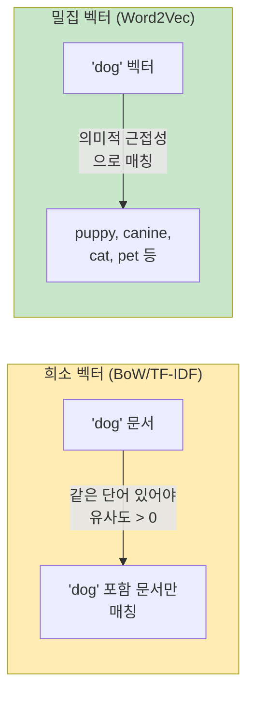
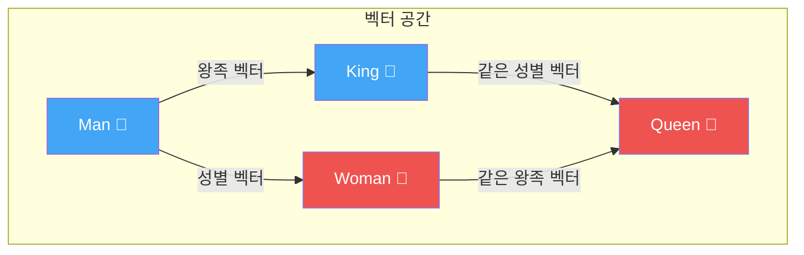
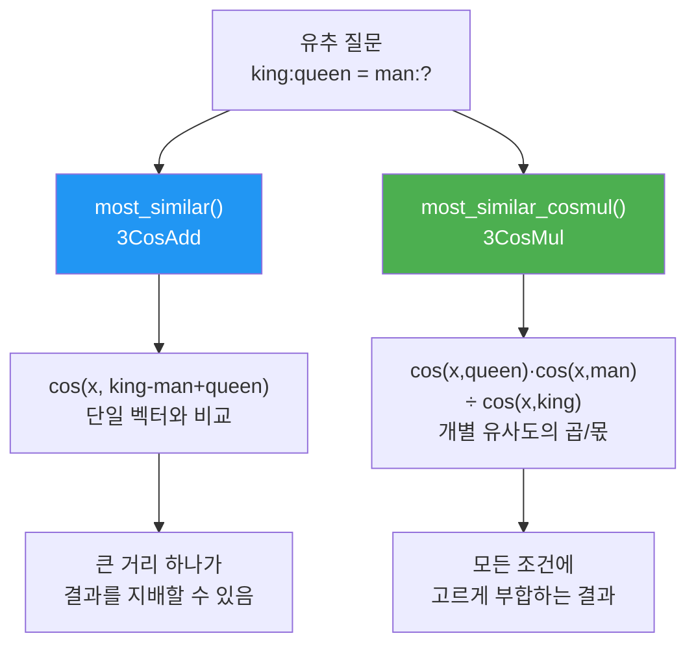
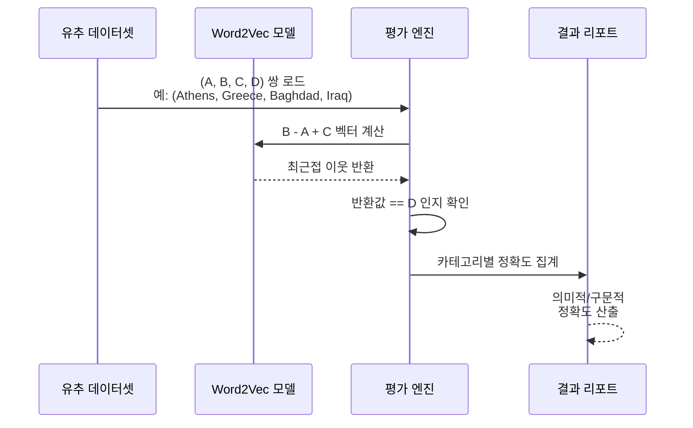
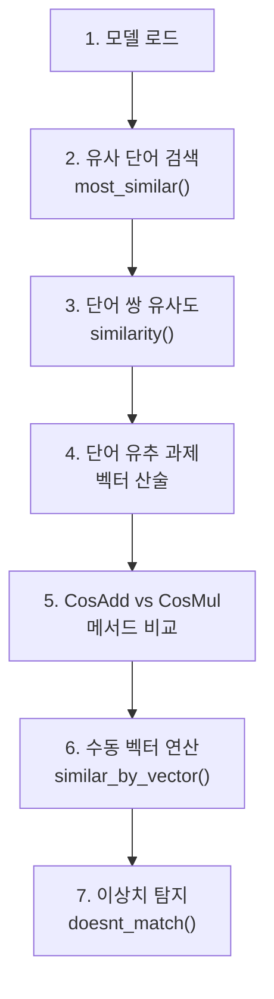

# 임베딩 활용: 유사도와 유추

> Word2Vec 임베딩의 코사인 유사도 검색과 벡터 산술 연산으로 단어 간 의미 관계를 탐색한다

## 개요

이 섹션에서는 [이전 섹션](05-ch5-워드-임베딩-word2vec/03-03-gensim으로-word2vec-학습하기.md)에서 학습한 Word2Vec 모델을 본격적으로 **활용**하는 방법을 다룹니다. 단어 간 유사도를 측정하고, 유명한 "King - Man + Woman = Queen" 유추 과제를 직접 수행하며, 임베딩 벡터의 산술 연산이 왜 의미를 갖는지 깊이 이해합니다.

**선수 지식**: Gensim Word2Vec 모델 학습 및 `most_similar()` 기본 사용법, [코사인 유사도 개념](03-ch3-텍스트-표현-bow와-tf-idf/05-05-문서-유사도와-검색.md)
**학습 목표**:
- `most_similar()`와 `most_similar_cosmul()`의 차이를 이해하고 적절히 선택할 수 있다
- 벡터 산술 연산으로 단어 유추(Word Analogy) 과제를 수행할 수 있다
- `evaluate_word_analogies()`로 임베딩 품질을 체계적으로 평가할 수 있다
- 임베딩 산술이 작동하는 원리를 직관적으로 설명할 수 있다

## 왜 알아야 할까?

워드 임베딩을 학습하는 것 자체는 절반에 불과합니다. 진짜 가치는 **활용**에서 나옵니다. 검색 엔진에서 "비슷한 단어" 추천, 챗봇에서 사용자 의도 매칭, 추천 시스템에서 아이템 유사도 계산 — 이 모든 것의 기반이 임베딩 유사도 검색이거든요.

특히 벡터 산술 연산은 단순한 트릭이 아닙니다. 임베딩이 **의미적 관계를 선형 구조로 인코딩**한다는 놀라운 사실을 보여주는 증거이며, 이것이 이후 [BERT](16-ch16-bert-양방향-사전학습-모델/01-01-사전학습과-파인튜닝-패러다임.md)와 [GPT](17-ch17-gpt-생성적-사전학습-모델/01-01-자기회귀-언어-모델링.md)까지 이어지는 "벡터 공간에서의 의미 표현"이라는 핵심 아이디어의 출발점입니다.

## 핵심 개념

### 개념 1: 밀집 벡터에서의 유사도 검색 — `most_similar()`

> 💡 **비유**: 도서관 사서에게 "이 책과 비슷한 책 추천해주세요"라고 하면, 사서는 장르, 주제, 문체 등 **여러 차원**을 종합적으로 비교합니다. `most_similar()`도 마찬가지로 300차원의 의미 공간에서 가장 가까운 이웃을 찾아주는 사서 역할을 합니다.

[Ch3에서 배운 코사인 유사도](03-ch3-텍스트-표현-bow와-tf-idf/05-05-문서-유사도와-검색.md)를 기억하시죠? 두 벡터 사이의 각도를 기준으로 -1(정반대)에서 1(완전 동일)까지 유사도를 측정하는 방법이었습니다. Gensim의 `most_similar()`도 내부적으로 동일한 코사인 유사도를 사용하는데요, **밀집 벡터**에서는 희소 벡터(BoW, TF-IDF)와는 질적으로 다른 결과를 보여줍니다.

희소 벡터에서의 코사인 유사도는 **같은 단어가 등장하는지**를 비교했다면, 밀집 벡터에서는 **의미적으로 비슷한 단어**까지 높은 유사도를 갖습니다. "dog"와 "puppy"는 BoW에서는 완전히 다른 벡터이지만, Word2Vec에서는 매우 가까운 벡터를 갖게 되죠. 이것이 밀집 표현의 핵심 장점입니다.

> 📊 **그림 1**: 밀집 벡터 유사도 검색 — 희소 벡터와의 차이



```run:python
from gensim.models import KeyedVectors
import gensim.downloader as api

# 사전학습된 Word2Vec 모델 로드 (Google News 일부)
wv = api.load('word2vec-google-news-300')

# 'king'과 가장 유사한 단어 5개 검색
results = wv.most_similar('king', topn=5)
for word, score in results:
    print(f"  {word:15s} {score:.4f}")
```

```output
  kings           0.7139
  queen           0.6511
  monarch         0.6413
  crown_prince    0.6204
  prince          0.6160
```

`most_similar()`의 핵심 파라미터를 정리하면:

| 파라미터 | 설명 | 기본값 |
|----------|------|--------|
| `positive` | 유사도에 양의 기여를 하는 단어 리스트 | 필수 |
| `negative` | 유사도에 음의 기여를 하는 단어 리스트 | `[]` |
| `topn` | 반환할 결과 수 (`None`이면 전체) | 10 |
| `restrict_vocab` | 상위 N개 단어로 검색 범위 제한 | `None` |

> ⚠️ **흔한 오해**: `most_similar()`가 유클리드 거리를 사용한다고 생각하는 분이 많은데요, 실제로는 **코사인 유사도**를 사용합니다. 고차원 공간에서는 유클리드 거리보다 코사인 유사도가 방향성(의미적 관계)을 더 잘 포착하기 때문이죠. 코사인 유사도의 수학적 정의와 직관은 [문서 유사도와 검색](03-ch3-텍스트-표현-bow와-tf-idf/05-05-문서-유사도와-검색.md)에서 자세히 다루었습니다.

### 개념 2: 벡터 산술과 단어 유추 (Word Analogy)

> 💡 **비유**: 단어 유추는 마치 **지도에서 이동하는 것**과 같습니다. "서울에서 도쿄로 가는 방향"을 알면, "베이징에서 같은 방향으로 이동하면 어디에 도착할까?"라고 물을 수 있죠. 벡터 공간에서도 "Man → Woman 방향"을 알면, "King에서 같은 방향으로 이동하면?" → Queen에 도착합니다.

Word2Vec의 가장 놀라운 발견은 단어 벡터 간의 **산술 연산**이 의미를 갖는다는 것입니다. Mikolov 등의 2013년 논문에서 처음 제시된 이 발견은 NLP 커뮤니티에 큰 충격을 주었습니다.

$$\vec{king} - \vec{man} + \vec{woman} \approx \vec{queen}$$

이 식이 의미하는 바는 이렇습니다: "king"에서 "남성"이라는 의미 성분을 빼고, "여성"이라는 의미 성분을 더하면, "여왕"에 해당하는 벡터에 가장 가깝게 도달한다는 것이죠.

> 📊 **그림 2**: 벡터 산술 연산의 기하학적 의미



이 평행사변형 구조가 핵심입니다. Man→Woman의 방향 벡터와 King→Queen의 방향 벡터가 거의 같다는 것은, 임베딩이 **"성별"이라는 의미 축**을 자연스럽게 학습했음을 보여줍니다.

```run:python
# 단어 유추: king - man + woman = ?
result = wv.most_similar(positive=['king', 'woman'], negative=['man'], topn=3)
print("king - man + woman = ?")
for word, score in result:
    print(f"  {word:15s} {score:.4f}")
```

```output
king - man + woman = ?
  queen           0.7118
  monarch         0.6190
  princess        0.5902
```

다양한 유형의 유추 과제를 시도해 볼 수 있습니다:

```python
# 국가-수도 관계: Paris - France + Japan = ?
print("Paris - France + Japan =", 
      wv.most_similar(positive=['Paris', 'Japan'], negative=['France'], topn=1))

# 비교급 관계: bigger - big + small = ?
print("bigger - big + small =",
      wv.most_similar(positive=['bigger', 'small'], negative=['big'], topn=1))

# 과거형 관계: walked - walk + swim = ?
print("walked - walk + swim =",
      wv.most_similar(positive=['walked', 'swim'], negative=['walk'], topn=1))
```

> 💡 **알고 계셨나요?**: 원래 논문에서 유추 과제를 풀 때, 입력 단어(king, man, woman)는 결과에서 **제외**합니다. 만약 제외하지 않으면 `king - man + woman`의 최근접 이웃이 "king" 자기 자신이 되어버리거든요. Gensim의 `most_similar()`는 이를 자동으로 처리해줍니다.

### 개념 3: `most_similar()` vs `most_similar_cosmul()`

> 💡 **비유**: `most_similar()`가 **평균 점수**로 학생을 평가하는 것이라면, `most_similar_cosmul()`은 **각 과목 점수의 곱**으로 평가하는 것입니다. 평균은 한 과목에서 극단적으로 높은 점수가 전체를 지배할 수 있지만, 곱은 모든 과목에서 고르게 잘해야 높은 점수를 받죠.

Gensim은 유추 과제를 위해 두 가지 방법을 제공합니다:

| 메서드 | 수식 | 특징 |
|--------|------|------|
| `most_similar()` | $\arg\max_b \cos(b, a^* - a + b^*)$ | 3CosAdd, 덧셈 기반 |
| `most_similar_cosmul()` | $\arg\max_b \frac{\cos(b, b^*) \cdot \cos(b, a)}{\cos(b, a^*)}$ | 3CosMul, 곱셈 기반 |

Levy & Goldberg (2014)가 제안한 `most_similar_cosmul()`은 곱셈 기반 목적 함수를 사용해, 하나의 큰 유사도 값이 결과를 지배하는 문제를 완화합니다.

> 📊 **그림 3**: 두 유사도 메서드의 비교



```python
# 두 메서드 비교
print("=== most_similar (3CosAdd) ===")
result_add = wv.most_similar(positive=['king', 'woman'], negative=['man'], topn=3)
for word, score in result_add:
    print(f"  {word:15s} {score:.4f}")

print("\n=== most_similar_cosmul (3CosMul) ===")
result_mul = wv.most_similar_cosmul(positive=['king', 'woman'], negative=['man'], topn=3)
for word, score in result_mul:
    print(f"  {word:15s} {score:.4f}")
```

대부분의 경우 두 메서드는 비슷한 결과를 주지만, 어려운 유추 문제에서는 `most_similar_cosmul()`이 더 정확한 경향이 있습니다.

### 개념 4: 체계적 유추 평가 — `evaluate_word_analogies()`

Gensim은 표준 유추 데이터셋으로 임베딩 품질을 자동 평가하는 기능을 제공합니다. Google에서 공개한 `questions-words.txt` 데이터셋이 대표적인데, 약 20,000개의 유추 질문이 의미적(Semantic)과 구문적(Syntactic) 카테고리로 나뉘어 있습니다.

> 📊 **그림 4**: 단어 유추 평가 프로세스



```python
# Google 유추 데이터셋으로 평가
# 데이터셋 다운로드 (한 번만 필요)
import urllib.request
url = "https://raw.githubusercontent.com/nicholas-leonard/word2vec/master/questions-words.txt"
urllib.request.urlretrieve(url, "questions-words.txt")

# 평가 실행 (restrict_vocab으로 속도 조절)
analogy_scores = wv.evaluate_word_analogies(
    "questions-words.txt",
    restrict_vocab=300000  # 상위 30만 단어로 제한
)

# 전체 정확도
overall_accuracy = analogy_scores[0]
print(f"전체 유추 정확도: {overall_accuracy:.4f}")

# 카테고리별 정확도
for section in analogy_scores[1]:
    correct = len(section['correct'])
    incorrect = len(section['incorrect'])
    total = correct + incorrect
    if total > 0:
        acc = correct / total
        print(f"  {section['section']:30s} {acc:.3f} ({correct}/{total})")
```

유추 데이터셋은 크게 두 카테고리로 나뉩니다:

| 카테고리 | 예시 | 관계 유형 |
|----------|------|-----------|
| **의미적(Semantic)** | Athens:Greece = Baghdad:Iraq | 국가-수도, 성별 등 |
| **구문적(Syntactic)** | big:bigger = small:smaller | 비교급, 과거형 등 |

## 실습: 직접 해보기

이제 실제 사전학습 모델을 활용해 다양한 유사도·유추 실험을 수행해봅시다.

> 📊 **그림 5**: 실습 전체 흐름 — 7단계 임베딩 활용 실험




```python
import gensim.downloader as api
import numpy as np

# ========================================
# 1. 사전학습 모델 로드
# ========================================
print("모델 로딩 중... (약 1.5GB, 처음만 시간이 걸립니다)")
wv = api.load('word2vec-google-news-300')
print(f"어휘 크기: {len(wv):,}")
print(f"벡터 차원: {wv.vector_size}")

# ========================================
# 2. 기본 유사도 탐색
# ========================================
print("\n=== 유사 단어 검색 ===")
query_words = ['computer', 'happy', 'dog']
for word in query_words:
    similar = wv.most_similar(word, topn=5)
    print(f"\n'{word}'과 유사한 단어:")
    for w, s in similar:
        print(f"  {w:20s} {s:.4f}")

# ========================================
# 3. 단어 쌍 유사도 직접 비교
# ========================================
print("\n=== 단어 쌍 유사도 ===")
pairs = [
    ('cat', 'dog'),      # 동물 — 비교적 유사
    ('cat', 'car'),      # 관련 없음
    ('good', 'great'),   # 유의어
    ('good', 'bad'),     # 반의어 (그래도 같은 맥락!)
]
for w1, w2 in pairs:
    sim = wv.similarity(w1, w2)
    print(f"  {w1:8s} ↔ {w2:8s} = {sim:.4f}")

# ========================================
# 4. 다양한 유추 과제
# ========================================
print("\n=== 단어 유추 과제 ===")
analogies = [
    # (a, b, c) → a:b = c:?
    ('man', 'woman', 'king'),       # 성별
    ('France', 'Paris', 'Japan'),   # 국가-수도
    ('big', 'bigger', 'small'),     # 비교급
    ('walk', 'walked', 'go'),       # 과거형
    ('apple', 'fruit', 'dog'),      # 상위 개념
]

for a, b, c in analogies:
    # b - a + c = ?
    result = wv.most_similar(positive=[b, c], negative=[a], topn=1)
    answer, score = result[0]
    print(f"  {a}:{b} = {c}:{answer} (유사도: {score:.4f})")

# ========================================
# 5. cosmul과 비교
# ========================================
print("\n=== CosAdd vs CosMul 비교 ===")
test_cases = [
    (['king', 'woman'], ['man']),
    (['Paris', 'Japan'], ['France']),
    (['bigger', 'small'], ['big']),
]

for pos, neg in test_cases:
    add_result = wv.most_similar(positive=pos, negative=neg, topn=1)[0]
    mul_result = wv.most_similar_cosmul(positive=pos, negative=neg, topn=1)[0]
    query = f"{neg[0]}→{pos[0]} + {pos[1]}"
    print(f"  {query:25s} | CosAdd: {add_result[0]:12s} | CosMul: {mul_result[0]}")

# ========================================
# 6. 직접 벡터 연산하기 (수동 방식)
# ========================================
print("\n=== 수동 벡터 산술 ===")
# king - man + woman 벡터를 직접 계산
vec = wv['king'] - wv['man'] + wv['woman']

# 결과 벡터와 가장 가까운 단어 찾기
result = wv.similar_by_vector(vec, topn=5)
print("king - man + woman =")
for word, score in result:
    # 입력 단어 표시
    marker = " ← (입력)" if word in ['king', 'man', 'woman'] else ""
    print(f"  {word:15s} {score:.4f}{marker}")

# ========================================
# 7. doesn't_match로 이상한 단어 찾기
# ========================================
print("\n=== 이상한 단어 찾기 ===")
groups = [
    ['breakfast', 'lunch', 'dinner', 'computer'],
    ['cat', 'dog', 'horse', 'airplane'],
    ['red', 'green', 'blue', 'happy'],
]
for group in groups:
    outlier = wv.doesnt_match(group)
    print(f"  {group} → 이상한 단어: '{outlier}'")
```

> 🔥 **실무 팁**: `similar_by_vector()`를 사용하면 임의의 벡터에 대해 가장 가까운 단어를 찾을 수 있습니다. 이를 활용하면 문서 벡터(단어 벡터들의 평균)에서 "이 문서를 대표하는 키워드"를 추출하는 등의 응용이 가능합니다.

## 더 깊이 알아보기

### "King - Man + Woman = Queen"의 탄생

이 유명한 예시는 Tomas Mikolov가 2013년에 Google Brain에서 발표한 두 편의 논문에서 세상에 알려졌습니다. 첫 번째 논문 "Efficient Estimation of Word Representations in Vector Space"에서 Word2Vec 모델을 제안하고, 두 번째 논문 "Linguistic Regularities in Continuous Space Word Representations"에서 벡터 산술이 언어적 규칙성을 포착한다는 사실을 보여주었죠.

사실 Mikolov도 처음에는 이 결과가 우연이 아닐까 의심했다고 합니다. 하지만 수만 개의 유추 질문으로 체계적으로 테스트한 결과, 임베딩이 성별, 시제, 국가-수도 등 다양한 의미 관계를 **일관되게** 선형 구조로 인코딩한다는 것이 확인되었습니다.

### 3CosMul의 등장

2014년, Omer Levy와 Yoav Goldberg는 "Linguistic Regularities in Sparse and Explicit Word Representations" 논문에서 기존의 덧셈 기반 유추 풀이(3CosAdd)의 약점을 지적했습니다. 하나의 큰 코사인 유사도 값이 나머지를 압도할 수 있다는 것이죠. 그들이 제안한 곱셈 기반 방법(3CosMul)은 이 문제를 해결하여 유추 정확도를 향상시켰고, Gensim의 `most_similar_cosmul()`로 구현되었습니다.

### 유추가 항상 성공하는 건 아니다

최근 연구들은 "King - Man + Woman = Queen"이 다소 **과대평가**되었다는 점도 지적합니다. 실제로는 입력 단어의 빈도, 코퍼스 편향, 벡터 공간의 비균등성 등 여러 요인이 영향을 미치며, 모든 의미 관계가 깔끔한 평행사변형을 이루지는 않습니다. 하지만 이 발견이 NLP 연구의 방향을 바꾼 것은 분명한 사실입니다.

## 흔한 오해와 팁

> ⚠️ **흔한 오해**: "임베딩 산술이 완벽하게 작동한다"고 생각하기 쉽지만, 실제 정확도는 Google News Word2Vec 모델 기준으로 의미적 유추 약 73%, 구문적 유추 약 65% 수준입니다. "King - Man + Woman"이 항상 "Queen"을 반환하는 것은 이 모델이 충분히 크고 좋은 코퍼스로 학습되었기 때문이지, 모든 유추가 성공하는 것은 아닙니다.

> 💡 **알고 계셨나요?**: `wv.similarity('good', 'bad')`의 유사도가 꽤 높게 나옵니다 (보통 0.6 이상). 반의어인데 왜 유사할까요? [분포 가설](05-ch5-워드-임베딩-word2vec/01-01-분포-가설과-밀집-벡터-표현.md) 때문입니다! "good"과 "bad"는 거의 동일한 문맥에서 등장하기 때문에("The movie was good/bad") 유사한 벡터를 갖게 됩니다. Word2Vec은 **의미의 유사성**이 아니라 **문맥의 유사성**을 학습하는 것이죠.

> 🔥 **실무 팁**: 유추 과제의 정확도를 높이려면 `restrict_vocab` 파라미터를 활용하세요. 희귀 단어는 학습 데이터가 부족해 벡터 품질이 낮으므로, 빈도 상위 N개 단어로 검색 범위를 제한하면 노이즈가 줄어듭니다. 보통 `restrict_vocab=50000` 정도면 좋은 출발점입니다.

## 핵심 정리

| 개념 | 설명 |
|------|------|
| `most_similar()` | 코사인 유사도 기반으로 가장 유사한 단어를 반환. positive/negative로 벡터 산술 지원 |
| `most_similar_cosmul()` | 곱셈 기반 유사도(3CosMul). 큰 거리 값의 지배 문제를 완화 |
| 밀집 vs 희소 유사도 | 희소 벡터는 동일 단어 등장 여부로 비교, 밀집 벡터는 의미적 근접성까지 포착 |
| 벡터 산술 | $\vec{B} - \vec{A} + \vec{C} \approx \vec{D}$로 의미 관계를 포착. A:B = C:D 형태의 유추 |
| `evaluate_word_analogies()` | 표준 데이터셋으로 의미적/구문적 유추 정확도를 체계적으로 평가 |
| `similar_by_vector()` | 임의의 벡터에 대해 가장 가까운 단어를 검색. 벡터 연산 결과 해석에 활용 |
| `doesnt_match()` | 단어 리스트에서 의미적으로 가장 거리가 먼 이상치(outlier)를 찾아 반환 |
| 반의어 유사도 | 분포 가설 특성상 반의어도 높은 유사도를 보임. 문맥 유사성 ≠ 의미 유사성 |

## 다음 섹션 미리보기

임베딩이 의미를 잘 포착하는지 *숫자*로만 확인했는데, 사람의 눈으로 직접 *볼* 수는 없을까요? [다음 섹션](05-ch5-워드-임베딩-word2vec/05-05-임베딩-시각화와-품질-평가.md)에서는 t-SNE와 PCA를 활용해 고차원 임베딩을 2D로 시각화하고, 벡터 공간에서 단어들이 어떻게 군집을 이루는지 눈으로 확인합니다. 또한 인간 평가 데이터셋(SimLex-999, WordSim-353)으로 임베딩 품질을 정량적으로 비교 평가하는 방법도 배웁니다.

## 참고 자료

- [Gensim KeyedVectors API 문서](https://radimrehurek.com/gensim/models/keyedvectors.html) - `most_similar()`, `most_similar_cosmul()`, `evaluate_word_analogies()` 등 전체 API 레퍼런스
- [The Illustrated Word2Vec (Jay Alammar)](https://jalammar.github.io/illustrated-word2vec/) - 워드 임베딩의 유사도와 산술 연산을 직관적인 시각 자료로 설명하는 필수 가이드
- [Distributed Representations of Words and Phrases and their Compositionality (Mikolov et al., 2013)](https://proceedings.neurips.cc/paper/2013/file/9aa42b31882ec039965f3c4923ce901b-Paper.pdf) - Word2Vec의 핵심 논문. 벡터 산술과 유추 과제를 최초로 체계적으로 분석
- [Linguistic Regularities in Sparse and Explicit Word Representations (Levy & Goldberg, 2014)](https://aclanthology.org/W14-1618.pdf) - 3CosMul 방법을 제안한 논문. `most_similar_cosmul()`의 이론적 배경
- [Gensim Word2Vec 튜토리얼](https://radimrehurek.com/gensim/auto_examples/tutorials/run_word2vec.html) - 공식 튜토리얼에서 유추 평가와 활용법을 다루는 실습 가이드

---
### 🔗 Related Sessions
- [cosine_similarity](03-ch3-텍스트-표현-bow와-tf-idf/05-05-문서-유사도와-검색.md) (prerequisite)
- [distributional_hypothesis](05-ch5-워드-임베딩-word2vec/01-01-분포-가설과-밀집-벡터-표현.md) (prerequisite)
- [dense_vector](05-ch5-워드-임베딩-word2vec/01-01-분포-가설과-밀집-벡터-표현.md) (prerequisite)
- [skip_gram](05-ch5-워드-임베딩-word2vec/02-02-word2vec-cbow와-skip-gram.md) (prerequisite)
- [cbow](05-ch5-워드-임베딩-word2vec/02-02-word2vec-cbow와-skip-gram.md) (prerequisite)
- [gensim_word2vec](05-ch5-워드-임베딩-word2vec/03-03-gensim으로-word2vec-학습하기.md) (prerequisite)
- [keyed_vectors](05-ch5-워드-임베딩-word2vec/03-03-gensim으로-word2vec-학습하기.md) (prerequisite)
