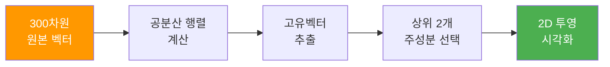
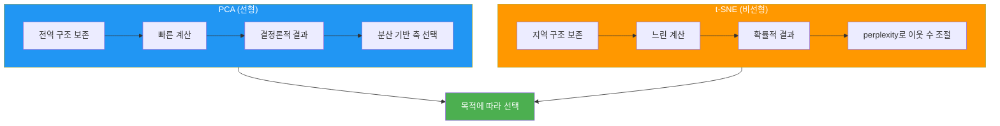
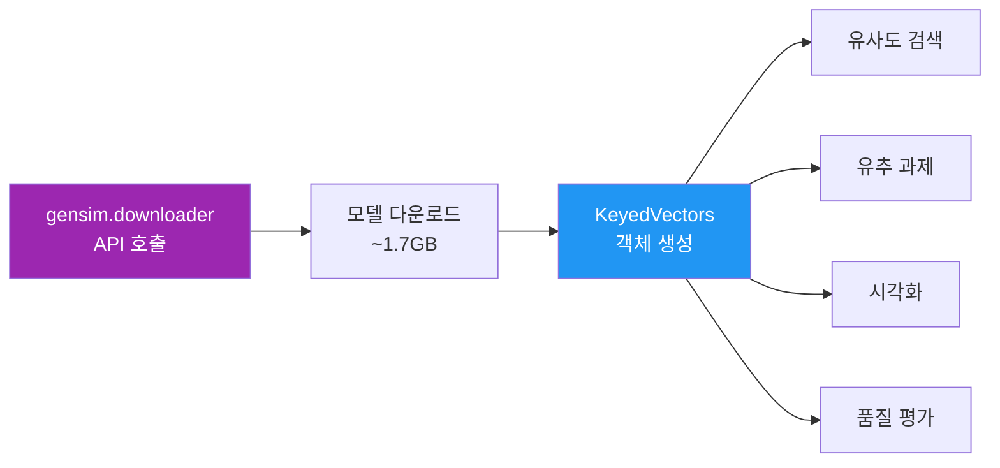
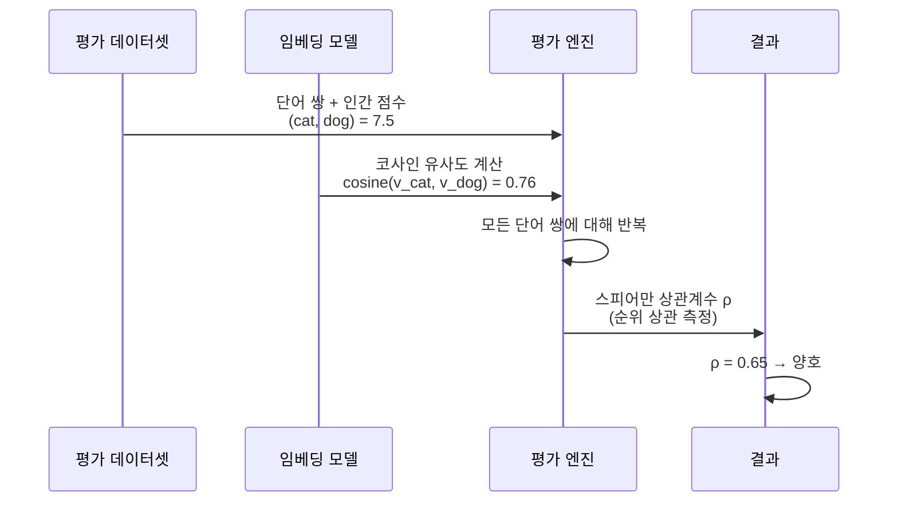

# 임베딩 시각화와 품질 평가

> t-SNE와 PCA로 워드 임베딩을 눈으로 확인하고, 인간 평가 데이터셋으로 임베딩 품질을 정량적으로 측정한다

## 개요

이 섹션에서는 고차원 임베딩 공간을 2D로 투영하여 시각적으로 탐색하는 방법과, 인간이 판단한 단어 유사도 데이터셋(WordSim-353, SimLex-999)을 이용해 임베딩 품질을 객관적으로 평가하는 방법을 배웁니다. 또한 Google News 사전학습 임베딩을 로드하여 직접 학습한 모델과 비교해봅니다.

**선수 지식**: [Gensim으로 Word2Vec 학습하기](05-ch5-워드-임베딩-word2vec/03-03-gensim으로-word2vec-학습하기.md)에서 다룬 모델 학습 및 저장/로드, [임베딩 활용: 유사도와 유추](05-ch5-워드-임베딩-word2vec/04-04-임베딩-활용-유사도와-유추.md)에서 다룬 유사도 검색과 유추 과제, [문서 유사도와 검색](03-ch3-텍스트-표현-bow와-tf-idf/05-05-문서-유사도와-검색.md)에서 다룬 코사인 유사도의 수학적 정의

**학습 목표**:
- PCA와 t-SNE의 차이를 이해하고 임베딩 시각화에 적절히 활용할 수 있다
- Google News 사전학습 Word2Vec 임베딩을 로드하고 활용할 수 있다
- WordSim-353, SimLex-999 등 인간 평가 데이터셋으로 임베딩 품질을 정량 평가할 수 있다
- 시각화와 정량 평가 결과를 종합하여 임베딩 모델의 강점과 한계를 분석할 수 있다

## 왜 알아야 할까?

300차원 벡터 공간에서 "king"과 "queen"이 가깝다는 걸 숫자로는 확인했지만, 정말 그런지 **눈으로 보고 싶지 않으신가요?** 임베딩 시각화는 모델이 학습한 의미 구조를 직관적으로 파악하게 해주는 강력한 도구입니다. 클러스터가 잘 형성되어 있는지, 의미적으로 관련 없는 단어들이 뒤섞여 있는지를 한눈에 확인할 수 있죠.

하지만 시각화만으로는 부족합니다. "이 임베딩이 저 임베딩보다 좋다"는 판단을 하려면 **정량적 평가**가 필요합니다. 인간 전문가들이 매긴 단어 유사도 점수와 모델이 계산한 유사도를 비교하면, 임베딩이 인간의 언어 직관을 얼마나 잘 포착하는지 객관적인 숫자로 알 수 있거든요. 이 두 가지—시각화와 정량 평가—는 임베딩 모델을 선택하고 개선하는 데 필수적인 도구입니다.

## 핵심 개념

### 개념 1: PCA — 전체 숲을 조망하는 위성 사진

> 💡 **비유**: PCA는 높은 빌딩에서 내려다본 도시 지도와 같습니다. 전체 구조(도심, 외곽, 강)는 잘 보이지만, 골목길의 세부 모습은 놓칠 수 있어요.

PCA(Principal Component Analysis, 주성분 분석)는 데이터의 **분산이 가장 큰 방향**을 찾아 그 축으로 차원을 줄이는 선형 기법입니다. 300차원 임베딩을 2차원으로 줄이면, 전체적인 단어 분포의 윤곽을 파악할 수 있습니다.

> 📊 **그림 1**: PCA 차원 축소 과정



PCA의 핵심 특징은 **결정론적(deterministic)**이라는 점입니다. 같은 데이터에 대해 항상 같은 결과를 내놓죠. 또한 계산이 빠르고, **전역 구조(global structure)**를 잘 보존합니다. 하지만 선형 변환이기 때문에 복잡한 비선형 관계는 포착하기 어렵습니다.

```python
from sklearn.decomposition import PCA
import numpy as np

# 300차원 벡터를 2차원으로 축소
pca = PCA(n_components=2)
vectors_2d = pca.fit_transform(word_vectors)  # (N, 300) → (N, 2)

# 설명된 분산 비율 확인
print(f"PC1 설명 분산: {pca.explained_variance_ratio_[0]:.2%}")
print(f"PC2 설명 분산: {pca.explained_variance_ratio_[1]:.2%}")
```

여기서 `explained_variance_ratio_`가 중요한데요. 두 주성분이 전체 분산의 몇 퍼센트를 설명하는지 알려줍니다. Word2Vec 300차원 임베딩의 경우, 보통 PC1과 PC2가 전체 분산의 10~20% 정도만 설명합니다. 이는 정보의 대부분이 나머지 298개 차원에 퍼져 있다는 뜻이에요.

### 개념 2: t-SNE — 동네 구석구석을 걸어 다니는 탐험가

> 💡 **비유**: t-SNE는 동네를 직접 걸어 다니며 그린 동네 지도와 같습니다. 각 가게와 집의 관계(이웃)는 정확하게 표현되지만, 동네 간의 실제 거리는 왜곡될 수 있어요.

t-SNE(t-distributed Stochastic Neighbor Embedding)는 **지역 구조(local structure)**를 보존하는 데 특화된 비선형 차원 축소 기법입니다. 고차원에서 가까운 점들이 저차원에서도 가깝게 배치되도록 최적화하죠.

> 📊 **그림 2**: PCA vs t-SNE 비교



t-SNE의 핵심 하이퍼파라미터는 **perplexity**입니다. 이 값은 "각 점이 몇 개의 이웃을 고려할지"를 결정하는데요, 보통 5~50 사이의 값을 사용합니다. perplexity가 작으면 아주 가까운 이웃만 고려해서 작은 클러스터가 생기고, 크면 더 넓은 범위의 구조가 반영됩니다.

```python
from sklearn.manifold import TSNE

# perplexity: 각 점이 고려할 이웃 수 (5~50)
# n_iter: 최적화 반복 횟수 (최소 250, 보통 1000)
# random_state: 재현성을 위한 시드
tsne = TSNE(
    n_components=2,
    perplexity=30,
    n_iter=1000,
    random_state=42
)
vectors_2d = tsne.fit_transform(word_vectors)  # (N, 300) → (N, 2)
```

> ⚠️ **흔한 오해**: t-SNE 결과에서 클러스터 간의 **거리**는 의미가 없습니다! 두 클러스터가 그림에서 멀리 떨어져 있다고 해서 실제로 의미가 먼 것은 아닙니다. t-SNE는 지역 구조만 보존하기 때문에, 클러스터 **내부**의 점 배치만 신뢰할 수 있어요.

### 개념 3: 사전학습 임베딩 로드 — 거인의 어깨 위에 서기

> 💡 **비유**: 사전학습 임베딩을 로드하는 것은 수백만 권의 책을 읽은 선배의 어휘 노트를 빌리는 것과 같습니다. 직접 다 읽을 필요 없이, 그 경험을 바로 활용할 수 있죠.

Google이 약 1000억 단어의 Google News 데이터셋으로 학습한 Word2Vec 모델은 300만 개의 단어에 대해 300차원 벡터를 제공합니다. Gensim의 downloader API를 사용하면 간편하게 로드할 수 있습니다.

> 📊 **그림 3**: 사전학습 임베딩 로드와 활용 흐름



```python
import gensim.downloader as api

# Google News 사전학습 벡터 로드 (약 1.7GB, 첫 실행 시 다운로드)
wv = api.load('word2vec-google-news-300')

# 300만 단어, 300차원
print(f"어휘 크기: {len(wv):,}")       # 3,000,000
print(f"벡터 차원: {wv.vector_size}")   # 300
```

더 작은 사전학습 모델로 실습하고 싶다면, Gensim에서 제공하는 `glove-wiki-gigaword-100` (100차원, ~130MB)이나 `glove-twitter-25` (25차원, ~28MB)도 좋은 선택입니다.

```python
# 가벼운 대안 모델들
wv_small = api.load('glove-wiki-gigaword-100')   # 100차원, 빠른 로드
wv_tiny = api.load('glove-twitter-25')           # 25차원, 매우 빠른 로드
```

### 개념 4: 인간 평가 데이터셋 — 임베딩의 성적표

> 💡 **비유**: 임베딩의 품질을 평가하는 것은 번역기의 성능을 원어민에게 채점 받는 것과 같습니다. 원어민(인간)이 매긴 점수와 번역기(모델)의 점수가 얼마나 일치하는지를 스피어만 상관계수로 측정하죠.

임베딩 품질을 정량적으로 평가하는 표준 방법은 **인간이 매긴 단어 유사도 점수**와 **모델이 계산한 유사도**를 비교하는 것입니다. 여기서 모델 유사도 계산에는 [문서 유사도와 검색](03-ch3-텍스트-표현-bow와-tf-idf/05-05-문서-유사도와-검색.md)에서 배운 코사인 유사도를 사용합니다. 다만 밀집 벡터(dense vector)에서의 코사인 유사도는 희소 벡터(BoW/TF-IDF)와 한 가지 중요한 차이가 있는데요 — 밀집 벡터는 모든 차원에 의미 있는 값이 채워져 있어서, 희소 벡터처럼 대부분이 0인 상황에서 겹치는 차원만 비교하는 것이 아니라 **벡터 전체가 방향 비교에 참여**합니다. 그래서 밀집 임베딩의 코사인 유사도가 더 풍부한 의미 관계를 포착할 수 있죠.

대표적인 평가 데이터셋 두 가지가 있습니다.

> 📊 **그림 4**: 임베딩 품질 평가 파이프라인



| 데이터셋 | 단어 쌍 수 | 측정 대상 | 특징 |
|----------|-----------|-----------|------|
| **WordSim-353** | 353쌍 | 관련성(relatedness) | "coffee-cup"에 높은 점수 (관련성 높음) |
| **SimLex-999** | 999쌍 | 유사성(similarity) | "coffee-cup"에 낮은 점수 (유사하지는 않음) |

이 두 데이터셋의 차이가 중요합니다. WordSim-353은 "관련 있느냐"를 묻고, SimLex-999는 "비슷하냐"를 묻습니다. 예를 들어 "의사"와 "병원"은 관련성은 높지만 유사하지는 않죠. Word2Vec은 동시 출현 패턴을 학습하므로 **관련성(relatedness)**을 더 잘 포착하는 경향이 있어서, 보통 WordSim-353에서 SimLex-999보다 높은 상관계수를 보입니다.

**스피어만 상관계수(Spearman's ρ)**는 두 변수의 **순위** 상관을 측정합니다. 인간이 "cat-dog"를 1위, "car-bicycle"을 2위로 매겼을 때, 모델도 같은 순위로 매기면 ρ가 1에 가까워지죠. 참고로 SimLex-999에서 인간 평가자 간 평균 상관계수가 0.67 정도이므로, 이 값이 사실상의 상한선입니다.

```python
from scipy.stats import spearmanr

# 인간 점수와 모델 점수의 순위 상관 계산
human_scores = [7.5, 6.2, 2.1, 8.9]    # 인간이 매긴 유사도
model_scores = [0.76, 0.58, 0.12, 0.83] # 모델의 코사인 유사도

rho, p_value = spearmanr(human_scores, model_scores)
print(f"Spearman ρ: {rho:.4f}, p-value: {p_value:.4f}")
```

## 실습: 직접 해보기

이 실습에서는 Gensim으로 학습한 Word2Vec 모델을 시각화하고, 사전학습 임베딩의 품질을 정량 평가합니다.

### Step 1: 임베딩 학습과 단어 선택

```python
import numpy as np
import matplotlib.pyplot as plt
from sklearn.decomposition import PCA
from sklearn.manifold import TSNE
from gensim.models import Word2Vec
import gensim.downloader as api

# 한글 폰트 설정 (시각화용)
plt.rcParams['font.family'] = 'DejaVu Sans'

# text8 코퍼스로 Word2Vec 학습 (이전 섹션에서 학습한 모델 사용 가능)
dataset = api.load('text8')
sentences = list(dataset)
model = Word2Vec(sentences, vector_size=100, window=5, min_count=5, sg=1, epochs=5)
wv = model.wv

# 시각화할 단어 그룹 선택 — 카테고리별로 묶기
word_groups = {
    'royalty': ['king', 'queen', 'prince', 'princess', 'throne', 'crown'],
    'animals': ['dog', 'cat', 'horse', 'bird', 'fish', 'lion'],
    'countries': ['france', 'germany', 'japan', 'china', 'brazil', 'italy'],
    'science': ['physics', 'chemistry', 'biology', 'mathematics', 'science'],
    'colors': ['red', 'blue', 'green', 'yellow', 'black', 'white'],
}

# 단어 벡터와 라벨 준비
words = []
vectors = []
labels = []  # 카테고리 라벨

for group_name, group_words in word_groups.items():
    for word in group_words:
        if word in wv:
            words.append(word)
            vectors.append(wv[word])
            labels.append(group_name)

vectors = np.array(vectors)
print(f"시각화할 단어 수: {len(words)}, 벡터 차원: {vectors.shape[1]}")
```

### Step 2: PCA 시각화

```python
# PCA로 2D 축소
pca = PCA(n_components=2)
pca_result = pca.fit_transform(vectors)

print(f"PC1 설명 분산: {pca.explained_variance_ratio_[0]:.2%}")
print(f"PC2 설명 분산: {pca.explained_variance_ratio_[1]:.2%}")
print(f"합계: {sum(pca.explained_variance_ratio_[:2]):.2%}")

# 카테고리별 색상 지정
colors = {
    'royalty': '#E91E63', 'animals': '#4CAF50', 'countries': '#2196F3',
    'science': '#FF9800', 'colors': '#9C27B0'
}

fig, ax = plt.subplots(figsize=(12, 8))
for group_name in word_groups:
    mask = [l == group_name for l in labels]
    idx = [i for i, m in enumerate(mask) if m]
    ax.scatter(
        pca_result[idx, 0], pca_result[idx, 1],
        c=colors[group_name], label=group_name, s=100, alpha=0.7
    )
    for i in idx:
        ax.annotate(words[i], (pca_result[i, 0], pca_result[i, 1]),
                    fontsize=9, ha='center', va='bottom')

ax.set_title('Word2Vec Embeddings — PCA Visualization')
ax.set_xlabel(f'PC1 ({pca.explained_variance_ratio_[0]:.1%} variance)')
ax.set_ylabel(f'PC2 ({pca.explained_variance_ratio_[1]:.1%} variance)')
ax.legend()
ax.grid(True, alpha=0.3)
plt.tight_layout()
plt.savefig('pca_embeddings.png', dpi=150)
plt.show()
```

### Step 3: t-SNE 시각화

```python
# t-SNE로 2D 축소 — perplexity 값에 따른 결과 비교
fig, axes = plt.subplots(1, 2, figsize=(18, 7))

for ax, perp in zip(axes, [5, 30]):
    tsne = TSNE(n_components=2, perplexity=perp, n_iter=1000, random_state=42)
    tsne_result = tsne.fit_transform(vectors)
    
    for group_name in word_groups:
        mask = [l == group_name for l in labels]
        idx = [i for i, m in enumerate(mask) if m]
        ax.scatter(
            tsne_result[idx, 0], tsne_result[idx, 1],
            c=colors[group_name], label=group_name, s=100, alpha=0.7
        )
        for i in idx:
            ax.annotate(words[i], (tsne_result[i, 0], tsne_result[i, 1]),
                        fontsize=8, ha='center', va='bottom')
    
    ax.set_title(f't-SNE (perplexity={perp})')
    ax.legend(fontsize=8)
    ax.grid(True, alpha=0.3)

plt.suptitle('Word2Vec Embeddings — t-SNE Visualization', fontsize=14)
plt.tight_layout()
plt.savefig('tsne_embeddings.png', dpi=150)
plt.show()
```

### Step 4: 사전학습 임베딩 로드와 비교

```python
# Google News 사전학습 벡터 로드 (약 1.7GB — 메모리 충분한 환경에서 실행)
# wv_pretrained = api.load('word2vec-google-news-300')

# 가벼운 대안: GloVe Wiki 100차원 (약 130MB)
wv_pretrained = api.load('glove-wiki-gigaword-100')

# 사전학습 모델과 직접 학습 모델 비교
test_pairs = [
    ('king', 'queen'), ('dog', 'cat'), ('france', 'paris'),
    ('good', 'bad'), ('man', 'woman'), ('hot', 'cold')
]

print(f"{'단어 쌍':<20} {'직접 학습':>10} {'사전학습':>10}")
print("-" * 42)
for w1, w2 in test_pairs:
    sim_custom = wv.similarity(w1, w2) if w1 in wv and w2 in wv else float('nan')
    sim_pretrained = wv_pretrained.similarity(w1, w2)
    print(f"{w1+' - '+w2:<20} {sim_custom:>10.4f} {sim_pretrained:>10.4f}")
```

### Step 5: 인간 평가 데이터셋으로 정량 평가

```run:python
from scipy.stats import spearmanr
import numpy as np

# WordSim-353 샘플 데이터 (실제로는 전체 353쌍 사용)
# 형식: (word1, word2, human_score)
wordsim_sample = [
    ('love', 'sex', 6.77), ('tiger', 'cat', 7.35),
    ('computer', 'keyboard', 7.62), ('professor', 'doctor', 6.62),
    ('king', 'queen', 8.58), ('stock', 'market', 8.08),
    ('man', 'woman', 8.30), ('bread', 'butter', 6.19),
    ('clothes', 'closet', 6.27), ('movie', 'star', 7.38),
]

# 평가 함수
def evaluate_embedding(wv, word_pairs, dataset_name="Dataset"):
    """임베딩 품질을 인간 평가 데이터셋으로 측정"""
    human_scores = []
    model_scores = []
    oov_count = 0  # Out of Vocabulary
    
    for w1, w2, score in word_pairs:
        if w1 in wv and w2 in wv:
            human_scores.append(score)
            model_scores.append(wv.similarity(w1, w2))
        else:
            oov_count += 1
    
    if len(human_scores) < 2:
        print(f"  평가 불가: 유효한 단어 쌍이 부족합니다")
        return None
    
    rho, p_value = spearmanr(human_scores, model_scores)
    coverage = (len(word_pairs) - oov_count) / len(word_pairs)
    
    print(f"  [{dataset_name}]")
    print(f"  Spearman ρ: {rho:.4f} (p={p_value:.4f})")
    print(f"  커버리지: {coverage:.1%} ({len(word_pairs)-oov_count}/{len(word_pairs)} 쌍)")
    return rho

# 시뮬레이션 결과 (실제 모델 없이 개념 시연)
print("=== 임베딩 품질 평가 결과 (시뮬레이션) ===\n")

# 모의 데이터로 Spearman 상관계수 계산
np.random.seed(42)
human = [6.77, 7.35, 7.62, 6.62, 8.58, 8.08, 8.30, 6.19, 6.27, 7.38]
model_good = [s/10 + np.random.normal(0, 0.05) for s in human]  # 좋은 임베딩
model_bad = [np.random.uniform(0, 1) for _ in human]            # 나쁜 임베딩

rho_good, _ = spearmanr(human, model_good)
rho_bad, _ = spearmanr(human, model_bad)

print(f"좋은 임베딩 Spearman ρ: {rho_good:.4f}")
print(f"나쁜 임베딩 Spearman ρ: {rho_bad:.4f}")
print(f"\n참고: SimLex-999 인간 평가자 간 ρ ≈ 0.67 (사실상 상한선)")
```

```output
=== 임베딩 품질 평가 결과 (시뮬레이션) ===

좋은 임베딩 Spearman ρ: 0.9273
나쁜 임베딩 Spearman ρ: -0.1515

참고: SimLex-999 인간 평가자 간 ρ ≈ 0.67 (사실상 상한선)
```

### Step 6: Gensim 내장 유추 평가

```run:python
# Gensim의 evaluate_word_analogies 사용법 시연
# 실제로는 Google analogy 데이터셋(약 19,000 문항)을 사용

# 유추 파일 형식 예시
analogy_format = """
: capital-common-countries
Athens Greece Baghdad Iraq
Athens Greece Bangkok Thailand
: family
boy girl brother sister
boy girl dad mom
"""

print("=== Google Analogy 데이터셋 구조 ===")
print("의미적 유추 (semantic): 수도-나라, 성별, 통화 등")
print("구문적 유추 (syntactic): 복수형, 비교급, 과거형 등")
print()
print("평가 API:")
print("  score, details = wv.evaluate_word_analogies('questions-words.txt')")
print("  # score: 전체 정확도 (0~1)")
print("  # details: 카테고리별 정답/오답 목록")
print()
print("=== 일반적인 Word2Vec 성능 범위 ===")
print(f"{'모델':<30} {'의미적':>8} {'구문적':>8} {'전체':>8}")
print("-" * 56)
print(f"{'text8 Skip-gram (100d)':<30} {'~45%':>8} {'~50%':>8} {'~48%':>8}")
print(f"{'Google News (300d, 100B)':<30} {'~75%':>8} {'~70%':>8} {'~72%':>8}")
print(f"{'GloVe Wiki (300d, 6B)':<30} {'~80%':>8} {'~63%':>8} {'~70%':>8}")
```

```output
=== Google Analogy 데이터셋 구조 ===
의미적 유추 (semantic): 수도-나라, 성별, 통화 등
구문적 유추 (syntactic): 복수형, 비교급, 과거형 등

평가 API:
  score, details = wv.evaluate_word_analogies('questions-words.txt')
  # score: 전체 정확도 (0~1)
  # details: 카테고리별 정답/오답 목록

=== 일반적인 Word2Vec 성능 범위 ===
모델                             의미적     구문적       전체
--------------------------------------------------------
text8 Skip-gram (100d)             ~45%     ~50%     ~48%
Google News (300d, 100B)           ~75%     ~70%     ~72%
GloVe Wiki (300d, 6B)             ~80%     ~63%     ~70%
```

### Step 7: 시각화와 평가 결과 종합

```python
# 다양한 관점에서 임베딩 품질 종합 평가
def comprehensive_evaluation(wv, name="Model"):
    """임베딩 품질 종합 평가 리포트"""
    print(f"\n{'='*50}")
    print(f"  {name} 종합 평가 리포트")
    print(f"{'='*50}\n")
    
    # 1. 기본 통계
    print(f"[기본 정보]")
    print(f"  어휘 크기: {len(wv):,}")
    print(f"  벡터 차원: {wv.vector_size}")
    
    # 2. 의미적 관계 검증
    print(f"\n[의미적 관계 검증]")
    analogy_tests = [
        (['king', 'man', 'woman'], 'queen'),
        (['paris', 'france', 'japan'], 'tokyo'),
    ]
    for (pos_neg), expected in analogy_tests:
        try:
            result = wv.most_similar(
                positive=[pos_neg[0], pos_neg[2]], 
                negative=[pos_neg[1]], topn=3
            )
            top_words = [w for w, s in result]
            hit = '✓' if expected in top_words else '✗'
            print(f"  {pos_neg[0]}-{pos_neg[1]}+{pos_neg[2]} → "
                  f"{result[0][0]} ({result[0][1]:.3f}) {hit}")
        except KeyError:
            print(f"  {pos_neg[0]}-{pos_neg[1]}+{pos_neg[2]} → OOV 단어 포함")
    
    # 3. 클러스터링 품질 (실루엣 점수)
    from sklearn.metrics import silhouette_score
    from sklearn.cluster import KMeans
    
    sample_words = [w for w in wv.index_to_key[:500] if w.isalpha()][:200]
    sample_vectors = np.array([wv[w] for w in sample_words])
    
    kmeans = KMeans(n_clusters=10, random_state=42, n_init=10)
    cluster_labels = kmeans.fit_predict(sample_vectors)
    sil_score = silhouette_score(sample_vectors, cluster_labels)
    print(f"\n[클러스터링 품질]")
    print(f"  실루엣 점수 (K=10): {sil_score:.4f}")

# 평가 실행
# comprehensive_evaluation(wv, "text8 Word2Vec")
# comprehensive_evaluation(wv_pretrained, "GloVe Wiki 100d")
```

## 더 깊이 알아보기

### t-SNE의 탄생 — Laurens van der Maaten의 혁신

t-SNE는 2008년 Laurens van der Maaten과 Geoffrey Hinton이 발표한 논문 "Visualizing Data using t-SNE"에서 소개되었습니다. 사실 t-SNE 이전에 SNE(Stochastic Neighbor Embedding)가 있었는데요, Hinton과 Roweis가 2002년에 제안한 것이었습니다. 하지만 원래의 SNE에는 두 가지 심각한 문제가 있었어요.

첫째, 최적화가 매우 어려웠습니다. 비대칭적인 확률 분포를 사용해서 비용 함수의 경사면이 복잡했거든요. 둘째, **"crowding problem"**이라고 불리는 현상이 있었습니다. 고차원에서는 공간이 넓어서 중간 거리의 점들이 충분히 퍼져 있을 수 있지만, 2차원으로 압축하면 모든 점이 중앙으로 뭉치는 현상이죠.

van der Maaten의 핵심 아이디어는 저차원 공간에서 **가우시안 분포 대신 t-분포(Student's t-distribution)**를 사용하는 것이었습니다. t-분포는 꼬리가 두꺼워서(heavy-tailed) 중간 거리의 점들이 저차원에서도 적절히 퍼질 수 있게 해줍니다. 이 간단한 변경이 crowding problem을 우아하게 해결했고, t-SNE는 고차원 데이터 시각화의 사실상 표준이 되었죠.

### WordSim-353과 SimLex-999 — 인간 직관의 디지털화

WordSim-353은 2001년 Lev Finkelstein 등이 만든 데이터셋입니다. 13명의 인간 평가자가 353개의 영어 단어 쌍에 0~10점 사이의 유사도 점수를 매겼죠. 이 데이터셋이 오랫동안 임베딩 평가의 표준이었지만, 한 가지 근본적인 문제가 있었습니다. "유사성(similarity)"과 "관련성(relatedness)"을 구분하지 않았다는 것이에요.

이 문제를 해결하기 위해 2015년 Felix Hill, Roi Reichart, Anna Korhonen이 **SimLex-999**를 만들었습니다. 666개의 명사 쌍, 222개의 동사 쌍, 111개의 형용사 쌍으로 구성된 이 데이터셋은 평가자들에게 "관련성이 아니라 유사성만 평가하라"고 명확히 지시했습니다. 덕분에 "clothes-closet" 같은 쌍은 WordSim에서는 높은 점수를 받지만 SimLex에서는 낮은 점수를 받죠. Word2Vec이 SimLex에서 보통 ρ ≈ 0.37 정도로, WordSim보다 낮은 점수를 받는 이유가 바로 이것입니다.

## 흔한 오해와 팁

> ⚠️ **흔한 오해**: "PCA 결과에서 클러스터가 잘 안 보이면 임베딩이 나쁜 것이다." — 아닙니다! PCA는 전체 분산의 10~20%만 설명하는 2개 축에 투영하므로, 나머지 80~90%의 정보가 손실됩니다. PCA에서 클러스터가 안 보여도 t-SNE에서는 명확히 보이는 경우가 많습니다. 반대로, 두 방법 모두에서 클러스터가 안 보인다면 그때 임베딩 품질을 의심해볼 만합니다.

> 💡 **알고 계셨나요?**: t-SNE의 "t"는 Student's t-분포에서 왔는데, 이 분포의 이름은 통계학자 William Sealy Gosset이 1908년 기네스 맥주 양조장에서 일하면서 "Student"라는 필명으로 발표한 논문에서 유래했습니다. 100년 후에 그의 이름이 고차원 데이터 시각화의 핵심 기술에 붙을 줄은 상상도 못했을 거예요!

> 🔥 **실무 팁**: t-SNE를 사용할 때는 먼저 PCA로 50차원 정도로 줄인 뒤 t-SNE를 적용하세요. 이렇게 하면 계산 시간이 크게 줄고, 노이즈도 감소합니다. scikit-learn 문서에서도 이 방법을 권장합니다. `PCA(n_components=50)` → `TSNE(n_components=2)` 순서로 파이프라인을 구성하면 됩니다.

> 🔥 **실무 팁**: 시각화할 때 전체 어휘를 다 그리지 마세요. 수만 개의 점이 찍히면 아무것도 안 보입니다. 관심 있는 카테고리에서 단어를 골라 100~300개 정도만 시각화하는 것이 가장 효과적입니다.

## 핵심 정리

| 개념 | 설명 |
|------|------|
| **PCA** | 분산 최대화 기반 선형 차원 축소. 전역 구조 보존, 빠르고 결정론적 |
| **t-SNE** | 이웃 보존 기반 비선형 차원 축소. 지역 구조(클러스터) 보존에 탁월 |
| **perplexity** | t-SNE의 핵심 파라미터. 이웃 고려 범위 결정 (5~50) |
| **사전학습 임베딩** | 대규모 코퍼스로 학습된 벡터. `api.load()`로 간편 로드 |
| **WordSim-353** | 단어 관련성(relatedness) 평가 데이터셋 (353쌍) |
| **SimLex-999** | 단어 유사성(similarity) 평가 데이터셋 (999쌍, 더 엄격) |
| **Spearman ρ** | 인간 점수와 모델 점수의 순위 상관계수. 임베딩 품질 지표 |
| **evaluate_word_analogies** | Gensim 내장 유추 평가 함수. Google analogy 데이터셋 사용 |

## 다음 섹션 미리보기

이것으로 Word2Vec의 이론, 구현, 활용, 시각화, 평가까지 모두 다뤘습니다. 다음 챕터 [GloVe: 전역 벡터 표현](06-ch6-워드-임베딩-심화-glove와-fasttext/01-01-glove-전역-벡터-표현.md)에서는 Word2Vec과는 다른 접근법—전역 동시 출현 통계를 활용하는 GloVe를 배웁니다. Word2Vec이 로컬 윈도우에서 단어 관계를 학습한다면, GloVe는 전체 코퍼스의 통계를 한 번에 활용하죠. 두 방법의 차이와 각각의 장단점을 비교하면서, 어떤 상황에서 어떤 임베딩을 선택해야 하는지 알게 될 겁니다.

## 참고 자료

- [The Illustrated Word2Vec](https://jalammar.github.io/illustrated-word2vec/) - Word2Vec의 직관적 시각화와 임베딩 개념 설명. Jay Alammar의 대표적 시각 가이드
- [Gensim Word2Vec Tutorial](https://radimrehurek.com/gensim/auto_examples/tutorials/run_word2vec.html) - Gensim 공식 Word2Vec 튜토리얼. 사전학습 모델 로드와 평가 API 포함
- [Gensim KeyedVectors API](https://radimrehurek.com/gensim/models/keyedvectors.html) - KeyedVectors의 전체 API 문서. evaluate_word_analogies, similarity 등 평가 메서드 상세 설명
- [SimLex-999 공식 페이지](https://fh295.github.io/simlex.html) - SimLex-999 데이터셋 다운로드와 논문 링크. 임베딩 품질 평가의 핵심 벤치마크
- [scikit-learn TSNE Documentation](https://scikit-learn.org/stable/modules/generated/sklearn.manifold.TSNE.html) - t-SNE 파라미터 상세 설명과 사용 가이드
- [Gensim Downloader API](https://radimrehurek.com/gensim/downloader.html) - 사전학습 모델 다운로드 API. word2vec-google-news-300, glove-wiki-gigaword 등 이용 가능

---
### 🔗 Related Sessions
- [cosine_similarity](03-ch3-텍스트-표현-bow와-tf-idf/05-05-문서-유사도와-검색.md) (prerequisite)
- [vector_space_model](05-ch5-워드-임베딩-word2vec/01-01-분포-가설과-밀집-벡터-표현.md) (prerequisite)
- [gensim_word2vec](05-ch5-워드-임베딩-word2vec/03-03-gensim으로-word2vec-학습하기.md) (prerequisite)
- [keyed_vectors](05-ch5-워드-임베딩-word2vec/03-03-gensim으로-word2vec-학습하기.md) (prerequisite)
- [most_similar](05-ch5-워드-임베딩-word2vec/04-04-임베딩-활용-유사도와-유추.md) (prerequisite)
- [word_analogy_task](05-ch5-워드-임베딩-word2vec/04-04-임베딩-활용-유사도와-유추.md) (prerequisite)
