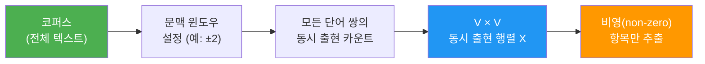
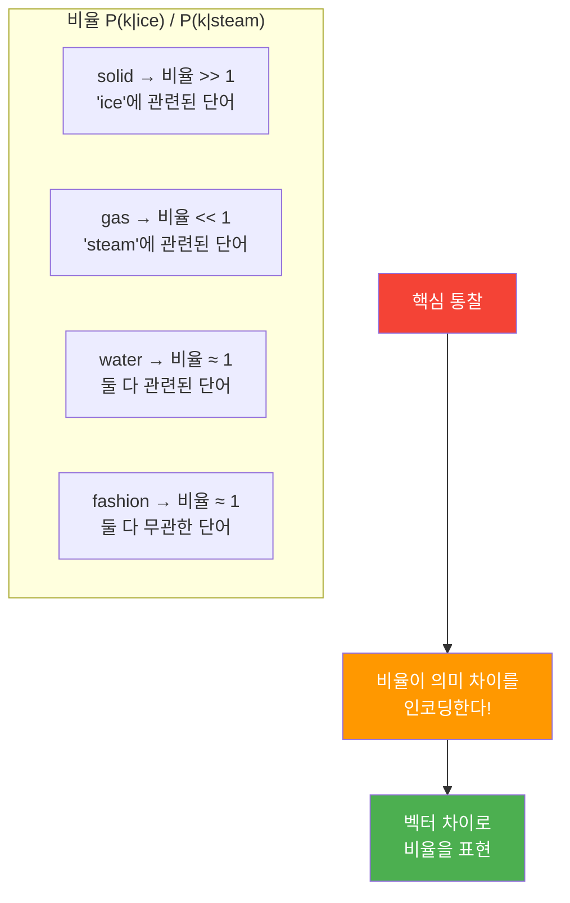
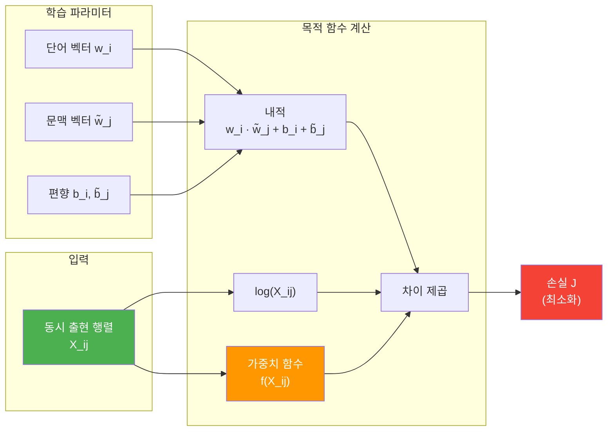
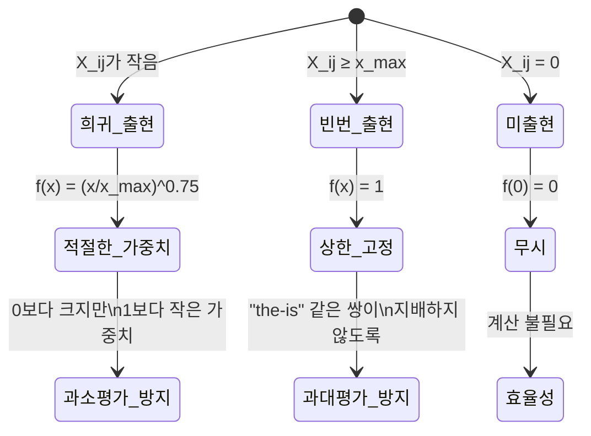
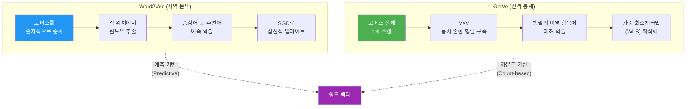

# GloVe: 전역 벡터 표현

> 전체 코퍼스의 단어 동시 출현 통계를 활용하여 의미 있는 워드 임베딩을 학습하는 GloVe 알고리즘의 원리와 구현을 알아봅니다.

## 개요

이 섹션에서는 Stanford NLP 그룹이 개발한 **GloVe(Global Vectors for Word Representation)** 알고리즘을 깊이 있게 살펴봅니다. 앞서 [분포 가설과 밀집 벡터 표현](05-ch5-워드-임베딩-word2vec/01-분포-가설과-밀집-벡터-표현.md)과 [Word2Vec: CBOW와 Skip-gram](05-ch5-워드-임베딩-word2vec/02-word2vec-cbow와-skip-gram.md)에서 배운 워드 임베딩의 기초 위에, GloVe가 **전역 통계(global statistics)**를 어떻게 활용하는지 이해합니다.

**선수 지식**: Word2Vec의 CBOW/Skip-gram 개념, 분포 가설, 벡터 공간에서의 단어 유사도

**학습 목표**:
- 동시 출현 행렬(Co-occurrence Matrix)의 개념과 구축 방법을 이해한다
- GloVe 목적 함수의 수학적 의미를 직관적으로 파악한다
- Word2Vec(지역 문맥)과 GloVe(전역 통계)의 핵심 차이를 설명할 수 있다

## 왜 알아야 할까?

Word2Vec이 NLP에 혁명을 가져왔다면, GloVe는 그 혁명을 **더 견고한 이론적 토대 위에 올려놓은 알고리즘**입니다. Word2Vec은 슬라이딩 윈도우 방식으로 주변 단어를 하나씩 보면서 학습하죠. 마치 책을 한 줄씩 읽으면서 메모하는 것과 같습니다. 반면 GloVe는 **책 전체를 먼저 훑어보고**, "어떤 단어가 어떤 단어와 얼마나 자주 함께 나타나는지" 전체 통계표를 만든 다음 학습합니다.

이 차이가 왜 중요할까요? 실무에서 GloVe의 사전학습 벡터는 여전히 많은 NLP 태스크의 베이스라인으로 사용되고 있거든요. 특히 대규모 데이터에서 학습된 `glove-840B-300d`는 300차원으로 840억 토큰의 지식을 담고 있어, 딥러닝 모델의 임베딩 초기화에 널리 쓰입니다.

## 핵심 개념

### 개념 1: 동시 출현 행렬(Co-occurrence Matrix)

> 💡 **비유**: 학교 반에서 "누가 누구 옆에 자주 앉는지" 기록한 표를 상상해보세요. 한 학기 동안 모든 좌석 배치를 관찰하면, 친한 친구끼리 자주 붙어 앉는 패턴이 보일 겁니다. 동시 출현 행렬은 바로 이 "좌석 배치 통계표"와 같습니다 — 단어가 특정 문맥 안에서 얼마나 자주 함께 나타나는지를 기록한 거대한 표죠.

동시 출현 행렬 $X$는 어휘 크기 $V$에 대해 $V \times V$ 크기의 행렬입니다. 행렬의 원소 $X_{ij}$는 단어 $i$가 단어 $j$와 문맥 윈도우 내에서 함께 나타난 횟수를 의미합니다.

> 📊 **그림 1**: 동시 출현 행렬 구축 과정



예를 들어, "나는 고양이를 좋아한다. 나는 강아지도 좋아한다."라는 코퍼스에서 윈도우 크기 1로 동시 출현을 세면:

| | 나는 | 고양이를 | 좋아한다 | 강아지도 |
|---|:---:|:---:|:---:|:---:|
| **나는** | 0 | 1 | 1 | 1 |
| **고양이를** | 1 | 0 | 1 | 0 |
| **좋아한다** | 1 | 1 | 0 | 1 |
| **강아지도** | 1 | 0 | 1 | 0 |

"고양이를"과 "강아지도"가 비슷한 패턴(행 벡터)을 보이는 것이 눈에 띄죠? 둘 다 "나는"과 "좋아한다" 옆에 나타나니까요. 이것이 바로 **분포 가설**이 동시 출현 행렬에서 드러나는 방식입니다. 의미가 비슷한 단어들은 비슷한 문맥 분포를 갖고, 따라서 행렬에서 비슷한 행 벡터를 갖게 되는 거죠.

```run:python
import numpy as np
from collections import defaultdict

# 간단한 동시 출현 행렬 구축
corpus = [
    ["나는", "고양이를", "좋아한다"],
    ["나는", "강아지도", "좋아한다"],
    ["고양이를", "좋아한다", "매우"],
]

# 어휘 사전 구축
vocab = sorted(set(word for sent in corpus for word in sent))
word2idx = {w: i for i, w in enumerate(vocab)}
V = len(vocab)

# 동시 출현 행렬 (윈도우 크기 = 1)
cooccurrence = np.zeros((V, V))
window_size = 1

for sentence in corpus:
    for i, word in enumerate(sentence):
        for j in range(max(0, i - window_size), min(len(sentence), i + window_size + 1)):
            if i != j:
                cooccurrence[word2idx[word]][word2idx[sentence[j]]] += 1

print("어휘:", vocab)
print("\n동시 출현 행렬:")
print(cooccurrence)
print(f"\n행렬 크기: {V} × {V}")
print(f"비영 항목 수: {np.count_nonzero(cooccurrence)} / {V*V}")
```

```output
어휘: ['강아지도', '고양이를', '나는', '매우', '좋아한다']

동시 출현 행렬:
[[0. 0. 1. 0. 1.]
 [0. 0. 1. 1. 2.]
 [1. 1. 0. 0. 1.]
 [0. 1. 0. 0. 1.]
 [1. 2. 1. 1. 0.]]

행렬 크기: 5 × 5
비영 항목 수: 14 / 25
```

핵심은 GloVe가 이 행렬 전체를 **한 번에** 관찰한다는 점입니다. Word2Vec이 문장을 한 줄씩 읽으며 학습하는 것과 대조적이죠.

### 개념 2: 동시 출현 확률 비율의 마법

> 💡 **비유**: 두 사람의 관계를 파악할 때, 각각이 아는 사람 목록을 비교하는 것보다 **"A가 아는 사람 중 B도 아는 비율"을 다른 사람과 비교**하는 게 더 효과적입니다. GloVe는 바로 이 "비율 비교"를 통해 단어의 의미를 포착합니다.

GloVe의 핵심 통찰은 **단순한 동시 출현 확률이 아니라, 그 확률의 "비율"에 의미가 담긴다**는 것입니다.

$P(k|i)$를 단어 $i$의 문맥에서 단어 $k$가 나타날 확률이라 하면:

$$\frac{P(k|\text{ice})}{P(k|\text{steam})}$$

이 비율이 어떤 프로브(probe) 단어 $k$에 대해 어떻게 변하는지 봅시다:

| 프로브 단어 $k$ | $P(k \mid \text{ice})$ | $P(k \mid \text{steam})$ | 비율 |
|---|---|---|---|
| solid | 높음 | 낮음 | **크다** (>> 1) |
| gas | 낮음 | 높음 | **작다** (<< 1) |
| water | 높음 | 높음 | ≈ 1 |
| fashion | 낮음 | 낮음 | ≈ 1 |

> 📊 **그림 2**: 동시 출현 확률 비율의 의미



"solid"는 ice와 관련이 깊고 steam과는 관련이 적으니 비율이 크고, "gas"는 그 반대죠. "water"는 둘 다와 관련이 있으니 비율이 1에 가깝습니다. 이 **비율 패턴**이야말로 "ice"와 "steam"의 의미 차이를 정밀하게 드러냅니다.

GloVe는 이 비율을 **벡터 공간에서의 차이**로 인코딩하고자 합니다:

$$w_i^T \tilde{w}_k - w_j^T \tilde{w}_k \approx \log \frac{P(k|i)}{P(k|j)}$$

### 개념 3: GloVe 목적 함수

> 💡 **비유**: 지도를 만드는 과정을 떠올려보세요. 모든 도시 쌍의 실제 거리(동시 출현 통계)를 알고 있고, 이 정보를 2D 지도(벡터 공간)에 최대한 충실하게 반영하고 싶습니다. GloVe의 목적 함수는 "지도 위 거리가 실제 거리와 얼마나 다른지"를 측정하는 오차 함수인 셈이죠.

앞서의 비율 분석을 발전시키면, GloVe의 목적 함수가 도출됩니다:

$$J = \sum_{i,j=1}^{V} f(X_{ij}) \left( w_i^T \tilde{w}_j + b_i + \tilde{b}_j - \log X_{ij} \right)^2$$

각 기호의 의미를 살펴보면:
- $w_i$: 단어 $i$의 **단어 벡터** (word vector)
- $\tilde{w}_j$: 단어 $j$의 **문맥 벡터** (context vector)
- $b_i, \tilde{b}_j$: 각각의 **편향(bias)** 항
- $X_{ij}$: 동시 출현 횟수
- $f(X_{ij})$: **가중치 함수** — 핵심 비밀 병기!

이 목적 함수가 말하는 것은 단순합니다: **"두 단어 벡터의 내적이 그들의 동시 출현 횟수의 로그값과 같아지도록 학습하라."**

> 📊 **그림 3**: GloVe 목적 함수의 구성 요소



### 개념 4: 가중치 함수 f(x)의 역할

그런데 모든 동시 출현 쌍을 동등하게 취급해도 될까요? "the"와 "is"가 1만 번 함께 나타났다고 해서, 이 쌍에 1만 배의 중요도를 부여하면 곤란합니다. 반대로 1-2번밖에 함께 나타나지 않은 쌍은 노이즈일 가능성이 높죠.

GloVe는 **가중치 함수** $f(x)$로 이 문제를 해결합니다:

$$f(x) = \begin{cases} (x / x_{\max})^\alpha & \text{if } x < x_{\max} \\ 1 & \text{otherwise} \end{cases}$$

논문에서는 $x_{\max} = 100$, $\alpha = 3/4$를 사용했습니다.

> 📊 **그림 4**: 가중치 함수 f(x)의 동작



이 함수의 세 가지 핵심 성질:
1. **$f(0) = 0$**: 동시 출현하지 않은 쌍은 아예 무시 → 계산 효율성
2. **비감소**: 자주 함께 나타날수록 가중치가 커짐
3. **상한 존재**: $x_{\max}$ 이상이면 가중치 1로 고정 → 빈출 쌍의 과대 영향 방지

```run:python
import numpy as np

def glove_weight(x, x_max=100, alpha=0.75):
    """GloVe 가중치 함수 f(x)"""
    if x == 0:
        return 0
    elif x < x_max:
        return (x / x_max) ** alpha
    else:
        return 1.0

# 다양한 동시 출현 횟수에 대한 가중치 확인
counts = [0, 1, 5, 10, 25, 50, 75, 100, 500, 1000]
print("동시 출현 횟수 → 가중치 f(x)")
print("-" * 35)
for c in counts:
    w = glove_weight(c)
    bar = "█" * int(w * 20)
    print(f"  X_ij = {c:>5d}  →  f(x) = {w:.4f}  {bar}")
```

```output
동시 출현 횟수 → 가중치 f(x)
-----------------------------------
  X_ij =     0  →  f(x) = 0.0000  
  X_ij =     1  →  f(x) = 0.0178  
  X_ij =     5  →  f(x) = 0.0595  
  X_ij =    10  →  f(x) = 0.1000  █
  X_ij =    25  →  f(x) = 0.1986  ███
  X_ij =    50  →  f(x) = 0.3344  ██████
  X_ij =    75  →  f(x) = 0.4545  █████████
  X_ij =   100  →  f(x) = 1.0000  ████████████████████
  X_ij =   500  →  f(x) = 1.0000  ████████████████████
  X_ij =  1000  →  f(x) = 1.0000  ████████████████████
```

### 개념 5: Word2Vec vs GloVe — 지역 vs 전역

이제 두 알고리즘의 근본적인 차이를 정리해봅시다.

> 📊 **그림 5**: Word2Vec과 GloVe의 학습 방식 비교



| 기준 | Word2Vec | GloVe |
|------|----------|-------|
| **정보 활용** | 지역 문맥 (윈도우 내) | 전역 동시 출현 통계 |
| **학습 방식** | 예측 기반 (Predictive) | 카운트 기반 (Count-based) |
| **학습 단위** | 개별 (단어, 문맥) 쌍 | 동시 출현 행렬의 비영 항목 |
| **이론적 토대** | 확률적 예측 모델 | 행렬 분해 + 로그-이중선형 모델 |
| **학습 효율** | 코퍼스를 여러 에포크 순회 | 행렬 구축 1회 + 빠른 반복 학습 |
| **메모리** | 낮음 (온라인 학습) | 높음 (V×V 행렬, 희소 형태) |
| **결과 품질** | 유사 | 유사 (태스크에 따라 차이) |

사실 Pennington 등의 연구에 따르면, GloVe는 두 접근법의 **장점을 결합**하려는 시도입니다. 행렬 분해(LSA 같은 전역 방법)의 통계적 견고함과, Word2Vec(지역 윈도우 방법)의 의미 포착력을 동시에 갖추고 있죠.

## 실습: 직접 해보기

동시 출현 행렬을 구축하고 간단한 GloVe 스타일 학습을 직접 구현해봅시다.

```python
import numpy as np
from collections import defaultdict

# 1단계: 코퍼스와 어휘 사전 준비
corpus = [
    "the cat sat on the mat".split(),
    "the dog sat on the log".split(),
    "the cat chased the dog".split(),
    "the dog chased the cat".split(),
    "the cat sat on the log".split(),
    "the dog sat on the mat".split(),
]

# 어휘 사전 구축
vocab = sorted(set(word for sent in corpus for word in sent))
word2idx = {w: i for i, w in enumerate(vocab)}
idx2word = {i: w for w, i in word2idx.items()}
V = len(vocab)
print(f"어휘 크기: {V}")
print(f"어휘: {vocab}")

# 2단계: 동시 출현 행렬 구축
def build_cooccurrence(corpus, word2idx, window_size=2):
    """코퍼스에서 동시 출현 행렬을 구축합니다."""
    V = len(word2idx)
    cooc = np.zeros((V, V))
    
    for sentence in corpus:
        for i, center_word in enumerate(sentence):
            center_idx = word2idx[center_word]
            # 윈도우 내의 문맥 단어 순회
            for j in range(max(0, i - window_size), 
                          min(len(sentence), i + window_size + 1)):
                if i != j:
                    context_idx = word2idx[sentence[j]]
                    # 거리에 반비례하는 가중치 (GloVe 논문 방식)
                    distance = abs(i - j)
                    cooc[center_idx][context_idx] += 1.0 / distance
    
    return cooc

X = build_cooccurrence(corpus, word2idx, window_size=2)
print(f"\n동시 출현 행렬 (상위 좌측 5×5):")
print(np.round(X[:5, :5], 2))

# 3단계: 간단한 GloVe 학습
def train_simple_glove(cooccurrence, embed_dim=10, epochs=100, 
                       lr=0.05, x_max=100, alpha=0.75):
    """간단한 GloVe 학습 구현"""
    V = cooccurrence.shape[0]
    
    # 파라미터 초기화
    np.random.seed(42)
    W = np.random.randn(V, embed_dim) * 0.1      # 단어 벡터
    W_tilde = np.random.randn(V, embed_dim) * 0.1 # 문맥 벡터
    b = np.zeros(V)                                # 단어 편향
    b_tilde = np.zeros(V)                          # 문맥 편향
    
    # 가중치 함수
    def f(x):
        if x == 0:
            return 0
        return min(1.0, (x / x_max) ** alpha)
    
    # 비영 항목의 인덱스 추출
    nonzero_pairs = list(zip(*np.nonzero(cooccurrence)))
    
    losses = []
    for epoch in range(epochs):
        total_loss = 0
        for i, j in nonzero_pairs:
            x_ij = cooccurrence[i, j]
            weight = f(x_ij)
            
            # 예측값과 목표값
            pred = W[i].dot(W_tilde[j]) + b[i] + b_tilde[j]
            target = np.log(x_ij)
            diff = pred - target
            
            # 가중 손실
            loss = weight * diff ** 2
            total_loss += loss
            
            # 그래디언트 계산 및 업데이트
            grad_common = weight * diff
            W[i] -= lr * grad_common * W_tilde[j]
            W_tilde[j] -= lr * grad_common * W[i]
            b[i] -= lr * grad_common
            b_tilde[j] -= lr * grad_common
        
        losses.append(total_loss)
        if (epoch + 1) % 20 == 0:
            print(f"  Epoch {epoch+1:3d} | Loss: {total_loss:.4f}")
    
    # 최종 임베딩 = 단어 벡터 + 문맥 벡터 (논문 권장)
    embeddings = W + W_tilde
    return embeddings, losses

print("\nGloVe 학습 시작:")
embeddings, losses = train_simple_glove(X, embed_dim=10, epochs=100)

# 4단계: 학습된 임베딩으로 유사도 확인
from numpy.linalg import norm

def cosine_similarity(v1, v2):
    """코사인 유사도 계산"""
    return np.dot(v1, v2) / (norm(v1) * norm(v2))

print("\n--- 단어 유사도 ---")
pairs = [("cat", "dog"), ("cat", "mat"), ("sat", "chased"), ("mat", "log")]
for w1, w2 in pairs:
    sim = cosine_similarity(embeddings[word2idx[w1]], embeddings[word2idx[w2]])
    print(f"  sim({w1}, {w2}) = {sim:.4f}")
```

> 🔥 **실무 팁**: 위 코드는 GloVe의 원리를 이해하기 위한 교육용 구현입니다. 실제로는 C로 작성된 공식 GloVe 코드나, Gensim 등의 최적화된 라이브러리를 사용합니다. 하지만 이 코드로 "내적 = 로그 동시 출현"이라는 핵심 아이디어를 체감할 수 있습니다.

## 더 깊이 알아보기

### GloVe의 탄생 — Stanford NLP 그룹의 도전

2014년, Stanford NLP 그룹의 **Jeffrey Pennington**, **Richard Socher**, **Christopher Manning** 세 사람은 흥미로운 질문을 품고 있었습니다. 당시 NLP 커뮤니티에서는 두 가지 워드 임베딩 접근법이 경쟁하고 있었거든요.

한쪽에는 **LSA(잠재 의미 분석)** 같은 행렬 분해 방법이 있었습니다. 전체 코퍼스의 통계를 활용하지만 단어 유추(analogy) 같은 세밀한 의미 관계를 잘 포착하지 못했죠. 다른 한쪽에는 **Word2Vec**이 있었는데, 유추 관계는 놀랍도록 잘 잡아냈지만 지역 문맥만 보는 한계가 있었습니다.

Pennington 등은 이 두 세계의 장점을 합칠 수 있다고 생각했습니다. 그들의 핵심 통찰은 **동시 출현 확률의 "비율"이 의미를 인코딩한다**는 것이었죠. 이 간단하지만 우아한 관찰에서 GloVe의 목적 함수가 자연스럽게 도출되었습니다.

논문은 2014년 EMNLP(카타르 도하)에서 발표되었고, 단어 유추 태스크에서 **75%**의 정확도를 달성하며 기존 방법들을 능가했습니다. "Global Vectors"를 줄여 "GloVe"라는 이름을 지었는데, 전역 통계를 벡터로 압축한다는 알고리즘의 본질을 정확히 반영한 이름입니다.

> 💡 **알고 계셨나요?**: GloVe 논문의 저자 중 **Christopher Manning** 교수는 Stanford CS 224N (NLP with Deep Learning) 강의로도 유명합니다. 이 강의에서 GloVe의 수학적 배경을 직접 설명하는 영상은 수백만 뷰를 기록했죠. **Richard Socher**는 이후 AI 검색 엔진 You.com의 CEO가 되었습니다.

### 수학적 배경: 비율에서 목적 함수까지

GloVe의 목적 함수가 어떻게 도출되는지 조금 더 깊이 살펴봅시다.

$X_i = \sum_k X_{ik}$를 단어 $i$의 전체 동시 출현 횟수라 하면, 동시 출현 확률은:

$$P_{ij} = P(j|i) = \frac{X_{ij}}{X_i}$$

연구자들은 비율 $P_{ik}/P_{jk}$를 벡터 함수 $F(w_i, w_j, \tilde{w}_k)$로 표현하고자 했고, 여러 대칭성 조건과 준동형(homomorphism) 조건을 적용하면 자연스럽게:

$$w_i^T \tilde{w}_k = \log P_{ik} = \log X_{ik} - \log X_i$$

$\log X_i$를 편향 항 $b_i$로 흡수하면, 최종 목적 함수가 됩니다. 이 도출 과정이 아름다운 이유는, 직관적인 비율 분석에서 출발하여 순수하게 수학적 논리만으로 목적 함수에 도달한다는 점입니다.

## 흔한 오해와 팁

> ⚠️ **흔한 오해**: "GloVe는 Word2Vec보다 항상 더 좋다"라고 생각하기 쉽지만, 실제로는 **태스크와 데이터에 따라 다릅니다**. 소규모 도메인 특화 코퍼스에서는 Word2Vec이 더 나은 경우도 많고, 대규모 일반 코퍼스의 사전학습 벡터로는 GloVe가 강점을 보이기도 합니다. 2025년 기준으로 둘 다 베이스라인으로는 여전히 유효하지만, 대부분의 실무에서는 BERT나 트랜스포머 기반 임베딩이 더 높은 성능을 보입니다.

> 💡 **알고 계셨나요?**: GloVe의 가중치 함수에서 $\alpha = 3/4$라는 값은 사실 Word2Vec의 네거티브 샘플링에서 사용하는 $3/4$ 지수와 동일합니다. Pennington 등이 이를 의식했는지는 명확하지 않지만, 빈도 분포의 편향을 보정하는 데 $3/4$이 효과적이라는 점은 두 알고리즘 모두에서 경험적으로 확인된 셈이죠.

> 🔥 **실무 팁**: GloVe 사전학습 벡터를 사용할 때, `glove-6B-300d`(Wikipedia + Gigaword, 60억 토큰)는 빠른 프로토타이핑에 적합하고, `glove-840B-300d`(Common Crawl, 8400억 토큰)는 더 높은 커버리지가 필요할 때 사용합니다. 단, 840B 모델은 파일 크기가 약 2GB에 달하니 메모리를 고려하세요.

## 핵심 정리

| 개념 | 설명 |
|------|------|
| **동시 출현 행렬** | 전체 코퍼스에서 단어 쌍의 동시 출현 횟수를 기록한 V×V 행렬 |
| **동시 출현 확률 비율** | $P(k\|i)/P(k\|j)$의 비율이 단어 간 의미 차이를 인코딩 |
| **GloVe 목적 함수** | $w_i^T \tilde{w}_j + b_i + \tilde{b}_j \approx \log X_{ij}$를 가중 최소제곱법으로 최적화 |
| **가중치 함수 f(x)** | 희귀 쌍의 노이즈와 빈출 쌍의 과대 영향을 동시에 제어 |
| **전역 vs 지역** | GloVe는 코퍼스 전체 통계를, Word2Vec은 로컬 윈도우를 활용 |
| **최종 임베딩** | 단어 벡터 $w$ + 문맥 벡터 $\tilde{w}$의 합 (논문 권장) |

## 다음 섹션 미리보기

다음 섹션 [FastText: 서브워드 임베딩](06-ch6-워드-임베딩-심화-glove와-fasttext/02-fasttext-서브워드-임베딩.md)에서는 Facebook AI Research가 개발한 FastText를 다룹니다. GloVe와 Word2Vec이 **단어 단위**로 벡터를 학습하는 반면, FastText는 **서브워드(문자 N-그램)**를 활용해 "책상"이라는 단어를 "책", "상", "책상" 등으로 분해하여 학습합니다. 이 접근법이 미등록어(OOV) 문제를 어떻게 해결하는지 알아보겠습니다.

## 참고 자료

- [GloVe: Global Vectors for Word Representation — Stanford NLP 공식 프로젝트 페이지](https://nlp.stanford.edu/projects/glove/) - 사전학습 벡터 다운로드 및 알고리즘 소개
- [GloVe 논문 원문 (Pennington et al., 2014, EMNLP)](https://nlp.stanford.edu/pubs/glove.pdf) - 동시 출현 확률 비율에서 목적 함수를 도출하는 과정이 상세히 기술
- [Stanford CS 224N: Natural Language Processing with Deep Learning](https://web.stanford.edu/class/cs224n/) - Manning 교수의 강의에서 GloVe 관련 슬라이드 및 과제 확인 가능
- [The Illustrated Word2vec — Jay Alammar](https://jalammar.github.io/illustrated-word2vec/) - Word2Vec과 GloVe의 차이를 시각적으로 설명하는 블로그
- [ACL Anthology — GloVe 논문 페이지](https://aclanthology.org/D14-1162/) - 인용 정보 및 관련 논문 탐색

---
### 🔗 Related Sessions
- [cosine_similarity](03-ch3-텍스트-표현-bow와-tf-idf/05-05-문서-유사도와-검색.md) (prerequisite)
- [distributional_hypothesis](05-ch5-워드-임베딩-word2vec/01-01-분포-가설과-밀집-벡터-표현.md) (prerequisite)
