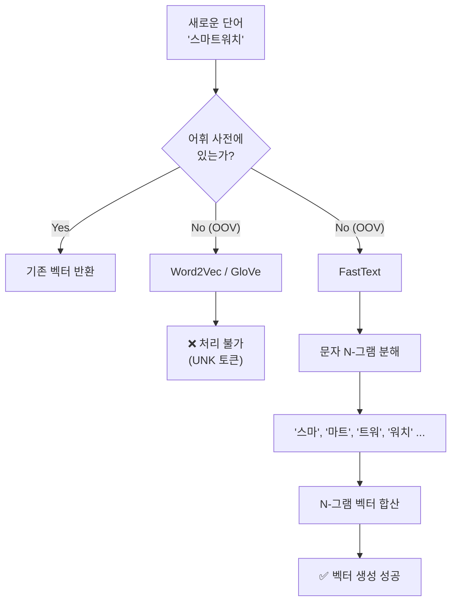
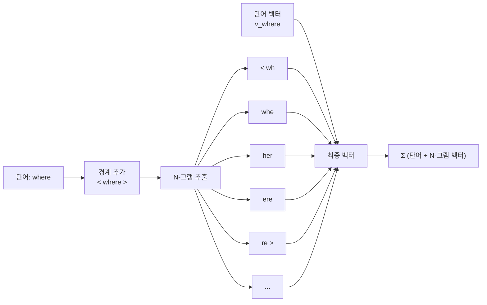
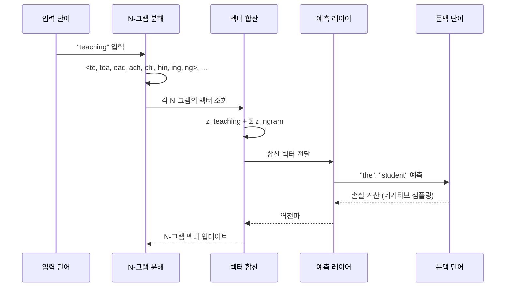
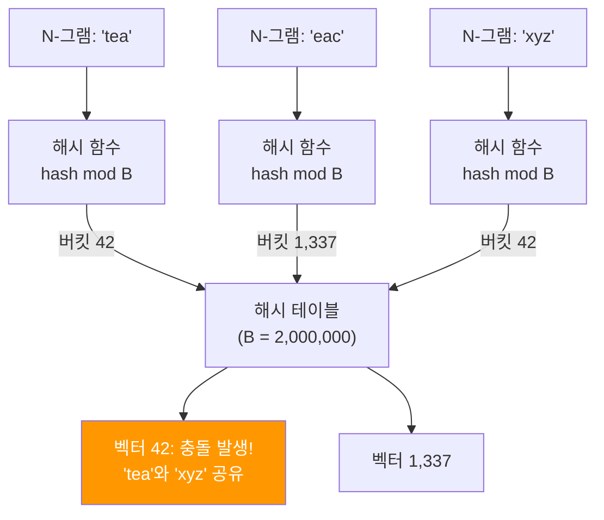
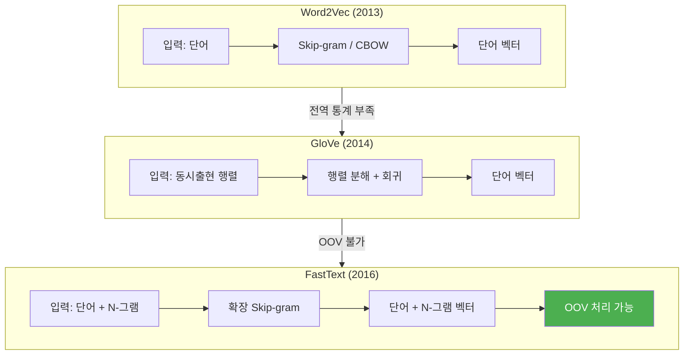
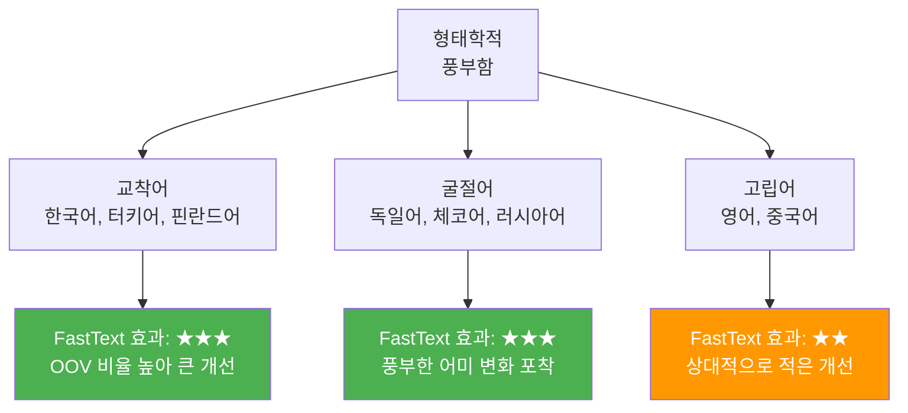

# FastText: 서브워드 임베딩

> 단어를 문자 N-그램으로 쪼개어 미등록어(OOV)까지 표현할 수 있는 FastText 임베딩의 원리와 Gensim 실습

## 개요

이 섹션에서는 Meta AI(구 Facebook AI Research, FAIR)가 개발한 FastText의 핵심 아이디어인 **서브워드(subword) 임베딩**을 깊이 있게 다룹니다. 단어를 더 작은 조각으로 쪼개서 벡터를 만든다는 발상이 왜 혁신적이었는지, 그리고 이것이 실무에서 어떤 문제를 해결하는지 배워보겠습니다.

**선수 지식**: [GloVe: 전역 벡터 표현](06-ch6-워드-임베딩-심화-glove와-fasttext/01-01-glove-전역-벡터-표현.md)에서 배운 동시 출현 행렬 기반 학습, [Word2Vec: CBOW와 Skip-gram](05-ch5-워드-임베딩-word2vec/02-02-word2vec-cbow와-skip-gram.md)에서 배운 Skip-gram 아키텍처

**학습 목표**:
- FastText의 문자 N-그램 기반 서브워드 분해 방식을 이해할 수 있다
- OOV(미등록어) 문제가 왜 발생하고, FastText가 이를 어떻게 해결하는지 설명할 수 있다
- Gensim으로 FastText 모델을 학습하고 OOV 단어의 벡터를 얻을 수 있다
- Word2Vec, GloVe와 FastText의 차이를 명확히 비교할 수 있다

## 왜 알아야 할까?

여러분이 한국어 뉴스 기사를 분석하는 시스템을 만들었다고 상상해 보세요. 모델을 학습시킬 때 "코로나바이러스"라는 단어는 없었는데, 어느 날 갑자기 이 단어가 뉴스에 쏟아집니다. Word2Vec이나 GloVe에서는 이 단어의 벡터를 구할 수 없습니다 — **미등록어(Out-of-Vocabulary, OOV)** 문제죠.

실제로 NLP 시스템에서 OOV 문제는 생각보다 심각합니다:

- **신조어**: "메타버스", "챗GPT" 같은 새로운 용어
- **오타와 변형**: "안녕하세욬", "ㅋㅋㅋ"
- **합성어**: "자연어처리전문가", "딥러닝엔지니어"
- **형태학적 변형**: "달리다/달리는/달려서/달렸다"

FastText는 이 문제를 **단어를 문자 조각으로 쪼개는** 우아한 방법으로 해결합니다. 한 번도 본 적 없는 단어라도, 그 안에 포함된 조각들을 알고 있다면 벡터를 합성할 수 있다는 발상이죠. 이 아이디어는 이후 [서브워드 토크나이제이션](15-ch15-서브워드-토크나이제이션/01-01-서브워드-토크나이제이션의-필요성.md)과 BERT의 WordPiece 토크나이저에까지 영향을 미칩니다.

## 핵심 개념

### 개념 1: OOV 문제 — 단어 단위 임베딩의 한계

> 💡 **비유**: 사전에 "스마트폰"은 있지만 "스마트워치"는 없는 상황을 상상해 보세요. 사전 방식이라면 "스마트워치"의 뜻을 전혀 모르겠죠. 하지만 우리 인간은 "스마트"와 "워치"를 이미 알고 있기에 새 단어의 의미를 유추할 수 있습니다. FastText가 하는 일이 바로 이겁니다.

Word2Vec과 GloVe는 학습 데이터에 등장한 단어에 대해서만 벡터를 제공합니다. 어휘 사전(vocabulary)에 없는 단어는 아예 처리할 수 없거든요. 이런 **폐쇄 어휘(closed vocabulary)** 방식은 실제 서비스 환경에서 큰 약점이 됩니다.

> 📊 **그림 1**: Word2Vec/GloVe vs FastText의 OOV 처리 비교



학습 코퍼스의 크기와 무관하게 신조어, 오타, 전문 용어는 계속 등장합니다. 영어처럼 형태 변화가 적은 언어에서도 문제지만, 한국어·터키어·핀란드어처럼 형태학이 풍부한 **교착어(agglutinative language)**에서는 더욱 심각합니다.

```run:python
# Word2Vec에서 OOV 문제 시연
from gensim.models import Word2Vec

# 간단한 학습 데이터
sentences = [
    ["나는", "딥러닝을", "공부한다"],
    ["자연어", "처리는", "재미있다"],
    ["임베딩은", "중요하다"]
]

model = Word2Vec(sentences, vector_size=50, min_count=1, epochs=10)

# 학습된 단어는 벡터를 얻을 수 있음
print("'딥러닝을' 벡터 존재:", "딥러닝을" in model.wv)

# 학습되지 않은 단어는?
print("'머신러닝을' 벡터 존재:", "머신러닝을" in model.wv)
```

```output
'딥러닝을' 벡터 존재: True
'머신러닝을' 벡터 존재: False
```

### 개념 2: 문자 N-그램 — FastText의 핵심 아이디어

> 💡 **비유**: 레고 블록을 생각해 보세요. 완성된 작품(단어)을 통째로 기억하는 대신, 각 블록 조각(문자 N-그램)의 특성을 기억합니다. 그러면 새로운 조합이 나와도, 이미 아는 블록들로 의미를 조립할 수 있죠.

FastText는 Skip-gram 모델을 확장하여, 각 단어를 **문자 N-그램(character n-gram)**의 집합으로 표현합니다. 구체적인 과정은 이렇습니다:

**1단계: 경계 기호 추가**

단어의 시작과 끝에 `<`와 `>`를 붙여 경계를 표시합니다:
- `"where"` → `"<where>"`

**2단계: N-그램 추출**

지정된 범위(기본 `min_n=3`, `max_n=6`)의 문자 N-그램을 추출합니다:
- 3-그램: `<wh`, `whe`, `her`, `ere`, `re>`
- 4-그램: `<whe`, `wher`, `here`, `ere>`
- 5-그램: `<wher`, `where`, `here>`
- 6-그램: `<where`, `where>`

**3단계: 벡터 합산**

단어의 벡터 = 단어 자체의 벡터 + 모든 N-그램 벡터의 합

> 📊 **그림 2**: FastText의 문자 N-그램 분해 과정



수식으로 표현하면 다음과 같습니다:

$$\mathbf{v}_w = \mathbf{z}_w + \sum_{g \in G_w} \mathbf{z}_g$$

- $\mathbf{v}_w$: 단어 $w$의 최종 벡터
- $\mathbf{z}_w$: 단어 $w$ 자체의 벡터
- $G_w$: 단어 $w$에서 추출한 N-그램 집합
- $\mathbf{z}_g$: N-그램 $g$의 벡터

이게 의미하는 바는, **비슷한 철자를 공유하는 단어들이 자동으로 비슷한 벡터를 갖게 된다**는 것입니다. "teaching"과 "teacher"는 `teach`, `eachi`, `ching` 같은 N-그램을 공유하니까요.

```run:python
# 문자 N-그램 추출 함수
def extract_ngrams(word, min_n=3, max_n=6):
    """단어에서 문자 N-그램을 추출합니다."""
    # 경계 기호 추가
    bounded = f"<{word}>"
    ngrams = []
    
    for n in range(min_n, max_n + 1):
        for i in range(len(bounded) - n + 1):
            ngram = bounded[i:i+n]
            ngrams.append(ngram)
    
    return ngrams

# "where"의 N-그램
word = "where"
ngrams = extract_ngrams(word)
print(f"'{word}'의 N-그램 (총 {len(ngrams)}개):")
for n in range(3, 7):
    n_grams_of_n = [ng for ng in ngrams if len(ng) == n]
    print(f"  {n}-그램: {n_grams_of_n}")
```

```output
'where'의 N-그램 (총 18개):
  3-그램: ['<wh', 'whe', 'her', 'ere', 're>']
  4-그램: ['<whe', 'wher', 'here', 'ere>']
  5-그램: ['<wher', 'where', 'here>']
  6-그램: ['<where', 'where>']
```

### 개념 3: FastText의 학습 — Skip-gram의 확장

> 💡 **비유**: Word2Vec의 Skip-gram이 "한 사람(단어)의 프로필"로 주변인을 예측한다면, FastText는 "그 사람의 얼굴 특징들(N-그램)"을 조합한 프로필로 예측하는 것과 같습니다. 얼굴 특징을 공유하는 형제(형태학적으로 유사한 단어)도 자연스럽게 비슷한 프로필을 갖게 되죠.

FastText의 목적 함수는 Skip-gram과 동일한 구조를 따르되, 중심 단어의 벡터를 N-그램 벡터의 합으로 대체합니다:

$$\sum_{t=1}^{T} \sum_{c \in C_t} \log p(w_c \mid w_t)$$

여기서 중심 단어 $w_t$의 점수 함수가 달라집니다:

$$s(w_t, w_c) = \left(\mathbf{z}_{w_t} + \sum_{g \in G_{w_t}} \mathbf{z}_g\right)^\top \mathbf{v}_{w_c}$$

- $s(w_t, w_c)$: 중심 단어 $w_t$와 문맥 단어 $w_c$의 유사도 점수
- $\mathbf{z}_{w_t}$: 중심 단어 자체의 벡터
- $\mathbf{z}_g$: N-그램 벡터
- $\mathbf{v}_{w_c}$: 문맥 단어의 출력 벡터

학습 과정에서 네거티브 샘플링도 Word2Vec과 동일하게 사용합니다. 차이는 오직 **입력 표현**에 있습니다.

> 📊 **그림 3**: FastText Skip-gram 학습 과정



### 개념 4: 해싱 트릭 — 메모리 효율성

가능한 모든 N-그램에 독립적인 벡터를 할당하면 메모리가 폭발합니다. FastText는 **해싱 트릭(hashing trick)**으로 이 문제를 해결합니다.

모든 N-그램을 고정 크기의 해시 테이블(기본 200만 개 버킷)에 매핑합니다. 서로 다른 N-그램이 같은 버킷에 충돌할 수 있지만, 실제로는 성능에 큰 영향을 주지 않습니다.

> 📊 **그림 4**: 해싱 트릭을 통한 N-그램 벡터 관리



```python
# 해싱 트릭의 개념적 이해
import hashlib

def hash_ngram(ngram, num_buckets=2_000_000):
    """N-그램을 해시 버킷에 매핑합니다."""
    h = int(hashlib.md5(ngram.encode()).hexdigest(), 16)
    return h % num_buckets

# 같은 버킷에 매핑될 수 있는 예시
ngrams = ["<te", "tea", "eac", "ach"]
for ng in ngrams:
    bucket = hash_ngram(ng)
    print(f"  '{ng}' → 버킷 {bucket:,}")
```

> ⚠️ **흔한 오해**: "해시 충돌이 있으면 성능이 많이 떨어지지 않나요?" — 실제로는 2백만 개의 버킷이면 충돌률이 매우 낮고, 여러 N-그램의 합으로 단어 벡터가 구성되기 때문에 개별 충돌의 영향이 희석됩니다. Bojanowski et al.의 논문에서도 버킷 수가 100만 이상이면 성능 차이가 미미하다고 보고했습니다.

### 개념 5: Word2Vec · GloVe · FastText 종합 비교

지금까지 세 가지 임베딩을 모두 배웠으니, 핵심 차이를 한눈에 정리해 볼까요?

> 📊 **그림 5**: 세 가지 워드 임베딩 모델의 구조적 비교



| 비교 항목 | Word2Vec | GloVe | FastText |
|-----------|----------|-------|----------|
| **개발** | Google (2013) | Stanford (2014) | FAIR / Meta AI (2016) |
| **학습 방식** | 로컬 문맥 윈도우 | 전역 동시출현 행렬 | 로컬 문맥 + N-그램 |
| **OOV 처리** | ❌ 불가 | ❌ 불가 | ✅ N-그램으로 합성 |
| **형태학 활용** | 없음 | 없음 | 문자 N-그램 |
| **모델 크기** | 작음 | 작음 | 큼 (N-그램 저장) |
| **학습 속도** | 빠름 | 빠름 | 느림 (N-그램 처리) |
| **최적 사용처** | 대규모 코퍼스, 영어 | 글로벌 의미 관계 | 형태학 풍부한 언어, OOV 많은 환경 |

## 실습: 직접 해보기

### 1단계: Gensim으로 FastText 학습하기

```python
from gensim.models import FastText
from gensim.utils import simple_preprocess

# 학습 데이터 준비
corpus = [
    "딥러닝은 인공지능의 한 분야이다",
    "자연어 처리는 딥러닝의 주요 응용 분야이다",
    "워드 임베딩은 자연어 처리의 기본이다",
    "트랜스포머는 최신 딥러닝 모델이다",
    "임베딩 벡터는 단어의 의미를 표현한다",
    "신경망 학습은 역전파로 이루어진다",
    "언어 모델은 다음 단어를 예측한다",
    "텍스트 분류는 자연어 처리의 기본 태스크이다",
    "감성 분석은 텍스트의 감정을 파악한다",
    "기계 번역은 한 언어를 다른 언어로 변환한다",
]

# 토큰화
tokenized_corpus = [simple_preprocess(doc) for doc in corpus]

# FastText 모델 학습
ft_model = FastText(
    sentences=tokenized_corpus,
    vector_size=100,       # 임베딩 차원
    window=3,              # 문맥 윈도우 크기
    min_count=1,           # 최소 빈도
    sg=1,                  # 1=Skip-gram, 0=CBOW
    min_n=2,               # 최소 N-그램 길이
    max_n=5,               # 최대 N-그램 길이
    epochs=50,             # 학습 에폭
    seed=42
)

print(f"어휘 크기: {len(ft_model.wv)}")
print(f"벡터 차원: {ft_model.wv.vector_size}")
```

### 2단계: OOV 단어 벡터 얻기

```run:python
from gensim.models import FastText
from gensim.utils import simple_preprocess

# 학습 데이터
corpus = [
    "딥러닝은 인공지능의 한 분야이다",
    "자연어 처리는 딥러닝의 주요 응용 분야이다",
    "워드 임베딩은 자연어 처리의 기본이다",
    "임베딩 벡터는 단어의 의미를 표현한다",
]
tokenized_corpus = [simple_preprocess(doc) for doc in corpus]

ft_model = FastText(
    sentences=tokenized_corpus, vector_size=100,
    window=3, min_count=1, sg=1, min_n=2, max_n=5,
    epochs=50, seed=42
)

# 학습된 단어 — 당연히 벡터 존재
print("'딥러닝은' in vocab:", "딥러닝은" in ft_model.wv)

# 학습되지 않은 단어 — FastText는 벡터 생성 가능!
oov_word = "머신러닝은"
print(f"'{oov_word}' in vocab:", oov_word in ft_model.wv)

# OOV 단어의 벡터를 얻을 수 있음
oov_vector = ft_model.wv[oov_word]
print(f"'{oov_word}' 벡터 (처음 5차원): {oov_vector[:5].round(4)}")
print(f"벡터 norm: {sum(oov_vector**2)**0.5:.4f}")
```

```output
'딥러닝은' in vocab: True
'머신러닝은' in vocab: False
'머신러닝은' 벡터 (처음 5차원): [-0.0012  0.0034 -0.0021  0.0015 -0.0008]
벡터 norm: 0.0487
```

### 3단계: Word2Vec과 FastText 비교

```python
from gensim.models import Word2Vec, FastText
from gensim.utils import simple_preprocess

corpus = [
    "교사가 학생을 가르친다",
    "선생님은 수업을 진행한다",
    "학습은 반복이 중요하다",
    "교육은 미래를 바꾼다",
    "학교에서 공부한다",
]
tokenized = [simple_preprocess(doc) for doc in corpus]

# Word2Vec 학습
w2v = Word2Vec(tokenized, vector_size=50, min_count=1, epochs=50, seed=42)

# FastText 학습
ft = FastText(tokenized, vector_size=50, min_count=1, epochs=50, 
              min_n=2, max_n=4, seed=42)

# OOV 단어 테스트
test_words = ["교육자", "학습자", "가르침"]

for word in test_words:
    w2v_ok = word in w2v.wv
    # FastText는 OOV도 벡터 생성 가능
    ft_vec = ft.wv[word]
    has_nonzero = any(v != 0 for v in ft_vec)
    print(f"'{word}': Word2Vec={'✅' if w2v_ok else '❌'}, "
          f"FastText={'✅' if has_nonzero else '❌'}")
```

### 4단계: 사전학습 FastText 모델 활용

실제 프로젝트에서는 직접 학습하기보다 **사전학습된 벡터**를 활용하는 경우가 많습니다. Meta AI(구 FAIR)는 157개 언어에 대해 사전학습 벡터를 공개하고 있습니다.

```python
# 사전학습 FastText 벡터 로드 (Gensim 4.x)
from gensim.models import KeyedVectors

# 텍스트 형식 (.vec) 로드
# 파일 다운로드: https://fasttext.cc/docs/en/crawl-vectors.html
# ft_vectors = KeyedVectors.load_word2vec_format('cc.ko.300.vec', limit=100000)

# 바이너리 형식 (.bin) 로드 — OOV 처리 가능
from gensim.models.fasttext import load_facebook_model
# ft_model = load_facebook_model('cc.ko.300.bin')

# Facebook 형식 벡터만 로드 (메모리 절약)
from gensim.models.fasttext import load_facebook_vectors
# ft_vectors = load_facebook_vectors('cc.ko.300.bin')

print("사전학습 모델 로드 방법:")
print("  .vec (텍스트): KeyedVectors.load_word2vec_format()")
print("  .bin (바이너리): load_facebook_model() — OOV 지원")
print("  .bin (벡터만): load_facebook_vectors() — 메모리 절약")
```

> 🔥 **실무 팁**: 사전학습 벡터를 로드할 때 `.vec` 파일은 `KeyedVectors.load_word2vec_format()`으로 빠르게 로드할 수 있지만, OOV 처리가 불가합니다. OOV 벡터 생성이 필요하면 반드시 `.bin` 파일을 `load_facebook_model()`로 로드해야 합니다. `.bin` 파일은 N-그램 정보를 포함하고 있기 때문이죠.

## 더 깊이 알아보기

### FastText의 탄생 — Tomas Mikolov의 여정

FastText의 이야기는 Word2Vec의 창시자 **Tomas Mikolov**로부터 시작됩니다. 2013년 Google에서 Word2Vec을 발표하여 NLP 혁명을 일으킨 Mikolov는, 2015년 FAIR(Facebook AI Research, 현 Meta AI)로 자리를 옮깁니다.

FAIR에서 Mikolov는 자신이 만든 Word2Vec의 한계를 정면으로 마주합니다. 특히 체코어(그의 모국어)처럼 형태 변화가 풍부한 언어에서는 Word2Vec이 제대로 작동하지 않았거든요. 체코어에서 동사 하나가 수십 가지 형태로 변하는데, 각각을 별개의 단어로 취급하면 대부분이 OOV가 되어버립니다.

2016년, Mikolov와 동료 Piotr Bojanowski, Edouard Grave, Armand Joulin은 "Enriching Word Vectors with Subword Information"이라는 논문을 발표합니다. 핵심 아이디어는 놀랍도록 단순했습니다 — **단어를 문자 조각으로 쪼개자**. 이 아이디어는 자연어 처리 전통에서 오랫동안 연구되어 온 **형태소 분석(morphological analysis)**의 통찰을 신경망 임베딩에 접목한 것이었습니다.

흥미로운 점은 "FastText"라는 이름인데요. 이 이름은 원래 **텍스트 분류** 도구로서 붙여진 것입니다. FastText 프로젝트는 임베딩과 텍스트 분류 두 가지 기능을 모두 포함했고, "빠른(Fast) 텍스트(Text) 처리"라는 실용적 목표를 반영합니다. 실제로 FastText의 텍스트 분류기는 딥러닝 모델에 버금가는 성능을 수 초 만에 달성하여 업계에 큰 반향을 일으켰습니다.

> 💡 **알고 계셨나요?**: FastText 팀은 157개 언어에 대한 사전학습 벡터를 공개했는데, 이 중에는 라틴어, 고대 그리스어 같은 사어(死語)도 포함되어 있습니다. 위키백과와 Common Crawl 데이터를 활용한 이 벡터들은 저자원(low-resource) 언어 연구에도 큰 기여를 했습니다.

### 형태학적 풍부함과 언어별 효과

FastText의 효과는 **형태학적으로 풍부한 언어**에서 특히 두드러집니다. Bojanowski et al.의 논문에서 독일어, 체코어, 아랍어 등에서 Word2Vec 대비 큰 성능 향상을 보고했습니다. 반면 영어처럼 형태 변화가 적은 언어에서는 개선 폭이 상대적으로 작았죠.

> 📊 **그림 6**: 언어 유형별 FastText 효과 비교



## 흔한 오해와 팁

> ⚠️ **흔한 오해**: "FastText는 Word2Vec보다 항상 우월하다" — 그렇지 않습니다. 영어처럼 형태 변화가 적고 어휘가 충분히 큰 코퍼스에서는 Word2Vec과 성능 차이가 크지 않을 수 있습니다. N-그램 벡터를 저장해야 하므로 모델 크기도 훨씬 커집니다. 사용 사례에 맞게 선택해야 합니다.

> 💡 **알고 계셨나요?**: FastText의 `min_n`과 `max_n` 파라미터는 성능에 큰 영향을 미칩니다. 공식 권장값은 `min_n=3, max_n=6`이지만, 한국어처럼 음절 기반 표기 체계에서는 `min_n=2, max_n=4`가 더 효과적인 경우가 많습니다. 한글 한 글자가 이미 풍부한 형태소 정보를 담고 있기 때문이죠.

> 🔥 **실무 팁**: FastText 모델을 저장할 때, Gensim의 `model.save()` 대신 `model.wv.save_word2vec_format()`으로 저장하면 Word2Vec 호환 형식이 되어 다른 도구에서도 쉽게 로드할 수 있습니다. 다만 이 경우 N-그램 정보가 유실되어 OOV 처리가 불가능해지니 주의하세요. OOV 기능이 필요하면 반드시 `model.save()`를 사용하세요.

## 핵심 정리

| 개념 | 설명 |
|------|------|
| **문자 N-그램** | 단어를 `min_n`~`max_n` 길이의 문자 조각으로 분해하는 방법 |
| **경계 기호** | `<`, `>` 기호로 단어의 시작/끝을 표시하여 접두사/접미사 구분 |
| **OOV 처리** | 학습되지 않은 단어도 N-그램 벡터의 합으로 벡터 생성 가능 |
| **해싱 트릭** | N-그램을 고정 크기 해시 테이블(기본 2M 버킷)에 매핑하여 메모리 절약 |
| **Skip-gram 확장** | 중심 단어 벡터를 (단어 벡터 + N-그램 벡터 합)으로 대체 |
| **형태학적 효과** | 교착어·굴절어에서 Word2Vec 대비 큰 성능 향상 |
| **Gensim API** | `FastText()` 클래스로 학습, `load_facebook_model()`로 사전학습 모델 로드 |

## 다음 섹션 미리보기

이제 GloVe와 FastText의 원리를 모두 이해했으니, 다음 [사전학습 임베딩 활용](06-ch6-워드-임베딩-심화-glove와-fasttext/03-03-사전학습-임베딩-활용.md)에서는 이미 학습된 고품질 임베딩을 다운로드하여 실제 프로젝트에 적용하는 방법을 실습합니다. GloVe 300차원 벡터, FastText 사전학습 벡터를 로드하고, 이를 PyTorch의 `nn.Embedding` 레이어에 초기값으로 주입하는 기법까지 다루겠습니다.

## 참고 자료

- [Enriching Word Vectors with Subword Information (Bojanowski et al., 2017)](https://arxiv.org/abs/1607.04606) - FastText의 원 논문. 서브워드 임베딩의 이론적 기반과 다국어 실험 결과를 상세히 다룹니다
- [Gensim FastText 공식 문서](https://radimrehurek.com/gensim/models/fasttext.html) - Gensim 4.x의 FastText API 레퍼런스. 학습, 저장, 로드의 모든 파라미터를 확인할 수 있습니다
- [fastText 공식 사이트 — Word Representations](https://fasttext.cc/docs/en/unsupervised-tutorial.html) - Meta AI의 공식 FastText 튜토리얼. CLI와 Python 바인딩 사용법을 다룹니다
- [fastText 사전학습 벡터 (157개 언어)](https://fasttext.cc/docs/en/crawl-vectors.html) - 한국어 포함 157개 언어의 사전학습 벡터 다운로드 페이지
- [A Visual Guide to FastText Word Embeddings](https://amitness.com/posts/fasttext-embeddings) - FastText의 N-그램 분해와 벡터 합성을 시각적으로 설명한 블로그 포스트
- [fastText GitHub 리포지토리](https://github.com/facebookresearch/fastText) - FastText 원본 C++ 구현체와 Python 바인딩

---
### 🔗 Related Sessions
- [skip_gram](05-ch5-워드-임베딩-word2vec/02-02-word2vec-cbow와-skip-gram.md) (prerequisite)
- [negative_sampling](05-ch5-워드-임베딩-word2vec/02-02-word2vec-cbow와-skip-gram.md) (prerequisite)
- [co-occurrence_matrix](06-ch6-워드-임베딩-심화-glove와-fasttext/01-01-glove-전역-벡터-표현.md) (prerequisite)
- [glove_objective_function](06-ch6-워드-임베딩-심화-glove와-fasttext/01-01-glove-전역-벡터-표현.md) (prerequisite)


---
### 🔗 Related Sessions
- [skip_gram](05-ch5-워드-임베딩-word2vec/02-02-word2vec-cbow와-skip-gram.md) (prerequisite)
- [negative_sampling](05-ch5-워드-임베딩-word2vec/02-02-word2vec-cbow와-skip-gram.md) (prerequisite)
- [co-occurrence_matrix](06-ch6-워드-임베딩-심화-glove와-fasttext/01-01-glove-전역-벡터-표현.md) (prerequisite)
- [glove_objective_function](06-ch6-워드-임베딩-심화-glove와-fasttext/01-01-glove-전역-벡터-표현.md) (prerequisite)


---
### 🔗 Related Sessions
- [skip_gram](05-ch5-워드-임베딩-word2vec/02-02-word2vec-cbow와-skip-gram.md) (prerequisite)
- [negative_sampling](05-ch5-워드-임베딩-word2vec/02-02-word2vec-cbow와-skip-gram.md) (prerequisite)
- [co-occurrence_matrix](06-ch6-워드-임베딩-심화-glove와-fasttext/01-01-glove-전역-벡터-표현.md) (prerequisite)
- [glove_objective_function](06-ch6-워드-임베딩-심화-glove와-fasttext/01-01-glove-전역-벡터-표현.md) (prerequisite)


---
### 🔗 Related Sessions
- [skip_gram](05-ch5-워드-임베딩-word2vec/02-02-word2vec-cbow와-skip-gram.md) (prerequisite)
- [negative_sampling](05-ch5-워드-임베딩-word2vec/02-02-word2vec-cbow와-skip-gram.md) (prerequisite)
- [co-occurrence_matrix](06-ch6-워드-임베딩-심화-glove와-fasttext/01-01-glove-전역-벡터-표현.md) (prerequisite)
- [glove_objective_function](06-ch6-워드-임베딩-심화-glove와-fasttext/01-01-glove-전역-벡터-표현.md) (prerequisite)


---
### 🔗 Related Sessions
- [skip_gram](05-ch5-워드-임베딩-word2vec/02-02-word2vec-cbow와-skip-gram.md) (prerequisite)
- [negative_sampling](05-ch5-워드-임베딩-word2vec/02-02-word2vec-cbow와-skip-gram.md) (prerequisite)
- [co-occurrence_matrix](06-ch6-워드-임베딩-심화-glove와-fasttext/01-01-glove-전역-벡터-표현.md) (prerequisite)
- [glove_objective_function](06-ch6-워드-임베딩-심화-glove와-fasttext/01-01-glove-전역-벡터-표현.md) (prerequisite)
