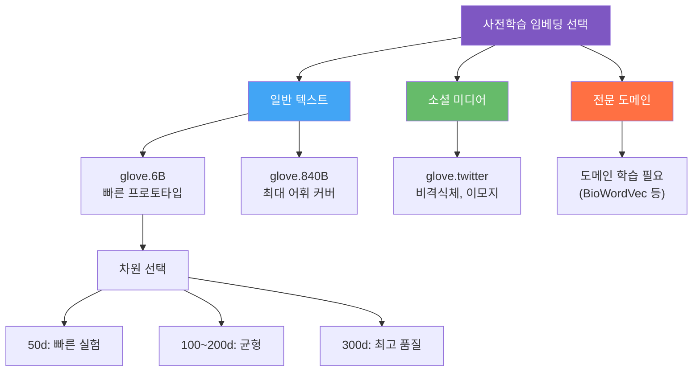
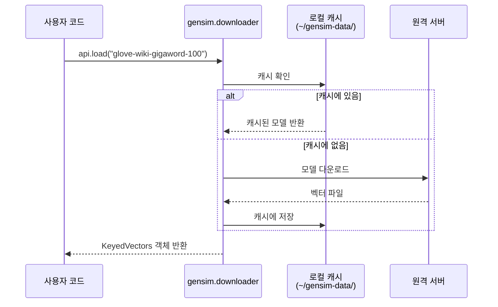
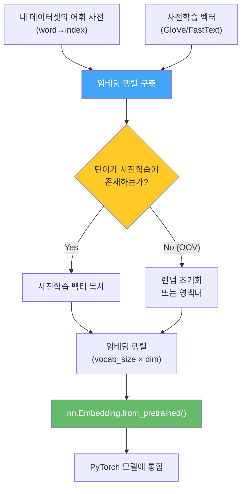
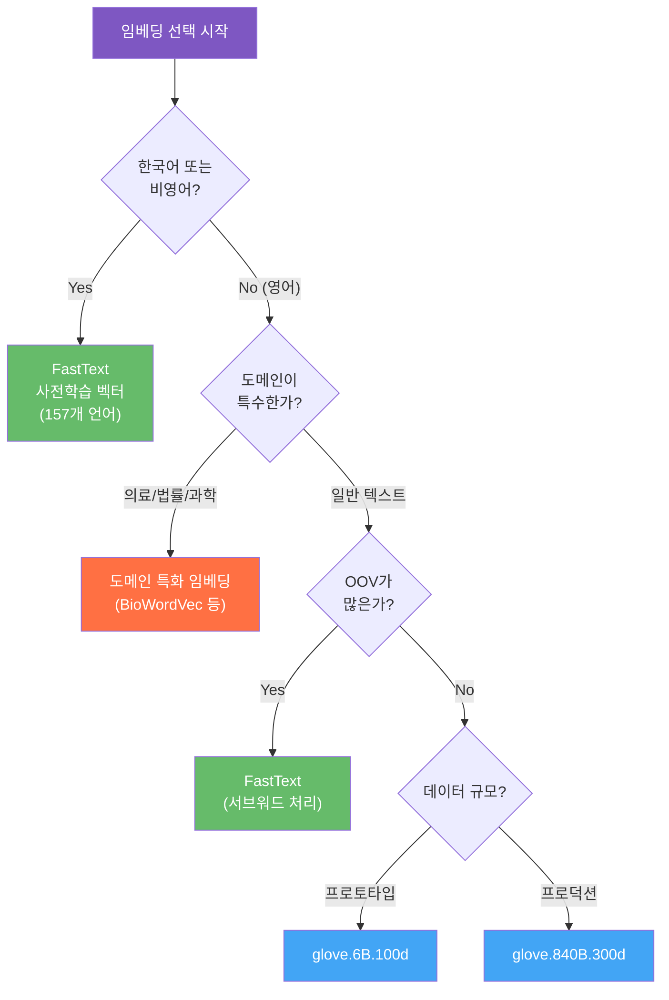

# 사전학습 임베딩 활용

> GloVe와 FastText의 사전학습 벡터를 다운로드하고, PyTorch 모델에 통합하는 실전 방법을 익힙니다.

## 개요

이 섹션에서는 수십억 개의 텍스트로 미리 학습된 워드 임베딩을 내 프로젝트에 가져와 활용하는 방법을 배웁니다. 직접 임베딩을 학습하려면 대규모 코퍼스와 긴 학습 시간이 필요하지만, 사전학습 임베딩을 사용하면 이 과정을 건너뛰고 바로 고품질 벡터를 활용할 수 있습니다.

**선수 지식**: [GloVe의 전역 벡터 표현](06-ch6-워드-임베딩-심화-glove와-fasttext/01-01-glove-전역-벡터-표현.md)과 [FastText 서브워드 임베딩](06-ch6-워드-임베딩-심화-glove와-fasttext/02-02-fasttext-서브워드-임베딩.md)의 핵심 원리

**학습 목표**:
- GloVe 사전학습 벡터를 다운로드하고 파싱하여 사용할 수 있다
- Gensim의 `downloader` API로 사전학습 임베딩을 간편하게 로드할 수 있다
- `nn.Embedding.from_pretrained()`로 PyTorch 모델에 임베딩을 통합할 수 있다
- 도메인과 태스크에 맞는 사전학습 임베딩을 선택하는 기준을 설명할 수 있다

## 왜 알아야 할까?

워드 임베딩을 처음부터 학습하려면 위키피디아 전체 같은 대규모 코퍼스가 필요하고, GPU로도 수 시간에서 수일이 걸립니다. 하지만 대부분의 NLP 프로젝트에서는 이런 리소스가 없죠. 사전학습 임베딩은 마치 **레고 조립 설명서 없이 처음부터 블록을 깎아 만드는 대신, 이미 정교하게 제작된 레고 블록 세트를 사서 바로 조립을 시작하는 것**과 같습니다.

실제로 2018년 BERT 이전 시대에 NLP 분류, 감성 분석, 개체명 인식 등 거의 모든 태스크에서 사전학습 임베딩은 "기본 옵션"이었습니다. 데이터가 적을수록 사전학습 임베딩의 효과는 더 극적이거든요 — 1만 개 미만의 학습 데이터에서도 안정적인 성능을 낼 수 있습니다.

> 📊 **그림 1**: 사전학습 임베딩 활용의 전체 흐름


## 핵심 개념

### 개념 1: 사전학습 벡터의 종류와 선택

> 💡 **비유**: 사전학습 임베딩을 고르는 건 외국어 사전을 고르는 것과 비슷합니다. 여행용 포켓 사전(50차원)은 가볍지만 어휘가 적고, 옥스포드 대사전(300차원)은 무겁지만 정확하죠. 어떤 사전을 골라야 할지는 목적에 따라 달라집니다.

Stanford NLP에서 공개한 GloVe 사전학습 벡터는 여러 코퍼스와 차원으로 제공됩니다:

| 모델 | 코퍼스 | 토큰 수 | 어휘 크기 | 차원 | 파일 크기 |
|------|--------|---------|----------|------|----------|
| `glove.6B` | Wikipedia 2014 + Gigaword 5 | 60억 | 40만 | 50/100/200/300 | 822MB |
| `glove.42B.300d` | Common Crawl | 420억 | 190만 | 300 | 1.9GB |
| `glove.840B.300d` | Common Crawl | 8400억 | 220만 | 300 | 2.2GB |
| `glove.twitter.27B` | Twitter | 270억 | 120만 | 25/50/100/200 | 1.4GB |

> 📊 **그림 2**: 코퍼스별 사전학습 임베딩 특성 비교



**선택 기준 정리**:
- **프로토타이핑**: `glove.6B.100d` — 다운로드 빠르고 메모리 부담 적음
- **최종 성능**: `glove.840B.300d` — 가장 넓은 어휘 커버리지
- **SNS 데이터**: `glove.twitter` — 비격식체, 축약어, 이모지 포함
- **비영어**: FastText의 157개 언어 사전학습 벡터 활용

2024년에 Stanford는 Dolma 코퍼스(2200억 토큰)로 학습한 새로운 GloVe 벡터도 공개했습니다. 더 최신 텍스트를 반영하므로 최신 주제를 다루는 태스크에 유리합니다.

### 개념 2: GloVe 벡터 파일 직접 로드하기

> 💡 **비유**: GloVe 텍스트 파일은 거대한 사전 같습니다. 각 줄이 하나의 단어 항목이고, 단어 뒤에 그 단어의 "좌표값"이 쭉 나열되어 있어요. 이 사전을 Python 딕셔너리로 옮기는 작업이 바로 "로드"입니다.

GloVe 벡터 파일의 포맷은 매우 단순합니다. 각 줄이 `단어 값1 값2 ... 값N` 형태입니다:

```
the 0.418 0.24968 -0.41242 ...
of 0.70853 0.57088 -0.4716 ...
```

이를 Python 딕셔너리로 파싱하는 코드를 작성해보겠습니다:

```python
import numpy as np

def load_glove_vectors(filepath, dim=100):
    """GloVe 텍스트 파일을 딕셔너리로 로드"""
    embeddings = {}
    with open(filepath, 'r', encoding='utf-8') as f:
        for line in f:
            values = line.split()
            word = values[0]                    # 첫 번째 요소가 단어
            vector = np.array(values[1:], dtype='float32')  # 나머지가 벡터
            embeddings[word] = vector
    return embeddings

# 사용 예시 (glove.6B.100d.txt 파일이 있다고 가정)
# glove = load_glove_vectors('glove.6B.100d.txt', dim=100)
# print(f"로드된 단어 수: {len(glove)}")
# print(f"'hello' 벡터 shape: {glove['hello'].shape}")
```

> ⚠️ **흔한 오해**: GloVe 파일을 로드할 때 `values = line.split()` 대신 `line.split(' ')`를 쓰면 줄 끝 개행문자(`\n`)가 마지막 값에 포함되어 float 변환 에러가 날 수 있습니다. `split()`은 모든 공백(개행 포함)을 자동 처리하므로 더 안전합니다.

### 개념 3: Gensim으로 간편하게 로드하기

> 💡 **비유**: 직접 파일을 파싱하는 건 마트에서 재료를 사서 요리하는 것이고, Gensim의 `downloader`는 밀키트를 주문하는 것과 같습니다. 다운로드, 캐싱, 벡터 검색까지 모두 알아서 처리해주거든요.

Gensim은 `gensim.downloader` 모듈을 통해 사전학습 임베딩을 한 줄로 다운로드하고 로드할 수 있습니다:

```run:python
import gensim.downloader as api

# 사용 가능한 모델 목록 확인
available = api.info()['models']
glove_models = [name for name in available if 'glove' in name]
print("GloVe 모델 목록:")
for model in glove_models:
    print(f"  - {model}")
```

```output
GloVe 모델 목록:
  - glove-twitter-25
  - glove-twitter-50
  - glove-twitter-100
  - glove-twitter-200
  - glove-wiki-gigaword-50
  - glove-wiki-gigaword-100
  - glove-wiki-gigaword-200
  - glove-wiki-gigaword-300
```

> 📊 **그림 3**: Gensim 다운로더의 동작 흐름



로드한 모델로 다양한 연산이 가능합니다:

```run:python
import gensim.downloader as api

# GloVe 100차원 모델 로드 (첫 실행 시 다운로드, ~130MB)
glove = api.load("glove-wiki-gigaword-100")

# 기본 정보 확인
print(f"어휘 크기: {len(glove):,}")
print(f"벡터 차원: {glove.vector_size}")
print(f"'python' 벡터 (처음 5개): {glove['python'][:5]}")

# 유사 단어 검색
print("\n'neural'과 유사한 단어:")
for word, score in glove.most_similar('neural', topn=5):
    print(f"  {word}: {score:.4f}")
```

```output
어휘 크기: 400,000
벡터 차원: 100
'python' 벡터 (처음 5개): [-0.2725  0.1476  0.2583 -0.7344  0.1152]

'neural'과 유사한 단어:
  neuronal: 0.7444
  neurons: 0.7105
  cortical: 0.6801
  brain: 0.6631
  synaptic: 0.6587
```

### 개념 4: PyTorch nn.Embedding에 사전학습 벡터 주입하기

> 💡 **비유**: `nn.Embedding`은 빈 사물함이에요. 각 칸(인덱스)에 물건(벡터)을 넣어둔 뒤, 번호를 알려주면 해당 칸의 물건을 꺼내주죠. `from_pretrained()`는 이미 정리된 물건을 한꺼번에 사물함에 넣어주는 방법입니다.

실제 모델에서 사전학습 임베딩을 활용하려면, **내 어휘 사전(vocabulary)**에 맞는 임베딩 행렬을 구축해야 합니다. 핵심 흐름은 이렇습니다:

> 📊 **그림 4**: 사전학습 임베딩의 PyTorch 통합 과정



```python
import torch
import torch.nn as nn
import numpy as np

def build_embedding_matrix(word2idx, pretrained_vectors, embed_dim):
    """어휘 사전에 맞는 임베딩 행렬 구축"""
    vocab_size = len(word2idx)
    # 임베딩 행렬을 0으로 초기화
    embedding_matrix = np.zeros((vocab_size, embed_dim))
    
    found = 0
    for word, idx in word2idx.items():
        # 사전학습 벡터에서 단어 검색
        if word in pretrained_vectors:
            embedding_matrix[idx] = pretrained_vectors[word]
            found += 1
        else:
            # OOV 단어는 작은 랜덤 값으로 초기화
            embedding_matrix[idx] = np.random.uniform(-0.25, 0.25, embed_dim)
    
    coverage = found / vocab_size * 100
    print(f"커버리지: {found}/{vocab_size} ({coverage:.1f}%)")
    
    return torch.FloatTensor(embedding_matrix)

# PyTorch 임베딩 레이어 생성
# embedding_matrix = build_embedding_matrix(word2idx, glove, 100)
# embedding_layer = nn.Embedding.from_pretrained(
#     embedding_matrix,
#     freeze=False,        # True: 고정 / False: 파인튜닝 허용
#     padding_idx=0        # 패딩 토큰 인덱스
# )
```

**`freeze` 파라미터가 핵심**입니다:
- `freeze=True`: 임베딩 가중치를 고정합니다. 데이터가 적을 때 과적합 방지에 효과적
- `freeze=False`: 학습 중 임베딩도 함께 업데이트합니다. 데이터가 충분할 때 태스크에 맞게 미세 조정

> 🔥 **실무 팁**: 일반적으로 **데이터가 1만 건 미만**이면 `freeze=True`로 시작하고, **5만 건 이상**이면 `freeze=False`로 파인튜닝하는 것을 권장합니다. 중간 규모에서는 처음 몇 에포크는 고정한 뒤 풀어주는 "gradual unfreezing" 전략도 있습니다.

### 개념 5: 도메인 적합성과 임베딩 선택 기준

사전학습 임베딩은 만능이 아닙니다. **학습 코퍼스와 타겟 도메인이 다를수록 성능이 떨어지거든요**. 의료 텍스트에 일반 뉴스로 학습한 GloVe를 쓰면, "cold"가 "감기"가 아니라 "차가운"에 가까운 벡터를 반환할 겁니다.

> 📊 **그림 5**: 임베딩 선택 의사결정 트리



**임베딩 선택 체크리스트**:

1. **언어**: 영어가 아니면 FastText가 거의 유일한 선택지 (157개 언어 지원)
2. **OOV 비율**: 신조어, 오타, 전문 용어가 많으면 FastText의 서브워드 방식이 유리
3. **도메인 일치**: 학습 코퍼스가 타겟 도메인과 유사할수록 좋은 성능
4. **차원**: 50d는 빠른 실험, 300d는 최종 모델용. 100~200d가 실용적 균형점
5. **메모리**: `glove.840B.300d`는 약 5GB 메모리 필요. 서버 환경이 아니면 `6B` 권장

## 실습: 직접 해보기

GloVe 사전학습 벡터를 로드하고, 간단한 영화 리뷰 데이터에 대해 임베딩 행렬을 구축한 뒤 PyTorch 모델에 통합하는 전체 파이프라인을 실습합니다.

```python
import torch
import torch.nn as nn
import numpy as np
import gensim.downloader as api

# ============================================================
# 1단계: 사전학습 GloVe 벡터 로드
# ============================================================
print("GloVe 벡터 로드 중...")
glove = api.load("glove-wiki-gigaword-100")  # 100차원
print(f"로드 완료! 어휘: {len(glove):,}개, 차원: {glove.vector_size}")

# ============================================================
# 2단계: 샘플 데이터셋과 어휘 사전 구축
# ============================================================
# 간단한 영화 리뷰 데이터
texts = [
    "this movie is great and wonderful",
    "terrible film awful acting bad",
    "excellent story amazing performance",
    "boring plot waste of time horrible",
]
labels = [1, 0, 1, 0]  # 1: 긍정, 0: 부정

# 간단한 토큰화 및 어휘 사전 구축
def build_vocab(texts, min_freq=1):
    """텍스트 목록에서 어휘 사전 구축"""
    word_counts = {}
    for text in texts:
        for word in text.lower().split():
            word_counts[word] = word_counts.get(word, 0) + 1
    
    # 특수 토큰 + 빈도 기준 필터링
    word2idx = {"<pad>": 0, "<unk>": 1}
    for word, count in sorted(word_counts.items()):
        if count >= min_freq:
            word2idx[word] = len(word2idx)
    
    return word2idx

word2idx = build_vocab(texts)
print(f"\n어휘 사전 크기: {len(word2idx)}")
print(f"어휘 사전: {word2idx}")

# ============================================================
# 3단계: 임베딩 행렬 구축
# ============================================================
embed_dim = glove.vector_size
vocab_size = len(word2idx)
embedding_matrix = np.zeros((vocab_size, embed_dim))

found, not_found = 0, []
for word, idx in word2idx.items():
    if word in glove:
        embedding_matrix[idx] = glove[word]
        found += 1
    elif word not in ("<pad>", "<unk>"):
        # OOV 단어: 작은 랜덤 값으로 초기화
        embedding_matrix[idx] = np.random.uniform(-0.25, 0.25, embed_dim)
        not_found.append(word)

print(f"\n임베딩 커버리지: {found}/{vocab_size} "
      f"({found/vocab_size*100:.1f}%)")
if not_found:
    print(f"OOV 단어: {not_found}")

# ============================================================
# 4단계: PyTorch 모델에 통합
# ============================================================
class SimpleClassifier(nn.Module):
    def __init__(self, pretrained_embeddings, num_classes=2, freeze=True):
        super().__init__()
        # 사전학습 임베딩으로 초기화
        self.embedding = nn.Embedding.from_pretrained(
            pretrained_embeddings,
            freeze=freeze,        # 임베딩 고정 여부
            padding_idx=0         # <pad> 토큰
        )
        embed_dim = pretrained_embeddings.shape[1]
        self.fc = nn.Linear(embed_dim, num_classes)
    
    def forward(self, x):
        # x: (batch_size, seq_len)
        embedded = self.embedding(x)           # (batch, seq_len, embed_dim)
        pooled = embedded.mean(dim=1)          # (batch, embed_dim) 평균 풀링
        logits = self.fc(pooled)               # (batch, num_classes)
        return logits

# 모델 생성
pretrained_weights = torch.FloatTensor(embedding_matrix)
model = SimpleClassifier(pretrained_weights, num_classes=2, freeze=True)

print(f"\n모델 구조:")
print(model)
print(f"\n임베딩 레이어 크기: {model.embedding.weight.shape}")
print(f"임베딩 고정 여부: {not model.embedding.weight.requires_grad}")

# ============================================================
# 5단계: 추론 테스트
# ============================================================
def text_to_indices(text, word2idx, max_len=10):
    """텍스트를 인덱스 시퀀스로 변환"""
    indices = []
    for word in text.lower().split():
        indices.append(word2idx.get(word, word2idx["<unk>"]))
    # 패딩 또는 자르기
    if len(indices) < max_len:
        indices += [word2idx["<pad>"]] * (max_len - len(indices))
    else:
        indices = indices[:max_len]
    return indices

# 테스트 입력
test_text = "great movie wonderful acting"
test_indices = text_to_indices(test_text, word2idx)
test_tensor = torch.LongTensor([test_indices])

with torch.no_grad():
    output = model(test_tensor)
    pred = torch.argmax(output, dim=1).item()
    print(f"\n테스트 입력: '{test_text}'")
    print(f"출력 로짓: {output}")
    print(f"예측: {'긍정' if pred == 1 else '부정'}")
```

## 더 깊이 알아보기

### GloVe 공개의 역사

GloVe는 2014년 Stanford NLP 그룹의 Jeffrey Pennington, Richard Socher, Christopher Manning이 개발했습니다. 당시 Word2Vec이 NLP 커뮤니티를 뒤흔들고 있었는데, Stanford 팀은 "Word2Vec이 잘 되는 이유를 수학적으로 설명할 수 있다면, 더 나은 모델을 만들 수 있지 않을까?"라는 질문에서 출발했습니다.

흥미로운 점은, GloVe 팀이 사전학습 벡터를 공개한 것이 논문만큼이나 큰 영향을 미쳤다는 사실입니다. 2014년 당시 대부분의 연구 그룹은 자신의 임베딩을 직접 학습해야 했는데, Stanford가 6B, 42B, 840B 토큰 버전을 무료로 공개하면서 **NLP 연구의 민주화**가 시작됐습니다. 대학원생이 노트북에서도 최고 수준의 워드 벡터를 사용할 수 있게 된 거죠.

이 "사전학습 모델을 공개하여 모두가 활용하게 한다"는 패러다임은 이후 ELMo, BERT, GPT로 이어지는 **사전학습-파인튜닝 패러다임**의 시초가 되었습니다. 지금 우리가 Hugging Face에서 수천 개의 사전학습 모델을 자유롭게 다운로드할 수 있는 것도, 이 흐름의 연장선에 있습니다.

### torchtext의 흥망성쇠

한때 PyTorch에서 사전학습 임베딩을 로드하는 표준 방법은 `torchtext.vocab.GloVe`였습니다. 그런데 2025년 9월, torchtext 리포지토리가 공식 아카이브되었습니다. API가 여러 번 바뀌면서 커뮤니티의 혼란이 컸기 때문이죠. 현재는 Gensim의 `downloader`로 로드한 뒤 수동으로 PyTorch 텐서로 변환하는 방식이 가장 안정적인 접근법입니다. 이 섹션에서 배운 방법이 바로 그것입니다.

## 흔한 오해와 팁

> ⚠️ **흔한 오해**: "사전학습 임베딩은 항상 랜덤 초기화보다 낫다." — 학습 데이터가 충분하고(10만 건 이상) 도메인이 특수하다면(의료, 법률), 처음부터 학습하는 것이 더 나을 수 있습니다. 사전학습 임베딩의 "knowledge"가 오히려 방해가 될 수 있거든요.

> 💡 **알고 계셨나요?**: `glove.840B.300d`는 Common Crawl 8400억 토큰으로 학습되었는데, 이 안에는 "lol", "omg", "gonna" 같은 인터넷 구어체도 포함되어 있습니다. Twitter 전용 모델이 아니어도 비격식체를 꽤 잘 처리하는 이유죠.

> 🔥 **실무 팁**: OOV 단어를 랜덤 초기화할 때 `np.random.uniform(-0.25, 0.25, dim)` 범위를 쓰는 건 관례입니다. 사전학습 벡터의 표준편차에 맞추는 것이 핵심인데, GloVe 벡터의 표준편차가 대략 0.38 정도이므로 ±0.25는 합리적인 범위입니다. `np.zeros()`로 초기화하면 해당 단어가 학습 초기에 아무 신호도 보내지 못하므로 피하세요.

## 핵심 정리

| 개념 | 설명 |
|------|------|
| GloVe 사전학습 벡터 | Stanford에서 공개한 사전학습 워드 벡터. 6B~840B 토큰, 50~300차원 |
| Gensim downloader | `api.load("glove-wiki-gigaword-100")`으로 한 줄 로드. 자동 캐싱 |
| 임베딩 행렬 구축 | 내 어휘 사전 → 사전학습 벡터 매핑 → `(vocab_size, dim)` 행렬 생성 |
| `nn.Embedding.from_pretrained()` | PyTorch 임베딩 레이어에 사전학습 가중치 주입 |
| `freeze` 파라미터 | `True`: 임베딩 고정 (소량 데이터), `False`: 파인튜닝 (대량 데이터) |
| OOV 처리 | 사전학습에 없는 단어는 랜덤 초기화 (±0.25 범위 권장) |
| 도메인 적합성 | 코퍼스-도메인 일치, 언어, OOV 비율, 차원을 종합 고려하여 선택 |

## 다음 섹션 미리보기

이제 사전학습 임베딩을 로드하고 PyTorch에 통합하는 방법을 알게 되었습니다. 다음 [임베딩 기반 텍스트 분류](06-ch6-워드-임베딩-심화-glove와-fasttext/04-04-임베딩-기반-텍스트-분류.md)에서는 이 임베딩을 실제 감성 분석 태스크에 적용합니다. CNN이나 RNN과 결합하여 본격적인 텍스트 분류 모델을 구축하고, `freeze=True`와 `freeze=False`의 성능 차이를 실험으로 확인해보겠습니다.

## 참고 자료

- [GloVe: Global Vectors for Word Representation (Stanford NLP)](https://nlp.stanford.edu/projects/glove/) - 사전학습 벡터 다운로드 및 모델 설명 공식 페이지
- [Gensim Downloader API 공식 문서](https://radimrehurek.com/gensim/auto_examples/howtos/run_downloader_api.html) - Gensim을 이용한 사전학습 모델 다운로드 방법
- [PyTorch nn.Embedding 공식 문서](https://docs.pytorch.org/docs/stable/generated/torch.nn.Embedding.html) - `from_pretrained()` 메서드 및 파라미터 설명
- [The Illustrated Word2Vec (Jay Alammar)](https://jalammar.github.io/illustrated-word2vec/) - 워드 임베딩의 직관적 시각적 설명
- [Keras: Using Pre-trained Word Embeddings](https://keras.io/examples/nlp/pretrained_word_embeddings/) - 사전학습 임베딩 활용 패턴 참고 (프레임워크는 다르지만 개념 동일)

---
### 🔗 Related Sessions
- [co-occurrence_matrix](06-ch6-워드-임베딩-심화-glove와-fasttext/01-01-glove-전역-벡터-표현.md) (prerequisite)
- [glove_objective_function](06-ch6-워드-임베딩-심화-glove와-fasttext/01-01-glove-전역-벡터-표현.md) (prerequisite)
- [subword_embedding](06-ch6-워드-임베딩-심화-glove와-fasttext/02-02-fasttext-서브워드-임베딩.md) (prerequisite)
- [oov_handling](06-ch6-워드-임베딩-심화-glove와-fasttext/02-02-fasttext-서브워드-임베딩.md) (prerequisite)
- [character_ngram](06-ch6-워드-임베딩-심화-glove와-fasttext/02-02-fasttext-서브워드-임베딩.md) (prerequisite)
