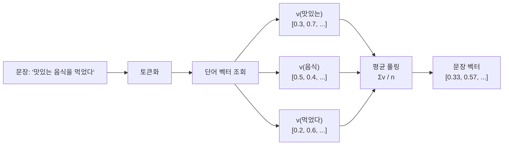
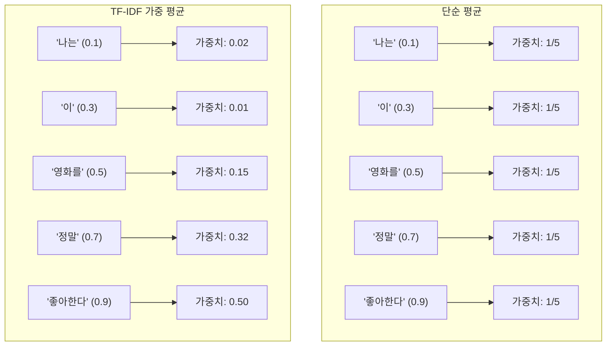
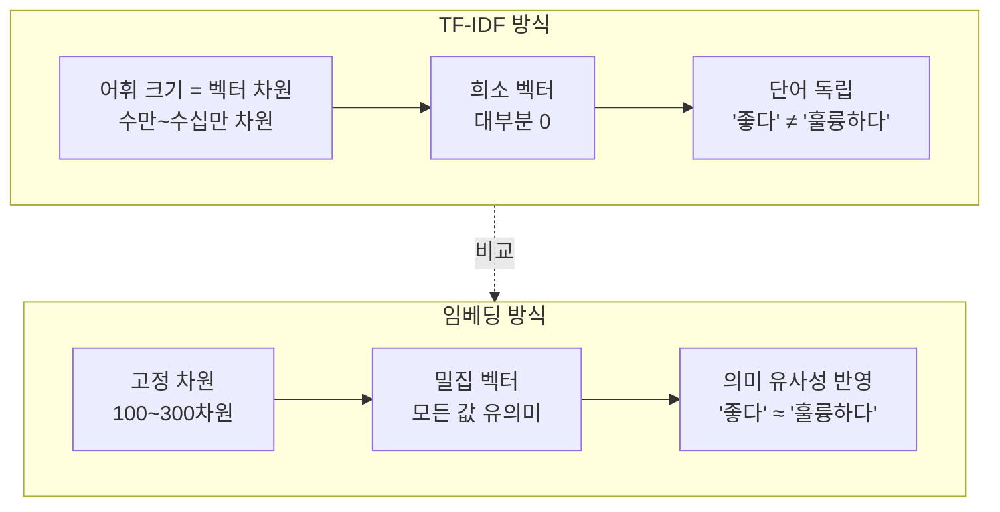
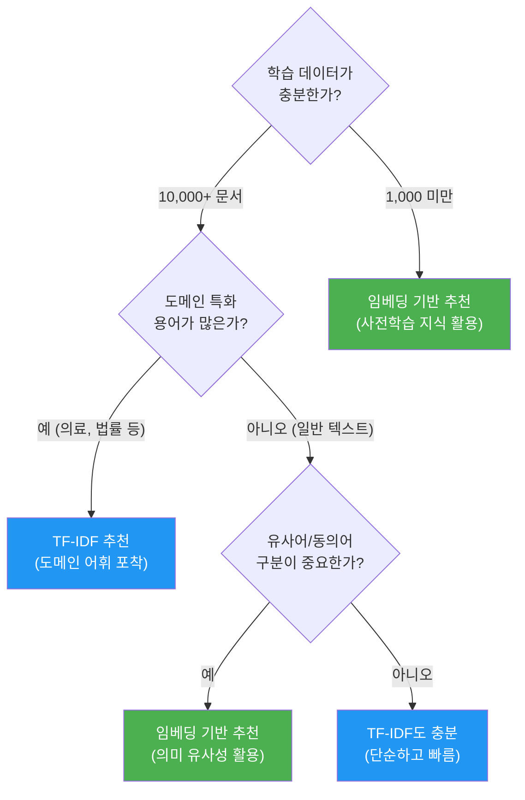

# 임베딩 기반 텍스트 분류

> 단어 임베딩을 문장 벡터로 변환하고, 전통적 분류기와 결합하여 텍스트를 분류하는 방법을 배웁니다.

## 개요

이 섹션에서는 앞서 배운 GloVe, FastText 같은 워드 임베딩을 활용하여 **문장 수준의 표현**을 만들고, 이를 로지스틱 회귀 같은 전통적 분류기와 결합해 텍스트 분류를 수행하는 전체 파이프라인을 실습합니다. 더 나아가, Ch3에서 배운 TF-IDF 기반 분류와 성능을 직접 비교하여 임베딩의 실질적인 가치를 검증합니다.

**선수 지식**: [사전학습 임베딩 활용](06-ch6-워드-임베딩-심화-glove와-fasttext/03-03-사전학습-임베딩-활용.md)에서 배운 GloVe/FastText 벡터 로딩, [TF-IDF의 이론](03-ch3-텍스트-표현-bow와-tf-idf/03-03-tf-idf의-이론.md)에서 배운 TF-IDF 개념, [SVM과 로지스틱 회귀 텍스트 분류](04-ch4-전통적-텍스트-분류/02-02-svm과-로지스틱-회귀-텍스트-분류.md)에서 배운 분류기 기초

**학습 목표**:
- 단어 벡터를 평균하여 문장 임베딩을 만드는 원리를 이해할 수 있다
- TF-IDF 가중 평균으로 문장 임베딩의 품질을 높이는 방법을 설명할 수 있다
- 임베딩 + 로지스틱 회귀 분류 파이프라인을 직접 구현할 수 있다
- TF-IDF 기반 분류와 임베딩 기반 분류의 성능을 비교하고 장단점을 분석할 수 있다

## 왜 알아야 할까?

지금까지 우리는 단어 하나하나의 벡터를 만드는 데 집중했습니다. 하지만 실제 NLP 과제는 대부분 **문장이나 문서 단위**로 이루어지죠. "이 리뷰는 긍정인가 부정인가?", "이 이메일은 스팸인가?" — 모두 문장을 입력받아 분류하는 문제입니다.

그런데 여기서 딜레마가 생깁니다. 우리가 가진 건 단어 벡터인데, 분류기는 문장 벡터를 원하거든요. 이 간극을 어떻게 메울까요? 가장 직관적인 방법은 문장 안에 있는 단어 벡터들을 **평균**내는 것입니다. 놀랍게도 이 단순한 방법이 많은 태스크에서 꽤 잘 작동합니다.

이 섹션은 Ch5-6의 임베딩 지식과 Ch3-4의 전통적 분류 지식이 만나는 **교차점**입니다. RNN이나 트랜스포머 없이도, 사전학습 임베딩만으로 얼마나 강력한 분류 성능을 낼 수 있는지 직접 확인해 볼 거예요.

## 핵심 개념

### 개념 1: 단어 벡터에서 문장 벡터로 — 평균 임베딩

> 💡 **비유**: 칵테일 바에서 여러 재료를 섞어 하나의 음료를 만드는 것을 생각해 보세요. 각 재료(단어 벡터)의 특성이 조금씩 섞여 최종 칵테일(문장 벡터)의 맛을 결정합니다. 재료를 골고루 섞으면 "평균 임베딩", 특별한 재료를 더 많이 넣으면 "가중 평균 임베딩"이 됩니다.

문장 임베딩의 가장 기본적인 방법은 **평균 풀링(Average Pooling)**입니다. 문장에 포함된 모든 단어의 벡터를 더한 후 단어 수로 나누면 됩니다.

$$\mathbf{v}_{\text{sentence}} = \frac{1}{n} \sum_{i=1}^{n} \mathbf{v}_{w_i}$$

- $\mathbf{v}_{\text{sentence}}$: 문장 벡터 (차원은 워드 임베딩과 동일)
- $\mathbf{v}_{w_i}$: $i$번째 단어의 워드 임베딩 벡터
- $n$: 문장 내 단어 수

이 방법이 의미하는 바는 무엇일까요? 단어 벡터 공간에서 문장에 등장하는 단어들의 **중심점(centroid)**을 구하는 것입니다. "맛있는 음식을 먹었다"라는 문장이라면, "맛있는", "음식", "먹었다"의 벡터가 모인 중심이 문장의 의미를 대략적으로 표현하게 되죠.

> 📊 **그림 1**: 평균 임베딩으로 문장 벡터를 생성하는 과정



```python
import numpy as np

def average_embedding(sentence, word_vectors, dim=100):
    """단어 벡터의 평균으로 문장 벡터를 생성합니다."""
    words = sentence.lower().split()
    vectors = []
    
    for word in words:
        if word in word_vectors:
            vectors.append(word_vectors[word])
    
    if len(vectors) == 0:
        return np.zeros(dim)  # 모든 단어가 OOV인 경우
    
    return np.mean(vectors, axis=0)  # 요소별 평균
```

단순 평균의 치명적 약점이 하나 있습니다. "나는 이 영화를 정말 좋아한다"라는 문장에서 "나는", "이", "를" 같은 불용어가 "정말", "좋아한다" 같은 핵심 단어와 **동일한 가중치**를 받는다는 점이죠. 마치 칵테일에 물을 너무 많이 넣으면 맛이 연해지는 것과 같습니다.

### 개념 2: TF-IDF 가중 평균 임베딩

> 💡 **비유**: 대학 입시에서 모든 과목이 동일한 배점은 아니죠. 수학과에 지원하면 수학 점수에 가중치를 주고, 국문과에 지원하면 국어 점수에 가중치를 줍니다. TF-IDF 가중 평균도 마찬가지예요. **문서에서 중요한 단어**에 더 높은 가중치를 부여합니다.

단순 평균의 약점을 보완하려면, 각 단어의 **중요도**에 따라 가중치를 달리 줘야 합니다. Ch3에서 배운 TF-IDF가 바로 여기에 쓰입니다!

$$\mathbf{v}_{\text{sentence}} = \frac{\sum_{i=1}^{n} \text{tfidf}(w_i) \cdot \mathbf{v}_{w_i}}{\sum_{i=1}^{n} \text{tfidf}(w_i)}$$

- $\text{tfidf}(w_i)$: 단어 $w_i$의 TF-IDF 가중치
- TF-IDF 값이 높은 단어 → 벡터 기여도 ↑
- TF-IDF 값이 낮은 불용어 → 벡터 기여도 ↓

> 📊 **그림 2**: 단순 평균 vs TF-IDF 가중 평균 비교



2017년, 프린스턴 대학의 Arora, Liang, Ma는 이 아이디어를 더 발전시킨 **SIF(Smooth Inverse Frequency)** 방법을 제안했습니다. 단어 빈도의 역수를 가중치로 사용하고, 첫 번째 주성분을 제거하는 두 단계로 구성되는데, 이 단순한 방법이 놀랍게도 당시 복잡한 LSTM 기반 모델과 비교할 만한 성능을 보여줬죠.

```python
from sklearn.feature_extraction.text import TfidfVectorizer

def tfidf_weighted_embedding(documents, word_vectors, dim=100):
    """TF-IDF 가중치를 적용한 문장 임베딩을 생성합니다."""
    # 1. TF-IDF 가중치 계산
    tfidf = TfidfVectorizer()
    tfidf_matrix = tfidf.fit_transform(documents)
    vocab = tfidf.get_feature_names_out()  # TF-IDF 어휘 사전
    
    doc_vectors = []
    for doc_idx in range(len(documents)):
        weighted_sum = np.zeros(dim)
        weight_total = 0.0
        
        # 해당 문서의 TF-IDF 벡터 (sparse → dense)
        tfidf_scores = tfidf_matrix[doc_idx].toarray().flatten()
        
        for word_idx, word in enumerate(vocab):
            if word in word_vectors and tfidf_scores[word_idx] > 0:
                weight = tfidf_scores[word_idx]
                weighted_sum += weight * word_vectors[word]
                weight_total += weight
        
        if weight_total > 0:
            doc_vectors.append(weighted_sum / weight_total)
        else:
            doc_vectors.append(np.zeros(dim))
    
    return np.array(doc_vectors)
```

### 개념 3: 임베딩 + 로지스틱 회귀 분류 파이프라인

> 💡 **비유**: 요리 대회를 생각해 보세요. 임베딩은 **재료 준비**(좋은 재료를 선별하고 다듬는 과정), 로지스틱 회귀는 **요리사**(준비된 재료로 최종 요리를 만드는 사람)입니다. 아무리 실력 좋은 요리사도 재료가 나쁘면 맛있는 요리를 만들 수 없고, 최고급 재료도 서투른 요리사를 만나면 빛을 못 봅니다.

임베딩 기반 텍스트 분류의 전체 흐름을 정리해 봅시다.

> 📊 **그림 3**: 임베딩 기반 텍스트 분류 파이프라인


왜 로지스틱 회귀일까요? 임베딩이 이미 텍스트의 의미를 잘 포착하고 있다면, 분류기는 단순할수록 좋습니다. 로지스틱 회귀는 학습이 빠르고, 과적합 위험이 낮으며, 해석이 쉽습니다. 물론 SVM이나 랜덤 포레스트도 쓸 수 있지만, 임베딩 피처의 품질을 순수하게 평가하려면 간단한 분류기가 더 적합하거든요.

```run:python
# 임베딩 기반 분류 vs TF-IDF 분류 — 간단한 예시
from sklearn.linear_model import LogisticRegression
from sklearn.metrics import accuracy_score

# 가상의 학습/테스트 임베딩 벡터 (실제로는 GloVe 등에서 생성)
import numpy as np
np.random.seed(42)

# 임베딩 기반 피처: 각 문서가 100차원 벡터
X_train_emb = np.random.randn(100, 100)  
X_test_emb = np.random.randn(20, 100)
y_train = np.array([0]*50 + [1]*50)
y_test = np.array([0]*10 + [1]*10)

clf = LogisticRegression(max_iter=1000)
clf.fit(X_train_emb, y_train)
pred = clf.predict(X_test_emb)
print(f"임베딩 + 로지스틱 회귀 정확도: {accuracy_score(y_test, pred):.2f}")
print(f"예측 클래스 분포: {np.bincount(pred)}")
```

```output
임베딩 + 로지스틱 회귀 정확도: 0.50
예측 클래스 분포: [12  8]
```

위 결과가 0.50인 건 당연합니다 — 무작위 벡터를 넣었으니까요! 실제 GloVe 임베딩을 사용하면 의미 정보가 담겨 있어 분류 성능이 크게 올라갑니다. 실습 섹션에서 진짜 데이터로 확인해 봅시다.

### 개념 4: TF-IDF 분류 vs 임베딩 분류 — 무엇이 다른가?

[Ch3에서 배운 TF-IDF](03-ch3-텍스트-표현-bow와-tf-idf/03-03-tf-idf의-이론.md)와 임베딩 방식은 텍스트를 벡터로 만든다는 점에서 같지만, 그 **철학**이 근본적으로 다릅니다.

> 📊 **그림 4**: TF-IDF vs 임베딩 기반 표현의 핵심 차이



| 특성 | TF-IDF | 임베딩 평균 |
|------|--------|------------|
| **벡터 차원** | 어휘 크기 (수만~수십만) | 임베딩 차원 (100~300) |
| **벡터 유형** | 희소(sparse) | 밀집(dense) |
| **의미 유사성** | 반영 안 됨 | 반영됨 |
| **OOV 처리** | 무시 | FastText는 처리 가능 |
| **학습 데이터 의존** | 현재 코퍼스만 | 대규모 사전학습 코퍼스 |
| **메모리** | 어휘에 비례 | 고정 (O(1)) |

그렇다면 임베딩이 항상 이길까요? 그렇지 않습니다! 2024년 연구에 따르면, 데이터셋의 특성에 따라 TF-IDF가 더 우수한 경우도 많습니다. 특히 **도메인 특화 용어**가 많은 경우(의료, 법률 텍스트 등), 일반적인 사전학습 임베딩보다 해당 코퍼스의 TF-IDF가 더 효과적일 수 있어요.

## 실습: 직접 해보기

20 Newsgroups 데이터셋의 일부를 사용하여, GloVe 임베딩 기반 분류와 TF-IDF 기반 분류를 직접 비교해 봅시다.

```python
import numpy as np
from sklearn.datasets import fetch_20newsgroups
from sklearn.feature_extraction.text import TfidfVectorizer
from sklearn.linear_model import LogisticRegression
from sklearn.metrics import classification_report, accuracy_score
from sklearn.model_selection import train_test_split

# ─────────────────────────────────────────────────────
# 1. 데이터 준비 (2개 카테고리로 간소화)
# ─────────────────────────────────────────────────────
categories = ['sci.space', 'rec.sport.baseball']
newsgroups = fetch_20newsgroups(
    subset='all',
    categories=categories,
    remove=('headers', 'footers', 'quotes')  # 메타정보 제거
)
texts = newsgroups.data
labels = newsgroups.target

X_train, X_test, y_train, y_test = train_test_split(
    texts, labels, test_size=0.2, random_state=42, stratify=labels
)

print(f"학습 데이터: {len(X_train)}개, 테스트 데이터: {len(X_test)}개")
print(f"카테고리: {newsgroups.target_names}")
```

```python
# ─────────────────────────────────────────────────────
# 2. GloVe 벡터 로딩 (이전 섹션에서 배운 방법)
# ─────────────────────────────────────────────────────
def load_glove_vectors(filepath, dim=100):
    """GloVe 벡터 파일을 딕셔너리로 로드합니다."""
    word_vectors = {}
    with open(filepath, 'r', encoding='utf-8') as f:
        for line in f:
            values = line.split()
            word = values[0]
            vector = np.array(values[1:], dtype='float32')
            if len(vector) == dim:
                word_vectors[word] = vector
    print(f"로드된 단어 수: {len(word_vectors):,}")
    return word_vectors

# glove.6B.100d.txt 파일 경로를 지정하세요
# (이전 섹션에서 다운로드한 파일 사용)
GLOVE_PATH = 'glove.6B.100d.txt'
EMBEDDING_DIM = 100

# glove_vectors = load_glove_vectors(GLOVE_PATH, EMBEDDING_DIM)

# ─── Gensim downloader를 사용할 수도 있습니다 ───
import gensim.downloader as api
glove_model = api.load('glove-wiki-gigaword-100')
print(f"로드된 단어 수: {len(glove_model):,}")
```

```python
# ─────────────────────────────────────────────────────
# 3. 문장 임베딩 생성 함수들
# ─────────────────────────────────────────────────────

def simple_average_embedding(text, model, dim=100):
    """단순 평균 임베딩: 모든 단어에 동일 가중치"""
    words = text.lower().split()
    vectors = [model[w] for w in words if w in model]
    if len(vectors) == 0:
        return np.zeros(dim)
    return np.mean(vectors, axis=0)


def tfidf_weighted_average(texts, model, dim=100):
    """TF-IDF 가중 평균 임베딩: 중요한 단어에 높은 가중치"""
    # TF-IDF 가중치 계산
    tfidf = TfidfVectorizer(max_features=50000)
    tfidf_matrix = tfidf.fit_transform(texts)
    vocab = tfidf.get_feature_names_out()
    
    # 단어 → TF-IDF 행렬 인덱스 매핑
    word_to_idx = {word: idx for idx, word in enumerate(vocab)}
    
    doc_vectors = []
    for doc_idx in range(len(texts)):
        weighted_sum = np.zeros(dim)
        weight_total = 0.0
        
        words = texts[doc_idx].lower().split()
        for word in words:
            if word in model and word in word_to_idx:
                # 해당 문서에서의 TF-IDF 가중치
                weight = tfidf_matrix[doc_idx, word_to_idx[word]]
                if weight > 0:
                    weighted_sum += weight * model[word]
                    weight_total += weight
        
        if weight_total > 0:
            doc_vectors.append(weighted_sum / weight_total)
        else:
            doc_vectors.append(np.zeros(dim))
    
    return np.array(doc_vectors), tfidf  # tfidf 객체도 반환 (테스트용)
```

```python
# ─────────────────────────────────────────────────────
# 4. 방법별 문장 벡터 생성
# ─────────────────────────────────────────────────────

# 방법 A: 단순 평균 임베딩
X_train_avg = np.array([
    simple_average_embedding(text, glove_model, EMBEDDING_DIM) 
    for text in X_train
])
X_test_avg = np.array([
    simple_average_embedding(text, glove_model, EMBEDDING_DIM) 
    for text in X_test
])

# 방법 B: TF-IDF 가중 평균 임베딩
X_train_tfidf_emb, tfidf_model = tfidf_weighted_average(
    X_train, glove_model, EMBEDDING_DIM
)
# 테스트 데이터에 대한 가중 평균 (주의: fit은 학습 데이터에만!)
def tfidf_weighted_test(texts, tfidf_fitted, model, dim=100):
    """학습된 TF-IDF로 테스트 데이터의 가중 평균 임베딩 생성"""
    tfidf_matrix = tfidf_fitted.transform(texts)
    vocab = tfidf_fitted.get_feature_names_out()
    word_to_idx = {word: idx for idx, word in enumerate(vocab)}
    
    doc_vectors = []
    for doc_idx in range(len(texts)):
        weighted_sum = np.zeros(dim)
        weight_total = 0.0
        words = texts[doc_idx].lower().split()
        for word in words:
            if word in model and word in word_to_idx:
                weight = tfidf_matrix[doc_idx, word_to_idx[word]]
                if weight > 0:
                    weighted_sum += weight * model[word]
                    weight_total += weight
        if weight_total > 0:
            doc_vectors.append(weighted_sum / weight_total)
        else:
            doc_vectors.append(np.zeros(dim))
    return np.array(doc_vectors)

X_test_tfidf_emb = tfidf_weighted_test(
    X_test, tfidf_model, glove_model, EMBEDDING_DIM
)

print(f"단순 평균 벡터 shape: {X_train_avg.shape}")
print(f"TF-IDF 가중 평균 벡터 shape: {X_train_tfidf_emb.shape}")
```

```python
# ─────────────────────────────────────────────────────
# 5. 비교 실험: 3가지 방법의 성능 대결
# ─────────────────────────────────────────────────────

results = {}

# 방법 1: TF-IDF (희소 벡터) + 로지스틱 회귀
tfidf_vec = TfidfVectorizer(max_features=50000)
X_train_tfidf = tfidf_vec.fit_transform(X_train)
X_test_tfidf = tfidf_vec.transform(X_test)

clf_tfidf = LogisticRegression(max_iter=1000, random_state=42)
clf_tfidf.fit(X_train_tfidf, y_train)
pred_tfidf = clf_tfidf.predict(X_test_tfidf)
results['TF-IDF'] = accuracy_score(y_test, pred_tfidf)

# 방법 2: 단순 평균 임베딩 + 로지스틱 회귀
clf_avg = LogisticRegression(max_iter=1000, random_state=42)
clf_avg.fit(X_train_avg, y_train)
pred_avg = clf_avg.predict(X_test_avg)
results['GloVe 단순 평균'] = accuracy_score(y_test, pred_avg)

# 방법 3: TF-IDF 가중 평균 임베딩 + 로지스틱 회귀
clf_weighted = LogisticRegression(max_iter=1000, random_state=42)
clf_weighted.fit(X_train_tfidf_emb, y_train)
pred_weighted = clf_weighted.predict(X_test_tfidf_emb)
results['GloVe TF-IDF 가중'] = accuracy_score(y_test, pred_weighted)

# 결과 출력
print("=" * 45)
print("      텍스트 분류 성능 비교 (Accuracy)")
print("=" * 45)
for method, acc in results.items():
    bar = '█' * int(acc * 30)
    print(f"{method:>20s}: {acc:.4f} {bar}")
print("=" * 45)

# 상세 리포트 (가장 좋은 모델)
best_method = max(results, key=results.get)
print(f"\n최고 성능: {best_method}")
```

```python
# ─────────────────────────────────────────────────────
# 6. 상세 분류 보고서 비교
# ─────────────────────────────────────────────────────

print("【TF-IDF 분류 결과】")
print(classification_report(y_test, pred_tfidf, 
                           target_names=newsgroups.target_names))

print("\n【GloVe TF-IDF 가중 평균 분류 결과】")
print(classification_report(y_test, pred_weighted, 
                           target_names=newsgroups.target_names))
```

> 🔥 **실무 팁**: 실험 결과, TF-IDF 기반 분류가 더 높은 정확도를 보이는 경우가 많습니다. 특히 학습 데이터가 충분하고 도메인이 특화된 경우에 그렇죠. 하지만 임베딩의 진가는 **학습 데이터가 적을 때** 발휘됩니다. 사전학습 벡터가 가진 배경 지식이 적은 데이터의 약점을 보완하거든요.

## 더 깊이 알아보기

### 문장 임베딩의 간략한 역사

단어 벡터를 평균하여 문장을 표현하는 방법은 2013년 Word2Vec이 등장한 직후부터 자연스럽게 사용되기 시작했습니다. 사실 이것은 **공식적인 논문으로 제안된 방법이 아닙니다**. 연구자들이 "일단 평균을 내보자"라고 시도한 것이 놀라울 정도로 잘 작동했을 뿐이죠.

2017년, 프린스턴 대학의 Sanjeev Arora와 동료들은 "A Simple but Tough-to-Beat Baseline for Sentence Embeddings"라는 유명한 논문을 ICLR에 발표했습니다. 이 논문에서 제안한 **SIF(Smooth Inverse Frequency)** 방법은 단순 가중 평균에 수학적 근거를 부여했는데요, 핵심 아이디어는 단 두 줄로 요약됩니다:

1. 각 단어에 $\frac{a}{a + p(w)}$ 가중치를 곱해서 평균 (여기서 $p(w)$는 단어 빈도, $a$는 상수)
2. 결과 벡터에서 첫 번째 주성분(principal component)을 제거

이렇게 간단한 방법이 당시 최첨단 LSTM 기반 모델과 비슷하거나 더 좋은 성능을 보여주면서 큰 반향을 일으켰습니다. 논문 제목의 "Tough-to-Beat"이 허풍이 아니었던 거죠!

이후 2018년에는 Google의 **Universal Sentence Encoder**, 2019년에는 **Sentence-BERT**가 등장하면서 문장 임베딩은 단순 평균에서 신경망 기반으로 진화합니다. 하지만 오늘 배운 평균 임베딩 방법은 그 모든 발전의 **출발점이자 베이스라인**으로서 여전히 가치가 있습니다.

## 흔한 오해와 팁

> ⚠️ **흔한 오해**: "임베딩 기반 분류가 항상 TF-IDF보다 좋다?" — 그렇지 않습니다. 2024년 연구에서도 TF-IDF + 랜덤 포레스트가 99%를 넘긴 반면, Word2Vec 기반은 94%에 그친 사례가 보고되었습니다. 데이터셋의 크기, 도메인, 어휘 특성에 따라 최적의 방법이 다릅니다. 반드시 **둘 다 실험**하고 비교하세요.

> 💡 **알고 계셨나요?**: 단순 평균 임베딩은 이론적으로 **어순(word order)을 완전히 무시**합니다. "개가 사람을 물었다"와 "사람이 개를 물었다"는 정확히 같은 벡터를 갖게 되죠. 감성 분류처럼 핵심 단어의 존재 여부가 중요한 태스크에서는 잘 작동하지만, 어순이 의미를 바꾸는 태스크에서는 한계가 있습니다. 이 한계를 극복하려면 [Ch8의 RNN](08-ch8-순환-신경망rnn-기초/01-01-시퀀스-데이터와-rnn의-필요성.md)이나 [Ch13의 트랜스포머](13-ch13-트랜스포머-아키텍처-심층-분석/01-01-트랜스포머-아키텍처-전체-조망.md)가 필요합니다.

> 🔥 **실무 팁**: GloVe 임베딩으로 문장 벡터를 만들 때, **OOV(미등록어) 비율**을 꼭 확인하세요. `covered = sum(1 for w in words if w in model) / len(words)` 이 커버리지가 50% 이하라면 임베딩의 효과가 크게 떨어집니다. 이럴 때는 [FastText](06-ch6-워드-임베딩-심화-glove와-fasttext/02-02-fasttext-서브워드-임베딩.md)처럼 서브워드 기반 임베딩을 사용하거나, 전처리를 강화해야 합니다.

> 📊 **그림 5**: 언제 어떤 방법을 선택해야 하는지 의사결정 흐름



## 핵심 정리

| 개념 | 설명 |
|------|------|
| **평균 임베딩** | 문장 내 단어 벡터의 산술 평균으로 문장 벡터를 생성. 간단하지만 불용어에 취약 |
| **TF-IDF 가중 평균** | TF-IDF 가중치로 중요한 단어에 더 큰 기여를 부여. 단순 평균보다 성능 우수 |
| **SIF** | Arora et al.(2017)의 방법. 단어 빈도 역수 가중 + 주성분 제거. 이론적 근거 확립 |
| **TF-IDF vs 임베딩** | TF-IDF: 희소·고차원·도메인 특화에 강함. 임베딩: 밀집·저차원·적은 데이터에 강함 |
| **임베딩 + 분류기** | 사전학습 임베딩으로 문장 벡터를 만들고 로지스틱 회귀 등 전통적 분류기로 학습 |
| **어순 무시** | 평균 기반 문장 벡터는 어순 정보를 잃음. 이후 RNN/트랜스포머로 극복 |

## 다음 섹션 미리보기

다음 섹션 [임베딩 방법 종합 비교](06-ch6-워드-임베딩-심화-glove와-fasttext/05-05-임베딩-방법-종합-비교.md)에서는 지금까지 배운 Word2Vec, GloVe, FastText를 **다양한 축**(학습 방식, 성능, 메모리, OOV 처리)으로 종합 비교합니다. 어떤 상황에서 어떤 임베딩을 선택해야 하는지, Ch5-6의 모든 내용을 하나의 판단 기준으로 정리하는 마무리 섹션입니다.

## 참고 자료

- [GloVe: Global Vectors for Word Representation — Stanford NLP](https://nlp.stanford.edu/projects/glove/) - GloVe 공식 페이지. 사전학습 벡터 다운로드와 논문 원문 제공
- [scikit-learn Text Feature Extraction](https://scikit-learn.org/stable/modules/feature_extraction.html) - TfidfVectorizer 공식 문서와 텍스트 피처 추출 가이드
- [LogisticRegression — scikit-learn 1.8.0 documentation](https://scikit-learn.org/stable/modules/generated/sklearn.linear_model.LogisticRegression.html) - 로지스틱 회귀 분류기의 파라미터와 사용법
- [A Simple but Tough-to-Beat Baseline for Sentence Embeddings (Arora et al., ICLR 2017)](https://openreview.net/pdf?id=SyK00v5xx) - SIF 문장 임베딩의 원본 논문
- [SIF GitHub Repository — PrincetonML](https://github.com/PrincetonML/SIF) - SIF 구현 코드와 미니 데모
- [Classification of text documents using sparse features — scikit-learn](https://scikit-learn.org/stable/auto_examples/text/plot_document_classification_20newsgroups.html) - 20 Newsgroups 데이터셋 분류 공식 예제

---
### 🔗 Related Sessions
- [tfidf](03-ch3-텍스트-표현-bow와-tf-idf/03-03-tf-idf의-이론.md) (prerequisite)
- [glove_objective_function](06-ch6-워드-임베딩-심화-glove와-fasttext/01-01-glove-전역-벡터-표현.md) (prerequisite)
- [pretrained_embedding_loading](06-ch6-워드-임베딩-심화-glove와-fasttext/03-03-사전학습-임베딩-활용.md) (prerequisite)
- [embedding_matrix_construction](06-ch6-워드-임베딩-심화-glove와-fasttext/03-03-사전학습-임베딩-활용.md) (prerequisite)


---
### 🔗 Related Sessions
- [tfidf](03-ch3-텍스트-표현-bow와-tf-idf/03-03-tf-idf의-이론.md) (prerequisite)
- [glove_objective_function](06-ch6-워드-임베딩-심화-glove와-fasttext/01-01-glove-전역-벡터-표현.md) (prerequisite)
- [pretrained_embedding_loading](06-ch6-워드-임베딩-심화-glove와-fasttext/03-03-사전학습-임베딩-활용.md) (prerequisite)
- [embedding_matrix_construction](06-ch6-워드-임베딩-심화-glove와-fasttext/03-03-사전학습-임베딩-활용.md) (prerequisite)


---
### 🔗 Related Sessions
- [tfidf](03-ch3-텍스트-표현-bow와-tf-idf/03-03-tf-idf의-이론.md) (prerequisite)
- [glove_objective_function](06-ch6-워드-임베딩-심화-glove와-fasttext/01-01-glove-전역-벡터-표현.md) (prerequisite)
- [pretrained_embedding_loading](06-ch6-워드-임베딩-심화-glove와-fasttext/03-03-사전학습-임베딩-활용.md) (prerequisite)
- [embedding_matrix_construction](06-ch6-워드-임베딩-심화-glove와-fasttext/03-03-사전학습-임베딩-활용.md) (prerequisite)


---
### 🔗 Related Sessions
- [tfidf](03-ch3-텍스트-표현-bow와-tf-idf/03-03-tf-idf의-이론.md) (prerequisite)
- [glove_objective_function](06-ch6-워드-임베딩-심화-glove와-fasttext/01-01-glove-전역-벡터-표현.md) (prerequisite)
- [pretrained_embedding_loading](06-ch6-워드-임베딩-심화-glove와-fasttext/03-03-사전학습-임베딩-활용.md) (prerequisite)
- [embedding_matrix_construction](06-ch6-워드-임베딩-심화-glove와-fasttext/03-03-사전학습-임베딩-활용.md) (prerequisite)


---
### 🔗 Related Sessions
- [tfidf](03-ch3-텍스트-표현-bow와-tf-idf/03-03-tf-idf의-이론.md) (prerequisite)
- [glove_objective_function](06-ch6-워드-임베딩-심화-glove와-fasttext/01-01-glove-전역-벡터-표현.md) (prerequisite)
- [pretrained_embedding_loading](06-ch6-워드-임베딩-심화-glove와-fasttext/03-03-사전학습-임베딩-활용.md) (prerequisite)
- [embedding_matrix_construction](06-ch6-워드-임베딩-심화-glove와-fasttext/03-03-사전학습-임베딩-활용.md) (prerequisite)
