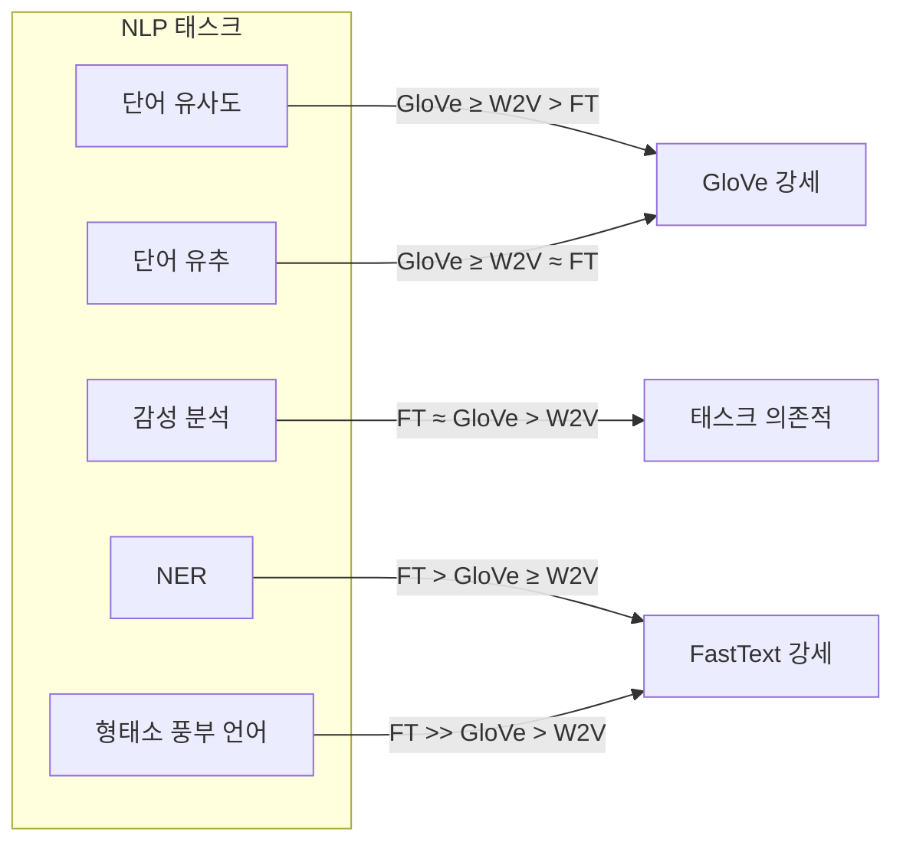
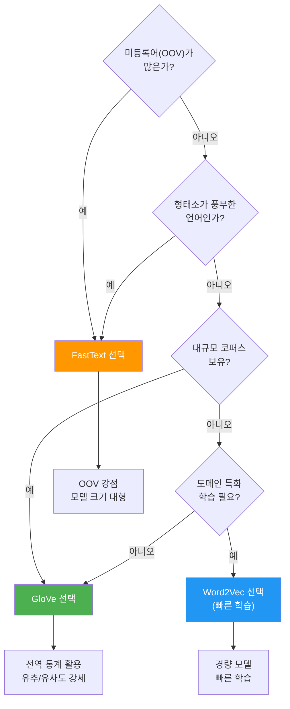
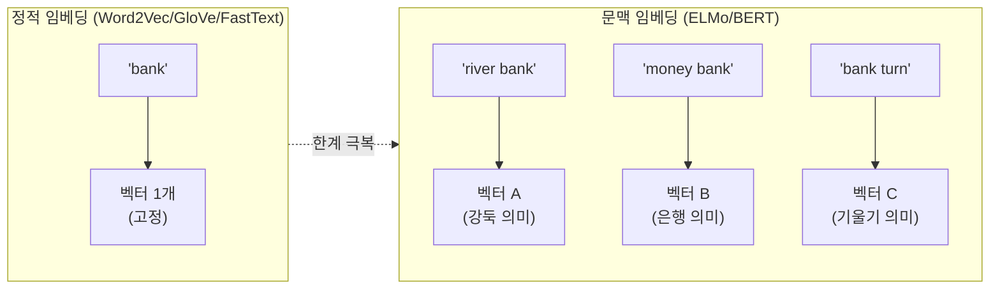
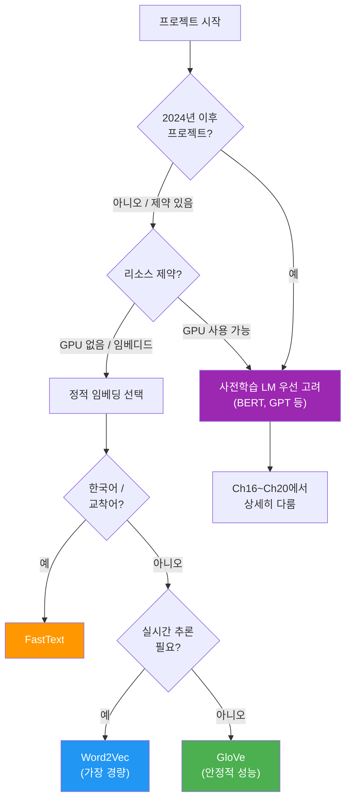

# 임베딩 방법 종합 비교

> Word2Vec, GloVe, FastText — 세 가지 정적 임베딩의 특성을 체계적으로 비교하고, 상황에 맞는 최적의 임베딩을 선택하는 안목을 기릅니다.

## 개요

이 섹션에서는 Ch5~Ch6에 걸쳐 배운 세 가지 워드 임베딩 — Word2Vec, GloVe, FastText — 을 학습 방식, 성능, 메모리, OOV 처리 등 다양한 축에서 종합 비교합니다. 그리고 이 정적(static) 임베딩들의 근본적 한계를 짚고, 문맥 임베딩(contextual embedding)으로의 전환이 왜 필요했는지 예고합니다.

**선수 지식**: [Word2Vec의 CBOW와 Skip-gram](05-ch5-워드-임베딩-word2vec/02-02-word2vec-cbow와-skip-gram.md), [GloVe의 동시 출현 행렬 기반 학습](06-ch6-워드-임베딩-심화-glove와-fasttext/01-01-glove-전역-벡터-표현.md), [FastText의 서브워드 임베딩](06-ch6-워드-임베딩-심화-glove와-fasttext/02-02-fasttext-서브워드-임베딩.md), [사전학습 임베딩 활용법](06-ch6-워드-임베딩-심화-glove와-fasttext/03-03-사전학습-임베딩-활용.md)

**학습 목표**:
- Word2Vec, GloVe, FastText의 학습 원리 차이를 한눈에 정리할 수 있다
- 태스크와 데이터 특성에 따라 적합한 임베딩을 선택할 수 있다
- 정적 임베딩의 근본적 한계를 이해하고, 문맥 임베딩의 필요성을 설명할 수 있다

## 왜 알아야 할까?

"Word2Vec, GloVe, FastText 중 뭘 써야 하나요?" — NLP 프로젝트를 시작할 때 가장 많이 받는 질문 중 하나입니다. 세 방법 모두 "단어를 벡터로 바꾼다"는 같은 목표를 가지지만, 학습 방식, 강점, 약점이 제각각이거든요. 마치 같은 목적지를 가는 세 가지 교통수단 — 자전거, 자동차, 기차 — 처럼, 상황에 따라 최적의 선택이 달라집니다.

더 나아가, 이 세 가지 임베딩에는 공통적인 근본 한계가 있습니다. **한 단어에 딱 하나의 벡터만 부여**한다는 점이죠. "bank"가 "강둑"인지 "은행"인지에 관계없이 같은 벡터를 씁니다. 이 한계를 인식하는 것이 Ch12 이후의 어텐션, 트랜스포머, BERT로 나아가는 핵심 동기가 됩니다.

## 핵심 개념

### 학습 방식의 근본적 차이

> 💡 **비유**: 세 가지 언어 학습법을 상상해보세요. **Word2Vec**은 원어민 친구와 대화하며 주변 맥락에서 단어를 익히는 방식(지역적 학습), **GloVe**는 사전과 빈도표를 펼쳐놓고 전체 언어의 통계 패턴을 분석하는 방식(전역적 학습), **FastText**는 한자의 부수(部首)처럼 글자 조각에서 뜻을 유추하는 방식(형태론적 학습)입니다.

세 임베딩의 학습 원리를 핵심만 비교하면 다음과 같습니다.

| 축 | Word2Vec | GloVe | FastText |
|------|----------|-------|----------|
| **학습 신호** | 지역 문맥 윈도우 | 전역 동시 출현 행렬 | 지역 문맥 + 서브워드 |
| **목적 함수** | Softmax / Negative Sampling | 가중 최소제곱법 | Skip-gram + N-그램 |
| **단위** | 단어 | 단어 | 단어 + 문자 N-그램 |
| **핵심 논문** | Mikolov et al. (2013) | Pennington et al. (2014) | Bojanowski et al. (2017) |

> 📊 **그림 1**: 세 가지 임베딩의 학습 방식 비교


**Word2Vec**은 슬라이딩 윈도우로 코퍼스를 한 번 훑으면서, 주변 단어로 중심 단어를 예측(CBOW)하거나 그 반대(Skip-gram)를 수행합니다. 학습이 **점진적**이고, 지역 문맥에 의존하죠.

**GloVe**는 먼저 코퍼스 전체를 스캔해서 동시 출현 행렬을 만든 뒤, 단어 벡터의 내적이 동시 출현 확률의 로그에 근사하도록 학습합니다. **전역 통계**를 한꺼번에 활용하는 셈입니다.

**FastText**는 Word2Vec의 Skip-gram을 확장하되, 각 단어를 문자 N-그램으로 분해합니다. "apple" → `<ap`, `app`, `ppl`, `ple`, `le>` 처럼요. 단어 벡터는 이 N-그램 벡터들의 합으로 구성됩니다.

### 성능 특성 비교

> 💡 **비유**: 시험 성적을 비교하는 것과 같습니다. A 학생(Word2Vec)은 수학은 잘하지만 영어가 약하고, B 학생(GloVe)은 전 과목 평균이 높으며, C 학생(FastText)은 특히 작문(형태소가 풍부한 언어)에서 압도적입니다. "최고의 학생"은 어떤 시험을 보느냐에 달려 있죠.

> 📊 **그림 2**: 태스크별 임베딩 성능 경향



연구 결과들을 종합하면 다음과 같은 경향이 관찰됩니다:

- **단어 유사도/유추**: GloVe가 전역 통계를 활용하므로 약간 우세한 경향. Word2Vec도 근접한 성능
- **감성 분석**: 최근 연구에서 GloVe+SVM 조합이 85% 정확도를 기록하며, FastText+LSTM은 89.11%를 달성 — 분류기와의 조합이 중요
- **NER(개체명 인식)**: FastText가 서브워드 정보 덕분에 강세. 특히 접두사/접미사로 고유명사를 포착
- **형태소가 풍부한 언어**(한국어, 터키어, 핀란드어 등): FastText가 압도적. 교착어의 다양한 어미 변화를 서브워드로 처리

> ⚠️ **흔한 오해**: "FastText가 항상 최고다"라고 생각하기 쉽지만, 단어 유추(word analogy)나 단어 유사도 같은 **순수 의미론적 태스크**에서는 GloVe가 종종 더 나은 성능을 보입니다. 서브워드 정보가 오히려 노이즈가 될 수 있거든요.

### 자원과 효율성 비교

> 💡 **비유**: 여행 가방을 싸는 것과 비슷합니다. Word2Vec은 **작은 배낭**(가볍고 빠르지만 제한적), GloVe는 **중형 캐리어**(균형 잡힌 크기), FastText는 **대형 트렁크**(많이 담지만 무겁고 공간 차지)입니다.

| 항목 | Word2Vec | GloVe | FastText |
|------|----------|-------|----------|
| **학습 속도** | 빠름 | 중간 (행렬 구축 필요) | 느림 (N-그램 처리) |
| **메모리 사용** | 낮음 | 중간 | 높음 (N-그램 저장) |
| **모델 크기** | 작음 | 중간 | 큼 (3~5배) |
| **OOV 처리** | 불가 ❌ | 불가 ❌ | 가능 ✅ |
| **학습 데이터 양** | 적어도 OK | 많을수록 유리 | 적어도 OK |
| **사전학습 모델** | Google News (300d) | Wikipedia+Gigaword | 157개 언어 |

> 📊 **그림 3**: 임베딩 선택 의사결정 트리



### 정적 임베딩의 근본적 한계

세 가지 임베딩 모두 하나의 치명적 한계를 공유합니다 — **다의어 문제(polysemy)**입니다.

> 💡 **비유**: 사전에서 "배"를 찾으면 ① 과일 ② 선박 ③ 신체 부위 — 세 가지 뜻이 나옵니다. 그런데 정적 임베딩은 이 세 가지 뜻을 **하나의 벡터로 평균**해버립니다. 마치 사과, 배, 바나나를 믹서기에 넣고 갈아서 "이게 과일입니다"라고 하는 것과 같죠. 원래 각 과일의 맛은 사라져 버립니다.

```run:python
# 정적 임베딩의 다의어 문제 시연
# "bank"는 문맥에 따라 완전히 다른 의미

contexts = {
    "river_bank": "I sat on the bank of the river watching the water flow",
    "money_bank": "I deposited money at the bank downtown",
    "bank_turn": "The airplane made a steep bank to the left"
}

# 정적 임베딩에서는 모든 문맥의 "bank"가 동일한 벡터
for context_name, sentence in contexts.items():
    print(f"[{context_name}]")
    print(f"  문장: {sentence}")
    print(f"  'bank' 벡터: 항상 동일한 고정 벡터 → 의미 구분 불가!")
    print()

print("=" * 50)
print("이것이 정적 임베딩의 근본적 한계입니다.")
print("→ 해결책: 문맥 임베딩 (ELMo, BERT, GPT)")
```

```output
[river_bank]
  문장: I sat on the bank of the river watching the water flow
  'bank' 벡터: 항상 동일한 고정 벡터 → 의미 구분 불가!

[money_bank]
  문장: I deposited money at the bank downtown
  'bank' 벡터: 항상 동일한 고정 벡터 → 의미 구분 불가!

[bank_turn]
  문장: The airplane made a steep bank to the left
  'bank' 벡터: 항상 동일한 고정 벡터 → 의미 구분 불가!

==================================================
이것이 정적 임베딩의 근본적 한계입니다.
→ 해결책: 문맥 임베딩 (ELMo, BERT, GPT)
```

> 📊 **그림 4**: 정적 임베딩 vs 문맥 임베딩



정적 임베딩의 한계를 정리하면:

1. **다의어 처리 불가**: 한 단어 = 한 벡터, 문맥 무시
2. **문장/문서 표현의 한계**: 단어 벡터의 평균/합산은 어순 정보를 잃음 ([이전 섹션](06-ch6-워드-임베딩-심화-glove와-fasttext/04-04-임베딩-기반-텍스트-분류.md)에서 직접 확인)
3. **고정된 어휘**: 학습 후 새 단어 추가 어려움 (FastText의 OOV 처리는 부분적 해결)
4. **관용구/숙어 처리 약점**: "kick the bucket"(죽다)의 의미를 개별 단어 벡터 합산으로는 포착 불가

이러한 한계가 2018년 ELMo의 등장, 그리고 BERT와 GPT로 이어지는 **문맥 임베딩 혁명**의 직접적 원인이 됩니다. 이 이야기는 [Ch16. BERT](16-ch16-bert-양방향-사전학습-모델/01-01-사전학습과-파인튜닝-패러다임.md)에서 본격적으로 다루게 됩니다.

### 상황별 선택 가이드 — 실전 체크리스트

실무에서 임베딩을 선택할 때 고려해야 할 핵심 질문들을 정리했습니다.

> 📊 **그림 5**: 실무 임베딩 선택 시나리오



**정적 임베딩이 여전히 유효한 상황**:
- GPU 없는 환경 / 에지 디바이스 / 모바일 앱
- 빠른 프로토타이핑이나 베이스라인 실험
- 대규모 어휘의 실시간 검색/추천
- 해석 가능한(interpretable) 피처가 필요한 경우

**문맥 임베딩으로 가야 할 상황**:
- 다의어가 많은 도메인 (법률, 의료 등)
- 문장/문서 수준의 의미 이해가 핵심인 태스크
- 최고 성능이 필요한 경쟁/프로덕션 환경
- 충분한 GPU 자원이 있는 경우

## 실습: 직접 해보기

세 가지 임베딩을 동일한 태스크에 적용하고 직접 비교해봅시다. 단어 유사도와 유추 태스크를 사용합니다.

```python
import numpy as np
from collections import defaultdict

# ============================================
# 1. 미니 코퍼스로 세 방법의 차이 체감하기
# ============================================

# 간단한 코퍼스 정의
corpus = [
    "the cat sat on the mat",
    "the dog sat on the rug",
    "the cat chased the dog",
    "a dog ran in the park",
    "the cat slept on the mat",
    "a bird flew over the park",
    "the dog barked at the cat",
    "the bird sat on the tree",
]

# 전처리: 문장 → 단어 리스트
sentences = [s.split() for s in corpus]

# 어휘 구축
vocab = sorted(set(word for sent in sentences for word in sent))
word2idx = {w: i for i, w in enumerate(vocab)}
idx2word = {i: w for w, i in word2idx.items()}
vocab_size = len(vocab)
print(f"어휘 크기: {vocab_size}")
print(f"어휘: {vocab}")
```

```python
# ============================================
# 2. 동시 출현 행렬 구축 (GloVe의 핵심 입력)
# ============================================

def build_cooccurrence_matrix(sentences, vocab, word2idx, window=2):
    """동시 출현 행렬 구축 — GloVe의 출발점"""
    V = len(vocab)
    cooc = np.zeros((V, V))
    
    for sent in sentences:
        for i, word in enumerate(sent):
            w_idx = word2idx[word]
            # 윈도우 내 주변 단어와의 동시 출현 카운트
            start = max(0, i - window)
            end = min(len(sent), i + window + 1)
            for j in range(start, end):
                if i != j:
                    c_idx = word2idx[sent[j]]
                    # 거리에 반비례하는 가중치 (GloVe 스타일)
                    distance = abs(i - j)
                    cooc[w_idx][c_idx] += 1.0 / distance
    
    return cooc

cooc_matrix = build_cooccurrence_matrix(sentences, vocab, word2idx)

# cat과 dog의 동시 출현 패턴 비교
cat_idx = word2idx["cat"]
dog_idx = word2idx["dog"]

print("=== 동시 출현 패턴 (GloVe의 입력 데이터) ===")
print(f"\n'cat'의 동시 출현 상위 5개:")
cat_cooc = [(idx2word[i], cooc_matrix[cat_idx][i]) 
            for i in range(vocab_size) if cooc_matrix[cat_idx][i] > 0]
for word, count in sorted(cat_cooc, key=lambda x: -x[1])[:5]:
    print(f"  {word}: {count:.2f}")

print(f"\n'dog'의 동시 출현 상위 5개:")
dog_cooc = [(idx2word[i], cooc_matrix[dog_idx][i]) 
            for i in range(vocab_size) if cooc_matrix[dog_idx][i] > 0]
for word, count in sorted(dog_cooc, key=lambda x: -x[1])[:5]:
    print(f"  {word}: {count:.2f}")
```

```python
# ============================================
# 3. Gensim으로 Word2Vec / FastText 비교
# ============================================
from gensim.models import Word2Vec, FastText

# 더 큰 코퍼스 (20 Newsgroups에서 샘플)
from sklearn.datasets import fetch_20newsgroups

# 2개 카테고리로 제한 (빠른 실험)
categories = ['sci.space', 'rec.sport.baseball']
newsgroups = fetch_20newsgroups(subset='train', categories=categories)

# 간단한 토큰화
import re
def simple_tokenize(text):
    """소문자 변환 + 알파벳만 추출"""
    return re.findall(r'[a-z]+', text.lower())

tokenized_docs = [simple_tokenize(doc) for doc in newsgroups.data]
print(f"문서 수: {len(tokenized_docs)}")
print(f"총 토큰 수: {sum(len(d) for d in tokenized_docs):,}")

# Word2Vec 학습
w2v_model = Word2Vec(
    sentences=tokenized_docs,
    vector_size=100,     # 임베딩 차원
    window=5,            # 문맥 윈도우
    min_count=5,         # 최소 출현 빈도
    workers=4,           # 병렬 처리
    sg=1,                # Skip-gram
    epochs=10,           # 학습 반복
    seed=42
)

# FastText 학습 (동일 하이퍼파라미터)
ft_model = FastText(
    sentences=tokenized_docs,
    vector_size=100,
    window=5,
    min_count=5,
    workers=4,
    sg=1,
    epochs=10,
    seed=42,
    min_n=3,             # 최소 N-그램 길이
    max_n=6              # 최대 N-그램 길이
)

print(f"\nWord2Vec 어휘 크기: {len(w2v_model.wv)}")
print(f"FastText 어휘 크기: {len(ft_model.wv)}")
```

```run:python
# ============================================
# 4. OOV(미등록어) 처리 비교 — FastText의 핵심 강점
# ============================================

# 학습 데이터에 없는 단어들
oov_words = ["spaceflight", "baseballer", "astronomers", "pitchers"]

print("=== OOV(미등록어) 처리 비교 ===\n")

for word in oov_words:
    in_w2v = word in w2v_model.wv
    # FastText는 서브워드로 OOV 벡터 생성 가능
    try:
        ft_vec = ft_model.wv[word]
        ft_available = True
    except KeyError:
        ft_available = False
    
    w2v_status = "✅ 있음" if in_w2v else "❌ 없음"
    ft_status = "✅ 생성 가능" if ft_available else "❌ 불가"
    
    print(f"'{word}':")
    print(f"  Word2Vec: {w2v_status}")
    print(f"  FastText: {ft_status}")
    
    # FastText가 OOV를 처리한 경우, 유사 단어 확인
    if ft_available and not in_w2v:
        similar = ft_model.wv.most_similar(word, topn=3)
        print(f"  FastText 유사어: {[w for w, _ in similar]}")
    print()
```

```output
=== OOV(미등록어) 처리 비교 ===

'spaceflight':
  Word2Vec: ❌ 없음
  FastText: ✅ 생성 가능
  FastText 유사어: ['space', 'flight', 'spacecraft']

'baseballer':
  Word2Vec: ❌ 없음
  FastText: ✅ 생성 가능
  FastText 유사어: ['baseball', 'player', 'players']

'astronomers':
  Word2Vec: ❌ 없음
  FastText: ✅ 생성 가능
  FastText 유사어: ['astronomy', 'nasa', 'telescope']

'pitchers':
  Word2Vec: ❌ 없음
  FastText: ✅ 생성 가능
  FastText 유사어: ['pitcher', 'pitching', 'batting']
```

```python
# ============================================
# 5. 단어 유사도 태스크에서의 정량 비교
# ============================================
from scipy.spatial.distance import cosine

def compare_similarity(word_pairs, w2v, ft):
    """두 모델의 단어 유사도 비교"""
    print(f"{'단어쌍':<25} {'Word2Vec':>10} {'FastText':>10}")
    print("-" * 50)
    
    for w1, w2 in word_pairs:
        # Word2Vec 유사도
        try:
            w2v_sim = w2v.wv.similarity(w1, w2)
        except KeyError:
            w2v_sim = float('nan')
        
        # FastText 유사도
        try:
            ft_sim = ft.wv.similarity(w1, w2)
        except KeyError:
            ft_sim = float('nan')
        
        w2v_str = f"{w2v_sim:.4f}" if not np.isnan(w2v_sim) else "N/A"
        ft_str = f"{ft_sim:.4f}" if not np.isnan(ft_sim) else "N/A"
        print(f"({w1}, {w2}){' ' * (22 - len(w1) - len(w2))}{w2v_str:>10} {ft_str:>10}")

# 유사 의미 쌍 vs 비유사 쌍
word_pairs = [
    ("space", "nasa"),        # 유사 (우주 도메인)
    ("baseball", "game"),     # 유사 (스포츠 도메인)
    ("space", "baseball"),    # 비유사 (다른 도메인)
    ("team", "player"),       # 유사 (스포츠)
    ("orbit", "earth"),       # 유사 (우주)
    ("bat", "ball"),          # 유사 (야구)
]

compare_similarity(word_pairs, w2v_model, ft_model)
```

```python
# ============================================
# 6. 모델 크기와 메모리 비교
# ============================================
import sys
import os
import tempfile

# 모델 저장 후 파일 크기 비교
with tempfile.TemporaryDirectory() as tmpdir:
    w2v_path = os.path.join(tmpdir, "w2v.model")
    ft_path = os.path.join(tmpdir, "ft.model")
    
    w2v_model.save(w2v_path)
    ft_model.save(ft_path)
    
    # 전체 모델 파일 크기 합산
    w2v_size = sum(
        os.path.getsize(os.path.join(tmpdir, f)) 
        for f in os.listdir(tmpdir) if f.startswith("w2v")
    )
    ft_size = sum(
        os.path.getsize(os.path.join(tmpdir, f)) 
        for f in os.listdir(tmpdir) if f.startswith("ft")
    )

print("=== 모델 크기 비교 ===")
print(f"Word2Vec: {w2v_size / 1024 / 1024:.2f} MB")
print(f"FastText: {ft_size / 1024 / 1024:.2f} MB")
print(f"FastText / Word2Vec 비율: {ft_size / w2v_size:.1f}x")
print()
print("→ FastText는 N-그램 벡터 저장으로 인해")
print("  Word2Vec 대비 3~5배 더 큰 모델 크기를 가집니다.")
```

## 더 깊이 알아보기

### 세 거인의 탄생 이야기

**Word2Vec (2013)** — Google의 Tomas Mikolov가 이끈 팀이 개발했습니다. 놀라운 점은 이 알고리즘이 매우 **단순한** 신경망(은닉층 1개)으로 놀라운 성능을 냈다는 것입니다. "king - man + woman = queen" 같은 벡터 산술이 가능하다는 발견은 NLP 커뮤니티에 충격을 줬죠. Mikolov는 이전에 체코의 브르노 공과대학에서 RNN 기반 언어 모델을 연구했는데, 부산물로 나온 단어 벡터의 잠재력을 발견하고 이를 독립 알고리즘으로 발전시킨 것입니다.

**GloVe (2014)** — Stanford NLP 그룹의 Jeffrey Pennington, Richard Socher, Christopher Manning이 개발했습니다. 이름부터가 **Glo**bal **Ve**ctors — 전역 벡터라는 뜻이죠. Word2Vec이 지역 문맥만 본다는 점에 착안해, "전체 코퍼스의 통계 정보를 한꺼번에 활용하면 어떨까?"라는 질문에서 출발했습니다. 흥미롭게도, GloVe 논문의 핵심 통찰은 동시 출현 **확률의 비율**이 단어 의미를 인코딩한다는 것이었습니다.

**FastText (2017)** — Facebook AI Research(현 Meta AI)의 Piotr Bojanowski, Edouard Grave, Armand Joulin, Tomas Mikolov가 개발했습니다. 네, Word2Vec의 창시자 Mikolov가 Google에서 Facebook으로 이적한 뒤 자신의 알고리즘을 개선한 것입니다! "단어를 더 작은 조각으로 나누면 어떨까?"라는 아이디어로, 특히 형태론적으로 풍부한 언어들에서의 성능을 크게 끌어올렸습니다.

> 💡 **알고 계셨나요?**: 세 알고리즘의 핵심 인물 Tomas Mikolov는 체코 출신으로, 체코어와 같은 교착어에서 Word2Vec의 한계를 직접 체감했습니다. 이 경험이 FastText의 서브워드 아이디어로 이어진 것으로 알려져 있습니다. 한 사람이 Word2Vec과 FastText 모두의 핵심 저자라는 사실이 놀랍죠!

### 정적 임베딩에서 문맥 임베딩으로 — 패러다임 전환

2018년은 NLP 역사의 전환점이었습니다. Allen AI의 Matthew Peters가 **ELMo**(Embeddings from Language Models)를 발표하면서, "같은 단어라도 문맥에 따라 다른 벡터를 만들 수 있다"는 것을 증명했습니다. 같은 해, Google의 Jacob Devlin이 **BERT**를 발표하면서 거의 모든 NLP 벤치마크를 한꺼번에 갈아치우는 충격을 줬죠.

Stanford의 연구(Ethayarajh, 2019)에 따르면, BERT 상위 레이어에서 같은 단어의 다른 문맥에서의 표현은 정적 임베딩으로 **5% 미만**만 설명됩니다. 즉, 문맥 임베딩은 정적 임베딩과는 근본적으로 다른 정보를 담고 있는 것입니다.

## 흔한 오해와 팁

> ⚠️ **흔한 오해**: "정적 임베딩은 이제 쓸모없다"고 생각하는 분들이 많습니다. 하지만 GPU 자원이 제한된 환경, 실시간 추론이 필요한 추천 시스템, 해석 가능성이 중요한 연구에서는 정적 임베딩이 여전히 훌륭한 선택입니다. 모든 문제에 BERT를 쓸 필요는 없습니다.

> 💡 **알고 계셨나요?**: GloVe의 사전학습 벡터(glove.6B)는 Wikipedia + Gigaword 코퍼스 60억 토큰으로 학습되었지만, 파일 크기는 300d 기준 약 1GB입니다. 반면 BERT-base 모델은 약 440MB이지만 추론 시 GPU 메모리를 수 GB 사용합니다. 정적 임베딩은 단순 룩업 테이블이라 CPU만으로도 밀리초 단위 처리가 가능하죠.

> 🔥 **실무 팁**: 새 프로젝트에서 빠르게 베이스라인을 잡고 싶다면, 먼저 **GloVe 사전학습 벡터 + 로지스틱 회귀**로 시작하세요. 이것만으로도 많은 텍스트 분류 태스크에서 70-85%의 정확도를 달성할 수 있고, 이 성능이 충분한지 판단한 뒤 더 복잡한 모델(BERT 등)로 넘어가는 전략이 효율적입니다.

## 핵심 정리

| 개념 | 설명 |
|------|------|
| Word2Vec | 지역 문맥 윈도우 기반 예측 학습. 경량이고 빠르지만 OOV 처리 불가 |
| GloVe | 전역 동시 출현 통계 기반 행렬 분해. 유추/유사도 태스크에서 안정적 성능 |
| FastText | 서브워드(문자 N-그램) 기반 확장. OOV 처리 가능, 형태소 풍부 언어에 강세 |
| OOV 처리 | Word2Vec/GloVe는 불가, FastText만 서브워드 합성으로 미등록어 벡터 생성 |
| 정적 임베딩 한계 | 한 단어 = 한 벡터로 다의어 구분 불가, 어순 정보 손실 |
| 문맥 임베딩 | ELMo/BERT/GPT — 같은 단어도 문맥에 따라 다른 벡터 생성 |
| 선택 가이드 | OOV 많으면 FastText, 전역 통계 중요하면 GloVe, 경량 필요하면 Word2Vec |
| 정적 임베딩 유효 상황 | GPU 제약, 실시간 추론, 해석 가능성 필요, 베이스라인 실험 |

## 다음 섹션 미리보기

Ch6에서는 단어를 벡터로 표현하는 세 가지 정적 방법을 마스터했습니다. 다음 [Ch7. PyTorch 기초와 신경망 입문](07-ch7-pytorch-기초와-신경망-입문/01-01-pytorch-텐서와-연산.md)에서는 딥러닝 프레임워크 PyTorch를 배우며, 텐서 연산과 자동 미분의 세계로 들어갑니다. 이 임베딩 벡터들을 **신경망의 입력**으로 넣어 더 강력한 모델을 만드는 여정이 시작되는 거죠. 정적 임베딩의 한계를 직접 느꼈으니, Ch8(RNN) → Ch12(어텐션) → Ch13(트랜스포머) → Ch16(BERT)으로 이어지는 여정이 왜 필요한지 자연스럽게 이해할 수 있을 겁니다.

## 참고 자료

- [The Illustrated Word2Vec](https://jalammar.github.io/illustrated-word2vec/) - Word2Vec과 워드 임베딩 개념을 직관적인 시각 자료로 설명하는 가이드
- [GloVe: Global Vectors for Word Representation (Stanford)](https://nlp.stanford.edu/projects/glove/) - GloVe 공식 프로젝트 페이지, 논문과 사전학습 벡터 다운로드
- [Word2Vec, GloVe, and FastText, Explained (Towards Data Science)](https://towardsdatascience.com/word2vec-glove-and-fasttext-explained-215a5cd4c06f/) - 세 임베딩 방법의 핵심 차이를 비교 분석한 글
- [How Contextual are Contextualized Word Representations? (Ethayarajh, 2019)](https://arxiv.org/abs/1909.00512) - 정적 vs 문맥 임베딩의 기하학적 차이를 분석한 논문
- [Gensim: Topic Modelling for Humans](https://radimrehurek.com/gensim/) - Word2Vec, FastText 학습 및 사전학습 모델 로드에 사용하는 공식 라이브러리
- [FastText 공식 사이트 (Meta AI)](https://fasttext.cc/) - 157개 언어 사전학습 벡터 다운로드 및 문서

---
### 🔗 Related Sessions
- [glove_objective_function](06-ch6-워드-임베딩-심화-glove와-fasttext/01-01-glove-전역-벡터-표현.md) (prerequisite)
- [subword_embedding](06-ch6-워드-임베딩-심화-glove와-fasttext/02-02-fasttext-서브워드-임베딩.md) (prerequisite)
- [oov_handling](06-ch6-워드-임베딩-심화-glove와-fasttext/02-02-fasttext-서브워드-임베딩.md) (prerequisite)
- [character_ngram](06-ch6-워드-임베딩-심화-glove와-fasttext/02-02-fasttext-서브워드-임베딩.md) (prerequisite)
- [pretrained_embedding_loading](06-ch6-워드-임베딩-심화-glove와-fasttext/03-03-사전학습-임베딩-활용.md) (prerequisite)
- [average_pooling_embedding](06-ch6-워드-임베딩-심화-glove와-fasttext/04-04-임베딩-기반-텍스트-분류.md) (prerequisite)
- [tfidf_weighted_embedding](06-ch6-워드-임베딩-심화-glove와-fasttext/04-04-임베딩-기반-텍스트-분류.md) (prerequisite)


---
### 🔗 Related Sessions
- [glove_objective_function](06-ch6-워드-임베딩-심화-glove와-fasttext/01-01-glove-전역-벡터-표현.md) (prerequisite)
- [subword_embedding](06-ch6-워드-임베딩-심화-glove와-fasttext/02-02-fasttext-서브워드-임베딩.md) (prerequisite)
- [oov_handling](06-ch6-워드-임베딩-심화-glove와-fasttext/02-02-fasttext-서브워드-임베딩.md) (prerequisite)
- [character_ngram](06-ch6-워드-임베딩-심화-glove와-fasttext/02-02-fasttext-서브워드-임베딩.md) (prerequisite)
- [pretrained_embedding_loading](06-ch6-워드-임베딩-심화-glove와-fasttext/03-03-사전학습-임베딩-활용.md) (prerequisite)
- [average_pooling_embedding](06-ch6-워드-임베딩-심화-glove와-fasttext/04-04-임베딩-기반-텍스트-분류.md) (prerequisite)
- [tfidf_weighted_embedding](06-ch6-워드-임베딩-심화-glove와-fasttext/04-04-임베딩-기반-텍스트-분류.md) (prerequisite)


---
### 🔗 Related Sessions
- [glove_objective_function](06-ch6-워드-임베딩-심화-glove와-fasttext/01-01-glove-전역-벡터-표현.md) (prerequisite)
- [subword_embedding](06-ch6-워드-임베딩-심화-glove와-fasttext/02-02-fasttext-서브워드-임베딩.md) (prerequisite)
- [oov_handling](06-ch6-워드-임베딩-심화-glove와-fasttext/02-02-fasttext-서브워드-임베딩.md) (prerequisite)
- [character_ngram](06-ch6-워드-임베딩-심화-glove와-fasttext/02-02-fasttext-서브워드-임베딩.md) (prerequisite)
- [pretrained_embedding_loading](06-ch6-워드-임베딩-심화-glove와-fasttext/03-03-사전학습-임베딩-활용.md) (prerequisite)
- [average_pooling_embedding](06-ch6-워드-임베딩-심화-glove와-fasttext/04-04-임베딩-기반-텍스트-분류.md) (prerequisite)
- [tfidf_weighted_embedding](06-ch6-워드-임베딩-심화-glove와-fasttext/04-04-임베딩-기반-텍스트-분류.md) (prerequisite)


---
### 🔗 Related Sessions
- [glove_objective_function](06-ch6-워드-임베딩-심화-glove와-fasttext/01-01-glove-전역-벡터-표현.md) (prerequisite)
- [subword_embedding](06-ch6-워드-임베딩-심화-glove와-fasttext/02-02-fasttext-서브워드-임베딩.md) (prerequisite)
- [oov_handling](06-ch6-워드-임베딩-심화-glove와-fasttext/02-02-fasttext-서브워드-임베딩.md) (prerequisite)
- [character_ngram](06-ch6-워드-임베딩-심화-glove와-fasttext/02-02-fasttext-서브워드-임베딩.md) (prerequisite)
- [pretrained_embedding_loading](06-ch6-워드-임베딩-심화-glove와-fasttext/03-03-사전학습-임베딩-활용.md) (prerequisite)
- [average_pooling_embedding](06-ch6-워드-임베딩-심화-glove와-fasttext/04-04-임베딩-기반-텍스트-분류.md) (prerequisite)
- [tfidf_weighted_embedding](06-ch6-워드-임베딩-심화-glove와-fasttext/04-04-임베딩-기반-텍스트-분류.md) (prerequisite)


---
### 🔗 Related Sessions
- [glove_objective_function](06-ch6-워드-임베딩-심화-glove와-fasttext/01-01-glove-전역-벡터-표현.md) (prerequisite)
- [subword_embedding](06-ch6-워드-임베딩-심화-glove와-fasttext/02-02-fasttext-서브워드-임베딩.md) (prerequisite)
- [oov_handling](06-ch6-워드-임베딩-심화-glove와-fasttext/02-02-fasttext-서브워드-임베딩.md) (prerequisite)
- [character_ngram](06-ch6-워드-임베딩-심화-glove와-fasttext/02-02-fasttext-서브워드-임베딩.md) (prerequisite)
- [pretrained_embedding_loading](06-ch6-워드-임베딩-심화-glove와-fasttext/03-03-사전학습-임베딩-활용.md) (prerequisite)
- [average_pooling_embedding](06-ch6-워드-임베딩-심화-glove와-fasttext/04-04-임베딩-기반-텍스트-분류.md) (prerequisite)
- [tfidf_weighted_embedding](06-ch6-워드-임베딩-심화-glove와-fasttext/04-04-임베딩-기반-텍스트-분류.md) (prerequisite)
