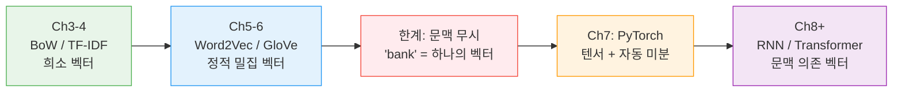
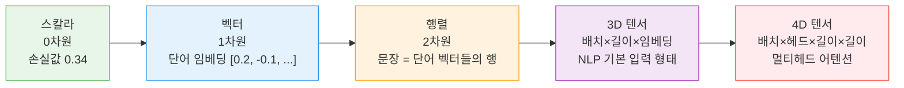
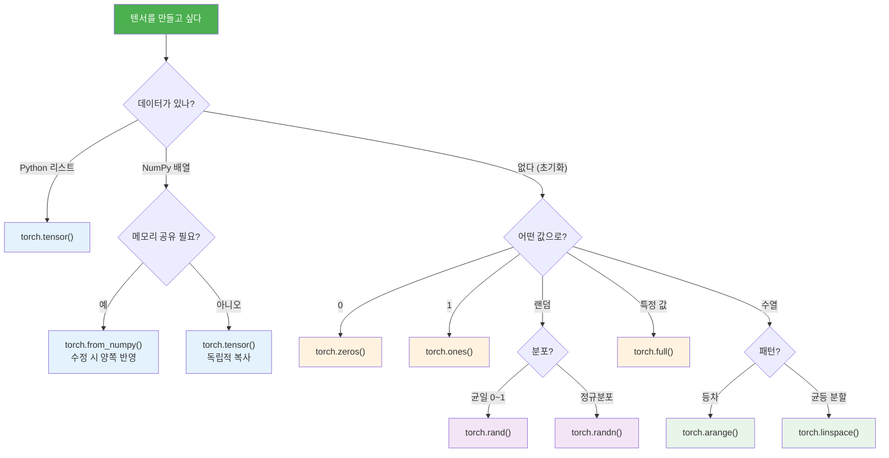
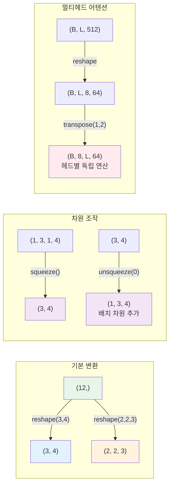
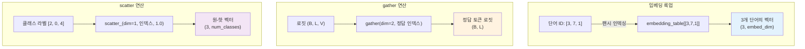
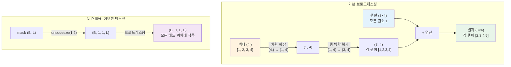
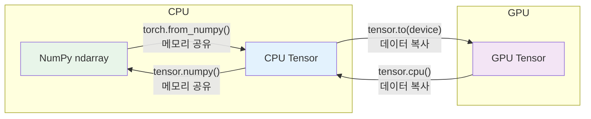
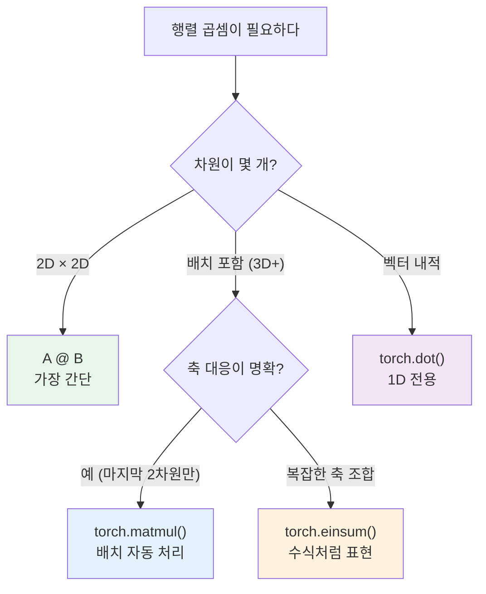

# PyTorch 텐서와 연산

> PyTorch의 핵심 데이터 구조인 텐서(Tensor)를 이해하고, 생성·변환·연산을 자유자재로 다루는 법을 배웁니다.

## 개요

[Ch6에서 Word2Vec과 GloVe](05-ch5-워드-임베딩-word2vec/05-05-glove와-fasttext-word2vec을-넘어서.md)까지 살펴보면서, 정적 임베딩의 근본적인 한계를 확인했습니다. 단어 하나에 벡터 하나 — "bank"가 은행이든 강둑이든 같은 벡터를 쓸 수밖에 없다는 문제였죠. 이 한계를 돌파하려면 **문맥을 이해하는 신경망**이 필요하고, 그 신경망을 구축하는 도구가 바로 **PyTorch**입니다.

이 섹션에서는 PyTorch의 가장 기본 단위인 텐서를 체계적으로 학습합니다. 단순히 "배열을 만드는 법"을 넘어, NLP 파이프라인에서 텐서가 어떤 역할을 하는지 — 임베딩 룩업, 배치 패딩, 어텐션 마스킹 등 실전 패턴과 연결하면서 익히겠습니다.

**선수 지식**: [Python NLP 개발 환경 구축](01-ch1-자연어-처리-개요와-개발-환경-설정/03-03-python-nlp-개발-환경-구축.md)에서 설정한 Python 환경, NumPy 기초 지식, [워드 임베딩](05-ch5-워드-임베딩-word2vec/01-01-분포-가설과-밀집-벡터-표현.md)의 기본 개념
**학습 목표**:
- PyTorch 텐서를 다양한 방법으로 생성하고 NLP 맥락에서의 용도를 설명할 수 있다
- 형상(shape) 변환, 인덱싱, 슬라이싱을 자유롭게 활용할 수 있다
- 브로드캐스팅 규칙을 이해하고 배치 연산에 적용할 수 있다
- CPU/GPU 간 텐서 이동과 NumPy 변환을 수행할 수 있다
- 텐서 연산으로 간단한 임베딩 파이프라인을 직접 구현할 수 있다

## 왜 알아야 할까?

Ch6까지의 여정을 돌아보면, 텍스트를 숫자로 바꾸는 방법이 점점 정교해졌습니다. [BoW](03-ch3-텍스트-표현-bow와-tf-idf/02-02-bag-of-words-구현하기.md)에서 [TF-IDF](03-ch3-텍스트-표현-bow와-tf-idf/03-03-tf-idf의-이론.md)로, 다시 [워드 임베딩](05-ch5-워드-임베딩-word2vec/01-01-분포-가설과-밀집-벡터-표현.md)으로. 하지만 이 모든 방법은 **사전 학습된 고정 벡터**를 사용합니다. 문맥에 따라 벡터가 변해야 한다면? 그것이 바로 신경망의 영역이고, 이 신경망의 모든 데이터와 파라미터가 **텐서**라는 그릇에 담깁니다.

> 📊 **그림 0**: 정적 임베딩에서 신경망 기반 NLP로의 전환



텐서 연산을 제대로 이해하지 못하면, 이후 RNN, 트랜스포머, BERT 같은 모델을 구현할 때 차원 불일치(shape mismatch) 에러에 끝없이 시달리게 됩니다. 반대로 텐서를 자유롭게 다룰 수 있으면, 복잡한 모델 구현도 레고 블록 조립처럼 느껴질 거예요. 지금 이 장에서 PyTorch 기반을 단단히 다지면, 정적 임베딩의 한계를 넘어서는 신경망 세계로 자연스럽게 진입할 수 있습니다.

## 핵심 개념

### 개념 1: 텐서란 무엇인가?

> 💡 **비유**: 텐서를 **데이터를 담는 다차원 그릇**이라고 생각해보세요. 스칼라(0차원)는 숫자 하나를 담는 점, 벡터(1차원)는 숫자들의 줄, 행렬(2차원)은 숫자들의 표, 3차원 텐서는 표가 여러 장 쌓인 책입니다. NLP에서는 문장 속 단어들의 임베딩을 2차원 텐서로, 배치(batch) 단위로 묶으면 3차원 텐서로 표현합니다.

텐서(Tensor)는 수학적으로 다차원 배열을 일반화한 개념입니다. PyTorch의 `torch.Tensor`는 NumPy의 `ndarray`와 거의 동일한 인터페이스를 제공하면서, **자동 미분(autograd)**과 **GPU 연산**이라는 두 가지 초능력을 추가로 갖고 있습니다.

Ch5-6에서 다뤘던 임베딩 벡터가 1차원 텐서였다면, 이제부터는 배치 단위 처리(3D), 멀티헤드 어텐션(4D)까지 차원이 늘어납니다. 차원이 올라갈수록 텐서 조작 능력이 핵심이 되죠.

> 📊 **그림 1**: NLP에서의 텐서 차원 — 단어부터 배치까지



텐서의 핵심 속성 세 가지를 꼭 기억하세요:

| 속성 | 설명 | 예시 |
|------|------|------|
| `shape` (형상) | 각 차원의 크기 | `(32, 50, 300)` = 배치 32, 길이 50, 임베딩 300 |
| `dtype` (데이터 타입) | 원소의 자료형 | `torch.float32`, `torch.int64` |
| `device` (디바이스) | 텐서가 위치한 장치 | `cpu`, `cuda:0` |

### 개념 2: 텐서 생성하기

> 💡 **비유**: 텐서 생성은 마치 **그릇을 고르는 것**과 같습니다. 빈 그릇(zeros), 가득 찬 그릇(ones), 랜덤으로 채워진 그릇(rand), 혹은 기존 재료(리스트, NumPy 배열)를 옮겨 담는 것(tensor, from_numpy)까지 상황에 맞는 방법을 선택합니다.

PyTorch는 다양한 텐서 생성 함수를 제공하는데요, 크게 네 가지 패턴으로 나눌 수 있습니다:

1. **기존 데이터로 생성**: Python 리스트나 NumPy 배열을 텐서로 변환 — `torch.tensor()`, `torch.from_numpy()`
2. **특정 값으로 초기화**: 모든 원소를 동일한 값으로 채움 — `torch.zeros()`, `torch.ones()`, `torch.full()`
3. **랜덤 초기화**: 신경망 가중치 초기화에 핵심 — `torch.rand()` (균일분포 0~1), `torch.randn()` (표준정규분포)
4. **수열 생성**: 특정 패턴의 숫자 배열 — `torch.arange()` (등차수열), `torch.linspace()` (균등 분할)

먼저 기본적인 생성 방법부터 살펴보겠습니다.

```run:python
import torch
import numpy as np

# 1. Python 리스트에서 생성
t1 = torch.tensor([1, 2, 3, 4, 5])
print(f"리스트에서 생성: {t1}")

# 2. 0으로 채운 텐서
t2 = torch.zeros(3, 4)
print(f"zeros(3,4) shape: {t2.shape}")

# 3. 1로 채운 텐서
t3 = torch.ones(2, 3, dtype=torch.int32)
print(f"ones(2,3) dtype: {t3.dtype}")

# 4. 랜덤 텐서 (균일분포 0~1)
torch.manual_seed(42)
t4 = torch.rand(2, 3)
print(f"rand(2,3):\n{t4}")

# 5. 정규분포 랜덤 텐서
t5 = torch.randn(2, 3)
print(f"randn(2,3):\n{t5}")

# 6. 기존 텐서와 같은 shape/dtype으로 생성
t6 = torch.zeros_like(t4)
print(f"zeros_like shape: {t6.shape}, dtype: {t6.dtype}")
```

```output
리스트에서 생성: tensor([1, 2, 3, 4, 5])
zeros(3,4) shape: torch.Size([3, 4])
ones(2,3) dtype: torch.int32
rand(2,3):
tensor([[0.8823, 0.9150, 0.3829],
        [0.9593, 0.3904, 0.6009]])
randn(2,3):
tensor([[ 1.9269,  1.4873, -0.4974],
        [-0.1308, -0.2650,  0.2040]])
zeros_like shape: torch.Size([2, 3]), dtype: torch.float32
```

이어서 수열 생성, 특정 값 채우기, 그리고 NumPy 변환까지 나머지 생성 방법을 알아볼게요.

```run:python
import torch
import numpy as np

# 7. 특정 값으로 채운 텐서
t7 = torch.full((2, 3), fill_value=3.14)
print(f"full(2,3) 3.14로 채움:\n{t7}")

# 8. 등차수열 (Python의 range와 비슷)
t8 = torch.arange(0, 10, 2)  # start=0, end=10, step=2
print(f"arange(0,10,2): {t8}")

# 9. 균등 분할 (구간을 N등분)
t9 = torch.linspace(0, 1, steps=5)  # 0에서 1까지 5개 균등 분할
print(f"linspace(0,1,5): {t9}")

# 10. NumPy 배열에서 생성 (메모리 공유 — 주의!)
np_arr = np.array([1.0, 2.0, 3.0])
t_shared = torch.from_numpy(np_arr)    # 메모리 공유
t_copied = torch.tensor(np_arr)         # 독립적 복사

np_arr[0] = 99.0  # NumPy 배열 수정
print(f"from_numpy (공유): {t_shared}")   # 같이 바뀜!
print(f"torch.tensor (복사): {t_copied}") # 원본 유지

# 11. 단위 행렬 (정방 행렬 초기화에 유용)
t11 = torch.eye(3)
print(f"eye(3):\n{t11}")
```

```output
full(2,3) 3.14로 채움:
tensor([[3.1400, 3.1400, 3.1400],
        [3.1400, 3.1400, 3.1400]])
arange(0,10,2): tensor([0, 2, 4, 6, 8])
linspace(0,1,5): tensor([0.0000, 0.2500, 0.5000, 0.7500, 1.0000])
from_numpy (공유): tensor([99.,  2.,  3.], dtype=torch.float64)
torch.tensor (복사): tensor([1., 2., 3.], dtype=torch.float64)
eye(3):
tensor([[1., 0., 0.],
        [0., 1., 0.],
        [0., 0., 1.]])
```

각 생성 함수가 실전에서 언제 쓰이는지 정리하면 이렇습니다:

| 함수 | 용도 | NLP 활용 예시 |
|------|------|--------------|
| `torch.tensor()` | 기존 데이터를 텐서로 변환 | 단어 ID 시퀀스 생성 |
| `torch.zeros()` | 0으로 초기화 | 패딩 텐서, 어텐션 마스크 초기화 |
| `torch.ones()` | 1로 초기화 | 마스크 기본값, 스케일링 |
| `torch.full()` | 특정 값으로 초기화 | `-inf`로 마스크 채우기 (어텐션) |
| `torch.rand()` | 균일분포 난수 | 드롭아웃 마스크 생성 |
| `torch.randn()` | 정규분포 난수 | 가중치 초기화, 노이즈 추가 |
| `torch.arange()` | 등차수열 | 위치 인코딩(Positional Encoding) 인덱스 |
| `torch.linspace()` | 균등 분할 | 학습률 스케줄링, 시각화용 구간 |
| `torch.from_numpy()` | NumPy 변환 (공유) | scikit-learn 결과를 PyTorch로 전달 |
| `torch.eye()` | 단위 행렬 | 원-핫 인코딩 기반, 직교 초기화 |

> 📊 **그림 2**: 텐서 생성 방법 선택 가이드



> ⚠️ **흔한 오해**: `torch.tensor()`와 `torch.Tensor()`는 다릅니다! 소문자 `tensor()`는 데이터를 **복사**하고 dtype을 추론합니다. 대문자 `Tensor()`는 `FloatTensor`의 별칭으로, 정수 리스트를 넣어도 float로 변환해버리죠. **항상 소문자 `torch.tensor()`를 쓰세요.**

> 🔥 **실무 팁**: `torch.arange()`는 트랜스포머의 **위치 인코딩(Positional Encoding)**에서 핵심적으로 사용됩니다. `pos = torch.arange(0, max_len).unsqueeze(1)`처럼 위치 인덱스를 만든 뒤, 사인/코사인 함수를 적용하는 패턴이 거의 공식처럼 쓰이니 기억해두세요.

### 개념 3: 형상 변환 (Reshape)

> 💡 **비유**: 형상 변환은 **같은 양의 물을 다른 모양의 그릇에 옮기는 것**입니다. 12개의 숫자가 있다면, 3×4 행렬에 넣을 수도 있고, 2×6 행렬에 넣을 수도 있고, 2×2×3 텐서에 넣을 수도 있죠. 단, 전체 원소 수가 변하면 안 됩니다.

NLP에서는 형상 변환이 매우 빈번합니다. 예를 들어, 배치 처리를 위해 1차원 벡터를 2차원으로 바꾸거나, 어텐션 계산을 위해 멀티헤드로 텐서를 분할하는 작업이 모두 형상 변환입니다.

```python
import torch

x = torch.arange(12)  # [0, 1, 2, ..., 11]

# reshape: 원소 수만 맞으면 자유롭게 변환
a = x.reshape(3, 4)    # 3행 4열
b = x.reshape(2, 2, 3) # 2×2×3

# view: reshape과 비슷하지만, 메모리 연속(contiguous)일 때만 동작
c = x.view(4, 3)

# -1은 "나머지 자동 계산"
d = x.reshape(3, -1)   # 3행, 열은 자동으로 4

# squeeze: 크기 1인 차원 제거 / unsqueeze: 크기 1인 차원 추가
e = torch.zeros(1, 3, 1, 4)
print(f"squeeze 전: {e.shape}")      # (1, 3, 1, 4)
print(f"squeeze 후: {e.squeeze().shape}")  # (3, 4)

f = torch.zeros(3, 4)
print(f"unsqueeze(0) 후: {f.unsqueeze(0).shape}")  # (1, 3, 4) — 배치 차원 추가
```

NLP에서 실제로 많이 사용되는 형상 변환 패턴을 하나 볼까요? 트랜스포머의 멀티헤드 어텐션에서 텐서를 헤드별로 분할하는 과정입니다:

```python
import torch

# 멀티헤드 어텐션: (batch, seq_len, d_model) → (batch, n_heads, seq_len, d_head)
batch_size, seq_len, d_model = 2, 10, 512
n_heads, d_head = 8, 64  # d_model = n_heads × d_head

x = torch.randn(batch_size, seq_len, d_model)

# 1단계: 마지막 차원을 (n_heads, d_head)로 분할
x_split = x.reshape(batch_size, seq_len, n_heads, d_head)
print(f"분할 후: {x_split.shape}")  # (2, 10, 8, 64)

# 2단계: seq_len과 n_heads 축을 교환 → 각 헤드가 독립적으로 어텐션 계산
x_heads = x_split.transpose(1, 2)
print(f"전치 후: {x_heads.shape}")  # (2, 8, 10, 64)

# permute: transpose보다 유연한 축 재배열
x_perm = x_split.permute(0, 2, 1, 3)  # 같은 결과
print(f"permute 후: {x_perm.shape}")   # (2, 8, 10, 64)
```

> 📊 **그림 3**: 주요 형상 변환 연산과 NLP 활용



> 🔥 **실무 팁**: `reshape`과 `view`의 차이가 뭘까요? `view`는 메모리가 연속(contiguous)일 때만 작동하고, `reshape`은 필요하면 자동으로 복사합니다. 확실하지 않을 때는 `reshape`을 쓰면 안전하지만, 성능이 중요한 코드에서는 `.contiguous().view()`를 명시적으로 쓰는 것이 트랜스포머 구현에서의 관례입니다.

### 개념 4: 인덱싱과 슬라이싱

> 💡 **비유**: 인덱싱은 **서가에서 특정 책을 꺼내는 것**이고, 슬라이싱은 **한 줄의 책을 통째로 꺼내는 것**입니다. Python 리스트의 인덱싱을 알고 있다면, PyTorch 텐서도 거의 동일합니다.

```run:python
import torch

x = torch.tensor([[1, 2, 3],
                   [4, 5, 6],
                   [7, 8, 9]])

# 기본 인덱싱
print(f"x[0]: {x[0]}")           # 첫 번째 행
print(f"x[1, 2]: {x[1, 2]}")     # 2행 3열 원소

# 슬라이싱
print(f"x[:, 1]: {x[:, 1]}")     # 모든 행의 2번째 열
print(f"x[0:2, 1:]: {x[0:2, 1:]}")  # 처음 2행, 2번째 열부터

# 불리언 인덱싱 (조건 필터링)
mask = x > 5
print(f"x > 5인 원소: {x[mask]}")

# 팬시 인덱싱 (인덱스 리스트로 선택)
indices = torch.tensor([0, 2])
print(f"0행, 2행 선택: {x[indices]}")
```

```output
x[0]: tensor([1, 2, 3])
x[1, 2]: 6
x[:, 1]: tensor([2, 5, 8])
x[0:2, 1:]: tensor([[2, 3],
        [5, 6]])
x > 5인 원소: tensor([6, 7, 8, 9])
0행, 2행 선택: tensor([[1, 2, 3],
        [7, 8, 9]])
```

NLP에서 인덱싱은 특히 **임베딩 룩업**에서 핵심입니다. 단어 ID로 임베딩 행렬의 특정 행을 가져오는 것이 바로 팬시 인덱싱이거든요. Ch5에서 다뤘던 Word2Vec의 임베딩 행렬을 떠올려보세요 — `embedding_matrix[word_id]`가 곧 그 단어의 벡터를 꺼내는 연산입니다. 이후 [nn.Module로 신경망 정의하기](07-ch7-pytorch-기초와-신경망-입문/03-03-nnmodule로-신경망-정의하기.md)에서 `nn.Embedding`을 배울 때 이 개념이 다시 등장합니다.

고급 인덱싱 패턴도 NLP에서 자주 등장합니다:

```python
import torch

# gather: 특정 인덱스 위치의 값을 모으기
# 예) 각 배치 샘플에서 정답 토큰의 로짓(logit)을 추출
logits = torch.randn(2, 5, 100)  # (batch=2, seq_len=5, vocab_size=100)
targets = torch.tensor([[3, 45, 67, 2, 89],
                         [12, 8, 55, 0, 41]])  # (batch=2, seq_len=5)

# 각 위치에서 정답 토큰의 로짓만 추출
target_logits = logits.gather(2, targets.unsqueeze(-1)).squeeze(-1)
print(f"정답 토큰 로짓 shape: {target_logits.shape}")  # (2, 5)

# scatter: gather의 역연산 — 특정 위치에 값을 뿌리기
# 예) 원-핫 인코딩 만들기
labels = torch.tensor([2, 0, 4])  # 3개 샘플의 정답 클래스
one_hot = torch.zeros(3, 5)
one_hot.scatter_(1, labels.unsqueeze(1), 1.0)
print(f"원-핫 인코딩:\n{one_hot}")
```

> 📊 **그림 4**: NLP에서의 인덱싱 패턴



### 개념 5: 브로드캐스팅

> 💡 **비유**: 브로드캐스팅은 **한 명이 말한 것을 여러 명에게 동시에 전달하는 방송(broadcast)**과 같습니다. 크기가 다른 두 텐서를 연산할 때, 작은 쪽이 자동으로 "방송"되어 큰 쪽에 맞춰 확장됩니다.

브로드캐스팅 규칙은 NumPy와 동일합니다:
1. 차원 수가 다르면, 작은 쪽 앞에 크기 1인 차원을 추가
2. 뒤쪽 차원부터 비교하여, 크기가 같거나 한쪽이 1이면 호환
3. 크기가 1인 차원은 상대방 크기로 확장

```python
import torch

# 행렬 + 벡터: 벡터가 각 행에 더해짐
matrix = torch.ones(3, 4)     # shape: (3, 4)
row_vec = torch.tensor([1, 2, 3, 4])  # shape: (4,)
result = matrix + row_vec     # shape: (3, 4) — 벡터가 3행으로 "방송"
print(f"행렬 + 벡터:\n{result}")

# 열 벡터 + 행 벡터: 외적처럼 확장
col_vec = torch.tensor([[1], [2], [3]])  # shape: (3, 1)
row_vec = torch.tensor([10, 20, 30, 40]) # shape: (4,)
result = col_vec + row_vec    # shape: (3, 4)
print(f"열벡터 + 행벡터:\n{result}")
```

NLP에서 브로드캐스팅이 빛나는 실전 예시를 하나 더 보겠습니다. 어텐션 마스크를 배치 전체에 적용하는 패턴입니다:

```python
import torch

# 어텐션 마스크: 패딩 위치에 -inf를 넣어 softmax 후 0으로 만들기
batch_size, seq_len = 2, 5

# 각 문장의 실제 길이가 다름 (패딩 위치 = 0)
attention_mask = torch.tensor([[1, 1, 1, 0, 0],   # 3단어 + 2패딩
                                [1, 1, 1, 1, 0]])   # 4단어 + 1패딩

# (B, L) → (B, 1, 1, L) — 브로드캐스팅으로 (B, H, L, L) 크기 어텐션에 적용
mask_4d = attention_mask.unsqueeze(1).unsqueeze(2)  # (2, 1, 1, 5)
print(f"마스크 shape: {mask_4d.shape}")

# 패딩 위치에 -inf 적용 (0인 곳 → -inf, 1인 곳 → 0.0)
attn_bias = (1.0 - mask_4d) * (-1e9)
print(f"어텐션 바이어스:\n{attn_bias.squeeze()}")
# 이 값을 어텐션 스코어에 더하면, softmax 후 패딩 위치가 0이 됨
```

> 📊 **그림 5**: 브로드캐스팅 동작 원리



NLP에서 브로드캐스팅이 빛나는 순간은 **바이어스 더하기**와 **마스크 적용**입니다. 배치의 모든 샘플에 동일한 바이어스 벡터를 더할 때 `(batch, features) + (features,)` 형태로 자동 확장됩니다. [어텐션 메커니즘](12-ch12-어텐션-메커니즘/01-01-어텐션의-직관적-이해.md)에서 마스크를 적용할 때도 이 브로드캐스팅이 핵심 역할을 합니다.

### 개념 6: GPU 연산과 NumPy 변환

> 💡 **비유**: CPU에서 GPU로 텐서를 옮기는 것은 **일반 도로에서 고속도로로 차선을 바꾸는 것**과 같습니다. 고속도로(GPU)에서는 수천 개의 연산이 동시에 처리되어 훨씬 빠르지만, 진입/진출(데이터 이동)에 시간이 걸리므로 불필요한 왔다갔다는 피해야 합니다.

```python
import torch

# 디바이스 확인 및 설정
device = torch.device('cuda' if torch.cuda.is_available() else 'cpu')
print(f"사용 디바이스: {device}")

# GPU로 텐서 이동
x = torch.randn(3, 4)
x_gpu = x.to(device)           # 디바이스로 이동
# 또는: x_gpu = x.cuda()       # CUDA가 있을 때만 작동

# GPU 텐서끼리 연산
y_gpu = torch.ones(3, 4, device=device)  # 처음부터 GPU에 생성
z_gpu = x_gpu + y_gpu          # GPU에서 연산

# CPU로 복귀 (NumPy 변환 전 필수!)
z_cpu = z_gpu.cpu()

# ──── NumPy ↔ Tensor 변환 ────

import numpy as np

# Tensor → NumPy (CPU 텐서만 가능, 메모리 공유!)
tensor = torch.ones(3)
np_array = tensor.numpy()
print(f"Tensor: {tensor}, NumPy: {np_array}")

# 한쪽을 바꾸면 다른 쪽도 바뀜 (메모리 공유)
tensor[0] = 42
print(f"변경 후 — Tensor: {tensor}, NumPy: {np_array}")

# NumPy → Tensor (메모리 공유)
np_arr = np.array([1.0, 2.0, 3.0])
t_shared = torch.from_numpy(np_arr)    # 메모리 공유
t_copied = torch.tensor(np_arr)         # 복사 (독립적)
```

> 📊 **그림 6**: CPU/GPU 텐서 이동과 NumPy 변환 관계



> ⚠️ **흔한 오해**: `from_numpy()`는 메모리를 **공유**합니다! NumPy 배열을 수정하면 텐서도 바뀌고, 그 반대도 마찬가지예요. 독립적인 복사가 필요하면 `torch.tensor(numpy_array)`를 쓰세요.

### 개념 7: 핵심 행렬 연산 — matmul과 einsum

> 💡 **비유**: 행렬 곱셈은 NLP에서 **"질문과 답변을 매칭하는 것"**과 같습니다. 한쪽 행렬의 각 행(질문)이 다른 행렬의 각 열(답변)과 얼마나 잘 맞는지를 내적으로 계산하죠. 어텐션, 선형 변환, 임베딩 프로젝션 모두 행렬 곱셈이 핵심입니다.

NLP 모델의 거의 모든 계산은 행렬 곱셈으로 귀결됩니다. PyTorch에서 행렬 곱셈을 수행하는 방법은 여러 가지인데, 상황에 따라 올바른 것을 선택해야 합니다:

```python
import torch

# 1. @ 연산자 (가장 직관적, 권장)
A = torch.randn(3, 4)
B = torch.randn(4, 5)
C = A @ B  # shape: (3, 5)
print(f"A @ B shape: {C.shape}")

# 2. torch.matmul — 배치 행렬 곱셈까지 자동 처리
# 배치 어텐션 스코어: (batch, heads, seq, d) @ (batch, heads, d, seq)
Q = torch.randn(2, 8, 10, 64)   # Query
K = torch.randn(2, 8, 10, 64)   # Key
scores = torch.matmul(Q, K.transpose(-2, -1))  # (2, 8, 10, 10)
print(f"어텐션 스코어 shape: {scores.shape}")

# 3. torch.einsum — 복잡한 텐서 연산을 수식처럼 표현
# "bhlk,bhmk->bhlm" = 배치(b), 헤드(h)별로 Q(l,k)와 K(m,k)의 내적
scores_ein = torch.einsum('bhld,bhmd->bhlm', Q, K)
print(f"einsum 결과 shape: {scores_ein.shape}")
print(f"matmul과 동일? {torch.allclose(scores, scores_ein)}")
```

> 📊 **그림 7**: 행렬 연산 선택 가이드



`einsum`은 처음엔 낯설지만, 익숙해지면 복잡한 텐서 연산을 한 줄로 표현할 수 있는 강력한 도구입니다. 트랜스포머 논문의 구현체에서 자주 등장하니 패턴을 익혀두면 좋습니다.

## 실습: 직접 해보기

NLP 상황을 시뮬레이션하면서 텐서 연산을 종합적으로 실습해봅시다. 간단한 문장 임베딩을 만들어 유사도를 계산하고, 배치 처리까지 수행하는 시나리오입니다.

```run:python
import torch

torch.manual_seed(42)

# ──── 1. 가상의 단어 임베딩 테이블 생성 ────
vocab_size = 10     # 어휘 크기
embed_dim = 4       # 임베딩 차원

# 임베딩 행렬: 각 행이 한 단어의 벡터 표현
embedding_table = torch.randn(vocab_size, embed_dim)
print(f"임베딩 테이블 shape: {embedding_table.shape}")
print(f"단어 0의 벡터: {embedding_table[0]}")

# ──── 2. 문장을 단어 ID로 표현 (가상 데이터) ────
sentence1 = torch.tensor([1, 3, 5, 7])  # 4단어 문장
sentence2 = torch.tensor([2, 3, 6])      # 3단어 문장

# ──── 3. 임베딩 룩업 (팬시 인덱싱) ────
embed1 = embedding_table[sentence1]  # shape: (4, 4)
embed2 = embedding_table[sentence2]  # shape: (3, 4)
print(f"\n문장1 임베딩 shape: {embed1.shape}")
print(f"문장2 임베딩 shape: {embed2.shape}")

# ──── 4. 문장 벡터 = 단어 임베딩의 평균 (간단한 방법) ────
sent_vec1 = embed1.mean(dim=0)  # shape: (4,)
sent_vec2 = embed2.mean(dim=0)  # shape: (4,)
print(f"\n문장1 벡터: {sent_vec1}")
print(f"문장2 벡터: {sent_vec2}")

# ──── 5. 코사인 유사도 계산 ────
cos_sim = torch.dot(sent_vec1, sent_vec2) / (
    torch.norm(sent_vec1) * torch.norm(sent_vec2)
)
print(f"\n코사인 유사도: {cos_sim.item():.4f}")

# ──── 6. 배치 처리: 패딩으로 길이 통일 ────
max_len = max(len(sentence1), len(sentence2))

# 짧은 문장을 0으로 패딩 (0번 단어 = PAD)
padded1 = torch.zeros(max_len, dtype=torch.long)
padded2 = torch.zeros(max_len, dtype=torch.long)
padded1[:len(sentence1)] = sentence1
padded2[:len(sentence2)] = sentence2

# 배치로 묶기
batch = torch.stack([padded1, padded2])  # shape: (2, 4)
print(f"\n배치 shape: {batch.shape}")
print(f"배치 내용:\n{batch}")

# 배치 임베딩 룩업
batch_embed = embedding_table[batch]  # shape: (2, 4, 4)
print(f"배치 임베딩 shape: {batch_embed.shape}")
```

```output
임베딩 테이블 shape: torch.Size([10, 4])
단어 0의 벡터: tensor([ 0.3367,  0.1288,  0.2345,  0.2303])

문장1 임베딩 shape: torch.Size([4, 4])
문장2 임베딩 shape: torch.Size([3, 4])

문장1 벡터: tensor([-0.2994,  0.0340, -0.3081,  0.1280])
문장2 벡터: tensor([-0.2410, -0.1553, -0.5765,  0.5385])

코사인 유사도: 0.7562

배치 shape: torch.Size([2, 4])
배치 내용:
tensor([[1, 3, 5, 7],
        [2, 3, 6, 0]])
배치 임베딩 shape: torch.Size([2, 4, 4])
```

패딩된 위치(0번 토큰)가 평균 계산에 영향을 주면 안 되겠죠? 어텐션 마스크를 활용한 개선 버전도 만들어봅시다:

```python
import torch

torch.manual_seed(42)

# 위 실습의 배치와 임베딩을 이어서 사용
vocab_size, embed_dim = 10, 4
embedding_table = torch.randn(vocab_size, embed_dim)
batch = torch.tensor([[1, 3, 5, 7],
                       [2, 3, 6, 0]])  # 0 = PAD

batch_embed = embedding_table[batch]  # (2, 4, 4)

# 패딩 마스크: PAD(0) 위치는 0, 나머지는 1
pad_mask = (batch != 0).float()  # (2, 4)
print(f"패딩 마스크:\n{pad_mask}")

# 마스크를 임베딩 차원으로 확장 (브로드캐스팅 활용)
masked_embed = batch_embed * pad_mask.unsqueeze(-1)  # (2, 4, 4) * (2, 4, 1)

# 패딩을 제외한 평균 (실제 토큰 수로 나누기)
token_counts = pad_mask.sum(dim=1, keepdim=True)  # (2, 1)
sent_vectors = masked_embed.sum(dim=1) / token_counts  # (2, 4)
print(f"\n마스크 적용 문장 벡터 shape: {sent_vectors.shape}")

# 배치 코사인 유사도 (행렬 연산으로 한 번에!)
norms = torch.norm(sent_vectors, dim=1, keepdim=True)
normalized = sent_vectors / norms
similarity_matrix = normalized @ normalized.T  # (2, 2)
print(f"유사도 행렬:\n{similarity_matrix}")
```

이 실습에서 텐서 생성, 인덱싱, 형상 변환, 브로드캐스팅, 행렬 연산이 어떻게 NLP 파이프라인의 기초를 이루는지 체험했습니다. 특히 패딩 마스크와 브로드캐스팅의 조합은 이후 모든 신경망 NLP 모델에서 반복되는 핵심 패턴입니다. 이후 `nn.Embedding` 레이어가 바로 이 임베딩 룩업을 자동화해줍니다.

## 더 깊이 알아보기

### PyTorch의 탄생 스토리

PyTorch의 뿌리는 2002년으로 거슬러 올라갑니다. Ronan Collobert와 Samy Bengio가 만든 **Torch**라는 C/Lua 기반 프레임워크가 시초였죠. 이 Torch는 Yann LeCun의 NYU 연구실에서 광범위하게 사용되었는데요, 문제는 Lua라는 언어가 생태계가 작다는 것이었습니다.

2016년, Meta(당시 Facebook) AI Research의 **Adam Paszke**, **Sam Gross**, **Soumith Chintala** 등이 Torch의 텐서 연산 철학을 Python으로 가져오면서 PyTorch가 탄생했습니다. 핵심 설계 철학은 **"Define-by-Run"** — 실행하면서 계산 그래프를 동적으로 만든다는 것이었죠. 이것이 TensorFlow 1.x의 "Define-and-Run" 방식과 대비되면서, 연구자들 사이에서 폭발적인 인기를 끌었습니다.

놀랍게도 PyTorch의 텐서 시스템은 내부적으로 C++로 작성된 **ATen**(A Tensor library)이라는 라이브러리를 사용합니다. Python은 편리한 인터페이스를 제공하는 "껍질"이고, 실제 수치 연산은 고도로 최적화된 C++ 코드에서 수행되는 거예요.

### 텐서(Tensor)라는 이름의 유래

"텐서"라는 용어는 1898년 독일 수학자 **Woldemar Voigt**가 결정학(crystallography) 연구에서 처음 사용했습니다. 라틴어 "tendere"(늘리다)에서 파생된 단어인데요, 물리학에서는 응력(stress)이나 전자기장처럼 다차원으로 변환되는 양을 표현하는 데 사용되었습니다. 딥러닝에서의 "텐서"는 이 수학적 의미를 빌려와 다차원 배열을 지칭하게 된 것이죠.

## 흔한 오해와 팁

> ⚠️ **흔한 오해**: "GPU를 쓰면 항상 빠르다?" 작은 텐서 연산에서는 CPU→GPU 데이터 전송 오버헤드 때문에 오히려 CPU가 빠를 수 있습니다. GPU의 진가는 대규모 행렬 연산이나 배치 처리에서 발휘됩니다. 일반적으로 텐서 크기가 수천 원소 이상일 때부터 GPU가 유리해집니다.

> 💡 **알고 계셨나요?**: PyTorch 2.0부터 도입된 `torch.compile()`은 모델을 미리 컴파일하여 20~50% 속도 향상을 제공합니다. 텐서 연산 자체가 빨라지는 것은 아니지만, 연산 그래프를 최적화하여 불필요한 메모리 할당과 커널 호출을 줄여줍니다.

> 🔥 **실무 팁**: 디버깅할 때 텐서의 `shape`, `dtype`, `device`를 항상 확인하세요! NLP 코드에서 발생하는 에러의 80%는 이 세 속성 불일치에서 비롯됩니다. `print(f"텐서: shape={t.shape}, dtype={t.dtype}, device={t.device}")`를 습관처럼 사용하면 디버깅 시간을 크게 줄일 수 있습니다.

## 핵심 정리

| 개념 | 설명 |
|------|------|
| **텐서(Tensor)** | PyTorch의 기본 데이터 구조. 다차원 배열 + 자동 미분 + GPU 지원 |
| **shape / dtype / device** | 텐서의 3대 속성. 디버깅의 핵심 |
| **텐서 생성** | `torch.tensor()`, `zeros()`, `ones()`, `rand()`, `randn()`, `arange()`, `linspace()`, `from_numpy()`, `full()` |
| **형상 변환** | `reshape()`, `view()`, `squeeze()`, `unsqueeze()`, `transpose()`, `permute()` |
| **인덱싱** | 기본/슬라이싱, 불리언/팬시 인덱싱, `gather()`/`scatter_()` |
| **브로드캐스팅** | 크기가 다른 텐서 간 자동 확장 연산 규칙 |
| **행렬 연산** | `@` 연산자, `torch.matmul()`, `torch.einsum()` |
| **디바이스 이동** | `.to(device)`, `.cpu()`, `.cuda()` |
| **NumPy 변환** | `from_numpy()` = 메모리 공유, `torch.tensor()` = 복사 |

## 다음 섹션 미리보기

텐서를 자유롭게 다룰 수 있게 되었으니, 다음 섹션 [자동 미분과 경사 하강법](07-ch7-pytorch-기초와-신경망-입문/02-02-자동-미분과-경사-하강법.md)에서는 PyTorch의 핵심 마법인 **autograd**를 배웁니다. 텐서 연산의 기울기(gradient)를 자동으로 계산해주는 이 기능이 바로 신경망 학습을 가능하게 만드는 엔진이거든요. `requires_grad=True` 한 줄이 어떻게 역전파를 자동화하는지 직접 확인해봅시다.

## 참고 자료

- [Tensors — PyTorch Tutorials](https://docs.pytorch.org/tutorials/beginner/basics/tensorqs_tutorial.html) - PyTorch 공식 텐서 입문 튜토리얼. 생성부터 연산까지 핵심을 다룹니다
- [torch.Tensor — PyTorch Documentation](https://docs.pytorch.org/docs/stable/tensors.html) - 텐서 클래스의 전체 API 레퍼런스. 모든 메서드와 속성을 확인할 수 있습니다
- [Broadcasting Semantics — PyTorch Documentation](https://docs.pytorch.org/docs/stable/notes/broadcasting.html) - 브로드캐스팅 규칙의 공식 설명과 예제
- [Introduction to PyTorch Tensors — PyTorch Deeper Tutorial](https://docs.pytorch.org/tutorials/beginner/introyt/tensors_deeper_tutorial.html) - 텐서의 내부 동작까지 깊이 있게 다루는 심화 튜토리얼
- [PyTorch NLP From Scratch Tutorials](https://docs.pytorch.org/tutorials/intermediate/nlp_from_scratch_index.html) - NLP 관점에서 PyTorch를 활용하는 실전 튜토리얼 시리즈
- [Einstein Summation in NumPy/PyTorch](https://rockt.github.io/2018/04/30/einsum) - einsum 표기법을 시각적으로 이해하는 데 훌륭한 블로그 글