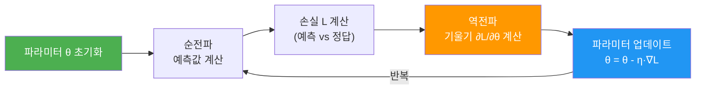
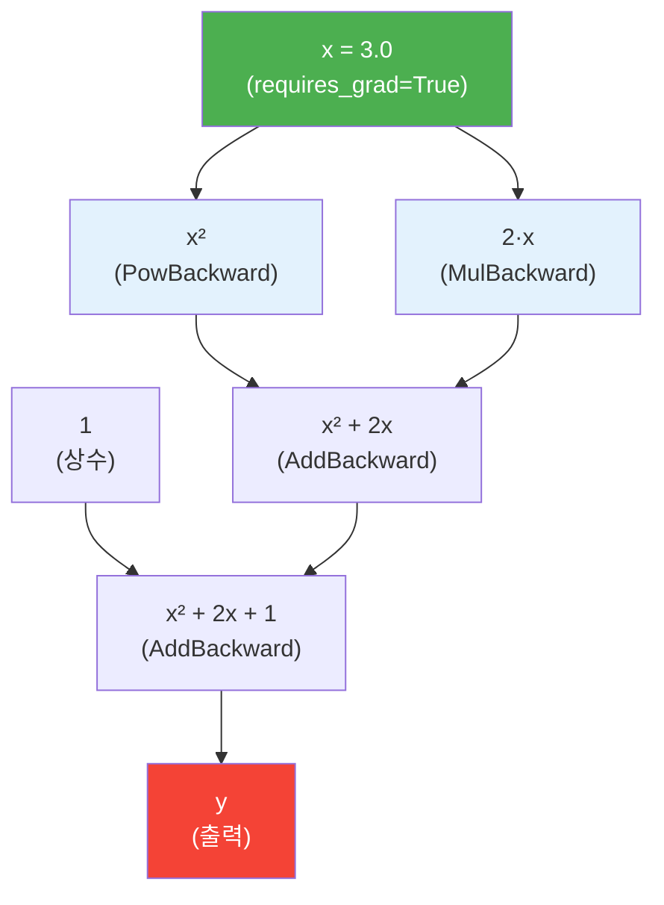
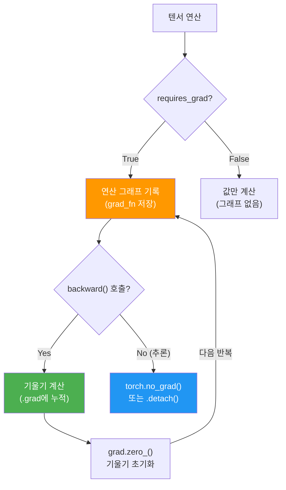
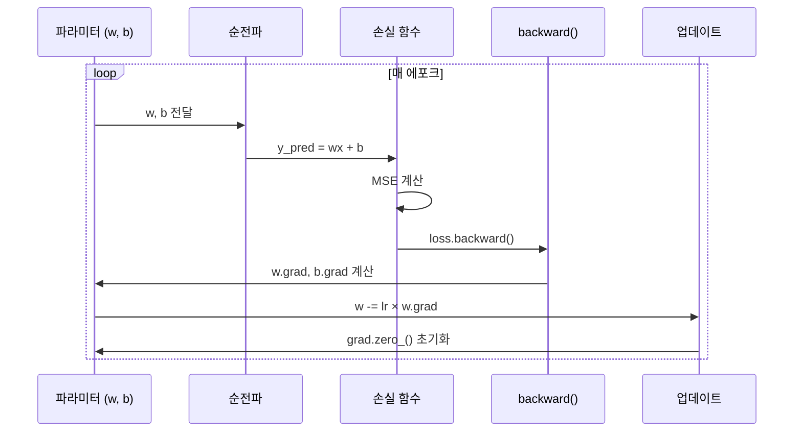
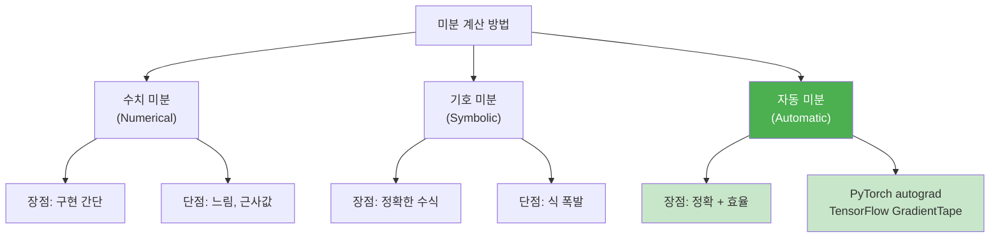

# 자동 미분과 경사 하강법

> PyTorch의 autograd 엔진으로 기울기를 자동 계산하고, 경사 하강법으로 모델 파라미터를 학습하는 핵심 메커니즘을 이해합니다.

## 개요

이 섹션에서는 딥러닝 학습의 핵심 엔진인 **자동 미분(Automatic Differentiation)**과 **경사 하강법(Gradient Descent)**을 배웁니다. 앞서 [01. PyTorch 텐서와 연산](07-ch7-pytorch-기초와-신경망-입문/01-01-pytorch-텐서와-연산.md)에서 텐서를 만들고 연산하는 방법을 익혔다면, 이제는 그 텐서들이 어떻게 "스스로 학습"할 수 있는지 그 비밀을 파헤칩니다.

**선수 지식**: PyTorch 텐서 생성, 기본 연산(덧셈, 곱셈), `shape`, `dtype`, `device` 개념

**학습 목표**:
- `requires_grad=True`로 텐서의 기울기 추적을 활성화할 수 있다
- `backward()`를 호출하여 자동으로 기울기를 계산할 수 있다
- 연산 그래프(Computational Graph)의 구조와 역할을 설명할 수 있다
- 경사 하강법으로 간단한 선형 회귀 모델을 수동 학습할 수 있다

## 왜 알아야 할까?

여러분이 "AI가 학습한다"라고 말할 때, 그 학습의 정체가 바로 **경사 하강법**입니다. 모델이 예측을 틀리면 "얼마나, 어느 방향으로 틀렸는지"를 계산하고, 그 정보를 바탕으로 파라미터를 조금씩 수정하는 거죠. 그런데 신경망에는 파라미터가 수백만 개, 수십억 개가 있습니다. 이 모든 파라미터의 기울기를 일일이 수학으로 유도한다면? 불가능에 가깝겠죠.

PyTorch의 `autograd`는 이 문제를 해결합니다. 여러분이 순전파(forward pass) 코드만 작성하면, **역전파(backward pass)의 기울기 계산은 autograd가 자동으로 처리**합니다. 이것이 바로 딥러닝이 실용적으로 가능해진 핵심 이유입니다.

앞으로 Ch8~Ch14에서 RNN, LSTM, 트랜스포머를 구현할 때, 그리고 Ch16~Ch19에서 BERT와 GPT를 파인튜닝할 때 — 모든 곳에서 autograd가 묵묵히 일하고 있습니다.

## 핵심 개념

### 개념 1: 경사 하강법의 직관적 이해

> 💡 **비유**: 눈을 감고 산에서 가장 낮은 골짜기로 내려가야 한다고 상상해 보세요. 볼 수는 없지만, 발밑의 경사를 느낄 수 있습니다. 경사가 가파른 방향으로 한 걸음씩 내딛으면, 결국 골짜기에 도착하겠죠. 이것이 경사 하강법의 본질입니다.

경사 하강법은 손실 함수(Loss Function)를 최소화하기 위해 파라미터를 반복적으로 업데이트하는 최적화 알고리즘입니다. 핵심 수식은 놀랍도록 간단합니다:

$$\theta_{new} = \theta_{old} - \eta \cdot \frac{\partial L}{\partial \theta}$$

- $\theta$: 학습할 파라미터 (가중치, 편향)
- $\eta$: **학습률(learning rate)** — 한 걸음의 크기
- $\frac{\partial L}{\partial \theta}$: 손실 $L$을 파라미터 $\theta$로 미분한 **기울기(gradient)**

기울기가 양수면 파라미터를 줄이고, 음수면 늘립니다. 이렇게 반복하면 손실이 점점 줄어들어 모델이 "학습"됩니다.

> 📊 **그림 1**: 경사 하강법의 파라미터 업데이트 흐름



학습률 $\eta$는 매우 중요한 하이퍼파라미터입니다. 학습률이 너무 크면 손실 함수의 최저점(골짜기)을 건너뛰어 오히려 손실이 커지는 **발산(divergence)**이 일어나고, 반대로 너무 작으면 최저점까지 도달하는 데 수만 번의 반복이 필요해 학습이 지나치게 느려집니다. 보통 0.01이나 0.001 같은 작은 값에서 시작한 뒤, 학습 곡선을 관찰하면서 조정하는 것이 일반적입니다.

### 개념 2: autograd와 연산 그래프

> 💡 **비유**: autograd는 녹화 카메라와 비슷합니다. 텐서에 `requires_grad=True`를 설정하면, 그 순간부터 해당 텐서가 참여하는 **모든 연산을 녹화**합니다. 나중에 `backward()`를 호출하면, 녹화된 영상을 **거꾸로 되감기**하면서 각 단계의 기울기를 계산하는 거죠.

PyTorch는 연산이 실행될 때마다 **방향성 비순환 그래프(DAG, Directed Acyclic Graph)**를 동적으로 구축합니다. 이 그래프의 잎 노드(leaf)는 입력 텐서이고, 뿌리 노드(root)는 출력 텐서입니다.

```python
import torch

# requires_grad=True: "이 텐서의 기울기를 추적해줘"
x = torch.tensor(3.0, requires_grad=True)
y = x ** 2 + 2 * x + 1  # y = x² + 2x + 1

# 역전파: dy/dx를 자동 계산
y.backward()

# 결과 확인: dy/dx = 2x + 2 = 2(3) + 2 = 8
print(x.grad)  # tensor(8.)
```

> 📊 **그림 2**: autograd 연산 그래프의 구조



그래프에서 초록색 노드가 잎(leaf) 텐서, 빨간색이 출력입니다. `y.backward()`를 호출하면 출력에서 잎까지 **연쇄 법칙(chain rule)**을 적용하면서 기울기를 자동으로 계산합니다. 각 파란 노드는 중간 연산으로, PyTorch가 `grad_fn` 속성에 역전파 함수를 저장해 둡니다.

실제로 `grad_fn`을 확인해 볼까요?

```run:python
import torch

x = torch.tensor(3.0, requires_grad=True)
y = x ** 2 + 2 * x + 1

print(f"x.grad_fn: {x.grad_fn}")          # 잎 노드는 None
print(f"y.grad_fn: {y.grad_fn}")          # 마지막 연산 기록
print(f"x.is_leaf: {x.is_leaf}")          # True
print(f"y.is_leaf: {y.is_leaf}")          # False

y.backward()
print(f"x.grad: {x.grad}")               # dy/dx = 2x + 2 = 8.0
```

```output
x.grad_fn: None
y.grad_fn: <AddBackward0 object at 0x...>
x.is_leaf: True
y.is_leaf: False
x.grad: 8.0
```

### 개념 3: requires_grad와 기울기 관리

> 💡 **비유**: `requires_grad`는 학생에게 붙이는 "관찰 대상" 스티커라고 생각하세요. 스티커가 붙은 텐서만 선생님(autograd)이 성적표(기울기)를 작성해 줍니다. 스티커가 없으면? 그냥 지나갑니다.

기울기 관리에서 꼭 알아야 할 세 가지 규칙이 있습니다.

**규칙 1**: 기울기는 **누적(accumulate)**됩니다

```python
import torch

x = torch.tensor(2.0, requires_grad=True)

# 첫 번째 backward
y1 = x ** 2
y1.backward()
print(x.grad)  # tensor(4.) ← dy1/dx = 2x = 4

# 두 번째 backward — 기울기가 누적됨!
y2 = x ** 3
y2.backward()
print(x.grad)  # tensor(16.) ← 4 + 12 = 16 (이전 값 + dy2/dx)
```

학습 루프에서는 반드시 `x.grad.zero_()`로 기울기를 초기화해야 합니다. 안 그러면 이전 반복의 기울기와 섞여서 엉뚱한 방향으로 학습하게 되거든요.

**규칙 2**: `torch.no_grad()`로 추적 중단

추론(inference) 시에는 기울기 계산이 필요 없습니다. 메모리와 속도를 절약하려면 `torch.no_grad()` 컨텍스트를 사용하세요.

```python
with torch.no_grad():
    # 이 안에서는 연산 그래프가 생성되지 않음
    prediction = model(input_data)
```

**규칙 3**: `.detach()`로 그래프에서 분리

텐서를 연산 그래프에서 떼어내고 싶을 때 사용합니다. 기울기 추적 없이 값만 필요한 경우에 유용합니다.

```python
y = x ** 2
y_value = y.detach()  # y와 같은 값이지만 그래프에서 분리됨
print(y_value.requires_grad)  # False
```

> 📊 **그림 3**: 기울기 관리 흐름 — 학습 vs 추론



### 개념 4: 다변수 기울기 — 벡터의 미분

실제 신경망에서는 스칼라가 아니라 수백만 개의 파라미터 벡터에 대한 기울기를 계산합니다. autograd는 이것도 자동으로 처리합니다.

```run:python
import torch

# 가중치 벡터
w = torch.tensor([1.0, 2.0, 3.0], requires_grad=True)
x = torch.tensor([4.0, 5.0, 6.0])

# 선형 연산 후 손실 계산 (스칼라)
y = (w * x).sum()  # y = w₁x₁ + w₂x₂ + w₃x₃
y.backward()

# dy/dw = x
print(f"w.grad = {w.grad}")  # tensor([4., 5., 6.]) = x
print(f"y = {y.item():.1f}")
```

```output
w.grad = tensor([4., 5., 6.])
y = 32.0
```

`backward()`는 **스칼라 출력**에 대해서만 호출할 수 있다는 점을 기억하세요. 벡터 출력에 대해 호출하면 에러가 발생합니다. 그래서 보통 `.sum()`이나 `.mean()`으로 손실을 스칼라로 만든 뒤 역전파합니다.

## 실습: 직접 해보기

이제 autograd와 경사 하강법을 결합하여 **선형 회귀 모델을 수동으로 학습**해 봅시다. 옵티마이저 없이, `backward()`와 직접적인 파라미터 업데이트만으로 학습하는 경험은 딥러닝의 본질을 이해하는 데 큰 도움이 됩니다.

```python
import torch

# ─── 1. 데이터 준비 ───
# 실제 관계: y = 3x + 1 (이것을 모델이 알아내야 함)
torch.manual_seed(42)
X = torch.linspace(0, 5, 50)            # 입력: 0~5 사이 50개 점
y_true = 3 * X + 1 + torch.randn(50) * 0.5  # 노이즈 추가

# ─── 2. 파라미터 초기화 ───
# 모델: y = w*x + b (w=3, b=1을 찾아야 함)
w = torch.tensor(0.0, requires_grad=True)  # 가중치 (임의 초기값)
b = torch.tensor(0.0, requires_grad=True)  # 편향 (임의 초기값)

learning_rate = 0.01
epochs = 100

# ─── 3. 학습 루프 ───
for epoch in range(epochs):
    # 순전파: 예측값 계산
    y_pred = w * X + b

    # 손실 계산: MSE (평균 제곱 오차)
    loss = ((y_pred - y_true) ** 2).mean()

    # 역전파: 기울기 자동 계산
    loss.backward()  # dL/dw, dL/db 계산

    # 파라미터 업데이트 (기울기 추적 중단 상태에서!)
    with torch.no_grad():
        w -= learning_rate * w.grad
        b -= learning_rate * b.grad

    # ⚠️ 기울기 초기화 (필수!)
    w.grad.zero_()
    b.grad.zero_()

    # 진행 상황 출력
    if (epoch + 1) % 20 == 0:
        print(f"Epoch {epoch+1:3d} | Loss: {loss.item():.4f} | "
              f"w: {w.item():.3f} | b: {b.item():.3f}")

print(f"\n학습 결과: y = {w.item():.2f}x + {b.item():.2f}")
print(f"실제 관계: y = 3.00x + 1.00")
```

> 📊 **그림 4**: 선형 회귀 학습 과정 시퀀스



위 코드를 실행하면, `w`는 3.0 근처로, `b`는 1.0 근처로 수렴하는 것을 볼 수 있습니다. 100번의 반복 만에 모델이 데이터 속 패턴 $y = 3x + 1$을 스스로 찾아낸 겁니다!

핵심 포인트를 짚어 보겠습니다:
- `with torch.no_grad():` 블록 안에서 파라미터를 업데이트합니다. 안 그러면 업데이트 연산까지 그래프에 기록되어 메모리 낭비와 에러가 발생합니다.
- `w.grad.zero_()`: 반드시 매 반복마다 기울기를 초기화해야 합니다. PyTorch는 기울기를 누적하기 때문입니다.
- 이 수동 학습 루프가 [04. 손실 함수와 옵티마이저](07-ch7-pytorch-기초와-신경망-입문/04-04-손실-함수와-옵티마이저.md)에서 배울 `torch.optim`이 자동으로 해주는 일의 정체입니다.

## 더 깊이 알아보기

### 자동 미분의 탄생 — 핀란드 대학원생의 석사 논문

놀랍게도 오늘날 수십억 달러 규모의 AI 산업을 떠받치는 **역방향 자동 미분(reverse-mode automatic differentiation)**의 발명자는 핀란드 헬싱키 대학교의 석사과정 학생이었습니다. 1970년, **세포 린나인마(Seppo Linnainmaa)**는 석사 논문에서 합성 함수의 도함수를 연쇄 법칙을 재귀적으로 적용하여 효율적으로 계산하는 알고리즘을 제안했습니다.

이 알고리즘은 나중에 "역전파(backpropagation)"라는 이름으로 신경망 학습에 적용되었고, 1986년 Rumelhart, Hinton, Williams가 발표한 유명한 논문을 통해 널리 알려졌습니다. 하지만 그 수학적 핵심은 16년 전 핀란드 대학원생의 논문에 이미 있었던 거죠. 2020년대 기준으로 TensorFlow, PyTorch, JAX 등 모든 주요 딥러닝 프레임워크가 린나인마의 방법을 기반으로 합니다.

### 왜 "자동" 미분인가?

미분을 계산하는 방법은 사실 세 가지가 있습니다:

| 방법 | 설명 | 장단점 |
|------|------|--------|
| **수치 미분** | $f'(x) \approx \frac{f(x+h) - f(x)}{h}$ | 간단하지만 느리고 부정확 |
| **기호 미분** | 수학 공식으로 유도 (Wolfram Alpha) | 정확하지만 식이 폭발적으로 복잡해짐 |
| **자동 미분** | 연쇄 법칙 + 연산 그래프 | 정확하고 효율적 — 딥러닝의 선택 |

PyTorch의 autograd는 세 번째 방법인 자동 미분을 구현합니다. 수치 미분처럼 근사가 아니라 **수학적으로 정확한** 기울기를 계산하면서도, 기호 미분처럼 식이 복잡해지지 않습니다.

> 📊 **그림 5**: 세 가지 미분 방법 비교



## 흔한 오해와 팁

> ⚠️ **흔한 오해**: "`backward()`를 호출하면 파라미터가 자동으로 업데이트된다" — 아닙니다! `backward()`는 **기울기만 계산**합니다. 파라미터 업데이트는 별도로 직접 하거나 옵티마이저를 사용해야 합니다. 많은 초보자가 `loss.backward()` 후에 손실이 줄지 않는다며 당황하는데, 파라미터 업데이트 코드가 빠져 있는 경우가 대부분이에요.

> 💡 **알고 계셨나요?**: PyTorch의 autograd는 **동적 연산 그래프(Dynamic Computational Graph)**를 사용합니다. 매 순전파마다 새로운 그래프가 생성되고 역전파 후 소멸합니다. 이 덕분에 `if`문이나 `for`문 같은 일반 Python 제어문을 자유롭게 쓸 수 있죠. 반면 TensorFlow 1.x는 정적 그래프를 사용해서 디버깅이 훨씬 어려웠습니다. 이 "자유로움"이 연구자들 사이에서 PyTorch가 인기를 끈 결정적 이유 중 하나입니다.

> 🔥 **실무 팁**: 학습 중 메모리가 부족하다면, 추론 코드에서 `torch.no_grad()`를 빠뜨렸을 가능성이 높습니다. 검증(validation) 루프에서는 반드시 `with torch.no_grad():`로 감싸세요. 연산 그래프 기록이 중단되면 GPU 메모리 사용량이 크게 줄어듭니다. 또한, 텐서 값을 로깅할 때 `loss.item()`을 사용하세요. `loss` 자체를 리스트에 저장하면 연산 그래프 전체가 메모리에 남아 있게 됩니다.

## 핵심 정리

| 개념 | 설명 |
|------|------|
| `requires_grad=True` | 텐서에 기울기 추적을 활성화하는 플래그 |
| 연산 그래프 (Computational Graph) | 텐서 연산을 DAG로 기록한 구조. 역전파 시 사용 |
| `backward()` | 연산 그래프를 역순으로 순회하며 기울기를 자동 계산 |
| `.grad` | 계산된 기울기가 저장되는 속성. 기본적으로 누적됨 |
| `grad.zero_()` | 기울기 초기화. 매 학습 반복마다 필수 |
| `torch.no_grad()` | 연산 그래프 기록 중단. 추론·검증 시 사용 |
| `.detach()` | 텐서를 연산 그래프에서 분리하여 새 텐서 반환 |
| 경사 하강법 | $\theta = \theta - \eta \cdot \nabla L$ — 기울기 반대 방향으로 파라미터 업데이트 |
| 학습률 (learning rate) | 한 번에 업데이트하는 크기. 너무 크면 발산, 너무 작으면 느림 |

## 다음 섹션 미리보기

이번 섹션에서는 텐서를 직접 만들고 수동으로 파라미터를 업데이트했습니다. 하지만 신경망이 복잡해지면 이런 수동 관리는 금방 한계에 부딪힙니다. 다음 섹션 [03. nn.Module로 신경망 정의하기](07-ch7-pytorch-기초와-신경망-입문/03-03-nnmodule로-신경망-정의하기.md)에서는 `nn.Module`을 상속하여 **구조화된 신경망 클래스**를 정의하는 방법을 배웁니다. 파라미터 관리, 레이어 조합, 순전파 로직 정의가 얼마나 깔끔해지는지 경험해 보세요.

## 참고 자료

- [Automatic Differentiation with torch.autograd — PyTorch 공식 튜토리얼](https://docs.pytorch.org/tutorials/beginner/basics/autogradqs_tutorial.html) - autograd의 기본 사용법을 단계별로 설명하는 공식 가이드
- [A Gentle Introduction to torch.autograd — PyTorch 공식](https://docs.pytorch.org/tutorials/beginner/blitz/autograd_tutorial.html) - 연산 그래프와 DAG 구조를 시각적으로 설명하는 심화 튜토리얼
- [Autograd Mechanics — PyTorch 공식 문서](https://docs.pytorch.org/docs/stable/notes/autograd.html) - autograd의 내부 동작 원리와 고급 기능 설명
- [PyTorch NLP From Scratch Tutorials](https://docs.pytorch.org/tutorials/intermediate/nlp_from_scratch_index.html) - NLP 태스크에서 PyTorch를 밑바닥부터 활용하는 실습 시리즈
- [Who Invented Backpropagation? — Jürgen Schmidhuber](https://people.idsia.ch/~juergen/who-invented-backpropagation.html) - 역전파 알고리즘의 역사와 발명자에 대한 상세한 정리

---
### 🔗 Related Sessions
- [torch.tensor](07-ch7-pytorch-기초와-신경망-입문/01-01-pytorch-텐서와-연산.md) (prerequisite)
- [shape](07-ch7-pytorch-기초와-신경망-입문/01-01-pytorch-텐서와-연산.md) (prerequisite)
- [dtype](07-ch7-pytorch-기초와-신경망-입문/01-01-pytorch-텐서와-연산.md) (prerequisite)
- [device](07-ch7-pytorch-기초와-신경망-입문/01-01-pytorch-텐서와-연산.md) (prerequisite)


---
### 🔗 Related Sessions
- [torch.tensor](07-ch7-pytorch-기초와-신경망-입문/01-01-pytorch-텐서와-연산.md) (prerequisite)
- [shape](07-ch7-pytorch-기초와-신경망-입문/01-01-pytorch-텐서와-연산.md) (prerequisite)
- [dtype](07-ch7-pytorch-기초와-신경망-입문/01-01-pytorch-텐서와-연산.md) (prerequisite)
- [device](07-ch7-pytorch-기초와-신경망-입문/01-01-pytorch-텐서와-연산.md) (prerequisite)


---
### 🔗 Related Sessions
- [torch.tensor](07-ch7-pytorch-기초와-신경망-입문/01-01-pytorch-텐서와-연산.md) (prerequisite)
- [shape](07-ch7-pytorch-기초와-신경망-입문/01-01-pytorch-텐서와-연산.md) (prerequisite)
- [dtype](07-ch7-pytorch-기초와-신경망-입문/01-01-pytorch-텐서와-연산.md) (prerequisite)
- [device](07-ch7-pytorch-기초와-신경망-입문/01-01-pytorch-텐서와-연산.md) (prerequisite)


---
### 🔗 Related Sessions
- [torch.tensor](07-ch7-pytorch-기초와-신경망-입문/01-01-pytorch-텐서와-연산.md) (prerequisite)
- [shape](07-ch7-pytorch-기초와-신경망-입문/01-01-pytorch-텐서와-연산.md) (prerequisite)
- [dtype](07-ch7-pytorch-기초와-신경망-입문/01-01-pytorch-텐서와-연산.md) (prerequisite)
- [device](07-ch7-pytorch-기초와-신경망-입문/01-01-pytorch-텐서와-연산.md) (prerequisite)


---
### 🔗 Related Sessions
- [torch.tensor](07-ch7-pytorch-기초와-신경망-입문/01-01-pytorch-텐서와-연산.md) (prerequisite)
- [shape](07-ch7-pytorch-기초와-신경망-입문/01-01-pytorch-텐서와-연산.md) (prerequisite)
- [dtype](07-ch7-pytorch-기초와-신경망-입문/01-01-pytorch-텐서와-연산.md) (prerequisite)
- [device](07-ch7-pytorch-기초와-신경망-입문/01-01-pytorch-텐서와-연산.md) (prerequisite)
