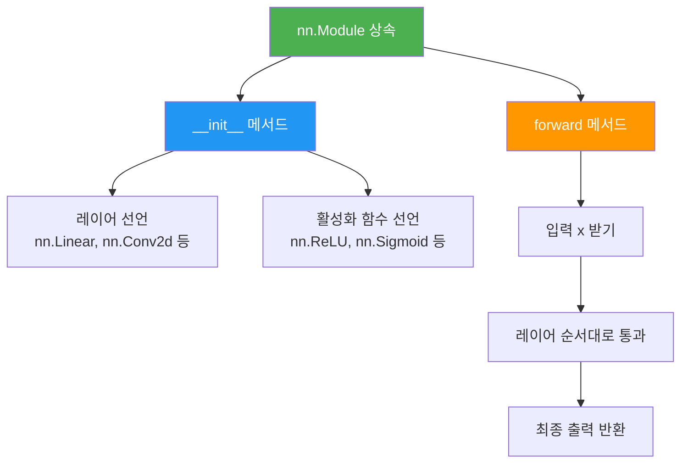
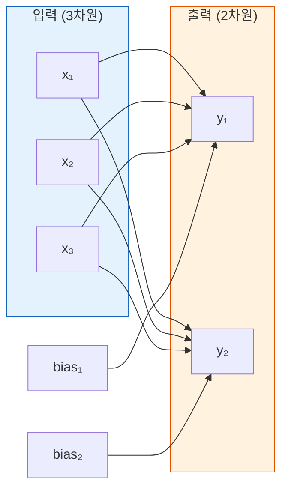
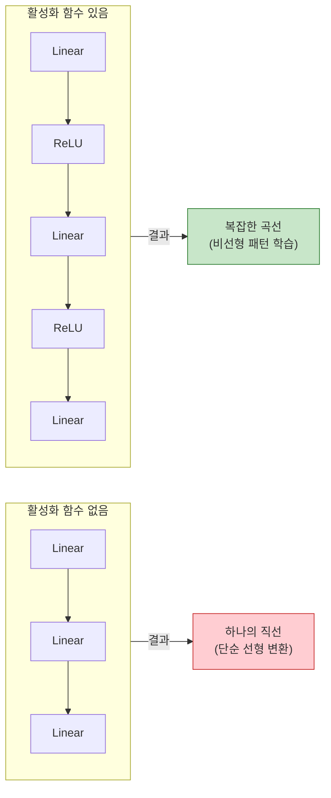
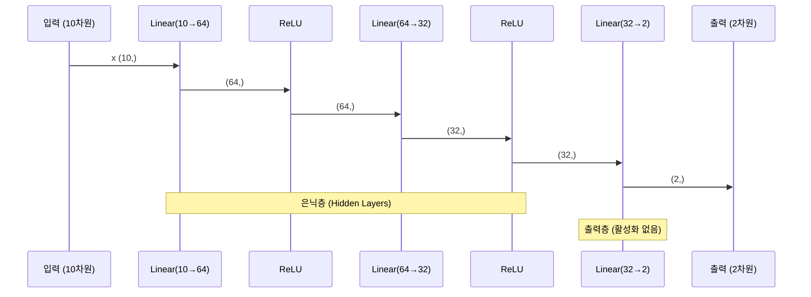
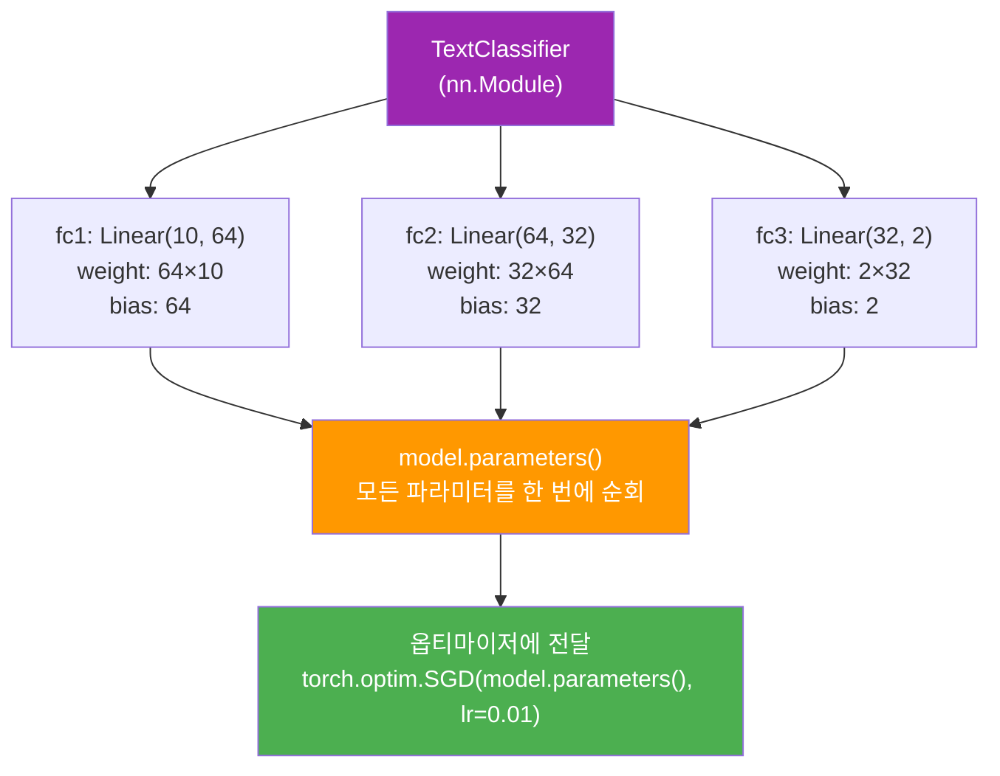

# nn.Module로 신경망 정의하기

> PyTorch의 `nn.Module`을 상속하여 구조화된 신경망을 정의하고, 활성화 함수와 함께 다층 네트워크를 구축하는 방법을 배웁니다.

## 개요

이 섹션에서는 PyTorch가 제공하는 신경망의 "설계도" — `nn.Module` 클래스를 배웁니다. [이전 섹션](07-ch7-pytorch-기초와-신경망-입문/02-02-자동-미분과-경사-하강법.md)에서 `requires_grad`와 `backward()`로 기울기를 직접 관리하며 선형 회귀를 구현했는데요, 이번에는 그 수동 작업을 PyTorch가 대신해주는 세계로 넘어갑니다.

**선수 지식**: 텐서 연산([01. PyTorch 텐서와 연산](07-ch7-pytorch-기초와-신경망-입문/01-01-pytorch-텐서와-연산.md)), 자동 미분과 경사 하강법([02. 자동 미분과 경사 하강법](07-ch7-pytorch-기초와-신경망-입문/02-02-자동-미분과-경사-하강법.md))

**학습 목표**:
- `nn.Module`을 상속하여 커스텀 신경망 클래스를 정의할 수 있다
- `nn.Linear`로 완전 연결 층(Fully Connected Layer)을 구성할 수 있다
- ReLU, Sigmoid, Tanh 등 활성화 함수의 역할과 차이를 이해한다
- `model.parameters()`로 모델의 학습 가능한 파라미터를 확인할 수 있다

## 왜 알아야 할까?

이전 섹션에서 선형 회귀를 구현할 때, 가중치 `w`와 편향 `b`를 직접 텐서로 만들고, `requires_grad=True`를 설정하고, `torch.no_grad()` 안에서 수동으로 업데이트했습니다. 파라미터가 2개일 때는 괜찮았지만, 실제 신경망은 수백만 개의 파라미터를 갖습니다. 이걸 일일이 관리한다면?

`nn.Module`은 이 문제를 근본적으로 해결합니다. 파라미터 등록, 기울기 추적, GPU 이동, 저장/불러오기까지 — 신경망에 필요한 모든 "살림살이"를 자동으로 관리해주거든요. PyTorch로 딥러닝을 하는 한, 여러분이 만드는 모든 모델은 `nn.Module`을 상속합니다. NLP에서 RNN, LSTM, 트랜스포머 같은 복잡한 모델들([Ch8](08-ch8-순환-신경망rnn-기초/01-01-시퀀스-데이터와-rnn의-필요성.md)~[Ch14](14-ch14-트랜스포머-구현-실습/01-01-셀프-어텐션-직접-구현.md))도 모두 이 `nn.Module` 위에 세워집니다.

## 핵심 개념

### 개념 1: nn.Module — 신경망의 설계도

> 💡 **비유**: `nn.Module`은 레고 조립 설명서와 같습니다. 설명서(클래스)에는 어떤 부품(레이어)이 필요하고, 어떤 순서로 조립(forward)하는지가 적혀 있죠. 같은 설명서로 여러 개의 레고(모델 인스턴스)를 만들 수 있고, 각각의 레고는 독립적인 부품(파라미터)을 갖습니다.

PyTorch에서 모든 신경망의 기본이 되는 클래스가 `torch.nn.Module`입니다. 이 클래스를 상속하면 두 가지만 정의하면 됩니다:

1. **`__init__`**: 신경망에 사용할 레이어(부품)를 선언
2. **`forward`**: 입력 데이터가 레이어를 통과하는 순서를 정의

> 📊 **그림 1**: nn.Module 기반 모델 정의의 기본 구조



가장 간단한 예제를 봅시다. 이전 섹션에서 수동으로 만들었던 선형 회귀를 `nn.Module`로 다시 작성합니다:

```run:python
import torch
import torch.nn as nn

# nn.Module을 상속하여 모델 정의
class LinearRegression(nn.Module):
    def __init__(self, input_dim, output_dim):
        super().__init__()  # 반드시 부모 클래스 초기화
        self.linear = nn.Linear(input_dim, output_dim)  # 선형 레이어

    def forward(self, x):
        return self.linear(x)  # 입력을 선형 레이어에 통과

# 모델 인스턴스 생성
model = LinearRegression(input_dim=1, output_dim=1)

# 모델 구조 확인
print(model)
print(f"\n파라미터 수: {sum(p.numel() for p in model.parameters())}")
```

```output
LinearRegression(
  (linear): Linear(in_features=1, out_features=1, bias=True)
)

파라미터 수: 2
```

비교해보세요. 이전 섹션에서는 `w = torch.randn(1, requires_grad=True)`와 `b = torch.zeros(1, requires_grad=True)`를 직접 만들어야 했지만, `nn.Linear(1, 1)`이 가중치와 편향을 자동으로 생성하고 관리합니다.

`super().__init__()`은 반드시 호출해야 합니다. 이걸 빼먹으면 PyTorch가 파라미터를 추적하지 못합니다 — 마치 레고 조립 설명서의 첫 페이지를 건너뛴 것과 같죠.

### 개념 2: nn.Linear — 완전 연결 층

> 💡 **비유**: `nn.Linear`는 저울과 같습니다. 여러 재료(입력 특성)를 각각 다른 비율(가중치)로 섞어서 새로운 맛(출력)을 만들어내죠. `nn.Linear(3, 2)`는 "3가지 재료를 받아서 2가지 맛을 만드는 저울"입니다.

`nn.Linear(in_features, out_features, bias=True)`는 수학적으로 $y = xW^T + b$ 연산을 수행합니다.

- `in_features`: 입력 차원 (입력 벡터의 크기)
- `out_features`: 출력 차원 (출력 벡터의 크기)
- `bias`: 편향 사용 여부 (기본 `True`)

> 📊 **그림 2**: nn.Linear(3, 2)의 내부 구조



각 연결선은 학습 가능한 가중치입니다. 3×2 = 6개의 가중치 + 2개의 편향 = 총 8개 파라미터가 자동으로 생성됩니다.

```run:python
import torch
import torch.nn as nn

layer = nn.Linear(3, 2)

# 자동 생성된 파라미터 확인
print(f"가중치 형상: {layer.weight.shape}")  # (out_features, in_features)
print(f"편향 형상: {layer.bias.shape}")        # (out_features,)
print(f"가중치:\n{layer.weight.data}")
print(f"편향: {layer.bias.data}")

# 실제 연산 수행
x = torch.tensor([1.0, 2.0, 3.0])
output = layer(x)  # forward 자동 호출
print(f"\n입력: {x}")
print(f"출력: {output}")
```

```output
가중치 형상: torch.Size([2, 3])
편향 형상: torch.Size([2])
가중치:
tensor([[ 0.2975, -0.2548, -0.1119],
        [ 0.0576,  0.3435,  0.1588]])
편향: tensor([-0.2668,  0.3190])

입력: tensor([1.0000, 2.0000, 3.0000])
출력: tensor([-0.8149,  1.2218])
```

주목할 점이 하나 있습니다. `layer(x)`를 호출하면 Python의 `__call__` 메서드가 실행되고, 이것이 내부적으로 `forward(x)`를 호출합니다. **절대 `layer.forward(x)`를 직접 호출하지 마세요** — `__call__`이 forward 전후로 hook 실행 등 추가 작업을 처리하기 때문입니다.

### 개념 3: 활성화 함수 — 비선형성의 마법

> 💡 **비유**: 활성화 함수는 뇌의 뉴런에 있는 "발화 임계값"과 같습니다. 신호(입력)가 충분히 강하면 뉴런이 활성화되어 다음 뉴런에 신호를 전달하고, 약하면 무시합니다. 이 단순한 메커니즘이 모여서 복잡한 사고를 가능하게 하는 거죠.

`nn.Linear`만으로는 아무리 많은 층을 쌓아도 결국 하나의 선형 변환에 불과합니다. $y = W_2(W_1x + b_1) + b_2 = W'x + b'$가 되어버리니까요. **활성화 함수**가 이 선형 변환 사이에 비선형성을 주입하여 신경망이 복잡한 패턴을 학습할 수 있게 만듭니다.

> 📊 **그림 3**: 활성화 함수가 없을 때 vs 있을 때



PyTorch에서 자주 쓰이는 세 가지 활성화 함수를 비교해봅시다:

| 활성화 함수 | 수식 | 출력 범위 | 주요 용도 |
|------------|------|----------|----------|
| **ReLU** | $\max(0, x)$ | $[0, +\infty)$ | 은닉층 기본 선택 |
| **Sigmoid** | $\frac{1}{1+e^{-x}}$ | $(0, 1)$ | 이진 분류 출력 |
| **Tanh** | $\frac{e^x - e^{-x}}{e^x + e^{-x}}$ | $(-1, 1)$ | RNN 은닉 상태 |

**ReLU(Rectified Linear Unit)**가 현대 딥러닝에서 가장 많이 쓰입니다. 이유는 단순합니다:
- 계산이 빠르고 (`max(0, x)` — 비교 한 번이면 끝)
- 기울기 소실(Gradient Vanishing) 문제가 적고
- 실전에서 대부분의 경우 잘 작동합니다

PyTorch에서는 두 가지 방식으로 활성화 함수를 사용할 수 있습니다:

```python
import torch.nn as nn
import torch.nn.functional as F

# 방법 1: nn 모듈 — __init__에서 선언
self.relu = nn.ReLU()
# forward에서: x = self.relu(x)

# 방법 2: functional API — forward에서 직접 호출
# forward에서: x = F.relu(x)
```

두 방식의 결과는 동일합니다. `nn.ReLU()`는 상태가 없는 모듈이므로, `F.relu()`로 간단히 대체할 수 있습니다. 실무에서는 `nn.Sequential`과 함께 쓸 때는 방법 1, `forward`를 직접 작성할 때는 방법 2를 많이 사용합니다.

### 개념 4: 다층 신경망 조립하기

이제 `nn.Linear`와 활성화 함수를 조합하여 실제 다층 신경망(Multi-Layer Perceptron, MLP)을 만들어봅시다. NLP에서 텍스트를 분류하거나 감성을 분석할 때 가장 기본이 되는 구조입니다.

> 📊 **그림 4**: 3층 MLP의 데이터 흐름



```python
import torch
import torch.nn as nn
import torch.nn.functional as F

class TextClassifier(nn.Module):
    def __init__(self, vocab_size, embed_dim, hidden_dim, num_classes):
        super().__init__()
        # 3개의 선형 레이어
        self.fc1 = nn.Linear(embed_dim, hidden_dim)      # 입력층 → 은닉층1
        self.fc2 = nn.Linear(hidden_dim, hidden_dim // 2) # 은닉층1 → 은닉층2
        self.fc3 = nn.Linear(hidden_dim // 2, num_classes) # 은닉층2 → 출력층
    
    def forward(self, x):
        # x: (batch_size, embed_dim)
        x = F.relu(self.fc1(x))    # 선형 변환 + ReLU 활성화
        x = F.relu(self.fc2(x))    # 선형 변환 + ReLU 활성화
        x = self.fc3(x)            # 마지막 층은 활성화 없음!
        return x
```

마지막 출력층에 활성화 함수를 넣지 않는 이유가 궁금하시죠? 분류 문제에서는 나중에 `nn.CrossEntropyLoss`가 내부적으로 softmax를 적용하기 때문입니다. 이건 [다음 섹션](07-ch7-pytorch-기초와-신경망-입문/04-04-손실-함수와-옵티마이저.md)에서 자세히 다룹니다.

### 개념 5: 모델 파라미터 확인과 관리

`nn.Module`의 가장 큰 장점은 **파라미터 자동 관리**입니다. `__init__`에서 `nn.Linear`나 다른 `nn.Module`을 속성으로 지정하면, PyTorch가 자동으로 그 안의 파라미터를 등록합니다.

> 📊 **그림 5**: nn.Module의 파라미터 관리 체계



```run:python
import torch
import torch.nn as nn
import torch.nn.functional as F

class TextClassifier(nn.Module):
    def __init__(self, embed_dim, hidden_dim, num_classes):
        super().__init__()
        self.fc1 = nn.Linear(embed_dim, hidden_dim)
        self.fc2 = nn.Linear(hidden_dim, hidden_dim // 2)
        self.fc3 = nn.Linear(hidden_dim // 2, num_classes)
    
    def forward(self, x):
        x = F.relu(self.fc1(x))
        x = F.relu(self.fc2(x))
        return self.fc3(x)

model = TextClassifier(embed_dim=10, hidden_dim=64, num_classes=2)

# named_parameters()로 이름과 형상 확인
print("=== 모델 파라미터 ===")
for name, param in model.named_parameters():
    print(f"{name:15s} | 형상: {str(param.shape):15s} | 학습 가능: {param.requires_grad}")

# 총 파라미터 수 계산
total = sum(p.numel() for p in model.parameters())
trainable = sum(p.numel() for p in model.parameters() if p.requires_grad)
print(f"\n총 파라미터: {total:,}개")
print(f"학습 가능: {trainable:,}개")
```

```output
=== 모델 파라미터 ===
fc1.weight      | 형상: torch.Size([64, 10]) | 학습 가능: True
fc1.bias        | 형상: torch.Size([64])  | 학습 가능: True
fc2.weight      | 형상: torch.Size([32, 64]) | 학습 가능: True
fc2.bias        | 형상: torch.Size([32])  | 학습 가능: True
fc3.weight      | 형상: torch.Size([2, 32]) | 학습 가능: True
fc3.bias        | 형상: torch.Size([2])   | 학습 가능: True

총 파라미터: 2,882개
학습 가능: 2,882개
```

`model.parameters()`가 반환하는 이터레이터를 옵티마이저에 넘기면, 경사 하강법이 이 모든 파라미터를 자동으로 업데이트합니다. 이전 섹션에서 `w -= lr * w.grad`를 직접 써야 했던 것과 비교하면 엄청난 편의성이죠.

## 실습: 직접 해보기

XOR 문제를 풀어봅시다. XOR은 단일 선형 레이어로는 절대 풀 수 없는 대표적인 비선형 문제입니다. 1969년 마빈 민스키가 퍼셉트론의 한계를 이 문제로 증명했었죠. 다층 신경망과 활성화 함수가 왜 필요한지 직접 체험할 수 있습니다.

```python
import torch
import torch.nn as nn
import torch.nn.functional as F

# 시드 고정
torch.manual_seed(42)

# XOR 데이터
X = torch.tensor([[0, 0], [0, 1], [1, 0], [1, 1]], dtype=torch.float32)
y = torch.tensor([[0], [1], [1], [0]], dtype=torch.float32)

# 다층 신경망 정의
class XORNet(nn.Module):
    def __init__(self):
        super().__init__()
        self.fc1 = nn.Linear(2, 8)     # 입력(2) → 은닉(8)
        self.fc2 = nn.Linear(8, 1)     # 은닉(8) → 출력(1)
    
    def forward(self, x):
        x = torch.tanh(self.fc1(x))    # Tanh 활성화
        x = torch.sigmoid(self.fc2(x)) # Sigmoid로 0~1 확률 출력
        return x

model = XORNet()
optimizer = torch.optim.Adam(model.parameters(), lr=0.01)
criterion = nn.BCELoss()  # Binary Cross Entropy Loss

# 학습
for epoch in range(1000):
    # 순전파
    predictions = model(X)
    loss = criterion(predictions, y)
    
    # 역전파
    optimizer.zero_grad()  # 기울기 초기화
    loss.backward()        # 기울기 계산
    optimizer.step()       # 파라미터 갱신
    
    if (epoch + 1) % 200 == 0:
        print(f"Epoch {epoch+1:4d} | Loss: {loss.item():.4f}")

# 결과 확인
print("\n=== XOR 예측 결과 ===")
with torch.no_grad():
    preds = model(X)
    for i in range(len(X)):
        print(f"입력: {X[i].tolist()} → 예측: {preds[i].item():.4f} → 정답: {y[i].item():.0f}")
```

이 코드를 실행하면 손실이 점점 줄어들고, 최종 예측이 정답에 수렴하는 것을 확인할 수 있습니다. `torch.tanh`를 제거하고 다시 학습해보세요 — 활성화 함수 없이는 XOR을 풀 수 없다는 것을 직접 경험할 수 있습니다.

핵심 패턴을 정리하면:

```python
# 모든 PyTorch 모델의 기본 골격
class MyModel(nn.Module):
    def __init__(self):
        super().__init__()           # 1. 부모 초기화 (필수!)
        self.layer1 = nn.Linear(...)  # 2. 레이어 선언
        self.layer2 = nn.Linear(...)
    
    def forward(self, x):             # 3. 순전파 정의
        x = F.relu(self.layer1(x))
        x = self.layer2(x)
        return x

# 사용법
model = MyModel()                    # 4. 인스턴스 생성
output = model(input_tensor)          # 5. 호출 (forward 자동 실행)
```

## 더 깊이 알아보기

### nn.Module의 탄생 — Torch에서 PyTorch로

PyTorch의 `nn.Module`은 어느 날 갑자기 만들어진 것이 아닙니다. 2016년, Facebook AI Research(FAIR)의 Soumith Chintala와 Adam Paszke가 기존 Lua 기반 Torch7 프레임워크를 Python으로 재설계하면서 탄생했습니다. 

당시 딥러닝 프레임워크의 주류는 TensorFlow의 "정적 그래프" 방식이었는데, 코드를 먼저 그래프로 컴파일한 뒤 실행하는 구조라 디버깅이 매우 불편했습니다. Soumith의 팀은 일본의 Chainer 프레임워크에서 영감을 받아, Python 코드를 실행하는 그대로 연산 그래프가 만들어지는 "동적 그래프(Define-by-Run)" 방식을 채택했습니다.

이 설계 철학이 바로 `nn.Module`에 녹아 있습니다. `forward` 메서드에 평범한 Python `if`문이나 `for`문을 자유롭게 쓸 수 있는 것도, 디버거에서 한 줄씩 실행하며 텐서 값을 확인할 수 있는 것도, 모두 이 동적 그래프 덕분입니다.

### XOR 문제와 AI의 암흑기

위 실습에서 풀어본 XOR 문제에는 깊은 역사가 있습니다. 1969년 MIT의 마빈 민스키(Marvin Minsky)와 시모어 페퍼트(Seymour Papert)가 저서 *Perceptrons*에서 "단일 퍼셉트론은 XOR을 학습할 수 없다"고 수학적으로 증명했습니다. 이 증명이 너무 강력한 나머지, 신경망 연구 전체에 대한 비관론이 퍼지면서 약 15년간의 "AI 겨울(AI Winter)"이 시작되었죠. 1986년 Rumelhart, Hinton, Williams가 역전파(Backpropagation) 알고리즘을 재발견하고 다층 신경망으로 XOR을 풀 수 있음을 보여주면서 비로소 봄이 다시 왔습니다.

## 흔한 오해와 팁

> ⚠️ **흔한 오해**: "`forward()`를 직접 호출하면 된다" — 아닙니다! 반드시 `model(x)` 형태로 호출하세요. `model.__call__(x)`이 hook 처리 등 추가 로직을 실행한 뒤 `forward`를 호출합니다. `model.forward(x)`를 직접 쓰면 hook이 무시되어 나중에 예상치 못한 버그가 생길 수 있습니다.

> 💡 **알고 계셨나요?**: `nn.Module`은 `__repr__`을 자동으로 생성합니다. `print(model)`만 하면 모든 레이어 구조가 깔끔하게 출력되죠. 복잡한 모델을 디버깅할 때 가장 먼저 해볼 일입니다.

> 🔥 **실무 팁**: 은닉층 활성화 함수로는 일단 **ReLU**부터 쓰세요. Sigmoid나 Tanh는 깊은 네트워크에서 기울기 소실 문제가 있습니다. ReLU로 시작하고, 문제가 있을 때 LeakyReLU나 GELU로 바꾸는 것이 실무의 정석입니다. 특히 NLP에서 트랜스포머 계열 모델([Ch13](13-ch13-트랜스포머-아키텍처-심층-분석/05-05-피드포워드-네트워크와-정규화.md))은 GELU를 많이 사용합니다.

> ⚠️ **흔한 오해**: "레이어를 Python 리스트에 넣어도 `parameters()`로 잡힌다" — **아닙니다!** `self.layers = [nn.Linear(10, 10)]`처럼 일반 리스트에 넣으면 PyTorch가 파라미터를 인식하지 못합니다. 반드시 `nn.ModuleList`를 사용하세요: `self.layers = nn.ModuleList([nn.Linear(10, 10)])`.

## 핵심 정리

| 개념 | 설명 |
|------|------|
| `nn.Module` | 모든 PyTorch 신경망의 기본 클래스. `__init__`과 `forward`를 정의하여 사용 |
| `super().__init__()` | 반드시 호출해야 파라미터 추적이 작동함 |
| `nn.Linear(in, out)` | $y = xW^T + b$ 연산을 수행하는 완전 연결 층 |
| ReLU | $\max(0, x)$. 은닉층의 기본 활성화 함수. 기울기 소실 문제 최소화 |
| Sigmoid | 출력을 $(0, 1)$로 압축. 이진 분류의 출력층에 사용 |
| Tanh | 출력을 $(-1, 1)$로 압축. RNN 은닉 상태에 주로 사용 |
| `model.parameters()` | 모든 학습 가능한 파라미터를 순회하는 이터레이터 |
| `model(x)` | `forward(x)`를 호출하는 올바른 방법 (직접 forward 호출 금지) |

## 다음 섹션 미리보기

모델의 "뼈대"를 정의하는 법을 배웠으니, 이제 모델을 실제로 학습시키려면 두 가지가 더 필요합니다: **"얼마나 틀렸는지"** 측정하는 손실 함수(Loss Function)와, **"어떻게 고칠지"** 결정하는 옵티마이저(Optimizer)입니다. [다음 섹션](07-ch7-pytorch-기초와-신경망-입문/04-04-손실-함수와-옵티마이저.md)에서 `nn.CrossEntropyLoss`, `nn.MSELoss` 같은 손실 함수와 `torch.optim.SGD`, `torch.optim.Adam` 등의 옵티마이저를 배웁니다.

## 참고 자료

- [What is torch.nn really? — PyTorch Tutorials](https://docs.pytorch.org/tutorials/beginner/nn_tutorial.html) - `nn.Module`, `nn.Parameter`, `Dataset`, `DataLoader`가 어떻게 함께 작동하는지 단계별로 설명하는 공식 튜토리얼
- [Module — PyTorch 공식 API 문서](https://docs.pytorch.org/docs/stable/generated/torch.nn.Module.html) - `nn.Module`의 모든 메서드와 속성을 정리한 레퍼런스
- [Modules — PyTorch Notes](https://docs.pytorch.org/docs/stable/notes/modules.html) - 모듈 시스템의 설계 철학과 고급 사용법을 설명하는 공식 노트
- [PyTorch Design Origins — Soumith Chintala](https://soumith.ch/posts/2023/12/pytorch-design-origins/) - PyTorch 수석 개발자가 직접 쓴 설계 역사와 철학
- [nlp-tutorial (graykode)](https://github.com/graykode/nlp-tutorial) - `nn.Module`로 구현된 NLP 모델 코드 모음. 실전 패턴을 빠르게 익히기에 좋은 레포지토리

---
### 🔗 Related Sessions
- [torch.tensor](07-ch7-pytorch-기초와-신경망-입문/01-01-pytorch-텐서와-연산.md) (prerequisite)
- [requires_grad](07-ch7-pytorch-기초와-신경망-입문/02-02-자동-미분과-경사-하강법.md) (prerequisite)
- [backward()](07-ch7-pytorch-기초와-신경망-입문/02-02-자동-미분과-경사-하강법.md) (prerequisite)
- [autograd](07-ch7-pytorch-기초와-신경망-입문/02-02-자동-미분과-경사-하강법.md) (prerequisite)
- [경사 하강법](07-ch7-pytorch-기초와-신경망-입문/02-02-자동-미분과-경사-하강법.md) (prerequisite)
- [학습률](07-ch7-pytorch-기초와-신경망-입문/02-02-자동-미분과-경사-하강법.md) (prerequisite)
