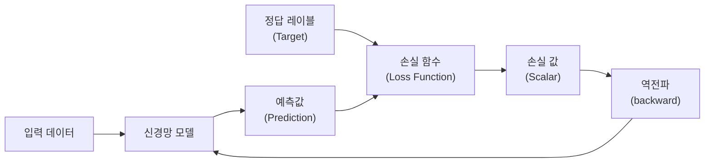
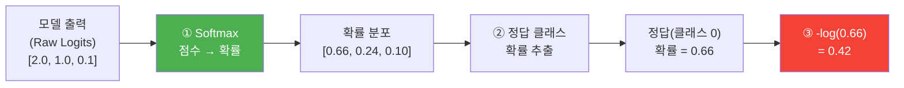
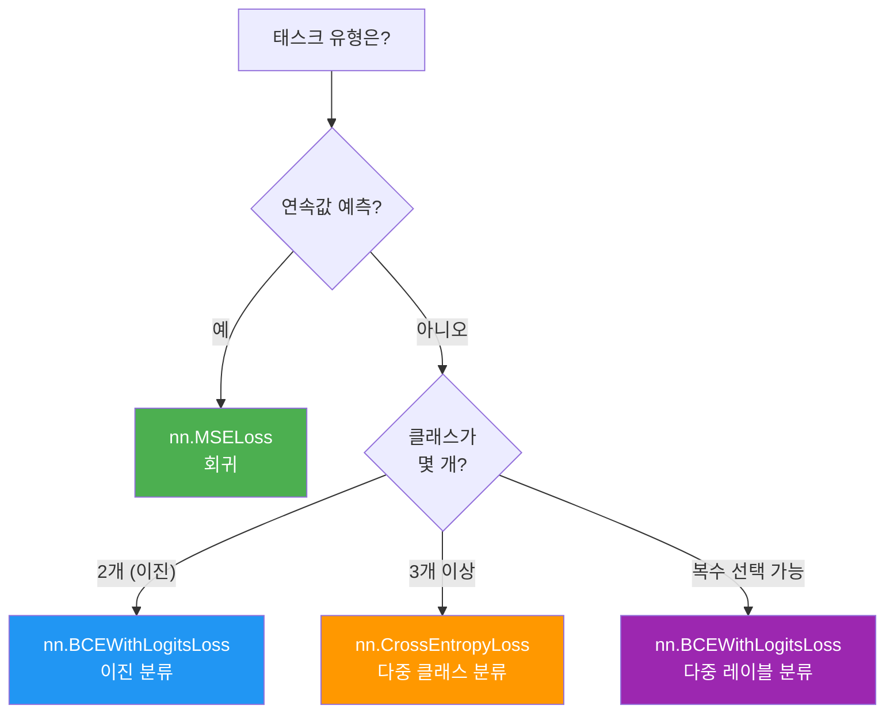
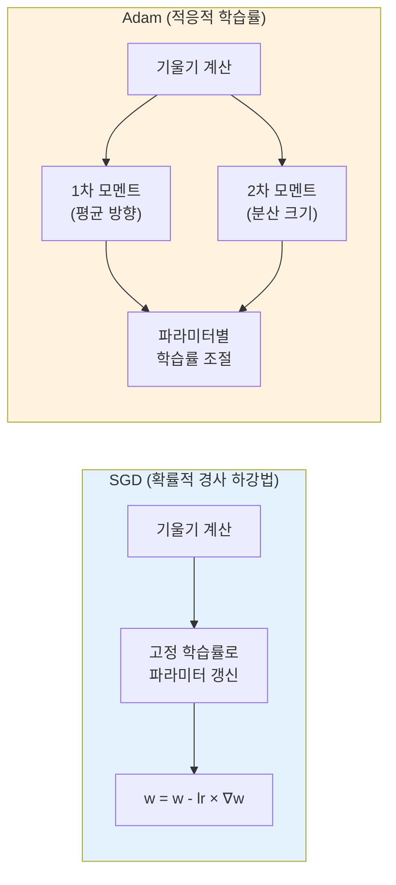
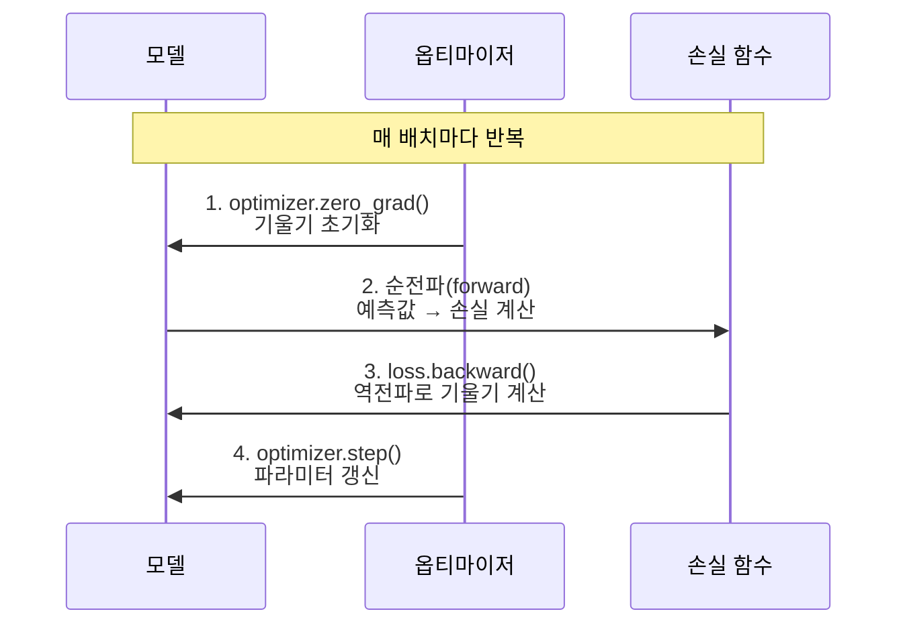

# 손실 함수와 옵티마이저

> PyTorch의 손실 함수와 옵티마이저로 신경망 학습의 나침반과 엔진을 장착한다

## 개요

이 섹션에서는 신경망이 **"얼마나 틀렸는지"**를 측정하는 **손실 함수**(Loss Function)와, 그 오차를 줄이기 위해 **파라미터를 어떻게 갱신할지** 결정하는 **옵티마이저**(Optimizer)를 학습합니다. 앞서 [nn.Module로 신경망 정의하기](07-ch7-pytorch-기초와-신경망-입문/03-03-nnmodule로-신경망-정의하기.md)에서 만든 신경망에 이제 "학습 능력"을 부여하는 단계입니다.

지금까지의 여정을 잠깐 돌아볼까요? [텐서 연산](07-ch7-pytorch-기초와-신경망-입문/01-01-텐서-연산과-pytorch-기초.md)에서 데이터를 다루는 법을, [자동 미분](07-ch7-pytorch-기초와-신경망-입문/02-02-자동-미분과-경사-하강법.md)에서 기울기를 자동으로 구하는 법을, [nn.Module](07-ch7-pytorch-기초와-신경망-입문/03-03-nnmodule로-신경망-정의하기.md)에서 모델을 정의하는 법을 배웠습니다. 이번 섹션은 이 세 가지를 **하나의 학습 루프로 연결**하는 접착제 역할을 합니다. 새로운 수학이 다소 등장하지만, 직관적 예제부터 차근차근 풀어갈 테니 걱정하지 마세요.

**선수 지식**: `nn.Module`로 신경망을 정의하고 `forward()`를 구현하는 방법, [자동 미분과 경사 하강법](07-ch7-pytorch-기초와-신경망-입문/02-02-자동-미분과-경사-하강법.md)에서 배운 `backward()`와 기울기 개념

**학습 목표**:
- MSELoss, CrossEntropyLoss, BCEWithLogitsLoss의 역할과 사용법을 구분할 수 있다
- SGD와 Adam 옵티마이저의 차이를 이해하고 적절히 선택할 수 있다
- `optimizer.zero_grad()` → `loss.backward()` → `optimizer.step()` 패턴을 자유롭게 사용할 수 있다
- 학습률 스케줄러의 기본 개념을 이해하고 적용할 수 있다

## 왜 알아야 할까?

신경망 모델을 정의하는 것은 자동차의 **차체**를 만드는 것과 같습니다. 하지만 차체만으로는 달릴 수 없죠. 손실 함수는 **내비게이션** — 현재 위치(예측)와 목적지(정답) 사이의 거리를 알려줍니다. 옵티마이저는 **엔진** — 그 거리를 줄이기 위해 실제로 움직이는 힘입니다.

NLP에서는 텍스트 분류, 감성 분석, 기계 번역 등 거의 모든 태스크가 이 두 요소에 의존합니다. 손실 함수를 잘못 선택하면 모델이 엉뚱한 방향으로 학습하고, 옵티마이저를 잘못 설정하면 학습이 느려지거나 발산합니다. 뒤이어 배울 [RNN 텍스트 분류](10-ch10-rnn-기반-텍스트-분류와-감성-분석/03-03-감성-분석-모델-학습.md)나 [BERT 파인튜닝](19-ch19-파인튜닝과-전이학습/02-02-trainer-api로-텍스트-분류-파인튜닝.md)에서도 이 패턴은 그대로 사용되므로, 여기서 확실히 익혀두면 나머지 챕터가 훨씬 수월해집니다.

## 핵심 개념

### 개념 1: 손실 함수란 무엇인가 — 모델의 "성적표"

> 💡 **비유**: 시험을 본 뒤 받는 **채점 결과**를 떠올려 보세요. 100점 만점에 70점이면 30점만큼 부족하다는 걸 알 수 있죠. 손실 함수는 바로 이 "부족한 점수"를 계산하는 채점관입니다. 차이가 클수록 손실 값이 크고, 완벽하면 0에 가까워집니다.

손실 함수(Loss Function, 또는 비용 함수/목적 함수)는 모델의 예측값과 실제 정답 사이의 **불일치 정도를 하나의 스칼라 값**으로 요약합니다. 이 값이 작아지는 방향으로 파라미터를 갱신하는 것이 학습의 본질이거든요.

[자동 미분](07-ch7-pytorch-기초와-신경망-입문/02-02-자동-미분과-경사-하강법.md)에서 `w = w - lr * w.grad`로 직접 파라미터를 갱신했던 걸 기억하시나요? 그때 "어느 방향으로 얼마나 갱신할지"를 결정한 것이 바로 기울기(gradient)였고, 그 기울기의 출발점이 **손실 함수**입니다. 손실 함수가 "현재 얼마나 틀렸는지"를 수치화해야, `backward()`가 "어떻게 고쳐야 하는지"를 계산할 수 있는 거죠.

> 📊 **그림 1**: 손실 함수의 역할 — 예측과 정답 사이의 거리를 측정



그렇다면 어떤 손실 함수를 써야 할까요? 핵심은 **"모델이 예측하는 것이 무엇인가"**에 달려 있습니다. 크게 세 가지 상황으로 나뉩니다:

| 상황 | 예시 | 모델 출력 | 손실 함수 |
|------|------|----------|----------|
| **숫자 예측** (회귀) | 주가 예측, 온도 예측 | 실수 1개 | `nn.MSELoss` |
| **둘 중 하나** (이진 분류) | 스팸 판별, 감성 분류 | 점수 1개 | `nn.BCEWithLogitsLoss` |
| **여러 개 중 하나** (다중 분류) | 언어 감지, 주제 분류 | 클래스별 점수 | `nn.CrossEntropyLoss` |

가장 직관적인 MSELoss부터 시작해서, 점차 복잡한 CrossEntropyLoss까지 하나씩 살펴보겠습니다.

### 개념 2: MSELoss — 회귀 문제의 기본

> 💡 **비유**: 과녁 맞히기에서 **화살이 중심에서 얼마나 벗어났는지**를 재는 것과 같습니다. 벗어난 거리를 제곱해서 평균을 내면, 큰 오차에 더 큰 벌점을 주는 효과가 생깁니다.

MSE(Mean Squared Error)는 예측값과 정답 사이의 차이를 제곱한 뒤 평균을 구합니다:

$$\text{MSE} = \frac{1}{N}\sum_{i=1}^{N}(y_i - \hat{y}_i)^2$$

- $y_i$: 실제 정답값
- $\hat{y}_i$: 모델의 예측값  
- $N$: 샘플 수

제곱 때문에 큰 오차가 있으면 손실이 급격히 커져서, 모델이 큰 실수를 빠르게 교정하도록 유도합니다.

```run:python
import torch
import torch.nn as nn

# MSELoss 사용 예시
criterion = nn.MSELoss()

# 모델의 예측값 (회귀이므로 실수)
prediction = torch.tensor([2.5, 0.0, 2.1, 7.8])
# 실제 정답
target = torch.tensor([3.0, -0.5, 2.0, 8.0])

loss = criterion(prediction, target)
print(f"MSE Loss: {loss.item():.4f}")

# 수동 계산으로 검증
manual_mse = ((prediction - target) ** 2).mean()
print(f"수동 계산: {manual_mse.item():.4f}")
```

```output
MSE Loss: 0.1175
수동 계산: 0.1175
```

MSELoss는 직관적이죠? "예측값 빼기 정답"을 제곱해서 평균낸 것뿐입니다. 하지만 분류 문제에서는 이 방법이 적합하지 않습니다. "고양이"와 "강아지"를 분류할 때, "0.3만큼 고양이에 가깝다"는 표현은 이상하잖아요. 분류에서는 **확률**로 이야기하는 것이 자연스럽습니다.

### 개념 3: CrossEntropyLoss — 다중 클래스 분류의 핵심

CrossEntropyLoss는 다중 클래스 분류의 표준 손실 함수입니다. 처음 보면 복잡해 보이지만, **세 단계로 나눠서** 이해하면 전혀 어렵지 않습니다.

#### Step 1: "점수"에서 "확률"로 — Softmax의 직관

> 💡 **비유**: 세 명의 요리사가 경연에 참가했는데, 심사위원 점수가 각각 80점, 60점, 40점이라고 합시다. 이 점수를 바로 비교해도 되지만, "1등이 될 확률은 몇 %인가?"라고 물으면 더 직관적이죠. Softmax는 이런 **점수→확률 변환기**입니다.

모델의 마지막 레이어는 각 클래스에 대한 **점수(로짓, logit)**를 출력합니다. 예를 들어 "고양이/강아지/새" 분류에서 모델이 `[2.0, 1.0, 0.1]`을 출력했다면, 이건 "고양이에 가장 높은 점수를 줬다"는 뜻이지만, 이 숫자들은 확률이 아닙니다. 합이 1이 아니니까요.

**Softmax**는 이 점수들을 **0~1 사이의 확률**로 변환하되, **합이 정확히 1**이 되게 만듭니다:

```run:python
import torch

# 모델이 출력한 점수 (로짓)
logits = torch.tensor([2.0, 1.0, 0.1])

# Softmax: 점수 → 확률
probs = torch.softmax(logits, dim=0)
print(f"로짓(점수): {logits.tolist()}")
print(f"확률:       {[f'{p:.2%}' for p in probs.tolist()]}")
print(f"확률 합계:   {probs.sum().item():.4f}")
```

```output
로짓(점수): [2.0, 1.0, 0.10000000149011612]
확률:       ['65.90%', '24.24%', '9.86%']
확률 합계:   1.0000
```

보이시나요? 가장 높은 점수(2.0)를 받은 클래스 0이 65.9%의 확률을 얻었습니다. Softmax는 높은 점수를 높은 확률로, 낮은 점수를 낮은 확률로 바꿔주는데, 이때 모든 확률의 합은 정확히 1이 됩니다. 이렇게 하면 "모델이 65.9% 확신으로 고양이라고 예측했다"고 해석할 수 있죠.

#### Step 2: "정답의 확률을 높여라" — 손실의 직관

> 💡 **비유**: 여러 개의 문 중에서 **정답 문**을 찾는 게임을 생각해 보세요. 모델이 정답 문에 90%의 확신을 가지면 거의 맞힌 거니 손실이 작고, 10%밖에 못 주면 크게 틀린 거니 손실이 큽니다.

Softmax로 확률을 얻었으니, 이제 핵심 질문은 간단합니다: **"정답 클래스에 부여한 확률이 얼마나 높은가?"**

- 정답 클래스 확률이 **1.0에 가까우면** → 잘 예측 → **손실 작음**
- 정답 클래스 확률이 **0에 가까우면** → 크게 틀림 → **손실 큼**

이것을 수치화한 것이 $-\log(\text{정답 확률})$입니다. 왜 `-log`를 쓸까요? 직관적으로 봅시다:

| 정답 확률 | $-\log(확률)$ | 해석 |
|-----------|--------------|------|
| 0.9 | 0.105 | 거의 맞춤 → 손실 작음 |
| 0.5 | 0.693 | 반반 → 손실 중간 |
| 0.1 | 2.303 | 크게 틀림 → 손실 큼 |
| 0.01 | 4.605 | 거의 무시 → 손실 매우 큼 |

확률이 높으면 손실은 0에 가깝고, 확률이 낮으면 손실이 급격히 커지는 — 바로 우리가 원하는 성질이죠!

> 📊 **그림 2**: CrossEntropyLoss의 내부 동작 — 점수에서 손실까지 3단계



#### Step 3: PyTorch에서 사용하기

중요한 점이 있습니다. PyTorch의 `CrossEntropyLoss`는 위의 Softmax + (-log) 과정을 **내부적으로 한꺼번에 처리**합니다. 그래서 모델의 마지막 레이어에 Softmax를 따로 붙일 필요가 없습니다 — 로짓(점수)을 바로 넣으면 됩니다.

수식으로 정리하면:

$$\text{CrossEntropy}(x, y) = -\log\left(\frac{e^{x_y}}{\sum_{j} e^{x_j}}\right)$$

- $x$: 모델이 출력한 로짓 벡터 (Softmax 적용 전의 점수)
- $y$: 정답 클래스 인덱스
- 분자 $e^{x_y}$: 정답 클래스의 점수를 지수화한 것
- 분모 $\sum_j e^{x_j}$: 모든 클래스 점수의 지수합 (Softmax의 분모)

복잡해 보이지만, 앞에서 본 "Softmax → 정답 확률 추출 → -log"를 하나의 수식으로 합친 것뿐입니다.

```run:python
import torch
import torch.nn as nn

criterion = nn.CrossEntropyLoss()

# 3개 클래스에 대한 로짓 (배치 크기 = 2)
logits = torch.tensor([
    [2.0, 1.0, 0.1],   # 첫 번째 샘플: 클래스 0에 높은 점수
    [0.5, 2.5, 0.3]    # 두 번째 샘플: 클래스 1에 높은 점수
])

# 정답 레이블 (클래스 인덱스, NOT one-hot)
targets = torch.tensor([0, 1])

loss = criterion(logits, targets)
print(f"CrossEntropy Loss: {loss.item():.4f}")

# 과정을 수동으로 따라가 보기
probs = torch.softmax(logits, dim=1)
print(f"\n첫 번째 샘플 확률: {[f'{p:.2%}' for p in probs[0].tolist()]}")
print(f"  → 정답(클래스 0) 확률: {probs[0][0]:.2%}")
print(f"  → -log({probs[0][0]:.4f}) = {-torch.log(probs[0][0]).item():.4f}")

print(f"\n두 번째 샘플 확률: {[f'{p:.2%}' for p in probs[1].tolist()]}")
print(f"  → 정답(클래스 1) 확률: {probs[1][1]:.2%}")
print(f"  → -log({probs[1][1]:.4f}) = {-torch.log(probs[1][1]).item():.4f}")

manual_loss = (-torch.log(probs[0][0]) + -torch.log(probs[1][1])) / 2
print(f"\n수동 계산 평균 Loss: {manual_loss.item():.4f}")
```

```output
CrossEntropy Loss: 0.4019
첫 번째 샘플 확률: ['65.90%', '24.24%', '9.86%']
  → 정답(클래스 0) 확률: 65.90%
  → -log(0.6590) = 0.4170
두 번째 샘플 확률: ['11.73%', '86.68%', '1.59%']
  → 정답(클래스 1) 확률: 86.68%
  → -log(0.8668) = 0.1430
수동 계산 평균 Loss: 0.2800
```

두 샘플 모두 정답 클래스에 높은 확률을 부여했기 때문에 손실이 비교적 작습니다. 만약 모델이 엉뚱한 클래스에 높은 점수를 줬다면 손실이 훨씬 커졌을 거예요.

> ⚠️ **흔한 오해**: "CrossEntropyLoss에 넣기 전에 Softmax를 적용해야 하지 않나요?" — **아닙니다!** PyTorch의 `CrossEntropyLoss`는 내부적으로 LogSoftmax를 포함하고 있어서, 모델의 마지막 레이어 출력(로짓)을 **그대로** 넣어야 합니다. Softmax를 두 번 적용하면 수치적으로 불안정해지고 학습이 제대로 되지 않습니다.

### 개념 4: BCEWithLogitsLoss — 이진 분류와 다중 레이블

이진 분류(스팸 vs 정상)나 다중 레이블 분류(하나의 문서에 여러 태그)에는 `BCEWithLogitsLoss`를 사용합니다. CrossEntropyLoss가 "여러 클래스 중 하나를 골라라"였다면, BCEWithLogitsLoss는 "각 항목에 대해 예/아니오를 판단하라"입니다. 이 함수는 **Sigmoid + BCELoss**를 합친 것으로, 수치적으로 더 안정적입니다.

> 📊 **그림 3**: 태스크별 손실 함수 선택 가이드



```python
import torch
import torch.nn as nn

criterion = nn.BCEWithLogitsLoss()

# 이진 분류: 모델의 로짓 출력 (Sigmoid 적용 전)
logits = torch.tensor([1.5, -0.5, 2.0, -1.0])
# 정답 (0 또는 1)
targets = torch.tensor([1.0, 0.0, 1.0, 0.0])

loss = criterion(logits, targets)
print(f"BCE Loss: {loss.item():.4f}")  # 0.2014
```

### 개념 5: 옵티마이저 — 파라미터를 갱신하는 엔진

> 💡 **비유**: 산에서 가장 낮은 골짜기(최소 손실)를 찾아 내려가야 합니다. **SGD**는 단순히 "가장 가파른 방향으로 한 걸음 내려가기"를 반복하는 등산객이고, **Adam**은 지형을 기억하며 **보폭과 방향을 똑똑하게 조절하는** 경험 많은 등산 가이드입니다.

[자동 미분과 경사 하강법](07-ch7-pytorch-기초와-신경망-입문/02-02-자동-미분과-경사-하강법.md)에서 수동으로 `w = w - lr * w.grad`를 계산했던 것을 기억하시나요? `torch.optim`의 옵티마이저는 이 과정을 자동화하고, 더 똑똑한 갱신 전략을 제공합니다.

> 📊 **그림 4**: SGD vs Adam의 파라미터 갱신 방식 비교



**SGD (Stochastic Gradient Descent)**:
- 가장 기본적인 옵티마이저
- 모멘텀(momentum)을 추가하면 진동을 줄이고 수렴을 가속
- 간단하고 메모리 효율적

**Adam (Adaptive Moment Estimation)**:
- 2014년 Diederik Kingma와 Jimmy Ba가 제안
- 각 파라미터마다 **개별 학습률**을 적응적으로 조절
- 1차 모멘트(기울기의 평균)와 2차 모멘트(기울기의 분산)를 추적
- 대부분의 딥러닝 태스크에서 좋은 기본 선택

```python
import torch.optim as optim

model = nn.Linear(10, 3)  # 간단한 모델

# SGD 옵티마이저 (학습률 0.01, 모멘텀 0.9)
optimizer_sgd = optim.SGD(model.parameters(), lr=0.01, momentum=0.9)

# Adam 옵티마이저 (학습률 0.001)
optimizer_adam = optim.Adam(model.parameters(), lr=0.001)

# AdamW 옵티마이저 (가중치 감쇠 적용 — Transformer에서 주로 사용)
optimizer_adamw = optim.AdamW(model.parameters(), lr=0.001, weight_decay=0.01)
```

### 개념 6: 학습의 3단계 패턴

신경망 학습에서 가장 중요한 패턴이 바로 **zero_grad → backward → step** 3단계입니다. 이 패턴은 PyTorch로 어떤 모델을 학습하든 항상 동일합니다.

> 📊 **그림 5**: 학습 루프의 핵심 3단계



잠깐, 이 3단계가 왜 필요한지 복습해 볼까요? [자동 미분](07-ch7-pytorch-기초와-신경망-입문/02-02-자동-미분과-경사-하강법.md)에서 이런 코드를 짰었습니다:

```python
# 자동 미분 섹션에서 직접 했던 것
loss = (prediction - target) ** 2   # 손실 계산
loss.backward()                     # 기울기 계산
w = w - lr * w.grad                 # 수동 갱신
w.grad.zero_()                      # 기울기 초기화
```

옵티마이저는 위의 "수동 갱신"과 "기울기 초기화"를 **자동화**한 것입니다. 이제 같은 과정을 옵티마이저로 깔끔하게 작성할 수 있습니다:

```run:python
import torch
import torch.nn as nn
import torch.optim as optim

# 간단한 선형 모델
model = nn.Linear(1, 1)
criterion = nn.MSELoss()
optimizer = optim.SGD(model.parameters(), lr=0.01)

# 학습 데이터: y = 2x + 1
x = torch.tensor([[1.0], [2.0], [3.0], [4.0]])
y = torch.tensor([[3.0], [5.0], [7.0], [9.0]])

# 학습 루프 (5 에폭)
for epoch in range(5):
    # Step 1: 기울기 초기화 (이전 배치의 기울기 제거)
    optimizer.zero_grad()
    
    # Step 2: 순전파 + 손실 계산
    prediction = model(x)
    loss = criterion(prediction, y)
    
    # Step 3: 역전파 (기울기 계산)
    loss.backward()
    
    # Step 4: 파라미터 갱신
    optimizer.step()
    
    print(f"Epoch {epoch+1}: Loss = {loss.item():.4f}")

# 학습된 파라미터 확인
w = model.weight.item()
b = model.bias.item()
print(f"\n학습 결과: y = {w:.2f}x + {b:.2f} (정답: y = 2x + 1)")
```

```output
Epoch 1: Loss = 35.5584
Epoch 2: Loss = 26.2188
Epoch 3: Loss = 19.3610
Epoch 4: Loss = 14.3169
Epoch 5: Loss = 10.6019

학습 결과: y = 1.30x + 0.73 (정답: y = 2x + 1)
```

5 에폭만으로도 손실이 35 → 10으로 빠르게 줄어들고 있습니다. 더 많은 에폭을 돌리면 `y = 2.00x + 1.00`에 가까워질 거예요.

> 🔥 **실무 팁**: `optimizer.zero_grad()`를 잊으면 기울기가 **누적**되어 학습이 발산합니다. PyTorch가 기울기를 자동으로 초기화하지 않는 이유는, 미니배치를 여러 번 나눠서 기울기를 축적(gradient accumulation)하는 고급 기법을 지원하기 위해서입니다. 하지만 일반적인 학습에서는 **매 배치 시작 시 반드시** `zero_grad()`를 호출하세요.

### 개념 7: 학습률 스케줄러 기초

학습률(learning rate)은 학습에서 가장 중요한 하이퍼파라미터입니다. 너무 크면 발산하고, 너무 작으면 수렴이 느립니다. **학습률 스케줄러**는 학습이 진행됨에 따라 학습률을 자동으로 조절합니다.

> 💡 **비유**: 처음에는 큰 보폭으로 빠르게 산을 내려가다가, 골짜기에 가까워지면 작은 보폭으로 조심조심 내려가는 것과 같습니다. 처음부터 작은 보폭이면 시간이 너무 오래 걸리고, 끝까지 큰 보폭이면 골짜기를 지나쳐버릴 수 있거든요.

```python
import torch.optim.lr_scheduler as lr_scheduler

model = nn.Linear(10, 3)
optimizer = optim.Adam(model.parameters(), lr=0.001)

# StepLR: 매 step_size 에폭마다 학습률을 gamma 비율로 감소
scheduler = lr_scheduler.StepLR(optimizer, step_size=10, gamma=0.1)

# ReduceLROnPlateau: 검증 손실이 개선되지 않으면 학습률 감소
scheduler_plateau = lr_scheduler.ReduceLROnPlateau(
    optimizer, mode='min', patience=5, factor=0.5
)

# CosineAnnealingLR: 코사인 함수 형태로 학습률 감소 (Transformer에서 인기)
scheduler_cosine = lr_scheduler.CosineAnnealingLR(optimizer, T_max=50)
```

> 💡 **알고 계셨나요?**: `scheduler.step()`은 **에폭 단위**로 호출합니다 (`optimizer.step()` 이후). PyTorch 1.1 이전에는 순서가 달랐는데, 현재 버전에서는 반드시 optimizer 업데이트 이후에 스케줄러를 호출해야 합니다.

## 실습: 직접 해보기

감성 분류 문제를 간단히 시뮬레이션하여, 손실 함수와 옵티마이저를 종합적으로 활용해 봅시다. 긍정(1)과 부정(0) 문장을 분류하는 모델을 학습합니다.

```python
import torch
import torch.nn as nn
import torch.optim as optim
import torch.optim.lr_scheduler as lr_scheduler

torch.manual_seed(42)

# ── 1. 가상 데이터 생성 (임베딩 벡터로 가정) ──
# 긍정 문장 50개: 평균이 [1, 1, 1, 1]에 가까운 벡터
# 부정 문장 50개: 평균이 [-1, -1, -1, -1]에 가까운 벡터
n_samples = 50
dim = 4

pos_data = torch.randn(n_samples, dim) + 1.0   # 긍정
neg_data = torch.randn(n_samples, dim) - 1.0   # 부정

X = torch.cat([pos_data, neg_data], dim=0)      # (100, 4)
y = torch.cat([
    torch.ones(n_samples),                       # 긍정 = 1
    torch.zeros(n_samples)                       # 부정 = 0
])

# 데이터 셔플
perm = torch.randperm(len(X))
X, y = X[perm], y[perm]

# 학습/검증 분리 (80:20)
train_X, val_X = X[:80], X[80:]
train_y, val_y = y[:80], y[80:]

# ── 2. 모델 정의 ──
class SentimentClassifier(nn.Module):
    def __init__(self, input_dim):
        super().__init__()
        self.layers = nn.Sequential(
            nn.Linear(input_dim, 16),
            nn.ReLU(),
            nn.Linear(16, 8),
            nn.ReLU(),
            nn.Linear(8, 1)      # 이진 분류: 출력 1개 (로짓)
        )
    
    def forward(self, x):
        return self.layers(x).squeeze(-1)

model = SentimentClassifier(dim)

# ── 3. 손실 함수 & 옵티마이저 설정 ──
criterion = nn.BCEWithLogitsLoss()  # 이진 분류 → BCEWithLogitsLoss
optimizer = optim.Adam(model.parameters(), lr=0.01)
scheduler = lr_scheduler.StepLR(optimizer, step_size=20, gamma=0.5)

# ── 4. 학습 루프 ──
n_epochs = 50

for epoch in range(1, n_epochs + 1):
    model.train()
    
    # 핵심 3단계
    optimizer.zero_grad()                          # 기울기 초기화
    logits = model(train_X)                        # 순전파
    loss = criterion(logits, train_y)              # 손실 계산
    loss.backward()                                # 역전파
    optimizer.step()                               # 파라미터 갱신
    scheduler.step()                               # 학습률 갱신
    
    # 학습 정확도
    train_preds = (torch.sigmoid(logits) > 0.5).float()
    train_acc = (train_preds == train_y).float().mean()
    
    # 검증
    if epoch % 10 == 0:
        model.eval()
        with torch.no_grad():
            val_logits = model(val_X)
            val_loss = criterion(val_logits, val_y)
            val_preds = (torch.sigmoid(val_logits) > 0.5).float()
            val_acc = (val_preds == val_y).float().mean()
        
        current_lr = optimizer.param_groups[0]['lr']
        print(f"Epoch {epoch:3d} | "
              f"Train Loss: {loss:.4f} | Train Acc: {train_acc:.2%} | "
              f"Val Loss: {val_loss:.4f} | Val Acc: {val_acc:.2%} | "
              f"LR: {current_lr:.4f}")

# ── 5. 최종 결과 ──
model.eval()
with torch.no_grad():
    final_logits = model(val_X)
    final_preds = (torch.sigmoid(final_logits) > 0.5).float()
    final_acc = (final_preds == val_y).float().mean()
    
print(f"\n최종 검증 정확도: {final_acc:.2%}")
print(f"모델 파라미터 수: {sum(p.numel() for p in model.parameters()):,}")
```

이 실습에서 주목할 점:
1. **이진 분류**이므로 `BCEWithLogitsLoss`를 사용했고, 모델 출력은 1개의 로짓
2. 추론 시 `torch.sigmoid()`을 적용한 뒤 0.5 기준으로 분류
3. `model.eval()`과 `torch.no_grad()`로 검증 모드를 명시적으로 구분
4. `StepLR` 스케줄러가 20 에폭마다 학습률을 절반으로 줄임

## 더 깊이 알아보기

### Adam의 탄생 — "그냥 돌아가는" 옵티마이저를 향해

2014년, 암스테르담 대학의 박사과정 학생이던 **Diederik Kingma**와 토론토 대학의 **Jimmy Ba**는 "Adam: A Method for Stochastic Optimization"이라는 논문을 발표합니다. 논문 제목의 Adam은 "Adaptive Moment Estimation"의 줄임말인데요.

당시 딥러닝 연구자들은 옵티마이저 선택에 많은 시간을 허비하고 있었습니다. SGD는 학습률에 민감하고, Adagrad는 학습률이 점점 0으로 수렴하는 문제가 있었고, RMSprop은 Hinton 교수의 강의 슬라이드에서만 소개되었을 뿐 정식 논문이 없었습니다.

Kingma와 Ba는 이 모든 장점을 합치면서 단점을 보완한 Adam을 제안했습니다. "특별히 튜닝하지 않아도 대부분의 문제에서 잘 동작한다"는 점이 폭발적인 인기의 비결이었죠. 기본 학습률 `0.001`은 지금까지도 "일단 Adam으로 시작하라"는 딥러닝의 격언과 함께 살아 있습니다.

### Cross-Entropy의 뿌리 — 정보 이론에서 온 손실 함수

CrossEntropyLoss의 기원은 **Claude Shannon**의 1948년 정보 이론까지 거슬러 올라갑니다. Shannon은 "어떤 사건이 일어났다는 정보의 양"을 $-\log(p)$로 정의했는데, 확률이 낮은 사건일수록 그것이 일어났다는 정보량이 크다는 직관적인 아이디어였습니다. Cross-entropy는 "실제 분포와 예측 분포 사이의 정보량 차이"를 측정하는 것으로, 분류 문제에서 확률 분포를 비교하는 가장 자연스러운 척도가 된 것이죠.

## 흔한 오해와 팁

> ⚠️ **흔한 오해**: "Adam이 항상 SGD보다 낫다?" — 반드시 그렇지는 않습니다. 대규모 이미지 분류(ImageNet)에서는 SGD + 모멘텀이 Adam보다 더 좋은 일반화 성능을 보이는 경우가 많습니다. NLP에서는 Adam 계열(특히 AdamW)이 표준이지만, 태스크에 따라 다를 수 있습니다.

> 💡 **알고 계셨나요?**: `AdamW`는 Adam에 **분리된 가중치 감쇠(decoupled weight decay)**를 적용한 변형입니다. 2019년 Loshchilov & Hutter의 논문에서 제안되었고, BERT, GPT 등 현대 Transformer 모델의 학습에 표준으로 사용됩니다. Hugging Face Transformers의 `Trainer`도 기본 옵티마이저로 AdamW를 사용하거든요.

> 🔥 **실무 팁**: NLP 프로젝트를 시작할 때는 **Adam (lr=0.001)**로 시작하고, Transformer 파인튜닝에는 **AdamW (lr=2e-5 ~ 5e-5)**로 시작하세요. 이 기본값에서 출발해 학습 곡선을 관찰하며 조절하는 것이 가장 효율적입니다.

## 핵심 정리

| 개념 | 설명 |
|------|------|
| **손실 함수** | 모델의 예측과 정답 사이의 불일치를 스칼라 값으로 측정 |
| **MSELoss** | 회귀 문제용. 예측과 정답의 차이를 제곱하여 평균 |
| **CrossEntropyLoss** | 다중 클래스 분류용. Softmax(점수→확률) + -log(정답 확률)을 내부 포함. 로짓 입력 |
| **BCEWithLogitsLoss** | 이진/다중 레이블 분류용. Sigmoid + BCELoss를 내부 포함 |
| **SGD** | 기본 경사 하강법. 모멘텀 추가 가능. 단순하고 메모리 효율적 |
| **Adam** | 적응적 학습률 옵티마이저. 대부분의 태스크에서 좋은 기본 선택 |
| **AdamW** | Adam + 분리된 가중치 감쇠. Transformer 학습의 표준 |
| **학습 3단계** | `zero_grad()` → `backward()` → `step()` 패턴 |
| **학습률 스케줄러** | 학습 진행에 따라 학습률을 자동 조절 (StepLR, CosineAnnealing 등) |

## 다음 섹션 미리보기

이번 섹션에서 손실 함수와 옵티마이저를 배웠으니, 다음 [학습 루프와 Dataset/DataLoader](07-ch7-pytorch-기초와-신경망-입문/05-05-학습-루프와-datasetdataloader.md)에서는 실제 데이터를 **배치 단위로 로드**하고, 완전한 **학습-검증-테스트 루프**를 구축하는 방법을 다룹니다. 이번에 배운 3단계 패턴이 DataLoader와 결합되어 실전 학습 파이프라인의 완성판이 됩니다.

## 참고 자료

- [PyTorch torch.optim 공식 문서](https://docs.pytorch.org/docs/stable/optim.html) — 모든 옵티마이저와 스케줄러의 API 레퍼런스
- [PyTorch CrossEntropyLoss 공식 문서](https://docs.pytorch.org/docs/stable/generated/torch.nn.CrossEntropyLoss.html) — 입력 형태, 가중치 옵션 등 상세 설명
- [PyTorch NLP From Scratch 튜토리얼](https://docs.pytorch.org/tutorials/intermediate/nlp_from_scratch_index.html) — 손실 함수와 옵티마이저를 활용한 NLP 실전 예제
- [graykode/nlp-tutorial](https://github.com/graykode/nlp-tutorial) — 다양한 NLP 모델의 PyTorch 구현 예제 모음
- [Adam: A Method for Stochastic Optimization (Kingma & Ba, 2014)](https://arxiv.org/abs/1412.6980) — Adam 옵티마이저 원논문

---
### 🔗 Related Sessions
- [nn.module](07-ch7-pytorch-기초와-신경망-입문/03-03-nnmodule로-신경망-정의하기.md) (prerequisite)
- [nn.linear](07-ch7-pytorch-기초와-신경망-입문/03-03-nnmodule로-신경망-정의하기.md) (prerequisite)
- [requires_grad](07-ch7-pytorch-기초와-신경망-입문/02-02-자동-미분과-경사-하강법.md) (prerequisite)
- [backward()](07-ch7-pytorch-기초와-신경망-입문/02-02-자동-미분과-경사-하강법.md) (prerequisite)
- [forward()](07-ch7-pytorch-기초와-신경망-입문/03-03-nnmodule로-신경망-정의하기.md) (prerequisite)
- [.grad](07-ch7-pytorch-기초와-신경망-입문/02-02-자동-미분과-경사-하강법.md) (prerequisite)
- [torch.no_grad()](07-ch7-pytorch-기초와-신경망-입문/02-02-자동-미분과-경사-하강법.md) (prerequisite)
- [relu](07-ch7-pytorch-기초와-신경망-입문/03-03-nnmodule로-신경망-정의하기.md) (prerequisite)
