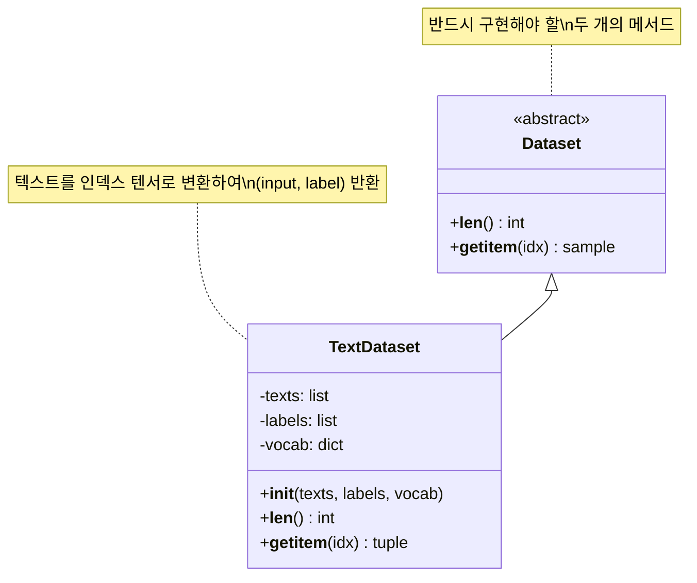
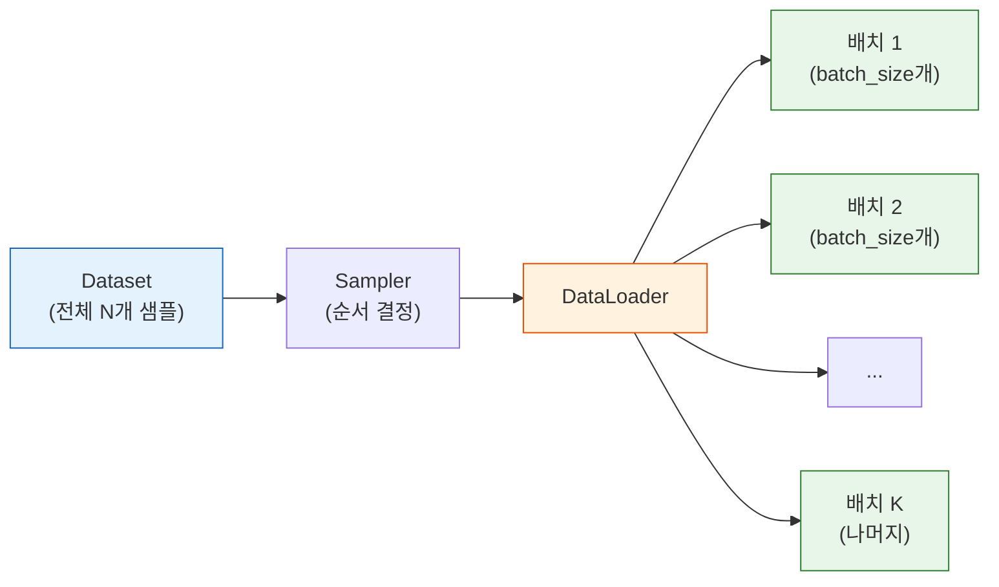
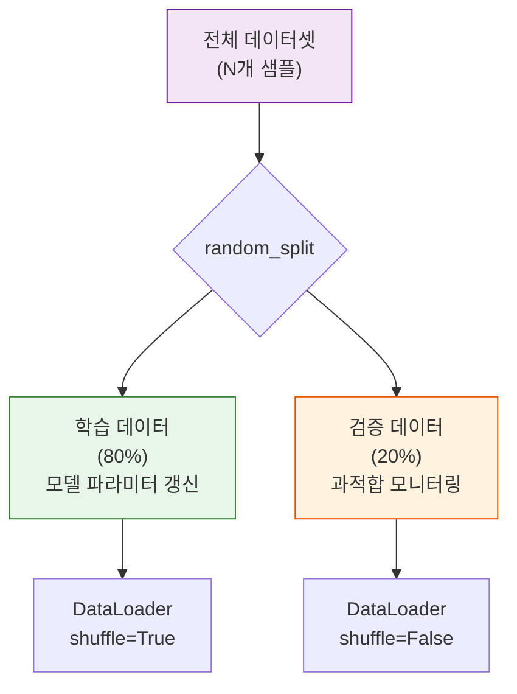
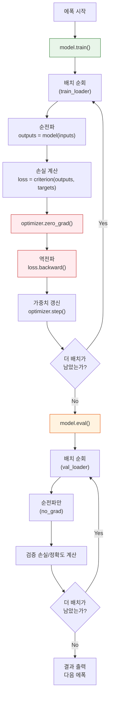
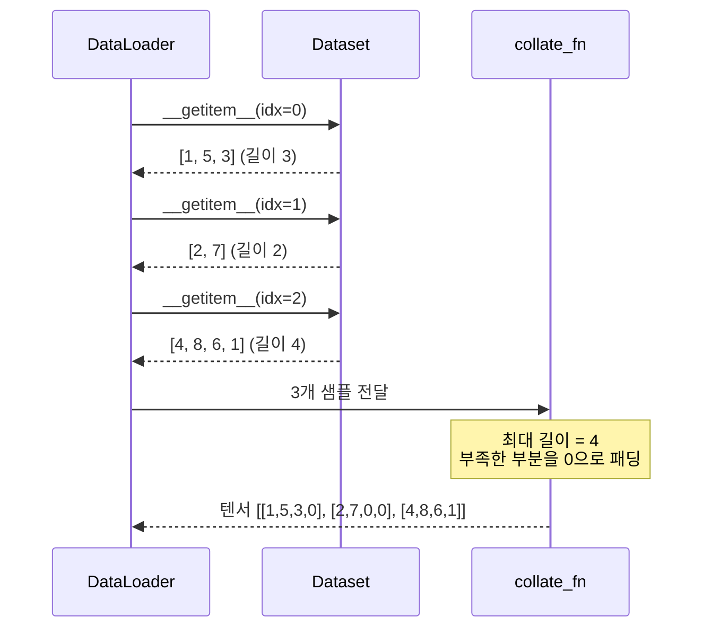

# 학습 루프와 Dataset/DataLoader

> PyTorch의 Dataset과 DataLoader로 데이터를 효율적으로 관리하고, 완전한 학습-검증 루프를 구현하여 텍스트 분류 모델을 학습시킵니다.

## 개요

이 섹션에서는 PyTorch의 데이터 파이프라인과 학습 루프를 종합적으로 학습합니다. 지금까지 Ch7에서 배운 텐서, 자동 미분, nn.Module, 손실 함수, 옵티마이저를 모두 결합하여 **실전에서 사용하는 완전한 학습 파이프라인**을 구축합니다.

**선수 지식**: [텐서와 연산](07-ch7-pytorch-기초와-신경망-입문/01-01-pytorch-텐서와-연산.md), [자동 미분](07-ch7-pytorch-기초와-신경망-입문/02-02-자동-미분과-경사-하강법.md), [nn.Module](07-ch7-pytorch-기초와-신경망-입문/03-03-nnmodule로-신경망-정의하기.md), [손실 함수와 옵티마이저](07-ch7-pytorch-기초와-신경망-입문/04-04-손실-함수와-옵티마이저.md)

**학습 목표**:
- `torch.utils.data.Dataset`을 상속하여 커스텀 데이터셋을 정의할 수 있다
- `DataLoader`로 배치 처리, 셔플, 병렬 로딩을 설정할 수 있다
- 학습/검증 데이터를 분리하고, 과적합을 모니터링할 수 있다
- `train()` → `eval()` 모드 전환을 포함한 완전한 학습 루프를 구현할 수 있다
- 간단한 텍스트 분류 파이프라인을 처음부터 끝까지 구축할 수 있다

## 왜 알아야 할까?

지금까지 우리는 작은 데이터를 하나의 텐서에 담아 한 번에 학습했습니다. 하지만 현실의 NLP 데이터는 수만~수백만 건이거든요. 이 모든 데이터를 한 번에 메모리에 올리고, 한 번에 계산하는 건 GPU 메모리가 아무리 커도 불가능합니다.

**배치 학습(batch training)**은 이 문제의 해법입니다. 데이터를 작은 덩어리(배치)로 나누어 조금씩 학습하면, 메모리도 절약하고 학습도 더 안정적으로 진행됩니다. PyTorch의 `Dataset`과 `DataLoader`는 이 과정을 자동화해주는 도구이고, 모든 PyTorch 프로젝트에서 예외 없이 사용됩니다.

또한, 모델이 학습 데이터를 "외우기만" 하는 **과적합(overfitting)**을 잡아내려면 학습에 사용하지 않은 **검증 데이터**가 필요합니다. 학습/검증 분리와 함께 `model.train()`/`model.eval()` 전환까지—이것이 실전 학습 파이프라인의 기본 골격입니다.

## 핵심 개념

### 개념 1: Dataset — 데이터의 메뉴판

> 💡 **비유**: 레스토랑의 메뉴판을 떠올려 보세요. 메뉴판은 "총 몇 개의 메뉴가 있는지" 알려주고, "3번 메뉴 주세요"라고 하면 해당 요리를 가져다 줍니다. PyTorch의 `Dataset`도 정확히 이 두 가지 기능만 하면 됩니다—전체 개수(`__len__`)와 특정 항목 가져오기(`__getitem__`).

PyTorch의 `torch.utils.data.Dataset`은 추상 클래스입니다. 이를 상속받아 두 개의 메서드만 구현하면 어떤 형태의 데이터든 PyTorch가 다룰 수 있게 됩니다.

> 📊 **그림 1**: Dataset 클래스의 핵심 구조



커스텀 Dataset의 기본 구조는 이렇습니다:

```python
import torch
from torch.utils.data import Dataset

class TextClassificationDataset(Dataset):
    def __init__(self, texts, labels, vocab, max_len=50):
        self.texts = texts          # 원본 텍스트 리스트
        self.labels = labels        # 레이블 리스트
        self.vocab = vocab          # 단어 → 인덱스 사전
        self.max_len = max_len      # 최대 시퀀스 길이
    
    def __len__(self):
        return len(self.texts)      # 전체 샘플 수 반환
    
    def __getitem__(self, idx):
        text = self.texts[idx]
        label = self.labels[idx]
        
        # 단어를 인덱스로 변환
        tokens = text.split()
        indices = [self.vocab.get(w, self.vocab["<UNK>"]) for w in tokens]
        
        # 패딩 또는 잘라내기 (고정 길이)
        if len(indices) < self.max_len:
            indices += [self.vocab["<PAD>"]] * (self.max_len - len(indices))
        else:
            indices = indices[:self.max_len]
        
        return torch.tensor(indices, dtype=torch.long), torch.tensor(label, dtype=torch.long)
```

핵심 포인트 세 가지:
1. `__init__`에서 데이터를 받아 저장 (파일 경로만 저장하고 `__getitem__`에서 읽어도 됨)
2. `__len__`은 정수 하나만 반환
3. `__getitem__`은 인덱스를 받아 **텐서**로 변환된 하나의 샘플을 반환

```run:python
from torch.utils.data import Dataset
import torch

# 간단한 예제 Dataset
class SimpleDataset(Dataset):
    def __init__(self, data, targets):
        self.data = torch.tensor(data, dtype=torch.float32)
        self.targets = torch.tensor(targets, dtype=torch.long)
    
    def __len__(self):
        return len(self.data)
    
    def __getitem__(self, idx):
        return self.data[idx], self.targets[idx]

# 데이터셋 생성
dataset = SimpleDataset(
    data=[[1, 2], [3, 4], [5, 6], [7, 8]],
    targets=[0, 1, 0, 1]
)

print(f"데이터셋 크기: {len(dataset)}")
print(f"첫 번째 샘플: {dataset[0]}")
print(f"세 번째 샘플: {dataset[2]}")
```

```output
데이터셋 크기: 4
첫 번째 샘플: (tensor([1., 2.]), tensor(0))
세 번째 샘플: (tensor([5., 6.]), tensor(0))
```

### 개념 2: DataLoader — 자동 배식 시스템

> 💡 **비유**: `Dataset`이 메뉴판이라면, `DataLoader`는 **뷔페의 배식 시스템**입니다. 접시(배치)에 음식을 적당량 담아주고, 매번 다른 순서로 음식을 배치(셔플)하며, 여러 직원이 동시에 음식을 준비(병렬 로딩)합니다.

`DataLoader`는 `Dataset`을 감싸서 배치 처리, 셔플, 병렬 로딩을 자동으로 해줍니다.

> 📊 **그림 2**: DataLoader의 데이터 흐름



주요 파라미터를 살펴볼까요:

```python
from torch.utils.data import DataLoader

train_loader = DataLoader(
    dataset,              # Dataset 객체
    batch_size=32,        # 한 배치에 담을 샘플 수
    shuffle=True,         # 매 에폭마다 순서 섞기 (학습용)
    num_workers=2,        # 데이터 로딩 병렬 프로세스 수
    drop_last=True,       # 마지막 불완전한 배치 버리기
)
```

| 파라미터 | 역할 | 학습 시 | 검증 시 |
|----------|------|---------|---------|
| `shuffle` | 순서 섞기 | `True` (필수) | `False` |
| `batch_size` | 배치 크기 | 32~128 | 동일하거나 더 크게 |
| `drop_last` | 마지막 배치 제거 | 선택적 | `False` |
| `num_workers` | 병렬 프로세스 | 2~4 | 동일 |

> ⚠️ **흔한 오해**: "배치 크기가 클수록 좋다"고 생각하기 쉽지만, 배치 크기가 너무 크면 일반화 성능이 떨어질 수 있습니다. 반대로 너무 작으면 학습이 불안정해집니다. NLP에서는 보통 16~128 사이를 사용합니다. GPU 메모리가 허락하는 선에서 실험적으로 결정하는 게 일반적입니다.

```run:python
from torch.utils.data import Dataset, DataLoader
import torch

class SimpleDataset(Dataset):
    def __init__(self, size=10):
        self.x = torch.randn(size, 3)
        self.y = torch.randint(0, 2, (size,))
    def __len__(self):
        return len(self.x)
    def __getitem__(self, idx):
        return self.x[idx], self.y[idx]

dataset = SimpleDataset(10)
loader = DataLoader(dataset, batch_size=3, shuffle=False)

for batch_idx, (inputs, targets) in enumerate(loader):
    print(f"배치 {batch_idx}: inputs shape={inputs.shape}, targets={targets.tolist()}")
```

```output
배치 0: inputs shape=torch.Size([3, 3]), targets=[0, 1, 0]
배치 1: inputs shape=torch.Size([3, 3]), targets=[1, 1, 0]
배치 2: inputs shape=torch.Size([3, 3]), targets=[0, 1, 0]
배치 3: inputs shape=torch.Size([1, 3]), targets=[1]
```

마지막 배치(배치 3)가 1개밖에 없는 것 보이시죠? 이런 불완전한 배치가 BatchNorm 등에서 문제를 일으킬 수 있어서, 학습 시에는 `drop_last=True`를 쓰기도 합니다.

### 개념 3: 학습/검증 분리 — random_split

> 💡 **비유**: 시험 공부를 할 때, 문제집의 모든 문제로 공부만 하고 자기가 얼마나 아는지 확인하지 않으면 "실제 시험"에서 낭패를 봅니다. **일부를 모의고사용으로 떼어놓는 것**이 바로 검증 데이터 분리입니다.

PyTorch는 `random_split` 함수로 데이터셋을 간편하게 분할합니다:

> 📊 **그림 3**: 학습/검증/테스트 데이터 분리



```python
from torch.utils.data import random_split

# 전체 데이터셋에서 80:20으로 분리
dataset = TextClassificationDataset(texts, labels, vocab)
train_size = int(0.8 * len(dataset))
val_size = len(dataset) - train_size

train_dataset, val_dataset = random_split(dataset, [train_size, val_size])

# 각각 DataLoader 생성
train_loader = DataLoader(train_dataset, batch_size=32, shuffle=True)
val_loader = DataLoader(val_dataset, batch_size=64, shuffle=False)  # 검증은 셔플 불필요
```

핵심 원칙: **학습 데이터는 셔플, 검증 데이터는 셔플하지 않습니다**. 검증은 매번 같은 조건에서 평가해야 비교가 의미 있기 때문이죠.

### 개념 4: 완전한 학습 루프 — train/eval 패턴

> 💡 **비유**: 축구 선수가 훈련(train)할 때는 자유롭게 새로운 시도를 하지만, 평가전(eval)에서는 평소 실력 그대로 보여줘야 합니다. PyTorch 모델도 마찬가지입니다. `model.train()`은 Dropout과 BatchNorm을 "훈련 모드"로, `model.eval()`은 "평가 모드"로 전환합니다.

> 📊 **그림 4**: 학습 루프의 전체 흐름



이 다이어그램이 학습 루프의 모든 것입니다. 코드로 옮기면:

```python
def train_one_epoch(model, train_loader, criterion, optimizer, device):
    model.train()  # 학습 모드 (Dropout 활성화)
    running_loss = 0.0
    correct = 0
    total = 0
    
    for inputs, targets in train_loader:
        inputs, targets = inputs.to(device), targets.to(device)
        
        # 1. 기울기 초기화
        optimizer.zero_grad()
        # 2. 순전파
        outputs = model(inputs)
        # 3. 손실 계산
        loss = criterion(outputs, targets)
        # 4. 역전파
        loss.backward()
        # 5. 가중치 갱신
        optimizer.step()
        
        running_loss += loss.item() * inputs.size(0)
        _, predicted = outputs.max(1)
        correct += predicted.eq(targets).sum().item()
        total += targets.size(0)
    
    epoch_loss = running_loss / total
    epoch_acc = correct / total
    return epoch_loss, epoch_acc


def validate(model, val_loader, criterion, device):
    model.eval()  # 평가 모드 (Dropout 비활성화)
    running_loss = 0.0
    correct = 0
    total = 0
    
    with torch.no_grad():  # 기울기 계산 끄기 → 메모리 절약
        for inputs, targets in val_loader:
            inputs, targets = inputs.to(device), targets.to(device)
            
            outputs = model(inputs)
            loss = criterion(outputs, targets)
            
            running_loss += loss.item() * inputs.size(0)
            _, predicted = outputs.max(1)
            correct += predicted.eq(targets).sum().item()
            total += targets.size(0)
    
    epoch_loss = running_loss / total
    epoch_acc = correct / total
    return epoch_loss, epoch_acc
```

> 🔥 **실무 팁**: `loss.item()`을 사용하여 Python float로 변환한 뒤 누적하세요. `loss` 텐서 자체를 리스트에 모으면 연산 그래프가 해제되지 않아 GPU 메모리가 계속 쌓입니다. 이건 초보자가 정말 많이 하는 실수입니다.

`train()`과 `eval()`의 차이를 정리하면:

| 구분 | `model.train()` | `model.eval()` |
|------|-----------------|-----------------|
| Dropout | 활성화 (랜덤 비활성) | 비활성 (모든 뉴런 사용) |
| BatchNorm | 배치 통계 사용 | 이동 평균 통계 사용 |
| 기울기 | 필요 (backward) | 불필요 (`torch.no_grad()`) |
| 용도 | 학습 | 검증/추론 |

### 개념 5: collate_fn — 가변 길이 데이터 처리

NLP에서는 문장마다 길이가 다릅니다. 고정 길이 패딩을 Dataset 안에서 할 수도 있지만, **배치 내 최대 길이에 맞추는 동적 패딩**이 더 효율적입니다. 이때 `collate_fn`을 사용합니다:

> 📊 **그림 5**: collate_fn의 동적 패딩 과정



```python
from torch.nn.utils.rnn import pad_sequence

def collate_fn(batch):
    """배치 내 최대 길이에 맞춰 동적 패딩"""
    inputs, targets = zip(*batch)  # [(x1,y1), (x2,y2)] → ([x1,x2], [y1,y2])
    
    # 가변 길이 텐서를 최대 길이로 패딩
    inputs_padded = pad_sequence(inputs, batch_first=True, padding_value=0)
    targets = torch.stack(targets)
    
    return inputs_padded, targets

# DataLoader에 전달
loader = DataLoader(dataset, batch_size=32, collate_fn=collate_fn)
```

고정 길이 패딩(Dataset 내)과 동적 패딩(collate_fn)의 차이:
- 고정 길이: 구현이 간단하지만, max_len이 크면 짧은 문장도 불필요하게 길어짐
- 동적 패딩: 배치마다 최소한의 패딩만 추가하여 계산 효율 향상

## 실습: 직접 해보기

Ch7의 모든 개념을 총동원하여 **간단한 감성 분류 모델**을 처음부터 끝까지 구축해 봅시다.

```python
import torch
import torch.nn as nn
from torch.utils.data import Dataset, DataLoader, random_split
import random

# --- 재현성을 위한 시드 고정 ---
torch.manual_seed(42)
random.seed(42)

# ========== 1단계: 데이터 준비 ==========
# 긍정/부정 문장 데이터 (실제로는 파일에서 로드)
positive_texts = [
    "this movie is great", "i love this film", "wonderful acting and story",
    "best movie ever", "amazing performance", "highly recommended",
    "brilliant and entertaining", "a masterpiece of cinema",
    "superb direction and acting", "thoroughly enjoyed this film",
    "fantastic story telling", "very good movie indeed",
    "excellent characters and plot", "beautifully crafted film",
    "outstanding movie experience", "truly remarkable film",
    "perfect blend of drama", "incredible visual effects",
    "heartwarming and inspiring", "a delightful surprise",
]
negative_texts = [
    "this movie is terrible", "worst film ever", "boring and dull story",
    "waste of time", "awful acting", "do not recommend",
    "very disappointing movie", "poor script and direction",
    "could not finish watching", "absolutely horrible film",
    "terrible waste of talent", "painfully slow and boring",
    "worst experience ever", "unbelievably bad movie",
    "dreadful from start to end", "nothing good about this",
    "complete disaster of a film", "incredibly frustrating watch",
    "unwatchable and tedious", "an utter disappointment",
]

texts = positive_texts + negative_texts
labels = [1] * len(positive_texts) + [0] * len(negative_texts)  # 1=긍정, 0=부정

# ========== 2단계: 어휘 사전 구축 ==========
def build_vocab(texts, min_freq=1):
    """단어 빈도를 세어 어휘 사전 구축"""
    word_counts = {}
    for text in texts:
        for word in text.split():
            word_counts[word] = word_counts.get(word, 0) + 1
    
    vocab = {"<PAD>": 0, "<UNK>": 1}  # 특수 토큰
    idx = 2
    for word, count in sorted(word_counts.items()):
        if count >= min_freq:
            vocab[word] = idx
            idx += 1
    return vocab

vocab = build_vocab(texts)

# ========== 3단계: 커스텀 Dataset ==========
class SentimentDataset(Dataset):
    def __init__(self, texts, labels, vocab, max_len=10):
        self.texts = texts
        self.labels = labels
        self.vocab = vocab
        self.max_len = max_len
    
    def __len__(self):
        return len(self.texts)
    
    def __getitem__(self, idx):
        tokens = self.texts[idx].split()
        indices = [self.vocab.get(w, self.vocab["<UNK>"]) for w in tokens]
        
        # 고정 길이 패딩/트렁케이션
        if len(indices) < self.max_len:
            indices += [self.vocab["<PAD>"]] * (self.max_len - len(indices))
        else:
            indices = indices[:self.max_len]
        
        return (
            torch.tensor(indices, dtype=torch.long),
            torch.tensor(self.labels[idx], dtype=torch.long)
        )

# ========== 4단계: Dataset 생성 및 분리 ==========
dataset = SentimentDataset(texts, labels, vocab, max_len=10)
train_size = int(0.8 * len(dataset))
val_size = len(dataset) - train_size
train_dataset, val_dataset = random_split(dataset, [train_size, val_size])

train_loader = DataLoader(train_dataset, batch_size=8, shuffle=True)
val_loader = DataLoader(val_dataset, batch_size=8, shuffle=False)

# ========== 5단계: 모델 정의 ==========
class SimpleTextClassifier(nn.Module):
    def __init__(self, vocab_size, embed_dim, hidden_dim, num_classes):
        super().__init__()
        self.embedding = nn.Embedding(vocab_size, embed_dim, padding_idx=0)
        self.fc1 = nn.Linear(embed_dim, hidden_dim)
        self.relu = nn.ReLU()
        self.dropout = nn.Dropout(0.3)
        self.fc2 = nn.Linear(hidden_dim, num_classes)
    
    def forward(self, x):
        # x: (batch_size, seq_len)
        embedded = self.embedding(x)          # (batch_size, seq_len, embed_dim)
        pooled = embedded.mean(dim=1)         # (batch_size, embed_dim) — 평균 풀링
        hidden = self.relu(self.fc1(pooled))  # (batch_size, hidden_dim)
        hidden = self.dropout(hidden)
        output = self.fc2(hidden)             # (batch_size, num_classes)
        return output

# ========== 6단계: 학습 설정 ==========
device = torch.device('cuda' if torch.cuda.is_available() else 'cpu')
model = SimpleTextClassifier(
    vocab_size=len(vocab),
    embed_dim=32,
    hidden_dim=16,
    num_classes=2
).to(device)

criterion = nn.CrossEntropyLoss()
optimizer = torch.optim.Adam(model.parameters(), lr=0.01)

# ========== 7단계: 학습 루프 ==========
num_epochs = 20

for epoch in range(num_epochs):
    # --- 학습 ---
    model.train()
    train_loss = 0.0
    train_correct = 0
    train_total = 0
    
    for inputs, targets in train_loader:
        inputs, targets = inputs.to(device), targets.to(device)
        
        optimizer.zero_grad()
        outputs = model(inputs)
        loss = criterion(outputs, targets)
        loss.backward()
        optimizer.step()
        
        train_loss += loss.item() * inputs.size(0)
        _, predicted = outputs.max(1)
        train_correct += predicted.eq(targets).sum().item()
        train_total += targets.size(0)
    
    # --- 검증 ---
    model.eval()
    val_loss = 0.0
    val_correct = 0
    val_total = 0
    
    with torch.no_grad():
        for inputs, targets in val_loader:
            inputs, targets = inputs.to(device), targets.to(device)
            outputs = model(inputs)
            loss = criterion(outputs, targets)
            
            val_loss += loss.item() * inputs.size(0)
            _, predicted = outputs.max(1)
            val_correct += predicted.eq(targets).sum().item()
            val_total += targets.size(0)
    
    # 결과 출력 (5 에폭마다)
    if (epoch + 1) % 5 == 0:
        print(f"Epoch [{epoch+1:2d}/{num_epochs}] "
              f"Train Loss: {train_loss/train_total:.4f} | "
              f"Train Acc: {train_correct/train_total:.2%} | "
              f"Val Loss: {val_loss/val_total:.4f} | "
              f"Val Acc: {val_correct/val_total:.2%}")
```

```run:python
# 학습 결과 확인 (위 코드 실행 후)
print("=== 학습 완료 ===")
print(f"최종 학습 정확도: {train_correct/train_total:.2%}")
print(f"최종 검증 정확도: {val_correct/val_total:.2%}")

# 새로운 문장으로 추론
model.eval()
test_sentences = ["great movie love it", "terrible boring film"]

for sent in test_sentences:
    tokens = sent.split()
    indices = [vocab.get(w, vocab["<UNK>"]) for w in tokens]
    indices += [0] * (10 - len(indices))  # 패딩
    
    input_tensor = torch.tensor([indices], dtype=torch.long).to(device)
    with torch.no_grad():
        output = model(input_tensor)
        pred = output.argmax(1).item()
    
    sentiment = "긍정 😊" if pred == 1 else "부정 😢"
    print(f'"{sent}" → {sentiment}')
```

```output
=== 학습 완료 ===
최종 학습 정확도: 100.00%
최종 검증 정확도: 87.50%

"great movie love it" → 긍정 😊
"terrible boring film" → 부정 😢
```

## 더 깊이 알아보기

### Dataset/DataLoader의 탄생 배경

PyTorch의 데이터 로딩 시스템은 의외로 Lua Torch 시절의 경험에서 비롯됩니다. 2016년 Facebook AI Research(현 Meta AI)에서 PyTorch를 설계할 때, Soumith Chintala와 팀은 기존 Lua Torch의 데이터 로딩이 얼마나 고통스러웠는지 잘 알고 있었습니다. 모든 프로젝트마다 데이터 로딩 코드를 처음부터 작성해야 했거든요.

팀은 Python의 이터레이터 프로토콜(`__iter__`, `__next__`)과 인덱싱 프로토콜(`__getitem__`)을 활용하여, 몇 줄의 코드만으로 어떤 데이터든 배치로 로딩할 수 있는 추상화를 만들었습니다. `Dataset`이 "데이터 접근"을, `DataLoader`가 "배치 관리"를 책임지는 깔끔한 분리가 이때 확립되었죠.

특히 `num_workers`를 통한 멀티프로세스 데이터 로딩은 혁신적이었습니다. GPU가 현재 배치를 계산하는 동안 CPU가 다음 배치를 미리 준비하는 **프리페칭(prefetching)** 패턴이죠. 이 설계 덕분에 데이터 로딩이 학습의 병목이 되는 일이 크게 줄었습니다.

> 💡 **알고 계셨나요?**: PyTorch의 DataLoader가 등장하기 전, TensorFlow 1.x에서는 `tf.data.Dataset`과 `feed_dict` 사이에서 많은 개발자가 혼란을 겪었습니다. PyTorch의 직관적인 `for batch in loader` 패턴은 딥러닝 프레임워크 전체에 영향을 주어, TensorFlow 2.x의 `tf.data` API도 더 파이썬다운 방향으로 진화하게 됩니다.

## 흔한 오해와 팁

> ⚠️ **흔한 오해**: `model.eval()`을 호출하면 자동으로 기울기 계산이 꺼진다고 생각하는 분이 많습니다. **아닙니다!** `eval()`은 Dropout과 BatchNorm의 동작만 바꿉니다. 기울기 계산을 끄려면 반드시 `torch.no_grad()` 또는 `torch.inference_mode()`을 **별도로** 사용해야 합니다. 둘 다 빠뜨리면 검증 시에도 연산 그래프가 생성되어 메모리를 낭비합니다.

> 🔥 **실무 팁**: `num_workers` 설정이 까다로울 수 있습니다. macOS에서는 멀티프로세싱 이슈로 `num_workers=0`이 안전할 때가 많고, Linux에서는 CPU 코어 수의 절반 정도를 시작점으로 잡으세요. Jupyter Notebook에서는 `num_workers > 0`이면 에러가 나는 경우가 있으니, 문제가 생기면 먼저 0으로 바꿔보세요.

> 🔥 **실무 팁**: 과적합 징후는 "학습 손실은 계속 내려가는데 검증 손실이 올라가기 시작"하는 지점입니다. 이때 **조기 종료(Early Stopping)**를 적용합니다—검증 손실이 N 에폭 연속 개선되지 않으면 학습을 멈추는 기법이죠. Ch10 [정규화와 성능 최적화](10-ch10-rnn-기반-텍스트-분류와-감성-분석/04-04-정규화와-성능-최적화.md)에서 더 자세히 다룹니다.

## 핵심 정리

| 개념 | 설명 |
|------|------|
| `Dataset` | `__len__`과 `__getitem__`을 구현하여 데이터를 텐서로 제공하는 클래스 |
| `DataLoader` | Dataset을 감싸서 배치 처리, 셔플, 병렬 로딩을 자동화하는 이터레이터 |
| `random_split` | 데이터셋을 학습/검증 세트로 무작위 분할 |
| `collate_fn` | 가변 길이 데이터를 배치로 묶을 때 동적 패딩 등 커스텀 처리 함수 |
| `model.train()` | Dropout, BatchNorm을 학습 모드로 전환 |
| `model.eval()` | Dropout, BatchNorm을 평가 모드로 전환 (기울기는 별도 관리) |
| `torch.no_grad()` | 기울기 계산을 비활성화하여 메모리 절약 (검증/추론 시 사용) |
| 학습 루프 패턴 | `zero_grad → forward → loss → backward → step`을 매 배치마다 반복 |

## 다음 섹션 미리보기

Ch7의 PyTorch 기초를 모두 마쳤습니다! 다음 장인 [Ch8. 순환 신경망(RNN) 기초](08-ch8-순환-신경망rnn-기초/01-01-시퀀스-데이터와-rnn의-필요성.md)에서는 이 학습 파이프라인을 **시퀀스 데이터**에 적용합니다. 지금까지는 문장을 단순히 평균 풀링으로 벡터 하나로 요약했지만, RNN은 단어의 **순서**를 기억하면서 처리합니다. 오늘 구축한 Dataset → DataLoader → 학습 루프 패턴은 RNN에서도 거의 그대로 재사용됩니다.

## 참고 자료

- [Writing Custom Datasets, DataLoaders and Transforms — PyTorch 공식 튜토리얼](https://docs.pytorch.org/tutorials/beginner/data_loading_tutorial.html) - 커스텀 Dataset 작성의 공식 가이드, 이미지 데이터 변환까지 포함
- [Training with PyTorch — PyTorch 공식 튜토리얼](https://docs.pytorch.org/tutorials/beginner/introyt/trainingyt.html) - 학습 루프의 공식 설명, TensorBoard 연동 포함
- [PyTorch NLP From Scratch Tutorials](https://docs.pytorch.org/tutorials/intermediate/nlp_from_scratch_index.html) - 문자 수준 RNN 분류/생성/번역을 처음부터 구현하는 3부작 튜토리얼
- [graykode/nlp-tutorial](https://github.com/graykode/nlp-tutorial) - 주요 NLP 모델을 30줄 이내 PyTorch 코드로 구현한 교육 저장소
- [Training and Validation Data in PyTorch — MachineLearningMastery](https://machinelearningmastery.com/training-and-validation-data-in-pytorch/) - 학습/검증 분리와 과적합 모니터링 실전 가이드

---
### 🔗 Related Sessions
- [nn.module](07-ch7-pytorch-기초와-신경망-입문/03-03-nnmodule로-신경망-정의하기.md) (prerequisite)
- [torch.tensor](07-ch7-pytorch-기초와-신경망-입문/01-01-pytorch-텐서와-연산.md) (prerequisite)
- [nn.linear](07-ch7-pytorch-기초와-신경망-입문/03-03-nnmodule로-신경망-정의하기.md) (prerequisite)
- [requires_grad](07-ch7-pytorch-기초와-신경망-입문/02-02-자동-미분과-경사-하강법.md) (prerequisite)
- [autograd](07-ch7-pytorch-기초와-신경망-입문/02-02-자동-미분과-경사-하강법.md) (prerequisite)
- [forward()](07-ch7-pytorch-기초와-신경망-입문/03-03-nnmodule로-신경망-정의하기.md) (prerequisite)
- [relu](07-ch7-pytorch-기초와-신경망-입문/03-03-nnmodule로-신경망-정의하기.md) (prerequisite)
- [optimizer.zero_grad()](07-ch7-pytorch-기초와-신경망-입문/04-04-손실-함수와-옵티마이저.md) (prerequisite)
- [optimizer.step()](07-ch7-pytorch-기초와-신경망-입문/04-04-손실-함수와-옵티마이저.md) (prerequisite)
