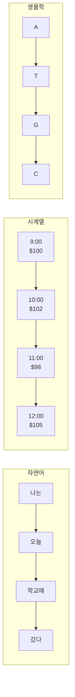
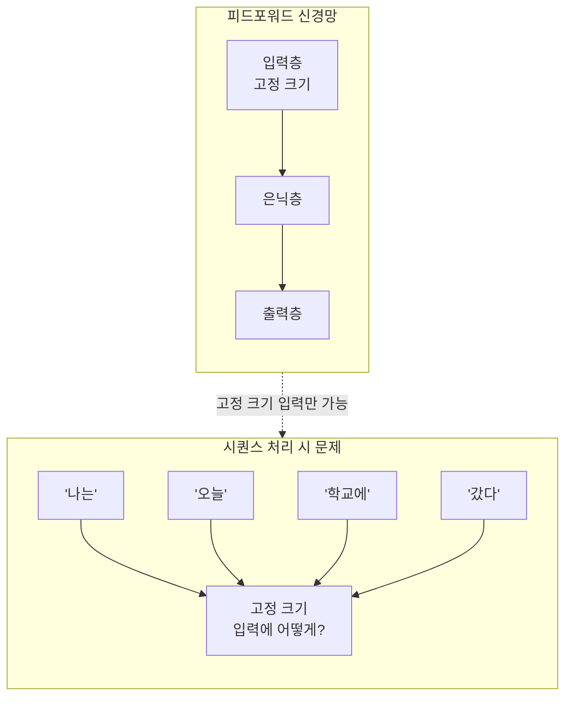
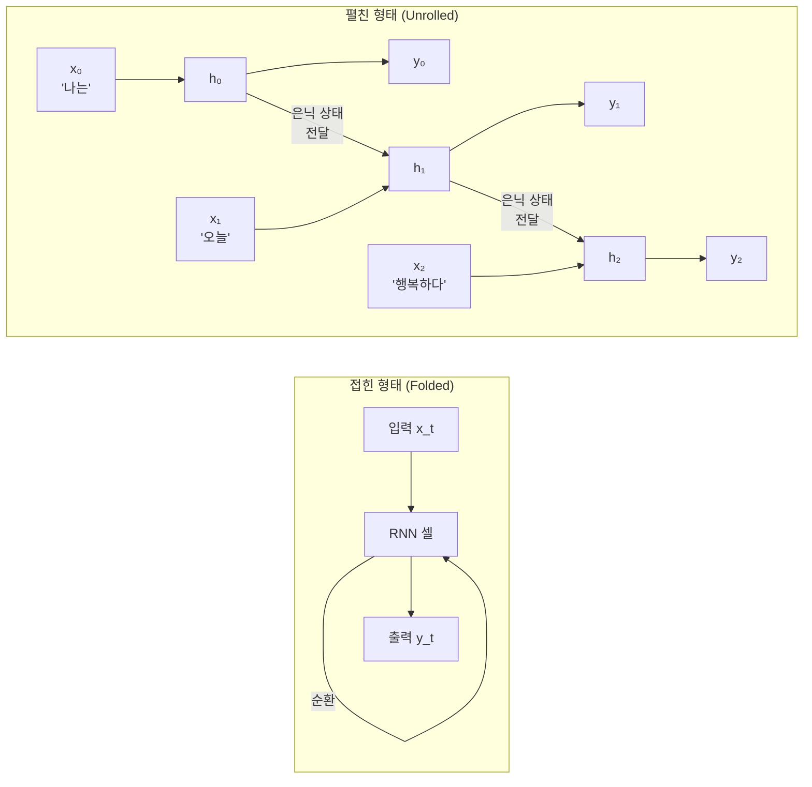
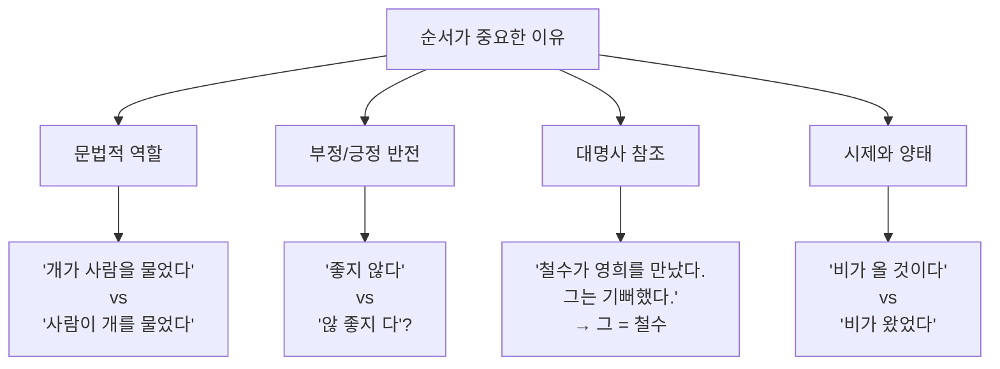
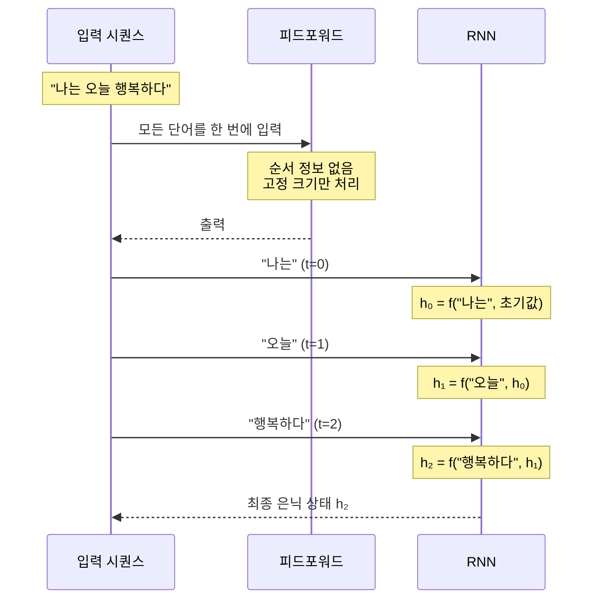

# 시퀀스 데이터와 RNN의 필요성

> 시간의 흐름 속에 숨겨진 패턴을 읽어내는 신경망, RNN의 등장 배경과 핵심 아이디어를 이해합니다.

## 개요

이 섹션에서는 왜 기존의 피드포워드 신경망만으로는 자연어와 같은 시퀀스 데이터를 제대로 처리할 수 없는지 살펴보고, 이 문제를 해결하기 위해 등장한 순환 신경망(RNN)의 핵심 아이디어를 소개합니다.

**선수 지식**: [Ch7. PyTorch 기초와 신경망 입문](07-ch7-pytorch-기초와-신경망-입문/03-03-nnmodule로-신경망-정의하기.md)에서 배운 `nn.Module`, 순전파, 은닉층의 개념
**학습 목표**:
- 시퀀스 데이터의 특성과 자연어에서 순서가 왜 중요한지 설명할 수 있다
- 피드포워드 신경망이 시퀀스 데이터를 처리할 때 어떤 한계를 갖는지 이해한다
- RNN의 핵심 아이디어(순환 구조, 은닉 상태)를 직관적으로 설명할 수 있다

## 왜 알아야 할까?

"나는 너를 사랑한다"와 "너는 나를 사랑한다" — 같은 단어들이지만 주어와 목적어가 바뀌면 완전히 다른 의미가 됩니다. 자연어는 본질적으로 **순서가 중요한 데이터**입니다. 앞서 [Ch5](05-ch5-워드-임베딩-word2vec/01-01-분포-가설과-밀집-벡터-표현.md)와 [Ch6](06-ch6-워드-임베딩-심화-glove와-fasttext/01-01-glove-전역-벡터-표현.md)에서 배운 워드 임베딩은 단어를 훌륭한 벡터로 표현해 주지만, 문장 전체의 흐름을 기억하면서 처리하는 것은 별개의 문제죠.

이번 챕터의 주인공인 **순환 신경망(RNN)**은 바로 이 "순서"를 이해하기 위해 태어난 모델입니다. RNN을 이해하면 이후의 LSTM, GRU, 그리고 트랜스포머까지 이어지는 시퀀스 모델링의 전체 흐름을 꿰뚫을 수 있습니다.

## 핵심 개념

### 개념 1: 시퀀스 데이터란 무엇인가

> 💡 **비유**: 시퀀스 데이터는 **동영상**과 같습니다. 사진 한 장만 보면 줄거리를 알 수 없지만, 프레임을 순서대로 보면 이야기가 보이죠. 자연어도 마찬가지로, 단어 하나하나는 사진이고 문장은 동영상입니다.

**시퀀스 데이터(Sequential Data)**는 요소들 사이에 **순서 관계**가 있는 데이터입니다. 순서를 바꾸면 의미가 달라지거나 아예 의미를 잃게 되죠.

> 📊 **그림 1**: 다양한 시퀀스 데이터의 예시



시퀀스 데이터의 핵심 특성은 세 가지입니다:

| 특성 | 설명 | 예시 |
|------|------|------|
| **순서 의존성** | 요소의 위치가 의미를 결정 | "개가 사람을 물었다" ≠ "사람이 개를 물었다" |
| **가변 길이** | 입력의 길이가 일정하지 않음 | 문장마다 단어 수가 다름 |
| **문맥 의존성** | 이전 요소가 현재 요소의 해석에 영향 | "사과"가 과일인지 사과(謝過)인지는 맥락에 따라 다름 |

```run:python
# 순서가 의미를 바꾸는 예시
sentence_1 = ["나는", "너를", "사랑한다"]
sentence_2 = ["너는", "나를", "사랑한다"]

print(f"문장 1: {' '.join(sentence_1)}")
print(f"문장 2: {' '.join(sentence_2)}")
print(f"같은 단어 집합? {set(sentence_1) == set(sentence_2)}")
print(f"같은 의미?     아닙니다! 순서가 다르면 의미도 다릅니다.")
```

```output
문장 1: 나는 너를 사랑한다
문장 2: 너는 나를 사랑한다
같은 단어 집합? True
같은 의미?     아닙니다! 순서가 다르면 의미도 다릅니다.
```

### 개념 2: 피드포워드 신경망의 한계

> 💡 **비유**: 피드포워드 신경망은 **건망증이 심한 채점관**과 같습니다. 시험 답안지의 각 문제를 독립적으로 채점하지만, 앞에서 어떤 답을 했는지 전혀 기억하지 못합니다. 서술형 시험처럼 앞뒤 맥락이 중요한 문제에는 적합하지 않죠.

[Ch7](07-ch7-pytorch-기초와-신경망-입문/03-03-nnmodule로-신경망-정의하기.md)에서 배운 피드포워드 신경망(Feedforward Neural Network)은 입력이 한 방향으로만 흘러갑니다. 입력 → 은닉층 → 출력으로 한 번 지나가면 끝이거든요.

> 📊 **그림 2**: 피드포워드 신경망 vs. 시퀀스 처리의 문제



피드포워드 신경망으로 시퀀스를 처리하려면 어떻게 해야 할까요?

**방법 1: 모든 단어를 하나의 벡터로 합치기** — [BoW](03-ch3-텍스트-표현-bow와-tf-idf/01-01-bag-of-words-모델.md)처럼 순서 정보가 사라집니다.

**방법 2: 고정 길이 윈도우** — "최근 5개 단어만 보자"처럼 윈도우를 설정하면, 윈도우 밖의 문맥은 무시됩니다.

**방법 3: 아주 큰 입력 벡터** — 최대 길이만큼의 거대한 벡터를 만들면 파라미터가 폭발적으로 늘어나고, 짧은 문장에는 무의미한 패딩이 가득합니다.

```run:python
import torch
import torch.nn as nn

# 피드포워드로 시퀀스를 처리하는 "어설픈" 방법
max_len = 10       # 최대 10개 단어
embed_dim = 8      # 단어당 8차원 임베딩

# 모든 단어 벡터를 이어붙여 하나의 고정 크기 입력으로 만듦
ffn_input_size = max_len * embed_dim  # 10 * 8 = 80

model = nn.Sequential(
    nn.Linear(ffn_input_size, 32),  # 80차원 → 32차원
    nn.ReLU(),
    nn.Linear(32, 2)                # 긍정/부정 분류
)

print(f"입력 크기: {ffn_input_size}")
print(f"총 파라미터 수: {sum(p.numel() for p in model.parameters()):,}")
print(f"문제점: 순서 정보 손실, 고정 길이 제약, 파라미터 낭비")
```

```output
입력 크기: 80
총 파라미터 수: 2,658
문제점: 순서 정보 손실, 고정 길이 제약, 파라미터 낭비
```

실제로는 문장 길이가 수십~수백 단어이고 임베딩 차원도 300 이상이니, 입력 벡터 크기가 수만 차원에 달하게 됩니다. 이건 현실적이지 않죠.

### 개념 3: RNN의 핵심 아이디어 — 기억하는 신경망

> 💡 **비유**: RNN은 **메모장을 들고 다니는 통역사**입니다. 상대방이 말할 때마다 메모장(은닉 상태)에 핵심 내용을 적어두고, 다음 말을 들을 때 메모장을 참고하며 해석합니다. 대화가 이어질수록 메모장에는 지금까지의 맥락이 축적되죠.

RNN의 핵심 아이디어는 놀랍도록 단순합니다: **이전 단계의 출력을 다음 단계의 입력으로 다시 넣는 것**입니다. 이 "순환(recurrent)" 연결 덕분에 네트워크는 **은닉 상태(hidden state)**라는 일종의 기억을 유지할 수 있게 됩니다.

> 📊 **그림 3**: RNN의 순환 구조 — 접힌 형태와 펼친 형태



수식으로 표현하면 이렇습니다:

$$h_t = \tanh(W_{xh} \cdot x_t + W_{hh} \cdot h_{t-1} + b_h)$$

- $x_t$: 시간 $t$에서의 입력 (현재 단어의 임베딩)
- $h_{t-1}$: 이전 시간 단계의 은닉 상태 (지금까지의 기억)
- $W_{xh}$: 입력→은닉 가중치
- $W_{hh}$: 은닉→은닉 가중치 (순환 가중치)
- $h_t$: 새로 갱신된 은닉 상태 (기존 기억 + 현재 입력)

이게 의미하는 바는, **같은 가중치를 매 시간 단계마다 재사용**한다는 점입니다. 문장이 3단어든 100단어든 파라미터 수는 동일합니다. 이것이 피드포워드 신경망의 "고정 크기" 문제를 깔끔하게 해결하죠.

### 개념 4: 자연어에서 순서 정보의 중요성

자연어 처리에서 순서가 왜 그토록 중요한지, 구체적인 사례들을 살펴봅시다.

> 📊 **그림 4**: 순서가 의미를 결정하는 자연어의 사례들



```run:python
# 순서에 따라 감성이 완전히 바뀌는 예시
examples = [
    ("이 영화는 정말 좋지 않다", "부정"),
    ("이 영화는 정말 좋다",     "긍정"),
    ("별로인 줄 알았는데 의외로 좋았다", "긍정 (반전)"),
]

print("=== 순서가 감성을 결정하는 사례 ===")
for text, sentiment in examples:
    print(f"  [{sentiment:>10}] {text}")
print()
print("BoW는 '좋지 않다'에서 '좋'과 '않'을 독립적으로 봐서")
print("긍정과 부정 신호가 상쇄됩니다. RNN은 순서를 보고 판단하죠.")
```

```output
=== 순서가 감성을 결정하는 사례 ===
  [      부정] 이 영화는 정말 좋지 않다
  [      긍정] 이 영화는 정말 좋다
  [ 긍정 (반전)] 별로인 줄 알았는데 의외로 좋았다

BoW는 '좋지 않다'에서 '좋'과 '않'을 독립적으로 봐서
긍정과 부정 신호가 상쇄됩니다. RNN은 순서를 보고 판단하죠.
```

### 개념 5: RNN vs. 피드포워드 — 구조 비교

이제 피드포워드 신경망과 RNN의 차이를 명확히 정리해 봅시다.

> 📊 **그림 5**: 피드포워드 vs. RNN 처리 방식 비교



| 특성 | 피드포워드 신경망 | RNN |
|------|----------------|-----|
| **입력 크기** | 고정 | 가변 길이 가능 |
| **메모리** | 없음 | 은닉 상태로 유지 |
| **파라미터 공유** | 층별 독립 | 시간 단계 간 공유 |
| **순서 정보** | 무시 | 보존 |
| **적합한 데이터** | 이미지, 표 형태 데이터 | 텍스트, 시계열, 음성 |

## 실습: 직접 해보기

PyTorch의 `nn.RNN`을 사용하여 간단한 시퀀스 처리를 체험해 봅시다. 아직 학습은 하지 않고, RNN이 시퀀스를 어떻게 처리하는지 **구조적으로** 이해하는 것이 목표입니다.

```python
import torch
import torch.nn as nn

# 시드 고정 — 결과 재현을 위해
torch.manual_seed(42)

# === 1단계: 간단한 단어 임베딩 준비 ===
# 4개 단어의 사전
vocab = {"나는": 0, "오늘": 1, "매우": 2, "행복하다": 3}
vocab_size = len(vocab)
embed_dim = 6       # 임베딩 차원
hidden_size = 8     # 은닉 상태 차원

# nn.Embedding: 단어 인덱스를 밀집 벡터로 변환하는 룩업 테이블입니다.
# Ch5에서 배운 Word2Vec, GloVe 같은 워드 임베딩의 개념을 PyTorch 레이어로 구현한 것이죠.
# 내부적으로 (vocab_size × embed_dim) 크기의 가중치 행렬을 갖고 있어서,
# 정수 인덱스를 넣으면 해당 행(row)을 꺼내 반환합니다.
embedding = nn.Embedding(vocab_size, embed_dim)

# 문장을 인덱스로 변환
sentence = ["나는", "오늘", "매우", "행복하다"]
indices = torch.tensor([vocab[w] for w in sentence])
print(f"단어 인덱스: {indices}")

# 임베딩 벡터 생성 (4단어, 각 6차원)
# 각 정수 인덱스가 embed_dim 차원의 밀집 벡터로 변환됩니다
embedded = embedding(indices)
print(f"임베딩 shape: {embedded.shape}")  # (4, 6)
```

```python
# === 2단계: RNN 생성 및 순전파 ===
# PyTorch RNN: input_size=6, hidden_size=8, 1층
rnn = nn.RNN(input_size=embed_dim, hidden_size=hidden_size, batch_first=True)

# RNN 입력은 (batch_size, seq_len, input_size) 형태
# 배치 차원 추가: (1, 4, 6)
rnn_input = embedded.unsqueeze(0)
print(f"RNN 입력 shape: {rnn_input.shape}")

# 초기 은닉 상태: (num_layers, batch_size, hidden_size)
h0 = torch.zeros(1, 1, hidden_size)

# 순전파
output, h_final = rnn(rnn_input, h0)
print(f"RNN 출력 shape: {output.shape}")       # (1, 4, 8) — 모든 시간 단계의 은닉 상태
print(f"최종 은닉 상태 shape: {h_final.shape}") # (1, 1, 8) — 마지막 시간 단계만
```

```python
# === 3단계: 각 시간 단계의 은닉 상태 관찰 ===
print("\n=== 시간 단계별 은닉 상태 ===")
for t, word in enumerate(sentence):
    h_t = output[0, t, :]  # t번째 시간 단계의 은닉 상태
    print(f"t={t} '{word:6s}' → h_t 평균={h_t.mean():.4f}, 표준편차={h_t.std():.4f}")

# 마지막 출력과 h_final이 동일한지 확인
print(f"\n마지막 output == h_final: {torch.allclose(output[0, -1, :], h_final[0, 0, :])}")
print("→ output의 마지막 시간 단계 = h_final (동일합니다!)")
```

```python
# === 4단계: 같은 단어, 다른 순서 — 다른 결과 ===
# "행복하다 매우 오늘 나는" — 역순
reversed_indices = torch.tensor([vocab[w] for w in reversed(sentence)])
reversed_embedded = embedding(reversed_indices).unsqueeze(0)

_, h_reversed = rnn(reversed_embedded, h0)

# 두 결과 비교
print("\n=== 순서에 따른 최종 은닉 상태 비교 ===")
print(f"정순서 h_final: {h_final[0, 0, :4].detach().numpy().round(3)}")
print(f"역순서 h_final: {h_reversed[0, 0, :4].detach().numpy().round(3)}")
print(f"동일한가? {torch.allclose(h_final, h_reversed)}")
print("→ 같은 단어도 순서가 다르면 RNN의 결과가 달라집니다!")
```

> 🔥 **실무 팁**: `batch_first=True`를 설정하면 텐서 shape이 `(batch, seq_len, features)`가 되어 직관적입니다. 설정하지 않으면 `(seq_len, batch, features)` 순서가 기본값이니 주의하세요.

## 더 깊이 알아보기

### RNN의 탄생 — "시간 속에서 구조를 찾다"

RNN의 역사는 신경과학에서 시작됩니다. 1901년 스페인의 신경해부학자 **산티아고 라몬 이 카할(Santiago Ramón y Cajal)**이 소뇌 피질에서 "순환하는 반원(recurrent semicircles)" 구조를 관찰했죠. 신경세포들이 일방통행이 아니라 되돌아오는 연결을 가진다는 발견이었습니다.

이 생물학적 영감이 인공 신경망으로 옮겨온 것은 1986년 **마이클 조던(Michael I. Jordan)**의 연구와 1990년 **제프 엘만(Jeffrey L. Elman)**의 논문 *"Finding Structure in Time"*을 통해서였습니다. 엘만은 인지심리학자였는데, 그가 고민한 질문은 이것이었습니다: "인간은 어떻게 '시간' 속에서 패턴을 찾아내는가?"

엘만의 해결책은 우아했습니다. 은닉층의 출력을 "컨텍스트 유닛(context unit)"이라는 별도의 저장소에 복사해 두었다가, 다음 입력을 처리할 때 함께 넣어주는 것이었죠. 이것이 바로 **엘만 네트워크(Elman Network)**, 현대 RNN의 직접적인 조상입니다.

놀라운 것은, 엘만이 이 단순한 구조로 언어의 문법 구조를 네트워크가 스스로 발견한다는 것을 보여줬다는 점입니다. 주어-동사 일치, 재귀 구조 같은 문법 패턴을 명시적으로 가르치지 않았는데도 네트워크가 학습해 냈거든요.

> 💡 **알고 계셨나요?**: 제프 엘만은 컴퓨터 과학자가 아니라 **인지과학자**였습니다. 그는 "기계가 언어를 이해할 수 있을까?"가 아니라 "인간의 뇌가 시간 속 패턴을 어떻게 학습하는가?"를 연구하다가 RNN을 만들었죠. 이처럼 딥러닝의 많은 돌파구는 순수 공학이 아닌 인지과학, 신경과학과의 교차점에서 나왔습니다.

## 흔한 오해와 팁

> ⚠️ **흔한 오해**: "RNN은 과거 정보를 영원히 기억한다" — 이론적으로는 맞지만 실제로는 그렇지 않습니다. 은닉 상태가 매 단계마다 `tanh`를 거치면서 정보가 점점 희석되거든요. 긴 시퀀스에서 초반 정보가 사라지는 **기울기 소실(vanishing gradient)** 문제가 있으며, 이것이 바로 [LSTM과 GRU](09-ch9-lstm과-gru/01-01-lstm-장단기-메모리-네트워크.md)가 등장한 이유입니다.

> 💡 **알고 계셨나요?**: RNN의 "recurrent"라는 단어는 라틴어 *recurrere*(되돌아 달리다)에서 왔습니다. 신경과학에서 신경 회로가 되돌아오는 구조를 설명할 때 쓰던 용어를 그대로 차용한 것이죠.

> 🔥 **실무 팁**: 실제 프로젝트에서 vanilla RNN을 직접 쓸 일은 거의 없습니다. 대부분 LSTM이나 GRU를 사용하죠. 하지만 RNN의 기본 원리를 정확히 이해해야 LSTM의 게이트 구조가 **왜** 필요한지, 트랜스포머가 **무엇을** 대체한 것인지 알 수 있습니다. 기초가 탄탄해야 응용이 자유롭습니다.

## 핵심 정리

| 개념 | 설명 |
|------|------|
| 시퀀스 데이터 | 요소 간 순서 관계가 의미를 결정하는 데이터 (텍스트, 시계열, 음성) |
| 피드포워드의 한계 | 고정 크기 입력, 순서 정보 무시, 기억 없음 |
| RNN 핵심 아이디어 | 이전 은닉 상태를 다음 단계에 전달하여 순서 정보를 보존 |
| 은닉 상태 (h_t) | 현재 입력 + 이전 기억을 결합한 벡터. RNN의 "메모리" 역할 |
| 파라미터 공유 | 모든 시간 단계에서 동일한 가중치 사용 → 가변 길이 처리 가능 |
| nn.Embedding | 단어 인덱스를 밀집 벡터로 변환하는 룩업 테이블. Ch5의 워드 임베딩을 PyTorch 레이어로 구현 |
| 엘만 네트워크 | 1990년 Jeff Elman이 제안한 현대 RNN의 기본 형태 |

## 다음 섹션 미리보기

RNN의 필요성과 핵심 아이디어를 이해했으니, 다음 섹션 [02. RNN의 구조와 순전파](08-ch8-순환-신경망rnn-기초/02-02-rnn의-구조와-순전파.md)에서는 RNN 내부의 수학적 구조를 본격적으로 파헤칩니다. $W_{xh}$, $W_{hh}$, $W_{hy}$ 가중치 행렬이 어떻게 작동하는지, 은닉 상태가 시간에 따라 어떻게 갱신되는지를 수식과 코드로 함께 살펴보겠습니다.

## 참고 자료

- [NLP From Scratch: Classifying Names with a Character-Level RNN — PyTorch 공식 튜토리얼](https://docs.pytorch.org/tutorials/intermediate/char_rnn_classification_tutorial.html) - RNN으로 이름의 국적을 분류하는 실습. 이번 챕터의 최종 프로젝트와 직결됩니다
- [Stanford CS 224N: Natural Language Processing with Deep Learning](https://web.stanford.edu/class/cs224n/) - RNN과 시퀀스 모델링의 이론적 기초를 강의와 슬라이드로 배울 수 있는 최고의 대학 강좌
- [PyTorch nn.RNN 공식 문서](https://docs.pytorch.org/docs/stable/generated/torch.nn.RNN.html) - `nn.RNN` 모듈의 파라미터, 입출력 형태, 수식이 정리된 공식 레퍼런스
- [PyTorch nn.Embedding 공식 문서](https://docs.pytorch.org/docs/stable/generated/torch.nn.Embedding.html) - `nn.Embedding`의 동작 원리와 사전 학습된 임베딩 로드 방법이 정리된 레퍼런스
- [Finding Structure in Time (Elman, 1990)](https://onlinelibrary.wiley.com/doi/abs/10.1207/s15516709cog1402_1) - 현대 RNN의 기원이 된 논문. 인지과학적 관점에서 시퀀스 학습을 다룹니다
- [The Recurrent Neural Network — Theory and Implementation](https://pabloinsente.github.io/the-recurrent-net) - RNN의 역사부터 구현까지를 깊이 있게 다룬 가이드

---
### 🔗 Related Sessions
- [nn.module](07-ch7-pytorch-기초와-신경망-입문/03-03-nnmodule로-신경망-정의하기.md) (prerequisite)


---
### 🔗 Related Sessions
- [nn.module](07-ch7-pytorch-기초와-신경망-입문/03-03-nnmodule로-신경망-정의하기.md) (prerequisite)


---
### 🔗 Related Sessions
- [nn.module](07-ch7-pytorch-기초와-신경망-입문/03-03-nnmodule로-신경망-정의하기.md) (prerequisite)


---
### 🔗 Related Sessions
- [nn.module](07-ch7-pytorch-기초와-신경망-입문/03-03-nnmodule로-신경망-정의하기.md) (prerequisite)


---
### 🔗 Related Sessions
- [nn.module](07-ch7-pytorch-기초와-신경망-입문/03-03-nnmodule로-신경망-정의하기.md) (prerequisite)
