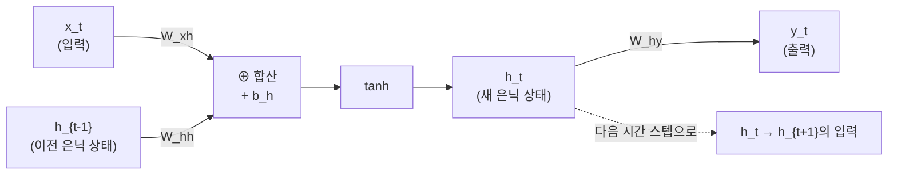
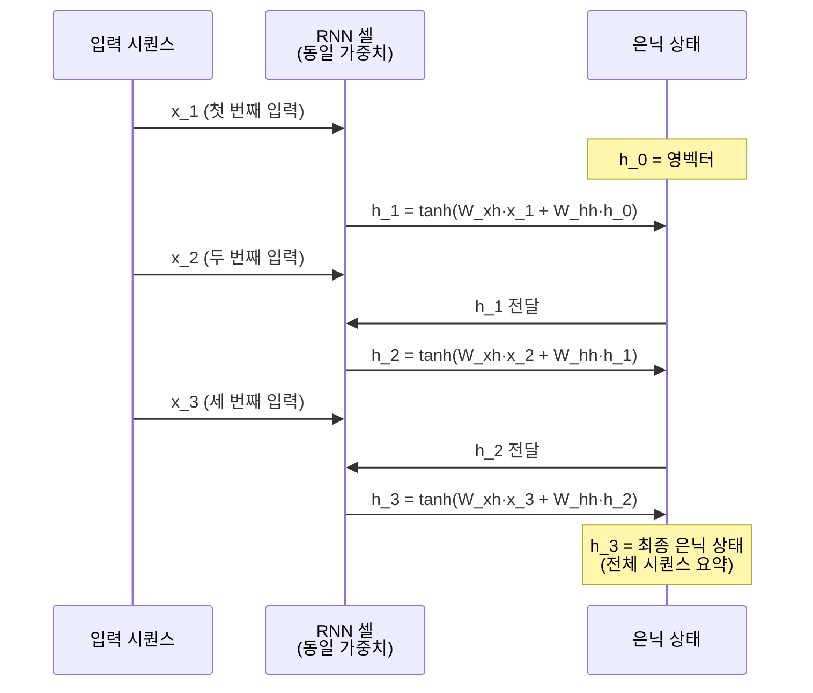
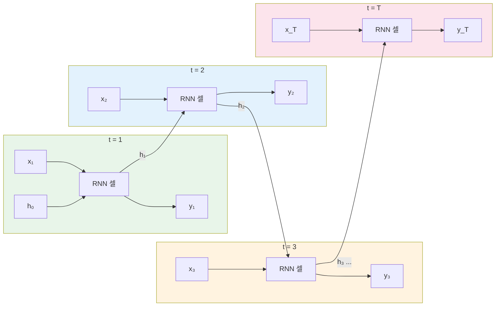
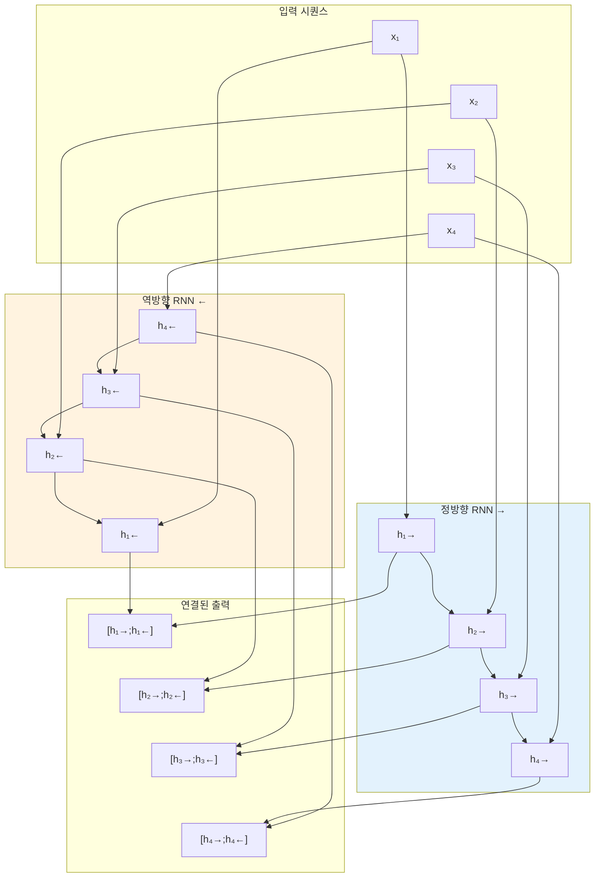

# RNN의 구조와 순전파

> RNN 셀 내부의 가중치 행렬과 은닉 상태 갱신 공식을 이해하고, 시간 축 전개와 파라미터 공유의 의미를 파악한다.

## 개요

이 섹션에서는 RNN의 내부 구조를 수학적으로 분석합니다. [이전 섹션](08-ch8-순환-신경망rnn-기초/01-01-시퀀스-데이터와-rnn의-필요성.md)에서 "RNN은 은닉 상태를 순환적으로 갱신한다"는 직관을 배웠다면, 이번에는 그 갱신이 **어떤 행렬 연산**으로 이루어지는지, **시간 축으로 펼치면** 어떤 모습인지, 그리고 **양방향 RNN**이 왜 필요한지까지 살펴봅니다.

**선수 지식**: RNN의 순환 구조 개념, PyTorch 텐서 연산과 `nn.Module` 기초([Ch7](07-ch7-pytorch-기초와-신경망-입문/03-03-nnmodule로-신경망-정의하기.md))

**학습 목표**:
- $W_{xh}$, $W_{hh}$, $W_{hy}$ 세 가지 가중치 행렬의 역할을 설명할 수 있다
- RNN 셀의 순전파 공식을 직접 코드로 구현할 수 있다
- 시간 축 전개(unrolling)가 역전파 학습에 왜 중요한지 이해할 수 있다
- 양방향 RNN의 구조와 장점을 설명할 수 있다

## 왜 알아야 할까?

RNN의 은닉 상태가 "기억"을 담당한다는 사실은 알았지만, 그 기억이 **어떻게 만들어지는지**를 모르면 모델이 왜 잘 되는지, 또 왜 실패하는지를 이해할 수 없습니다. 가중치 행렬의 역할을 알아야 다음 섹션에서 다룰 BPTT(시간 역전파)와 기울기 문제를 제대로 이해할 수 있고, 나아가 LSTM과 GRU 같은 개선된 구조가 **무엇을** 개선한 것인지도 명확해집니다.

실무에서도 RNN의 `input_size`, `hidden_size` 같은 하이퍼파라미터를 조정하려면 내부 행렬 연산의 차원 관계를 정확히 알아야 하죠. "블랙박스"에서 벗어나 RNN의 속을 열어보는 시간입니다.

## 핵심 개념

### 개념 1: RNN 셀의 내부 구조 — 세 개의 가중치 행렬

> 💡 **비유**: RNN 셀을 **번역가**라고 생각해보세요. 번역가에게는 세 가지 능력이 필요합니다. (1) **새로운 문장을 읽는 능력** ($W_{xh}$) — 현재 입력을 이해합니다. (2) **이전 맥락을 기억하는 능력** ($W_{hh}$) — 지금까지 읽은 내용의 핵심을 유지합니다. (3) **번역문을 쓰는 능력** ($W_{hy}$) — 기억과 입력을 종합해 출력을 만듭니다. 세 능력이 협력해야 좋은 번역이 나오듯, 세 가중치 행렬이 함께 작동해야 RNN이 시퀀스를 처리합니다.

RNN 셀 하나의 순전파는 다음 두 단계로 이루어집니다:

**1단계 — 은닉 상태 갱신:**

$$h_t = \tanh(W_{xh} \cdot x_t + W_{hh} \cdot h_{t-1} + b_h)$$

**2단계 — 출력 계산:**

$$y_t = W_{hy} \cdot h_t + b_y$$

각 기호의 의미:
| 기호 | 차원 | 의미 |
|------|------|------|
| $x_t$ | $(d,)$ | 시간 $t$의 입력 벡터 (입력 차원 $d$) |
| $h_t$ | $(h,)$ | 시간 $t$의 은닉 상태 (은닉 차원 $h$) |
| $W_{xh}$ | $(h, d)$ | 입력→은닉 가중치 행렬 |
| $W_{hh}$ | $(h, h)$ | 은닉→은닉 가중치 행렬 |
| $W_{hy}$ | $(o, h)$ | 은닉→출력 가중치 행렬 |
| $b_h, b_y$ | $(h,), (o,)$ | 편향 벡터 |

이게 의미하는 바는 이렇습니다: $W_{xh} \cdot x_t$는 "현재 입력이 뭐라고 말하는가", $W_{hh} \cdot h_{t-1}$은 "지금까지의 맥락이 뭐라고 말하는가"인데, 이 둘을 더한 뒤 $\tanh$로 $[-1, 1]$ 범위로 눌러서 새로운 기억 $h_t$를 만드는 겁니다.

> 📊 **그림 1**: RNN 셀 내부의 가중치 행렬과 데이터 흐름



PyTorch 공식 문서에서는 이 공식을 다음과 같이 표기합니다:

$$h_t = \tanh(x_t W_{ih}^T + b_{ih} + h_{t-1} W_{hh}^T + b_{hh})$$

PyTorch는 `weight_ih`(입력→은닉)와 `weight_hh`(은닉→은닉) 두 개의 가중치와 각각의 편향을 따로 관리합니다. 비선형 함수는 기본값이 `tanh`이고, `relu`로 바꿀 수도 있습니다.

### 개념 2: RNN 셀을 직접 코드로 구현하기

> 💡 **비유**: `nn.RNN`이 **자동차 완성품**이라면, 지금 우리가 할 일은 **엔진을 직접 조립**해보는 것입니다. 완성품만 타고 다니면 고장 났을 때 어디가 문제인지 모르거든요.

PyTorch의 `nn.RNN`을 쓰기 전에, 수식을 그대로 코드로 옮겨봅시다:

```python
import torch
import torch.nn as nn

class ManualRNNCell(nn.Module):
    """RNN 셀을 수식 그대로 구현"""
    def __init__(self, input_size, hidden_size):
        super().__init__()
        # 세 가지 핵심 가중치 행렬
        self.W_xh = nn.Linear(input_size, hidden_size)   # 입력 → 은닉
        self.W_hh = nn.Linear(hidden_size, hidden_size)  # 은닉 → 은닉
        self.tanh = nn.Tanh()
    
    def forward(self, x_t, h_prev):
        # h_t = tanh(W_xh * x_t + W_hh * h_{t-1})
        h_t = self.tanh(self.W_xh(x_t) + self.W_hh(h_prev))
        return h_t
```

이제 이 셀을 시퀀스 전체에 걸쳐 반복 적용하는 모듈을 만들어봅시다:

```run:python
import torch
import torch.nn as nn

class ManualRNN(nn.Module):
    """시퀀스 전체를 처리하는 수동 RNN"""
    def __init__(self, input_size, hidden_size):
        super().__init__()
        self.hidden_size = hidden_size
        self.W_xh = nn.Linear(input_size, hidden_size)
        self.W_hh = nn.Linear(hidden_size, hidden_size)
        self.tanh = nn.Tanh()
    
    def forward(self, x, h_0=None):
        # x shape: (batch_size, seq_len, input_size)
        batch_size, seq_len, _ = x.size()
        
        # 초기 은닉 상태가 없으면 0으로 시작
        if h_0 is None:
            h_0 = torch.zeros(batch_size, self.hidden_size)
        
        h_t = h_0
        outputs = []
        
        # 시퀀스를 한 타임스텝씩 처리
        for t in range(seq_len):
            x_t = x[:, t, :]  # t번째 입력 추출
            h_t = self.tanh(self.W_xh(x_t) + self.W_hh(h_t))
            outputs.append(h_t)
        
        # 모든 시간 스텝의 은닉 상태를 쌓아서 반환
        outputs = torch.stack(outputs, dim=1)
        return outputs, h_t

# 테스트: 배치 2, 시퀀스 길이 5, 입력 차원 3, 은닉 차원 4
torch.manual_seed(42)
rnn = ManualRNN(input_size=3, hidden_size=4)
x = torch.randn(2, 5, 3)  # (batch=2, seq_len=5, input=3)

outputs, h_final = rnn(x)
print(f"입력 shape:       {x.shape}")
print(f"전체 출력 shape:  {outputs.shape}")
print(f"최종 은닉 shape:  {h_final.shape}")
print(f"최종 은닉 상태:\n{h_final}")
```

```output
입력 shape:       torch.Size([2, 5, 3])
전체 출력 shape:  torch.Size([2, 5, 4])
최종 은닉 shape:  torch.Size([2, 4])
최종 은닉 상태:
tensor([[ 0.5044,  0.7476, -0.6864, -0.1882],
        [-0.3677,  0.6906, -0.6420,  0.1762]], grad_fn=<TanhBackward0>)
```

`for t in range(seq_len)` 루프가 핵심입니다. 매 시간 스텝마다 같은 가중치($W_{xh}$, $W_{hh}$)를 **재사용**하면서 은닉 상태만 갱신하죠. 이것이 바로 **파라미터 공유**입니다.

> 📊 **그림 2**: 시퀀스 처리 시 RNN의 반복 구조



### 개념 3: 시간 축 전개(Unrolling) — RNN을 펼쳐서 보기

> 💡 **비유**: 순환 구조의 RNN은 마치 **나선형 계단**과 같습니다. 위에서 보면 같은 자리를 빙빙 도는 것 같지만, 옆에서 보면 한 층 한 층 위로 올라가고 있죠. 시간 축 전개란 이 나선형 계단을 **옆에서 펼쳐보는 것**입니다. 각 층(타임스텝)이 같은 구조를 공유하지만, 시간의 흐름에 따라 정보가 어떻게 변하는지 한눈에 볼 수 있게 됩니다.

RNN의 순환 구조를 시간 축으로 펼치면, 매 타임스텝마다 **같은 가중치를 공유하는** 레이어가 연결된 깊은 신경망처럼 보입니다:

> 📊 **그림 3**: RNN의 시간 축 전개 (Unrolling)



시간 축 전개가 중요한 이유가 뭘까요? 바로 **역전파를 이해하기 위해서**입니다. 펼쳐진 모습은 사실상 깊은 피드포워드 네트워크와 같기 때문에, 역전파도 이 펼쳐진 구조를 따라 시간을 거슬러 올라갑니다. 이것이 다음 섹션에서 배울 BPTT(Backpropagation Through Time)의 핵심 아이디어입니다.

파라미터 공유의 장점을 정리하면:

| 측면 | 파라미터 공유 없이 | 파라미터 공유 |
|------|-------------------|-------------|
| 파라미터 수 | 시퀀스 길이 $T$에 비례 증가 | 시퀀스 길이와 **무관** (고정) |
| 가변 길이 | 입력 길이가 바뀌면 모델 재설계 | **어떤 길이든** 동일 모델 사용 |
| 일반화 | 특정 위치에서만 학습된 패턴 | 위치에 **무관하게** 패턴 학습 |

### 개념 4: PyTorch `nn.RNN`과 수동 구현 비교

우리가 만든 `ManualRNN`과 PyTorch의 `nn.RNN`이 실제로 같은 결과를 내는지 확인해봅시다:

```run:python
import torch
import torch.nn as nn

torch.manual_seed(42)

# PyTorch 내장 RNN
pytorch_rnn = nn.RNN(
    input_size=3,      # 입력 벡터 차원
    hidden_size=4,     # 은닉 상태 차원
    num_layers=1,      # RNN 레이어 수
    batch_first=True,  # (batch, seq, feature) 순서 사용
    nonlinearity='tanh'  # 활성화 함수 (기본값)
)

# 가중치 확인
print("=== PyTorch nn.RNN 가중치 ===")
for name, param in pytorch_rnn.named_parameters():
    print(f"{name}: {param.shape}")

# 순전파
x = torch.randn(2, 5, 3)
h0 = torch.zeros(1, 2, 4)  # (num_layers, batch, hidden)

output, h_n = pytorch_rnn(x, h0)
print(f"\n출력 shape: {output.shape}")   # 모든 시간 스텝의 은닉 상태
print(f"최종 은닉 shape: {h_n.shape}")   # 마지막 은닉 상태
```

```output
=== PyTorch nn.RNN 가중치 ===
weight_ih_l0: torch.Size([4, 3])
weight_hh_l0: torch.Size([4, 4])
bias_ih_l0: torch.Size([4])
bias_hh_l0: torch.Size([4])

출력 shape: torch.Size([2, 5, 4])
최종 은닉 shape: torch.Size([1, 2, 4])
```

주목할 점은 PyTorch가 편향을 `bias_ih`와 `bias_hh`로 **두 개** 분리한다는 것입니다. 수학적으로는 하나로 합쳐도 동일하지만, 구현상의 편의를 위해 분리한 것이죠. 또한 `h0`의 shape이 `(num_layers, batch, hidden)`인 것도 기억하세요 — 다중 레이어 RNN을 지원하기 위한 설계입니다.

### 개념 5: 양방향 RNN — 미래도 참고하기

> 💡 **비유**: 빈칸 채우기 문제를 풀 때를 생각해보세요. "나는 ___를 마시며 아침을 시작한다"에서 빈칸을 채우려면 앞의 "나는"뿐 아니라 뒤의 "마시며 아침을 시작한다"도 봐야 "커피"라는 답을 추론할 수 있습니다. 양방향 RNN은 문장을 **앞에서도, 뒤에서도** 읽어서 양쪽 맥락을 모두 활용합니다.

양방향 RNN(Bidirectional RNN)은 두 개의 독립적인 RNN을 운영합니다:
- **정방향(Forward)**: $x_1 \rightarrow x_2 \rightarrow \cdots \rightarrow x_T$
- **역방향(Backward)**: $x_T \rightarrow x_{T-1} \rightarrow \cdots \rightarrow x_1$

각 시간 스텝의 최종 은닉 상태는 두 방향의 결과를 **연결(concatenate)**합니다:

$$h_t^{bi} = [\overrightarrow{h_t} ; \overleftarrow{h_t}]$$

따라서 은닉 차원이 $h$라면, 양방향 RNN의 출력 차원은 $2h$가 됩니다.

> 📊 **그림 4**: 양방향 RNN의 구조



PyTorch에서는 `bidirectional=True` 한 줄이면 됩니다:

```python
bi_rnn = nn.RNN(
    input_size=3,
    hidden_size=4,
    bidirectional=True,   # 양방향 활성화
    batch_first=True
)
# 출력 shape: (batch, seq_len, hidden_size * 2) → 차원이 2배!
```

> ⚠️ **흔한 오해**: 양방향 RNN은 "미래를 본다"고 하지만, 이것은 **전체 시퀀스가 주어진 경우**에만 가능합니다. 실시간 스트리밍이나 텍스트 생성처럼 미래 토큰이 아직 없는 상황에서는 양방향 RNN을 쓸 수 **없습니다**. 그래서 GPT 같은 생성 모델은 단방향이고, BERT 같은 이해 모델은 양방향인 것입니다. 이 "이해 vs 생성"이라는 설계 철학의 차이는 이후 [Ch16 BERT](16-ch16-bert와-사전-학습-혁명/01-01-사전-학습과-미세-조정-패러다임.md)(양방향)와 [Ch17 GPT](17-ch17-gpt-시리즈와-생성-모델의-진화/01-01-자기-회귀-언어-모델의-원리.md)(단방향)에서 핵심 설계 철학이 됩니다. 양방향 RNN에서 시작된 이 구분이 트랜스포머 시대까지 이어진다는 점을 기억해두세요.

## 실습: 직접 해보기

RNN 셀을 완전히 수동으로 구현하고, PyTorch 내장 `nn.RNN`과 결과를 비교하는 실습입니다. 가중치를 복사해서 두 구현이 **동일한 출력**을 만드는지 검증합니다.

```python
import torch
import torch.nn as nn

torch.manual_seed(42)

# ============================================
# 1. 수동 RNN 순전파 함수
# ============================================
def manual_rnn_forward(x, weight_ih, weight_hh, bias_ih, bias_hh, h0):
    """
    RNN 순전파를 행렬 연산으로 직접 구현
    
    Args:
        x: (batch, seq_len, input_size) 입력 텐서
        weight_ih: (hidden_size, input_size) 입력→은닉 가중치
        weight_hh: (hidden_size, hidden_size) 은닉→은닉 가중치
        bias_ih: (hidden_size,) 입력 편향
        bias_hh: (hidden_size,) 은닉 편향
        h0: (batch, hidden_size) 초기 은닉 상태
    """
    batch_size, seq_len, _ = x.shape
    hidden_size = weight_hh.shape[0]
    
    h_t = h0
    outputs = []
    
    for t in range(seq_len):
        x_t = x[:, t, :]  # (batch, input_size)
        
        # h_t = tanh(x_t @ W_ih^T + b_ih + h_{t-1} @ W_hh^T + b_hh)
        h_t = torch.tanh(
            x_t @ weight_ih.T + bias_ih +   # 입력 기여
            h_t @ weight_hh.T + bias_hh      # 이전 은닉 상태 기여
        )
        outputs.append(h_t.unsqueeze(1))  # 시간 차원 추가
    
    outputs = torch.cat(outputs, dim=1)  # (batch, seq_len, hidden)
    return outputs, h_t

# ============================================
# 2. PyTorch nn.RNN 생성
# ============================================
input_size = 10
hidden_size = 20
seq_len = 7
batch_size = 3

rnn = nn.RNN(input_size, hidden_size, batch_first=True)
x = torch.randn(batch_size, seq_len, input_size)
h0 = torch.zeros(1, batch_size, hidden_size)

# ============================================
# 3. PyTorch 결과
# ============================================
output_pt, hn_pt = rnn(x, h0)

# ============================================
# 4. 수동 구현 — 같은 가중치 복사
# ============================================
output_manual, hn_manual = manual_rnn_forward(
    x,
    weight_ih=rnn.weight_ih_l0.data,
    weight_hh=rnn.weight_hh_l0.data,
    bias_ih=rnn.bias_ih_l0.data,
    bias_hh=rnn.bias_hh_l0.data,
    h0=h0.squeeze(0)  # (1, batch, hidden) → (batch, hidden)
)

# ============================================
# 5. 결과 비교
# ============================================
diff = (output_pt - output_manual).abs().max().item()
print(f"출력 최대 차이: {diff:.2e}")
print(f"결과 일치: {diff < 1e-6}")
print(f"\nPyTorch 출력 shape: {output_pt.shape}")
print(f"수동 구현 출력 shape: {output_manual.shape}")
```

이 코드를 실행하면 `출력 최대 차이: 0.00e+00` (또는 매우 작은 부동소수점 오차)이 나옵니다. 우리의 수동 구현이 PyTorch의 `nn.RNN`과 **수학적으로 동일**하다는 증거입니다.

다음으로, 양방향 RNN의 출력 차원 변화를 확인합니다:

```run:python
import torch
import torch.nn as nn

# 단방향 vs 양방향 비교
uni_rnn = nn.RNN(input_size=10, hidden_size=20, batch_first=True, bidirectional=False)
bi_rnn = nn.RNN(input_size=10, hidden_size=20, batch_first=True, bidirectional=True)

x = torch.randn(3, 7, 10)  # (batch=3, seq=7, input=10)

out_uni, h_uni = uni_rnn(x)
out_bi, h_bi = bi_rnn(x)

print("=== 단방향 RNN ===")
print(f"  출력: {out_uni.shape}")       # (3, 7, 20)
print(f"  은닉: {h_uni.shape}")         # (1, 3, 20)

print("\n=== 양방향 RNN ===")
print(f"  출력: {out_bi.shape}")        # (3, 7, 40) ← 2배!
print(f"  은닉: {h_bi.shape}")          # (2, 3, 20) ← 정방향+역방향

# 양방향 출력에서 정방향/역방향 분리
forward_out = out_bi[:, :, :20]   # 앞 20차원 = 정방향
backward_out = out_bi[:, :, 20:]  # 뒤 20차원 = 역방향
print(f"\n정방향 출력: {forward_out.shape}")
print(f"역방향 출력: {backward_out.shape}")
```

```output
=== 단방향 RNN ===
  출력: torch.Size([3, 7, 20])
  은닉: torch.Size([1, 3, 20])

=== 양방향 RNN ===
  출력: torch.Size([3, 7, 40])
  은닉: torch.Size([2, 3, 20])

정방향 출력: torch.Size([3, 7, 20])
역방향 출력: torch.Size([3, 7, 20])
```

## 더 깊이 알아보기

### 엘만 네트워크의 탄생 — "시간 속에서 구조를 찾다"

1990년, UCSD의 인지과학자 **Jeffrey Elman**은 "Finding Structure in Time"이라는 논문을 발표했습니다. 흥미로운 점은 Elman이 컴퓨터 과학자가 아니라 **언어학자이자 인지과학자**였다는 것입니다. 그는 아이들이 언어를 배우는 과정에서 영감을 받았어요.

Elman의 핵심 통찰은 이것이었습니다: "시간을 명시적으로 표현할 필요 없이, **처리 과정 자체에 시간의 효과를 반영**하면 된다." 이전의 Jordan 네트워크(1986)가 출력을 되먹임했던 것과 달리, Elman은 **은닉 상태를 자기 자신에게 되먹임**하는 더 단순하고 강력한 구조를 제안했습니다. 이것이 오늘날 우리가 배운 바로 그 구조 — $h_t = f(W_{xh} x_t + W_{hh} h_{t-1})$ — 입니다.

놀랍게도, Elman은 이 단순한 네트워크가 학습 후 내부적으로 **문법적 범주**(명사, 동사 등)를 자발적으로 형성한다는 것을 발견했습니다. 누구도 "이건 명사야"라고 알려주지 않았는데, 은닉 상태를 클러스터링하면 의미적으로 유사한 단어들이 모여 있었던 거죠. 이것은 [워드 임베딩](05-ch5-워드-임베딩-word2vec/01-01-분포-가설과-밀집-벡터-표현.md)의 아이디어와도 깊이 연결됩니다.

### tanh를 활성화 함수로 쓰는 이유

왜 ReLU가 아니라 $\tanh$일까요? RNN이 처음 설계되던 1990년대에는 ReLU가 아직 주류가 아니었다는 역사적 이유도 있지만, 더 중요한 이유가 있습니다. $\tanh$는 출력이 $[-1, 1]$로 **중심이 0**이어서, 은닉 상태가 반복 곱셈을 거쳐도 값이 한쪽으로 치우치지 않습니다. 반면 ReLU는 양수만 통과시키기 때문에 은닉 상태가 계속 커질 위험이 있죠. 다만 PyTorch에서는 `nonlinearity='relu'` 옵션도 제공하며, 특정 상황에서는 더 나은 성능을 보이기도 합니다.

## 흔한 오해와 팁

> ⚠️ **흔한 오해**: "RNN은 시퀀스 길이만큼의 파라미터가 필요하다"고 생각하기 쉽지만, 사실은 **정반대**입니다. RNN의 핵심은 **파라미터 공유** — 시퀀스 길이가 5이든 500이든 사용하는 가중치 행렬은 동일합니다. 파라미터 수는 오직 `input_size`와 `hidden_size`에 의해 결정됩니다.

> 💡 **알고 계셨나요?**: PyTorch `nn.RNN`의 `h0` shape이 `(num_layers, batch, hidden)`인 것은 **다중 레이어 스택 RNN**을 지원하기 위해서입니다. `num_layers=2`로 설정하면 첫 번째 RNN의 출력이 두 번째 RNN의 입력이 되는, 더 깊은 구조를 만들 수 있습니다. 이때 파라미터 이름도 `weight_ih_l0`, `weight_ih_l1`처럼 레이어별로 구분됩니다.

> 🔥 **실무 팁**: `batch_first=True` 설정을 잊으면 입력 shape이 `(seq_len, batch, input)`으로 뒤바뀌어 디버깅 지옥에 빠질 수 있습니다. PyTorch RNN 계열 모듈(`nn.RNN`, `nn.LSTM`, `nn.GRU`)은 기본값이 `batch_first=False`이므로, **항상 명시적으로** `batch_first=True`를 설정하는 습관을 들이세요.

## 핵심 정리

| 개념 | 설명 |
|------|------|
| $W_{xh}$ (weight_ih) | 입력 벡터를 은닉 공간으로 변환하는 가중치 행렬 |
| $W_{hh}$ (weight_hh) | 이전 은닉 상태를 현재에 반영하는 가중치 행렬 |
| 은닉 상태 갱신 | $h_t = \tanh(W_{xh} x_t + W_{hh} h_{t-1} + b)$ |
| 시간 축 전개 | 순환 구조를 시간 방향으로 펼쳐 깊은 네트워크로 해석 |
| 파라미터 공유 | 모든 타임스텝에서 동일한 가중치 사용 → 가변 길이 처리 가능 |
| 양방향 RNN | 정방향+역방향 두 RNN으로 양쪽 문맥 활용, 출력 차원 2배 |
| `batch_first=True` | PyTorch에서 (batch, seq, feature) 순서로 텐서를 다루는 설정 |

## 다음 섹션 미리보기

RNN의 순전파 구조를 이해했으니, 다음은 **역전파** 차례입니다. [다음 섹션](08-ch8-순환-신경망rnn-기초/03-03-bptt와-기울기-문제.md)에서는 시간 축으로 펼쳐진 RNN에서 오차가 어떻게 과거로 전파되는지(BPTT), 그리고 이 과정에서 기울기가 왜 소실(vanishing)되거나 폭발(exploding)하는지를 다룹니다. 이 문제가 바로 Ch9에서 배울 LSTM과 GRU가 태어난 이유이기도 합니다.

## 참고 자료

- [PyTorch nn.RNN 공식 문서](https://docs.pytorch.org/docs/stable/generated/torch.nn.RNN.html) - RNN 모듈의 파라미터, 수식, 입출력 shape 명세
- [PyTorch Character-Level RNN Classification Tutorial](https://docs.pytorch.org/tutorials/intermediate/char_rnn_classification_tutorial.html) - RNN으로 이름의 국적을 분류하는 공식 튜토리얼
- [graykode/nlp-tutorial - TextRNN](https://github.com/graykode/nlp-tutorial) - 100줄 이내로 구현된 다양한 NLP 모델, RNN 기초 포함
- [Elman, J. L. (1990). "Finding Structure in Time"](https://onlinelibrary.wiley.com/doi/abs/10.1207/s15516709cog1402_1) - 엘만 네트워크의 원논문, 순환 신경망의 초석
- [The Annotated Transformer](http://nlp.seas.harvard.edu//2018/04/03/attention.html) - RNN에서 트랜스포머로의 발전을 이해하기 위한 참고 자료

---
### 🔗 Related Sessions
- [nn.module](07-ch7-pytorch-기초와-신경망-입문/03-03-nnmodule로-신경망-정의하기.md) (prerequisite)
- [시퀀스 데이터](08-ch8-순환-신경망rnn-기초/01-01-시퀀스-데이터와-rnn의-필요성.md) (prerequisite)
- [순환 신경망(rnn)](08-ch8-순환-신경망rnn-기초/01-01-시퀀스-데이터와-rnn의-필요성.md) (prerequisite)
- [은닉 상태(hidden state)](08-ch8-순환-신경망rnn-기초/01-01-시퀀스-데이터와-rnn의-필요성.md) (prerequisite)
- [nn.linear](07-ch7-pytorch-기초와-신경망-입문/03-03-nnmodule로-신경망-정의하기.md) (prerequisite)
