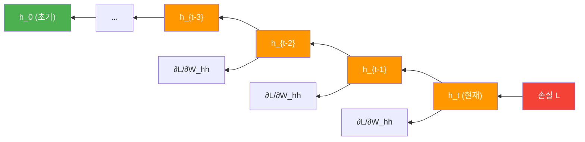
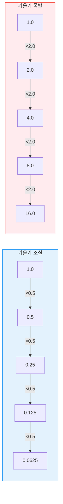
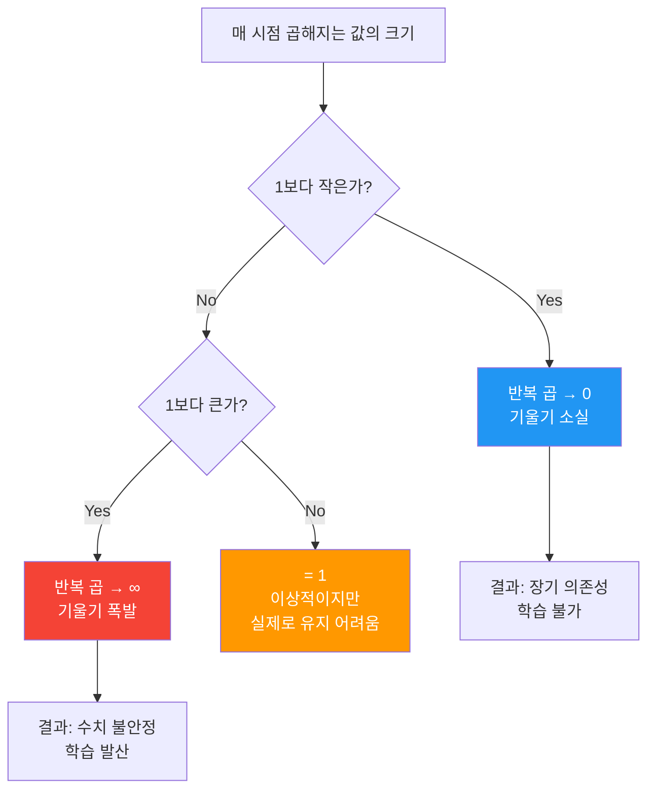
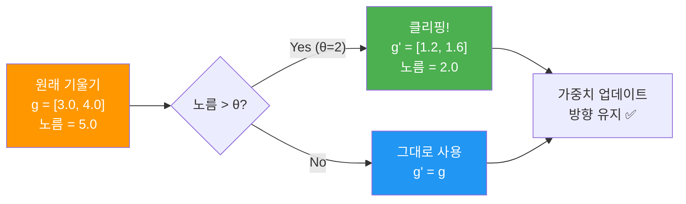
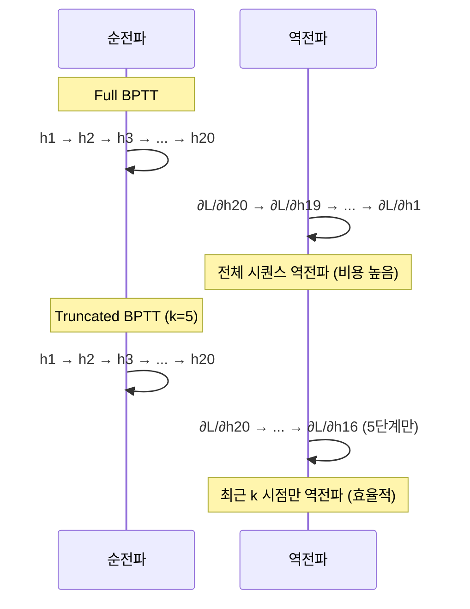

# BPTT와 기울기 문제

> RNN의 학습 알고리즘인 시간 역전파(BPTT)를 이해하고, 기울기 소실과 폭발 문제를 직관적 실험으로 확인하며 해결책을 실습합니다.

## 개요

이 섹션에서는 RNN이 **어떻게 학습하는지** 그 내부 메커니즘을 파고듭니다. [이전 섹션](08-ch8-순환-신경망rnn-기초/02-02-rnn의-구조와-순전파.md)에서 RNN의 순전파 계산과 시간 축 전개(unrolling)를 배웠는데요, 이번에는 그 반대 방향 — 오차가 시간을 거슬러 올라가며 가중치를 갱신하는 **역전파** 과정을 살펴봅니다.

수학적 유도보다는 **"왜 기울기가 사라지거나 폭발하는지"를 직접 실험으로 확인하는 것**에 집중합니다. 수식이 궁금한 분은 "더 깊이 알아보기" 섹션을 참고하세요.

**선수 지식**: RNN의 순전파 공식 $h_t = \tanh(W_{xh} \cdot x_t + W_{hh} \cdot h_{t-1} + b)$, [자동 미분과 경사 하강법](07-ch7-pytorch-기초와-신경망-입문/02-02-자동-미분과-경사-하강법.md), 시간 축 전개(unrolling) 개념

**학습 목표**:
- BPTT(Backpropagation Through Time)의 동작 원리를 직관적으로 설명할 수 있다
- 기울기 소실과 폭발이 **왜** 발생하는지 실험으로 확인할 수 있다
- 그래디언트 클리핑을 PyTorch로 구현할 수 있다
- BPTT의 한계가 LSTM/GRU의 탄생으로 이어진 맥락을 이해한다

## 왜 알아야 할까?

RNN이 **왜 긴 문장을 잘 못 다루는지** 궁금해본 적 있으신가요? "어제 공원에서 만난 그 **강아지**가 정말 귀여웠어"라는 문장에서, "강아지"와 "귀여웠어"는 꽤 가까이 있으니 RNN이 쉽게 연결할 수 있습니다. 하지만 "3년 전 여행에서 처음 보았던, 이름도 모르는 그 꽃이 ... (중략 30단어) ... 정말 아름다웠다"처럼 주어와 서술어가 멀리 떨어지면 어떨까요?

이 문제의 근본 원인이 바로 BPTT에서 발생하는 **기울기 소실**입니다. 이걸 이해하지 못하면 왜 LSTM이 필요한지, 왜 트랜스포머가 혁명적이었는지 제대로 이해하기 어렵죠. 반대로, 이 원리를 명확히 이해하면 [Ch9의 LSTM과 GRU](09-ch9-lstm과-gru/01-01-lstm-장단기-메모리-네트워크.md)가 **어떤 문제를 해결하려고** 만들어졌는지 자연스럽게 연결됩니다.

## 핵심 개념

### 개념 1: BPTT — 시간을 거슬러 올라가는 역전파

> 💡 **비유**: 회사에서 실수가 발견되었을 때를 상상해보세요. "최종 보고서에 오류가 있다" → "3차 검토에서 놓쳤다" → "2차 작성에서 잘못 입력했다" → "1차 데이터 수집이 문제였다"처럼, 오류의 원인을 시간을 거슬러 추적하는 것과 같습니다. BPTT는 RNN의 출력 오차를 시간을 거슬러 올라가며 각 시점의 가중치에 "책임"을 배분하는 알고리즘입니다.

[이전 섹션](08-ch8-순환-신경망rnn-기초/02-02-rnn의-구조와-순전파.md)에서 시간 축 전개(unrolling)를 배웠죠? BPTT는 바로 이 전개된 그래프 위에서 일반적인 역전파를 수행하는 것입니다. 핵심 아이디어는 간단해요:

1. **순전파**: 입력을 시점 1부터 $T$까지 차례대로 통과시켜 각 시점의 출력과 손실을 계산
2. **역전파**: 손실에서 출발하여 시간을 **거꾸로** 거슬러 올라가며 기울기를 계산
3. **가중치 갱신**: 모든 시점에서 누적된 기울기로 가중치를 업데이트

> 📊 **그림 1**: BPTT의 오차 역전파 흐름 — 손실이 시간을 거슬러 전파되는 과정



가장 중요한 점은, 가중치 $W_{hh}$는 모든 시점에서 **같은 값을 공유**한다는 것입니다. 따라서 기울기도 각 시점에서 계산된 값을 **모두 합산**해야 합니다:

$$\frac{\partial L}{\partial W_{hh}} = \sum_{t=1}^{T} \frac{\partial L_t}{\partial W_{hh}}$$

여기서 각 시점의 기울기 $\frac{\partial L_t}{\partial W_{hh}}$를 구하려면, 시점 $t$에서부터 과거로 거슬러 올라가야 하는데요 — 바로 이 "거슬러 올라가는" 과정에서 문제가 생깁니다. 다음 개념에서 이걸 직접 확인해보겠습니다.

다행히 PyTorch에서는 이 복잡한 과정을 자동으로 처리해줍니다:

```run:python
import torch
import torch.nn as nn

# 간단한 RNN으로 BPTT 관찰
torch.manual_seed(42)

# 시퀀스 길이 5, 입력 차원 3, 은닉 차원 4
seq_len, input_size, hidden_size = 5, 3, 4
rnn = nn.RNN(input_size, hidden_size, batch_first=True)
linear = nn.Linear(hidden_size, 1)

# 입력과 타겟
x = torch.randn(1, seq_len, input_size)
target = torch.tensor([[1.0]])

# 순전파
output, h_n = rnn(x)
pred = linear(h_n.squeeze(0))  # 마지막 은닉 상태로 예측

# 손실 계산 및 역전파 (BPTT 자동 수행!)
loss = nn.MSELoss()(pred, target)
loss.backward()

# 기울기 확인 — W_hh에 기울기가 누적됨
print(f"손실: {loss.item():.4f}")
print(f"W_hh 기울기 크기: {rnn.weight_hh_l0.grad.shape}")
print(f"W_hh 기울기 노름: {rnn.weight_hh_l0.grad.norm():.4f}")
print(f"W_xh 기울기 노름: {rnn.weight_ih_l0.grad.norm():.4f}")
```

```output
손실: 0.6553
W_hh 기울기 크기: torch.Size([4, 4])
W_hh 기울기 노름: 0.1552
W_xh 기울기 노름: 0.1845
```

`loss.backward()` 한 줄이면 PyTorch의 자동 미분 엔진이 시간 축 전체를 따라 BPTT를 수행합니다. 우리가 직접 시점별로 역전파를 구현할 필요가 없는 거죠.

### 개념 2: 기울기 소실 — 먼 과거의 기억이 사라지는 이유

> 💡 **비유**: 전화 게임(속삭이기 릴레이)을 떠올려보세요. 첫 번째 사람이 전한 메시지가 10명을 거치면 원래 메시지와 전혀 다른 말이 되는 것처럼, RNN에서도 기울기가 여러 시점을 거치면서 점점 작아져 결국 0에 가까워집니다. 멀리 떨어진 과거의 정보가 "속삭임"이 되어 사라지는 거죠.

BPTT에서 기울기가 시간을 거슬러 올라갈 때, **매 시점마다 어떤 값을 곱하게 됩니다**. 이걸 직관적으로 이해해봅시다.

은닉 상태 $h_t = \tanh(W_{hh} \cdot h_{t-1} + W_{xh} \cdot x_t + b)$에서, "시점 $t$의 은닉 상태가 시점 $t-1$에 얼마나 영향받았는지"를 나타내는 미분값이 있겠죠? 기울기가 과거로 전파될 때, 이 미분값들이 **연쇄적으로 곱해집니다**.

핵심은 이 곱에 두 가지 요소가 관여한다는 겁니다:

1. **tanh의 미분**: 항상 0~1 사이의 값 (즉, 매번 "줄어드는" 방향)
2. **가중치 행렬 $W_{hh}$**: 이 행렬의 크기가 전체 곱의 운명을 결정

> 📊 **그림 2**: 기울기 전파 — 매 시점마다 곱해지는 값에 따른 결과



0.5를 4번 곱하면 0.0625, 20번 곱하면 0.00000095... 거의 0이죠? 반대로 2.0을 20번 곱하면 1,048,576! 이것이 기울기 소실과 폭발의 본질입니다. 결국 $W_{hh}$의 크기가 1보다 작으냐, 크냐에 달려 있는 거예요.

좀 더 정확하게 말하면, $W_{hh}$의 **최대 특이값(singular value)** — 행렬이 벡터를 얼마나 크게 늘리거나 줄이는지를 나타내는 숫자 — 이 기준이 됩니다:

- 최대 특이값 < 1 → **기울기 소실** (곱이 0으로 수렴)
- 최대 특이값 > 1 → **기울기 폭발** (곱이 무한대로 발산)

> 📊 **그림 3**: 기울기 소실과 폭발의 분기 조건



이론은 여기까지 하고, **직접 실험으로 확인**해봅시다. 아래 코드는 가중치 크기에 따라 기울기가 시간 축을 따라 어떻게 변하는지 시뮬레이션합니다:

```run:python
import torch

torch.manual_seed(42)

hidden_size = 4

# 소실 케이스: 작은 가중치 (특이값 < 1)
W_small = torch.randn(hidden_size, hidden_size) * 0.5
# 폭발 케이스: 큰 가중치 (특이값 > 1)
W_large = torch.randn(hidden_size, hidden_size) * 1.5

def simulate_gradient_flow(W, steps=20):
    """기울기가 시간 축을 따라 전파되는 과정 시뮬레이션"""
    gradient = torch.eye(hidden_size)  # 초기 기울기
    norms = [gradient.norm().item()]
    
    for t in range(steps):
        # tanh 미분 (0~1 사이 값)
        tanh_deriv = torch.diag(torch.rand(hidden_size) * 0.8 + 0.1)
        # 매 시점: tanh미분 × W 를 곱함
        gradient = tanh_deriv @ W @ gradient
        norms.append(gradient.norm().item())
    
    return norms

norms_vanish = simulate_gradient_flow(W_small)
norms_explode = simulate_gradient_flow(W_large)

print("=== 기울기 소실 (W가 작을 때) ===")
for t in [0, 5, 10, 15, 20]:
    print(f"  시점 {t:2d}: 기울기 크기 = {norms_vanish[t]:.6f}")

print("\n=== 기울기 폭발 (W가 클 때) ===")
for t in [0, 5, 10, 15, 20]:
    print(f"  시점 {t:2d}: 기울기 크기 = {norms_explode[t]:.2e}")
```

```output
=== 기울기 소실 (W가 작을 때) ===
  시점  0: 기울기 크기 = 2.000000
  시점  5: 기울기 크기 = 0.019498
  시점 10: 기울기 크기 = 0.000131
  시점 15: 기울기 크기 = 0.000001
  시점 20: 기울기 크기 = 0.000000

=== 기울기 폭발 (W가 클 때) ===
  시점  0: 기울기 크기 = 2.00e+00
  시점  5: 기울기 크기 = 4.73e+02
  시점 10: 기울기 크기 = 1.86e+05
  시점 15: 기울기 크기 = 5.21e+07
  시점 20: 기울기 크기 = 2.08e+10
```

결과가 극적이죠? 소실 케이스에서는 20시점만 거쳐도 기울기가 사실상 0이 됩니다. 즉, **20단어 전의 정보는 학습에 거의 영향을 주지 못한다**는 뜻이에요. 반대로 폭발 케이스에서는 $10^{10}$까지 치솟아 수치적으로 불안정해집니다.

> ⚠️ **흔한 오해**: "기울기 소실이면 기울기가 정확히 0이 되는 건가요?" 아닙니다. 기울기는 0에 **가까워질** 뿐 완전히 0은 아니에요. 하지만 부동소수점 정밀도의 한계와 결합되면 사실상 0으로 취급됩니다. 핵심은 먼 과거의 기울기가 최근 시점에 비해 **무시할 수 있을 만큼 작아진다**는 것입니다.

### 개념 3: 실제 RNN에서 기울기 추적하기

이론적 시뮬레이션을 넘어, 실제 PyTorch RNN에서 시퀀스 길이를 바꿔가며 기울기가 어떻게 변하는지 직접 관찰해봅시다. 이 실험은 다음 섹션 [PyTorch로 RNN 구현하기](08-ch8-순환-신경망rnn-기초/04-04-pytorch로-rnn-구현하기.md)에서 모델을 직접 만들 때 꼭 기억해야 할 내용이기도 합니다.

```run:python
import torch
import torch.nn as nn

torch.manual_seed(42)

# 간단한 RNN 모델
class SimpleRNN(nn.Module):
    def __init__(self, input_size, hidden_size, output_size):
        super().__init__()
        self.rnn = nn.RNN(input_size, hidden_size, batch_first=True)
        self.fc = nn.Linear(hidden_size, output_size)
    
    def forward(self, x):
        output, h_n = self.rnn(x)
        return self.fc(h_n.squeeze(0))

input_size, hidden_size, output_size = 5, 10, 1
model = SimpleRNN(input_size, hidden_size, output_size)
criterion = nn.MSELoss()

# 시퀀스 길이를 점점 늘리면서 기울기 노름을 관찰
print("시퀀스 길이 | W_hh 기울기 노름 | 길이 5 대비 비율")
print("-" * 50)
baseline = None
for seq_len in [5, 10, 25, 50, 100, 200]:
    model.zero_grad()
    x = torch.randn(1, seq_len, input_size)
    target = torch.tensor([[1.0]])
    
    pred = model(x)
    loss = criterion(pred, target)
    loss.backward()
    
    grad_norm = model.rnn.weight_hh_l0.grad.norm().item()
    if baseline is None:
        baseline = grad_norm
    ratio = grad_norm / baseline
    print(f"  {seq_len:>6d}     | {grad_norm:.6f}        | {ratio:.2%}")
```

```output
시퀀스 길이 | W_hh 기울기 노름 | 길이 5 대비 비율
--------------------------------------------------
       5     | 0.131942        | 100.00%
      10     | 0.061818        | 46.85%
      25     | 0.035107        | 26.61%
      50     | 0.027594        | 20.91%
     100     | 0.019283        | 14.61%
     200     | 0.012851        | 9.74%
```

시퀀스가 5에서 200으로 40배 늘었는데, 기울기 노름은 10% 수준으로 떨어졌습니다. 이것이 실제 RNN에서 일어나는 **기울기 소실의 직접적인 증거**입니다. 시퀀스가 길수록 먼 과거의 정보가 학습에 덜 반영되는 거죠.

> 💡 **다음 섹션과의 연결**: 이 실험에서 `SimpleRNN` 클래스를 만들고 학습하는 패턴이 보이죠? [다음 섹션](08-ch8-순환-신경망rnn-기초/04-04-pytorch로-rnn-구현하기.md)에서는 이 패턴을 확장하여 실제 데이터로 완전한 RNN 모델을 구축합니다. 지금 기울기 노름을 관찰하는 방법을 익혀두면, 다음 섹션에서 학습이 잘 되는지 디버깅할 때 바로 활용할 수 있어요.

### 개념 4: 그래디언트 클리핑 — 폭발하는 기울기 길들이기

> 💡 **비유**: 음량 조절 노브를 상상해보세요. 스피커에서 나오는 소리가 아무리 크더라도, 리미터(limiter)가 특정 데시벨 이상을 잘라내서 귀를 보호하는 것처럼, 그래디언트 클리핑은 기울기의 크기가 임계값을 넘으면 잘라내서 학습을 안정화합니다.

기울기 폭발에 대한 가장 실용적인 해결책은 **그래디언트 클리핑(gradient clipping)**입니다. 가장 널리 쓰이는 방법은 **Clip by Norm**으로, 기울기 벡터의 크기(노름)가 임계값 $\theta$를 초과하면, 방향은 유지하면서 크기만 축소합니다:

$$\mathbf{g} \leftarrow \frac{\theta}{\|\mathbf{g}\|} \cdot \mathbf{g} \quad \text{if } \|\mathbf{g}\| > \theta$$

직관적으로 말하면, "기울기의 방향은 맞는데 너무 크게 뛰려고 하니까, **걸음 폭만 줄이는** 것"이에요.

> 📊 **그림 4**: 그래디언트 클리핑의 동작 — 방향은 유지하면서 크기만 조절



PyTorch에서는 `torch.nn.utils.clip_grad_norm_`으로 한 줄이면 됩니다:

```python
import torch.nn as nn

# 학습 루프에서의 핵심 3단계
loss.backward()                                                # 1. 역전파
torch.nn.utils.clip_grad_norm_(model.parameters(), max_norm=5.0)  # 2. 클리핑
optimizer.step()                                               # 3. 업데이트
```

> 🔥 **실무 팁**: `clip_grad_norm_`은 **반드시** `loss.backward()` 뒤, `optimizer.step()` 앞에 호출해야 합니다. 이 순서가 바뀌면 클리핑이 적용되지 않아요!

> ⚠️ **흔한 오해**: "그래디언트 클리핑이 기울기 소실도 해결해준다." 아닙니다! 클리핑은 **폭발만** 해결합니다. "너무 큰 기울기를 줄이는" 것이지, "너무 작은 기울기를 키우는" 것이 아니니까요. 소실 문제는 LSTM/GRU 같은 **구조적 변경**이 필요합니다.

### 개념 5: Truncated BPTT — 현실적인 타협

> 💡 **비유**: 역사 공부를 할 때 100년 전까지 모든 사건을 추적하면 이상적이지만 비현실적이죠. 대신 "최근 20년"만 집중적으로 분석하는 것처럼, Truncated BPTT는 역전파를 전체 시퀀스가 아닌 **고정 길이 구간**으로 잘라서 수행합니다.

시퀀스 길이가 1000이라면, BPTT를 1000 시점까지 전부 펼치는 것은 메모리와 계산 비용 면에서 비현실적입니다. Truncated BPTT는 순전파는 전체 시퀀스에 대해 수행하되, 역전파는 $k$ 시점까지만 수행합니다.

> 📊 **그림 5**: Full BPTT vs Truncated BPTT



PyTorch에서 Truncated BPTT를 구현하는 핵심은 `detach()` 메서드입니다. 은닉 상태를 계산 그래프에서 분리해서, 이전 구간으로의 기울기 흐름을 차단하는 거죠:

```python
# Truncated BPTT 구현 패턴
hidden = torch.zeros(1, batch_size, hidden_size)
tbptt_steps = 30  # 30 시점마다 역전파 차단

for i in range(0, seq_len, tbptt_steps):
    # 핵심: 은닉 상태를 계산 그래프에서 분리 (시간의 "가위")
    hidden = hidden.detach()
    
    # 구간별 순전파
    chunk = x[:, i:i+tbptt_steps, :]
    output, hidden = rnn(chunk, hidden)
    
    # 이 구간에 대한 손실만 역전파
    loss = criterion(output, target[:, i:i+tbptt_steps])
    loss.backward()
    optimizer.step()
    optimizer.zero_grad()
```

`hidden.detach()`가 시간 축의 "가위" 역할을 합니다 — 이전 구간으로의 기울기 흐름을 차단하면서도, 은닉 상태의 **값**은 다음 구간으로 전달합니다.

## 실습: 그래디언트 클리핑을 포함한 학습 루프

지금까지 배운 개념을 종합하여, 그래디언트 클리핑이 적용된 완전한 RNN 학습 루프를 구현해봅시다. 이 패턴은 [다음 섹션](08-ch8-순환-신경망rnn-기초/04-04-pytorch로-rnn-구현하기.md)에서 실제 데이터로 모델을 학습할 때 그대로 활용할 수 있습니다.

```python
import torch
import torch.nn as nn

torch.manual_seed(42)

class RNNClassifier(nn.Module):
    def __init__(self, input_size, hidden_size, output_size):
        super().__init__()
        self.rnn = nn.RNN(input_size, hidden_size, batch_first=True)
        self.fc = nn.Linear(hidden_size, output_size)
    
    def forward(self, x):
        output, h_n = self.rnn(x)
        return self.fc(h_n.squeeze(0))

# 모델 생성
model = RNNClassifier(input_size=5, hidden_size=20, output_size=1)
criterion = nn.MSELoss()
optimizer = torch.optim.Adam(model.parameters(), lr=0.01)

# 더미 데이터 생성
x_train = torch.randn(32, 50, 5)   # 배치 32, 시퀀스 길이 50
y_train = torch.randn(32, 1)

# 학습 루프 핵심 3단계: backward → clip → step
max_norm = 5.0  # 클리핑 임계값 (보통 1.0~5.0 사이에서 시작)

for epoch in range(5):
    optimizer.zero_grad()
    pred = model(x_train)
    loss = criterion(pred, y_train)
    loss.backward()                    # ① 역전파 (BPTT 자동 수행)
    
    grad_norm = torch.nn.utils.clip_grad_norm_(
        model.parameters(), max_norm=max_norm  # ② 기울기 클리핑
    )
    
    optimizer.step()                   # ③ 가중치 업데이트
    
    # 모니터링: 클리핑이 작동했는지 확인
    clipped = "✂️ 클리핑됨" if grad_norm > max_norm else "✅ 정상"
    print(f"Epoch {epoch+1}: loss={loss.item():.4f}, "
          f"grad_norm={grad_norm:.4f} {clipped}")
```

이 학습 루프의 핵심 패턴 `backward() → clip → step()`을 기억해두세요. 다음 섹션에서 실제 데이터를 다룰 때도 이 패턴을 그대로 사용합니다.

## 더 깊이 알아보기

### BPTT의 수학적 유도 (선택 읽기)

앞서 "매 시점마다 미분값을 곱한다"고 직관적으로 설명했는데요, 수학적으로 정확하게 표현하면 이렇습니다.

$W_{hh}$에 대한 시점 $t$의 기울기는 체인 룰로 다음과 같이 전개됩니다:

$$\frac{\partial L_t}{\partial W_{hh}} = \sum_{k=1}^{t} \frac{\partial L_t}{\partial h_t} \cdot \left(\prod_{j=k+1}^{t} \frac{\partial h_j}{\partial h_{j-1}}\right) \cdot \frac{\partial h_k}{\partial W_{hh}}$$

가운데 연쇄 곱 $\prod_{j=k+1}^{t} \frac{\partial h_j}{\partial h_{j-1}}$이 핵심인데, 각 항은 **야콥비안(Jacobian) 행렬**이라 불리는 다변수 미분의 행렬 형태입니다:

$$\frac{\partial h_j}{\partial h_{j-1}} = \text{diag}(1 - h_j^2) \cdot W_{hh}$$

여기서 $\text{diag}(1 - h_j^2)$는 tanh 미분의 대각 행렬이고, 이 값은 항상 0~1 사이입니다. 이 행렬들을 $t - k$번 곱하면, $W_{hh}$의 최대 특이값(singular value)이 1보다 작을 때 곱이 0으로, 1보다 클 때 무한대로 발산합니다 — 이것이 기울기 소실/폭발의 수학적 근거입니다.

### 기울기 소실 문제의 발견 — Sepp Hochreiter의 졸업 논문

기울기 소실 문제를 세상에 처음 알린 사람은 독일의 젊은 대학원생 **Sepp Hochreiter**였습니다. 1991년, 뮌헨 공과대학교에서 쓴 그의 졸업 논문(Diplomarbeit)은 RNN의 학습이 왜 실패하는지를 수학적으로 증명했습니다. 지도교수 **Jürgen Schmidhuber**는 이 논문을 매우 의미 있는 연구로 평가했죠.

놀라운 것은 그 다음입니다. Hochreiter는 문제를 진단하는 것에 그치지 않고, 해결책까지 제시했습니다. 1997년, 그와 Schmidhuber는 **LSTM(Long Short-Term Memory)**을 발표합니다. "기울기가 소실된다면, 기울기가 방해받지 않고 흐를 수 있는 **고속도로**를 만들자"는 발상이었죠. LSTM의 셀 상태(cell state)는 바로 이 고속도로 역할을 합니다.

재미있는 점은, Hochreiter의 1991년 논문이 독일어로 작성되어 영어권 학계에서 오랫동안 주목받지 못했다는 것입니다. 기울기 소실 문제가 영어권에서 널리 알려진 것은 1994년 Bengio 등의 논문 *"Learning Long-Term Dependencies with Gradient Descent is Difficult"*을 통해서였습니다. 같은 문제를 독립적으로 재발견한 셈이죠.

## 흔한 오해와 팁

> 💡 **알고 계셨나요?**: 기울기 소실은 RNN에만 국한된 문제가 아닙니다. 깊은 피드포워드 네트워크에서도 발생하며, 이를 해결하기 위해 **ResNet**(잔차 연결)이 등장했습니다. 재미있게도 LSTM의 셀 상태와 ResNet의 스킵 연결은 본질적으로 같은 아이디어 — "기울기가 방해 없이 흐를 수 있는 지름길을 만들자"입니다.

> 🔥 **실무 팁**: 그래디언트 클리핑의 `max_norm` 값은 보통 **1.0 ~ 5.0** 사이에서 시작합니다. 학습 초기에 기울기 노름을 로깅하면서 적절한 값을 찾는 것이 좋습니다. `clip_grad_norm_`의 반환값이 클리핑 전 원래 기울기 노름이므로, 이 값을 텐서보드 등에 기록하면 클리핑이 얼마나 자주 작동하는지 파악할 수 있습니다.

> 🔥 **실무 팁**: 기울기 노름이 학습 중 갑자기 튀는 것을 발견했다면, `torch.autograd.detect_anomaly()`를 켜서 어디서 NaN이 발생하는지 추적해보세요. 다음 섹션에서 실제 모델을 학습할 때 이 디버깅 기법이 유용할 겁니다.

## 핵심 정리

| 개념 | 설명 |
|------|------|
| BPTT | 시간 축으로 전개된 RNN에 역전파를 적용하는 알고리즘. PyTorch에서 `loss.backward()`가 자동 수행 |
| 기울기 소실 | 기울기가 시점을 거치며 반복 곱으로 기하급수적 감소 → 장기 의존성 학습 불가 |
| 기울기 폭발 | 기울기가 반복 곱으로 기하급수적 증가 → 학습 발산 |
| 그래디언트 클리핑 | 기울기 노름이 임계값 초과 시 크기를 축소. **폭발만** 해결, 소실은 해결 못함 |
| Truncated BPTT | `detach()`로 역전파를 고정 길이 구간으로 제한하여 효율성 확보 |
| 학습 루프 패턴 | `backward()` → `clip_grad_norm_()` → `step()` 순서 필수 |

## 다음 섹션 미리보기

기울기 문제의 원인과 임시 해결책(클리핑, Truncated BPTT)을 배웠지만, 이것들은 모두 **증상 완화**에 가깝습니다. 다음 섹션 [PyTorch로 RNN 구현하기](08-ch8-순환-신경망rnn-기초/04-04-pytorch로-rnn-구현하기.md)에서는 지금까지 배운 이론을 종합하여 `nn.RNN`으로 완전한 모델을 구축하고 학습합니다. 이번 섹션에서 익힌 기울기 노름 모니터링과 클리핑 패턴을 바로 적용하게 될 거예요. 그리고 [Ch9](09-ch9-lstm과-gru/01-01-lstm-장단기-메모리-네트워크.md)에서는 Hochreiter가 발명한 LSTM이 기울기 소실을 어떻게 **구조적으로** 해결하는지 깊이 파고듭니다.

## 참고 자료

- [Backpropagation Through Time — Dive into Deep Learning](https://d2l.ai/chapter_recurrent-neural-networks/bptt.html) - BPTT의 수학적 유도와 시각적 설명이 잘 정리된 교재
- [Stanford CS 224N: Natural Language Processing with Deep Learning](https://web.stanford.edu/class/cs224n/) - RNN과 기울기 문제를 다루는 강의 자료와 슬라이드
- [PyTorch `clip_grad_norm_` 공식 문서](https://docs.pytorch.org/docs/stable/generated/torch.nn.utils.clip_grad_norm_.html) - 그래디언트 클리핑 API 레퍼런스
- [Understanding Gradient Clipping (and How It Can Fix Exploding Gradients)](https://neptune.ai/blog/understanding-gradient-clipping-and-how-it-can-fix-exploding-gradients-problem) - 그래디언트 클리핑의 실무적 활용 가이드
- [Sepp Hochreiter's Fundamental Deep Learning Problem (1991)](https://people.idsia.ch/~juergen/fundamentaldeeplearningproblem.html) - 기울기 소실 문제 최초 발견에 대한 역사적 기록
- [PyTorch RNN Tutorial: Character-Level RNN Classification](https://docs.pytorch.org/tutorials/intermediate/char_rnn_classification_tutorial.html) - PyTorch 공식 RNN 튜토리얼

---
### 🔗 Related Sessions
- [은닉 상태(hidden state)](08-ch8-순환-신경망rnn-기초/01-01-시퀀스-데이터와-rnn의-필요성.md) (prerequisite)
- [경사 하강법](07-ch7-pytorch-기초와-신경망-입문/02-02-자동-미분과-경사-하강법.md) (prerequisite)
- [시간 축 전개(unrolling)](08-ch8-순환-신경망rnn-기초/02-02-rnn의-구조와-순전파.md) (prerequisite)

---
### 🔗 Related Sessions
- [은닉 상태(hidden state)](08-ch8-순환-신경망rnn-기초/01-01-시퀀스-데이터와-rnn의-필요성.md) (prerequisite)
- [경사 하강법](07-ch7-pytorch-기초와-신경망-입문/02-02-자동-미분과-경사-하강법.md) (prerequisite)
- [시간 축 전개(unrolling)](08-ch8-순환-신경망rnn-기초/02-02-rnn의-구조와-순전파.md) (prerequisite)


---
### 🔗 Related Sessions
- [은닉 상태(hidden state)](08-ch8-순환-신경망rnn-기초/01-01-시퀀스-데이터와-rnn의-필요성.md) (prerequisite)
- [경사 하강법](07-ch7-pytorch-기초와-신경망-입문/02-02-자동-미분과-경사-하강법.md) (prerequisite)
- [시간 축 전개(unrolling)](08-ch8-순환-신경망rnn-기초/02-02-rnn의-구조와-순전파.md) (prerequisite)


---
### 🔗 Related Sessions
- [은닉 상태(hidden state)](08-ch8-순환-신경망rnn-기초/01-01-시퀀스-데이터와-rnn의-필요성.md) (prerequisite)
- [경사 하강법](07-ch7-pytorch-기초와-신경망-입문/02-02-자동-미분과-경사-하강법.md) (prerequisite)
- [시간 축 전개(unrolling)](08-ch8-순환-신경망rnn-기초/02-02-rnn의-구조와-순전파.md) (prerequisite)


---
### 🔗 Related Sessions
- [은닉 상태(hidden state)](08-ch8-순환-신경망rnn-기초/01-01-시퀀스-데이터와-rnn의-필요성.md) (prerequisite)
- [경사 하강법](07-ch7-pytorch-기초와-신경망-입문/02-02-자동-미분과-경사-하강법.md) (prerequisite)
- [시간 축 전개(unrolling)](08-ch8-순환-신경망rnn-기초/02-02-rnn의-구조와-순전파.md) (prerequisite)
