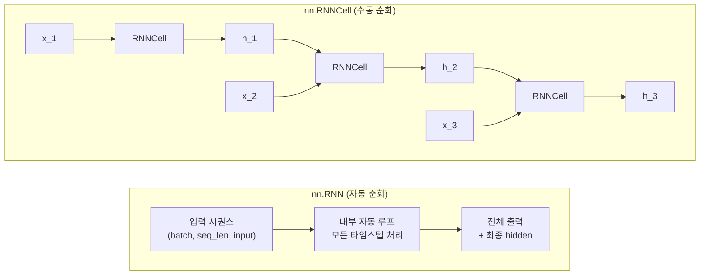
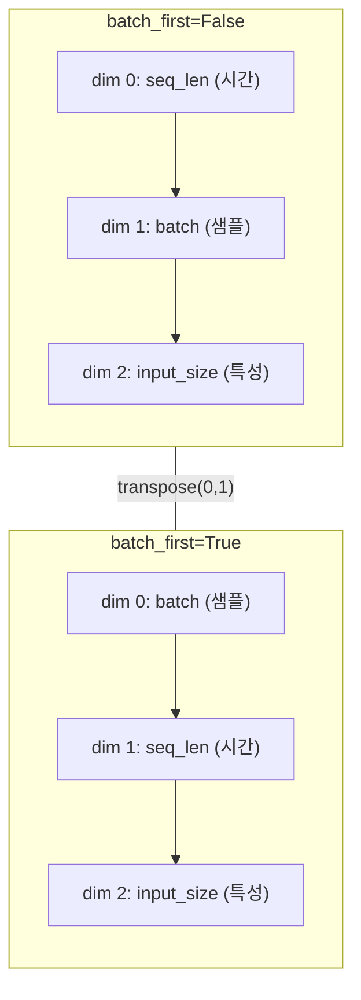
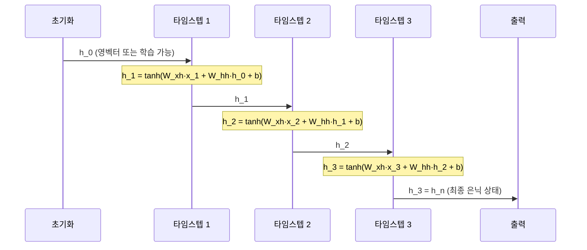
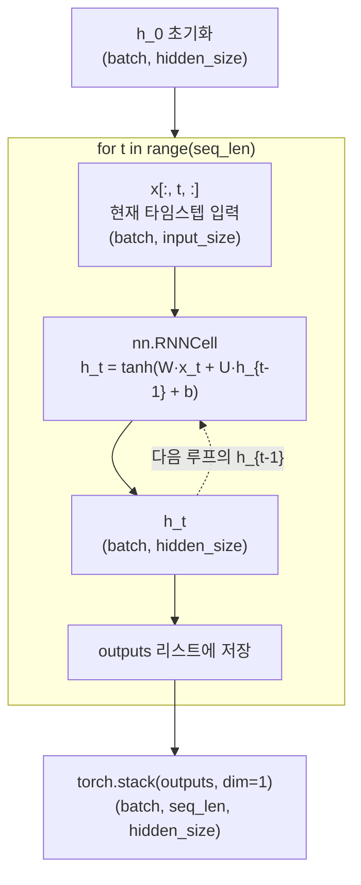
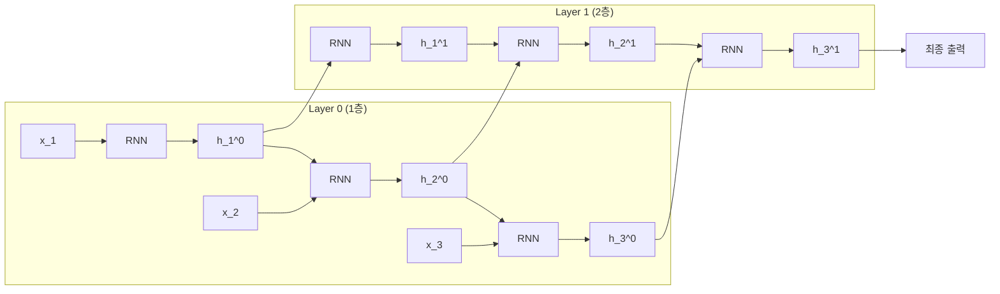

# PyTorch로 RNN 구현하기

> PyTorch의 `nn.RNN`과 `nn.RNNCell`을 활용하여 실전 RNN 모델을 구현하고, 입력 형상과 은닉 상태의 흐름을 완전히 이해합니다.

## 개요

이 섹션에서는 앞서 배운 RNN의 이론적 배경을 PyTorch 코드로 옮기는 방법을 다룹니다. `nn.RNN`과 `nn.RNNCell`이라는 두 가지 API의 차이를 이해하고, 입력 텐서의 형상(shape)을 정확하게 다루는 법, 은닉 상태를 초기화하고 해석하는 법을 실습합니다.

**선수 지식**: [RNN의 구조와 순전파](08-ch8-순환-신경망rnn-기초/02-02-rnn의-구조와-순전파.md)에서 배운 가중치 행렬과 순전파 공식, [BPTT와 기울기 문제](08-ch8-순환-신경망rnn-기초/03-03-bptt와-기울기-문제.md)에서 다룬 그래디언트 클리핑

**학습 목표**:
- `nn.RNN`과 `nn.RNNCell`의 차이와 사용 시나리오를 구분할 수 있다
- `(batch, seq_len, input_size)` 형상을 정확히 구성할 수 있다
- 은닉 상태의 초기화, 전달, 출력 해석을 코드로 구현할 수 있다
- 다층 RNN과 양방향 RNN을 구성하고 출력 형상을 예측할 수 있다

## 왜 알아야 할까?

이론을 아는 것과 코드로 구현하는 것 사이에는 큰 간극이 있습니다. 특히 RNN에서는 **텐서의 차원(shape)**이 가장 큰 장벽이에요. "왜 내 텐서가 `(32, 50, 128)`이어야 하지?", "hidden state는 어디서 나오고 어디로 전달하지?" 같은 의문이 끊이지 않거든요.

PyTorch는 `nn.RNN`이라는 고수준 API와 `nn.RNNCell`이라는 저수준 API를 모두 제공하는데, 각각의 장단점과 사용 시나리오가 다릅니다. 이 두 도구를 자유자재로 쓸 수 있으면, 다음 챕터의 LSTM/GRU 구현은 물론이고 Seq2Seq, 어텐션 같은 고급 아키텍처까지 자연스럽게 확장할 수 있습니다.

## 핵심 개념

### 개념 1: nn.RNN vs nn.RNNCell — 자동차와 엔진의 차이

> 💡 **비유**: `nn.RNN`은 **완성된 자동차**입니다. 시동을 걸고 목적지를 입력하면 알아서 달려가죠. 반면 `nn.RNNCell`은 **엔진 하나**예요. 직접 기어를 넣고, 핸들을 돌리고, 브레이크를 밟아야 합니다. 자동차가 편리하지만, 엔진을 직접 다룰 줄 알아야 커스텀 차량(= 커스텀 아키텍처)을 만들 수 있습니다.

**`nn.RNN`** — 시퀀스 전체를 한 번에 처리합니다. 내부적으로 모든 타임스텝을 순회하며 은닉 상태를 갱신하고, 최종 결과를 한꺼번에 반환합니다.

**`nn.RNNCell`** — 단일 타임스텝만 처리합니다. `for` 루프를 직접 작성하여 각 시점의 입력과 은닉 상태를 수동으로 전달해야 합니다.

> 📊 **그림 1**: nn.RNN과 nn.RNNCell의 처리 방식 비교



두 API의 시그니처를 비교해볼까요?

```python
# nn.RNN — 시퀀스 전체를 한 번에
rnn = nn.RNN(input_size=10, hidden_size=20, num_layers=1, batch_first=True)
output, h_n = rnn(x, h_0)  # x: (batch, seq_len, 10)

# nn.RNNCell — 한 타임스텝씩
cell = nn.RNNCell(input_size=10, hidden_size=20)
h = cell(x_t, h_prev)  # x_t: (batch, 10), h_prev: (batch, 20)
```

> 🔥 **실무 팁**: 대부분의 상황에서는 `nn.RNN`을 사용하세요. cuDNN 가속 커널을 활용할 수 있어 훨씬 빠릅니다. `nn.RNNCell`은 타임스텝마다 다른 로직을 넣어야 하는 **커스텀 아키텍처**(예: 어텐션 기반 디코더)에서 진가를 발휘합니다.

### 개념 2: 입력 텐서의 형상 — 3차원 텐서 정복하기

> 💡 **비유**: RNN에 입력할 텐서를 **택배 상자**로 생각해보세요. 상자 안에는 여러 **줄(batch)**의 문장이 들어 있고, 각 문장은 여러 **단어(seq_len)**로 이루어져 있으며, 각 단어는 **특성 벡터(input_size)**로 표현됩니다. 이 세 축을 어떤 순서로 쌓느냐가 바로 `batch_first` 옵션입니다.

PyTorch `nn.RNN`의 입력은 3차원 텐서입니다:

| `batch_first` | 입력 형상 | 의미 |
|---|---|---|
| `False` (기본값) | `(seq_len, batch, input_size)` | 시간 축이 첫 번째 |
| `True` | `(batch, seq_len, input_size)` | 배치 축이 첫 번째 |

> 📊 **그림 2**: batch_first에 따른 텐서 형상 비교



구체적인 예를 들어보겠습니다:

```run:python
import torch
import torch.nn as nn

# 배치 크기=4, 시퀀스 길이=5, 입력 특성=3인 데이터
batch_size, seq_len, input_size = 4, 5, 3

# batch_first=True: 가장 직관적인 형상
x = torch.randn(batch_size, seq_len, input_size)
print(f"입력 형상: {x.shape}")  # (4, 5, 3)

rnn = nn.RNN(input_size=3, hidden_size=8, batch_first=True)
output, h_n = rnn(x)

print(f"출력 형상: {output.shape}")  # (4, 5, 8) — 모든 타임스텝의 출력
print(f"최종 은닉 상태 형상: {h_n.shape}")  # (1, 4, 8) — 마지막 타임스텝의 은닉
```

```output
입력 형상: torch.Size([4, 5, 3])
출력 형상: torch.Size([4, 5, 8])
최종 은닉 상태 형상: torch.Size([1, 4, 8])
```

> ⚠️ **흔한 오해**: "output이 최종 결과이고, h_n은 부수적인 것"이라고 생각하기 쉽지만, 사실 `output[-1]`(마지막 타임스텝의 출력)과 `h_n`은 단층 단방향 RNN에서 **동일한 값**입니다! output은 **모든 타임스텝**의 은닉 상태를 담고 있고, h_n은 **마지막 타임스텝**의 은닉 상태만 담고 있는 것이죠.

### 개념 3: 은닉 상태의 초기화와 흐름

> 💡 **비유**: 은닉 상태는 **대화의 기억**과 같습니다. 처음 대화를 시작할 때는 상대방에 대해 아무것도 모르니 기억이 비어있고(영벡터 초기화), 대화가 진행될수록 맥락이 쌓여갑니다. 때로는 이전 대화의 기억을 이어받아(은닉 상태 전달) 더 풍부한 대화를 이어갈 수도 있죠.

은닉 상태 `h_0`의 형상은 다음과 같습니다:

$$h_0 \in \mathbb{R}^{(D \times \text{num\_layers}) \times \text{batch} \times \text{hidden\_size}}$$

여기서 $D$는 양방향이면 2, 단방향이면 1입니다.

> 📊 **그림 3**: 은닉 상태의 초기화와 타임스텝별 흐름



초기화 방법은 크게 세 가지가 있습니다:

```python
# 방법 1: 영벡터 초기화 (기본값 — h_0 생략 시 자동 적용)
output, h_n = rnn(x)  # h_0=None → 내부에서 0으로 초기화

# 방법 2: 명시적 영벡터 초기화
h_0 = torch.zeros(num_layers, batch_size, hidden_size)
output, h_n = rnn(x, h_0)

# 방법 3: 학습 가능한 초기 은닉 상태
class RNNModel(nn.Module):
    def __init__(self, input_size, hidden_size, num_layers):
        super().__init__()
        self.rnn = nn.RNN(input_size, hidden_size, num_layers, batch_first=True)
        # nn.Parameter로 학습 가능하게 만듦
        self.h_0 = nn.Parameter(torch.randn(num_layers, 1, hidden_size))
    
    def forward(self, x):
        batch_size = x.size(0)
        # 배치 크기만큼 복제
        h_0 = self.h_0.expand(-1, batch_size, -1).contiguous()
        output, h_n = self.rnn(x, h_0)
        return output, h_n
```

### 개념 4: nn.RNNCell로 수동 루프 구성하기

`nn.RNNCell`을 사용하면 각 타임스텝을 직접 제어할 수 있습니다. 이것은 나중에 어텐션 메커니즘을 디코더에 통합할 때 반드시 필요한 패턴이에요.

> 📊 **그림 4**: nn.RNNCell 수동 루프의 데이터 흐름



```run:python
import torch
import torch.nn as nn

# RNNCell로 직접 루프 돌기
input_size, hidden_size = 10, 20
batch_size, seq_len = 4, 5

cell = nn.RNNCell(input_size, hidden_size)
x = torch.randn(batch_size, seq_len, input_size)

# 은닉 상태 초기화
h_t = torch.zeros(batch_size, hidden_size)

# 각 타임스텝별 출력을 저장할 리스트
outputs = []

for t in range(seq_len):
    x_t = x[:, t, :]          # (batch, input_size)
    h_t = cell(x_t, h_t)      # (batch, hidden_size)
    outputs.append(h_t)

# 리스트를 텐서로 합치기
output = torch.stack(outputs, dim=1)  # (batch, seq_len, hidden_size)

print(f"수동 루프 출력 형상: {output.shape}")
print(f"최종 은닉 상태 형상: {h_t.shape}")
```

```output
수동 루프 출력 형상: torch.Size([4, 5, 20])
최종 은닉 상태 형상: torch.Size([4, 20])
```

### 개념 5: 다층(Multi-layer) RNN과 출력 해석

> 💡 **비유**: 다층 RNN은 **여러 층으로 된 회사 조직**과 비슷합니다. 1층(사원)이 원시 데이터를 처리하면, 그 결과를 2층(팀장)이 받아서 더 추상적인 패턴을 추출하고, 3층(임원)이 최종 판단을 내립니다. 각 층은 동일한 시간 축을 따라 동작하지만, 더 높은 수준의 표현을 학습합니다.

`num_layers` 파라미터로 RNN을 여러 층 쌓을 수 있습니다. 이때 아래 층의 output이 위 층의 input이 됩니다.

> 📊 **그림 5**: 2층 RNN의 구조와 h_n의 의미



```run:python
import torch
import torch.nn as nn

torch.manual_seed(42)

# 3층 RNN
rnn = nn.RNN(
    input_size=10,
    hidden_size=20,
    num_layers=3,        # 3개 층
    batch_first=True,
    dropout=0.1          # 층 사이에 드롭아웃 (마지막 층 제외)
)

x = torch.randn(4, 5, 10)  # (batch=4, seq_len=5, input=10)
output, h_n = rnn(x)

print(f"output 형상: {output.shape}")  # (4, 5, 20) — 최상위 층의 모든 타임스텝
print(f"h_n 형상: {h_n.shape}")        # (3, 4, 20) — 모든 층의 마지막 타임스텝

# h_n 해석: h_n[i]는 i번째 층의 최종 은닉 상태
print(f"\nLayer 0 최종 은닉: {h_n[0].shape}")  # (4, 20)
print(f"Layer 1 최종 은닉: {h_n[1].shape}")  # (4, 20)
print(f"Layer 2 최종 은닉: {h_n[2].shape}")  # (4, 20)

# 검증: output의 마지막 타임스텝 == h_n의 최상위 층
print(f"\n동일한가? {torch.allclose(output[:, -1, :], h_n[-1])}")
```

```output
output 형상: torch.Size([4, 5, 20])
h_n 형상: torch.Size([3, 4, 20])

Layer 0 최종 은닉: torch.Size([4, 20])
Layer 1 최종 은닉: torch.Size([4, 20])
Layer 2 최종 은닉: torch.Size([4, 20])

동일한가? True
```

이 결과에서 핵심 포인트를 정리하면:
- **output**: 항상 **최상위 층**의 **모든 타임스텝** 출력 → `(batch, seq_len, hidden_size)`
- **h_n**: **모든 층**의 **마지막 타임스텝** 은닉 상태 → `(num_layers, batch, hidden_size)`
- **분류 태스크**에서는 보통 `h_n[-1]` (최상위 층의 마지막 은닉)을 사용합니다

## 실습: 직접 해보기

간단한 시퀀스 분류 모델을 처음부터 끝까지 구현해봅시다. 랜덤 시퀀스 데이터를 이진 분류하는 작은 모델을 만들어, `nn.RNN`과 `nn.RNNCell` 두 가지 방식으로 구현합니다.

```python
import torch
import torch.nn as nn
import torch.optim as optim
from torch.utils.data import DataLoader, TensorDataset

torch.manual_seed(42)

# ========================================
# 1. 합성 데이터 생성
# ========================================
def create_synthetic_data(n_samples=1000, seq_len=20, input_size=5):
    """간단한 이진 분류용 합성 시퀀스 데이터 생성"""
    X = torch.randn(n_samples, seq_len, input_size)
    # 시퀀스 평균이 양수면 클래스 1, 음수면 클래스 0
    y = (X.mean(dim=(1, 2)) > 0).long()
    return X, y

X, y = create_synthetic_data()
print(f"데이터: X={X.shape}, y={y.shape}")
print(f"클래스 분포: 0={(y==0).sum()}, 1={(y==1).sum()}")

# 학습/검증 분할
train_X, val_X = X[:800], X[800:]
train_y, val_y = y[:800], y[800:]

train_loader = DataLoader(
    TensorDataset(train_X, train_y),
    batch_size=32, shuffle=True
)
val_loader = DataLoader(
    TensorDataset(val_X, val_y),
    batch_size=32
)

# ========================================
# 2. nn.RNN 기반 분류 모델
# ========================================
class RNNClassifier(nn.Module):
    """nn.RNN을 사용한 시퀀스 분류 모델"""
    def __init__(self, input_size, hidden_size, num_layers, num_classes):
        super().__init__()
        self.hidden_size = hidden_size
        self.num_layers = num_layers
        
        self.rnn = nn.RNN(
            input_size=input_size,
            hidden_size=hidden_size,
            num_layers=num_layers,
            batch_first=True,       # (batch, seq_len, input) 형식 사용
            nonlinearity='tanh',    # 기본 활성화 함수
        )
        # 최종 은닉 상태 → 클래스 확률
        self.fc = nn.Linear(hidden_size, num_classes)
    
    def forward(self, x):
        # x: (batch, seq_len, input_size)
        # h_0 생략 → 자동으로 영벡터 초기화
        output, h_n = self.rnn(x)
        
        # h_n: (num_layers, batch, hidden_size)
        # 최상위 층의 최종 은닉 상태만 사용
        last_hidden = h_n[-1]  # (batch, hidden_size)
        
        # 분류 레이어 통과
        logits = self.fc(last_hidden)  # (batch, num_classes)
        return logits

# ========================================
# 3. nn.RNNCell 기반 분류 모델 (비교용)
# ========================================
class RNNCellClassifier(nn.Module):
    """nn.RNNCell로 수동 루프를 구성한 시퀀스 분류 모델"""
    def __init__(self, input_size, hidden_size, num_classes):
        super().__init__()
        self.hidden_size = hidden_size
        
        # 단일 층 RNNCell
        self.cell = nn.RNNCell(input_size, hidden_size)
        self.fc = nn.Linear(hidden_size, num_classes)
    
    def forward(self, x):
        batch_size, seq_len, _ = x.shape
        
        # 은닉 상태 수동 초기화
        h_t = torch.zeros(batch_size, self.hidden_size, device=x.device)
        
        # 직접 타임스텝 순회
        for t in range(seq_len):
            h_t = self.cell(x[:, t, :], h_t)
        
        # 마지막 은닉 상태로 분류
        logits = self.fc(h_t)
        return logits

# ========================================
# 4. 학습 루프
# ========================================
def train_model(model, train_loader, val_loader, epochs=20, lr=0.01):
    """학습 + 검증 루프"""
    criterion = nn.CrossEntropyLoss()
    optimizer = optim.Adam(model.parameters(), lr=lr)
    
    for epoch in range(epochs):
        # 학습
        model.train()
        total_loss, correct, total = 0, 0, 0
        
        for batch_X, batch_y in train_loader:
            optimizer.zero_grad()
            logits = model(batch_X)
            loss = criterion(logits, batch_y)
            loss.backward()
            
            # 그래디언트 클리핑 (BPTT 안정성)
            nn.utils.clip_grad_norm_(model.parameters(), max_norm=1.0)
            
            optimizer.step()
            
            total_loss += loss.item()
            correct += (logits.argmax(1) == batch_y).sum().item()
            total += batch_y.size(0)
        
        # 검증
        model.eval()
        val_correct, val_total = 0, 0
        with torch.no_grad():
            for batch_X, batch_y in val_loader:
                logits = model(batch_X)
                val_correct += (logits.argmax(1) == batch_y).sum().item()
                val_total += batch_y.size(0)
        
        if (epoch + 1) % 5 == 0:
            print(f"Epoch {epoch+1:3d} | "
                  f"Loss: {total_loss/len(train_loader):.4f} | "
                  f"Train Acc: {correct/total:.4f} | "
                  f"Val Acc: {val_correct/val_total:.4f}")

# ========================================
# 5. 두 모델 비교 실행
# ========================================
print("=" * 60)
print("nn.RNN 기반 모델")
print("=" * 60)
model_rnn = RNNClassifier(
    input_size=5, hidden_size=32,
    num_layers=2, num_classes=2
)
print(f"파라미터 수: {sum(p.numel() for p in model_rnn.parameters()):,}")
train_model(model_rnn, train_loader, val_loader)

print(f"\n{'=' * 60}")
print("nn.RNNCell 기반 모델")
print("=" * 60)
model_cell = RNNCellClassifier(
    input_size=5, hidden_size=32, num_classes=2
)
print(f"파라미터 수: {sum(p.numel() for p in model_cell.parameters()):,}")
train_model(model_cell, train_loader, val_loader)
```

이 코드에서 핵심적으로 확인할 점:

1. **`RNNClassifier`**: `nn.RNN`이 내부 루프를 자동 처리하므로 `forward()`가 간결합니다
2. **`RNNCellClassifier`**: `for t in range(seq_len)` 수동 루프를 작성하지만, 타임스텝별로 커스텀 로직을 삽입할 수 있습니다
3. 두 모델 모두 **그래디언트 클리핑** (`clip_grad_norm_`)을 적용하여 기울기 폭발을 방지합니다

## 더 깊이 알아보기

### Jeffrey Elman과 SimpleRNN의 탄생

PyTorch의 `nn.RNN`이 구현하는 것은 사실 **엘만 네트워크(Elman Network)**입니다. 1990년 인지과학자 **제프리 엘만(Jeffrey Elman)**이 제안한 이 구조는, 놀랍게도 언어학 연구에서 탄생했어요. 엘만은 신경망이 **문법 구조를 스스로 발견**할 수 있는지 실험하기 위해, 은닉 상태를 다음 타임스텝으로 순환시키는 아이디어를 떠올렸습니다.

그의 1990년 논문 "Finding Structure in Time"에서, 엘만은 6개의 간단한 영어 문장으로 학습한 RNN이 주어-동사 수 일치 같은 문법 규칙을 암묵적으로 학습한다는 것을 보여주었습니다. 이것이 오늘날 대규모 언어 모델의 가장 원시적인 조상인 셈이죠.

재미있는 것은, 같은 시기에 **마이클 조던(Michael Jordan)** — 농구선수가 아닌 머신러닝 연구자 — 이 출력을 입력으로 되먹이는 **조던 네트워크**를 제안했는데, 결국 엘만 네트워크의 방식이 더 널리 채택되었습니다. PyTorch가 `nn.RNN`에서 기본으로 제공하는 것이 바로 이 엘만 방식입니다.

### batch_first의 역사

`batch_first=False`가 기본값인 이유가 궁금하신가요? 이것은 PyTorch가 초기에 **Lua 기반의 Torch** 프레임워크에서 영향을 받았기 때문입니다. 시퀀스 처리에서는 시간 축이 첫 번째 차원이면 연속된 타임스텝의 메모리 접근이 효율적이에요. 하지만 사용자 입장에서는 `batch_first=True`가 훨씬 직관적이어서, 현재는 대부분의 프로젝트에서 `batch_first=True`를 사용합니다.

## 흔한 오해와 팁

> ⚠️ **흔한 오해**: "nn.RNN의 output과 h_n은 전혀 다른 정보를 담고 있다"고 생각하기 쉽지만, 단층 단방향 RNN에서 `output[:, -1, :]`와 `h_n.squeeze(0)`는 **완전히 동일한 텐서**입니다. output은 모든 시점의 은닉 상태 "모음집"이고, h_n은 그중 마지막 페이지만 떼어낸 것이에요.

> 💡 **알고 계셨나요?**: PyTorch의 `nn.RNN`은 GPU에서 실행 시 **cuDNN 최적화 커널**을 자동으로 사용합니다. 이 커널은 `nn.RNNCell`을 `for` 루프로 돌리는 것보다 2~5배 빠를 수 있어요. 단, cuDNN 커널을 사용하려면 드롭아웃이 0이거나 `num_layers > 1`이어야 하고, 입력이 CUDA 텐서여야 합니다.

> 🔥 **실무 팁**: 시퀀스 분류에서 마지막 은닉 상태(`h_n[-1]`)만 사용하는 대신, output의 **모든 타임스텝을 평균**내는 방법도 있습니다. `output.mean(dim=1)`은 시퀀스 전체의 정보를 골고루 반영하여, 특히 긴 시퀀스에서 더 좋은 성능을 내는 경우가 많습니다.

## 핵심 정리

| 개념 | 설명 |
|------|------|
| `nn.RNN` | 시퀀스 전체를 자동 순회. cuDNN 가속 지원. 대부분의 상황에 적합 |
| `nn.RNNCell` | 단일 타임스텝 처리. 수동 루프 필요. 커스텀 아키텍처에 활용 |
| `batch_first=True` | 입력을 `(batch, seq_len, input_size)`로 구성. 직관적이므로 권장 |
| `output` 반환값 | 최상위 층의 **모든 타임스텝** 은닉 상태: `(batch, seq_len, hidden_size)` |
| `h_n` 반환값 | **모든 층**의 마지막 타임스텝 은닉 상태: `(num_layers, batch, hidden_size)` |
| 은닉 상태 초기화 | 생략 시 영벡터, `nn.Parameter`로 학습 가능한 초기값 설정 가능 |
| `num_layers` | 층을 쌓아 더 추상적인 표현 학습. 층 사이 `dropout` 적용 가능 |
| 그래디언트 클리핑 | `clip_grad_norm_`으로 기울기 폭발 방지. RNN 학습의 필수 기법 |

## 다음 섹션 미리보기

이제 PyTorch로 RNN을 자유자재로 구현할 수 있게 되었습니다. 다음 섹션 [문자 수준 이름 분류 실습](08-ch8-순환-신경망rnn-기초/05-05-문자-수준-이름-분류-실습.md)에서는 PyTorch 공식 튜토리얼의 대표적인 RNN 프로젝트인 **이름의 국적 분류기**를 처음부터 끝까지 구현합니다. 실제 데이터셋으로 문자 단위 RNN을 학습시키고, 한 번도 본 적 없는 이름의 국적을 예측해보는 재미있는 프로젝트입니다.

## 참고 자료

- [PyTorch nn.RNN 공식 문서](https://docs.pytorch.org/docs/stable/generated/torch.nn.RNN.html) - `nn.RNN`의 모든 파라미터와 입출력 형상 레퍼런스
- [PyTorch nn.RNNCell 공식 문서](https://docs.pytorch.org/docs/stable/generated/torch.nn.RNNCell.html) - `nn.RNNCell`의 API와 사용법
- [NLP From Scratch: Classifying Names with a Character-Level RNN](https://docs.pytorch.org/tutorials/intermediate/char_rnn_classification_tutorial.html) - PyTorch 공식 RNN 구현 튜토리얼
- [graykode/nlp-tutorial](https://github.com/graykode/nlp-tutorial) - 다양한 NLP 모델의 간결한 PyTorch 구현 예제 모음
- [Elman, J. (1990). Finding Structure in Time](https://onlinelibrary.wiley.com/doi/abs/10.1207/s15516709cog1402_1) - RNN의 원조 논문, 엘만 네트워크의 탄생

---
### 🔗 Related Sessions
- [nn.module](07-ch7-pytorch-기초와-신경망-입문/03-03-nnmodule로-신경망-정의하기.md) (prerequisite)
- [dataloader](07-ch7-pytorch-기초와-신경망-입문/05-05-학습-루프와-datasetdataloader.md) (prerequisite)


---
### 🔗 Related Sessions
- [nn.module](07-ch7-pytorch-기초와-신경망-입문/03-03-nnmodule로-신경망-정의하기.md) (prerequisite)
- [dataloader](07-ch7-pytorch-기초와-신경망-입문/05-05-학습-루프와-datasetdataloader.md) (prerequisite)


---
### 🔗 Related Sessions
- [nn.module](07-ch7-pytorch-기초와-신경망-입문/03-03-nnmodule로-신경망-정의하기.md) (prerequisite)
- [dataloader](07-ch7-pytorch-기초와-신경망-입문/05-05-학습-루프와-datasetdataloader.md) (prerequisite)


---
### 🔗 Related Sessions
- [nn.module](07-ch7-pytorch-기초와-신경망-입문/03-03-nnmodule로-신경망-정의하기.md) (prerequisite)
- [dataloader](07-ch7-pytorch-기초와-신경망-입문/05-05-학습-루프와-datasetdataloader.md) (prerequisite)


---
### 🔗 Related Sessions
- [nn.module](07-ch7-pytorch-기초와-신경망-입문/03-03-nnmodule로-신경망-정의하기.md) (prerequisite)
- [dataloader](07-ch7-pytorch-기초와-신경망-입문/05-05-학습-루프와-datasetdataloader.md) (prerequisite)
