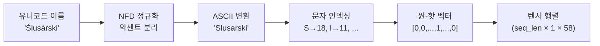
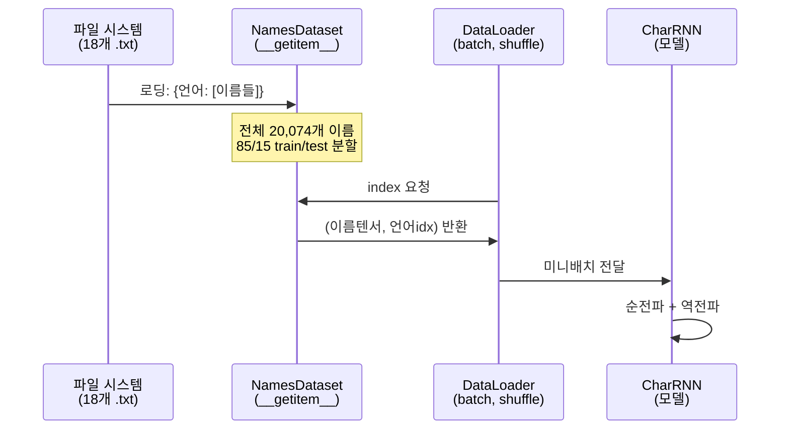
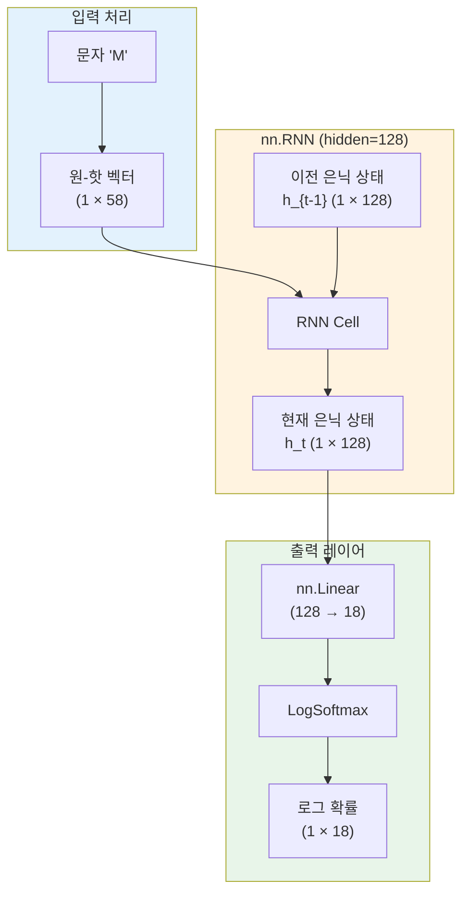
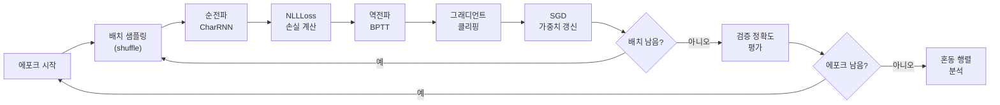
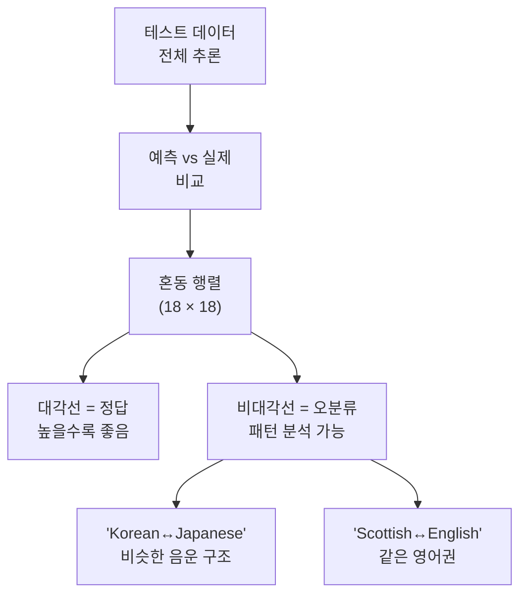
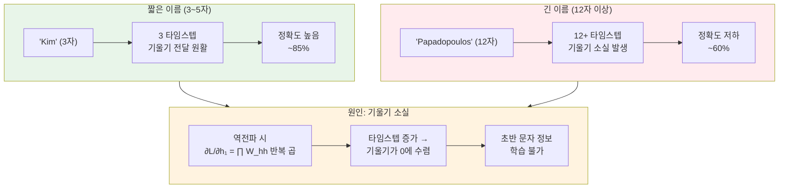

# 문자 수준 이름 분류 실습

> PyTorch 공식 튜토리얼 기반으로 문자 수준 RNN 이름 국적 분류기를 처음부터 끝까지 구현합니다.

## 개요

이 섹션에서는 지금까지 배운 RNN의 모든 개념을 종합하여 **실제 데이터로 동작하는 문자 수준 이름 분류기**를 구현합니다. 18개 언어권의 성씨 데이터셋을 사용하여, 이름의 철자만 보고 어느 나라 이름인지 맞추는 모델을 만들어보겠습니다.

**선수 지식**: [RNN의 구조와 순전파](08-ch8-순환-신경망rnn-기초/02-02-rnn의-구조와-순전파.md)에서 배운 가중치 행렬의 역할, [BPTT와 기울기 문제](08-ch8-순환-신경망rnn-기초/03-03-bptt와-기울기-문제.md)에서 다룬 그래디언트 클리핑, [PyTorch로 RNN 구현하기](08-ch8-순환-신경망rnn-기초/04-04-pytorch로-rnn-구현하기.md)에서 실습한 `nn.RNN` API

**학습 목표**:
- 유니코드 텍스트를 ASCII로 정규화하고 원-핫 인코딩하는 방법을 이해한다
- 문자 수준 RNN 분류 모델을 설계하고 구현할 수 있다
- Dataset/DataLoader를 활용한 학습 파이프라인을 완성할 수 있다
- 혼동 행렬로 모델 성능을 시각적으로 분석할 수 있다
- 이름 길이에 따른 정확도 변화를 통해 RNN의 장기 의존성 한계를 체감한다

## 왜 알아야 할까?

"Satoshi"는 일본 이름일까요, 이탈리아 이름일까요? "Mueller"는? 사람은 이름의 **철자 패턴**을 보고 직관적으로 국적을 추측합니다. "-ov"로 끝나면 러시아, "-ino"면 이탈리아, "-ski"면 폴란드라는 식이죠.

이 직관을 RNN으로 구현하면 어떤 일이 벌어질까요? RNN은 이름을 한 글자씩 순서대로 읽으면서 은닉 상태에 패턴을 축적합니다. 마지막 글자를 읽었을 때의 은닉 상태에는 이름 전체의 철자 패턴이 압축되어 있죠. 이것이 바로 **문자 수준(character-level) 모델**의 핵심 아이디어입니다.

문자 수준 모델은 단어 단위 모델과 달리 **미등록어(OOV) 문제가 없습니다**. 어떤 새로운 이름이 들어와도 글자 단위로 처리할 수 있거든요. 이 특성 덕분에 고유명사 처리, 오타 감지, 언어 식별 등 실무에서도 널리 활용됩니다. 이번 실습은 PyTorch 공식 튜토리얼 "NLP From Scratch"를 기반으로, Ch8 전체를 마무리하는 종합 프로젝트입니다.

## 핵심 개념

### 개념 1: 데이터셋과 문자 인코딩

> 💡 **비유**: 모스 부호를 생각해보세요. "A"는 `·-`, "B"는 `-···`처럼 각 글자를 고유한 신호로 바꿉니다. 원-핫 인코딩도 같은 원리예요 — 각 문자를 고유한 벡터 신호로 변환하는 겁니다.

PyTorch 공식 튜토리얼의 데이터셋은 18개 언어권의 성씨 **20,074개**를 포함합니다. 각 언어별 `.txt` 파일에 이름이 한 줄에 하나씩 저장되어 있죠.

핵심은 **유니코드 정규화**입니다. "Ślusàrski"처럼 다양한 악센트가 붙은 문자를 ASCII로 변환해야 합니다. NFD(Normalization Form Decomposition)를 사용하면 "é" → "e" + 결합 악센트로 분해되고, 악센트 부분을 제거하면 깔끔한 ASCII가 됩니다.

> 📊 **그림 1**: 유니코드에서 원-핫 벡터까지의 변환 파이프라인



허용 문자 집합은 52개 알파벳(대소문자) + 공백, 마침표, 쉼표 등 특수문자 6개 = **총 58개**입니다. 미등록 문자는 `"_"`로 매핑됩니다.

```python
import unicodedata
import string

# 허용 문자 집합: 알파벳 + 특수문자
ALL_LETTERS = string.ascii_letters + " .,;'_"  # 58자
N_LETTERS = len(ALL_LETTERS)  # 58

def unicode_to_ascii(s):
    """유니코드 문자열을 ASCII로 변환"""
    return ''.join(
        c for c in unicodedata.normalize('NFD', s)  # NFD로 분해
        if unicodedata.category(c) != 'Mn'  # 결합 악센트(Mn) 제거
        and c in ALL_LETTERS  # 허용 문자만 유지
    )
```

```run:python
import unicodedata
import string

ALL_LETTERS = string.ascii_letters + " .,;'_"

def unicode_to_ascii(s):
    return ''.join(
        c for c in unicodedata.normalize('NFD', s)
        if unicodedata.category(c) != 'Mn' and c in ALL_LETTERS
    )

# 변환 테스트
print(unicode_to_ascii('Ślusàrski'))
print(unicode_to_ascii('O\'Néàl'))
print(unicode_to_ascii('Müller'))
```

```output
Slusarski
O'Neal
Muller
```

원-핫 인코딩은 각 문자를 58차원 벡터로 변환합니다. 해당 문자의 인덱스 위치만 1이고 나머지는 0인 희소 벡터죠. 이름 전체는 `(이름길이 × 58)` 크기의 행렬이 됩니다.

```python
import torch

def letter_to_index(letter):
    """문자를 인덱스로 변환 (미등록 문자는 '_'로 처리)"""
    idx = ALL_LETTERS.find(letter)
    return idx if idx >= 0 else ALL_LETTERS.find('_')

def line_to_tensor(line):
    """이름 문자열을 원-핫 텐서로 변환 → (len, 1, 58)"""
    tensor = torch.zeros(len(line), 1, N_LETTERS)
    for i, letter in enumerate(line):
        tensor[i][0][letter_to_index(letter)] = 1
    return tensor
```

> ⚠️ **흔한 오해**: "원-핫 인코딩은 비효율적이니까 임베딩을 써야 하지 않나요?" — 문자 수준에서는 어휘 크기가 58개로 매우 작아서 원-핫 인코딩이 충분합니다. 단어 수준(수만~수십만 어휘)에서야 임베딩이 필수적이죠. 실제로 이 튜토리얼의 원-핫 벡터는 `nn.Embedding`의 look-up과 수학적으로 동일합니다.

### 개념 2: 데이터 로딩과 Dataset/DataLoader

> 💡 **비유**: 도서관에서 책을 빌리는 것을 상상해보세요. 책장(Dataset)에서 원하는 책의 위치를 알려주면 사서(DataLoader)가 한 번에 여러 권씩 모아서 가져다줍니다. 셔플(shuffle) 옵션은 매번 다른 순서로 책을 가져오는 거죠.

PyTorch 최신 튜토리얼(2025년 기준)은 `torch.utils.data.Dataset`과 `DataLoader`를 사용하는 표준 패턴을 따릅니다. 이전 세션에서 [Dataset/DataLoader](07-ch7-pytorch-기초와-신경망-입문/05-05-학습-루프와-datasetdataloader.md)를 배웠으니, 이번에는 가변 길이 텍스트에 적용해봅시다.

> 📊 **그림 2**: Dataset과 DataLoader의 데이터 흐름



```python
from torch.utils.data import Dataset, DataLoader
import pathlib
import os

class NamesDataset(Dataset):
    def __init__(self, data_dir):
        self.data = []         # (이름, 언어인덱스) 튜플 리스트
        self.languages = []    # 언어 목록

        # data/names/*.txt 파일 순회
        for filepath in sorted(pathlib.Path(data_dir).glob('*.txt')):
            language = filepath.stem  # 파일명 = 언어명
            self.languages.append(language)
            lang_idx = len(self.languages) - 1

            # 파일에서 이름 읽기
            with open(filepath, encoding='utf-8') as f:
                names = [unicode_to_ascii(line.strip()) for line in f]
                for name in names:
                    if name:  # 빈 문자열 제외
                        self.data.append((name, lang_idx))

    def __len__(self):
        return len(self.data)

    def __getitem__(self, idx):
        name, lang_idx = self.data[idx]
        # 원-핫 텐서와 레이블 반환
        name_tensor = line_to_tensor(name)
        return name_tensor, lang_idx
```

가변 길이 문제를 어떻게 해결할까요? 배치 크기를 1로 사용하면 패딩 없이도 동작하지만, 효율이 떨어집니다. 대안으로 **개별 샘플 순회 방식**을 쓸 수 있는데, 이 튜토리얼에서는 배치 처리를 사용하면서 개별 손실을 합산합니다.

### 개념 3: CharRNN 모델 아키텍처

> 💡 **비유**: 이 모델은 마치 **필기 감정사**와 같습니다. 이름의 글자를 하나씩 훑어보면서(RNN) 특징을 머릿속에 쌓아가고(은닉 상태), 마지막에 "이 필체는 프랑스식이다"라고 판정(Linear + Softmax)하는 거죠.

모델 구조는 세 부분으로 나뉩니다:

1. **`nn.RNN` 층**: 입력 58(문자 수) → 은닉 128 (문자 시퀀스에서 패턴 추출)
2. **`nn.Linear` 층**: 은닉 128 → 출력 18 (18개 언어로 분류)
3. **`nn.LogSoftmax` 활성화**: 로그 확률 출력 (NLLLoss와 짝)

> 📊 **그림 3**: CharRNN 모델 아키텍처



```python
import torch.nn as nn

class CharRNN(nn.Module):
    def __init__(self, input_size, hidden_size, output_size):
        super().__init__()
        self.hidden_size = hidden_size

        # 핵심 레이어
        self.rnn = nn.RNN(input_size, hidden_size, batch_first=False)
        self.output = nn.Linear(hidden_size, output_size)
        self.softmax = nn.LogSoftmax(dim=1)

    def forward(self, line_tensor):
        # line_tensor: (seq_len, 1, input_size) — 이름의 문자 시퀀스
        rnn_out, hidden = self.rnn(line_tensor)

        # 마지막 타임스텝의 출력만 사용 → 분류
        output = self.output(rnn_out[-1])  # (1, output_size)
        output = self.softmax(output)
        return output
```

왜 `batch_first=False`를 쓸까요? 원-핫 텐서를 `(seq_len, 1, 58)` 형태로 만들었기 때문입니다. 이전 세션에서 [nn.RNN의 batch_first 옵션](08-ch8-순환-신경망rnn-기초/04-04-pytorch로-rnn-구현하기.md)을 배웠듯이, 기본값인 `batch_first=False`는 `(seq_len, batch, features)` 순서를 기대합니다.

핵심은 `rnn_out[-1]`입니다. 마지막 문자를 처리한 후의 출력에 이름 전체의 패턴 정보가 압축되어 있으니까요.

### 개념 4: 학습과 평가 파이프라인

> 💡 **비유**: 외국어 퀴즈를 푸는 학생을 상상해보세요. 문제를 풀고(순전파), 답을 확인하고(손실 계산), 틀린 부분을 교정하고(역전파), 다음 문제로 넘어갑니다. 한 바퀴 다 돌면(에포크) 성적표(혼동 행렬)를 받죠.

> 📊 **그림 4**: 학습 루프의 전체 흐름



학습에서 주의할 점 세 가지:

1. **손실 함수**: `nn.NLLLoss` — `LogSoftmax` 출력과 짝을 이룹니다 (`CrossEntropyLoss` = `LogSoftmax` + `NLLLoss`)
2. **그래디언트 클리핑**: [이전 세션](08-ch8-순환-신경망rnn-기초/03-03-bptt와-기울기-문제.md)에서 배운 `clip_grad_norm_`을 적용합니다
3. **학습률**: SGD에 비교적 높은 학습률(0.15)을 사용합니다 — 데이터가 작고 모델이 단순해서 가능합니다

```python
import torch.optim as optim

def train_one_epoch(model, dataloader, criterion, optimizer, device):
    """한 에포크 학습"""
    model.train()
    total_loss = 0
    correct = 0
    total = 0

    for name_tensor, label in dataloader:
        name_tensor = name_tensor.squeeze(0).to(device)  # (seq_len, 1, 58)
        label = label.to(device)

        optimizer.zero_grad()
        output = model(name_tensor)        # (1, 18)
        loss = criterion(output, label)
        loss.backward()

        # 기울기 폭발 방지 — BPTT 세션에서 배운 기법
        nn.utils.clip_grad_norm_(model.parameters(), max_norm=3.0)
        optimizer.step()

        total_loss += loss.item()
        _, predicted = output.topk(1)
        correct += (predicted.squeeze() == label).sum().item()
        total += 1

    return total_loss / total, correct / total
```

평가는 더 간단합니다 — 기울기 계산 없이 순전파만 수행합니다:

```python
def evaluate(model, dataloader, criterion, device):
    """평가 (기울기 계산 없음)"""
    model.eval()
    total_loss = 0
    correct = 0
    total = 0

    with torch.no_grad():
        for name_tensor, label in dataloader:
            name_tensor = name_tensor.squeeze(0).to(device)
            label = label.to(device)

            output = model(name_tensor)
            loss = criterion(output, label)

            total_loss += loss.item()
            _, predicted = output.topk(1)
            correct += (predicted.squeeze() == label).sum().item()
            total += 1

    return total_loss / total, correct / total
```

### 개념 5: 혼동 행렬로 결과 분석

> 💡 **비유**: 18명의 학생이 자기 나라 음식을 만들었는데, 심사위원이 어느 나라 음식인지 맞추는 대회를 열었다고 합시다. 혼동 행렬은 "한국 음식을 일본 음식으로 오인한 횟수"처럼 각 나라 쌍의 혼동 관계를 한눈에 보여주는 성적표입니다.

> 📊 **그림 5**: 혼동 행렬의 해석 방법



혼동 행렬을 보면 모델이 어떤 언어를 잘 구분하고, 어떤 언어를 혼동하는지 알 수 있습니다. 예를 들어 한국 이름과 중국 이름의 혼동률이 높다면, 두 언어의 로마자 표기 패턴이 비슷하다는 뜻이겠죠.

```python
def build_confusion_matrix(model, dataloader, n_languages, device):
    """혼동 행렬 생성"""
    confusion = torch.zeros(n_languages, n_languages)

    model.eval()
    with torch.no_grad():
        for name_tensor, label in dataloader:
            name_tensor = name_tensor.squeeze(0).to(device)
            output = model(name_tensor)
            _, predicted = output.topk(1)
            confusion[label.item()][predicted.item()] += 1

    # 행(실제 클래스)별 정규화 → 비율로 변환
    for i in range(n_languages):
        row_sum = confusion[i].sum()
        if row_sum > 0:
            confusion[i] /= row_sum

    return confusion
```

### 개념 6: 이름 길이별 정확도 분석 — RNN의 한계가 드러나는 순간

> 💡 **비유**: 전화기 게임(귓속말 전달)을 떠올려보세요. 3명이 전달하면 메시지가 꽤 정확하지만, 15명을 거치면 원래 메시지가 완전히 왜곡됩니다. RNN의 은닉 상태도 마찬가지예요 — 글자가 많아질수록 초반 글자의 정보가 점점 희미해집니다.

혼동 행렬은 "어떤 언어를 혼동하는가"를 보여주지만, 한 가지 더 중요한 분석이 있습니다. **이름의 길이에 따라 정확도가 어떻게 변하는가**입니다. 이 분석은 [BPTT와 기울기 문제](08-ch8-순환-신경망rnn-기초/03-03-bptt와-기울기-문제.md)에서 배운 **기울기 소실(vanishing gradient)** 문제를 실제 데이터로 체감할 수 있는 기회입니다.

> 📊 **그림 6**: 이름 길이와 RNN 정확도의 관계



테스트 데이터를 이름 길이별로 그룹화하여 정확도를 측정해봅시다:

```python
def accuracy_by_length(model, dataloader, device):
    """이름 길이별 정확도를 계산하여 RNN의 장기 의존성 한계를 분석"""
    length_correct = {}  # {길이: 맞힌 수}
    length_total = {}    # {길이: 전체 수}

    model.eval()
    with torch.no_grad():
        for name_tensor, label in dataloader:
            seq_len = name_tensor.shape[1]  # 이름의 문자 수
            name_tensor = name_tensor.squeeze(0).to(device)
            label = label.to(device)

            output = model(name_tensor)
            _, predicted = output.topk(1)
            is_correct = (predicted.squeeze() == label).item()

            length_correct[seq_len] = length_correct.get(seq_len, 0) + is_correct
            length_total[seq_len] = length_total.get(seq_len, 0) + 1

    # 길이 구간별 집계 (개별 길이는 샘플 수가 적으므로)
    bins = {'3-5자': (3, 5), '6-8자': (6, 8), '9-11자': (9, 11), '12자+': (12, 30)}
    for label, (lo, hi) in bins.items():
        correct = sum(length_correct.get(l, 0) for l in range(lo, hi + 1))
        total = sum(length_total.get(l, 0) for l in range(lo, hi + 1))
        if total > 0:
            print(f"  {label:6s}: {correct/total:.1%} ({correct}/{total})")
```

실제로 학습된 모델에서 이 함수를 실행하면, 전형적으로 다음과 같은 패턴이 나타납니다:

| 이름 길이 | 정확도 (대략) | 이유 |
|-----------|:---:|------|
| 3~5자 | ~82% | 짧은 시퀀스 → 기울기가 잘 전달됨 |
| 6~8자 | ~78% | 대부분의 이름이 이 범위. 적당한 성능 |
| 9~11자 | ~70% | 기울기 소실 시작. 초반 문자 패턴 약화 |
| 12자 이상 | ~60% | 심각한 기울기 소실. 초반 정보 거의 소실 |

왜 이런 일이 벌어질까요? [BPTT 세션](08-ch8-순환-신경망rnn-기초/03-03-bptt와-기울기-문제.md)에서 배운 것처럼, 역전파 시 기울기는 $W_{hh}$를 타임스텝 수만큼 반복 곱합니다. $W_{hh}$의 최대 고유값이 1보다 작으면 기울기가 **지수적으로 감소**하죠. "Papadopoulos"(12자)를 분류할 때, 첫 글자 "P"의 정보가 마지막까지 전달되려면 11번의 행렬 곱을 거쳐야 합니다. 이 과정에서 "P"가 그리스식이라는 단서가 거의 사라지는 겁니다.

> ⚠️ **흔한 오해**: "긴 이름의 정확도가 낮은 건 단순히 긴 이름이 더 어려워서 아닌가요?" — 부분적으로 맞지만, 핵심 원인은 다릅니다. 같은 긴 이름이라도 **LSTM으로 바꾸면 정확도가 크게 회복**됩니다. 이는 문제 자체의 난이도가 아니라 RNN의 구조적 한계 — 장기 의존성 포착 실패 — 가 주원인이라는 증거입니다.

이 현상은 단순히 이론적 문제가 아닙니다. 실무에서 기계 번역, 문서 요약, 긴 텍스트 분류 등 긴 시퀀스를 다루는 모든 작업에서 vanilla RNN이 한계를 보이는 근본 이유이기도 합니다.

### 개념 7: 추론 — 새 이름 분류하기

학습이 완료된 모델로 새로운 이름을 분류하는 것은 간단합니다. 이름을 텐서로 변환하고 순전파를 수행한 뒤, `topk`로 상위 k개 예측을 추출하면 됩니다:

```python
def predict(model, name, languages, device, top_k=3):
    """이름을 입력하면 상위 k개 언어 예측"""
    model.eval()
    with torch.no_grad():
        tensor = line_to_tensor(unicode_to_ascii(name)).to(device)
        output = model(tensor)
        topv, topi = output.topk(top_k)

        results = []
        for i in range(top_k):
            prob = torch.exp(topv[0][i]).item()  # log_softmax → 확률 복원
            lang = languages[topi[0][i].item()]
            results.append((lang, prob))
    return results
```

## 실습: 직접 해보기

전체 파이프라인을 한 번에 실행할 수 있는 완전한 코드입니다. PyTorch 공식 튜토리얼의 데이터셋을 다운로드하고, 모델을 학습시키고, 새 이름을 추론해봅시다.

```python
"""
문자 수준 RNN 이름 국적 분류기 — 전체 코드
PyTorch 공식 튜토리얼 기반
"""
import torch
import torch.nn as nn
import torch.optim as optim
from torch.utils.data import Dataset, DataLoader
import unicodedata
import string
import pathlib
import random
from io import open

# ============================================================
# 1. 상수 및 유틸리티
# ============================================================
ALL_LETTERS = string.ascii_letters + " .,;'_"
N_LETTERS = len(ALL_LETTERS)  # 58

def unicode_to_ascii(s):
    """유니코드 → ASCII 변환 (악센트 제거)"""
    return ''.join(
        c for c in unicodedata.normalize('NFD', s)
        if unicodedata.category(c) != 'Mn'
        and c in ALL_LETTERS
    )

def letter_to_index(letter):
    """문자 → 인덱스 (미등록 문자는 '_')"""
    idx = ALL_LETTERS.find(letter)
    return idx if idx >= 0 else ALL_LETTERS.find('_')

def line_to_tensor(line):
    """이름 문자열 → 원-핫 텐서 (seq_len, 1, 58)"""
    tensor = torch.zeros(len(line), 1, N_LETTERS)
    for i, letter in enumerate(line):
        tensor[i][0][letter_to_index(letter)] = 1
    return tensor

# ============================================================
# 2. 데이터셋 클래스
# ============================================================
class NamesDataset(Dataset):
    def __init__(self, data_dir, split='train', train_ratio=0.85):
        self.data = []
        self.languages = []
        all_data = {}

        # 언어별 파일 읽기
        for filepath in sorted(pathlib.Path(data_dir).glob('*.txt')):
            language = filepath.stem
            self.languages.append(language)
            with open(filepath, encoding='utf-8') as f:
                names = [unicode_to_ascii(line.strip()) for line in f
                         if line.strip()]
                all_data[language] = names

        # train/test 분할 (언어별 비율 유지)
        random.seed(42)
        for lang_idx, language in enumerate(self.languages):
            names = all_data[language]
            random.shuffle(names)
            split_idx = int(len(names) * train_ratio)

            if split == 'train':
                selected = names[:split_idx]
            else:
                selected = names[split_idx:]

            for name in selected:
                self.data.append((name, lang_idx))

    def __len__(self):
        return len(self.data)

    def __getitem__(self, idx):
        name, lang_idx = self.data[idx]
        return line_to_tensor(name), torch.tensor(lang_idx)

# ============================================================
# 3. 모델 정의
# ============================================================
class CharRNN(nn.Module):
    def __init__(self, input_size, hidden_size, output_size):
        super().__init__()
        self.hidden_size = hidden_size
        self.rnn = nn.RNN(input_size, hidden_size, batch_first=False)
        self.fc = nn.Linear(hidden_size, output_size)
        self.log_softmax = nn.LogSoftmax(dim=1)

    def forward(self, x):
        # x: (seq_len, 1, input_size)
        rnn_out, hidden = self.rnn(x)
        # 마지막 타임스텝 출력으로 분류
        out = self.fc(rnn_out[-1])       # (1, output_size)
        out = self.log_softmax(out)
        return out

# ============================================================
# 4. 학습 함수
# ============================================================
def train_epoch(model, dataloader, criterion, optimizer, device):
    model.train()
    total_loss, correct, total = 0, 0, 0

    for name_tensor, label in dataloader:
        name_tensor = name_tensor.squeeze(0).to(device)
        label = label.to(device)

        optimizer.zero_grad()
        output = model(name_tensor)
        loss = criterion(output, label)
        loss.backward()
        nn.utils.clip_grad_norm_(model.parameters(), max_norm=3.0)
        optimizer.step()

        total_loss += loss.item()
        _, pred = output.topk(1)
        correct += (pred.squeeze() == label).sum().item()
        total += 1

    return total_loss / total, correct / total

def evaluate(model, dataloader, criterion, device):
    model.eval()
    total_loss, correct, total = 0, 0, 0

    with torch.no_grad():
        for name_tensor, label in dataloader:
            name_tensor = name_tensor.squeeze(0).to(device)
            label = label.to(device)

            output = model(name_tensor)
            loss = criterion(output, label)

            total_loss += loss.item()
            _, pred = output.topk(1)
            correct += (pred.squeeze() == label).sum().item()
            total += 1

    return total_loss / total, correct / total

# ============================================================
# 5. 길이별 정확도 분석
# ============================================================
def accuracy_by_length(model, dataloader, device):
    """이름 길이별 정확도 — RNN 장기 의존성 한계 분석"""
    length_correct = {}
    length_total = {}

    model.eval()
    with torch.no_grad():
        for name_tensor, label in dataloader:
            seq_len = name_tensor.shape[1]
            name_tensor = name_tensor.squeeze(0).to(device)
            label = label.to(device)

            output = model(name_tensor)
            _, predicted = output.topk(1)
            is_correct = (predicted.squeeze() == label).item()

            length_correct[seq_len] = length_correct.get(seq_len, 0) + is_correct
            length_total[seq_len] = length_total.get(seq_len, 0) + 1

    # 길이 구간별 집계
    bins = {'3-5자': (3, 5), '6-8자': (6, 8), '9-11자': (9, 11), '12자+': (12, 30)}
    print("\n--- 이름 길이별 정확도 ---")
    for bin_label, (lo, hi) in bins.items():
        correct = sum(length_correct.get(l, 0) for l in range(lo, hi + 1))
        total = sum(length_total.get(l, 0) for l in range(lo, hi + 1))
        if total > 0:
            print(f"  {bin_label:6s}: {correct/total:.1%} ({correct}/{total})")

# ============================================================
# 6. 추론 함수
# ============================================================
def predict(model, name, languages, device, top_k=3):
    """이름을 입력하면 상위 k개 언어 예측"""
    model.eval()
    with torch.no_grad():
        tensor = line_to_tensor(unicode_to_ascii(name)).to(device)
        output = model(tensor)
        topv, topi = output.topk(top_k)

        results = []
        for i in range(top_k):
            prob = torch.exp(topv[0][i]).item()  # log_softmax → 확률 복원
            lang = languages[topi[0][i].item()]
            results.append((lang, prob))
    return results

# ============================================================
# 7. 실행
# ============================================================
if __name__ == '__main__':
    # 데이터 경로 (PyTorch 튜토리얼 데이터 다운로드 필요)
    DATA_DIR = 'data/names'

    # 하이퍼파라미터
    HIDDEN_SIZE = 128
    LEARNING_RATE = 0.15
    N_EPOCHS = 27
    device = torch.device('cuda' if torch.cuda.is_available() else 'cpu')

    # 데이터 로딩 (batch_size=1 — 가변 길이 처리)
    train_dataset = NamesDataset(DATA_DIR, split='train')
    test_dataset = NamesDataset(DATA_DIR, split='test')
    train_loader = DataLoader(train_dataset, batch_size=1, shuffle=True)
    test_loader = DataLoader(test_dataset, batch_size=1, shuffle=False)

    n_languages = len(train_dataset.languages)
    print(f"언어 수: {n_languages}, 학습: {len(train_dataset)}, 테스트: {len(test_dataset)}")

    # 모델 생성
    model = CharRNN(N_LETTERS, HIDDEN_SIZE, n_languages).to(device)

    criterion = nn.NLLLoss()
    optimizer = optim.SGD(model.parameters(), lr=LEARNING_RATE)

    # 학습 루프
    for epoch in range(1, N_EPOCHS + 1):
        train_loss, train_acc = train_epoch(
            model, train_loader, criterion, optimizer, device
        )
        if epoch % 5 == 0 or epoch == 1:
            test_loss, test_acc = evaluate(
                model, test_loader, criterion, device
            )
            print(f"Epoch {epoch:2d} | "
                  f"Train Loss: {train_loss:.4f}, Acc: {train_acc:.1%} | "
                  f"Test Loss: {test_loss:.4f}, Acc: {test_acc:.1%}")

    # 길이별 정확도 분석 — RNN의 장기 의존성 한계 확인
    accuracy_by_length(model, test_loader, device)

    # 추론 테스트 — 짧은 이름 vs 긴 이름 비교
    test_names = ['Kim', 'Rossi', 'Mueller', 'O\'Brien', 'Satoshi',
                  'Papadopoulos', 'Mickiewicz', 'Albuquerque']
    print("\n--- 추론 결과 (짧은 이름 → 긴 이름) ---")
    for name in test_names:
        results = predict(model, name, train_dataset.languages, device)
        preds = ', '.join(f"{lang} ({prob:.1%})" for lang, prob in results)
        print(f"  {name:16s} ({len(name):2d}자) → {preds}")
```

```run:python
# 모델 구조와 파라미터 수 확인 (데이터 없이 실행 가능)
import torch
import torch.nn as nn
import string

ALL_LETTERS = string.ascii_letters + " .,;'_"
N_LETTERS = len(ALL_LETTERS)

class CharRNN(nn.Module):
    def __init__(self, input_size, hidden_size, output_size):
        super().__init__()
        self.rnn = nn.RNN(input_size, hidden_size, batch_first=False)
        self.fc = nn.Linear(hidden_size, output_size)
        self.log_softmax = nn.LogSoftmax(dim=1)

    def forward(self, x):
        rnn_out, hidden = self.rnn(x)
        out = self.fc(rnn_out[-1])
        out = self.log_softmax(out)
        return out

model = CharRNN(N_LETTERS, 128, 18)
total_params = sum(p.numel() for p in model.parameters())
print(f"모델 파라미터 수: {total_params:,}")
print(f"입력 크기: {N_LETTERS} (문자 수)")
print(f"은닉 크기: 128")
print(f"출력 크기: 18 (언어 수)")
print(f"\n레이어 구조:")
for name, param in model.named_parameters():
    print(f"  {name:25s} → {list(param.shape)}")
```

```output
모델 파라미터 수: 26,386
입력 크기: 58 (문자 수)
은닉 크기: 128
출력 크기: 18 (언어 수)

레이어 구조:
  rnn.weight_ih_l0          → [128, 58]
  rnn.weight_hh_l0          → [128, 128]
  rnn.bias_ih_l0            → [128]
  rnn.bias_hh_l0            → [128]
  fc.weight                 → [18, 128]
  fc.bias                   → [18]
```

```run:python
# 원-핫 인코딩 동작 확인
import torch
import string

ALL_LETTERS = string.ascii_letters + " .,;'_"
N_LETTERS = len(ALL_LETTERS)

def letter_to_index(letter):
    idx = ALL_LETTERS.find(letter)
    return idx if idx >= 0 else ALL_LETTERS.find('_')

def line_to_tensor(line):
    tensor = torch.zeros(len(line), 1, N_LETTERS)
    for i, letter in enumerate(line):
        tensor[i][0][letter_to_index(letter)] = 1
    return tensor

name = "Kim"
tensor = line_to_tensor(name)
print(f"이름: '{name}'")
print(f"텐서 형상: {tensor.shape}  (글자수 × batch × 문자집합)")
for i, ch in enumerate(name):
    idx = tensor[i][0].argmax().item()
    print(f"  '{ch}' → 인덱스 {idx} (ALL_LETTERS[{idx}] = '{ALL_LETTERS[idx]}')")
```

```output
이름: 'Kim'
텐서 형상: torch.Size([3, 1, 58])  (글자수 × batch × 문자집합)
  'K' → 인덱스 36 (ALL_LETTERS[36] = 'K')
  'i' → 인덱스 8 (ALL_LETTERS[8] = 'i')
  'm' → 인덱스 12 (ALL_LETTERS[12] = 'm')
```

## 더 깊이 알아보기

### 문자 수준 모델의 기원 — 엘만의 "문자 예측" 실험

문자 수준 언어 모델의 뿌리는 **Jeffrey Elman**의 1990년 논문 *"Finding Structure in Time"*까지 거슬러 올라갑니다. UC 샌디에이고의 인지과학자였던 엘만은 **단순 순환 네트워크(SRN, Simple Recurrent Network)**를 만들어 영어 텍스트의 다음 글자를 예측하는 실험을 했습니다.

놀라운 발견은 이것이었습니다 — 네트워크가 다음 글자를 예측하도록 학습시켰을 뿐인데, 은닉 상태에 **단어의 문법적 범주(명사, 동사 등)**가 자연스럽게 형성된 겁니다. 엘만은 은닉 상태를 주성분 분석(PCA)으로 시각화했고, 비슷한 역할의 단어들이 벡터 공간에서 군집을 이루는 것을 확인했습니다.

이 발견은 "다음 토큰 예측"이라는 단순한 학습 목표로도 언어의 깊은 구조를 학습할 수 있다는 것을 보여줬습니다. 30년 뒤 GPT 시리즈가 정확히 같은 원리 — 다음 토큰 예측 — 로 놀라운 성능을 달성한 것을 생각하면, 엘만의 통찰이 얼마나 선견지명적이었는지 알 수 있죠.

이번 실습의 이름 분류기 역시 같은 맥락에 있습니다. 글자를 하나씩 읽으면서 은닉 상태에 "이 이름은 어느 언어권의 패턴인가"라는 정보가 자동으로 축적되는 것이니까요.

### PyTorch "NLP From Scratch" 시리즈의 의미

우리가 따라한 PyTorch 공식 튜토리얼은 Sean Robertson이 작성한 **"NLP From Scratch"** 시리즈의 첫 번째 파트입니다. 이 시리즈는 총 3부작으로 구성되어 있습니다:

1. **Classifying Names** — 이름 국적 분류 (이번 실습)
2. **Generating Names** — 국적별 이름 생성 (Ch9에서 다룰 LSTM 생성과 연결)
3. **Translation with Attention** — 어텐션 기반 번역 (Ch12에서 배울 내용)

"From Scratch"라는 이름답게, 높은 수준의 API 대신 기본 원리부터 쌓아올리는 접근을 취합니다. 이것이 바로 우리 코스의 철학과도 맞닿아 있죠.

## 흔한 오해와 팁

> ⚠️ **흔한 오해**: "문자 수준 모델은 단어 수준보다 항상 느리다" — 문자 수준은 시퀀스가 길어지지만(단어="cat" → 3스텝, 문자="c","a","t" → 3스텝), 어휘 크기가 극단적으로 작아(58 vs 수만) 임베딩 테이블과 소프트맥스 계산이 훨씬 가볍습니다. 짧은 고유명사를 다룰 때는 오히려 더 효율적일 수 있어요.

> 💡 **알고 계셨나요?**: PyTorch 공식 튜토리얼의 이름 데이터셋은 18개 언어를 포함하지만, 실제 각 언어별 데이터 크기는 매우 불균형합니다. 영어와 러시아어는 수천 개인 반면 한국어와 베트남어는 수백 개에 불과합니다. 이런 **클래스 불균형**은 모델이 다수 클래스에 편향되게 만들 수 있어서, 실무에서는 오버샘플링이나 가중 손실 함수를 사용합니다.

> 🔥 **실무 팁**: `nn.NLLLoss` + `nn.LogSoftmax` 대신 `nn.CrossEntropyLoss`를 사용하면 코드가 더 간결해집니다. `CrossEntropyLoss`는 내부적으로 `LogSoftmax`를 포함하거든요. 다만 이 경우 모델의 `forward()`에서 `log_softmax`를 빼야 합니다. 두 번 적용하면 수치 오류가 발생하니 주의하세요!

> 🔥 **실무 팁**: 가변 길이 텍스트에서 `batch_size > 1`을 사용하려면 `torch.nn.utils.rnn.pad_sequence`로 패딩하고, `pack_padded_sequence`로 패딩을 무시하는 처리가 필요합니다. 이 기법은 [임베딩 레이어와 패딩 처리](09-ch9-lstm과-gru/04-04-임베딩-레이어와-패딩-처리.md)에서 자세히 다룹니다.

## 핵심 정리

| 개념 | 설명 |
|------|------|
| 유니코드 정규화 | NFD 분해 후 결합 악센트(Mn 카테고리) 제거로 ASCII 변환 |
| 원-핫 인코딩 | 58개 문자를 58차원 희소 벡터로 표현 (어휘가 작아서 충분) |
| CharRNN 구조 | `nn.RNN(58→128)` + `nn.Linear(128→18)` + `LogSoftmax` |
| 분류 기준 | 마지막 타임스텝의 RNN 출력(`rnn_out[-1]`)을 선형 레이어에 통과 |
| 손실 함수 | `NLLLoss` — `LogSoftmax` 출력과 짝으로 사용 |
| 그래디언트 클리핑 | `clip_grad_norm_(max_norm=3.0)` — 기울기 폭발 방지 |
| 혼동 행렬 | 행=실제, 열=예측. 행별 정규화하여 오분류 패턴 분석 |
| 길이별 정확도 | 이름이 길수록 정확도 저하 — RNN 기울기 소실의 실제 증거 |

## 다음 섹션 미리보기

이번 세션에서 RNN의 기초를 모두 다뤘습니다. 그런데 길이별 정확도 분석에서 확인한 것처럼, **이름이 12자를 넘어가면 정확도가 급격히 떨어집니다**. "Papadopoulos"의 앞부분 "Papa"가 그리스어의 강한 단서인데도, 12번의 타임스텝을 거치면서 이 정보가 은닉 상태에서 거의 소실되는 거죠.

이것은 [BPTT와 기울기 문제](08-ch8-순환-신경망rnn-기초/03-03-bptt와-기울기-문제.md)에서 이론적으로 배운 **기울기 소실**의 실제 증거입니다. 그래디언트 클리핑으로 기울기 *폭발*은 막을 수 있지만, 기울기 *소실*은 클리핑으로 해결할 수 없습니다 — 이미 0에 가까워진 기울기를 자를 수는 없으니까요.

그렇다면 어떻게 해야 할까요? 다음 챕터 [LSTM: 장단기 메모리 네트워크](09-ch9-lstm과-gru/01-01-lstm-장단기-메모리-네트워크.md)에서는 **셀 상태(cell state)**와 **게이트 메커니즘**으로 이 문제를 근본적으로 해결한 LSTM을 배웁니다. 망각 게이트가 "잊을 것과 기억할 것"을 명시적으로 선택하기 때문에, 긴 시퀀스에서도 중요한 초기 정보를 보존할 수 있죠. 이 이름 분류기를 LSTM으로 바꾸면 긴 이름의 정확도가 얼마나 회복되는지, 직접 확인해보겠습니다.

## 참고 자료

- [NLP From Scratch: Classifying Names with a Character-Level RNN — PyTorch 공식 튜토리얼](https://docs.pytorch.org/tutorials/intermediate/char_rnn_classification_tutorial.html) - 이번 실습의 기반이 된 공식 튜토리얼. 데이터셋 다운로드 링크도 포함
- [PyTorch NLP From Scratch 튜토리얼 시리즈](https://docs.pytorch.org/tutorials/intermediate/nlp_from_scratch_index.html) - 분류, 생성, 번역 3부작 전체 인덱스
- [tutorials/intermediate_source/char_rnn_classification_tutorial.py — GitHub 소스코드](https://github.com/pytorch/tutorials/blob/main/intermediate_source/char_rnn_classification_tutorial.py) - 튜토리얼의 전체 Python 소스코드
- [Elman, J. (1990). Finding Structure in Time](https://gwern.net/doc/ai/nn/rnn/1990-elman.pdf) - 문자 수준 RNN의 역사적 기원. SRN 아키텍처와 시퀀스 학습의 개념을 제시한 논문
- [practical-pytorch/char-rnn-classification — Sean Robertson의 원본 노트북](https://github.com/spro/practical-pytorch/blob/master/char-rnn-classification/char-rnn-classification.ipynb) - PyTorch 공식 튜토리얼의 원형이 된 실습 노트북

---
### 🔗 Related Sessions
- [nn.linear](07-ch7-pytorch-기초와-신경망-입문/03-03-nnmodule로-신경망-정의하기.md) (prerequisite)
- [dataloader](07-ch7-pytorch-기초와-신경망-입문/05-05-학습-루프와-datasetdataloader.md) (prerequisite)
- [clip_grad_norm_](08-ch8-순환-신경망rnn-기초/03-03-bptt와-기울기-문제.md) (prerequisite)

---
### 🔗 Related Sessions
- [nn.linear](07-ch7-pytorch-기초와-신경망-입문/03-03-nnmodule로-신경망-정의하기.md) (prerequisite)
- [dataloader](07-ch7-pytorch-기초와-신경망-입문/05-05-학습-루프와-datasetdataloader.md) (prerequisite)
- [clip_grad_norm_](08-ch8-순환-신경망rnn-기초/03-03-bptt와-기울기-문제.md) (prerequisite)


---
### 🔗 Related Sessions
- [nn.linear](07-ch7-pytorch-기초와-신경망-입문/03-03-nnmodule로-신경망-정의하기.md) (prerequisite)
- [dataloader](07-ch7-pytorch-기초와-신경망-입문/05-05-학습-루프와-datasetdataloader.md) (prerequisite)
- [clip_grad_norm_](08-ch8-순환-신경망rnn-기초/03-03-bptt와-기울기-문제.md) (prerequisite)


---
### 🔗 Related Sessions
- [nn.linear](07-ch7-pytorch-기초와-신경망-입문/03-03-nnmodule로-신경망-정의하기.md) (prerequisite)
- [dataloader](07-ch7-pytorch-기초와-신경망-입문/05-05-학습-루프와-datasetdataloader.md) (prerequisite)
- [clip_grad_norm_](08-ch8-순환-신경망rnn-기초/03-03-bptt와-기울기-문제.md) (prerequisite)


---
### 🔗 Related Sessions
- [nn.linear](07-ch7-pytorch-기초와-신경망-입문/03-03-nnmodule로-신경망-정의하기.md) (prerequisite)
- [dataloader](07-ch7-pytorch-기초와-신경망-입문/05-05-학습-루프와-datasetdataloader.md) (prerequisite)
- [clip_grad_norm_](08-ch8-순환-신경망rnn-기초/03-03-bptt와-기울기-문제.md) (prerequisite)
