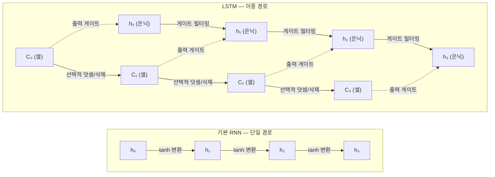
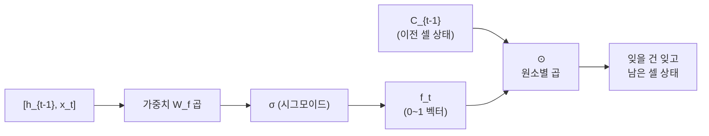
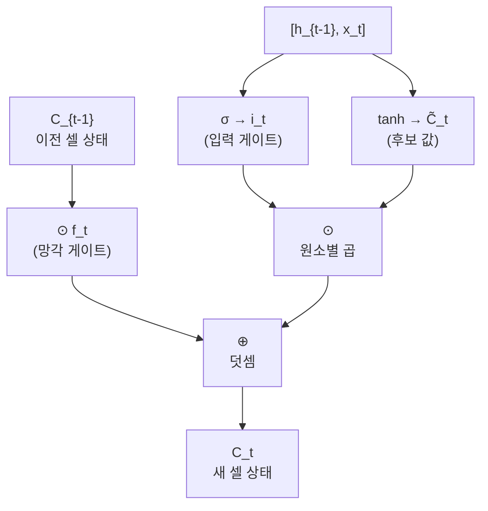
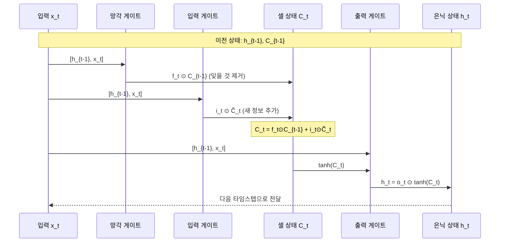
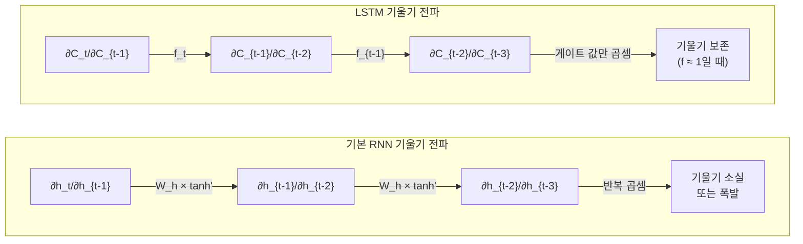

# LSTM: 장단기 메모리 네트워크

> RNN의 기울기 소실 문제를 해결한 LSTM의 게이트 메커니즘과 셀 상태를 이해합니다

## 개요

이 섹션에서는 기울기 소실 문제를 근본적으로 해결하기 위해 등장한 **LSTM(Long Short-Term Memory)** 네트워크의 구조와 원리를 학습합니다. 셀 상태(cell state)라는 별도의 메모리 경로가 어떻게 장기 의존성을 보존하는지, 세 가지 게이트가 어떤 역할을 하는지 직관과 수식 양쪽에서 깊이 있게 다룹니다.

**선수 지식**: [시퀀스 데이터와 RNN의 필요성](08-ch8-순환-신경망rnn-기초/01-01-시퀀스-데이터와-rnn의-필요성.md), [RNN의 구조와 순전파](08-ch8-순환-신경망rnn-기초/02-02-rnn의-구조와-순전파.md), [BPTT와 기울기 문제](08-ch8-순환-신경망rnn-기초/03-03-bptt와-기울기-문제.md)

**학습 목표**:
- LSTM의 탄생 동기와 기울기 소실 문제 해결 원리를 설명할 수 있다
- 셀 상태와 은닉 상태의 차이를 구분할 수 있다
- 망각 게이트, 입력 게이트, 출력 게이트의 수학적 정의를 이해한다
- PyTorch에서 LSTM 셀의 입출력 형태를 파악한다

> 💡 **표기 규칙**: 이 챕터 전체에서 **셀 상태는 대문자 $C_t$**, **은닉 상태는 소문자 $h_t$**로 표기합니다. 대문자 $C$는 LSTM 고유의 장기 메모리 경로임을 강조하기 위한 관례이며, 많은 교재와 논문에서 이 표기를 따릅니다.

## 왜 알아야 할까?

[앞서 BPTT와 기울기 문제](08-ch8-순환-신경망rnn-기초/03-03-bptt와-기울기-문제.md)에서 배운 것처럼, 기본 RNN은 시퀀스가 길어지면 기울기가 기하급수적으로 줄어들어 먼 과거의 정보를 거의 학습할 수 없습니다. "어제 비가 왔다"라는 정보가 50단어 뒤의 "우산"이라는 단어 예측에 영향을 주지 못하는 거죠.

LSTM은 이 문제를 **고속도로 같은 별도의 메모리 경로**를 만들어 해결했습니다. 1997년에 제안된 이후로 기계 번역, 음성 인식, 텍스트 생성 등 거의 모든 시퀀스 태스크의 표준 모델이 되었고, 트랜스포머가 등장하기 전까지 약 20년간 NLP의 핵심 아키텍처였습니다. 트랜스포머 시대인 지금도 LSTM의 게이트 메커니즘은 다양한 아키텍처에 영감을 주고 있으며, 어텐션 메커니즘을 이해하기 위한 필수 배경지식이기도 합니다.

## 핵심 개념

### 개념 1: 셀 상태(Cell State) — LSTM의 핵심 아이디어

> 💡 **비유**: 공항의 수하물 컨베이어 벨트를 떠올려 보세요. 가방(정보)이 벨트(셀 상태) 위를 쭉 흘러가면서, 필요한 곳에서만 새 가방이 올라오고, 목적지에 도착한 가방은 내려갑니다. 벨트 자체는 **큰 변형 없이 계속 움직이죠**. 기본 RNN은 매 정류장마다 모든 짐을 통째로 갈아치우는 셈인데, LSTM은 벨트 위에서 선택적으로 짐을 더하거나 빼는 방식입니다.

기본 RNN에서는 은닉 상태 $h_t$ 하나가 모든 정보를 담당합니다. 매 타임스텝마다 $\tanh$ 활성화를 거치면서 정보가 왜곡되고 희석되죠. LSTM은 여기에 **셀 상태(cell state)** $C_t$라는 별도의 메모리 라인을 추가합니다.

셀 상태의 핵심 특성은 **덧셈과 원소별 곱**만으로 업데이트된다는 점입니다. 비선형 활성화 함수를 직접 통과하지 않기 때문에, 기울기가 수백 스텝을 거쳐도 크게 줄어들지 않습니다. Hochreiter와 Schmidhuber는 이를 **"상수 오차 회전목마(Constant Error Carousel)"**라고 불렀습니다.

> 📊 **그림 1**: LSTM과 기본 RNN의 정보 흐름 비교



기본 RNN은 $h_t$ 하나의 경로만 있어서 매번 tanh를 거치며 정보가 변형되지만, LSTM은 셀 상태 $C_t$가 덧셈 기반으로 흘러가는 **고속도로 역할**을 하고, 은닉 상태 $h_t$는 셀 상태에서 출력 게이트를 통해 필터링된 결과입니다.

정리하면, LSTM 유닛에는 **두 가지 상태**가 흐릅니다:
- **셀 상태** $C_t$: 장기 기억 저장소 (컨베이어 벨트)
- **은닉 상태** $h_t$: 현재 출력에 사용되는 단기 기억 (작업대)

그리고 이 두 상태를 조절하는 것이 바로 **세 개의 게이트**입니다.

### 개념 2: 망각 게이트(Forget Gate) — 무엇을 버릴까?

> 💡 **비유**: 이사할 때 짐 정리를 생각해 보세요. 모든 물건을 살펴보면서 "이건 가져가고, 이건 버리자"라고 결정하죠. 망각 게이트는 바로 이 **정리 담당**입니다. 셀 상태에 저장된 과거 정보 중 어떤 것을 계속 간직하고, 어떤 것을 잊어버릴지 결정합니다.

흥미롭게도, 원래 1997년 LSTM에는 망각 게이트가 **없었습니다**. 2000년에 Felix Gers와 Schmidhuber가 "Learning to Forget"이라는 논문에서 추가한 거죠. 망각 게이트 없이는 셀 상태가 계속 누적만 되어서 결국 폭발하는 문제가 있었거든요.

수학적 정의:

$$f_t = \sigma(W_f \cdot [h_{t-1}, x_t] + b_f)$$

- $f_t$: 망각 게이트 출력 (0~1 사이 벡터)
- $\sigma$: 시그모이드 함수
- $W_f$: 망각 게이트의 가중치 행렬
- $[h_{t-1}, x_t]$: 이전 은닉 상태와 현재 입력을 연결(concatenation)
- $b_f$: 편향

시그모이드 출력이 0에 가까우면 "완전히 잊어라", 1에 가까우면 "전부 기억해라"라는 뜻입니다. 이 값이 셀 상태에 **원소별 곱(element-wise multiplication)**으로 적용됩니다.

> 📊 **그림 2**: 망각 게이트의 동작 흐름



예를 들어, "The cat, which was sitting on the mat, ..."이라는 문장에서 주어가 "cat"(단수)에서 새로운 주어로 바뀌면, 이전 주어의 단/복수 정보를 잊어야 합니다. 망각 게이트가 이 역할을 합니다.

### 개념 3: 입력 게이트(Input Gate) — 무엇을 기억할까?

> 💡 **비유**: 새로 이사한 집에 가구를 들일 때를 생각하세요. 모든 가구를 무조건 들이는 게 아니라, **"이건 들이고, 이건 안 들여도 돼"**라고 선별하죠. 입력 게이트는 새로운 정보 중 셀 상태에 저장할 만큼 중요한 것만 골라서 넣는 문지기입니다.

입력 게이트는 두 단계로 작동합니다:

**1단계 — 무엇을 업데이트할지 결정:**

$$i_t = \sigma(W_i \cdot [h_{t-1}, x_t] + b_i)$$

**2단계 — 후보 셀 상태 생성:**

$$\tilde{C}_t = \tanh(W_C \cdot [h_{t-1}, x_t] + b_C)$$

$i_t$는 "어느 값을 업데이트할지"를 결정하고, $\tilde{C}_t$는 "어떤 새 값을 넣을지"를 만들어냅니다. 이 둘의 원소별 곱 $i_t \odot \tilde{C}_t$가 실제로 셀 상태에 더해지는 새 정보입니다.

이제 **셀 상태 업데이트** 공식이 완성됩니다:

$$C_t = f_t \odot C_{t-1} + i_t \odot \tilde{C}_t$$

왼쪽 항은 "과거에서 살릴 것", 오른쪽 항은 "새로 넣을 것"입니다. 이 단순한 **덧셈 구조** 덕분에 기울기가 잘 보존되는 거죠.

> 📊 **그림 3**: 셀 상태 업데이트 — 망각과 입력의 결합



### 개념 4: 출력 게이트(Output Gate) — 무엇을 내보낼까?

> 💡 **비유**: 도서관 서고에 책이 잔뜩 있지만, 열람실에 꺼내놓는 건 지금 필요한 책뿐이죠. 출력 게이트는 셀 상태(서고)에 저장된 정보 중 **현재 타임스텝에서 밖으로 내보낼 부분만 골라내는** 역할을 합니다.

$$o_t = \sigma(W_o \cdot [h_{t-1}, x_t] + b_o)$$

$$h_t = o_t \odot \tanh(C_t)$$

셀 상태 $C_t$에 $\tanh$을 적용해서 값을 -1~1 범위로 조정한 뒤, 출력 게이트 $o_t$로 필터링하여 은닉 상태 $h_t$를 만듭니다. 이 $h_t$가 다음 타임스텝으로 전달되고, 동시에 현재 스텝의 예측값 계산에도 사용됩니다.

> 📊 **그림 4**: LSTM 전체 데이터 흐름 (한 타임스텝)



### 개념 5: LSTM 전체 수식 정리와 기울기 보존 원리

LSTM의 모든 수식을 한 곳에 모아보겠습니다:

| 게이트/상태 | 수식 | 역할 |
|------------|------|------|
| 망각 게이트 | $f_t = \sigma(W_f[h_{t-1}, x_t] + b_f)$ | 과거 정보 삭제 비율 결정 |
| 입력 게이트 | $i_t = \sigma(W_i[h_{t-1}, x_t] + b_i)$ | 새 정보 저장 비율 결정 |
| 후보 셀 | $\tilde{C}_t = \tanh(W_C[h_{t-1}, x_t] + b_C)$ | 새로 저장할 후보 값 |
| 셀 상태 | $C_t = f_t \odot C_{t-1} + i_t \odot \tilde{C}_t$ | 장기 메모리 업데이트 |
| 출력 게이트 | $o_t = \sigma(W_o[h_{t-1}, x_t] + b_o)$ | 출력할 정보 선택 |
| 은닉 상태 | $h_t = o_t \odot \tanh(C_t)$ | 현재 출력/단기 기억 |

왜 기울기가 잘 보존될까요? 핵심은 셀 상태 업데이트 공식 $C_t = f_t \odot C_{t-1} + ...$에 있습니다. $C_t$를 $C_{t-1}$로 편미분하면 $\frac{\partial C_t}{\partial C_{t-1}} = f_t$가 됩니다. 기본 RNN에서는 이 편미분에 가중치 행렬과 활성화 함수 미분이 곱해져서 기울기가 폭발하거나 소실되지만, LSTM에서는 망각 게이트 $f_t$만 곱해집니다. $f_t$가 1에 가까우면 기울기가 거의 그대로 전파되죠 — 이것이 "상수 오차 회전목마"의 핵심입니다.

> 📊 **그림 5**: 기울기 전파 비교 — 기본 RNN vs LSTM




## 실습: 직접 해보기

PyTorch의 `nn.LSTMCell`을 사용하여 LSTM의 입출력을 직접 확인해봅시다.

```run:python
import torch
import torch.nn as nn

# 시드 고정
torch.manual_seed(42)

# 하이퍼파라미터 설정
input_size = 4    # 입력 특성 수
hidden_size = 8   # 은닉 상태 크기
seq_len = 3       # 시퀀스 길이
batch_size = 2    # 배치 크기

# LSTMCell 생성
lstm_cell = nn.LSTMCell(input_size, hidden_size)

# 입력 시퀀스 생성 (seq_len, batch_size, input_size)
x = torch.randn(seq_len, batch_size, input_size)

# 초기 상태 (은닉 상태 h_0, 셀 상태 C_0)
h_t = torch.zeros(batch_size, hidden_size)
C_t = torch.zeros(batch_size, hidden_size)

print(f"입력 크기: {x.shape}")
print(f"초기 은닉 상태 크기: {h_t.shape}")
print(f"초기 셀 상태 크기: {C_t.shape}")
print()

# 각 타임스텝별로 LSTM 셀 실행
for t in range(seq_len):
    h_t, C_t = lstm_cell(x[t], (h_t, C_t))  # 핵심: h_t와 C_t 모두 반환
    print(f"타임스텝 {t+1}:")
    print(f"  은닉 상태 h_t 범위: [{h_t.min():.4f}, {h_t.max():.4f}]")
    print(f"  셀 상태 C_t 범위: [{C_t.min():.4f}, {C_t.max():.4f}]")
```

```output
입력 크기: torch.Size([3, 2, 4])
초기 은닉 상태 크기: torch.Size([2, 8])
초기 셀 상태 크기: torch.Size([2, 8])

타임스텝 1:
  은닉 상태 h_t 범위: [-0.1547, 0.1666]
  셀 상태 C_t 범위: [-0.3289, 0.3143]
타임스텝 2:
  은닉 상태 h_t 범위: [-0.1942, 0.1545]
  셀 상태 C_t 범위: [-0.5044, 0.4410]
타임스텝 3:
  은닉 상태 h_t 범위: [-0.2148, 0.1973]
  셀 상태 C_t 범위: [-0.5766, 0.5816]
```

은닉 상태 $h_t$는 항상 -1~1 범위(tanh 적용 + 출력 게이트 필터)인 반면, 셀 상태 $C_t$는 누적될 수 있어서 범위가 조금 더 넓어지는 것을 확인할 수 있습니다.

이제 `nn.LSTM` 모듈을 사용하는 더 실용적인 방법을 살펴봅시다:

```python
import torch
import torch.nn as nn

torch.manual_seed(42)

# nn.LSTM은 전체 시퀀스를 한 번에 처리
lstm = nn.LSTM(
    input_size=4,      # 입력 특성 수
    hidden_size=8,     # 은닉 상태 크기
    num_layers=1,      # LSTM 레이어 수
    batch_first=True   # 입력 형태: (batch, seq_len, input_size)
)

# batch_first=True이므로 (batch_size, seq_len, input_size)
x = torch.randn(2, 3, 4)

# output: 모든 타임스텝의 h_t / (h_n, C_n): 마지막 타임스텝의 상태
output, (h_n, C_n) = lstm(x)

print(f"전체 출력 크기: {output.shape}")    # (batch, seq_len, hidden_size)
print(f"마지막 은닉 상태: {h_n.shape}")      # (num_layers, batch, hidden_size)
print(f"마지막 셀 상태: {C_n.shape}")        # (num_layers, batch, hidden_size)
```

> 🔥 **실무 팁**: `batch_first=True`를 설정하면 입력 텐서가 `(batch, seq_len, features)` 형태가 되어 직관적입니다. 설정하지 않으면 기본값은 `(seq_len, batch, features)`인데, 이 때문에 차원 불일치 에러를 겪는 초보자가 정말 많습니다.

게이트 내부의 가중치도 직접 확인해볼 수 있습니다:

```run:python
import torch
import torch.nn as nn

lstm = nn.LSTM(input_size=4, hidden_size=8, num_layers=1)

# LSTM의 가중치 구조 확인
for name, param in lstm.named_parameters():
    print(f"{name}: {param.shape}")
```

```output
weight_ih_l0: torch.Size([32, 4])
weight_hh_l0: torch.Size([32, 8])
bias_ih_l0: torch.Size([32])
bias_hh_l0: torch.Size([32])
```

가중치 크기가 `[32, ...]`인 이유가 보이시나요? `32 = 4 × 8(hidden_size)`입니다. PyTorch는 4개의 게이트(입력, 망각, 셀 후보, 출력)의 가중치를 **하나의 큰 행렬로 합쳐서** 한 번의 행렬 곱으로 계산합니다. GPU 병렬 연산에 훨씬 효율적이거든요.

## 더 깊이 알아보기

### LSTM의 탄생 이야기

LSTM의 역사는 좌절과 돌파의 드라마입니다. 1991년, 독일 뮌헨 공과대학의 박사과정 학생이었던 **Sepp Hochreiter**는 지도교수 **Jürgen Schmidhuber**의 지도 아래 RNN의 기울기 소실 문제를 체계적으로 분석한 졸업논문을 발표합니다. 문제는 명확히 진단했지만, 해결책은 6년 더 걸렸죠.

1997년, 두 사람은 마침내 "Long Short-Term Memory"라는 제목의 논문을 *Neural Computation* 저널에 발표합니다. 이름이 재미있는데요 — "Long Short-Term Memory"는 "**짧은(short-term) 기억을 오래(long) 유지하는**" 메모리라는 뜻입니다. 기존 RNN의 단기 기억 한계를 장기로 확장한다는 의미가 담겨 있죠.

원래 LSTM에는 입력 게이트와 출력 게이트만 있었습니다. **망각 게이트는 2000년에 Felix Gers가 추가**했는데요, 실험 중 셀 상태가 끝없이 커지는 문제를 발견하고 "학습하여 잊는 법(Learning to Forget)"이라는 논문으로 해결한 겁니다. 지금 우리가 아는 3-게이트 LSTM은 사실 원본이 아니라 개선판인 셈이죠.

놀랍게도, LSTM은 발표 후 약 10년간 큰 주목을 받지 못했습니다. 2010년대 들어 GPU 연산이 보편화되고 대규모 시퀀스 데이터가 쏟아지면서, Google의 음성 인식(2012), 기계 번역(2014) 등에서 폭발적인 성과를 내며 재조명되었습니다.

### 파라미터 수 비교

LSTM이 기본 RNN보다 얼마나 더 많은 파라미터를 가지는지 계산해봅시다. 입력 크기 $n$, 은닉 크기 $h$일 때:

- **기본 RNN**: $(n+h) \times h + h = (n+h+1) \times h$ 개
- **LSTM**: $4 \times [(n+h) \times h + h] = 4 \times (n+h+1) \times h$ 개

LSTM은 게이트가 4개(입력, 망각, 셀 후보, 출력)이므로 파라미터가 정확히 **4배**입니다. 이것이 LSTM의 트레이드오프죠 — 더 많은 파라미터로 더 강력한 기억력을 얻습니다.

## 흔한 오해와 팁

> ⚠️ **흔한 오해**: "LSTM은 기울기 소실을 *완전히* 해결한다" — 사실이 아닙니다. LSTM은 기울기 소실을 크게 **완화**하지만, 극도로 긴 시퀀스(수천 스텝 이상)에서는 여전히 어려움을 겪을 수 있습니다. 이것이 결국 어텐션 메커니즘과 트랜스포머가 등장하게 된 이유이기도 합니다.

> 💡 **알고 계셨나요?**: LSTM 논문(Hochreiter & Schmidhuber, 1997)은 2024년 기준 인용 수 9만 회를 넘겨, 딥러닝 역사상 가장 많이 인용된 논문 중 하나입니다. Google Scholar에서 "deep learning"으로 검색했을 때 상위 5위 안에 들어갑니다.

> 🔥 **실무 팁**: PyTorch에서 `nn.LSTM`의 `num_layers` 파라미터로 LSTM을 쌓을(stack) 수 있습니다. 일반적으로 2-3층이면 충분하고, 그 이상은 과적합 위험이 커집니다. 층을 쌓을 때는 `dropout` 파라미터도 함께 설정하세요 (`nn.LSTM(..., num_layers=2, dropout=0.3)`).

> ⚠️ **흔한 오해**: "셀 상태와 은닉 상태는 비슷한 것이다" — 전혀 다릅니다! 셀 상태 $C_t$는 장기 기억 저장소로 외부에 직접 노출되지 않고, 은닉 상태 $h_t$는 셀 상태를 필터링한 현재 출력입니다. 텍스트 분류에서 마지막 타임스텝의 출력을 쓸 때는 $h_t$를 사용하지, $C_t$를 직접 쓰지 않습니다.

## 핵심 정리

| 개념 | 설명 |
|------|------|
| 셀 상태(Cell State) $C_t$ | 덧셈 기반으로 업데이트되는 장기 메모리 경로. 기울기 보존의 핵심 |
| 은닉 상태(Hidden State) $h_t$ | 셀 상태를 출력 게이트로 필터링한 현재 출력/단기 기억 |
| 망각 게이트 | $f_t = \sigma(W_f[h_{t-1},x_t]+b_f)$ — 과거 정보의 삭제 비율 결정 |
| 입력 게이트 | $i_t = \sigma(W_i[h_{t-1},x_t]+b_i)$ — 새 정보의 저장 비율 결정 |
| 후보 셀 | $\tilde{C}_t = \tanh(W_C[h_{t-1},x_t]+b_C)$ — 저장할 새 정보 후보 |
| 출력 게이트 | $o_t = \sigma(W_o[h_{t-1},x_t]+b_o)$ — 셀 상태에서 출력할 비율 결정 |
| 상수 오차 회전목마 | $\partial C_t / \partial C_{t-1} = f_t$로, 기울기가 게이트 값만큼만 감쇠 |
| 파라미터 수 | 기본 RNN의 4배 (게이트 4개: 입력, 망각, 셀 후보, 출력) |
| 표기 규칙 | 셀 상태는 대문자 $C_t$, 은닉 상태는 소문자 $h_t$ |

## 다음 섹션 미리보기

LSTM이 강력하지만, 4개의 가중치 행렬은 연산 비용이 적지 않습니다. 다음 섹션 [GRU: 게이트 순환 유닛](09-ch9-lstm과-gru/02-02-gru-게이트-순환-유닛.md)에서는 LSTM의 게이트를 2개로 줄이면서도 비슷한 성능을 내는 **GRU(Gated Recurrent Unit)**를 배웁니다. 망각 게이트와 입력 게이트를 하나로 합치고, 셀 상태를 없앤 더 가벼운 구조가 어떻게 가능한지 알아보겠습니다.

## 참고 자료

- [Long Short-Term Memory (Hochreiter & Schmidhuber, 1997)](https://direct.mit.edu/neco/article/9/8/1735/6109/Long-Short-Term-Memory) - LSTM 원본 논문. 상수 오차 회전목마 개념의 원전
- [Learning to Forget: Continual Prediction with LSTM (Gers et al., 2000)](https://dl.acm.org/doi/10.1162/089976600300015015) - 망각 게이트를 추가한 핵심 후속 논문
- [PyTorch nn.LSTM 공식 문서](https://docs.pytorch.org/docs/stable/generated/torch.nn.LSTM.html) - PyTorch LSTM 모듈의 전체 API 레퍼런스
- [Stanford CS 224N: NLP with Deep Learning](https://web.stanford.edu/class/cs224n/) - LSTM을 포함한 시퀀스 모델 강의 자료
- [graykode/nlp-tutorial](https://github.com/graykode/nlp-tutorial) - LSTM 등 NLP 모델의 간결한 PyTorch 구현 모음
- [LSTM: A Search Space Odyssey (Greff et al., 2015)](https://arxiv.org/abs/1503.04069) - LSTM 변형들의 체계적 비교 실험 (8가지 변형 테스트)

---
### 🔗 Related Sessions
- [tanh](07-ch7-pytorch-기초와-신경망-입문/03-03-nnmodule로-신경망-정의하기.md) (prerequisite)
- [sigmoid](07-ch7-pytorch-기초와-신경망-입문/03-03-nnmodule로-신경망-정의하기.md) (prerequisite)


---
### 🔗 Related Sessions
- [tanh](07-ch7-pytorch-기초와-신경망-입문/03-03-nnmodule로-신경망-정의하기.md) (prerequisite)
- [sigmoid](07-ch7-pytorch-기초와-신경망-입문/03-03-nnmodule로-신경망-정의하기.md) (prerequisite)


---
### 🔗 Related Sessions
- [tanh](07-ch7-pytorch-기초와-신경망-입문/03-03-nnmodule로-신경망-정의하기.md) (prerequisite)
- [sigmoid](07-ch7-pytorch-기초와-신경망-입문/03-03-nnmodule로-신경망-정의하기.md) (prerequisite)


---
### 🔗 Related Sessions
- [tanh](07-ch7-pytorch-기초와-신경망-입문/03-03-nnmodule로-신경망-정의하기.md) (prerequisite)
- [sigmoid](07-ch7-pytorch-기초와-신경망-입문/03-03-nnmodule로-신경망-정의하기.md) (prerequisite)


---
### 🔗 Related Sessions
- [tanh](07-ch7-pytorch-기초와-신경망-입문/03-03-nnmodule로-신경망-정의하기.md) (prerequisite)
- [sigmoid](07-ch7-pytorch-기초와-신경망-입문/03-03-nnmodule로-신경망-정의하기.md) (prerequisite)
