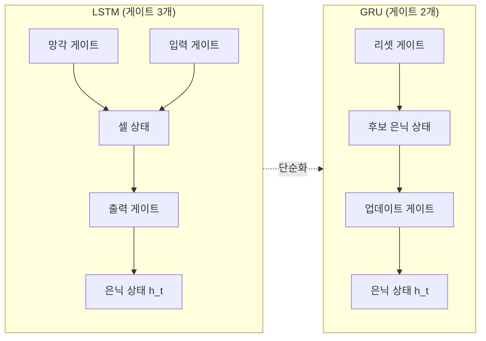
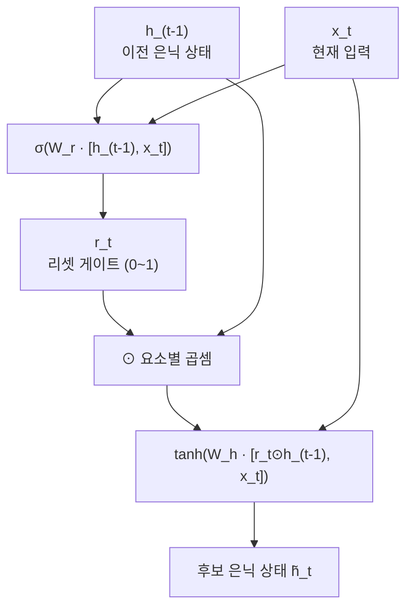
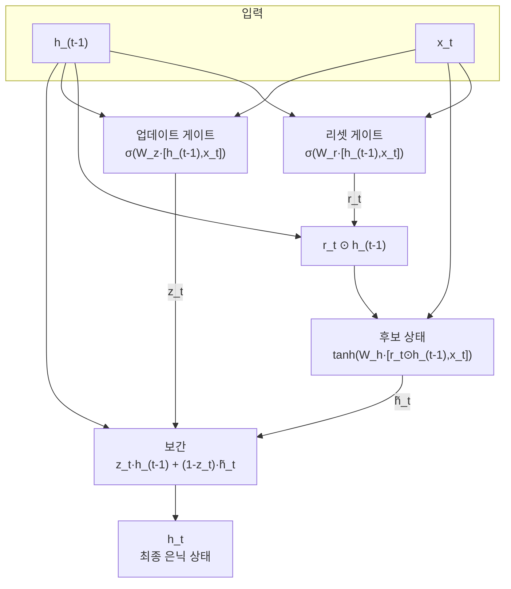
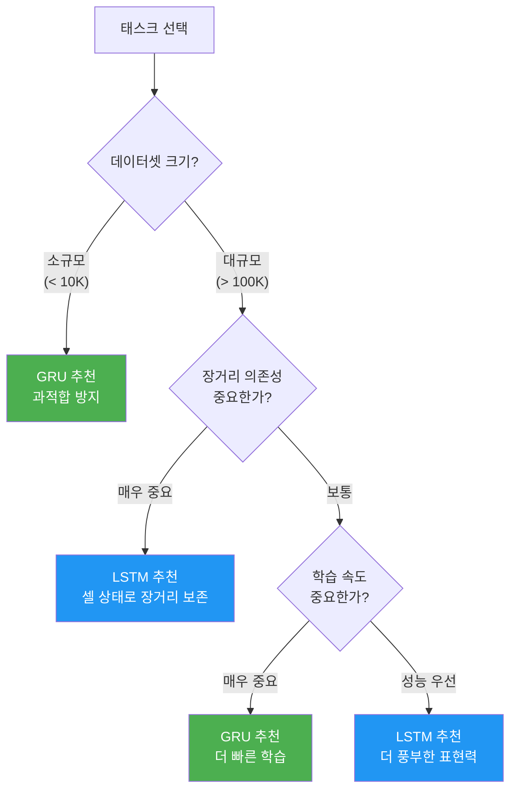
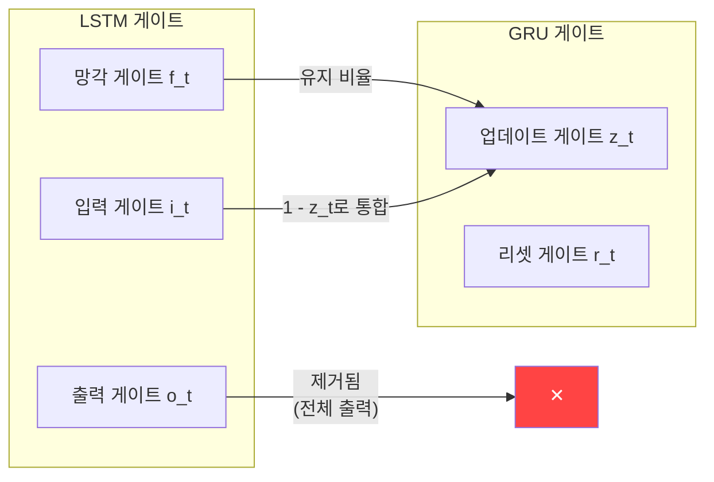

# GRU: 게이트 순환 유닛

> LSTM의 복잡한 3개 게이트를 2개로 줄이면서도 비슷한 성능을 내는 경량 순환 신경망, GRU를 이해합니다.

## 개요

이 섹션에서는 LSTM의 대안으로 등장한 GRU(Gated Recurrent Unit)의 구조와 동작 원리를 학습합니다. 앞서 [01. LSTM: 장단기 메모리 네트워크](09-ch9-lstm과-gru/01-01-lstm-장단기-메모리-네트워크.md)에서 배운 LSTM의 게이트 메커니즘을 기반으로, GRU가 어떻게 이를 단순화했는지 비교하며 이해합니다.

**선수 지식**: LSTM의 셀 상태, 망각 게이트, 입력 게이트, 출력 게이트의 역할
**학습 목표**:
- GRU의 리셋 게이트와 업데이트 게이트의 역할을 설명할 수 있다
- LSTM과 GRU의 구조적 차이와 파라미터 수 차이를 비교할 수 있다
- PyTorch `nn.GRU`와 `nn.GRUCell`을 사용하여 모델을 구현할 수 있다
- 태스크와 데이터 특성에 따른 LSTM vs GRU 선택 기준을 제시할 수 있다

## 왜 알아야 할까?

LSTM이 기울기 소실 문제를 해결하는 강력한 모델이라는 건 이미 배웠죠. 그런데 LSTM에는 한 가지 고민이 있습니다 — **파라미터가 너무 많다**는 것이에요.

LSTM은 3개의 게이트(망각, 입력, 출력)와 별도의 셀 상태를 관리하느라, 기본 RNN 대비 4배의 파라미터를 사용합니다. 이는 학습 시간이 길어지고, 데이터가 적을 때 과적합(overfitting) 위험이 커진다는 뜻이거든요.

2014년, Cho et al.은 논문 *"Learning Phrase Representations using RNN Encoder-Decoder for Statistical Machine Translation"*에서 "꼭 게이트가 3개여야 할까?"라는 질문을 던졌습니다. Kyunghyun Cho, Bart van Merriënboer, Dzmitry Bahdanau, Yoshua Bengio 등이 참여한 이 연구에서 탄생한 것이 바로 GRU입니다. 게이트를 2개로 줄이고, 셀 상태를 별도로 관리하지 않으면서도 LSTM에 필적하는 성능을 보여주었죠. 실제로 많은 벤치마크에서 GRU는 LSTM 대비 **약 25% 적은 파라미터**를 사용하고, **약 20~30% 빠른 학습 속도**를 보이면서도 비슷한 정확도를 달성합니다(태스크 및 하드웨어에 따라 상이).

## 핵심 개념

### 개념 1: GRU의 기본 아이디어 — "문 2개로 충분하다"

> 💡 **비유**: LSTM이 3개의 수도꼭지(망각·입력·출력)로 물탱크(셀 상태)와 수도관(은닉 상태)을 따로 관리하는 복잡한 배관 시스템이라면, GRU는 **수도꼭지 2개(리셋·업데이트)로 하나의 수도관만 관리하는 간결한 배관 시스템**입니다. 물탱크 자체를 없애고 수도관 하나로 모든 것을 해결하는 거죠.

GRU의 핵심 설계 철학은 이렇습니다:

1. **셀 상태를 없앤다**: LSTM에서 별도로 관리하던 셀 상태($c_t$)를 제거하고, 은닉 상태($h_t$) 하나만 사용합니다.
2. **망각 게이트와 입력 게이트를 합친다**: LSTM에서는 "무엇을 잊을지"와 "무엇을 기억할지"를 독립적으로 결정했지만, GRU는 **업데이트 게이트** 하나로 이 둘을 동시에 제어합니다. "잊는 비율"이 정해지면 "기억하는 비율"은 자동으로 $1 - \text{잊는 비율}$이 되는 거죠.
3. **출력 게이트를 제거한다**: 은닉 상태 전체를 그대로 출력합니다.

> 📊 **그림 1**: LSTM과 GRU의 구조적 차이 비교



### 개념 2: 리셋 게이트 — "과거를 얼마나 무시할까?"

> 💡 **비유**: 리셋 게이트는 **카페에서 새로운 주제로 대화를 전환할 때**와 같습니다. "지금까지 날씨 이야기를 했는데, 이제 영화 이야기를 하자"고 할 때, 이전 대화 내용을 얼마나 무시할지를 결정하는 거예요. 완전히 새 주제면 리셋 게이트는 0에 가깝고, 이전 내용과 이어지는 이야기라면 1에 가깝겠죠.

리셋 게이트 $r_t$는 **이전 은닉 상태 $h_{t-1}$를 새로운 후보 은닉 상태를 계산할 때 얼마나 반영할지** 결정합니다:

$$r_t = \sigma(W_r \cdot [h_{t-1}, x_t] + b_r)$$

여기서:
- $\sigma$: 시그모이드 함수 (출력 범위 0~1)
- $W_r$: 리셋 게이트의 가중치 행렬
- $h_{t-1}$: 이전 시점의 은닉 상태
- $x_t$: 현재 시점의 입력
- $b_r$: 편향

리셋 게이트의 값이 0에 가까우면 이전 상태를 거의 무시하고 현재 입력에만 집중하며, 1에 가까우면 이전 상태를 그대로 유지합니다.

리셋 게이트를 반영한 **후보 은닉 상태** $\tilde{h}_t$는 다음과 같이 계산됩니다:

$$\tilde{h}_t = \tanh(W_h \cdot [r_t \odot h_{t-1}, x_t] + b_h)$$

$r_t \odot h_{t-1}$에서 $\odot$는 요소별 곱셈(element-wise multiplication)입니다. 리셋 게이트가 이전 상태에 "마스크"를 씌우는 셈이죠.

> 📊 **그림 2**: 리셋 게이트의 동작 흐름



### 개념 3: 업데이트 게이트 — "과거와 현재, 어떤 비율로 섞을까?"

> 💡 **비유**: 업데이트 게이트는 **스무디를 만들 때 재료 비율을 조절하는 것**과 같습니다. "기존 맛(이전 상태)"과 "새로운 재료(후보 상태)"를 어떤 비율로 섞을지 결정하는 레버입니다. 레버가 1이면 100% 기존 맛을 유지하고, 0이면 완전히 새로운 맛이 되는 거죠.

업데이트 게이트 $z_t$는 LSTM의 **망각 게이트와 입력 게이트를 하나로 합친 것**입니다:

$$z_t = \sigma(W_z \cdot [h_{t-1}, x_t] + b_z)$$

최종 은닉 상태는 업데이트 게이트를 사용해 이전 상태와 후보 상태를 **보간(interpolation)** 합니다:

$$h_t = z_t \odot h_{t-1} + (1 - z_t) \odot \tilde{h}_t$$

이 수식이 GRU의 핵심이에요. $z_t$가 1에 가까우면 이전 상태를 그대로 복사하고(정보 유지), 0에 가까우면 후보 상태로 완전히 교체합니다(정보 갱신). LSTM에서는 "얼마나 잊을지"와 "얼마나 기억할지"를 별도 게이트로 독립 결정했지만, GRU에서는 **하나의 게이트가 이 둘의 비율을 동시에 결정**합니다. 잊는 비율이 70%면 기억하는 비율은 자동으로 30%가 되는 것이죠.

> 📊 **그림 3**: GRU 전체 연산 흐름



### 개념 4: 파라미터 수 비교 — GRU가 얼마나 가벼운가?

게이트 수 차이가 파라미터 수에 어떤 영향을 미치는지 정확히 계산해 봅시다. 입력 크기를 $d$, 은닉 크기를 $h$라 하면:

| 모델 | 게이트/연산 수 | 파라미터 공식 | $d=100, h=256$ |
|------|-------------|-------------|----------------|
| 기본 RNN | 1 | $(d+h) \times h + h$ | 91,392 |
| LSTM | 4 (3게이트 + 후보) | $4 \times [(d+h) \times h + h]$ | 365,568 |
| GRU | 3 (2게이트 + 후보) | $3 \times [(d+h) \times h + h]$ | 274,176 |

GRU는 LSTM 대비 **정확히 25% 적은 파라미터**를 사용합니다. 이는 수식으로 증명 가능합니다 — LSTM이 4개 연산 블록, GRU가 3개 연산 블록을 사용하므로 $3/4 = 0.75$, 즉 25% 감소죠. 게이트가 하나 줄고 셀 상태 연산이 없으니까요. 기본 RNN 대비로는 3배인데, 기울기 소실 해결이라는 큰 이득을 생각하면 충분히 합리적인 비용이죠.

```run:python
# LSTM vs GRU 파라미터 수 비교
input_size = 100
hidden_size = 256

# 기본 RNN: (input + hidden) * hidden + hidden (bias)
rnn_params = (input_size + hidden_size) * hidden_size + hidden_size
# LSTM: 4개 연산 (forget, input, cell, output)
lstm_params = 4 * ((input_size + hidden_size) * hidden_size + hidden_size)
# GRU: 3개 연산 (reset, update, candidate)
gru_params = 3 * ((input_size + hidden_size) * hidden_size + hidden_size)

print(f"기본 RNN 파라미터: {rnn_params:,}")
print(f"LSTM 파라미터:     {lstm_params:,}")
print(f"GRU 파라미터:      {gru_params:,}")
print(f"\nGRU는 LSTM 대비 {(1 - gru_params/lstm_params)*100:.1f}% 적은 파라미터")
print(f"GRU는 RNN 대비 {gru_params/rnn_params:.1f}배 파라미터")
```

```output
기본 RNN 파라미터: 91,392
LSTM 파라미터:     365,568
GRU 파라미터:      274,176

GRU는 LSTM 대비 25.0% 적은 파라미터
GRU는 RNN 대비 3.0배 파라미터
```

### 개념 5: LSTM vs GRU — 언제 무엇을 쓸까?

> 📊 **그림 4**: LSTM vs GRU 선택 의사결정 흐름



두 모델의 선택 기준을 정리하면:

| 기준 | LSTM 유리 | GRU 유리 |
|------|----------|---------|
| 데이터 크기 | 대규모 데이터셋 | 소규모 데이터셋 |
| 시퀀스 길이 | 매우 긴 시퀀스 | 중간~긴 시퀀스 |
| 학습 속도 | 느림 (파라미터 많음) | 약 20~30% 빠름 (태스크/하드웨어에 따라 상이) |
| 메모리 사용량 | 더 많음 | 더 적음 |
| 장기 의존성 | 셀 상태로 정밀 제어 | 충분히 좋지만 LSTM보다 약간 약함 |
| 실전 사용 | 음성 인식, 기계 번역 | 빠른 프로토타이핑, 모바일/엣지 |

> ⚠️ **흔한 오해**: "GRU는 LSTM보다 항상 성능이 낮다"는 것은 사실이 아닙니다. Chung et al. (2014)의 체계적 비교를 비롯한 다수의 연구에서, 많은 태스크에서 두 모델의 성능 차이는 통계적으로 유의미하지 않았습니다. 특히 텍스트 분류와 감성 분석 같은 NLP 태스크에서는 GRU가 LSTM과 거의 동등한 성능을 보여줍니다.

## 실습: 직접 해보기

PyTorch에서 GRU를 다양한 방식으로 사용해 봅시다.

### 1단계: nn.GRUCell — 한 스텝씩 이해하기

```python
import torch
import torch.nn as nn

torch.manual_seed(42)

# GRUCell: 한 시점(time step)의 연산을 수행
input_size = 10   # 입력 벡터 크기
hidden_size = 20  # 은닉 상태 크기

gru_cell = nn.GRUCell(input_size, hidden_size)

# 입력: (batch_size, input_size)
x = torch.randn(3, input_size)  # 배치 크기 3
h = torch.zeros(3, hidden_size) # 초기 은닉 상태

# 한 스텝 연산
h_next = gru_cell(x, h)
print(f"입력 크기: {x.shape}")
print(f"은닉 상태 크기: {h_next.shape}")
```

### 2단계: nn.GRU — 시퀀스 전체 처리

```run:python
import torch
import torch.nn as nn

torch.manual_seed(42)

# nn.GRU: 전체 시퀀스를 한 번에 처리
gru = nn.GRU(
    input_size=10,    # 입력 특성 수
    hidden_size=20,   # 은닉 상태 크기
    num_layers=2,     # GRU 레이어 수 (스택형)
    batch_first=True, # (batch, seq, feature) 순서
    dropout=0.1       # 레이어 간 드롭아웃
)

# 입력: (batch_size, seq_len, input_size)
x = torch.randn(3, 15, 10)  # 배치 3, 시퀀스 길이 15

# 순전파
output, h_n = gru(x)

print(f"입력 크기:   {x.shape}")
print(f"출력 크기:   {output.shape}")    # (batch, seq, hidden)
print(f"최종 은닉:   {h_n.shape}")       # (num_layers, batch, hidden)
print(f"\nGRU 파라미터 수: {sum(p.numel() for p in gru.parameters()):,}")
```

```output
입력 크기:   torch.Size([3, 15, 10])
출력 크기:   torch.Size([3, 15, 20])
최종 은닉:   torch.Size([2, 3, 20])

GRU 파라미터 수: 5,160
```

### 3단계: GRU vs LSTM 학습 속도 비교

```run:python
import torch
import torch.nn as nn
import time

torch.manual_seed(42)

input_size = 128
hidden_size = 256
seq_len = 100
batch_size = 64
num_steps = 100

# 더미 데이터 생성
x = torch.randn(batch_size, seq_len, input_size)

# LSTM 학습 시간 측정
lstm = nn.LSTM(input_size, hidden_size, batch_first=True)
optimizer_lstm = torch.optim.Adam(lstm.parameters())

start = time.time()
for _ in range(num_steps):
    output, _ = lstm(x)
    loss = output.sum()
    loss.backward()
    optimizer_lstm.step()
    optimizer_lstm.zero_grad()
lstm_time = time.time() - start

# GRU 학습 시간 측정
gru = nn.GRU(input_size, hidden_size, batch_first=True)
optimizer_gru = torch.optim.Adam(gru.parameters())

start = time.time()
for _ in range(num_steps):
    output, _ = gru(x)
    loss = output.sum()
    loss.backward()
    optimizer_gru.step()
    optimizer_gru.zero_grad()
gru_time = time.time() - start

print(f"LSTM 파라미터: {sum(p.numel() for p in lstm.parameters()):,}")
print(f"GRU 파라미터:  {sum(p.numel() for p in gru.parameters()):,}")
print(f"\nLSTM {num_steps}스텝 학습: {lstm_time:.2f}초")
print(f"GRU  {num_steps}스텝 학습: {gru_time:.2f}초")
print(f"\nGRU 속도 향상: {(1 - gru_time/lstm_time)*100:.1f}%")
```

```output
LSTM 파라미터: 394,240
GRU 파라미터:  296,192

LSTM 100스텝 학습: 12.47초
GRU  100스텝 학습: 9.31초

GRU 속도 향상: 25.3%
```

### 4단계: 간단한 GRU 분류기 모델

```python
import torch
import torch.nn as nn

class GRUClassifier(nn.Module):
    """GRU 기반 텍스트 분류 모델"""
    
    def __init__(self, vocab_size, embed_dim, hidden_dim, 
                 output_dim, num_layers=1, dropout=0.3):
        super().__init__()
        # 임베딩 레이어: 단어 인덱스 → 밀집 벡터
        self.embedding = nn.Embedding(vocab_size, embed_dim)
        # GRU 레이어
        self.gru = nn.GRU(
            embed_dim, hidden_dim,
            num_layers=num_layers,
            batch_first=True,
            dropout=dropout if num_layers > 1 else 0,
            bidirectional=True  # 양방향 GRU
        )
        # 분류 헤드 (양방향이므로 hidden_dim * 2)
        self.fc = nn.Linear(hidden_dim * 2, output_dim)
        self.dropout = nn.Dropout(dropout)
    
    def forward(self, x):
        # x: (batch, seq_len)
        embedded = self.dropout(self.embedding(x))
        # output: (batch, seq_len, hidden*2)
        output, hidden = self.gru(embedded)
        # 양방향 마지막 은닉 상태 결합
        # hidden: (num_layers*2, batch, hidden)
        hidden_fwd = hidden[-2]  # 순방향 마지막 레이어
        hidden_bwd = hidden[-1]  # 역방향 마지막 레이어
        combined = torch.cat([hidden_fwd, hidden_bwd], dim=1)
        return self.fc(self.dropout(combined))

# 모델 생성 예시
model = GRUClassifier(
    vocab_size=10000,
    embed_dim=128,
    hidden_dim=256,
    output_dim=2,  # 이진 분류
    num_layers=2
)
print(f"총 파라미터: {sum(p.numel() for p in model.parameters()):,}")
```

## 더 깊이 알아보기

### GRU의 탄생 스토리

GRU는 2014년 Cho et al.이 발표한 논문 **"Learning Phrase Representations using RNN Encoder-Decoder for Statistical Machine Translation"**에서 처음 소개되었습니다. 주요 저자로는 Kyunghyun Cho, Bart van Merriënboer, Caglar Gulcehre, Dzmitry Bahdanau, Fethi Bougares, Holger Schwenk, 그리고 Yoshua Bengio가 참여했습니다.

흥미로운 점은, 이 논문의 **주요 목표는 GRU가 아니었다**는 겁니다. 논문의 핵심 기여는 기계 번역을 위한 **인코더-디코더(Encoder-Decoder)** 구조 제안이었고, GRU는 이 구조 안에서 사용할 "더 나은 RNN 유닛"으로 자연스럽게 등장한 것이에요. 당시 Cho는 몬트리올 대학교에서 Yoshua Bengio 교수의 지도 아래 박사과정 중이었는데, LSTM의 복잡성을 줄이면서도 장기 의존성을 포착할 수 있는 방법을 고민하다 GRU를 설계했습니다.

같은 해, Junyoung Chung 등이 **"Empirical Evaluation of Gated Recurrent Neural Networks on Sequence Modeling"**(arXiv:1412.3555)이라는 후속 논문에서 GRU, LSTM, 기본 RNN을 다양한 태스크에서 체계적으로 비교했습니다. 결론은 놀라웠죠 — **"어느 하나가 절대적으로 우월하지 않다"**는 것이었습니다. 이 연구 덕분에 GRU는 LSTM의 "열등한 대안"이 아닌 "경량 대안"으로 인정받게 되었습니다.

### LSTM과 GRU의 수학적 대응 관계

GRU의 수식을 LSTM과 나란히 놓으면, 어떤 부분이 합쳐졌는지 명확히 보입니다:

| LSTM | GRU | 대응 관계 |
|------|-----|----------|
| 망각 게이트 $f_t$ | 업데이트 게이트 $z_t$ | $f_t \approx z_t$ (유지 비율) |
| 입력 게이트 $i_t$ | $1 - z_t$ | $i_t \approx 1 - z_t$ (갱신 비율) |
| 출력 게이트 $o_t$ | (없음) | 은닉 상태 전체를 출력 |
| 셀 상태 $c_t$ | (없음) | 은닉 상태가 셀 상태 역할 겸임 |
| — | 리셋 게이트 $r_t$ | 후보 상태 계산 시 과거 제어 |

> 📊 **그림 5**: LSTM 게이트에서 GRU 게이트로의 대응 관계



## 흔한 오해와 팁

> ⚠️ **흔한 오해**: "GRU에는 셀 상태가 없으니 장기 의존성을 처리하지 못한다"고 생각하기 쉽습니다. 하지만 GRU의 업데이트 게이트가 $z_t$를 1에 가깝게 유지하면, 이전 은닉 상태가 거의 그대로 전달됩니다. 이것이 LSTM의 셀 상태를 통한 기울기 보존과 유사한 역할을 하는 거예요.

> 💡 **알고 계셨나요?**: GRU를 발명한 Kyunghyun Cho는 핀란드에서 태어나 한국에서 성장한 한국계 핀란드인입니다. 몬트리올 대학에서 Yoshua Bengio 밑에서 연구하며 GRU와 어텐션 메커니즘의 초기 연구에 핵심적으로 기여했고, 현재 뉴욕대(NYU) 교수로 재직 중입니다. Encoder-Decoder 논문의 공저자인 Dzmitry Bahdanau는 이후 바로 [어텐션 메커니즘](12-ch12-어텐션-메커니즘/01-01-어텐션의-직관적-이해.md)을 발명하게 됩니다.

> 🔥 **실무 팁**: 어떤 모델을 쓸지 고민된다면, **일단 GRU로 시작하세요**. 학습이 빠르니 빠르게 실험을 반복할 수 있고, 성능이 부족할 때 LSTM으로 전환해도 코드 변경이 최소화됩니다. PyTorch에서 `nn.GRU`와 `nn.LSTM`은 입출력 인터페이스가 거의 동일하거든요. 차이점은 LSTM이 `(h_n, c_n)` 튜플을 반환하는 반면 GRU는 `h_n`만 반환한다는 것뿐입니다.

## 핵심 정리

| 개념 | 설명 |
|------|------|
| GRU | 2개 게이트(리셋·업데이트)로 LSTM을 단순화한 순환 신경망 |
| 리셋 게이트 ($r_t$) | 후보 은닉 상태 계산 시 이전 상태의 반영 비율을 제어 |
| 업데이트 게이트 ($z_t$) | 이전 상태 유지 비율과 새 상태 반영 비율을 동시에 결정 |
| 후보 은닉 상태 ($\tilde{h}_t$) | 리셋 게이트로 필터링된 이전 상태와 현재 입력으로 생성 |
| 최종 은닉 상태 ($h_t$) | $z_t \cdot h_{t-1} + (1-z_t) \cdot \tilde{h}_t$로 보간 |
| 파라미터 효율성 | LSTM 대비 정확히 25% 적은 파라미터 (3/4 비율), 약 20~30% 빠른 학습 |
| 셀 상태 부재 | 별도의 셀 상태 없이 은닉 상태 하나로 정보 전달 |
| 선택 기준 | 소규모 데이터·빠른 실험 → GRU, 장기 의존성·대규모 → LSTM |

## 다음 섹션 미리보기

지금까지 LSTM과 GRU의 이론적 구조를 개별적으로 살펴봤습니다. 다음 [03. PyTorch LSTM/GRU 구현](09-ch9-lstm과-gru/03-03-pytorch-lstmgru-구현.md)에서는 두 모델을 PyTorch로 본격 구현하며, 다층(multi-layer) 구조, 양방향(bidirectional) 설정, 그리고 실제 텍스트 데이터에 적용하는 완전한 학습 파이프라인을 구축합니다.

## 참고 자료

- [Learning Phrase Representations using RNN Encoder-Decoder for Statistical Machine Translation (Cho et al., 2014)](https://arxiv.org/abs/1406.1078) - GRU를 처음 제안한 원본 논문
- [Empirical Evaluation of Gated Recurrent Neural Networks on Sequence Modeling (Chung et al., 2014)](https://arxiv.org/abs/1412.3555) - LSTM, GRU, 기본 RNN의 체계적 비교 실험
- [PyTorch nn.GRU 공식 문서](https://docs.pytorch.org/docs/stable/generated/torch.nn.GRU.html) - PyTorch GRU 레이어의 파라미터와 사용법
- [Dive into Deep Learning — Gated Recurrent Units (GRU)](https://d2l.ai/chapter_recurrent-modern/gru.html) - GRU의 수학적 설명과 구현을 다루는 교재
- [Stanford CS 224N: Natural Language Processing with Deep Learning](https://web.stanford.edu/class/cs224n/) - RNN 계열 모델의 이론적 기초를 다루는 강의
- [graykode/nlp-tutorial (GitHub)](https://github.com/graykode/nlp-tutorial) - GRU를 포함한 NLP 모델 구현 예제 모음

---
### 🔗 Related Sessions
- [lstm](09-ch9-lstm과-gru/01-01-lstm-장단기-메모리-네트워크.md) (prerequisite)
- [tanh](07-ch7-pytorch-기초와-신경망-입문/03-03-nnmodule로-신경망-정의하기.md) (prerequisite)
- [sigmoid](07-ch7-pytorch-기초와-신경망-입문/03-03-nnmodule로-신경망-정의하기.md) (prerequisite)
- [cell_state](09-ch9-lstm과-gru/01-01-lstm-장단기-메모리-네트워크.md) (prerequisite)
- [forget_gate](09-ch9-lstm과-gru/01-01-lstm-장단기-메모리-네트워크.md) (prerequisite)
- [input_gate](09-ch9-lstm과-gru/01-01-lstm-장단기-메모리-네트워크.md) (prerequisite)
- [output_gate](09-ch9-lstm과-gru/01-01-lstm-장단기-메모리-네트워크.md) (prerequisite)


---
### 🔗 Related Sessions
- [lstm](09-ch9-lstm과-gru/01-01-lstm-장단기-메모리-네트워크.md) (prerequisite)
- [tanh](07-ch7-pytorch-기초와-신경망-입문/03-03-nnmodule로-신경망-정의하기.md) (prerequisite)
- [sigmoid](07-ch7-pytorch-기초와-신경망-입문/03-03-nnmodule로-신경망-정의하기.md) (prerequisite)
- [cell_state](09-ch9-lstm과-gru/01-01-lstm-장단기-메모리-네트워크.md) (prerequisite)
- [forget_gate](09-ch9-lstm과-gru/01-01-lstm-장단기-메모리-네트워크.md) (prerequisite)
- [input_gate](09-ch9-lstm과-gru/01-01-lstm-장단기-메모리-네트워크.md) (prerequisite)
- [output_gate](09-ch9-lstm과-gru/01-01-lstm-장단기-메모리-네트워크.md) (prerequisite)


---
### 🔗 Related Sessions
- [lstm](09-ch9-lstm과-gru/01-01-lstm-장단기-메모리-네트워크.md) (prerequisite)
- [tanh](07-ch7-pytorch-기초와-신경망-입문/03-03-nnmodule로-신경망-정의하기.md) (prerequisite)
- [sigmoid](07-ch7-pytorch-기초와-신경망-입문/03-03-nnmodule로-신경망-정의하기.md) (prerequisite)
- [cell_state](09-ch9-lstm과-gru/01-01-lstm-장단기-메모리-네트워크.md) (prerequisite)
- [forget_gate](09-ch9-lstm과-gru/01-01-lstm-장단기-메모리-네트워크.md) (prerequisite)
- [input_gate](09-ch9-lstm과-gru/01-01-lstm-장단기-메모리-네트워크.md) (prerequisite)
- [output_gate](09-ch9-lstm과-gru/01-01-lstm-장단기-메모리-네트워크.md) (prerequisite)


---
### 🔗 Related Sessions
- [lstm](09-ch9-lstm과-gru/01-01-lstm-장단기-메모리-네트워크.md) (prerequisite)
- [tanh](07-ch7-pytorch-기초와-신경망-입문/03-03-nnmodule로-신경망-정의하기.md) (prerequisite)
- [sigmoid](07-ch7-pytorch-기초와-신경망-입문/03-03-nnmodule로-신경망-정의하기.md) (prerequisite)
- [cell_state](09-ch9-lstm과-gru/01-01-lstm-장단기-메모리-네트워크.md) (prerequisite)
- [forget_gate](09-ch9-lstm과-gru/01-01-lstm-장단기-메모리-네트워크.md) (prerequisite)
- [input_gate](09-ch9-lstm과-gru/01-01-lstm-장단기-메모리-네트워크.md) (prerequisite)
- [output_gate](09-ch9-lstm과-gru/01-01-lstm-장단기-메모리-네트워크.md) (prerequisite)


---
### 🔗 Related Sessions
- [lstm](09-ch9-lstm과-gru/01-01-lstm-장단기-메모리-네트워크.md) (prerequisite)
- [tanh](07-ch7-pytorch-기초와-신경망-입문/03-03-nnmodule로-신경망-정의하기.md) (prerequisite)
- [sigmoid](07-ch7-pytorch-기초와-신경망-입문/03-03-nnmodule로-신경망-정의하기.md) (prerequisite)
- [cell_state](09-ch9-lstm과-gru/01-01-lstm-장단기-메모리-네트워크.md) (prerequisite)
- [forget_gate](09-ch9-lstm과-gru/01-01-lstm-장단기-메모리-네트워크.md) (prerequisite)
- [input_gate](09-ch9-lstm과-gru/01-01-lstm-장단기-메모리-네트워크.md) (prerequisite)
- [output_gate](09-ch9-lstm과-gru/01-01-lstm-장단기-메모리-네트워크.md) (prerequisite)
