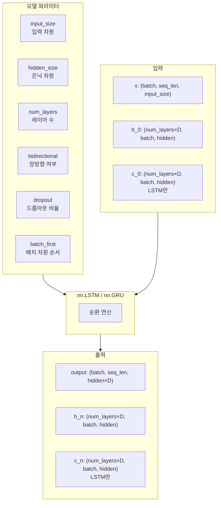
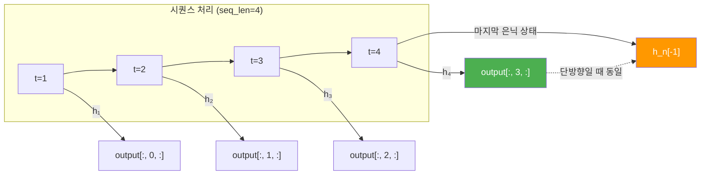
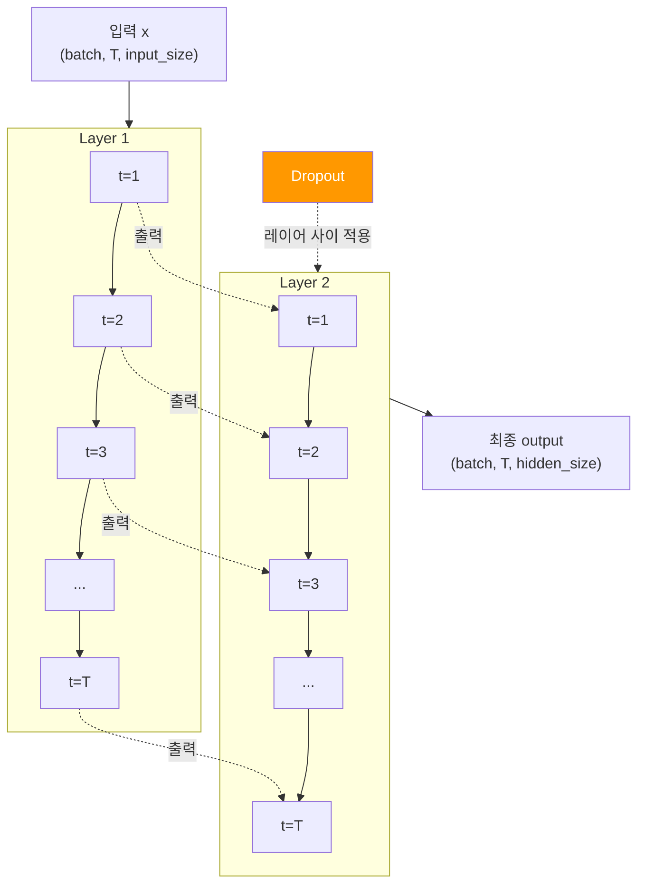
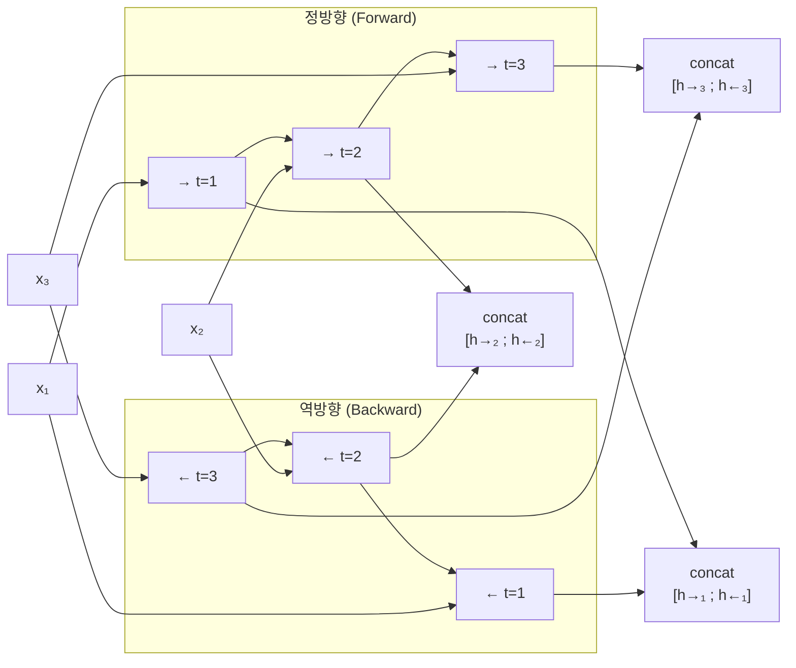
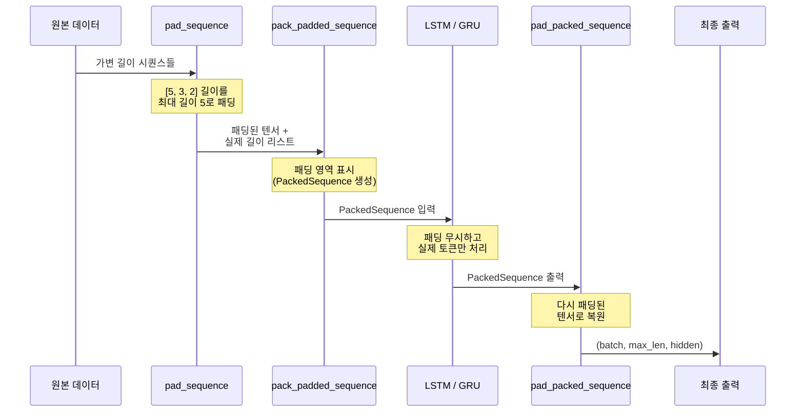
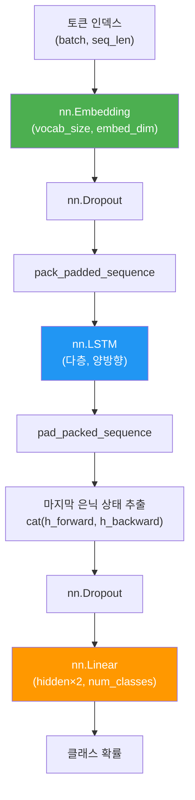

# PyTorch LSTM/GRU 구현

> PyTorch의 nn.LSTM과 nn.GRU를 활용한 다층·양방향 순환 신경망 구현과 가변 길이 시퀀스 처리

## 개요

이 섹션에서는 앞서 학습한 LSTM과 GRU의 이론을 PyTorch 코드로 옮기는 방법을 배웁니다. 단일 레이어를 넘어 다층(multi-layer) 구조, 양방향(bidirectional) 설정, 그리고 실전에서 반드시 마주치는 가변 길이 시퀀스의 패킹(packing) 처리까지 다룹니다.

**선수 지식**: [LSTM의 게이트 구조와 셀 상태](09-ch9-lstm과-gru/01-01-lstm-장단기-메모리-네트워크.md), [GRU의 리셋/업데이트 게이트](09-ch9-lstm과-gru/02-02-gru-게이트-순환-유닛.md), [PyTorch nn.Module과 학습 루프](07-ch7-pytorch-기초와-신경망-입문/03-03-nnmodule로-신경망-정의하기.md)

**학습 목표**:
- `nn.LSTM`과 `nn.GRU`의 입출력 텐서 형태를 정확히 이해한다
- `num_layers`, `bidirectional`, `dropout` 파라미터를 활용하여 다층·양방향 모델을 구축한다
- `pack_padded_sequence`/`pad_packed_sequence`로 가변 길이 배치를 효율적으로 처리한다
- 완전한 텍스트 분류 학습 파이프라인을 구현한다

## 왜 알아야 할까?

이론적으로 LSTM과 GRU의 게이트 메커니즘을 이해하는 것과, 실제로 PyTorch에서 올바르게 구현하는 것은 전혀 다른 문제입니다. 특히 **텐서의 차원(shape)**을 잘못 다루면 모델이 아예 동작하지 않거나, 동작하더라도 잘못된 결과를 내놓죠.

실무에서 NLP 모델을 학습시킬 때, 문장의 길이는 제각각입니다. "나는 학생이다"(4 토큰)와 "오늘 날씨가 좋아서 공원에 산책을 나갔다"(9 토큰)를 같은 배치에 넣으려면 패딩을 추가해야 하는데, 이 패딩된 부분까지 LSTM이 처리하면 성능이 떨어집니다. `pack_padded_sequence`는 이 문제를 깔끔하게 해결해주는 PyTorch의 핵심 유틸리티인데요, 처음 접하면 꽤 헷갈립니다. 이 섹션에서 확실히 정리해 봅시다.

## 핵심 개념

### 개념 1: nn.LSTM / nn.GRU 인터페이스 이해

> 💡 **비유**: nn.LSTM을 **블랙박스 공장**이라고 생각해 보세요. 원자재(입력 텐서)를 넣으면 제품(출력)과 함께 공장의 현재 상태(은닉 상태, 셀 상태)가 반환됩니다. 공장 설계도의 핵심 사양이 바로 `input_size`, `hidden_size`, `num_layers` 같은 파라미터입니다.

PyTorch의 `nn.LSTM`과 `nn.GRU`는 놀라울 정도로 비슷한 인터페이스를 갖고 있습니다. 이전 섹션에서 배운 수학적 구조가 내부에 구현되어 있고, 우리는 몇 가지 핵심 파라미터만 지정하면 됩니다.

> 📊 **그림 1**: nn.LSTM / nn.GRU의 핵심 파라미터와 입출력 구조



여기서 `D`는 `bidirectional=True`이면 2, 아니면 1입니다.

```python
import torch
import torch.nn as nn

# LSTM 생성 — 핵심 3개 파라미터
lstm = nn.LSTM(
    input_size=128,    # 입력 벡터의 차원 (예: 임베딩 크기)
    hidden_size=256,   # 은닉 상태의 차원
    num_layers=2,      # LSTM 레이어를 2층으로 쌓기
    batch_first=True,  # 입력 텐서를 (batch, seq, feature) 순서로
    dropout=0.3,       # 레이어 간 드롭아웃 (2층 이상일 때만 적용)
    bidirectional=False
)

# GRU도 거의 동일한 인터페이스
gru = nn.GRU(
    input_size=128,
    hidden_size=256,
    num_layers=2,
    batch_first=True,
    dropout=0.3,
    bidirectional=False
)
```

입출력을 실제로 확인해 보겠습니다.

```run:python
import torch
import torch.nn as nn

# batch_first=True: (batch, seq_len, input_size)
batch_size, seq_len, input_size, hidden_size = 4, 10, 128, 256

lstm = nn.LSTM(input_size, hidden_size, num_layers=2, batch_first=True)
x = torch.randn(batch_size, seq_len, input_size)

output, (h_n, c_n) = lstm(x)

print(f"입력 shape:     {x.shape}")
print(f"출력 shape:     {output.shape}")
print(f"h_n shape:      {h_n.shape}")
print(f"c_n shape:      {c_n.shape}")
print(f"\nGRU 비교:")

gru = nn.GRU(input_size, hidden_size, num_layers=2, batch_first=True)
output_g, h_n_g = gru(x)
print(f"GRU 출력 shape: {output_g.shape}")
print(f"GRU h_n shape:  {h_n_g.shape}")
print(f"GRU c_n:        없음 (셀 상태 없음)")
```

```output
입력 shape:     torch.Size([4, 10, 128])
출력 shape:     torch.Size([4, 10, 256])
h_n shape:      torch.Size([2, 4, 256])
c_n shape:      torch.Size([2, 4, 256])

GRU 비교:
GRU 출력 shape: torch.Size([4, 10, 256])
GRU h_n shape:  torch.Size([2, 4, 256])
GRU c_n:        없음 (셀 상태 없음)
```

핵심 차이점을 정리하면: LSTM은 `(output, (h_n, c_n))`을 반환하고, GRU는 `(output, h_n)`을 반환합니다. GRU는 별도의 셀 상태가 없기 때문이죠 — [이전 섹션](09-ch9-lstm과-gru/02-02-gru-게이트-순환-유닛.md)에서 배운 내용과 정확히 일치합니다.

### 개념 2: 출력 텐서 해부 — output vs h_n

> 💡 **비유**: `output`은 **매 시간마다 찍는 스냅샷 앨범**이고, `h_n`은 **마지막 순간의 기념 사진**입니다. 앨범에는 모든 순간이 담겨 있지만, 기념 사진은 최종 상태만 담고 있죠. 어떤 작업에 어떤 것을 사용할지 아는 것이 중요합니다.

`nn.LSTM`의 두 가지 출력을 혼동하는 경우가 많은데, 이 둘의 차이를 명확히 이해해야 합니다.

> 📊 **그림 2**: output과 h_n의 관계



- **`output`**: 모든 타임스텝의 은닉 상태 → 시퀀스 태깅(NER, POS), 어텐션 계산에 사용
- **`h_n`**: 마지막 타임스텝의 은닉 상태만 → 분류, 문장 임베딩에 사용

단방향일 때 `output[:, -1, :] == h_n[-1]`이 성립하지만, **양방향에서는 성립하지 않습니다** — 이 부분은 "더 깊이 알아보기"에서 자세히 설명합니다.

### 개념 3: 다층(Multi-layer) 구조

> 💡 **비유**: 다층 LSTM은 **여러 층의 필터**를 통과시키는 것과 같습니다. 1층 필터가 원시 데이터에서 기본 패턴을 추출하면, 2층 필터는 그 패턴들 사이의 더 복잡한 관계를 포착합니다. 마치 사진 편집에서 여러 필터를 순차적으로 적용하는 것처럼요.

`num_layers=2`를 설정하면 PyTorch가 내부적으로 두 개의 LSTM 레이어를 쌓아줍니다. 첫 번째 레이어의 **출력(output)**이 두 번째 레이어의 **입력**이 됩니다.

> 📊 **그림 3**: 2층 LSTM의 데이터 흐름



중요한 점은 `dropout` 파라미터가 **레이어 사이**에만 적용된다는 것입니다. 마지막 레이어의 출력에는 드롭아웃이 적용되지 않으므로, 필요하다면 별도로 `nn.Dropout`을 추가해야 합니다.

`h_n`의 shape은 `(num_layers, batch, hidden_size)`인데, 각 레이어의 **마지막 타임스텝** 은닉 상태를 담고 있습니다.

```python
# h_n에서 각 레이어의 은닉 상태 분리
# h_n shape: (num_layers, batch, hidden_size)
h_layer_0 = h_n[0]  # 1층의 마지막 은닉 상태: (batch, hidden_size)
h_layer_1 = h_n[1]  # 2층의 마지막 은닉 상태: (batch, hidden_size)

# 분류 태스크에서는 보통 마지막 레이어의 은닉 상태를 사용
final_hidden = h_n[-1]  # (batch, hidden_size)
```

### 개념 4: 양방향(Bidirectional) 구조

> 💡 **비유**: 양방향 LSTM은 **책을 두 번 읽는 것**과 같습니다. 한 번은 처음부터 끝까지, 한 번은 끝에서 처음으로. "은행에 갔다"라는 문장에서 "은행"이 금융기관인지 강둑인지 판단하려면, 뒤에 오는 단어도 봐야 하거든요. 양방향 LSTM은 문맥을 앞뒤로 모두 살펴볼 수 있습니다.

`bidirectional=True`로 설정하면 정방향(forward)과 역방향(backward) 두 개의 독립적인 LSTM이 동시에 동작합니다. 출력은 두 방향의 결과를 연결(concatenate)한 것이 됩니다.

> 📊 **그림 4**: 양방향 LSTM의 구조



양방향을 사용하면 출력 차원이 `hidden_size × 2`가 됩니다. 이것이 텐서 shape에서 가장 혼란스러운 부분인데, 직접 확인해 봅시다.

```run:python
import torch
import torch.nn as nn

batch_size, seq_len, input_size, hidden_size = 4, 10, 128, 256

bi_lstm = nn.LSTM(
    input_size, hidden_size,
    num_layers=2,
    batch_first=True,
    bidirectional=True  # 양방향 활성화
)

x = torch.randn(batch_size, seq_len, input_size)
output, (h_n, c_n) = bi_lstm(x)

print(f"출력 shape:  {output.shape}")
print(f"  → hidden_size × 2 = {hidden_size * 2}")
print(f"h_n shape:   {h_n.shape}")
print(f"  → num_layers(2) × num_directions(2) = {2 * 2}")
print(f"\n정방향 마지막 레이어: h_n[-2] shape = {h_n[-2].shape}")
print(f"역방향 마지막 레이어: h_n[-1] shape = {h_n[-1].shape}")

# 분류에 사용할 때: 양방향 은닉 상태를 연결
final_hidden = torch.cat([h_n[-2], h_n[-1]], dim=1)
print(f"\n분류용 연결 벡터: {final_hidden.shape}")
```

```output
출력 shape:  torch.Size([4, 10, 512])
  → hidden_size × 2 = 512
h_n shape:   torch.Size([4, 4, 256])
  → num_layers(2) × num_directions(2) = 4

정방향 마지막 레이어: h_n[-2] shape = torch.Size([4, 256])
역방향 마지막 레이어: h_n[-1] shape = torch.Size([4, 256])

분류용 연결 벡터: torch.Size([4, 512])
```

`h_n`의 첫 번째 차원이 `num_layers × num_directions`로 인터리빙(interleaving)되는 점이 핵심입니다. 즉, 2층 양방향이면 `[L0_정방향, L0_역방향, L1_정방향, L1_역방향]` 순서로 배치됩니다.

### 개념 5: 가변 길이 시퀀스와 패킹(Packing)

> 💡 **비유**: 여러 사람에게 각각 다른 길이의 설문지를 나눠줬다고 상상해 보세요. 가장 긴 설문지에 맞춰 빈 칸을 추가(패딩)하면 수거와 정리는 쉽지만, 빈 칸까지 분석하면 시간 낭비죠. `pack_padded_sequence`는 **"빈 칸은 건너뛰고 실제 답변만 분석하세요"**라고 알려주는 것과 같습니다.

실제 NLP 데이터에서 문장 길이는 제각각입니다. 이를 배치로 처리하려면:

1. **패딩(Padding)**: 짧은 문장에 0을 채워 같은 길이로 맞춤
2. **패킹(Packing)**: RNN에게 실제 길이를 알려줘서 패딩을 무시하게 함
3. **언패킹(Unpacking)**: RNN 출력을 다시 패딩된 형태로 복원

> 📊 **그림 5**: 패딩 → 패킹 → RNN → 언패킹 워크플로



코드로 전체 과정을 살펴보겠습니다.

```run:python
import torch
import torch.nn as nn
from torch.nn.utils.rnn import (
    pad_sequence,
    pack_padded_sequence,
    pad_packed_sequence
)

# 1. 가변 길이 시퀀스 (실제로는 임베딩 벡터)
embed_dim = 8
sequences = [
    torch.randn(5, embed_dim),  # 문장 1: 5 토큰
    torch.randn(3, embed_dim),  # 문장 2: 3 토큰
    torch.randn(7, embed_dim),  # 문장 3: 7 토큰
]
lengths = torch.tensor([5, 3, 7])

# 2. 패딩: 가장 긴 시퀀스에 맞춰 0으로 채움
padded = pad_sequence(sequences, batch_first=True, padding_value=0.0)
print(f"패딩된 텐서 shape: {padded.shape}")  # (3, 7, 8) — 최대 길이 7

# 3. 길이 기준 내림차순 정렬 (pack_padded_sequence 요구사항)
sorted_lengths, sorted_idx = lengths.sort(descending=True)
sorted_padded = padded[sorted_idx]
print(f"정렬된 길이: {sorted_lengths.tolist()}")

# 4. 패킹
packed = pack_padded_sequence(sorted_padded, sorted_lengths, batch_first=True)
print(f"PackedSequence data shape: {packed.data.shape}")
print(f"  → 전체 실제 토큰 수: 7+5+3 = {7+5+3}")

# 5. LSTM에 PackedSequence 입력
lstm = nn.LSTM(embed_dim, 16, batch_first=True)
packed_output, (h_n, c_n) = lstm(packed)

# 6. 언패킹
output, output_lengths = pad_packed_sequence(packed_output, batch_first=True)
print(f"\n언패킹된 출력 shape: {output.shape}")
print(f"출력 길이: {output_lengths.tolist()}")
```

```output
패딩된 텐서 shape: torch.Size([3, 7, 8])
정렬된 길이: [7, 5, 3]
PackedSequence data shape: torch.Size([15, 8])
  → 전체 실제 토큰 수: 7+5+3 = 15
언패킹된 출력 shape: torch.Size([3, 7, 16])
출력 길이: tensor([7, 5, 3])
```

`PackedSequence`의 `data` shape이 `(15, 8)`인 것에 주목하세요. 15는 실제 토큰의 총 개수(7+5+3)입니다. 패딩된 부분은 아예 연산에서 제외된 것이죠.

> ⚠️ **흔한 오해**: `enforce_sorted=False`를 사용하면 정렬 없이도 `pack_padded_sequence`를 사용할 수 있습니다. 내부적으로 정렬과 복원을 자동 처리해 줍니다. 다만 약간의 오버헤드가 있으므로, 대규모 배치에서는 직접 정렬하는 것이 효율적입니다.

```python
# enforce_sorted=False — 정렬 없이 바로 패킹
packed = pack_padded_sequence(
    padded, lengths, 
    batch_first=True, 
    enforce_sorted=False  # 내부에서 자동 정렬/복원
)
```

### 개념 6: 실전 모델 클래스 설계

이제 위에서 배운 모든 개념을 조합해서, 실전에서 사용하는 텍스트 분류 모델 클래스를 만들어 봅시다. 여기서는 범용적인 `TextClassifier`라는 이름을 사용하는데요, 이 패턴이 바로 다음 섹션에서 만들 감성 분석 전용 모델 `SentimentLSTM`의 기반이 됩니다.

> 📊 **그림 6**: 텍스트 분류용 LSTM 모델 아키텍처



```python
import torch
import torch.nn as nn
from torch.nn.utils.rnn import pack_padded_sequence, pad_packed_sequence

class TextClassifier(nn.Module):
    """범용 텍스트 분류 모델 — LSTM/GRU 전환 가능.
    
    다음 섹션의 SentimentLSTM은 이 구조를 감성 분석에 특화시킨 버전입니다.
    핵심 패턴(임베딩 → 패킹 → RNN → 은닉 상태 추출 → 분류)은 동일합니다.
    """
    def __init__(
        self,
        vocab_size: int,
        embed_dim: int = 128,
        hidden_size: int = 256,
        num_classes: int = 2,
        num_layers: int = 2,
        bidirectional: bool = True,
        dropout: float = 0.3,
        rnn_type: str = "lstm",  # "lstm" 또는 "gru"
        pad_idx: int = 0
    ):
        super().__init__()
        self.bidirectional = bidirectional
        self.rnn_type = rnn_type.lower()
        num_directions = 2 if bidirectional else 1

        # 임베딩 레이어 — pad_idx 위치는 학습하지 않음
        self.embedding = nn.Embedding(
            vocab_size, embed_dim, padding_idx=pad_idx
        )
        self.embed_dropout = nn.Dropout(dropout)

        # RNN 레이어 — LSTM 또는 GRU 선택
        RNN = nn.LSTM if self.rnn_type == "lstm" else nn.GRU
        self.rnn = RNN(
            input_size=embed_dim,
            hidden_size=hidden_size,
            num_layers=num_layers,
            batch_first=True,
            dropout=dropout if num_layers > 1 else 0.0,
            bidirectional=bidirectional
        )

        # 분류 헤드
        self.fc_dropout = nn.Dropout(dropout)
        self.fc = nn.Linear(hidden_size * num_directions, num_classes)

    def forward(self, x, lengths):
        # x: (batch, seq_len) — 토큰 인덱스
        # lengths: (batch,) — 각 시퀀스의 실제 길이

        # 1. 임베딩
        embedded = self.embed_dropout(self.embedding(x))
        # embedded: (batch, seq_len, embed_dim)

        # 2. 패킹 → RNN → 언패킹
        packed = pack_padded_sequence(
            embedded, lengths.cpu(),
            batch_first=True, enforce_sorted=False
        )
        packed_output, hidden = self.rnn(packed)

        # 3. 마지막 은닉 상태 추출
        if self.rnn_type == "lstm":
            h_n = hidden[0]  # (num_layers×D, batch, hidden)
        else:
            h_n = hidden     # GRU는 h_n만 반환

        if self.bidirectional:
            # 마지막 레이어의 정방향 + 역방향 연결
            final = torch.cat([h_n[-2], h_n[-1]], dim=1)
        else:
            final = h_n[-1]

        # 4. 분류
        out = self.fc(self.fc_dropout(final))
        return out
```

이 `TextClassifier`는 `rnn_type` 파라미터 하나로 LSTM과 GRU를 전환할 수 있어서, 실험할 때 매우 편리합니다. 다음 섹션 [임베딩 레이어와 패딩 처리](09-ch9-lstm과-gru/04-04-임베딩-레이어와-패딩-처리.md)에서는 이 구조를 감성 분석에 맞게 특화시킨 `SentimentLSTM` 클래스를 만들게 되는데, 핵심 골격은 여기서 만든 것과 동일합니다. 달라지는 부분은 사전학습 임베딩 로드, 임베딩 동결 전략, 그리고 특수 토큰 처리 같은 **임베딩 레이어의 세부 설정**입니다.

## 실습: 직접 해보기

간단한 감성 분석 데이터로 위의 `TextClassifier`를 학습시키는 전체 파이프라인을 구현합니다.

```python
import torch
import torch.nn as nn
from torch.utils.data import Dataset, DataLoader
from torch.nn.utils.rnn import pad_sequence, pack_padded_sequence

# === 1. 간단한 감성 분석 데이터셋 ===
class SentimentDataset(Dataset):
    """간단한 감성 분석 데이터셋"""
    def __init__(self):
        # 긍정(1) / 부정(0) 문장 (이미 토큰 인덱스로 변환된 상태 가정)
        self.data = [
            ([5, 12, 33, 8, 2], 1),         # "정말 좋은 영화였다 !" → 긍정
            ([7, 45, 6], 0),                  # "너무 지루했다" → 부정
            ([3, 22, 11, 8, 50, 14, 2], 1),  # "재미있고 감동적인 영화 강추 합니다 !" → 긍정
            ([9, 30], 0),                     # "실망했다" → 부정
            ([5, 22, 44, 8, 15, 2], 1),      # "정말 재미있는 영화 였어요 !" → 긍정
            ([7, 18, 33, 6], 0),              # "너무 별로 좋은 지루했다" → 부정
            ([3, 50, 14, 8, 2], 1),           # "재미있고 강추 합니다 영화 !" → 긍정
            ([9, 45, 30, 7], 0),              # "실망했다 지루했다 너무" → 부정
        ]

    def __len__(self):
        return len(self.data)

    def __getitem__(self, idx):
        tokens, label = self.data[idx]
        return torch.tensor(tokens, dtype=torch.long), torch.tensor(label)

# === 2. collate 함수: 가변 길이 시퀀스를 배치로 묶기 ===
def collate_fn(batch):
    """배치 내 시퀀스를 패딩하고 길이 정보를 반환"""
    sequences, labels = zip(*batch)
    lengths = torch.tensor([len(s) for s in sequences])

    # pad_sequence: 가장 긴 시퀀스에 맞춰 0으로 패딩
    padded = pad_sequence(sequences, batch_first=True, padding_value=0)
    labels = torch.stack(labels)

    return padded, labels, lengths

# === 3. 모델 생성 및 학습 ===
torch.manual_seed(42)

VOCAB_SIZE = 100
EMBED_DIM = 32
HIDDEN_SIZE = 64
NUM_CLASSES = 2

# 데이터 준비
dataset = SentimentDataset()
loader = DataLoader(dataset, batch_size=4, shuffle=True, collate_fn=collate_fn)

# 모델, 손실 함수, 옵티마이저
model = TextClassifier(
    vocab_size=VOCAB_SIZE,
    embed_dim=EMBED_DIM,
    hidden_size=HIDDEN_SIZE,
    num_classes=NUM_CLASSES,
    num_layers=1,          # 데이터가 적으므로 1층으로
    bidirectional=True,
    dropout=0.1,
    rnn_type="lstm"
)
criterion = nn.CrossEntropyLoss()
optimizer = torch.optim.Adam(model.parameters(), lr=0.01)

# === 4. 학습 루프 ===
model.train()
for epoch in range(20):
    total_loss = 0
    correct = 0
    total = 0

    for padded, labels, lengths in loader:
        optimizer.zero_grad()
        logits = model(padded, lengths)       # (batch, num_classes)
        loss = criterion(logits, labels)
        loss.backward()
        optimizer.step()

        total_loss += loss.item()
        preds = logits.argmax(dim=1)
        correct += (preds == labels).sum().item()
        total += labels.size(0)

    if (epoch + 1) % 5 == 0:
        acc = correct / total * 100
        print(f"Epoch {epoch+1:2d} | Loss: {total_loss/len(loader):.4f} | Acc: {acc:.1f}%")

# === 5. GRU로 전환하여 비교 ===
print("\n--- GRU 모델로 전환 ---")
torch.manual_seed(42)
model_gru = TextClassifier(
    vocab_size=VOCAB_SIZE,
    embed_dim=EMBED_DIM,
    hidden_size=HIDDEN_SIZE,
    num_classes=NUM_CLASSES,
    num_layers=1,
    bidirectional=True,
    dropout=0.1,
    rnn_type="gru"  # GRU로 변경
)
optimizer_gru = torch.optim.Adam(model_gru.parameters(), lr=0.01)

model_gru.train()
for epoch in range(20):
    total_loss = 0
    correct = 0
    total = 0
    for padded, labels, lengths in loader:
        optimizer_gru.zero_grad()
        logits = model_gru(padded, lengths)
        loss = criterion(logits, labels)
        loss.backward()
        optimizer_gru.step()
        total_loss += loss.item()
        preds = logits.argmax(dim=1)
        correct += (preds == labels).sum().item()
        total += labels.size(0)

    if (epoch + 1) % 5 == 0:
        acc = correct / total * 100
        print(f"Epoch {epoch+1:2d} | Loss: {total_loss/len(loader):.4f} | Acc: {acc:.1f}%")

# 파라미터 수 비교
lstm_params = sum(p.numel() for p in model.parameters())
gru_params = sum(p.numel() for p in model_gru.parameters())
print(f"\nLSTM 파라미터: {lstm_params:,}")
print(f"GRU 파라미터:  {gru_params:,}")
print(f"GRU/LSTM 비율: {gru_params/lstm_params:.2%}")
```

이 실습의 핵심 포인트를 정리하면:

1. **collate_fn**이 가변 길이 배치를 처리하는 관문 역할
2. `pack_padded_sequence`와 `enforce_sorted=False`로 패딩 무시
3. `rnn_type` 파라미터 하나로 LSTM↔GRU 전환
4. 양방향 은닉 상태 `h_n[-2]`(정방향), `h_n[-1]`(역방향)의 연결

> 🔥 **실무 팁**: 이 `TextClassifier`의 구조를 잘 기억해 두세요. 다음 섹션에서 만들 `SentimentLSTM`은 이 패턴에 사전학습 임베딩과 특수 토큰 처리를 추가한 것입니다. 이름은 다르지만 "임베딩 → 패킹 → RNN → h_n 추출 → FC"라는 **핵심 파이프라인은 완전히 동일**합니다.

## 더 깊이 알아보기

### PackedSequence의 탄생 배경

PyTorch에서 `PackedSequence`가 도입된 배경에는 흥미로운 이야기가 있습니다. 초기 PyTorch(2017년)에서는 가변 길이 시퀀스를 처리할 표준적인 방법이 없었습니다. 사용자들은 각자 나름의 해킹 방법을 사용했는데 — 수동으로 루프를 돌리거나, 마스크를 적용하거나, 심지어 같은 길이의 문장끼리만 배치를 만들기도 했죠.

Soumith Chintala(PyTorch 공동 창시자)와 팀은 cuDNN의 내부 최적화를 활용하기 위해 `PackedSequence` 개념을 도입했습니다. NVIDIA의 cuDNN 라이브러리는 이미 가변 길이 시퀀스를 효율적으로 처리하는 API를 갖고 있었고, PyTorch의 `pack_padded_sequence`는 이를 파이썬에서 자연스럽게 활용할 수 있는 인터페이스로 설계된 것입니다. `enforce_sorted=False` 옵션은 나중에 (PyTorch 1.1, 2019년) 사용 편의성을 위해 추가되었습니다.

### 양방향 RNN의 "output vs h_n" 함정

양방향 RNN을 처음 사용할 때 가장 혼란스러운 부분이 `output`과 `h_n`의 관계입니다. `output`의 마지막 타임스텝 `output[:, -1, :]`은 `h_n`의 마지막 레이어와 **같지 않을 수 있습니다**. 왜냐하면 `output[:, -1, :]`에는 역방향의 첫 번째 타임스텝 출력이 포함되지만, `h_n[-1]`은 역방향의 마지막 타임스텝(즉, 시퀀스의 첫 번째 토큰) 출력이기 때문입니다. 분류 태스크에서는 보통 `h_n`을 사용하는 것이 의미적으로 올바릅니다.

### TextClassifier에서 SentimentLSTM으로

이 섹션에서 만든 `TextClassifier`는 **범용 분류기**입니다. LSTM/GRU를 전환할 수 있고, 양방향/단방향을 선택할 수 있죠. 다음 섹션에서는 이 구조를 감성 분석(sentiment analysis)에 특화시킨 `SentimentLSTM`으로 발전시킵니다. 주요 차이점은:

| 항목 | TextClassifier (이번 섹션) | SentimentLSTM (다음 섹션) |
|------|--------------------------|--------------------------|
| 임베딩 | 랜덤 초기화 | 사전학습 임베딩(Word2Vec, GloVe) 로드 |
| 특수 토큰 | `pad_idx`만 설정 | `<PAD>`, `<UNK>`, `<BOS>`, `<EOS>` 전체 설계 |
| 임베딩 동결 | 없음 | `freeze` 전략으로 초기 학습 안정화 |
| RNN 타입 | LSTM/GRU 전환 가능 | LSTM 고정 (감성 분석에 최적화) |

구조의 뼈대는 동일하니, 이번 섹션의 코드를 잘 이해하면 다음 섹션이 훨씬 수월할 것입니다.

## 흔한 오해와 팁

> ⚠️ **흔한 오해**: "양방향 LSTM의 `hidden_size`를 절반으로 줄이면 단방향과 파라미터 수가 같다." — 이것은 **틀렸습니다**. 양방향은 두 개의 독립적인 LSTM을 사용하므로, `hidden_size`를 절반으로 줄여도 임베딩→RNN 가중치 등의 차이로 정확히 같아지지 않습니다. 비슷해지긴 하지만 동일하지는 않죠.

> 💡 **알고 계셨나요?**: `nn.LSTM`의 `proj_size` 파라미터(PyTorch 1.8+)를 사용하면 LSTM의 은닉 상태를 더 낮은 차원으로 투영(projection)할 수 있습니다. 이는 Google의 "Long Short-Term Memory Based Recurrent Neural Network Architectures for Large Vocabulary Speech Recognition" 논문에서 제안된 기법으로, 대규모 모델에서 파라미터 수를 줄이면서 성능을 유지하는 데 유용합니다.

> 🔥 **실무 팁**: `pack_padded_sequence`에서 `lengths`를 GPU 텐서로 전달하면 에러가 발생합니다. 반드시 `.cpu()`를 호출하세요. 이 함정에 빠지는 사람이 정말 많습니다. 또한, `DataLoader`의 `collate_fn`에서 시퀀스를 길이 기준으로 미리 정렬해두면 `enforce_sorted=True`(기본값)를 사용할 수 있어 약간 더 빠릅니다.

> 🔥 **실무 팁**: 다층 LSTM에서 `dropout`은 레이어 **사이**에만 적용됩니다. 마지막 레이어 출력에 드롭아웃을 적용하려면 별도의 `nn.Dropout`을 추가해야 합니다. `num_layers=1`일 때 `dropout > 0`을 설정하면 PyTorch가 경고를 출력합니다.

## 핵심 정리

| 개념 | 설명 |
|------|------|
| `nn.LSTM` 반환값 | `(output, (h_n, c_n))` — GRU는 c_n 없음 |
| `output` vs `h_n` | output은 모든 타임스텝, h_n은 마지막 타임스텝만 |
| `batch_first=True` | 텐서 순서를 `(batch, seq_len, feature)`로 설정 |
| `num_layers` | LSTM/GRU를 수직으로 쌓음, dropout은 레이어 사이에 적용 |
| `bidirectional=True` | 출력 차원 2배, h_n 첫 차원 `num_layers × 2` |
| `h_n` 분류 사용 | 양방향: `cat(h_n[-2], h_n[-1])`, 단방향: `h_n[-1]` |
| `pack_padded_sequence` | 패딩 영역을 무시하여 효율적 연산, `lengths`는 CPU 텐서 |
| `enforce_sorted=False` | 자동 정렬/복원, 편리하지만 약간의 오버헤드 |
| `TextClassifier` 패턴 | 임베딩→패킹→RNN→h_n 추출→FC (SentimentLSTM의 기반) |

## 다음 섹션 미리보기

이번 섹션에서 `nn.Embedding`을 모델 안에서 간단히 사용했는데, 다음 섹션 [임베딩 레이어와 패딩 처리](09-ch9-lstm과-gru/04-04-임베딩-레이어와-패딩-처리.md)에서는 `padding_idx`, 사전학습 임베딩 로드(`from_pretrained`), 임베딩 동결(freeze) 전략 등을 깊이 있게 다룹니다. 또한 `<PAD>`, `<UNK>`, `<BOS>`, `<EOS>` 같은 특수 토큰의 설계와 어휘 사전(vocabulary) 구축까지 배우게 됩니다. 이번 섹션의 `TextClassifier`를 감성 분석에 특화시킨 `SentimentLSTM` 클래스도 함께 만들어 볼 예정이니, 여기서 배운 패턴을 잘 기억해 두세요.

## 참고 자료

- [PyTorch nn.LSTM 공식 문서](https://docs.pytorch.org/docs/stable/generated/torch.nn.LSTM.html) - LSTM의 모든 파라미터와 입출력 shape 정의
- [PyTorch nn.GRU 공식 문서](https://docs.pytorch.org/docs/stable/generated/torch.nn.GRU.html) - GRU 인터페이스와 LSTM과의 차이점
- [PyTorch pack_padded_sequence 공식 문서](https://docs.pytorch.org/docs/stable/generated/torch.nn.utils.rnn.pack_padded_sequence.html) - PackedSequence 사용법과 enforce_sorted 옵션
- [Minimal tutorial on packing and unpacking sequences in PyTorch](https://gist.github.com/HarshTrivedi/f4e7293e941b17d19058f6fb90ab0fec) - 패킹/언패킹의 간결한 예제 코드
- [graykode/nlp-tutorial](https://github.com/graykode/nlp-tutorial) - PyTorch 기반 NLP 모델 구현 예제 모음
- [PyTorch NLP From Scratch Tutorials](https://docs.pytorch.org/tutorials/intermediate/nlp_from_scratch_index.html) - RNN/LSTM 기반 NLP 실습 튜토리얼

---
### 🔗 Related Sessions
- [nn.module](07-ch7-pytorch-기초와-신경망-입문/03-03-nnmodule로-신경망-정의하기.md) (prerequisite)
- [lstm](09-ch9-lstm과-gru/01-01-lstm-장단기-메모리-네트워크.md) (prerequisite)
- [gru](09-ch9-lstm과-gru/02-02-gru-게이트-순환-유닛.md) (prerequisite)
- [nn.embedding](07-ch7-pytorch-기초와-신경망-입문/05-05-학습-루프와-datasetdataloader.md) (prerequisite)
- [cell_state](09-ch9-lstm과-gru/01-01-lstm-장단기-메모리-네트워크.md) (prerequisite)
- [forget_gate](09-ch9-lstm과-gru/01-01-lstm-장단기-메모리-네트워크.md) (prerequisite)
- [input_gate](09-ch9-lstm과-gru/01-01-lstm-장단기-메모리-네트워크.md) (prerequisite)
- [output_gate](09-ch9-lstm과-gru/01-01-lstm-장단기-메모리-네트워크.md) (prerequisite)
- [reset_gate](09-ch9-lstm과-gru/02-02-gru-게이트-순환-유닛.md) (prerequisite)
- [update_gate](09-ch9-lstm과-gru/02-02-gru-게이트-순환-유닛.md) (prerequisite)
- [dataloader](07-ch7-pytorch-기초와-신경망-입문/05-05-학습-루프와-datasetdataloader.md) (prerequisite)
