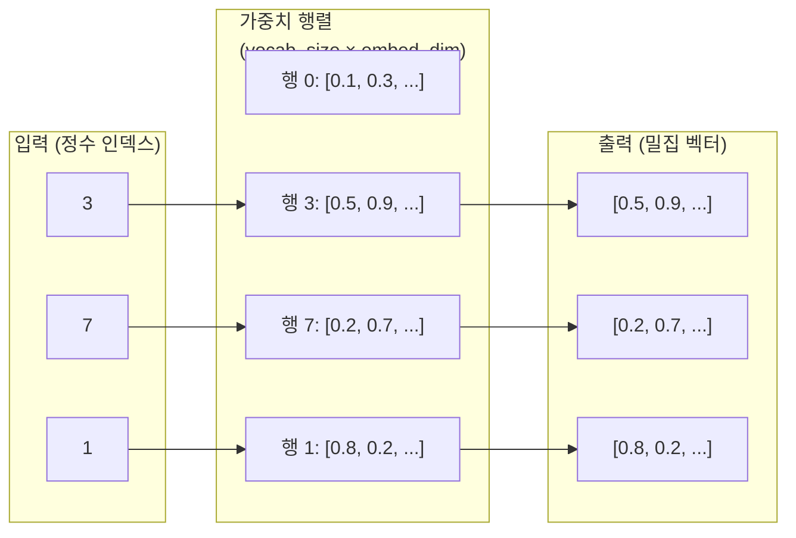
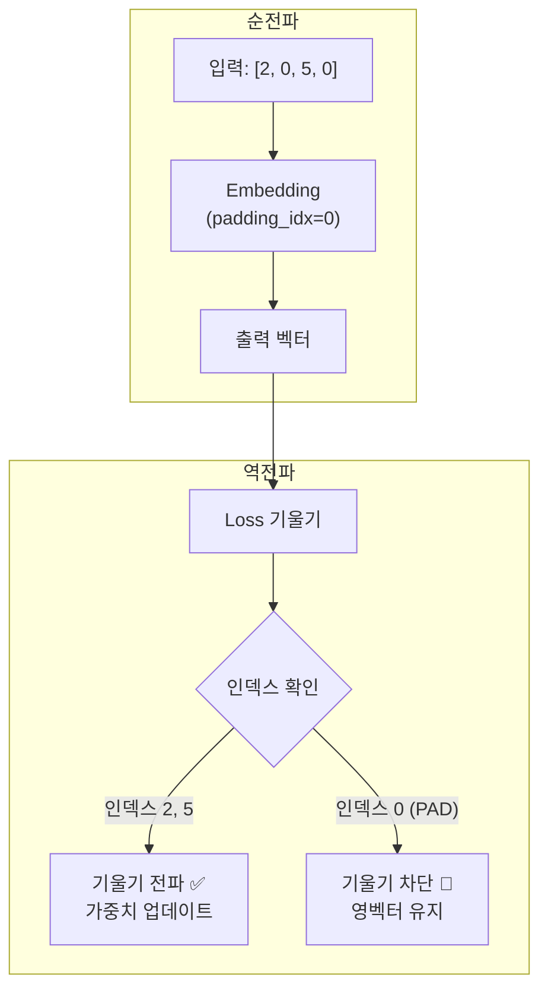
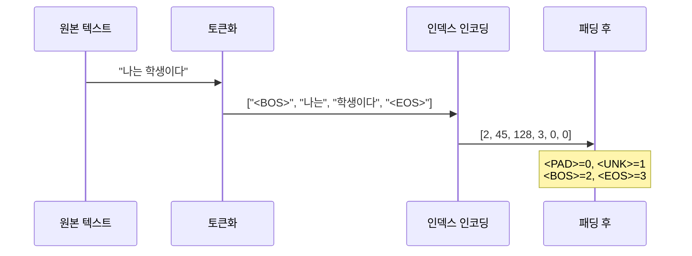
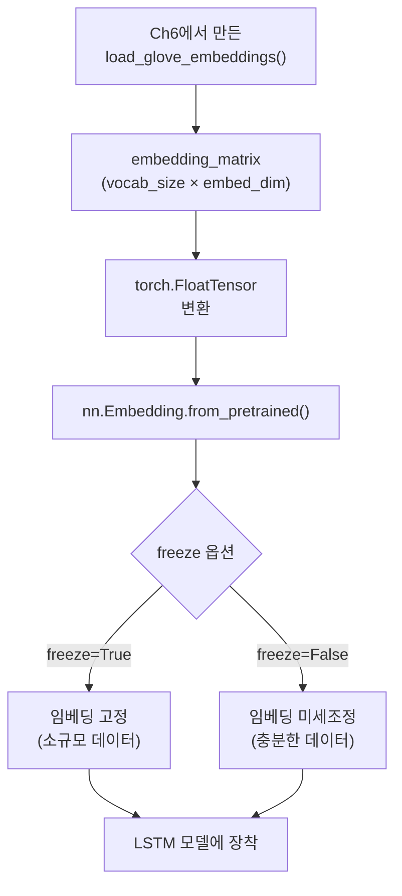

# 임베딩 레이어와 패딩 처리

> PyTorch nn.Embedding의 동작 원리부터 사전학습 임베딩 로드, 가변 길이 시퀀스 패딩과 마스킹까지 — 실전 NLP 모델의 입력 파이프라인을 완성합니다.

## 개요

이 섹션에서는 텍스트를 신경망에 입력하기 위한 핵심 구성 요소인 **임베딩 레이어**와 **패딩 처리**를 깊이 있게 다룹니다. 앞서 [LSTM 장단기 메모리 네트워크](09-ch9-lstm과-gru/01-01-lstm-장단기-메모리-네트워크.md)와 [GRU 게이트 순환 유닛](09-ch9-lstm과-gru/02-02-gru-게이트-순환-유닛.md)에서 순환 신경망의 내부 구조를, [PyTorch LSTM/GRU 구현](09-ch9-lstm과-gru/03-03-pytorch-lstmgru-구현.md)에서 `pack_padded_sequence`의 기본 사용법과 `collate_fn` 패턴을 배웠습니다. 이번 세션에서는 그 입력 단계를 체계적으로 정리합니다.

**선수 지식**: nn.LSTM/nn.GRU 기본 사용법, pack_padded_sequence 개념, [워드 임베딩 Word2Vec](05-ch5-워드-임베딩-word2vec/01-01-분포-가설과-밀집-벡터-표현.md)의 기본 개념, [사전학습 임베딩 활용](06-ch6-워드-임베딩-심화-glove와-fasttext/03-03-사전학습-임베딩-활용.md)의 GloVe 로딩 함수

**학습 목표**:
- `nn.Embedding`의 내부 동작을 룩업 테이블 관점에서 설명할 수 있다
- `padding_idx`를 설정하여 패딩 토큰의 기울기 업데이트를 방지할 수 있다
- 사전학습 임베딩을 `from_pretrained`로 로드하여 LSTM 모델에 연결할 수 있다
- 가변 길이 시퀀스의 패딩, 패킹, 마스킹 파이프라인을 구축할 수 있다

## 왜 알아야 할까?

실제 텍스트 데이터는 문장마다 길이가 다릅니다. "안녕"은 2글자, "오늘 날씨가 정말 좋네요"는 10글자죠. 그런데 PyTorch의 배치 처리는 동일한 크기의 텐서를 요구합니다. 이 간극을 어떻게 메울 수 있을까요?

또한, 단어를 정수 인덱스로 변환한 것만으로는 신경망이 단어의 **의미**를 이해할 수 없습니다. 숫자 3이 숫자 7보다 "작다"는 관계가 "고양이"와 "강아지"의 관계와는 전혀 다르니까요. `nn.Embedding`은 이 정수 인덱스를 의미 있는 밀집 벡터로 변환하는 **번역기** 역할을 합니다.

이 두 가지 — **임베딩**과 **패딩** — 는 모든 NLP 모델의 입력 파이프라인에서 반드시 거치는 관문입니다. 여기서 실수하면 모델이 패딩 토큰을 "의미 있는 단어"로 학습하거나, 사전학습 임베딩의 성능을 제대로 활용하지 못하는 문제가 발생합니다.

## 핵심 개념

### 개념 1: nn.Embedding — 룩업 테이블의 마법

> 💡 **비유**: `nn.Embedding`은 거대한 **사전**과 같습니다. "apple"이라는 단어(인덱스 42)를 찾으면, 그 단어에 해당하는 뜻(벡터)이 적혀 있는 페이지가 나오죠. 신경망은 이 "뜻 페이지"를 읽고 단어의 의미를 파악합니다.

`nn.Embedding`은 본질적으로 **(vocab_size × embedding_dim)** 크기의 가중치 행렬입니다. 정수 인덱스가 입력되면, 해당 행(row)을 그대로 꺼내서 반환합니다. 행렬 곱 같은 연산이 아니라, 단순한 **인덱스 조회(lookup)**인 거죠.

> 📊 **그림 1**: nn.Embedding의 룩업 테이블 동작



핵심은 이 가중치 행렬이 **학습 가능한 파라미터**라는 점입니다. 역전파 과정에서 각 단어의 벡터가 태스크에 맞게 조정됩니다.

```run:python
import torch
import torch.nn as nn

# 어휘 크기 10, 임베딩 차원 4
embedding = nn.Embedding(num_embeddings=10, embedding_dim=4)

# 정수 인덱스 입력
input_ids = torch.LongTensor([1, 5, 3, 7])
output = embedding(input_ids)

print(f"입력 shape: {input_ids.shape}")
print(f"출력 shape: {output.shape}")
print(f"가중치 행렬 shape: {embedding.weight.shape}")
print(f"\n인덱스 5의 벡터:")
print(f"  embedding(5) = {output[1].detach()}")
print(f"  weight[5]    = {embedding.weight[5].detach()}")
print(f"  동일한가?    = {torch.equal(output[1], embedding.weight[5])}")
```

```output
입력 shape: torch.Size([4])
출력 shape: torch.Size([4, 4])
가중치 행렬 shape: torch.Size([10, 4])

인덱스 5의 벡터:
  embedding(5) = tensor([-0.4339,  1.4546,  0.0685, -0.7596])
  weight[5]    = tensor([-0.4339,  1.4546,  0.0685, -0.7596])
  동일한가?    = True
```

보다시피, `embedding(5)`의 결과는 가중치 행렬의 5번째 행과 완전히 동일합니다. 연산이 아니라 조회인 거죠.

### 개념 2: padding_idx — 패딩 토큰을 학습에서 제외하기

> 💡 **비유**: 시험지에서 빈 칸을 0으로 채웠다고 해서, 학생이 "0이 정답"이라고 학습하면 안 되겠죠? `padding_idx`는 "이 칸은 빈 칸이니 채점하지 마세요"라고 표시하는 것과 같습니다.

NLP에서 배치 처리를 위해 짧은 문장을 `<PAD>` 토큰(보통 인덱스 0)으로 채웁니다. 그런데 이 패딩 토큰까지 임베딩이 학습되면, 모델은 "패딩도 의미 있는 단어"라고 오해하게 됩니다.

`padding_idx`를 지정하면 두 가지가 보장됩니다:
1. 해당 인덱스의 임베딩 벡터가 **영벡터(all zeros)**로 초기화됩니다
2. 학습 과정에서 해당 인덱스로는 **기울기가 전파되지 않아** 영벡터가 유지됩니다

> 📊 **그림 2**: padding_idx의 기울기 차단 메커니즘



```run:python
import torch
import torch.nn as nn

# padding_idx=0: 인덱스 0은 패딩 토큰
embedding = nn.Embedding(num_embeddings=5, embedding_dim=3, padding_idx=0)

print("초기 가중치:")
print(embedding.weight.data)
print(f"\n패딩(인덱스 0) 벡터: {embedding.weight[0].data}")
print(f"모두 0인가? {torch.all(embedding.weight[0] == 0).item()}")
```

```output
초기 가중치:
tensor([[ 0.0000,  0.0000,  0.0000],
        [-0.3882, -0.2607,  0.9275],
        [ 0.5746, -0.6843,  1.0579],
        [-0.7907,  0.3156, -0.2248],
        [ 0.3421, -1.1641,  0.4913]])

패딩(인덱스 0) 벡터: tensor([0., 0., 0.])
모두 0인가? True
```

### 개념 3: 특수 토큰과 간단한 어휘 매핑

실전 NLP 모델에서는 `<PAD>` 외에도 여러 특수 토큰이 필요합니다. 각 토큰의 역할과 배치를 체계적으로 설계해야 합니다.

> 📊 **그림 3**: 특수 토큰의 역할과 시퀀스 내 위치



| 토큰 | 일반적 인덱스 | 역할 |
|------|:---:|------|
| `<PAD>` | 0 | 배치 패딩 (padding_idx로 지정) |
| `<UNK>` | 1 | 어휘 사전에 없는 미등록어 처리 |
| `<BOS>` / `<SOS>` | 2 | 시퀀스 시작 표시 (디코더 입력) |
| `<EOS>` | 3 | 시퀀스 종료 표시 (생성 중단 신호) |

이 세션에서는 가장 간단한 형태인 **딕셔너리 기반 매핑**만 구현합니다. `<PAD>`와 `<UNK>` 두 가지 특수 토큰이면 감정 분류 같은 기본 태스크에는 충분합니다. `min_freq` 필터링이나 `<BOS>`/`<EOS>` 처리를 포함한 완전한 `Vocabulary` 클래스는 [시퀀스 투 시퀀스 모델](10-ch10-시퀀스-투-시퀀스와-어텐션/02-02-인코더-디코더-구조-구현.md)에서 본격적으로 구축합니다.

```python
# 가장 간단한 어휘 매핑 — 딕셔너리 기반
word2idx = {'<PAD>': 0, '<UNK>': 1}
PAD_IDX = 0
UNK_IDX = 1

def build_vocab(sentences, word2idx):
    """문장 리스트로부터 어휘 사전 구축"""
    for sent in sentences:
        for word in sent.split():
            if word not in word2idx:
                word2idx[word] = len(word2idx)
    return word2idx

def encode(sentence, word2idx):
    """문장을 인덱스 리스트로 변환"""
    return [word2idx.get(w, UNK_IDX) for w in sentence.split()]
```

> ⚠️ **흔한 오해**: `<PAD>` 인덱스를 0이 아닌 다른 값으로 해도 됩니다. 중요한 것은 `nn.Embedding(padding_idx=패드인덱스)`에 올바른 값을 전달하는 것이지, 반드시 0일 필요는 없습니다. 다만 관례적으로 0을 사용하면 코드의 가독성이 좋아집니다.

### 개념 4: 사전학습 임베딩 로드 — from_pretrained

> 💡 **비유**: 외국어를 배울 때, 빈 노트에서 시작하는 것과 이미 잘 정리된 사전을 가지고 시작하는 것 — 어느 쪽이 유리할까요? 사전학습 임베딩은 수십억 단어에서 학습된 "잘 정리된 사전"을 신경망에 건네주는 것입니다.

[사전학습 임베딩 활용](06-ch6-워드-임베딩-심화-glove와-fasttext/03-03-사전학습-임베딩-활용.md)에서 GloVe 파일을 파싱하여 가중치 행렬을 만드는 `load_glove_embeddings` 함수를 구현한 바 있습니다. 여기서는 그 함수를 **어떻게 LSTM 모델에 연결하는지**에 초점을 맞춥니다.

> 📊 **그림 4**: 사전학습 임베딩을 LSTM에 연결하는 워크플로



GloVe 파일 파싱과 어휘 매칭의 전체 구현은 [사전학습 임베딩 활용](06-ch6-워드-임베딩-심화-glove와-fasttext/03-03-사전학습-임베딩-활용.md)을 참고하세요. 핵심 흐름만 요약하면:

```python
# Ch6 s3에서 구현한 load_glove_embeddings 함수를 활용한다고 가정
# (파일 파싱 → 어휘 매칭 → numpy 행렬 → torch.FloatTensor)

# ── LSTM 모델에 사전학습 임베딩 연결하기 ──
import torch
import torch.nn as nn

# 1) Ch6의 함수로 가중치 행렬 로드 (실전에서)
# embedding_matrix = load_glove_embeddings('glove.6B.100d.txt', word2idx, 100)
# embedding_tensor = torch.FloatTensor(embedding_matrix)

# 2) 시뮬레이션: 어휘 크기 1000, 100차원 GloVe
vocab_size = 1000
embed_dim = 100
embedding_tensor = torch.randn(vocab_size, embed_dim)
embedding_tensor[0] = 0  # <PAD>는 영벡터

# 3) from_pretrained로 임베딩 레이어 생성
embedding_layer = nn.Embedding.from_pretrained(
    embedding_tensor,
    freeze=False,       # False: 태스크에 맞게 미세조정
    padding_idx=0       # <PAD> 인덱스
)

# 4) LSTM과 조합
lstm = nn.LSTM(input_size=embed_dim, hidden_size=128, batch_first=True)

# 사용 예시
input_ids = torch.LongTensor([[5, 12, 8, 0, 0], [9, 2, 0, 0, 0]])
embedded = embedding_layer(input_ids)    # (2, 5, 100)
output, (h_n, c_n) = lstm(embedded)      # output: (2, 5, 128)
```

**freeze 옵션의 전략적 선택**:

| 상황 | freeze 설정 | 이유 |
|------|:---:|------|
| 데이터가 적을 때 (< 10K 샘플) | `True` | 과적합 방지, 사전학습 지식 보존 |
| 데이터가 충분할 때 | `False` | 태스크에 맞게 임베딩 미세조정 |
| 도메인이 매우 다를 때 | `False` | 일반 임베딩이 도메인 어휘를 반영 못 함 |
| 2단계 전략 | 초기 `True` → 후반 `False` | 안정적 학습 시작 후 미세조정 |

### 개념 5: 가변 길이 패딩과 마스킹 파이프라인

> 💡 **비유**: 우체국에서 여러 크기의 택배를 보내려면, 가장 큰 상자 크기에 맞춰 작은 택배들에 **완충재**를 채워 넣죠. 패딩이 바로 그 완충재입니다. 하지만 받는 사람은 완충재를 뜯어 버리고 실제 내용물만 확인합니다 — 이것이 마스킹입니다.

[PyTorch LSTM/GRU 구현](09-ch9-lstm과-gru/03-03-pytorch-lstmgru-구현.md)에서 `collate_fn`과 `pack_padded_sequence`의 기본 패턴을 이미 배웠습니다. 여기서는 전체 파이프라인을 한눈에 정리하고, **임베딩 레이어와의 결합**에 초점을 맞춥니다.

> 📊 **그림 5**: 가변 길이 시퀀스 처리 전체 파이프라인


```python
import torch
from torch.nn.utils.rnn import pad_sequence, pack_padded_sequence, pad_packed_sequence

# 가변 길이 시퀀스 3개 (이미 인덱스로 변환된 상태)
sequences = [
    torch.tensor([5, 12, 8, 3]),     # 길이 4
    torch.tensor([9, 2]),             # 길이 2
    torch.tensor([7, 15, 11, 6, 4])  # 길이 5
]
lengths = torch.tensor([4, 2, 5])

# Step 1: 패딩 (가장 긴 시퀀스에 맞춰 0으로 채움)
padded = pad_sequence(sequences, batch_first=True, padding_value=0)
# padded shape: (3, 5) — 배치 3개, 최대 길이 5

# Step 2: 임베딩
embedding = torch.nn.Embedding(20, 8, padding_idx=0)
embedded = embedding(padded)  # (3, 5, 8)

# Step 3: 패킹 (LSTM/GRU에 입력) — enforce_sorted=False로 정렬 생략
packed = pack_padded_sequence(
    embedded, 
    lengths.cpu(), 
    batch_first=True,
    enforce_sorted=False  # 자동 정렬, 별도 sort 불필요
)

# Step 4: RNN 통과
lstm = torch.nn.LSTM(input_size=8, hidden_size=16, batch_first=True)
packed_output, (h_n, c_n) = lstm(packed)

# Step 5: 언패킹 (필요 시)
output, output_lengths = pad_packed_sequence(packed_output, batch_first=True)
```

`collate_fn`의 기본 패턴은 [PyTorch LSTM/GRU 구현](09-ch9-lstm과-gru/03-03-pytorch-lstmgru-구현.md)에서 다뤘으므로, 여기서는 핵심만 되짚겠습니다:

```python
from torch.nn.utils.rnn import pad_sequence

def collate_fn(batch):
    """Ch9 s3에서 배운 패턴 — 패딩 + 길이 반환"""
    sequences, labels = zip(*batch)
    lengths = torch.tensor([len(s) for s in sequences])
    padded = pad_sequence(sequences, batch_first=True, padding_value=0)
    labels = torch.stack(labels)
    return padded, lengths, labels
```

> 🔥 **실무 팁**: `pack_padded_sequence`에서 `enforce_sorted=False`를 설정하면 입력을 미리 정렬하지 않아도 됩니다. 내부적으로 자동 정렬을 수행하므로 코드가 훨씬 간결해집니다. 다만 ONNX 모델 내보내기가 필요한 경우에는 `enforce_sorted=True`(기본값)를 사용해야 합니다.

## 실습: 직접 해보기

사전학습 임베딩을 시뮬레이션하고, 패딩 처리까지 포함한 완전한 텍스트 분류 모델을 구현해 봅시다. 어휘 매핑은 딕셔너리 기반으로 간결하게 처리합니다.

```python
import torch
import torch.nn as nn
from torch.nn.utils.rnn import pad_sequence, pack_padded_sequence
from torch.utils.data import Dataset, DataLoader

# ─── 1. 어휘 사전 구축 (딕셔너리 기반) ───
word2idx = {'<PAD>': 0, '<UNK>': 1}
PAD_IDX = 0
UNK_IDX = 1

def build_vocab(sentences):
    for sent in sentences:
        for word in sent.split():
            if word not in word2idx:
                word2idx[word] = len(word2idx)

def encode(sentence):
    return [word2idx.get(w, UNK_IDX) for w in sentence.split()]

# ─── 2. 데이터 준비 ───
sentences = [
    "이 영화 정말 재미있다",
    "최악의 영화 다시는 안 본다",
    "감동적인 스토리",
    "시간 낭비",
    "배우 연기가 훌륭하다",
    "지루하고 재미없는 영화",
    "웃기고 재미있는 영화 추천",
    "별로다",
]
labels = [1, 0, 1, 0, 1, 0, 1, 0]  # 1: 긍정, 0: 부정

build_vocab(sentences)

# ─── 3. Dataset & DataLoader ───
class SentimentDataset(Dataset):
    def __init__(self, sentences, labels):
        self.data = []
        for sent, label in zip(sentences, labels):
            indices = encode(sent)
            self.data.append((torch.tensor(indices, dtype=torch.long),
                              torch.tensor(label, dtype=torch.float)))
    
    def __len__(self):
        return len(self.data)
    
    def __getitem__(self, idx):
        return self.data[idx]

def collate_fn(batch):
    """Ch9 s3의 패턴 활용 — 패딩 + 길이 반환"""
    seqs, labels = zip(*batch)
    lengths = torch.tensor([len(s) for s in seqs])
    padded = pad_sequence(seqs, batch_first=True, padding_value=0)
    labels = torch.stack(labels)
    return padded, lengths, labels

dataset = SentimentDataset(sentences, labels)
loader = DataLoader(dataset, batch_size=4, shuffle=True, collate_fn=collate_fn)

# ─── 4. 모델 정의 ───
class SentimentLSTM(nn.Module):
    def __init__(self, vocab_size, embed_dim, hidden_dim, 
                 output_dim, padding_idx, pretrained_weights=None):
        super().__init__()
        
        # 임베딩 레이어 설정
        if pretrained_weights is not None:
            # 사전학습 임베딩 로드 (Ch6 s3의 함수로 생성한 텐서)
            self.embedding = nn.Embedding.from_pretrained(
                pretrained_weights,
                freeze=False,          # 미세조정 허용
                padding_idx=padding_idx
            )
        else:
            # 랜덤 초기화
            self.embedding = nn.Embedding(
                vocab_size, embed_dim, padding_idx=padding_idx
            )
        
        self.lstm = nn.LSTM(
            embed_dim, hidden_dim, 
            batch_first=True, bidirectional=True
        )
        # 양방향이므로 hidden_dim * 2
        self.fc = nn.Linear(hidden_dim * 2, output_dim)
        self.dropout = nn.Dropout(0.3)
    
    def forward(self, text, lengths):
        # text: (batch, max_len) — 패딩된 인덱스
        # lengths: (batch,) — 실제 길이
        
        embedded = self.dropout(self.embedding(text))  # (batch, max_len, embed_dim)
        
        # 패킹: 패딩 토큰을 LSTM에서 제외
        packed = pack_padded_sequence(
            embedded, lengths.cpu(), 
            batch_first=True, enforce_sorted=False
        )
        packed_output, (h_n, c_n) = self.lstm(packed)
        
        # 양방향 마지막 은닉 상태 결합
        # h_n shape: (2, batch, hidden_dim) — [정방향, 역방향]
        hidden = torch.cat([h_n[0], h_n[1]], dim=1)  # (batch, hidden_dim*2)
        
        output = self.fc(self.dropout(hidden))  # (batch, output_dim)
        return output.squeeze(1)

# ─── 5. 사전학습 임베딩 시뮬레이션 ───
embed_dim = 16
vocab_size = len(word2idx)
# 실전에서는 Ch6 s3의 load_glove_embeddings() 함수로 로드:
#   embedding_matrix = load_glove_embeddings('glove.6B.100d.txt', word2idx, 100)
#   pretrained = torch.FloatTensor(embedding_matrix)
pretrained = torch.randn(vocab_size, embed_dim)
pretrained[PAD_IDX] = 0  # PAD는 영벡터로

model = SentimentLSTM(
    vocab_size=vocab_size,
    embed_dim=embed_dim,
    hidden_dim=32,
    output_dim=1,
    padding_idx=PAD_IDX,
    pretrained_weights=pretrained
)

# ─── 6. 학습 루프 ───
optimizer = torch.optim.Adam(model.parameters(), lr=0.01)
criterion = nn.BCEWithLogitsLoss()

model.train()
for epoch in range(10):
    total_loss = 0
    for padded, lengths, labels in loader:
        optimizer.zero_grad()
        predictions = model(padded, lengths)
        loss = criterion(predictions, labels)
        loss.backward()
        optimizer.step()
        total_loss += loss.item()
    
    if (epoch + 1) % 5 == 0:
        print(f"Epoch {epoch+1:2d} | Loss: {total_loss/len(loader):.4f}")

# ─── 7. 패딩 인덱스 기울기 검증 ───
print(f"\n학습 후 PAD 임베딩 벡터 norm: "
      f"{model.embedding.weight[0].norm().item():.6f}")
print(f"PAD 벡터가 여전히 0인가? "
      f"{torch.all(model.embedding.weight[0] == 0).item()}")
```

이 코드에서 주목할 점:
- `padding_idx=0`으로 설정했기 때문에, 10에포크 학습 후에도 인덱스 0의 벡터는 영벡터로 유지됩니다
- `enforce_sorted=False`를 사용하여 길이 정렬 없이 바로 패킹합니다
- 양방향 LSTM의 정방향/역방향 마지막 은닉 상태를 연결(concat)하여 분류에 사용합니다
- 어휘 매핑은 `word2idx` 딕셔너리만으로 충분합니다 — 별도 클래스 없이도 동작하죠

## 더 깊이 알아보기

### 워드 임베딩의 "전이학습" 역사

사전학습 임베딩을 로드하는 기법은 사실 NLP에서 **전이학습(Transfer Learning)**의 시초라고 할 수 있습니다. 2013년 Mikolov의 Word2Vec이 등장하기 전, 대부분의 NLP 모델은 원-핫 인코딩이나 BoW 표현을 사용했습니다. 단어를 밀집 벡터로 표현한다는 발상 자체가 혁명적이었죠.

흥미롭게도, **Yoshua Bengio**가 2003년 논문 "A Neural Probabilistic Language Model"에서 이미 신경망 기반 단어 표현 학습을 제안했습니다. 하지만 당시의 컴퓨팅 파워로는 대규모 학습이 어려웠습니다. Word2Vec이 10년 후 성공한 이유 중 하나는 **네거티브 샘플링**이라는 효율적인 학습 기법 덕분이었습니다.

이후 2014년 GloVe, 2017년 FastText가 등장하면서, 사전학습 임베딩을 **다운스트림 태스크에 로드**하는 것이 NLP의 표준 관행이 되었습니다. 이 패턴은 나중에 BERT, GPT에서 "사전학습 → 파인튜닝" 패러다임으로 발전하게 됩니다. `nn.Embedding.from_pretrained()`는 바로 이 전이학습 파이프라인의 첫 번째 단추인 셈이죠.

### padding_idx와 nn.Embedding의 미묘한 동작

PyTorch 공식 문서에 따르면, `nn.Embedding`은 생성 시점에 `padding_idx`에 해당하는 행을 **영벡터로 초기화**합니다. 반면 `nn.functional.embedding`은 이 초기화를 수행하지 않습니다. 같은 이름이지만 동작이 다르니 주의해야 합니다.

또한, `from_pretrained`로 사전학습 가중치를 로드할 때 `padding_idx`를 함께 지정하면, 로드된 후에 해당 행이 영벡터로 **덮어쓰여집니다**. 사전학습 파일에 `<PAD>` 토큰의 벡터가 포함되어 있더라도 무시되는 것이죠.

## 흔한 오해와 팁

> ⚠️ **흔한 오해**: "임베딩 차원이 클수록 좋다"고 생각하기 쉽지만, 과도한 차원은 과적합을 유발합니다. 소규모 데이터셋(< 50K 샘플)에서는 50~100차원으로도 충분하며, GloVe 300차원 전체를 사용하는 것이 항상 최선은 아닙니다. 실험으로 확인하세요.

> 💡 **알고 계셨나요?**: `nn.Embedding`은 연산량 측면에서 매우 효율적입니다. 행렬 곱이 아니라 단순 인덱스 조회이기 때문에, 어휘 크기가 100만이어도 조회 시간은 O(1)입니다. 반면 원-핫 벡터를 밀집 레이어에 통과시키면 O(vocab_size × embed_dim)의 행렬 곱이 필요하죠.

> 🔥 **실무 팁**: 사전학습 임베딩 로드 시 매칭률이 낮다면(< 70%), 텍스트 전처리를 점검하세요. GloVe는 소문자 기준이므로 입력도 소문자로 변환해야 합니다. 또한 특수문자와 구두점이 토큰에 붙어 있으면 매칭이 안 됩니다 — "hello,"와 "hello"는 다른 토큰이니까요.

> 🔥 **실무 팁**: 2단계 임베딩 전략이 효과적입니다. 먼저 `freeze=True`로 5 에포크 학습하여 나머지 파라미터를 안정화한 뒤, `embedding.weight.requires_grad = True`로 전환하여 미세조정하면 학습이 더 안정적입니다.

## 핵심 정리

| 개념 | 설명 |
|------|------|
| `nn.Embedding` | 정수 인덱스를 밀집 벡터로 변환하는 룩업 테이블. (vocab_size × embed_dim) 가중치 행렬 |
| `padding_idx` | 지정된 인덱스의 임베딩을 영벡터로 유지하고 기울기 업데이트를 차단 |
| `from_pretrained` | GloVe/FastText 등 사전학습 가중치를 임베딩 레이어에 로드. Ch6 s3의 함수로 행렬 생성 |
| `freeze` | `True`면 임베딩 고정(기울기 X), `False`면 미세조정 가능 |
| 특수 토큰 | `<PAD>`, `<UNK>` 등 — 딕셔너리 기반 매핑으로 관리 (완전한 Vocab 클래스는 Ch10 참고) |
| `pad_sequence` | 가변 길이 텐서 리스트를 최대 길이에 맞춰 패딩하여 배치 텐서 생성 |
| `pack_padded_sequence` | 패딩된 시퀀스를 PackedSequence로 변환, RNN이 패딩을 무시하도록 처리 |
| `collate_fn` | DataLoader에서 배치 구성 시 패딩/길이 계산을 커스텀하는 함수 (Ch9 s3에서 상세 설명) |

## 다음 섹션 미리보기

다음 세션 [LSTM 기반 텍스트 생성](09-ch9-lstm과-gru/05-05-lstm-기반-텍스트-생성.md)에서는 이번에 배운 임베딩과 패딩 파이프라인 위에 **문자 수준 텍스트 생성** 모델을 구축합니다. LSTM이 학습한 언어 패턴을 바탕으로 새로운 텍스트를 자동으로 생성하는 과정 — 온도(temperature) 기반 샘플링과 탐욕적 디코딩 전략까지 다룹니다.

## 참고 자료

- [PyTorch nn.Embedding 공식 문서](https://docs.pytorch.org/docs/stable/generated/torch.nn.Embedding.html) - padding_idx, from_pretrained 등 모든 파라미터의 공식 레퍼런스
- [PyTorch pack_padded_sequence 공식 문서](https://docs.pytorch.org/docs/stable/generated/torch.nn.utils.rnn.pack_padded_sequence.html) - enforce_sorted, batch_first 옵션 상세 설명
- [PyTorch NLP From Scratch 튜토리얼](https://docs.pytorch.org/tutorials/intermediate/nlp_from_scratch_index.html) - 문자 수준 RNN부터 시작하는 공식 튜토리얼 시리즈
- [graykode/nlp-tutorial GitHub](https://github.com/graykode/nlp-tutorial) - PyTorch 기반 NLP 모델 구현 예제 모음
- [Stanford GloVe 공식 페이지](https://nlp.stanford.edu/projects/glove/) - 사전학습 GloVe 벡터 다운로드 및 논문

---
### 🔗 Related Sessions
- [사전학습 임베딩 활용](06-ch6-워드-임베딩-심화-glove와-fasttext/03-03-사전학습-임베딩-활용.md) (prerequisite — GloVe 로딩 함수 구현)
- [PyTorch LSTM/GRU 구현](09-ch9-lstm과-gru/03-03-pytorch-lstmgru-구현.md) (prerequisite — collate_fn, pack_padded_sequence 상세)
- [인코더-디코더 구조 구현](10-ch10-시퀀스-투-시퀀스와-어텐션/02-02-인코더-디코더-구조-구현.md) (next — 완전한 Vocabulary 클래스)
- [DataLoader](07-ch7-pytorch-기초와-신경망-입문/05-05-학습-루프와-datasetdataloader.md) (prerequisite)

---
### 🔗 Related Sessions
- [dataloader](07-ch7-pytorch-기초와-신경망-입문/05-05-학습-루프와-datasetdataloader.md) (prerequisite)


---
### 🔗 Related Sessions
- [dataloader](07-ch7-pytorch-기초와-신경망-입문/05-05-학습-루프와-datasetdataloader.md) (prerequisite)


---
### 🔗 Related Sessions
- [dataloader](07-ch7-pytorch-기초와-신경망-입문/05-05-학습-루프와-datasetdataloader.md) (prerequisite)


---
### 🔗 Related Sessions
- [dataloader](07-ch7-pytorch-기초와-신경망-입문/05-05-학습-루프와-datasetdataloader.md) (prerequisite)
