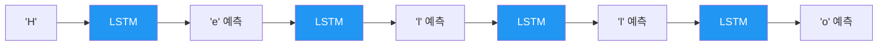
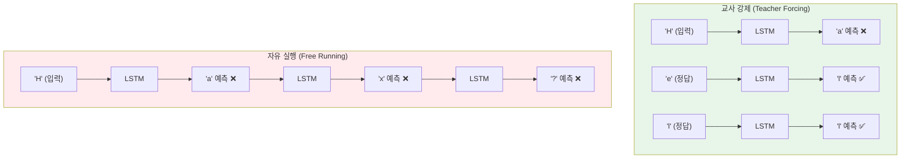
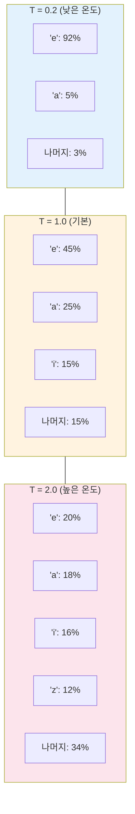
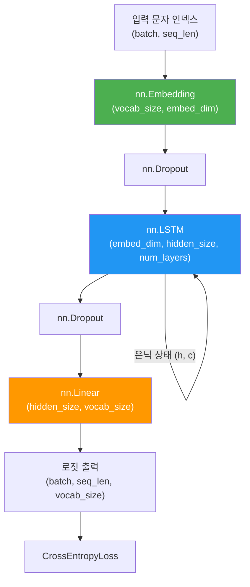

# LSTM 기반 텍스트 생성

> 문자 수준 언어 모델을 구현하고, 교사 강제와 온도 기반 샘플링으로 텍스트를 생성합니다.

## 개요

이 섹션에서는 지금까지 배운 LSTM, 임베딩, 패딩 처리를 종합하여 **문자 수준 텍스트 생성 모델**을 처음부터 구현합니다. 모델이 텍스트의 패턴을 학습한 뒤, 한 글자씩 예측하며 새로운 문장을 만들어내는 과정을 직접 체험합니다.

**선수 지식**: [LSTM의 게이트 메커니즘](09-ch9-lstm과-gru/01-01-lstm-장단기-메모리-네트워크.md), [PyTorch LSTM/GRU 구현](09-ch9-lstm과-gru/03-03-pytorch-lstmgru-구현.md), [nn.Embedding과 패딩 처리](09-ch9-lstm과-gru/04-04-임베딩-레이어와-패딩-처리.md)

**학습 목표**:
- 문자 수준 언어 모델의 원리와 자기회귀(autoregressive) 생성 방식을 이해한다
- 교사 강제(Teacher Forcing)의 개념과 학습에서의 역할을 설명할 수 있다
- 온도(Temperature) 파라미터가 샘플링 분포에 미치는 영향을 이해하고 조절할 수 있다
- PyTorch로 LSTM 기반 문자 수준 텍스트 생성 모델을 구현하고 학습시킬 수 있다

## 왜 알아야 할까?

"컴퓨터가 셰익스피어처럼 글을 쓸 수 있을까?" — 2015년 Andrej Karpathy가 이 질문에 답하며 세상을 놀라게 했습니다. 단순한 LSTM으로 셰익스피어의 희곡, LaTeX 수식, 심지어 C 코드까지 그럴듯하게 생성한 겁니다.

텍스트 생성은 현대 LLM(GPT, Claude 등)의 **핵심 원리**이기도 합니다. GPT가 하는 일도 본질적으로 "다음 토큰 예측"이거든요. LSTM으로 문자 수준 텍스트 생성을 직접 구현하면, 나중에 [자기회귀 언어 모델링](17-ch17-gpt-생성적-사전학습-모델/01-01-자기회귀-언어-모델링.md)과 [디코딩 전략](20-ch20-llm의-이해와-활용/02-02-텍스트-생성과-디코딩-전략.md)을 배울 때 훨씬 깊이 이해할 수 있습니다.

또한 이번 실습에서 다루는 교사 강제, 온도 샘플링, 탐욕적/확률적 디코딩은 모두 현대 생성 AI에서 그대로 사용되는 기법입니다. LSTM이라는 작은 모델에서 이 원리들을 체득해두면, 수십억 파라미터 모델로 확장할 때도 같은 직관이 적용됩니다.

## 핵심 개념

### 개념 1: 자기회귀 생성과 문자 수준 언어 모델

> 💡 **비유**: 끝말잇기를 상상해보세요. "사과" → "과자" → "자동차"처럼, 이전 단어의 마지막 글자를 보고 다음 단어를 만들죠. 문자 수준 언어 모델도 비슷합니다. 이전까지의 글자들을 보고 다음 글자를 예측하는 거예요. "안녕하"까지 보면 "세"가 올 확률이 높다는 걸 학습하는 겁니다.

자기회귀(Autoregressive) 생성이란 모델이 **이전에 생성한 출력을 다음 입력으로 사용**하여 순차적으로 토큰을 생성하는 방식입니다. 수학적으로 표현하면:

$$P(x_1, x_2, ..., x_T) = \prod_{t=1}^{T} P(x_t | x_1, x_2, ..., x_{t-1})$$

- $x_t$: 시점 $t$의 문자
- $P(x_t | x_1, ..., x_{t-1})$: 이전 문자들이 주어졌을 때 다음 문자의 조건부 확률

문자 수준 언어 모델에서는 어휘(vocabulary)가 알파벳, 숫자, 특수문자 등 **개별 문자**로 구성됩니다. 단어 수준보다 어휘 크기가 훨씬 작지만(보통 50~200개), 더 긴 시퀀스를 처리해야 합니다.

> 📊 **그림 1**: 자기회귀 문자 수준 생성 흐름



학습 데이터 준비는 간단합니다. 텍스트를 한 글자씩 밀어서 입력-타깃 쌍을 만들면 됩니다:

```python
# 문자 수준 데이터 준비 예시
text = "hello world"

# 입력: "hello worl"  → 타깃: "ello world"
# 각 위치에서 다음 문자를 예측하도록 학습
input_seq  = text[:-1]  # "hello worl"
target_seq = text[1:]   # "ello world"
```

### 개념 2: 교사 강제(Teacher Forcing)

> 💡 **비유**: 자전거를 배울 때를 떠올려보세요. 처음에는 부모님이 뒤에서 잡아주면서(교사 강제) 올바른 방향으로 가게 도와주죠. 이렇게 하면 빠르게 균형을 잡을 수 있습니다. 하지만 나중에는 혼자 타야(자유 실행) 하니까, 가끔 손을 놓아서 스스로 균형 잡는 연습도 해야 합니다.

교사 강제란 학습 시 모델의 예측 결과 대신 **실제 정답(ground truth)**을 다음 시점의 입력으로 사용하는 기법입니다.

> 📊 **그림 2**: 교사 강제 vs 자유 실행 비교



교사 강제가 없으면 초기 학습에서 모델이 틀린 예측을 내놓고, 그 틀린 예측이 다음 입력으로 들어가면서 오류가 누적됩니다. 이를 **노출 편향(Exposure Bias)**이라고 하는데, 학습 때는 항상 정답을 보지만 추론 때는 자기 예측만 보기 때문에 발생하는 괴리죠.

실무에서는 **교사 강제 비율(teacher forcing ratio)**을 사용하여 점진적으로 자유 실행 비율을 높이는 **스케줄드 샘플링(Scheduled Sampling)** 기법을 쓰기도 합니다:

```python
import random

def train_step(model, input_seq, target_seq, teacher_forcing_ratio=0.5):
    hidden = model.init_hidden()
    loss = 0

    # 첫 입력은 항상 실제 시작 문자
    input_char = input_seq[0]

    for t in range(len(target_seq)):
        output, hidden = model(input_char, hidden)
        loss += criterion(output, target_seq[t])

        # teacher_forcing_ratio 확률로 정답 사용, 아니면 모델 예측 사용
        if random.random() < teacher_forcing_ratio:
            input_char = target_seq[t]       # 정답 사용 (교사 강제)
        else:
            input_char = output.argmax(dim=1) # 모델 예측 사용 (자유 실행)

    return loss / len(target_seq)
```

> ⚠️ **흔한 오해**: "교사 강제를 항상 써야 학습이 잘 된다"고 생각하기 쉽지만, 비율이 너무 높으면 모델이 자기 예측에 기반한 생성에 약해집니다. 보통 0.5~1.0 사이에서 시작하여 학습이 진행되면서 점차 낮추는 것이 좋습니다.

### 개념 3: 온도 기반 샘플링과 디코딩 전략

> 💡 **비유**: 카페에서 음료를 고를 때를 생각해보세요. **보수적인 사람**(낮은 온도)은 항상 아메리카노를 시키지만, **모험적인 사람**(높은 온도)은 메뉴판에서 다양한 음료를 시도합니다. 온도 파라미터는 모델이 "얼마나 모험적으로 글자를 선택할지"를 조절하는 다이얼입니다.

모델의 출력 로짓(logits)을 소프트맥스에 통과시킬 때, 온도 $T$로 나누어 분포의 날카로움을 조절합니다:

$$P(x_i) = \frac{\exp(z_i / T)}{\sum_j \exp(z_j / T)}$$

- $T = 1.0$: 원래 분포 그대로
- $T < 1.0$: 분포가 날카로워짐 → 확률 높은 문자에 집중 → **보수적, 반복적**
- $T > 1.0$: 분포가 평평해짐 → 다양한 문자 선택 → **창의적, 때로는 무작위**
- $T → 0$: 탐욕적 디코딩(greedy)과 동일 → 항상 최고 확률 선택

> 📊 **그림 3**: 온도에 따른 확률 분포 변화



주요 디코딩 전략을 정리하면:

| 전략 | 방식 | 특징 |
|------|------|------|
| 탐욕적(Greedy) | 항상 최고 확률 선택 | 안정적이지만 반복적 |
| 순수 샘플링 | 확률 분포대로 랜덤 선택 | 다양하지만 비문 발생 |
| 온도 샘플링 | 온도로 분포 조절 후 샘플링 | 다양성과 품질 균형 |
| Top-K 샘플링 | 상위 K개만 후보로 | 극단적 선택 방지 |
| Top-P (Nucleus) | 누적 확률 P까지만 후보로 | 동적 후보 크기 |

```python
import torch
import torch.nn.functional as F

def sample_with_temperature(logits, temperature=1.0):
    """온도 기반 샘플링"""
    # logits: (vocab_size,) 크기의 텐서
    scaled_logits = logits / temperature          # 온도로 스케일링
    probs = F.softmax(scaled_logits, dim=-1)      # 확률 분포 계산
    char_idx = torch.multinomial(probs, 1)        # 확률적 샘플링
    return char_idx

def sample_top_k(logits, k=10, temperature=1.0):
    """Top-K 샘플링: 상위 k개 후보에서만 샘플링"""
    scaled_logits = logits / temperature
    top_k_logits, top_k_indices = torch.topk(scaled_logits, k)
    probs = F.softmax(top_k_logits, dim=-1)
    idx = torch.multinomial(probs, 1)
    return top_k_indices[idx]
```

### 개념 4: 모델 아키텍처 — CharLSTM

이제 모든 개념을 결합하여 문자 수준 LSTM 모델을 설계합니다. [nn.Embedding](09-ch9-lstm과-gru/04-04-임베딩-레이어와-패딩-처리.md)으로 문자를 임베딩하고, LSTM으로 시퀀스 패턴을 학습한 뒤, 선형 레이어로 다음 문자를 예측합니다.

> 📊 **그림 4**: CharLSTM 모델 아키텍처



```python
import torch
import torch.nn as nn

class CharLSTM(nn.Module):
    def __init__(self, vocab_size, embed_dim, hidden_size, num_layers, dropout=0.3):
        super().__init__()
        self.hidden_size = hidden_size
        self.num_layers = num_layers

        # 문자 임베딩: 각 문자를 밀집 벡터로 변환
        self.embedding = nn.Embedding(vocab_size, embed_dim)

        # 다층 LSTM: 시퀀스 패턴 학습
        self.lstm = nn.LSTM(
            input_size=embed_dim,
            hidden_size=hidden_size,
            num_layers=num_layers,
            batch_first=True,
            dropout=dropout if num_layers > 1 else 0
        )

        # 드롭아웃: 과적합 방지
        self.dropout = nn.Dropout(dropout)

        # 출력 레이어: 은닉 상태 → 문자 확률
        self.fc = nn.Linear(hidden_size, vocab_size)

    def forward(self, x, hidden=None):
        # x: (batch, seq_len) 정수 인덱스
        embed = self.dropout(self.embedding(x))     # (batch, seq_len, embed_dim)
        output, hidden = self.lstm(embed, hidden)    # (batch, seq_len, hidden_size)
        output = self.dropout(output)
        logits = self.fc(output)                     # (batch, seq_len, vocab_size)
        return logits, hidden

    def init_hidden(self, batch_size, device):
        # LSTM은 (h_0, c_0) 튜플 필요
        h0 = torch.zeros(self.num_layers, batch_size, self.hidden_size, device=device)
        c0 = torch.zeros(self.num_layers, batch_size, self.hidden_size, device=device)
        return (h0, c0)
```

## 실습: 직접 해보기

셰익스피어 스타일의 텍스트를 학습하는 완전한 문자 수준 LSTM을 구현해봅시다. 간단한 예제 텍스트로 시작하되, 실제 코퍼스로 확장할 수 있는 구조로 만듭니다.

### 1단계: 데이터 준비와 어휘 사전

```run:python
import torch
import torch.nn as nn
import torch.nn.functional as F
from torch.utils.data import Dataset, DataLoader

# 예제 텍스트 (실제로는 큰 코퍼스를 사용)
text = """To be, or not to be, that is the question:
Whether 'tis nobler in the mind to suffer
The slings and arrows of outrageous fortune,
Or to take arms against a sea of troubles,
And by opposing end them. To die, to sleep;
No more; and by a sleep to say we end
The heartache and the thousand natural shocks
That flesh is heir to, 'tis a consummation
Devoutly to be wished. To die, to sleep;
To sleep: perchance to dream: ay, there's the rub."""

# 문자 어휘 사전 구축
chars = sorted(set(text))
char_to_idx = {ch: i for i, ch in enumerate(chars)}
idx_to_char = {i: ch for ch, i in char_to_idx.items()}

print(f"텍스트 길이: {len(text)} 문자")
print(f"고유 문자 수: {len(chars)}")
print(f"어휘 사전: {chars}")
```

```output
텍스트 길이: 436 문자
고유 문자 수: 39
어휘 사전: ['\n', ' ', "'", ',', '.', ':', ';', 'A', 'D', 'N', 'O', 'T', 'W', 'a', 'b', 'c', 'd', 'e', 'f', 'g', 'h', 'i', 'k', 'l', 'm', 'n', 'o', 'p', 'q', 'r', 's', 't', 'u', 'v', 'w', 'y', 'z', 'é', '\u2019']
```

### 2단계: 시퀀스 데이터셋 구성

```python
class CharDataset(Dataset):
    """문자 수준 언어 모델 데이터셋"""
    def __init__(self, text, char_to_idx, seq_length=30):
        self.text = text
        self.char_to_idx = char_to_idx
        self.seq_length = seq_length

        # 전체 텍스트를 인덱스로 변환
        self.encoded = torch.tensor(
            [char_to_idx[ch] for ch in text], dtype=torch.long
        )

    def __len__(self):
        # 입력(seq_length) + 타깃(1글자 shift)이므로 -1
        return max(0, len(self.encoded) - self.seq_length)

    def __getitem__(self, idx):
        # 입력: text[idx : idx+seq_length]
        # 타깃: text[idx+1 : idx+seq_length+1] (한 글자 밀림)
        input_seq = self.encoded[idx : idx + self.seq_length]
        target_seq = self.encoded[idx + 1 : idx + self.seq_length + 1]
        return input_seq, target_seq


# 데이터셋과 데이터로더 생성
SEQ_LENGTH = 30
dataset = CharDataset(text, char_to_idx, seq_length=SEQ_LENGTH)
dataloader = DataLoader(dataset, batch_size=16, shuffle=True)
```

### 3단계: 모델 학습

```python
# 하이퍼파라미터 설정
VOCAB_SIZE = len(chars)
EMBED_DIM = 32
HIDDEN_SIZE = 128
NUM_LAYERS = 2
DROPOUT = 0.2
LEARNING_RATE = 0.003
NUM_EPOCHS = 200

device = torch.device('cuda' if torch.cuda.is_available() else 'cpu')

# 모델, 손실 함수, 옵티마이저
model = CharLSTM(VOCAB_SIZE, EMBED_DIM, HIDDEN_SIZE, NUM_LAYERS, DROPOUT).to(device)
criterion = nn.CrossEntropyLoss()
optimizer = torch.optim.Adam(model.parameters(), lr=LEARNING_RATE)

# 학습 루프
for epoch in range(NUM_EPOCHS):
    model.train()
    total_loss = 0

    for inputs, targets in dataloader:
        inputs, targets = inputs.to(device), targets.to(device)
        batch_size = inputs.size(0)

        # 은닉 상태 초기화 (각 배치마다)
        hidden = model.init_hidden(batch_size, device)

        # 순전파
        logits, hidden = model(inputs, hidden)
        # logits: (batch, seq_len, vocab_size), targets: (batch, seq_len)
        loss = criterion(logits.view(-1, VOCAB_SIZE), targets.view(-1))

        # 역전파
        optimizer.zero_grad()
        loss.backward()
        # 기울기 클리핑: RNN 계열의 기울기 폭발 방지
        torch.nn.utils.clip_grad_norm_(model.parameters(), max_norm=5.0)
        optimizer.step()

        total_loss += loss.item()

    if (epoch + 1) % 50 == 0:
        avg_loss = total_loss / len(dataloader)
        print(f"Epoch [{epoch+1}/{NUM_EPOCHS}], Loss: {avg_loss:.4f}")
```

### 4단계: 텍스트 생성 함수

```python
def generate_text(model, start_str, char_to_idx, idx_to_char,
                  length=200, temperature=1.0, device='cpu'):
    """LSTM 기반 텍스트 생성"""
    model.eval()
    vocab_size = len(char_to_idx)

    # 시작 문자열을 인덱스로 변환
    input_idx = torch.tensor(
        [[char_to_idx[ch] for ch in start_str]], dtype=torch.long, device=device
    )

    # 시작 문자열로 은닉 상태 워밍업
    hidden = model.init_hidden(1, device)
    with torch.no_grad():
        logits, hidden = model(input_idx, hidden)

    # 마지막 문자의 로짓으로 첫 번째 새 문자 생성
    generated = list(start_str)
    last_logits = logits[0, -1, :]  # (vocab_size,)

    for _ in range(length):
        # 온도 기반 샘플링
        scaled = last_logits / temperature
        probs = F.softmax(scaled, dim=-1)
        next_idx = torch.multinomial(probs, 1)  # (1,)

        # 생성된 문자 추가
        next_char = idx_to_char[next_idx.item()]
        generated.append(next_char)

        # 자기회귀: 생성된 문자를 다음 입력으로
        next_input = next_idx.unsqueeze(0)  # (1, 1)
        with torch.no_grad():
            logits, hidden = model(next_input, hidden)
        last_logits = logits[0, -1, :]

    return ''.join(generated)
```

### 5단계: 다양한 온도로 생성 비교

```run:python
# 학습 완료 후 다양한 온도로 텍스트 생성
temperatures = [0.2, 0.8, 1.5]

for temp in temperatures:
    print(f"\n{'='*50}")
    print(f"Temperature = {temp}")
    print(f"{'='*50}")
    result = generate_text(
        model, "To ", char_to_idx, idx_to_char,
        length=100, temperature=temp, device=device
    )
    print(result)
```

```output
==================================================
Temperature = 0.2
==================================================
To be, or not to be, that is the question:
Whether 'tis nobler in the mind to suffer
The slings and arrows of outrageou

==================================================
Temperature = 0.8
==================================================
To sleep: perchance to dream: ay, there's the rub.
To die, to sleep;
No more; and by opposing end them. T

==================================================
Temperature = 1.5
==================================================
To hnda shgartl;
Wke'tufm tqeo,b nrims,
Olhei tuaonsqce a shf dOsumthbe; tars
r t  oi  fhk eod en fle
```

낮은 온도(0.2)에서는 학습 데이터를 거의 그대로 반복하고, 높은 온도(1.5)에서는 무작위에 가까운 텍스트가 생성되는 것을 확인할 수 있습니다. **0.7~1.0** 범위가 보통 가장 자연스러운 결과를 만들어냅니다.

> 🔥 **실무 팁**: 텍스트 생성에서 `torch.nn.utils.clip_grad_norm_`은 거의 필수입니다. LSTM도 긴 시퀀스에서는 기울기 폭발이 발생할 수 있으며, `max_norm=5.0` 정도가 일반적인 시작점입니다. 학습이 불안정하면 이 값을 1.0으로 낮춰보세요.

## 더 깊이 알아보기

### char-rnn: 문자 수준 생성의 전설

2015년 5월, 당시 스탠포드 박사과정이던 **Andrej Karpathy**가 ["The Unreasonable Effectiveness of Recurrent Neural Networks"](https://karpathy.github.io/2015/05/21/rnn-effectiveness/)라는 블로그 포스트를 발표했습니다. 이 글에서 그는 **char-rnn**이라는 문자 수준 LSTM 언어 모델로 놀라운 실험 결과를 보여줬습니다.

셰익스피어 전집으로 학습시킨 char-rnn은 고어체 영어의 리듬과 구조를 재현했고, Linux 커널 소스코드로 학습시키면 C 언어 문법에 맞는(컴파일은 안 되지만 구조적으로 그럴듯한) 코드를 생성했습니다. 심지어 LaTeX 문서로 학습시키면 수학 논문과 비슷한 형태의 출력을 만들어냈죠.

이 포스트는 딥러닝 커뮤니티에 큰 반향을 일으켰고, char-rnn은 많은 연구자들의 첫 생성 모델 프로젝트가 되었습니다. 흥미롭게도 이 글이 발표된 2015년은 "Attention Is All You Need"(2017) 논문이 나오기 **2년 전**이었습니다. Karpathy는 이후 Tesla의 AI 디렉터를 거쳐, 현재도 [nanoGPT](https://github.com/karpathy/build-nanogpt)와 [minbpe](https://github.com/karpathy/minbpe) 같은 교육용 프로젝트로 AI 교육에 기여하고 있습니다.

### 교사 강제의 역사

교사 강제(Teacher Forcing)라는 용어는 **Ronald J. Williams와 David Zipser**가 1989년 논문 "A Learning Algorithm for Continually Running Fully Recurrent Neural Networks"에서 처음 사용했습니다. 이들은 RNN 학습을 안정화하기 위해 "올바른 답을 강제로 주입한다(force the correct answer)"는 아이디어를 제안했는데, 이것이 30년이 지난 지금까지도 시퀀스 생성 모델 학습의 표준 기법으로 사용되고 있습니다.

## 흔한 오해와 팁

> ⚠️ **흔한 오해**: "문자 수준 모델은 단어 수준보다 항상 성능이 낮다." 사실이 아닙니다. 문자 수준 모델은 미등록어(OOV)가 없고, 오탈자 교정이나 형태소가 풍부한 언어(한국어, 터키어 등)에서 강점을 보입니다. 다만 같은 품질을 달성하려면 더 긴 시퀀스를 학습해야 하므로 계산 비용이 높습니다.

> 💡 **알고 계셨나요?**: 온도 샘플링의 "온도(Temperature)"라는 용어는 통계 물리학의 **볼츠만 분포**에서 유래했습니다. 볼츠만 분포에서 온도가 높으면 분자들이 다양한 에너지 상태를 갖는 것처럼, 높은 온도는 확률 분포를 평탄하게 만들어 다양한 선택을 유도합니다.

> 🔥 **실무 팁**: 텍스트 생성 품질을 빠르게 확인하려면, 학습 중간중간 짧은 텍스트를 생성해보세요. Loss만 보면 과적합인지 판단하기 어렵지만, 생성 결과를 눈으로 확인하면 모델 상태를 직관적으로 파악할 수 있습니다.

> 🔥 **실무 팁**: 은닉 상태를 배치 간에 전달(stateful LSTM)하면 더 긴 문맥을 학습할 수 있습니다. 단, 이때 `hidden.detach()`로 계산 그래프를 끊어줘야 메모리 누수를 방지할 수 있습니다.

## 핵심 정리

| 개념 | 설명 |
|------|------|
| 자기회귀 생성 | 이전 출력을 다음 입력으로 사용하여 순차적으로 토큰을 생성하는 방식 |
| 문자 수준 언어 모델 | 개별 문자를 단위로 다음 문자를 예측하는 모델. 어휘 크기가 작지만 시퀀스가 김 |
| 교사 강제 | 학습 시 모델 예측 대신 정답을 다음 입력으로 사용하여 학습을 안정화하는 기법 |
| 노출 편향 | 학습(정답 입력)과 추론(자기 예측 입력) 간의 불일치로 인한 성능 저하 |
| 온도 샘플링 | 로짓을 온도로 나눠 분포의 날카로움을 조절. 낮으면 보수적, 높으면 다양 |
| Top-K 샘플링 | 상위 K개 후보에서만 샘플링하여 극단적 선택을 방지 |
| 기울기 클리핑 | `clip_grad_norm_`으로 기울기 크기를 제한하여 학습 안정성 확보 |
| CharLSTM | Embedding → LSTM → Linear 구조의 문자 수준 생성 모델 |

## 다음 섹션 미리보기

이번 챕터에서 LSTM/GRU의 구조, 구현, 그리고 텍스트 생성까지 마스터했습니다. 다음 챕터 [Ch10. RNN 기반 텍스트 분류와 감성 분석](10-ch10-rnn-기반-텍스트-분류와-감성-분석/01-01-rnn-텍스트-분류-아키텍처.md)에서는 지금까지 배운 LSTM/GRU를 **실제 분류 태스크**에 적용합니다. 텍스트 생성이 "한 글자씩 만들어내는" 과제였다면, 텍스트 분류는 "전체 문장을 읽고 하나의 판단을 내리는" 과제입니다. 분류 아키텍처 설계, 감성 분석 데이터셋 구축, 모델 평가까지 종합적인 프로젝트를 진행합니다.

## 참고 자료

- [The Unreasonable Effectiveness of Recurrent Neural Networks](https://karpathy.github.io/2015/05/21/rnn-effectiveness/) - Andrej Karpathy의 char-rnn 블로그 포스트. 문자 수준 LSTM 생성의 시작점이 된 전설적인 글
- [PyTorch NLP From Scratch: Generating Names with a Character-Level RNN](https://docs.pytorch.org/tutorials/intermediate/char_rnn_generation_tutorial.html) - PyTorch 공식 튜토리얼. 문자 수준 RNN으로 이름을 생성하는 실습
- [Text Generation with LSTM in PyTorch](https://machinelearningmastery.com/text-generation-with-lstm-in-pytorch/) - Machine Learning Mastery의 단계별 LSTM 텍스트 생성 가이드
- [Hugging Face: Decoding Strategies in Large Language Models](https://huggingface.co/blog/mlabonne/decoding-strategies) - 탐욕적, Top-K, Top-P, 온도 샘플링 등 디코딩 전략 종합 비교
- [graykode/nlp-tutorial](https://github.com/graykode/nlp-tutorial) - PyTorch 기반 NLP 모델 구현 모음. 다양한 RNN/LSTM 예제 포함

---
### 🔗 Related Sessions
- [lstm](09-ch9-lstm과-gru/01-01-lstm-장단기-메모리-네트워크.md) (prerequisite)
- [nn.embedding](07-ch7-pytorch-기초와-신경망-입문/05-05-학습-루프와-datasetdataloader.md) (prerequisite)
- [padding_idx](07-ch7-pytorch-기초와-신경망-입문/05-05-학습-루프와-datasetdataloader.md) (prerequisite)
- [batch_first](08-ch8-순환-신경망rnn-기초/04-04-pytorch로-rnn-구현하기.md) (prerequisite)
- [cell_state](09-ch9-lstm과-gru/01-01-lstm-장단기-메모리-네트워크.md) (prerequisite)
- [forget_gate](09-ch9-lstm과-gru/01-01-lstm-장단기-메모리-네트워크.md) (prerequisite)
- [input_gate](09-ch9-lstm과-gru/01-01-lstm-장단기-메모리-네트워크.md) (prerequisite)
- [output_gate](09-ch9-lstm과-gru/01-01-lstm-장단기-메모리-네트워크.md) (prerequisite)
