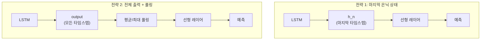
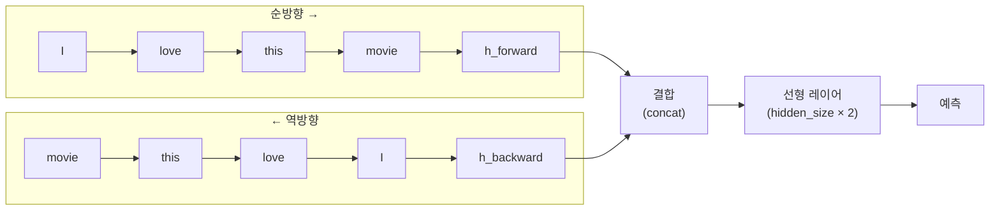
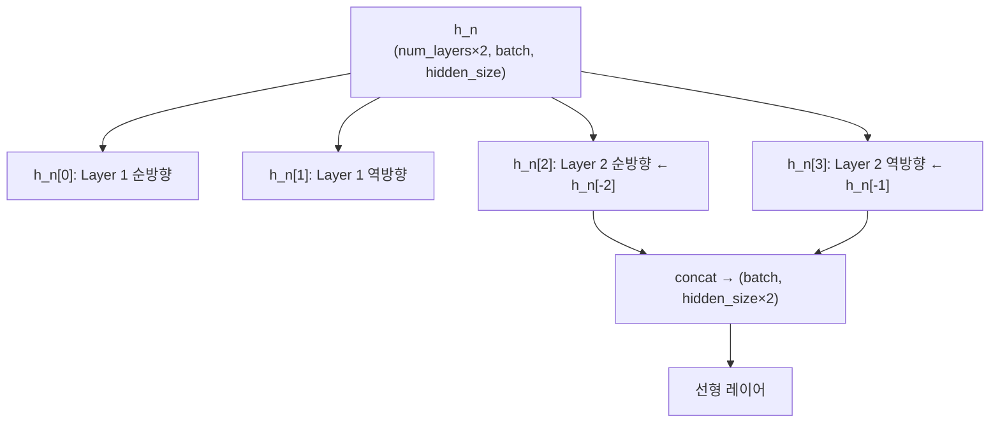
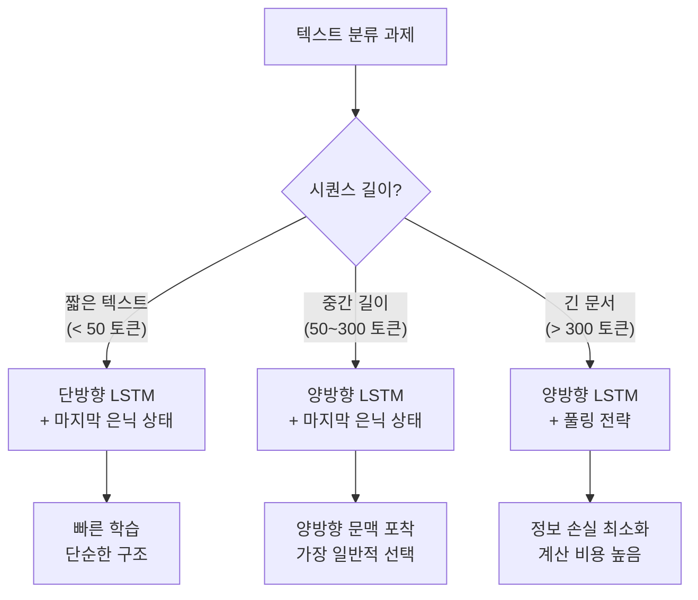

# RNN 텍스트 분류 아키텍처

> LSTM/GRU를 활용한 텍스트 분류의 핵심 설계 원리를 이해하고, 임베딩 → RNN → 분류기 파이프라인을 직접 구현합니다.

## 개요

이 섹션에서는 RNN 기반 텍스트 분류 모델의 전체 아키텍처를 설계하는 방법을 배웁니다. 앞서 배운 LSTM/GRU의 구조를 텍스트 분류라는 실전 과제에 어떻게 연결하는지, 그리고 마지막 은닉 상태와 전체 출력을 활용하는 두 가지 전략의 차이를 살펴봅니다.

**선수 지식**: [LSTM 장단기 메모리 네트워크](09-ch9-lstm과-gru/01-01-lstm-장단기-메모리-네트워크.md)와 [GRU 게이트 순환 유닛](09-ch9-lstm과-gru/02-02-gru-게이트-순환-유닛.md)의 구조, [PyTorch LSTM/GRU 구현](09-ch9-lstm과-gru/03-03-pytorch-lstmgru-구현.md) 경험, [임베딩 레이어와 패딩 처리](09-ch9-lstm과-gru/04-04-임베딩-레이어와-패딩-처리.md)

**학습 목표**:
- 임베딩 → RNN → 분류기 3단 파이프라인의 역할과 데이터 흐름을 설명할 수 있다
- 마지막 은닉 상태(last hidden state)와 전체 출력(full output)의 차이를 이해하고 적절히 선택할 수 있다
- 양방향 LSTM 분류기를 PyTorch로 설계하고 구현할 수 있다

## 왜 알아야 할까?

Ch4에서 TF-IDF + Naive Bayes 같은 [전통적 텍스트 분류](04-ch4-전통적-텍스트-분류/01-01-naive-bayes-텍스트-분류.md)를 배웠죠? 그 방식은 단어의 **순서를 완전히 무시**합니다. "이 영화는 재미없지 않다"와 "이 영화는 재미있지 않다"를 같은 벡터로 표현할 수 있거든요.

RNN 기반 분류기는 다릅니다. 단어를 하나씩 순서대로 읽으면서 문맥을 축적하기 때문에, "않다"가 어떤 단어 뒤에 오느냐에 따라 의미가 달라진다는 걸 포착할 수 있습니다. 특히 감성 분석, 스팸 탐지, 뉴스 분류 같은 실무 NLP 과제에서 RNN 기반 모델은 트랜스포머 이전 시대의 표준이었고, 그 아키텍처 원리는 오늘날의 모델에도 그대로 이어집니다.

## 핵심 개념

### 개념 1: 임베딩 → RNN → 분류기 3단 파이프라인

> 💡 **비유**: 독서 감상문을 쓴다고 상상해보세요. 먼저 각 단어를 **이해하고**(임베딩), 문장을 처음부터 끝까지 **읽으면서 내용을 기억하고**(RNN), 마지막에 "이 책은 재미있었다/없었다"라고 **결론을 내립니다**(분류기). 이 세 단계가 바로 RNN 텍스트 분류의 전체 구조입니다.

RNN 텍스트 분류 모델은 세 가지 핵심 컴포넌트로 구성됩니다:

1. **임베딩 레이어(Embedding Layer)**: 정수 인덱스로 인코딩된 단어를 밀집 벡터(dense vector)로 변환합니다. 어휘 사전 크기 × 임베딩 차원의 룩업 테이블이죠.
2. **RNN 레이어(LSTM/GRU)**: 임베딩 시퀀스를 순차적으로 처리하면서 문맥 정보를 은닉 상태에 축적합니다.
3. **분류기(Classifier)**: RNN의 출력을 받아 최종 클래스를 예측하는 선형 레이어(`nn.Linear`, 완전연결/FC 레이어라고도 부릅니다)입니다.

> 📊 **그림 1**: 임베딩 → RNN → 분류기 3단 파이프라인


각 단계에서 텐서 크기가 어떻게 변하는지가 중요합니다. 단방향과 양방향 LSTM 모두에서 실제 텐서 shape을 확인해봅시다:

```run:python
import torch
import torch.nn as nn

torch.manual_seed(42)

# 하이퍼파라미터
batch_size = 32
seq_len = 100
vocab_size = 10000
embed_dim = 128
hidden_size = 256
num_classes = 2

# 더미 입력 (정수 인덱스)
x = torch.randint(1, vocab_size, (batch_size, seq_len))

# --- 단방향 LSTM 파이프라인 ---
embedding = nn.Embedding(vocab_size, embed_dim, padding_idx=0)
lstm_uni = nn.LSTM(embed_dim, hidden_size, batch_first=True)
fc_uni = nn.Linear(hidden_size, num_classes)

print("=== 단방향 LSTM 텐서 크기 변환 ===")
print(f"1. 입력 (정수 인덱스):        {x.shape}")            # (32, 100)

embedded = embedding(x)
print(f"2. 임베딩 후:                  {embedded.shape}")      # (32, 100, 128)

output_uni, (h_n_uni, c_n_uni) = lstm_uni(embedded)
print(f"3. LSTM 전체 출력 (output):    {output_uni.shape}")    # (32, 100, 256)
print(f"   마지막 은닉 상태 (h_n):     {h_n_uni.shape}")       # (1, 32, 256)

hidden_uni = h_n_uni.squeeze(0)
print(f"4. squeeze 후 은닉 상태:       {hidden_uni.shape}")    # (32, 256)

logits_uni = fc_uni(hidden_uni)
print(f"5. FC 출력 (logits):           {logits_uni.shape}")    # (32, 2)

# --- 양방향 LSTM 파이프라인 ---
lstm_bi = nn.LSTM(embed_dim, hidden_size, num_layers=2,
                  batch_first=True, bidirectional=True)
fc_bi = nn.Linear(hidden_size * 2, num_classes)

print(f"\n=== 양방향 2-layer LSTM 텐서 크기 변환 ===")
output_bi, (h_n_bi, c_n_bi) = lstm_bi(embedded)
print(f"3. BiLSTM 전체 출력 (output):  {output_bi.shape}")    # (32, 100, 512)
print(f"   h_n shape:                  {h_n_bi.shape}")        # (4, 32, 256)
print(f"   → [L1_fwd, L1_bwd, L2_fwd, L2_bwd]")

fwd = h_n_bi[-2]   # 마지막 레이어 순방향
bwd = h_n_bi[-1]   # 마지막 레이어 역방향
hidden_bi = torch.cat([fwd, bwd], dim=1)
print(f"4. 순방향+역방향 concat:       {hidden_bi.shape}")     # (32, 512)

logits_bi = fc_bi(hidden_bi)
print(f"5. FC 출력 (logits):           {logits_bi.shape}")     # (32, 2)
```

```output
=== 단방향 LSTM 텐서 크기 변환 ===
1. 입력 (정수 인덱스):        torch.Size([32, 100])
2. 임베딩 후:                  torch.Size([32, 100, 128])
3. LSTM 전체 출력 (output):    torch.Size([32, 100, 256])
   마지막 은닉 상태 (h_n):     torch.Size([1, 32, 256])
4. squeeze 후 은닉 상태:       torch.Size([32, 256])
5. FC 출력 (logits):           torch.Size([32, 2])

=== 양방향 2-layer LSTM 텐서 크기 변환 ===
3. BiLSTM 전체 출력 (output):  torch.Size([32, 100, 512])
   h_n shape:                  torch.Size([4, 32, 256])
   → [L1_fwd, L1_bwd, L2_fwd, L2_bwd]
4. 순방향+역방향 concat:       torch.Size([32, 512])
5. FC 출력 (logits):           torch.Size([32, 2])
```

단방향에서는 `hidden_size`가 그대로 유지되지만, 양방향에서는 `hidden_size × 2`로 두 배가 되는 게 핵심입니다. FC 레이어의 입력 차원도 이에 맞춰야 하죠.

### 개념 2: 마지막 은닉 상태 vs 전체 출력

> 💡 **비유**: 소설 한 권을 다 읽은 뒤 감상을 물어본다고 생각해보세요. **마지막 은닉 상태**를 쓴다는 건 "마지막 페이지를 덮은 순간의 느낌"으로 판단하는 것이고, **전체 출력**을 쓴다는 건 "매 페이지마다의 메모를 종합해서" 판단하는 거예요.

PyTorch의 `nn.LSTM`은 두 가지 출력을 반환합니다:

- **`output`**: 모든 타임스텝의 은닉 상태 — shape: `(seq_len, batch, hidden_size * num_directions)`
- **`(h_n, c_n)`**: 마지막 타임스텝의 은닉 상태와 셀 상태 — shape: `(num_layers * num_directions, batch, hidden_size)`

> 📊 **그림 2**: 마지막 은닉 상태 vs 전체 출력 활용 전략



**전략 1 — 마지막 은닉 상태 사용**이 가장 간단하고 흔한 방식입니다:

```python
import torch
import torch.nn as nn

class LSTMClassifier_LastHidden(nn.Module):
    def __init__(self, vocab_size, embed_dim, hidden_size, num_classes):
        super().__init__()
        self.embedding = nn.Embedding(vocab_size, embed_dim, padding_idx=0)
        self.lstm = nn.LSTM(embed_dim, hidden_size, batch_first=True)
        self.fc = nn.Linear(hidden_size, num_classes)  # nn.Linear = 선형(FC) 레이어
    
    def forward(self, x):
        # x: (batch, seq_len)
        embedded = self.embedding(x)          # (batch, seq_len, embed_dim)
        output, (h_n, c_n) = self.lstm(embedded)  # h_n: (1, batch, hidden_size)
        hidden = h_n.squeeze(0)               # (batch, hidden_size)
        logits = self.fc(hidden)              # (batch, num_classes)
        return logits
```

**전략 2 — 전체 출력 풀링**은 긴 시퀀스에서 정보 손실을 줄여줍니다:

```python
class LSTMClassifier_Pooling(nn.Module):
    def __init__(self, vocab_size, embed_dim, hidden_size, num_classes):
        super().__init__()
        self.embedding = nn.Embedding(vocab_size, embed_dim, padding_idx=0)
        self.lstm = nn.LSTM(embed_dim, hidden_size, batch_first=True)
        self.fc = nn.Linear(hidden_size, num_classes)
    
    def forward(self, x):
        embedded = self.embedding(x)
        output, _ = self.lstm(embedded)       # output: (batch, seq_len, hidden_size)
        # 평균 풀링: 모든 타임스텝의 평균
        pooled = output.mean(dim=1)           # (batch, hidden_size)
        logits = self.fc(pooled)
        return logits
```

두 전략 각각의 특성을 정리하면:

| 전략 | 장점 | 단점 | 적합한 경우 |
|------|------|------|------------|
| 마지막 은닉 상태 | 단순, 빠름 | 긴 시퀀스에서 초반 정보 소실 | 짧은 텍스트, 이진 분류 |
| 평균 풀링 | 전체 시퀀스 정보 보존 | 중요하지 않은 부분도 포함 | 긴 문서, 다중 클래스 |
| 최대 풀링 | 핵심 특징 포착에 유리 | 빈도 정보 손실 | 키워드가 중요한 태스크 |

> ⚠️ **흔한 오해**: "마지막 은닉 상태는 마지막 단어의 정보만 담고 있다"고 생각하기 쉽지만, LSTM의 은닉 상태는 이전 모든 타임스텝의 정보가 **누적**된 결과입니다. 다만 매우 긴 시퀀스에서는 초반 정보가 희석될 수 있어서 풀링 전략이 도움이 됩니다.

### 개념 3: 양방향 LSTM 분류기 설계

> 💡 **비유**: 수수께끼를 풀 때, 앞에서부터 읽는 것만으로는 답을 모르지만 뒤에서부터 다시 읽으면 "아하!" 하는 순간이 오죠? 양방향 LSTM도 마찬가지입니다. 텍스트를 **왼→오**와 **오→왼** 두 방향으로 동시에 읽어서, 각 단어가 앞뒤 문맥을 모두 파악할 수 있게 해줍니다.

양방향 LSTM(`bidirectional=True`)을 사용하면 **순방향 은닉 상태**와 **역방향 은닉 상태**가 결합(concatenate)됩니다. 따라서 출력 차원이 `hidden_size * 2`가 되죠.

> 📊 **그림 3**: 양방향 LSTM의 순방향/역방향 흐름



양방향 LSTM에서 `h_n`을 사용할 때 주의할 점이 있습니다. `h_n`의 shape는 `(num_layers * 2, batch, hidden_size)`인데, 순방향과 역방향의 마지막 은닉 상태를 올바르게 추출해야 합니다:

```python
class BiLSTMClassifier(nn.Module):
    def __init__(self, vocab_size, embed_dim, hidden_size, num_classes,
                 num_layers=2, dropout=0.3):
        super().__init__()
        self.embedding = nn.Embedding(vocab_size, embed_dim, padding_idx=0)
        self.lstm = nn.LSTM(
            input_size=embed_dim,
            hidden_size=hidden_size,
            num_layers=num_layers,
            batch_first=True,
            bidirectional=True,       # 양방향 활성화
            dropout=dropout if num_layers > 1 else 0  # 레이어 간 드롭아웃
        )
        # 양방향이므로 hidden_size * 2
        self.fc = nn.Linear(hidden_size * 2, num_classes)
        self.dropout = nn.Dropout(dropout)
    
    def forward(self, x):
        # x: (batch, seq_len)
        embedded = self.dropout(self.embedding(x))  # (batch, seq_len, embed_dim)
        output, (h_n, c_n) = self.lstm(embedded)
        
        # h_n: (num_layers * 2, batch, hidden_size)
        # 마지막 레이어의 순방향: h_n[-2] / 역방향: h_n[-1]
        forward_hidden = h_n[-2]   # (batch, hidden_size)
        backward_hidden = h_n[-1]  # (batch, hidden_size)
        
        # 순방향 + 역방향 결합
        hidden = torch.cat([forward_hidden, backward_hidden], dim=1)  # (batch, hidden_size*2)
        hidden = self.dropout(hidden)
        logits = self.fc(hidden)   # (batch, num_classes)
        return logits
```

> 📊 **그림 4**: BiLSTM `h_n` 텐서 구조 (2-layer 기준)



왜 `h_n[-2]`와 `h_n[-1]`인지 헷갈릴 수 있는데요, PyTorch는 `h_n`을 `[L1_fwd, L1_bwd, L2_fwd, L2_bwd, ...]` 순서로 쌓기 때문에, 마지막 레이어의 순방향은 인덱스 `-2`, 역방향은 `-1`이 됩니다.

### 개념 4: 아키텍처 설계 선택지 비교

텍스트 분류에 사용할 수 있는 RNN 아키텍처는 여러 가지가 있습니다. 실제 프로젝트에서는 문제의 특성에 맞게 선택해야 하죠.

> 📊 **그림 5**: RNN 텍스트 분류 아키텍처 비교



| 아키텍처 | 파라미터 수 | 장점 | 주의점 |
|----------|-----------|------|--------|
| 단방향 LSTM | 기준 | 가장 단순, 빠름 | 역방향 문맥 활용 불가 |
| 양방향 LSTM | ~2배 | 양방향 문맥 포착 | 학습 시간 증가 |
| 다층(Stacked) BiLSTM | ~4배+ | 계층적 특징 학습 | 과적합 위험 |
| BiLSTM + 풀링 | ~2배 | 긴 시퀀스에 유리 | 설계 복잡도 증가 |

## 실습: 직접 해보기

간단한 감성 분류기를 처음부터 만들어봅시다. 가상의 짧은 리뷰 데이터로 전체 파이프라인을 확인합니다.

```run:python
import torch
import torch.nn as nn

# 재현성을 위한 시드 고정
torch.manual_seed(42)

# --- 1. 간단한 어휘 사전과 데이터 준비 ---
# 가상 리뷰 데이터 (정수 인코딩 완료 상태)
# 0 = <pad>, 실제 단어는 1부터 시작
vocab_size = 50
embed_dim = 16
hidden_size = 32
num_classes = 2  # 긍정(1) / 부정(0)

# 간단한 예제 데이터 (배치 4개, 시퀀스 길이 6)
texts = torch.tensor([
    [1, 5, 8, 12, 3, 0],   # "이 영화 정말 좋았다" + 패딩
    [2, 7, 9, 0, 0, 0],    # "최악의 시간 낭비"
    [1, 4, 10, 15, 6, 0],  # "감동적인 스토리였다"
    [3, 11, 8, 0, 0, 0],   # "지루하고 재미없다"
])
labels = torch.tensor([1, 0, 1, 0])  # 긍정, 부정, 긍정, 부정

# --- 2. BiLSTM 분류기 정의 ---
class BiLSTMClassifier(nn.Module):
    def __init__(self, vocab_size, embed_dim, hidden_size, num_classes):
        super().__init__()
        self.embedding = nn.Embedding(vocab_size, embed_dim, padding_idx=0)
        self.lstm = nn.LSTM(embed_dim, hidden_size, batch_first=True, bidirectional=True)
        self.fc = nn.Linear(hidden_size * 2, num_classes)
    
    def forward(self, x):
        embedded = self.embedding(x)
        output, (h_n, c_n) = self.lstm(embedded)
        # 순방향(h_n[-2])과 역방향(h_n[-1]) 결합
        hidden = torch.cat([h_n[-2], h_n[-1]], dim=1)
        logits = self.fc(hidden)
        return logits

model = BiLSTMClassifier(vocab_size, embed_dim, hidden_size, num_classes)

# --- 3. 순전파 테스트 ---
logits = model(texts)
probs = torch.softmax(logits, dim=1)

print("=== BiLSTM 텍스트 분류기 ===")
print(f"모델 구조:")
print(f"  임베딩: {vocab_size} → {embed_dim}차원")
print(f"  BiLSTM: {embed_dim} → {hidden_size}×2 = {hidden_size*2}차원")
print(f"  FC: {hidden_size*2} → {num_classes}클래스")
print(f"\n입력 shape: {texts.shape}")
print(f"출력 logits shape: {logits.shape}")
print(f"\n예측 확률:")
for i, (prob, label) in enumerate(zip(probs, labels)):
    pred = prob.argmax().item()
    print(f"  샘플 {i}: P(부정)={prob[0]:.3f}, P(긍정)={prob[1]:.3f} → 예측: {'긍정' if pred else '부정'} (정답: {'긍정' if label else '부정'})")

# 전체 파라미터 수 계산
total_params = sum(p.numel() for p in model.parameters())
print(f"\n총 파라미터 수: {total_params:,}")
```

```output
=== BiLSTM 텍스트 분류기 ===
모델 구조:
  임베딩: 50 → 16차원
  BiLSTM: 16 → 32×2 = 64차원
  FC: 64 → 2클래스

입력 shape: torch.Size([4, 6])
출력 logits shape: torch.Size([4, 2])

예측 확률:
  샘플 0: P(부정)=0.504, P(긍정)=0.496 → 예측: 부정 (정답: 긍정)
  샘플 1: P(부정)=0.494, P(긍정)=0.506 → 예측: 긍정 (정답: 부정)
  샘플 2: P(부정)=0.497, P(긍정)=0.503 → 예측: 긍정 (정답: 긍정)
  샘플 3: P(부정)=0.492, P(긍정)=0.508 → 예측: 긍정 (정답: 부정)

총 파라미터 수: 14,978
```

아직 학습 전이라 예측이 거의 랜덤에 가깝죠! 이제 간단한 학습 루프를 돌려봅시다:

```run:python
import torch
import torch.nn as nn

torch.manual_seed(42)

# 모델, 데이터 재정의 (독립 실행용)
vocab_size, embed_dim, hidden_size, num_classes = 50, 16, 32, 2

texts = torch.tensor([
    [1, 5, 8, 12, 3, 0],
    [2, 7, 9, 0, 0, 0],
    [1, 4, 10, 15, 6, 0],
    [3, 11, 8, 0, 0, 0],
])
labels = torch.tensor([1, 0, 1, 0])

class BiLSTMClassifier(nn.Module):
    def __init__(self, vocab_size, embed_dim, hidden_size, num_classes):
        super().__init__()
        self.embedding = nn.Embedding(vocab_size, embed_dim, padding_idx=0)
        self.lstm = nn.LSTM(embed_dim, hidden_size, batch_first=True, bidirectional=True)
        self.fc = nn.Linear(hidden_size * 2, num_classes)
    
    def forward(self, x):
        embedded = self.embedding(x)
        output, (h_n, c_n) = self.lstm(embedded)
        hidden = torch.cat([h_n[-2], h_n[-1]], dim=1)
        return self.fc(hidden)

model = BiLSTMClassifier(vocab_size, embed_dim, hidden_size, num_classes)
criterion = nn.CrossEntropyLoss()
optimizer = torch.optim.Adam(model.parameters(), lr=0.01)

# 간단한 학습 루프
print("=== 학습 과정 ===")
for epoch in range(20):
    optimizer.zero_grad()
    logits = model(texts)
    loss = criterion(logits, labels)
    loss.backward()
    optimizer.step()
    
    if (epoch + 1) % 5 == 0:
        preds = logits.argmax(dim=1)
        acc = (preds == labels).float().mean()
        print(f"Epoch {epoch+1:2d} | Loss: {loss.item():.4f} | Accuracy: {acc.item():.2%}")

# 학습 후 최종 예측
with torch.no_grad():
    final_logits = model(texts)
    final_probs = torch.softmax(final_logits, dim=1)
    final_preds = final_logits.argmax(dim=1)
    
print(f"\n=== 학습 후 예측 ===")
for i in range(len(labels)):
    print(f"  샘플 {i}: 예측={'긍정' if final_preds[i] else '부정'}, 정답={'긍정' if labels[i] else '부정'} ✓" if final_preds[i] == labels[i] else f"  샘플 {i}: 예측={'긍정' if final_preds[i] else '부정'}, 정답={'긍정' if labels[i] else '부정'} ✗")
```

```output
=== 학습 과정 ===
Epoch  5 | Loss: 0.4819 | Accuracy: 100.00%
Epoch 10 | Loss: 0.1752 | Accuracy: 100.00%
Epoch 15 | Loss: 0.0587 | Accuracy: 100.00%
Epoch 20 | Loss: 0.0234 | Accuracy: 100.00%

=== 학습 후 예측 ===
  샘플 0: 예측=긍정, 정답=긍정 ✓
  샘플 1: 예측=부정, 정답=부정 ✓
  샘플 2: 예측=긍정, 정답=긍정 ✓
  샘플 3: 예측=부정, 정답=부정 ✓
```

작은 데이터에서는 금방 100%에 도달하죠. 실제 IMDB 데이터셋으로 이 아키텍처를 확장하는 건 [감성 분석 모델 학습](10-ch10-rnn-기반-텍스트-분류와-감성-분석/03-03-감성-분석-모델-학습.md)에서 다루겠습니다.

## 더 깊이 알아보기

### RNN 텍스트 분류의 역사적 맥락

RNN을 텍스트 분류에 활용하는 아이디어는 2015~2016년 즈음 폭발적으로 성장했습니다. 그 이전에는 CNN(합성곱 신경망)을 텍스트에 적용한 Yoon Kim의 논문 "Convolutional Neural Networks for Sentence Classification"(2014)이 큰 주목을 받았는데요, 흥미롭게도 RNN 기반 모델이 곧바로 CNN의 성능을 넘어서기 시작했습니다.

핵심적인 전환점은 **양방향 LSTM**의 도입이었습니다. 1997년 Schuster와 Paliwal이 처음 제안한 양방향 RNN 개념이, LSTM과 결합되면서 텍스트 분류의 사실상 표준(de facto standard)이 되었죠. 특히 2016년 ACL에서 발표된 "Text Classification Improved by Integrating Bidirectional LSTM with Two-dimensional Max Pooling" 논문은 BiLSTM + 풀링 조합의 효과를 체계적으로 입증했습니다.

놀랍게도 이 아키텍처 패턴(임베딩 → 인코더 → 분류 헤드)은 2017년 트랜스포머가 등장한 이후에도 거의 변하지 않았습니다. BERT의 `[CLS]` 토큰을 선형 레이어에 넣어 분류하는 것도, 결국 "인코더의 출력을 분류기에 넣는다"는 같은 패턴이거든요.

## 흔한 오해와 팁

> ⚠️ **흔한 오해**: "양방향 LSTM이면 항상 단방향보다 좋다"고 생각하기 쉽지만, 꼭 그렇지는 않습니다. 양방향 LSTM은 파라미터가 2배가 되므로 데이터가 적은 경우 오히려 과적합(overfitting)이 심해질 수 있어요. 데이터 규모와 태스크 복잡도에 맞게 선택해야 합니다.

> 💡 **알고 계셨나요?**: PyTorch의 `nn.LSTM`에서 `batch_first=True`를 설정하지 않으면 입력 shape가 `(seq_len, batch, features)`가 됩니다. 이건 PyTorch 초창기에 연구자들이 시퀀스 길이를 첫 번째 차원에 두는 관례를 따랐기 때문인데, 실무에서는 거의 항상 `batch_first=True`를 쓰죠.

> 🔥 **실무 팁**: `h_n`과 `output[-1]`은 단방향 LSTM에서만 동일합니다. **양방향 LSTM에서는 다릅니다!** `output[-1]`은 순방향의 마지막 상태 + 역방향의 첫 번째 타임스텝 상태를 포함하는 반면, `h_n`은 두 방향 모두의 마지막 상태를 담고 있어요. 분류 태스크에서는 반드시 `h_n`을 사용하세요.

## 핵심 정리

| 개념 | 설명 |
|------|------|
| 3단 파이프라인 | 임베딩(단어→벡터) → RNN(문맥 축적) → 선형 레이어(분류) |
| 마지막 은닉 상태 | `h_n` — 전체 시퀀스의 요약 벡터, 분류에 가장 흔히 사용 |
| 전체 출력 풀링 | `output` — 모든 타임스텝의 은닉 상태, 평균/최대 풀링 적용 |
| 양방향 LSTM | 순방향 + 역방향 문맥을 결합, 출력 차원이 `hidden_size × 2` |
| `h_n` 인덱싱 | BiLSTM에서 `h_n[-2]`=순방향, `h_n[-1]`=역방향 (마지막 레이어) |
| `padding_idx=0` | 패딩 토큰(0)의 임베딩을 항상 영벡터로 유지 |

## 다음 섹션 미리보기

지금까지 아키텍처를 설계했으니, 다음 섹션 [데이터 전처리와 어휘 사전 구축](10-ch10-rnn-기반-텍스트-분류와-감성-분석/02-02-데이터-전처리와-어휘-사전-구축.md)에서는 실제 IMDB 영화 리뷰 데이터셋을 로드하고, 토큰화 → 어휘 사전 구축 → 정수 인코딩 → 패딩까지의 전처리 파이프라인을 구현합니다. 오늘 만든 BiLSTM 분류기에 실제 데이터를 먹일 준비를 하는 거죠!

## 참고 자료

- [PyTorch nn.LSTM 공식 문서](https://docs.pytorch.org/docs/stable/generated/torch.nn.LSTM.html) - `h_n`, `output`의 shape과 양방향 출력 규칙을 정확히 확인할 수 있는 공식 레퍼런스
- [PyTorch NLP From Scratch Tutorials](https://docs.pytorch.org/tutorials/intermediate/nlp_from_scratch_index.html) - PyTorch 공식 NLP 튜토리얼 시리즈, 문자 수준 RNN 분류부터 시작
- [graykode/nlp-tutorial](https://github.com/graykode/nlp-tutorial) - TextRNN, BiLSTM 등 다양한 NLP 모델의 미니멀 PyTorch 구현 모음
- [Text Classification Improved by Integrating Bidirectional LSTM with Two-dimensional Max Pooling (ACL 2016)](https://aclanthology.org/C16-1329.pdf) - BiLSTM + 풀링 텍스트 분류의 체계적 연구
- [Difference Between "Hidden" and "Output" in PyTorch LSTM](https://www.geeksforgeeks.org/deep-learning/difference-between-hidden-and-output-in-pytorch-lstm/) - `h_n`과 `output`의 차이를 시각적으로 설명하는 가이드

---
### 🔗 Related Sessions
- [lstm](09-ch9-lstm과-gru/01-01-lstm-장단기-메모리-네트워크.md) (prerequisite)
- [gru](09-ch9-lstm과-gru/02-02-gru-게이트-순환-유닛.md) (prerequisite)
- [nn.embedding](07-ch7-pytorch-기초와-신경망-입문/05-05-학습-루프와-datasetdataloader.md) (prerequisite)
- [padding_idx](07-ch7-pytorch-기초와-신경망-입문/05-05-학습-루프와-datasetdataloader.md) (prerequisite)
- [batch_first](08-ch8-순환-신경망rnn-기초/04-04-pytorch로-rnn-구현하기.md) (prerequisite)


---
### 🔗 Related Sessions
- [lstm](09-ch9-lstm과-gru/01-01-lstm-장단기-메모리-네트워크.md) (prerequisite)
- [gru](09-ch9-lstm과-gru/02-02-gru-게이트-순환-유닛.md) (prerequisite)
- [nn.embedding](07-ch7-pytorch-기초와-신경망-입문/05-05-학습-루프와-datasetdataloader.md) (prerequisite)
- [padding_idx](07-ch7-pytorch-기초와-신경망-입문/05-05-학습-루프와-datasetdataloader.md) (prerequisite)
- [batch_first](08-ch8-순환-신경망rnn-기초/04-04-pytorch로-rnn-구현하기.md) (prerequisite)


---
### 🔗 Related Sessions
- [lstm](09-ch9-lstm과-gru/01-01-lstm-장단기-메모리-네트워크.md) (prerequisite)
- [gru](09-ch9-lstm과-gru/02-02-gru-게이트-순환-유닛.md) (prerequisite)
- [nn.embedding](07-ch7-pytorch-기초와-신경망-입문/05-05-학습-루프와-datasetdataloader.md) (prerequisite)
- [padding_idx](07-ch7-pytorch-기초와-신경망-입문/05-05-학습-루프와-datasetdataloader.md) (prerequisite)
- [batch_first](08-ch8-순환-신경망rnn-기초/04-04-pytorch로-rnn-구현하기.md) (prerequisite)


---
### 🔗 Related Sessions
- [lstm](09-ch9-lstm과-gru/01-01-lstm-장단기-메모리-네트워크.md) (prerequisite)
- [gru](09-ch9-lstm과-gru/02-02-gru-게이트-순환-유닛.md) (prerequisite)
- [nn.embedding](07-ch7-pytorch-기초와-신경망-입문/05-05-학습-루프와-datasetdataloader.md) (prerequisite)
- [padding_idx](07-ch7-pytorch-기초와-신경망-입문/05-05-학습-루프와-datasetdataloader.md) (prerequisite)
- [batch_first](08-ch8-순환-신경망rnn-기초/04-04-pytorch로-rnn-구현하기.md) (prerequisite)


---
### 🔗 Related Sessions
- [lstm](09-ch9-lstm과-gru/01-01-lstm-장단기-메모리-네트워크.md) (prerequisite)
- [gru](09-ch9-lstm과-gru/02-02-gru-게이트-순환-유닛.md) (prerequisite)
- [nn.embedding](07-ch7-pytorch-기초와-신경망-입문/05-05-학습-루프와-datasetdataloader.md) (prerequisite)
- [padding_idx](07-ch7-pytorch-기초와-신경망-입문/05-05-학습-루프와-datasetdataloader.md) (prerequisite)
- [batch_first](08-ch8-순환-신경망rnn-기초/04-04-pytorch로-rnn-구현하기.md) (prerequisite)
