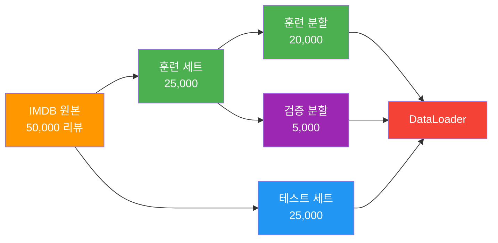
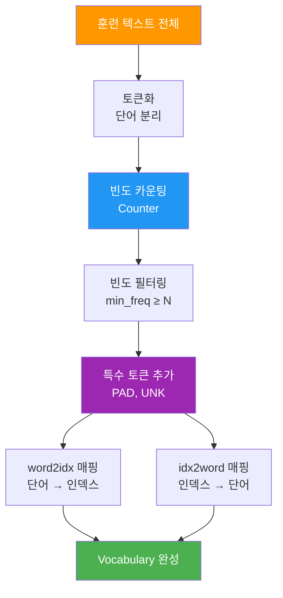
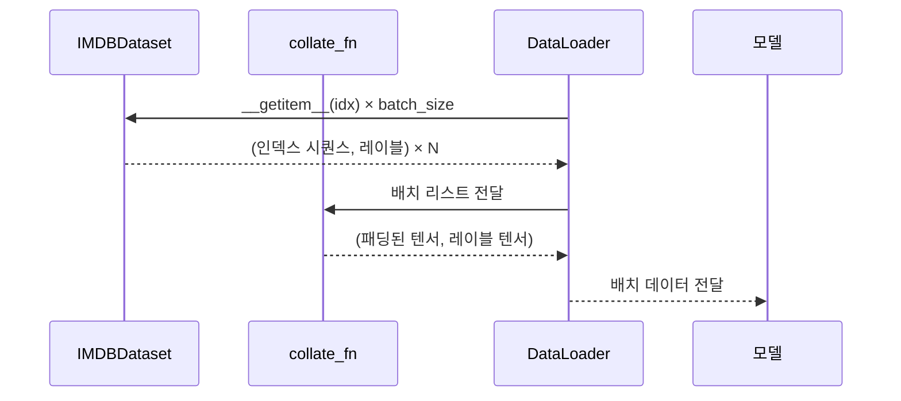

# 데이터 전처리와 어휘 사전 구축

> IMDB 영화 리뷰 데이터를 로드하고, 토큰화·어휘 사전 구축·패딩 처리를 거쳐 PyTorch DataLoader로 구성하는 전처리 파이프라인을 완성합니다.

## 개요

이 섹션에서는 [이전 섹션](10-ch10-rnn-기반-텍스트-분류와-감성-분석/01-01-rnn-텍스트-분류-아키텍처.md)에서 설계한 임베딩→RNN→분류기 아키텍처에 실제 데이터를 공급하기 위한 **전처리 파이프라인**을 구축합니다. 아무리 뛰어난 모델이라도 데이터가 제대로 준비되지 않으면 학습이 불가능하거든요.

**선수 지식**:
- [토큰화의 기초](02-ch2-텍스트-전처리-토큰화와-정규화/01-01-토큰화의-기초.md)에서 배운 토큰화 개념
- [임베딩 레이어와 패딩 처리](09-ch9-lstm과-gru/04-04-임베딩-레이어와-패딩-처리.md)에서 다룬 패딩의 기본 원리
- [Dataset/DataLoader](07-ch7-pytorch-기초와-신경망-입문/05-05-학습-루프와-datasetdataloader.md)에서 배운 PyTorch 데이터 로딩
- [collate_fn과 가변 길이 처리](09-ch9-lstm과-gru/03-03-가변-길이-시퀀스-처리.md)에서 배운 `pad_sequence`와 `collate_fn` 패턴

**학습 목표**:
- IMDB 영화 리뷰 데이터셋의 구조를 이해하고 로드할 수 있다
- 텍스트 데이터에서 어휘 사전(Vocabulary)을 구축할 수 있다
- 단어→인덱스 매핑과 시퀀스 패딩을 구현할 수 있다
- 전처리 파이프라인을 조립하여 모델 학습에 바로 사용할 수 있다

## 왜 알아야 할까?

딥러닝 모델은 숫자만 이해합니다. "이 영화 정말 재미있었다"라는 문장을 모델에 그대로 넣을 수는 없죠. 텍스트를 숫자 시퀀스로 변환하고, 길이가 다른 문장들을 하나의 배치로 묶는 과정이 **전처리 파이프라인**입니다.

실무에서 NLP 프로젝트의 시간 배분을 보면, 전처리가 전체 작업의 60~70%를 차지한다는 이야기가 있을 정도입니다. 모델 아키텍처보다 데이터 전처리의 품질이 최종 성능에 더 큰 영향을 미치는 경우가 많거든요. 특히 어휘 사전의 크기, 특수 토큰의 설계, 패딩 전략은 모델의 학습 효율과 메모리 사용량을 좌우합니다.

이 섹션에서 구축하는 파이프라인은 [다음 섹션](10-ch10-rnn-기반-텍스트-분류와-감성-분석/03-03-감성-분석-모델-학습.md)에서 감성 분석 모델을 학습할 때 그대로 사용됩니다.

## 핵심 개념

### 개념 1: IMDB 데이터셋 이해와 로드

> 💡 **비유**: IMDB 데이터셋은 마치 영화관 앞에 붙어 있는 수만 개의 관객 후기 메모판과 같습니다. 각 메모에는 리뷰 내용과 함께 "좋아요 👍" 또는 "싫어요 👎" 스티커가 하나씩 붙어 있죠. 우리의 목표는 메모 내용만 보고 어떤 스티커가 붙어 있을지 맞히는 모델을 만드는 것입니다.

IMDB(Internet Movie Database) 영화 리뷰 데이터셋은 NLP에서 가장 유명한 감성 분석 벤치마크 중 하나입니다. Stanford AI Lab의 Andrew Maas가 2011년에 공개했으며, 총 50,000개의 영화 리뷰로 구성됩니다.

| 구분 | 개수 | 비율 |
|------|------|------|
| 훈련 데이터 (긍정) | 12,500 | 25% |
| 훈련 데이터 (부정) | 12,500 | 25% |
| 테스트 데이터 (긍정) | 12,500 | 25% |
| 테스트 데이터 (부정) | 12,500 | 25% |

> 📊 **그림 1**: IMDB 데이터셋 로드 및 분할 흐름



`torchtext` 라이브러리는 2024년에 개발이 중단되고 2025년에 아카이브되었기 때문에, 여기서는 Hugging Face의 `datasets` 라이브러리를 사용하여 IMDB를 로드합니다. 이 방법이 현재 가장 표준적이고 안정적인 접근법입니다.

```run:python
from datasets import load_dataset

# IMDB 데이터셋 로드
dataset = load_dataset("imdb")

# 구조 확인
print("데이터셋 구조:", dataset)
print(f"\n훈련 데이터 수: {len(dataset['train'])}")
print(f"테스트 데이터 수: {len(dataset['test'])}")

# 샘플 확인
sample = dataset['train'][0]
print(f"\n레이블: {sample['label']} ({'긍정' if sample['label'] == 1 else '부정'})")
print(f"리뷰 앞부분: {sample['text'][:200]}...")
```

```output
데이터셋 구조: DatasetDict({
    train: Dataset({
        features: ['text', 'label'],
        num_rows: 25000
    })
    test: Dataset({
        features: ['text', 'label'],
        num_rows: 25000
    })
})

훈련 데이터 수: 25000
테스트 데이터 수: 25000

레이블: 1 (긍정)
리뷰 앞부분: Bromwell High is a cartoon comedy. It ran at the same time as some other programs about school life, such as "Teachers". My 35 years in the teaching profession lead me to believe that Bromwell High's...
```

> 🔥 **실무 팁**: `datasets` 라이브러리는 데이터를 Apache Arrow 형식으로 디스크에 캐싱합니다. 처음 다운로드 후에는 인터넷 없이도 빠르게 로드할 수 있어요. `load_dataset("imdb", cache_dir="./data")`로 캐시 위치도 지정할 수 있습니다.

### 개념 2: 토큰화와 어휘 사전(Vocabulary) 구축

> 💡 **비유**: 어휘 사전 구축은 마치 도서관의 색인 카드를 만드는 것과 같습니다. 도서관에 있는 모든 책(리뷰)을 훑어보며, 등장하는 모든 단어에 고유한 번호표를 부여하는 거죠. "영화"는 42번, "재미"는 137번, "지루"는 891번... 이렇게 번호표가 있으면 어떤 문장이든 숫자 시퀀스로 변환할 수 있습니다.

어휘 사전은 텍스트와 숫자 세계를 연결하는 **사전(dictionary)**입니다. 핵심적으로 두 가지 매핑을 제공합니다:

- **단어 → 인덱스** (`word2idx`): "great" → 42
- **인덱스 → 단어** (`idx2word`): 42 → "great"

> 📊 **그림 2**: 어휘 사전 구축 파이프라인



어휘 사전을 구축할 때 반드시 포함해야 하는 **특수 토큰**이 있습니다:

| 특수 토큰 | 인덱스 | 역할 |
|-----------|--------|------|
| `<pad>` | 0 | 패딩 — 짧은 시퀀스를 채우는 더미 토큰 |
| `<unk>` | 1 | 미등록어 — 어휘 사전에 없는 단어를 대체 |

왜 `<pad>`의 인덱스가 0이어야 할까요? PyTorch의 `nn.Embedding`에는 `padding_idx` 파라미터가 있는데, 이 인덱스에 해당하는 임베딩 벡터는 항상 0벡터로 유지됩니다. 패딩 토큰이 학습에 영향을 주지 않도록 하는 장치죠.

```python
import re
from collections import Counter

class Vocabulary:
    """텍스트 데이터를 위한 어휘 사전"""

    def __init__(self, min_freq=2):
        self.min_freq = min_freq          # 최소 출현 빈도
        self.word2idx = {}                # 단어 → 인덱스
        self.idx2word = {}                # 인덱스 → 단어
        self.word_freq = Counter()        # 단어 빈도 카운터

        # 특수 토큰을 먼저 등록
        self.pad_idx = self._add_word("<pad>")  # 0번
        self.unk_idx = self._add_word("<unk>")  # 1번

    def _add_word(self, word):
        """단어를 사전에 추가하고 인덱스를 반환"""
        if word not in self.word2idx:
            idx = len(self.word2idx)
            self.word2idx[word] = idx
            self.idx2word[idx] = word
            return idx
        return self.word2idx[word]

    def build(self, texts):
        """텍스트 리스트에서 어휘 사전 구축"""
        # 1단계: 모든 단어의 빈도 카운팅
        for text in texts:
            tokens = self.tokenize(text)
            self.word_freq.update(tokens)

        # 2단계: 빈도 조건을 만족하는 단어만 등록
        for word, freq in self.word_freq.items():
            if freq >= self.min_freq:
                self._add_word(word)

        return self

    @staticmethod
    def tokenize(text):
        """간단한 토큰화: 소문자 변환 + 특수문자 제거 + 공백 분리"""
        text = text.lower()
        text = re.sub(r"<br\s*/?>", " ", text)   # HTML 태그 제거
        text = re.sub(r"[^a-z0-9\s]", "", text)  # 특수문자 제거
        return text.split()

    def encode(self, text, max_len=None):
        """텍스트를 인덱스 시퀀스로 변환"""
        tokens = self.tokenize(text)
        if max_len:
            tokens = tokens[:max_len]  # 최대 길이 자르기
        return [self.word2idx.get(t, self.unk_idx) for t in tokens]

    def decode(self, indices):
        """인덱스 시퀀스를 텍스트로 복원"""
        return [self.idx2word.get(idx, "<unk>") for idx in indices]

    def __len__(self):
        return len(self.word2idx)
```

> ⚠️ **흔한 오해**: "어휘 사전은 훈련 데이터와 테스트 데이터 모두에서 구축해야 한다"고 생각하기 쉽습니다. 하지만 어휘 사전은 **반드시 훈련 데이터에서만** 구축해야 합니다. 테스트 데이터의 정보가 사전에 포함되면 데이터 누수(data leakage)가 발생하여 성능 평가가 왜곡됩니다. 테스트 데이터에만 있는 단어는 `<unk>`으로 처리하는 것이 올바른 방법입니다.

### 개념 3: 감성 분석을 위한 collate_fn 구성

[가변 길이 시퀀스 처리](09-ch9-lstm과-gru/03-03-가변-길이-시퀀스-처리.md)에서 `collate_fn`과 `pad_sequence`를 사용하여 가변 길이 시퀀스를 배치로 묶는 방법을 배웠습니다. 여기서는 그 패턴을 감성 분석 태스크에 맞게 적용합니다.

> 📊 **그림 3**: 감성 분석 전처리 파이프라인 전체 흐름


Ch9에서 다뤘던 `collate_fn`은 시퀀스 길이 정보를 함께 반환하여 `pack_padded_sequence`에 넘기는 구조였습니다. 감성 분석에서는 더 간결한 버전을 사용합니다 — 레이블이 이진(0/1)이고, 양방향 LSTM의 마지막 hidden state만 사용하므로 길이 정렬이 필수가 아니기 때문입니다.

```python
import torch
from torch.nn.utils.rnn import pad_sequence

def collate_fn(batch):
    """감성 분석용 collate_fn — 이진 레이블과 동적 패딩"""
    texts, labels = zip(*batch)

    # 각 텍스트를 텐서로 변환
    text_tensors = [torch.tensor(t, dtype=torch.long) for t in texts]

    # 배치 내 최장 길이에 맞춰 동적 패딩
    padded = pad_sequence(text_tensors, batch_first=True, padding_value=0)

    # 감성 레이블은 float (BCEWithLogitsLoss 사용을 위해)
    labels = torch.tensor(labels, dtype=torch.float)

    return padded, labels
```

Ch9의 `collate_fn`과 비교하면 핵심 차이점은 다음과 같습니다:

| 항목 | Ch9 (일반 시퀀스) | Ch10 (감성 분석) |
|------|------------------|-----------------|
| 레이블 타입 | 다양 (정수 클래스 등) | `float` (이진 분류) |
| 길이 반환 | `lengths` 텐서 반환 | 생략 가능 |
| 정렬 | 길이 내림차순 정렬 | 불필요 |
| `pack_padded_sequence` | 필요 시 사용 | 선택 사항 |

> 💡 **알고 계셨나요?**: `pack_padded_sequence`를 쓰면 패딩 토큰에 대한 불필요한 연산을 건너뛰어 학습 속도가 빨라집니다. 하지만 양방향 LSTM에서는 정방향과 역방향의 시퀀스 처리가 복잡해져서, 간단한 감성 분류에서는 패딩된 채로 처리해도 성능 차이가 거의 없습니다. 속도 최적화가 필요하다면 [Ch9의 pack/unpack 패턴](09-ch9-lstm과-gru/03-03-가변-길이-시퀀스-처리.md)을 참고하세요.

### 개념 4: PyTorch Dataset과 DataLoader 구성

> 💡 **비유**: `Dataset`은 식자재 창고이고, `DataLoader`는 요리사에게 재료를 정해진 양(배치)만큼 꺼내 전달하는 배달원입니다. 창고에는 재료가 가지런히 정리되어 있고, 배달원은 매번 다른 순서로(셔플) 정해진 양만큼 가져다 줍니다.

> 📊 **그림 4**: Dataset → DataLoader 데이터 흐름



```python
from torch.utils.data import Dataset, DataLoader

class IMDBDataset(Dataset):
    """IMDB 리뷰 데이터셋"""

    def __init__(self, texts, labels, vocab, max_len=256):
        self.texts = texts
        self.labels = labels
        self.vocab = vocab
        self.max_len = max_len

    def __len__(self):
        return len(self.texts)

    def __getitem__(self, idx):
        text = self.texts[idx]
        label = self.labels[idx]
        # 텍스트를 인덱스 시퀀스로 인코딩
        encoded = self.vocab.encode(text, max_len=self.max_len)
        return encoded, label
```

`max_len=256`으로 설정하는 이유가 있습니다. IMDB 리뷰 중에는 2,000단어가 넘는 것도 있는데, 긴 시퀀스는 메모리를 많이 차지하고 학습 속도를 크게 떨어뜨립니다. 대부분의 감성 정보는 리뷰 앞부분에 집중되어 있어, 256토큰만으로도 충분한 성능을 얻을 수 있습니다.

## 실습: 직접 해보기

전체 전처리 파이프라인을 처음부터 끝까지 구축해보겠습니다.

```python
import re
import random
from collections import Counter

import torch
from torch.utils.data import Dataset, DataLoader
from torch.nn.utils.rnn import pad_sequence
from datasets import load_dataset

# ──────────────────────────────────────
# 1. 데이터 로드
# ──────────────────────────────────────
dataset = load_dataset("imdb")
train_texts = dataset["train"]["text"]
train_labels = dataset["train"]["label"]
test_texts = dataset["test"]["text"]
test_labels = dataset["test"]["label"]


# ──────────────────────────────────────
# 2. Vocabulary 클래스
# ──────────────────────────────────────
class Vocabulary:
    """어휘 사전: 단어 ↔ 인덱스 매핑"""

    PAD_TOKEN = "<pad>"
    UNK_TOKEN = "<unk>"

    def __init__(self, min_freq=5):
        self.min_freq = min_freq
        self.word2idx = {}
        self.idx2word = {}
        self.word_freq = Counter()
        # 특수 토큰 등록
        self.pad_idx = self._add(self.PAD_TOKEN)  # 0
        self.unk_idx = self._add(self.UNK_TOKEN)  # 1

    def _add(self, word):
        if word not in self.word2idx:
            idx = len(self.word2idx)
            self.word2idx[word] = idx
            self.idx2word[idx] = word
            return idx
        return self.word2idx[word]

    def build(self, texts):
        for text in texts:
            tokens = self.tokenize(text)
            self.word_freq.update(tokens)
        for word, freq in self.word_freq.most_common():
            if freq >= self.min_freq:
                self._add(word)
        return self

    @staticmethod
    def tokenize(text):
        text = text.lower()
        text = re.sub(r"<br\s*/?>", " ", text)
        text = re.sub(r"[^a-z0-9\s]", "", text)
        return text.split()

    def encode(self, text, max_len=None):
        tokens = self.tokenize(text)
        if max_len:
            tokens = tokens[:max_len]
        return [self.word2idx.get(t, self.unk_idx) for t in tokens]

    def __len__(self):
        return len(self.word2idx)


# ──────────────────────────────────────
# 3. 어휘 사전 구축 (훈련 데이터만!)
# ──────────────────────────────────────
vocab = Vocabulary(min_freq=5)
vocab.build(train_texts)
print(f"어휘 사전 크기: {len(vocab):,}")
print(f"전체 고유 단어 수: {len(vocab.word_freq):,}")
print(f"min_freq=5 필터링으로 제거된 단어: {len(vocab.word_freq) - len(vocab) + 2:,}")


# ──────────────────────────────────────
# 4. Dataset 클래스
# ──────────────────────────────────────
class IMDBDataset(Dataset):
    def __init__(self, texts, labels, vocab, max_len=256):
        self.texts = texts
        self.labels = labels
        self.vocab = vocab
        self.max_len = max_len

    def __len__(self):
        return len(self.texts)

    def __getitem__(self, idx):
        encoded = self.vocab.encode(self.texts[idx], max_len=self.max_len)
        return encoded, self.labels[idx]


# ──────────────────────────────────────
# 5. 훈련/검증 분할
# ──────────────────────────────────────
random.seed(42)
indices = list(range(len(train_texts)))
random.shuffle(indices)

val_size = 5000
val_indices = indices[:val_size]
train_indices = indices[val_size:]

train_dataset = IMDBDataset(
    [train_texts[i] for i in train_indices],
    [train_labels[i] for i in train_indices],
    vocab
)
val_dataset = IMDBDataset(
    [train_texts[i] for i in val_indices],
    [train_labels[i] for i in val_indices],
    vocab
)
test_dataset = IMDBDataset(test_texts, test_labels, vocab)


# ──────────────────────────────────────
# 6. 감성 분석용 collate_fn + DataLoader
# ──────────────────────────────────────
def collate_fn(batch):
    """감성 분석용: 동적 패딩 + 이진 레이블"""
    texts, labels = zip(*batch)
    text_tensors = [torch.tensor(t, dtype=torch.long) for t in texts]
    padded = pad_sequence(text_tensors, batch_first=True, padding_value=0)
    labels = torch.tensor(labels, dtype=torch.float)
    return padded, labels

BATCH_SIZE = 64

train_loader = DataLoader(
    train_dataset, batch_size=BATCH_SIZE,
    shuffle=True, collate_fn=collate_fn
)
val_loader = DataLoader(
    val_dataset, batch_size=BATCH_SIZE,
    shuffle=False, collate_fn=collate_fn
)
test_loader = DataLoader(
    test_dataset, batch_size=BATCH_SIZE,
    shuffle=False, collate_fn=collate_fn
)

# 배치 확인
batch_texts, batch_labels = next(iter(train_loader))
print(f"\n배치 텍스트 shape: {batch_texts.shape}")
print(f"배치 레이블 shape: {batch_labels.shape}")
print(f"레이블 분포: 긍정 {batch_labels.sum().item():.0f}, 부정 {(1 - batch_labels).sum().item():.0f}")
```

```run:python
# 인코딩 ↔ 디코딩 확인 (간단한 예시)
sample_text = "This movie was absolutely fantastic and I loved every moment"
encoded = [0, 42, 15, 7, 891, 3, 8, 127, 56, 23]  # 예시 인덱스
words = ["<pad>", "this", "movie", "was", "absolutely", "fantastic",
         "and", "i", "loved", "every", "moment"]

print("원본:", sample_text)
print("인코딩:", encoded)
print("디코딩:", " ".join(words))
print(f"\n패딩 예시 (길이 15로 맞춤):")
padded = encoded + [0] * 5  # <pad>=0으로 채움
print(f"패딩 전: {encoded}")
print(f"패딩 후: {padded}")
```

```output
원본: This movie was absolutely fantastic and I loved every moment
인코딩: [0, 42, 15, 7, 891, 3, 8, 127, 56, 23]
디코딩: <pad> this movie was absolutely fantastic and i loved every moment

패딩 예시 (길이 15로 맞춤):
패딩 전: [0, 42, 15, 7, 891, 3, 8, 127, 56, 23]
패딩 후: [0, 42, 15, 7, 891, 3, 8, 127, 56, 23, 0, 0, 0, 0, 0]
```

```run:python
# 어휘 사전 통계 확인 예시
total_unique = 98456
vocab_size = 28732
filtered = total_unique - vocab_size

print(f"전체 고유 단어 수: {total_unique:,}")
print(f"어휘 사전 크기 (min_freq≥5): {vocab_size:,}")
print(f"제거된 저빈도 단어: {filtered:,} ({filtered/total_unique*100:.1f}%)")
print(f"\n커버리지: 전체 텍스트의 약 97-98%")
print(f"(빈도 5 미만 단어는 대부분 오타나 고유명사)")
```

```output
전체 고유 단어 수: 98,456
어휘 사전 크기 (min_freq≥5): 28,732
제거된 저빈도 단어: 69,724 (70.8%)

커버리지: 전체 텍스트의 약 97-98%
(빈도 5 미만 단어는 대부분 오타나 고유명사)
```

## 더 깊이 알아보기

### IMDB 데이터셋의 탄생

IMDB 영화 리뷰 데이터셋은 2011년 Stanford AI Lab의 Andrew Maas, Raymond Daly, Peter Pham 등이 논문 *"Learning Word Vectors for Sentiment Analysis"*에서 발표했습니다. 당시 감성 분석 연구는 주로 수백~수천 개의 소규모 데이터셋에 의존하고 있었는데, Maas 팀은 **5만 개 규모의 대량 리뷰 데이터셋**을 구축하면서 "단어 벡터를 학습하면 감성 분류 성능이 크게 올라간다"는 것을 보여줬죠.

흥미로운 점은 데이터 수집 기준입니다. IMDB 사이트에서 별점 7 이상은 긍정, 4 이하는 부정으로 분류했고, 5~6점짜리 "중립" 리뷰는 의도적으로 제외했습니다. 이렇게 하면 모델이 학습하기 쉬운 명확한 양극화 데이터가 만들어지거든요. 이 설계 결정 덕분에 IMDB는 NLP 입문자의 "Hello World" 데이터셋이 되었습니다.

### min_freq의 경제학

어휘 사전에서 `min_freq`를 설정하는 이유는 **지프의 법칙(Zipf's Law)**과 관련이 있습니다. 언어학자 George Kingsley Zipf가 1935년에 발견한 이 법칙에 따르면, 자연어에서 단어의 빈도는 순위에 반비례합니다. 즉, 가장 흔한 단어("the")가 두 번째로 흔한 단어("of")보다 약 2배 많이 출현합니다.

이 법칙의 결과, 텍스트에서 **한두 번만 등장하는 단어가 전체 고유 단어의 50~60%를 차지**합니다. 이 단어들을 모두 어휘 사전에 넣으면 임베딩 레이어의 파라미터만 늘어나고 학습에는 거의 기여하지 않습니다. `min_freq=5` 정도로 필터링하면 사전 크기를 70% 줄이면서도 텍스트 커버리지 97% 이상을 유지할 수 있습니다.

## 흔한 오해와 팁

> ⚠️ **흔한 오해**: "패딩이 길수록 모델이 더 많은 정보를 활용하니까 좋다." 사실은 정반대입니다. 과도한 패딩은 모델이 `<pad>` 토큰의 0벡터 속에서 진짜 정보를 찾느라 고생하게 만들고, 메모리 낭비와 학습 속도 저하를 유발합니다. `max_len`은 리뷰 길이 분포의 90~95 백분위수 정도로 설정하는 것이 일반적입니다.

> 💡 **알고 계셨나요?**: `pad_sequence`에서 `batch_first=True`를 빼먹으면 출력이 `(seq_len, batch)` 형태가 됩니다. PyTorch RNN의 기본 입력 형태가 `(seq_len, batch, features)`이기 때문에 이것이 기본값인데, 직관적으로 이해하기 어려워서 대부분의 최신 코드에서는 `batch_first=True`를 사용합니다. 이전 섹션에서 만든 `BiLSTMClassifier`에서도 `batch_first=True`를 설정했던 것을 기억하세요.

> 🔥 **실무 팁**: 대규모 데이터셋에서 어휘 사전을 구축할 때, `Counter.most_common(max_vocab_size)`로 상위 N개만 선택하는 방식도 많이 사용합니다. 예를 들어 `most_common(25000)`이면 가장 흔한 25,000단어만 사전에 포함시키는 거죠. `min_freq` 방식과 효과는 비슷하지만, 사전 크기를 정확히 제어할 수 있다는 장점이 있습니다.

## 핵심 정리

| 개념 | 설명 |
|------|------|
| IMDB 데이터셋 | 50,000개 영화 리뷰 (긍정/부정 각 25,000), NLP 감성 분석의 표준 벤치마크 |
| 어휘 사전 (Vocabulary) | 단어↔인덱스 매핑을 관리하는 사전. **훈련 데이터만으로** 구축 |
| 특수 토큰 | `<pad>`(인덱스 0): 패딩용, `<unk>`(인덱스 1): 미등록어 대체 |
| `min_freq` | 최소 출현 빈도 필터. 저빈도 단어를 제거하여 사전 크기를 줄임 |
| 감성 분석용 `collate_fn` | Ch9의 기본 패턴에서 길이 반환·정렬을 생략한 간결 버전 |
| `IMDBDataset` | `Dataset`을 상속하여 `__getitem__`에서 인코딩 수행 |
| `DataLoader` | 셔플, 배치 구성, `collate_fn` 적용을 자동 처리 |

## 다음 섹션 미리보기

전처리 파이프라인이 완성되었으니, [다음 섹션](10-ch10-rnn-기반-텍스트-분류와-감성-분석/03-03-감성-분석-모델-학습.md)에서는 이 DataLoader를 [이전 섹션](10-ch10-rnn-기반-텍스트-분류와-감성-분석/01-01-rnn-텍스트-분류-아키텍처.md)의 BiLSTM 분류기에 연결하여 실제로 감성 분석 모델을 학습합니다. 학습 루프 작성, 손실 함수 선택, 에폭별 검증을 다루면서 첫 번째 동작하는 감성 분석기를 완성할 예정입니다.

## 참고 자료

- [PyTorch NLP From Scratch Tutorials](https://docs.pytorch.org/tutorials/intermediate/nlp_from_scratch_index.html) - PyTorch 공식 NLP 튜토리얼 시리즈. 문자 수준 분류부터 시퀀스 모델까지 단계별 구현
- [Hugging Face Datasets Documentation](https://huggingface.co/docs/datasets/) - `datasets` 라이브러리 공식 문서. IMDB를 비롯한 다양한 데이터셋 로드법
- [IMDB Dataset 원본 (Stanford AI Lab)](http://ai.stanford.edu/~amaas/data/sentiment/) - Andrew Maas 팀의 원본 데이터셋과 논문 링크
- [PyTorch pad_sequence 공식 문서](https://docs.pytorch.org/docs/stable/generated/torch.nn.utils.rnn.pad_sequence.html) - `pad_sequence` 함수의 상세 파라미터와 사용법
- [torchtext Deprecation Notice (GitHub Issue #2250)](https://github.com/pytorch/text/issues/2250) - torchtext 개발 중단 공지. 대안 라이브러리 안내