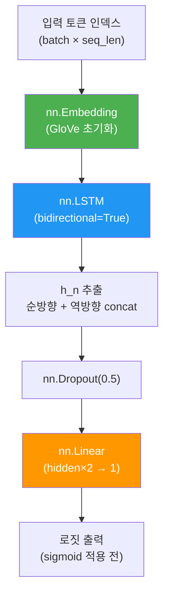
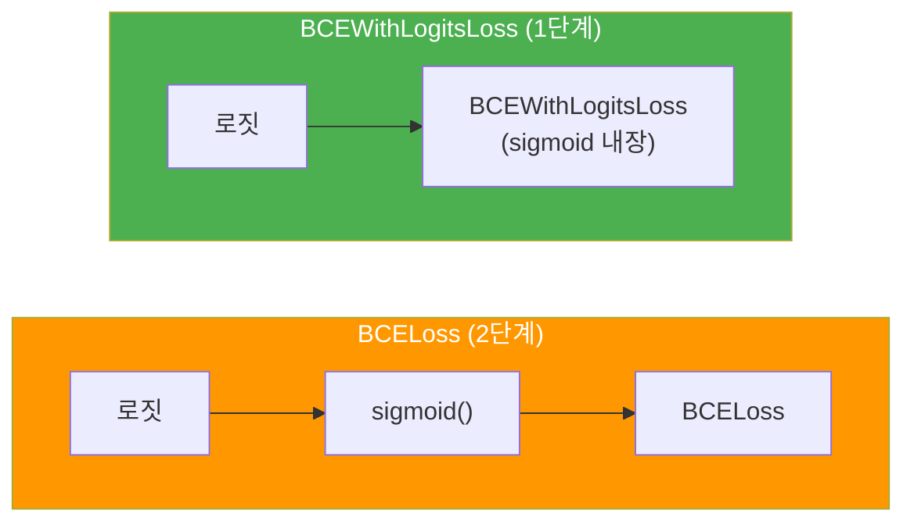
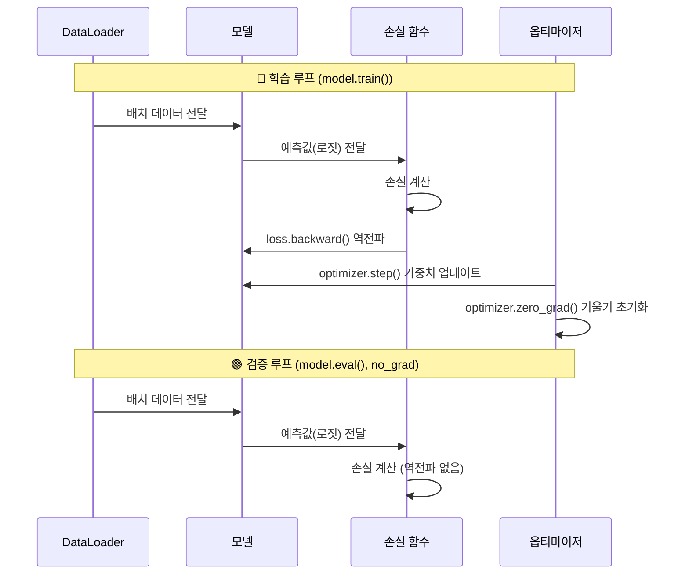
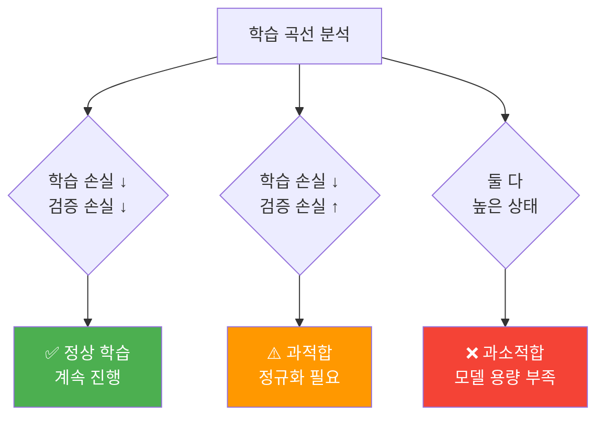

# 감성 분석 모델 학습

> BiLSTM 감성 분류 모델에 사전학습 GloVe 임베딩을 적용하고, 학습 루프를 구현하여 IMDB 리뷰의 감성을 분류합니다.

## 개요

이 섹션에서는 앞서 구축한 데이터 파이프라인과 모델 아키텍처를 결합하여, 실제로 감성 분석 모델을 **학습**시킵니다. [03. 사전학습 임베딩 활용하기](06-ch6-워드-임베딩의-세계/03-03-사전학습-임베딩-활용하기.md)에서 만든 `load_glove_embeddings` 함수를 활용해 **GloVe 사전학습 임베딩**을 적용하고, 랜덤 초기화 대비 어떤 성능 차이가 나는지도 직접 확인해볼 거예요.

**선수 지식**: [01. RNN 텍스트 분류 아키텍처](10-ch10-rnn-기반-텍스트-분류와-감성-분석/01-01-rnn-텍스트-분류-아키텍처.md)에서 배운 BiLSTM 분류기 구조와 [02. 데이터 전처리와 어휘 사전 구축](10-ch10-rnn-기반-텍스트-분류와-감성-분석/02-02-데이터-전처리와-어휘-사전-구축.md)에서 만든 Vocabulary, DataLoader 파이프라인, 그리고 [03. 사전학습 임베딩 활용하기](06-ch6-워드-임베딩의-세계/03-03-사전학습-임베딩-활용하기.md)에서 구현한 GloVe 로딩 함수

**학습 목표**:
- GloVe 사전학습 임베딩을 BiLSTM 모델에 통합할 수 있다
- BCEWithLogitsLoss를 활용한 이진 분류 학습 루프를 구현할 수 있다
- 에폭별 학습/검증 손실과 정확도를 기록하고 시각화할 수 있다
- 사전학습 임베딩 유무에 따른 성능 차이를 비교할 수 있다

## 왜 알아야 할까?

여러분이 요리 레시피를 처음부터 독학하는 것과, 미슐랭 셰프의 노하우를 전수받고 시작하는 것—어느 쪽이 더 빠르게 실력이 늘까요? 사전학습 임베딩은 바로 이 "셰프의 노하우"에 해당합니다.

랜덤으로 초기화된 임베딩 레이어는 모델이 학습하면서 단어의 의미를 **제로부터** 파악해야 합니다. 하지만 GloVe처럼 수십억 개의 단어로 미리 학습된 벡터를 사용하면, 모델은 이미 "good"과 "great"가 비슷하고, "terrible"과 "awful"이 비슷하다는 것을 **알고 시작**하거든요. 특히 학습 데이터가 적은 상황에서 이 차이는 극적입니다.

또한 학습 루프는 딥러닝 모델 개발의 **심장**이에요. 어떤 프레임워크를 쓰든, 어떤 모델을 만들든, 결국 "데이터를 넣고 → 예측하고 → 손실 계산하고 → 역전파하고 → 가중치 업데이트"라는 이 루프를 이해해야 합니다. 이번 섹션에서 이 루프를 완전히 체화하면, 이후 [트랜스포머 구현 실습](14-ch14-트랜스포머-구현-실습/01-01-셀프-어텐션-직접-구현.md)이나 [파인튜닝](19-ch19-파인튜닝과-전이학습/03-03-커스텀-학습-루프로-파인튜닝.md)에서도 자연스럽게 적용할 수 있습니다.

## 핵심 개념

### 개념 1: 사전학습 임베딩을 BiLSTM에 통합하기

> 💡 **비유**: 외국에 처음 가서 그 나라 말을 배우는 걸 상상해보세요. 빈 노트(랜덤 임베딩)에 하나씩 적어가며 배울 수도 있지만, 이미 잘 정리된 사전(GloVe)을 가져가면 훨씬 빠르겠죠? 이번에는 Ch6에서 만든 "사전"을 우리 감성 분석 모델에 꽂아넣는 과정을 다룹니다.

[03. 사전학습 임베딩 활용하기](06-ch6-워드-임베딩의-세계/03-03-사전학습-임베딩-활용하기.md)에서 GloVe 파일을 파싱하고 어휘 사전에 맞는 임베딩 행렬을 생성하는 `load_glove_embeddings` 함수를 이미 구현했습니다. 여기서는 그 함수를 **그대로 활용**하여 BiLSTM 모델에 통합하는 데 집중하겠습니다.

> 📊 **그림 1**: 사전학습 임베딩 → BiLSTM 통합 파이프라인


Ch6에서 만든 함수가 반환하는 임베딩 행렬을 모델에 주입하는 방법은 간단합니다:

```python
from glove_utils import load_glove_embeddings  # Ch6에서 구현한 함수

# GloVe 임베딩 행렬 생성 (Ch6의 함수 활용)
pretrained_embeddings = load_glove_embeddings(
    glove_path='glove.6B.100d.txt',
    word2idx=vocab.word2idx,
    embedding_dim=100
)

# nn.Embedding에 사전학습 가중치 로드
embedding_layer = nn.Embedding(vocab_size, embedding_dim, padding_idx=0)
embedding_layer.weight.data.copy_(pretrained_embeddings)

# PAD 토큰은 반드시 영벡터로 유지
embedding_layer.weight.data[0] = torch.zeros(embedding_dim)

# 선택: 임베딩을 고정할지, 파인튜닝할지
embedding_layer.weight.requires_grad = True  # 파인튜닝 허용
```

핵심 포인트를 짚어볼게요. 첫째, `load_glove_embeddings` 함수 내부에서 GloVe에 없는 단어(OOV)는 `scale=0.6`으로 랜덤 초기화됩니다—이건 Ch6에서 이미 처리해둔 부분이에요. 둘째, 모델에 주입할 때 `<PAD>` 토큰(인덱스 0)의 임베딩을 **명시적으로 영벡터**로 덮어씌워야 합니다. 패딩은 의미가 없으니까요.

> ⚠️ **흔한 오해**: "사전학습 임베딩은 항상 고정(freeze)해야 한다"고 생각하는 분이 많은데요, 사실 데이터가 충분하다면 `requires_grad=True`로 **파인튜닝하는 것이 대부분 더 좋은 성능**을 냅니다. 고정은 학습 데이터가 매우 적을 때(수백~수천 개)만 고려하세요.

### 개념 2: BiLSTM 감성 분류 모델 완성

> 💡 **비유**: GloVe 임베딩을 장착한 BiLSTM 분류기는, 좋은 렌즈(GloVe)를 끼운 카메라(BiLSTM)로 사진(리뷰)을 찍고, 인화소(분류기)에서 "긍정/부정" 판정을 내리는 것과 같습니다.

이제 [01. RNN 텍스트 분류 아키텍처](10-ch10-rnn-기반-텍스트-분류와-감성-분석/01-01-rnn-텍스트-분류-아키텍처.md)에서 설계한 BiLSTM 분류기에 GloVe 임베딩을 통합합니다:

> 📊 **그림 2**: GloVe + BiLSTM 감성 분류 모델 아키텍처



```python
class SentimentClassifier(nn.Module):
    def __init__(self, vocab_size, embedding_dim, hidden_dim, 
                 n_layers, dropout, pretrained_embeddings=None):
        super().__init__()
        
        # 임베딩 레이어 (PAD=0 인덱스는 항상 영벡터)
        self.embedding = nn.Embedding(
            vocab_size, embedding_dim, padding_idx=0
        )
        
        # 사전학습 임베딩 적용
        if pretrained_embeddings is not None:
            self.embedding.weight.data.copy_(pretrained_embeddings)
            # PAD 토큰은 반드시 영벡터로 유지
            self.embedding.weight.data[0] = torch.zeros(embedding_dim)
        
        # 양방향 LSTM
        self.lstm = nn.LSTM(
            embedding_dim, hidden_dim,
            num_layers=n_layers,
            bidirectional=True,
            dropout=dropout if n_layers > 1 else 0,
            batch_first=True
        )
        
        # 분류 헤드
        self.dropout = nn.Dropout(dropout)
        self.fc = nn.Linear(hidden_dim * 2, 1)  # 양방향이므로 ×2
    
    def forward(self, text):
        # text: (batch, seq_len)
        embedded = self.dropout(self.embedding(text))  # (batch, seq_len, emb_dim)
        
        output, (hidden, cell) = self.lstm(embedded)
        # hidden: (n_layers*2, batch, hidden_dim)
        
        # 마지막 레이어의 순방향/역방향 은닉 상태 결합
        hidden = torch.cat([hidden[-2], hidden[-1]], dim=1)  # (batch, hidden*2)
        hidden = self.dropout(hidden)
        
        return self.fc(hidden).squeeze(1)  # (batch,)
```

여기서 `output_dim=1`인 이유가 중요합니다. 이진 분류에서는 클래스가 2개지만, 출력 뉴런은 **1개**면 충분해요. 이 하나의 값이 양수면 긍정, 음수면 부정으로 판별하죠. 이것이 바로 다음에 설명할 `BCEWithLogitsLoss`와 맞물립니다.

### 개념 3: BCEWithLogitsLoss와 이진 분류

> 💡 **비유**: 시험 답안을 채점한다고 생각해보세요. 학생이 쓴 답(모델의 로짓)과 정답(레이블)을 비교해서 "얼마나 틀렸는지"를 점수로 매기는 게 손실 함수입니다. `BCEWithLogitsLoss`는 이 채점 과정에서 시그모이드 변환까지 한꺼번에 처리해주는 **올인원 채점기**예요.

이진 분류에서 손실 함수를 선택할 때, `nn.BCELoss`와 `nn.BCEWithLogitsLoss` 중 어떤 걸 써야 할까요?

> 📊 **그림 3**: BCELoss vs BCEWithLogitsLoss 비교



`BCEWithLogitsLoss`는 시그모이드 함수와 이진 교차 엔트로피(Binary Cross-Entropy)를 **하나로 합친** 손실 함수입니다. 별도로 `sigmoid()`를 호출할 필요가 없고, 내부적으로 **log-sum-exp 트릭**을 사용해서 수치적으로 훨씬 안정적이에요.

수식으로 보면:

$$\text{Loss} = -\frac{1}{N}\sum_{i=1}^{N}\left[y_i \cdot \log(\sigma(x_i)) + (1-y_i) \cdot \log(1-\sigma(x_i))\right]$$

- $x_i$: 모델의 로짓 출력 (sigmoid 적용 전)
- $y_i$: 실제 레이블 (0 또는 1)
- $\sigma$: 시그모이드 함수
- $N$: 배치 크기

이게 의미하는 바는, 모델이 긍정 리뷰(y=1)에 대해 **높은 양수 로짓**을 출력할수록 손실이 작아지고, 부정 리뷰(y=0)에 대해 **큰 음수 로짓**을 출력할수록 손실이 작아진다는 것입니다.

```python
# 손실 함수와 옵티마이저 설정
criterion = nn.BCEWithLogitsLoss()
optimizer = torch.optim.Adam(model.parameters(), lr=1e-3)
```

```run:python
import torch
import torch.nn as nn

# BCEWithLogitsLoss 동작 확인
criterion = nn.BCEWithLogitsLoss()

# 모델이 긍정(1)이라고 강하게 예측 → 낮은 손실
logit_positive = torch.tensor([3.0])  # 높은 양수 = 강한 긍정 예측
label_positive = torch.tensor([1.0])  # 실제 긍정
loss_correct = criterion(logit_positive, label_positive)

# 모델이 부정(0)이라고 예측했는데 실제는 긍정 → 높은 손실
logit_negative = torch.tensor([-3.0])  # 큰 음수 = 강한 부정 예측
loss_wrong = criterion(logit_negative, label_positive)

print(f"올바른 예측의 손실: {loss_correct.item():.4f}")
print(f"틀린 예측의 손실:   {loss_wrong.item():.4f}")
print(f"차이: {loss_wrong.item() / loss_correct.item():.1f}배")
```

```output
올바른 예측의 손실: 0.0486
틀린 예측의 손실:   3.0486
차이: 62.7배
```

### 개념 4: 학습 루프와 검증 루프

> 💡 **비유**: 학습 루프는 학생이 문제를 풀고 채점받는 과정이고, 검증 루프는 모의고사를 보는 것과 같습니다. 학습 때는 오답노트(역전파)를 하지만, 모의고사 때는 실력 확인만 하죠.

PyTorch의 학습 루프는 항상 같은 패턴을 따릅니다. 한 번 익혀두면 어떤 모델에든 적용할 수 있어요.

> 📊 **그림 4**: 학습 루프 vs 검증 루프 흐름



```python
def train_epoch(model, dataloader, criterion, optimizer, device):
    """한 에폭의 학습을 수행합니다."""
    model.train()  # 학습 모드: 드롭아웃 활성화
    epoch_loss = 0
    correct = 0
    total = 0
    
    for texts, labels in dataloader:
        texts, labels = texts.to(device), labels.float().to(device)
        
        # 1. 기울기 초기화
        optimizer.zero_grad()
        
        # 2. 순전파
        predictions = model(texts)  # 로짓 출력
        
        # 3. 손실 계산
        loss = criterion(predictions, labels)
        
        # 4. 역전파
        loss.backward()
        
        # 5. 가중치 업데이트
        optimizer.step()
        
        # 통계 기록
        epoch_loss += loss.item() * texts.size(0)
        predicted = (torch.sigmoid(predictions) >= 0.5).long()
        correct += (predicted == labels.long()).sum().item()
        total += labels.size(0)
    
    return epoch_loss / total, correct / total


def evaluate(model, dataloader, criterion, device):
    """검증/테스트 평가를 수행합니다."""
    model.eval()  # 평가 모드: 드롭아웃 비활성화
    epoch_loss = 0
    correct = 0
    total = 0
    
    with torch.no_grad():  # 기울기 계산 비활성화 → 메모리 절약
        for texts, labels in dataloader:
            texts, labels = texts.to(device), labels.float().to(device)
            
            predictions = model(texts)
            loss = criterion(predictions, labels)
            
            epoch_loss += loss.item() * texts.size(0)
            predicted = (torch.sigmoid(predictions) >= 0.5).long()
            correct += (predicted == labels.long()).sum().item()
            total += labels.size(0)
    
    return epoch_loss / total, correct / total
```

학습 루프와 검증 루프의 핵심 차이 3가지를 기억하세요:

| 구분 | 학습 루프 | 검증 루프 |
|------|----------|----------|
| 모드 | `model.train()` | `model.eval()` |
| 기울기 | 계산 O, 역전파 O | `torch.no_grad()` |
| 드롭아웃 | 활성화 | 비활성화 |

### 개념 5: 학습/검증 곡선 시각화

> 💡 **비유**: 학습 곡선은 학생의 성적 추이표와 같습니다. 성적이 계속 오르면 아직 배울 게 남은 것이고, 더 이상 오르지 않으면 실력이 천장에 닿은 거죠. 만약 시험(학습) 성적은 좋은데 모의고사(검증) 성적이 떨어진다면? 과적합(Overfitting)의 신호입니다!

학습 과정을 시각화하면 모델이 잘 학습되고 있는지, 과적합이 발생하는지를 한눈에 파악할 수 있습니다:

> 📊 **그림 5**: 학습 곡선에서 읽을 수 있는 패턴들



```python
import matplotlib.pyplot as plt

def plot_training_curves(train_losses, val_losses, train_accs, val_accs):
    """학습/검증 손실과 정확도 곡선을 시각화합니다."""
    fig, (ax1, ax2) = plt.subplots(1, 2, figsize=(14, 5))
    epochs = range(1, len(train_losses) + 1)
    
    # 손실 곡선
    ax1.plot(epochs, train_losses, 'b-o', label='학습 손실', markersize=4)
    ax1.plot(epochs, val_losses, 'r-o', label='검증 손실', markersize=4)
    ax1.set_xlabel('에폭')
    ax1.set_ylabel('손실')
    ax1.set_title('학습/검증 손실 곡선')
    ax1.legend()
    ax1.grid(True, alpha=0.3)
    
    # 정확도 곡선
    ax2.plot(epochs, train_accs, 'b-o', label='학습 정확도', markersize=4)
    ax2.plot(epochs, val_accs, 'r-o', label='검증 정확도', markersize=4)
    ax2.set_xlabel('에폭')
    ax2.set_ylabel('정확도')
    ax2.set_title('학습/검증 정확도 곡선')
    ax2.legend()
    ax2.grid(True, alpha=0.3)
    
    plt.tight_layout()
    plt.savefig('training_curves.png', dpi=150, bbox_inches='tight')
    plt.show()
```

## 실습: 직접 해보기

이제 모든 조각을 합쳐서 **IMDB 감성 분석 모델을 처음부터 학습**시켜 봅시다. GloVe 임베딩을 적용한 버전과 적용하지 않은 버전을 비교합니다.

> 💡 GloVe 임베딩 로딩에는 [03. 사전학습 임베딩 활용하기](06-ch6-워드-임베딩의-세계/03-03-사전학습-임베딩-활용하기.md)에서 구현한 `load_glove_embeddings` 함수를 그대로 사용합니다. 해당 섹션의 코드를 `glove_utils.py`로 저장해두면 여기서 바로 임포트할 수 있어요.

```python
import torch
import torch.nn as nn
import numpy as np
import random
import matplotlib.pyplot as plt
from torch.utils.data import Dataset, DataLoader
from torch.nn.utils.rnn import pad_sequence
from collections import Counter

# ===== 재현성을 위한 시드 고정 =====
SEED = 42
random.seed(SEED)
np.random.seed(SEED)
torch.manual_seed(SEED)
torch.cuda.manual_seed_all(SEED)

device = torch.device('cuda' if torch.cuda.is_available() else 'cpu')
print(f"사용 디바이스: {device}")


# ===== 1. 데이터 로드 (이전 섹션에서 구축한 파이프라인) =====
from datasets import load_dataset

dataset = load_dataset("imdb")
train_texts = dataset['train']['text']
train_labels = dataset['train']['label']
test_texts = dataset['test']['text']
test_labels = dataset['test']['label']

# 학습 데이터에서 검증 세트 분리 (80:20)
split_idx = int(len(train_texts) * 0.8)
val_texts = train_texts[split_idx:]
val_labels = train_labels[split_idx:]
train_texts = train_texts[:split_idx]
train_labels = train_labels[:split_idx]

print(f"학습: {len(train_texts)}, 검증: {len(val_texts)}, 테스트: {len(test_texts)}")


# ===== 2. 어휘 사전 구축 =====
class Vocabulary:
    def __init__(self, min_freq=2):
        self.word2idx = {'<PAD>': 0, '<UNK>': 1}
        self.idx2word = {0: '<PAD>', 1: '<UNK>'}
        self.min_freq = min_freq
    
    def build(self, texts):
        counter = Counter()
        for text in texts:
            counter.update(text.lower().split())
        
        for word, freq in counter.items():
            if freq >= self.min_freq:
                idx = len(self.word2idx)
                self.word2idx[word] = idx
                self.idx2word[idx] = word
        
        print(f"어휘 사전 크기: {len(self.word2idx)}")
        return self
    
    def encode(self, text, max_len=256):
        tokens = text.lower().split()[:max_len]
        return [self.word2idx.get(w, 1) for w in tokens]  # 1 = <UNK>

vocab = Vocabulary(min_freq=5)
vocab.build(train_texts)


# ===== 3. Dataset & DataLoader =====
class IMDBDataset(Dataset):
    def __init__(self, texts, labels, vocab, max_len=256):
        self.texts = texts
        self.labels = labels
        self.vocab = vocab
        self.max_len = max_len
    
    def __len__(self):
        return len(self.texts)
    
    def __getitem__(self, idx):
        encoded = self.vocab.encode(self.texts[idx], self.max_len)
        return torch.tensor(encoded, dtype=torch.long), self.labels[idx]

def collate_fn(batch):
    texts, labels = zip(*batch)
    texts_padded = pad_sequence(texts, batch_first=True, padding_value=0)
    labels = torch.tensor(labels, dtype=torch.long)
    return texts_padded, labels

BATCH_SIZE = 64

train_dataset = IMDBDataset(train_texts, train_labels, vocab)
val_dataset = IMDBDataset(val_texts, val_labels, vocab)
test_dataset = IMDBDataset(test_texts, test_labels, vocab)

train_loader = DataLoader(train_dataset, batch_size=BATCH_SIZE, 
                          shuffle=True, collate_fn=collate_fn)
val_loader = DataLoader(val_dataset, batch_size=BATCH_SIZE, 
                        collate_fn=collate_fn)
test_loader = DataLoader(test_dataset, batch_size=BATCH_SIZE, 
                         collate_fn=collate_fn)


# ===== 4. GloVe 임베딩 로딩 (Ch6에서 만든 함수 활용) =====
# Ch6 "사전학습 임베딩 활용하기"에서 구현한 load_glove_embeddings를 임포트합니다.
# 해당 코드를 glove_utils.py로 저장해두었다면:
# from glove_utils import load_glove_embeddings
#
# 또는 같은 노트북에서 실행한다면 Ch6의 함수 정의를 그대로 사용하세요.
# 함수 시그니처: load_glove_embeddings(glove_path, word2idx, embedding_dim=100)
# 반환값: torch.FloatTensor (vocab_size × embedding_dim)

GLOVE_PATH = 'glove.6B.100d.txt'
EMBEDDING_DIM = 100

pretrained_embeddings = load_glove_embeddings(
    GLOVE_PATH, vocab.word2idx, EMBEDDING_DIM
)


# ===== 5. 모델 생성 =====
class SentimentClassifier(nn.Module):
    def __init__(self, vocab_size, embedding_dim, hidden_dim, 
                 n_layers, dropout, pretrained_embeddings=None):
        super().__init__()
        self.embedding = nn.Embedding(vocab_size, embedding_dim, padding_idx=0)
        
        if pretrained_embeddings is not None:
            self.embedding.weight.data.copy_(pretrained_embeddings)
            self.embedding.weight.data[0] = torch.zeros(embedding_dim)
        
        self.lstm = nn.LSTM(
            embedding_dim, hidden_dim,
            num_layers=n_layers, bidirectional=True,
            dropout=dropout if n_layers > 1 else 0,
            batch_first=True
        )
        self.dropout = nn.Dropout(dropout)
        self.fc = nn.Linear(hidden_dim * 2, 1)
    
    def forward(self, text):
        embedded = self.dropout(self.embedding(text))
        output, (hidden, cell) = self.lstm(embedded)
        hidden = torch.cat([hidden[-2], hidden[-1]], dim=1)
        hidden = self.dropout(hidden)
        return self.fc(hidden).squeeze(1)

# 하이퍼파라미터
HIDDEN_DIM = 128
N_LAYERS = 2
DROPOUT = 0.5

model = SentimentClassifier(
    vocab_size=len(vocab.word2idx),
    embedding_dim=EMBEDDING_DIM,
    hidden_dim=HIDDEN_DIM,
    n_layers=N_LAYERS,
    dropout=DROPOUT,
    pretrained_embeddings=pretrained_embeddings
).to(device)

# 파라미터 수 확인
total_params = sum(p.numel() for p in model.parameters())
trainable_params = sum(p.numel() for p in model.parameters() if p.requires_grad)
print(f"전체 파라미터: {total_params:,}")
print(f"학습 가능 파라미터: {trainable_params:,}")


# ===== 6. 학습 실행 =====
criterion = nn.BCEWithLogitsLoss()
optimizer = torch.optim.Adam(model.parameters(), lr=1e-3)

NUM_EPOCHS = 10
best_val_loss = float('inf')

# 학습 기록 저장
history = {
    'train_loss': [], 'val_loss': [],
    'train_acc': [], 'val_acc': []
}

for epoch in range(1, NUM_EPOCHS + 1):
    # 학습
    train_loss, train_acc = train_epoch(
        model, train_loader, criterion, optimizer, device
    )
    
    # 검증
    val_loss, val_acc = evaluate(model, val_loader, criterion, device)
    
    # 기록 저장
    history['train_loss'].append(train_loss)
    history['val_loss'].append(val_loss)
    history['train_acc'].append(train_acc)
    history['val_acc'].append(val_acc)
    
    # 최고 모델 저장
    if val_loss < best_val_loss:
        best_val_loss = val_loss
        torch.save(model.state_dict(), 'best_model.pt')
        save_marker = ' ★ Best'
    else:
        save_marker = ''
    
    print(f"[에폭 {epoch:02d}/{NUM_EPOCHS}] "
          f"학습 손실: {train_loss:.4f} | 학습 정확도: {train_acc:.4f} | "
          f"검증 손실: {val_loss:.4f} | 검증 정확도: {val_acc:.4f}{save_marker}")


# ===== 7. 학습 곡선 시각화 =====
plot_training_curves(
    history['train_loss'], history['val_loss'],
    history['train_acc'], history['val_acc']
)


# ===== 8. 테스트 평가 =====
model.load_state_dict(torch.load('best_model.pt'))
test_loss, test_acc = evaluate(model, test_loader, criterion, device)
print(f"\n최종 테스트 정확도: {test_acc:.4f}")
```

학습이 잘 되었다면 GloVe 임베딩을 사용한 모델은 약 **86~88%** 정도의 테스트 정확도를 기대할 수 있습니다. 랜덤 임베딩만 사용하면 보통 83~85% 정도에 머무르죠.

다음은 실제 리뷰로 예측해보는 추론 코드입니다:

```run:python
import torch
import torch.nn as nn

# 간단한 추론 예시 (학습된 모델이 있다고 가정)
def predict_sentiment(model, vocab, text, device):
    """단일 텍스트의 감성을 예측합니다."""
    model.eval()
    encoded = vocab.encode(text)
    tensor = torch.tensor([encoded], dtype=torch.long).to(device)
    
    with torch.no_grad():
        logit = model(tensor)
        prob = torch.sigmoid(logit).item()
    
    sentiment = "긍정 😊" if prob >= 0.5 else "부정 😞"
    return sentiment, prob

# 시그모이드 함수로 로짓→확률 변환 데모
logits = torch.tensor([-3.0, -1.0, 0.0, 1.0, 3.0])
probs = torch.sigmoid(logits)

for logit, prob in zip(logits, probs):
    label = "긍정" if prob >= 0.5 else "부정"
    print(f"로짓: {logit:+.1f} → 확률: {prob:.4f} → {label}")
```

```output
로짓: -3.0 → 확률: 0.0474 → 부정
로짓: -1.0 → 확률: 0.2689 → 부정
로짓: +0.0 → 확률: 0.5000 → 긍정
로짓: +1.0 → 확률: 0.7311 → 긍정
로짓: +3.0 → 확률: 0.9526 → 긍정
```

## 더 깊이 알아보기

### GloVe의 탄생 이야기

GloVe는 2014년 Stanford NLP 그룹의 Jeffrey Pennington, Richard Socher, Christopher Manning이 발표했습니다. 당시 Word2Vec이 놀라운 성능을 보여주고 있었지만, Word2Vec은 **로컬 컨텍스트 윈도우**만 활용하는 한계가 있었어요. Pennington은 "전역 통계(global statistics)도 함께 쓰면 더 좋지 않을까?"라는 아이디어에서 출발했습니다.

재미있는 건 이름의 유래예요. **Glo**bal **Ve**ctors를 합쳐 **GloVe**라고 이름 붙인 건데, 이 간결한 이름이 큰 인기를 끈 요인 중 하나였습니다. 실제로 GloVe 논문은 발표 후 10년이 지난 지금까지도 NLP 분야에서 가장 많이 인용되는 논문 중 하나이고, `glove.6B` 벡터는 사실상 사전학습 임베딩의 **표준 벤치마크**가 되었죠.

### 학습률(Learning Rate)의 중요성

Adam 옵티마이저의 기본 학습률 `1e-3`은 많은 경우에 잘 작동하지만, 사전학습 임베딩을 파인튜닝할 때는 **더 작은 학습률**(`1e-4` ~ `5e-4`)이 유리한 경우도 있습니다. 사전학습 가중치를 너무 크게 업데이트하면 좋은 초기값이 "망가질" 수 있기 때문이에요. 이 현상을 **재앙적 망각(Catastrophic Forgetting)**이라 부르는데, 이후 [파인튜닝의 원리와 전략](19-ch19-파인튜닝과-전이학습/01-01-파인튜닝의-원리와-전략.md) 섹션에서 더 자세히 다룹니다.

## 흔한 오해와 팁

> ⚠️ **흔한 오해**: "`model.eval()`만 호출하면 검증 시 기울기가 계산되지 않는다"고 생각하는 분이 있는데요, **그렇지 않습니다**. `model.eval()`은 드롭아웃과 배치 정규화의 동작만 바꿀 뿐, 기울기 계산은 여전히 이루어집니다. 반드시 `torch.no_grad()`와 함께 사용해야 메모리도 절약하고 속도도 빨라집니다.

> 💡 **알고 계셨나요?**: GloVe 6B 벡터의 "6B"는 60억(6 Billion) 토큰을 의미합니다. Wikipedia 2014와 Gigaword 5 코퍼스를 합친 건데, 이 데이터로 학습한 40만 개의 단어 벡터가 고작 **822MB**의 텍스트 파일에 담겨 있어요. 현대 LLM이 수십~수백 GB인 것을 생각하면, 놀라울 정도로 효율적인 표현 방법이죠.

> 🔥 **실무 팁**: 학습 시 `labels.float()`로 형변환하는 것을 잊지 마세요. `BCEWithLogitsLoss`는 타겟이 `float` 타입이어야 합니다. `long` 타입 레이블을 그대로 넣으면 런타임 에러가 발생하거든요. 또한, 로짓에서 예측 클래스를 구할 때는 `torch.sigmoid(logit) >= 0.5`를 사용하세요—로짓 값이 0 이상인지로 판별하는 것과 결과는 같지만, 확률값을 함께 얻을 수 있어서 나중에 오류 분석할 때 유용합니다.

## 핵심 정리

| 개념 | 설명 |
|------|------|
| GloVe 사전학습 임베딩 | Ch6에서 구현한 `load_glove_embeddings`로 임베딩 행렬을 생성하여 `nn.Embedding`에 주입 |
| `BCEWithLogitsLoss` | 시그모이드 + 이진 교차 엔트로피를 결합한 손실 함수. 수치적으로 안정적 |
| `model.train()` / `model.eval()` | 학습/평가 모드 전환. 드롭아웃과 배치 정규화의 동작에 영향 |
| `torch.no_grad()` | 기울기 계산을 비활성화하여 메모리 절약. 검증/추론 시 필수 |
| 학습 곡선 시각화 | 손실/정확도의 에폭별 추이로 과적합·과소적합 진단 |
| 최고 모델 저장 | 검증 손실이 가장 낮은 에폭의 가중치를 `torch.save()`로 보관 |
| `padding_idx=0` | PAD 토큰의 임베딩을 영벡터로 고정하여 패딩이 학습에 영향 주지 않게 함 |

## 다음 섹션 미리보기

모델이 학습되었지만, 아직 과적합을 제대로 제어하지 못했습니다. 다음 [04. 정규화와 성능 최적화](10-ch10-rnn-기반-텍스트-분류와-감성-분석/04-04-정규화와-성능-최적화.md)에서는 **드롭아웃 튜닝**, **조기 종료(Early Stopping)**, **학습률 스케줄링**, **그래디언트 클리핑** 등 모델 성능을 한 단계 끌어올리는 정규화 기법들을 다룹니다.

## 참고 자료

- [GloVe: Global Vectors for Word Representation](https://nlp.stanford.edu/projects/glove/) - Stanford NLP 그룹의 GloVe 공식 페이지. 사전학습 벡터 다운로드 및 논문 원문
- [PyTorch BCEWithLogitsLoss 공식 문서](https://docs.pytorch.org/docs/stable/generated/torch.nn.BCEWithLogitsLoss.html) - 손실 함수의 수식, 파라미터, 사용 예시
- [PyTorch NLP From Scratch Tutorials](https://docs.pytorch.org/tutorials/intermediate/nlp_from_scratch_index.html) - PyTorch 공식 NLP 튜토리얼 시리즈. RNN 기반 분류와 생성 실습
- [bentrevett/pytorch-sentiment-analysis (GitHub)](https://github.com/bentrevett/pytorch-sentiment-analysis) - LSTM/BiLSTM 감성 분석의 단계별 튜토리얼. GloVe 적용 포함
- [The Illustrated Word2vec](https://jalammar.github.io/illustrated-word2vec/) - 워드 임베딩의 직관적 시각화. GloVe와 Word2Vec의 차이를 이해하는 데 도움

---
### 🔗 Related Sessions
- [nn.embedding](07-ch7-pytorch-기초와-신경망-입문/05-05-학습-루프와-datasetdataloader.md) (prerequisite)
- [vocabulary](03-ch3-텍스트-표현-bow와-tf-idf/01-01-bag-of-words-모델.md) (prerequisite)
- [bilstmclassifier](10-ch10-rnn-기반-텍스트-분류와-감성-분석/01-01-rnn-텍스트-분류-아키텍처.md) (prerequisite)
- [collate_fn](10-ch10-rnn-기반-텍스트-분류와-감성-분석/02-02-데이터-전처리와-어휘-사전-구축.md) (prerequisite)
- [pad_sequence](07-ch7-pytorch-기초와-신경망-입문/05-05-학습-루프와-datasetdataloader.md) (prerequisite)
