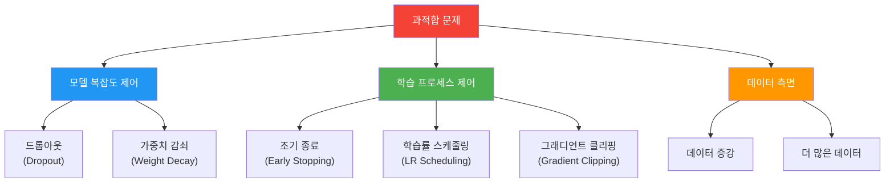
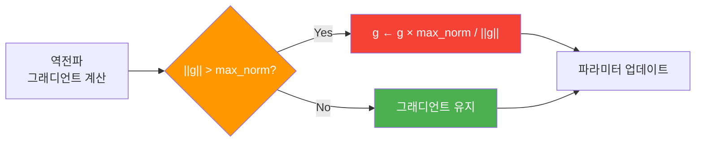
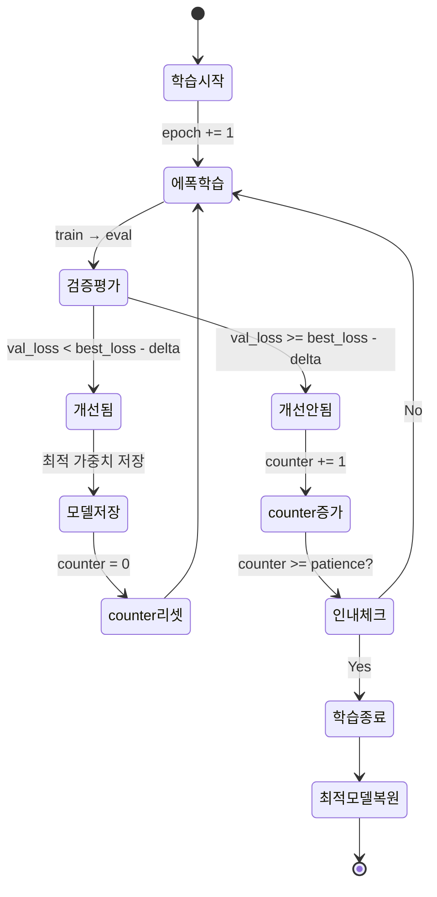

# 정규화와 성능 최적화

> 드롭아웃, 가중치 감쇠, 조기 종료, 학습률 스케줄링으로 LSTM 감성 분석 모델의 과적합을 방지하고 성능을 극대화합니다.

## 개요

이 섹션에서는 [감성 분석 모델 학습](10-ch10-rnn-기반-텍스트-분류와-감성-분석/03-03-감성-분석-모델-학습.md)에서 구축한 BiLSTM 감성 분류 모델에 다양한 정규화 기법을 적용하여 과적합을 방지하고 일반화 성능을 높이는 방법을 다룹니다.

**선수 지식**: BiLSTM 분류기 구조, BCEWithLogitsLoss, 학습/검증 루프, 학습 곡선 해석
**학습 목표**:
- 드롭아웃(Dropout)의 원리를 이해하고 LSTM 모델에 적절히 배치할 수 있다
- 가중치 감쇠(Weight Decay)와 그래디언트 클리핑을 적용할 수 있다
- 조기 종료(Early Stopping) 콜백을 직접 구현할 수 있다
- 학습률 스케줄러(ReduceLROnPlateau)로 학습 안정성을 높일 수 있다

## 왜 알아야 할까?

이전 섹션에서 학습 곡선을 시각화했을 때, 훈련 손실은 계속 줄어드는데 검증 손실은 어느 순간부터 다시 올라가는 현상을 봤죠? 바로 **과적합(Overfitting)**입니다. 모델이 훈련 데이터를 "외워버려서" 새로운 데이터에는 제대로 대응하지 못하는 거예요.

실무에서 LSTM 기반 모델은 파라미터 수가 수십만~수백만 개에 달하기 때문에 과적합에 특히 취약합니다. 정규화 없이 배포한 모델은 "훈련 정확도 98%, 실전 정확도 75%"같은 참담한 결과를 낳곤 하죠. 정규화 기법은 모델을 실전에서 쓸 수 있게 만드는 **필수 기술**입니다.

> 📊 **그림 1**: 정규화 기법의 전체 지도



이번 섹션에서는 **모델 복잡도 제어**와 **학습 프로세스 제어** 쪽 기법을 집중적으로 다룹니다.

## 핵심 개념

### 개념 1: 드롭아웃(Dropout) — 뉴런의 "무작위 결근"

> 💡 **비유**: 회사에서 매일 직원의 50%가 무작위로 결근한다고 상상해보세요. 처음에는 혼란스럽겠지만, 시간이 지나면 모든 직원이 다방면으로 일할 수 있게 됩니다. 한 명에게만 의존하는 구조가 사라지는 거죠. 드롭아웃이 정확히 이 원리입니다.

드롭아웃은 학습 중에 뉴런을 확률 $p$로 무작위 비활성화(0으로 설정)하는 기법입니다. 이렇게 하면 특정 뉴런 조합에 과도하게 의존하는 것을 방지하여, 각 뉴런이 독립적으로 유용한 특성을 학습하게 됩니다.

$$\tilde{y}_i = \frac{r_i \cdot y_i}{1-p}, \quad r_i \sim \text{Bernoulli}(1-p)$$

- $y_i$: 원래 뉴런 출력
- $r_i$: 0 또는 1의 마스크 (확률 $1-p$로 1)
- $p$: 드롭아웃 확률 (보통 0.3~0.5)
- $\frac{1}{1-p}$: 학습 시 살아남은 뉴런의 출력을 스케일링 (추론 시 보정 불필요)

> 📊 **그림 2**: LSTM 모델에서 드롭아웃 적용 위치


LSTM 모델에서 드롭아웃을 적용할 수 있는 위치는 크게 세 곳입니다:

1. **임베딩 드롭아웃**: 임베딩 레이어 출력에 적용
2. **LSTM 내장 드롭아웃**: `nn.LSTM(dropout=0.3)` — 스택된 LSTM 레이어 사이에 적용 (레이어가 2개 이상일 때만 동작)
3. **출력 드롭아웃**: LSTM 출력 → FC 레이어 사이에 적용

```python
import torch
import torch.nn as nn

class RegularizedLSTMClassifier(nn.Module):
    def __init__(self, vocab_size, embed_dim, hidden_dim, 
                 num_layers=2, dropout=0.3, pad_idx=0):
        super().__init__()
        self.embedding = nn.Embedding(vocab_size, embed_dim, padding_idx=pad_idx)
        
        # ① 임베딩 드롭아웃
        self.embed_dropout = nn.Dropout(dropout)
        
        # ② LSTM 내장 드롭아웃 (레이어 사이에 적용)
        self.lstm = nn.LSTM(
            embed_dim, hidden_dim, 
            num_layers=num_layers,
            batch_first=True, 
            bidirectional=True,
            dropout=dropout  # num_layers > 1일 때만 의미 있음
        )
        
        # ③ 출력 드롭아웃
        self.output_dropout = nn.Dropout(dropout)
        self.fc = nn.Linear(hidden_dim * 2, 1)  # 양방향이므로 *2
    
    def forward(self, x):
        embedded = self.embed_dropout(self.embedding(x))  # ① 적용
        output, (h_n, c_n) = self.lstm(embedded)          # ② 내부 적용
        
        # 양방향 마지막 은닉 상태 결합
        hidden = torch.cat([h_n[-2], h_n[-1]], dim=1)
        hidden = self.output_dropout(hidden)               # ③ 적용
        return self.fc(hidden).squeeze(1)
```

> ⚠️ **흔한 오해**: "드롭아웃 확률이 높을수록 정규화가 강하다"고 생각하기 쉽지만, $p$가 너무 높으면 (0.7 이상) 모델이 학습 자체를 제대로 못 합니다. NLP에서는 **0.2~0.5** 범위가 적절하며, 보통 0.3이 좋은 출발점이에요.

### 개념 2: 가중치 감쇠(Weight Decay)와 그래디언트 클리핑

> 💡 **비유**: 가중치 감쇠는 "짐을 가볍게 싸라"는 규칙이에요. 여행 가방에 모든 물건을 다 넣으면 무거워서 움직이기 힘들듯, 모델의 가중치가 너무 커지면 특정 패턴에 과민하게 반응합니다. 가중치 감쇠는 매 학습 단계마다 가중치를 조금씩 줄여서 모델을 "가볍게" 유지합니다.

**가중치 감쇠(L2 정규화)**는 손실 함수에 가중치의 L2 노름을 페널티로 추가합니다:

$$L_{\text{total}} = L_{\text{BCE}} + \lambda \sum_i w_i^2$$

- $\lambda$: 정규화 강도 (PyTorch의 `weight_decay` 파라미터)
- 보통 $\lambda = 10^{-4} \sim 10^{-5}$ 사용

PyTorch에서는 옵티마이저에 `weight_decay` 인자 하나만 추가하면 됩니다:

```python
# weight_decay = L2 정규화 강도
optimizer = torch.optim.Adam(
    model.parameters(), 
    lr=1e-3, 
    weight_decay=1e-4  # 이 한 줄이 L2 정규화 전부!
)
```

**그래디언트 클리핑**은 RNN 계열에서 특히 중요합니다. [BPTT와 기울기 문제](08-ch8-순환-신경망rnn-기초/03-03-bptt와-기울기-문제.md)에서 배운 것처럼, 역전파 시 기울기가 폭발적으로 커질 수 있거든요.

> 📊 **그림 3**: 그래디언트 클리핑의 작동 원리



```python
# 학습 루프 안에서 (loss.backward() 후)
loss.backward()

# 그래디언트 클리핑 — RNN에서는 거의 필수!
torch.nn.utils.clip_grad_norm_(model.parameters(), max_norm=1.0)

optimizer.step()
```

`clip_grad_norm_`은 모든 파라미터의 그래디언트를 하나의 벡터로 보고, 전체 L2 노름이 `max_norm`을 넘으면 비례적으로 축소합니다. RNN/LSTM 학습에서는 `max_norm=1.0~5.0`이 일반적입니다.

### 개념 3: 조기 종료(Early Stopping) — "그만 멈춰!"

> 💡 **비유**: 요리할 때 "살짝 덜 익은 것 같은데?" 싶은 순간이 가장 맛있는 타이밍인 경우가 많죠. 더 익히면 태워버리게 됩니다. 모델 학습도 마찬가지예요. 검증 성능이 가장 좋은 순간에 멈추는 게 최적입니다.

조기 종료는 검증 손실이 일정 에폭 동안(`patience`) 개선되지 않으면 학습을 중단하는 기법입니다. 핵심 아이디어는 간단하지만, 올바르게 구현하려면 **최적 모델 저장**과 **인내심(patience)** 카운팅이 필요합니다.

> 📊 **그림 4**: 조기 종료의 동작 흐름



```python
class EarlyStopping:
    """검증 손실이 개선되지 않으면 학습을 중단합니다."""
    
    def __init__(self, patience=5, min_delta=0.001):
        self.patience = patience      # 개선 없이 기다릴 에폭 수
        self.min_delta = min_delta    # 개선으로 인정할 최소 변화량
        self.counter = 0
        self.best_loss = float('inf')
        self.best_model_state = None
        self.should_stop = False
    
    def __call__(self, val_loss, model):
        if val_loss < self.best_loss - self.min_delta:
            # 개선됨! → 카운터 리셋, 모델 저장
            self.best_loss = val_loss
            self.best_model_state = model.state_dict().copy()
            self.counter = 0
        else:
            # 개선 안 됨 → 카운터 증가
            self.counter += 1
            if self.counter >= self.patience:
                self.should_stop = True
    
    def restore_best_model(self, model):
        """학습 종료 후 최적 모델 가중치를 복원합니다."""
        if self.best_model_state is not None:
            model.load_state_dict(self.best_model_state)
```

### 개념 4: 학습률 스케줄링 — 속도 조절의 기술

> 💡 **비유**: 산꼭대기에서 공을 굴린다고 생각해보세요. 처음에는 빠르게 내려가야 하지만, 골짜기(최적점) 근처에서는 천천히 굴러야 정확한 자리에 도착합니다. 학습률 스케줄링이 바로 이 "속도 조절"이에요.

PyTorch는 다양한 학습률 스케줄러를 제공하는데, NLP 학습에서 가장 널리 쓰이는 것이 `ReduceLROnPlateau`입니다. 검증 손실이 정체되면 학습률을 자동으로 줄여줍니다.

```python
# ReduceLROnPlateau: 검증 손실이 patience 에폭 동안 줄지 않으면 lr 감소
scheduler = torch.optim.lr_scheduler.ReduceLROnPlateau(
    optimizer,
    mode='min',       # 손실이 작을수록 좋으므로 'min'
    factor=0.5,       # 학습률을 절반으로 줄임
    patience=2,       # 2 에폭 동안 개선 없으면 감소
    min_lr=1e-6,      # 최소 학습률 (이 아래로는 안 줄어듦)
    verbose=True      # 학습률 변경 시 메시지 출력
)

# 학습 루프에서 사용
for epoch in range(num_epochs):
    train_loss = train_epoch(model, train_loader, optimizer)
    val_loss = evaluate(model, val_loader)
    
    # 검증 손실을 기준으로 학습률 조절
    scheduler.step(val_loss)  # ← 반드시 검증 후에 호출!
```

> 🔥 **실무 팁**: `scheduler.step()`은 반드시 **에폭 단위 검증 후**에 호출해야 합니다. `optimizer.step()` 직후에 넣으면 매 배치마다 스케줄러가 동작해서 학습이 엉망이 됩니다.

## 실습: 직접 해보기

이전 섹션에서 만든 감성 분석 모델에 모든 정규화 기법을 통합해봅시다. 아래 코드는 완전한 학습 파이프라인입니다.

```python
import torch
import torch.nn as nn
import random
import numpy as np

# 재현성을 위한 시드 고정
torch.manual_seed(42)
random.seed(42)
np.random.seed(42)

# ---------- 1. 정규화가 적용된 모델 ----------
class RegularizedSentimentClassifier(nn.Module):
    def __init__(self, vocab_size, embed_dim=100, hidden_dim=128, 
                 num_layers=2, dropout=0.3, pad_idx=0, 
                 pretrained_embeddings=None):
        super().__init__()
        
        self.embedding = nn.Embedding(vocab_size, embed_dim, padding_idx=pad_idx)
        if pretrained_embeddings is not None:
            self.embedding.weight.data.copy_(pretrained_embeddings)
            self.embedding.weight.requires_grad = True  # 파인튜닝 허용
        
        self.embed_dropout = nn.Dropout(dropout)
        
        self.lstm = nn.LSTM(
            embed_dim, hidden_dim,
            num_layers=num_layers,
            batch_first=True,
            bidirectional=True,
            dropout=dropout if num_layers > 1 else 0  # 레이어 1개면 비활성화
        )
        
        self.output_dropout = nn.Dropout(dropout)
        self.fc = nn.Linear(hidden_dim * 2, 1)
    
    def forward(self, x):
        embedded = self.embed_dropout(self.embedding(x))
        output, (h_n, c_n) = self.lstm(embedded)
        hidden = torch.cat([h_n[-2], h_n[-1]], dim=1)
        hidden = self.output_dropout(hidden)
        return self.fc(hidden).squeeze(1)


# ---------- 2. 조기 종료 클래스 ----------
class EarlyStopping:
    def __init__(self, patience=5, min_delta=0.001):
        self.patience = patience
        self.min_delta = min_delta
        self.counter = 0
        self.best_loss = float('inf')
        self.best_model_state = None
        self.should_stop = False
    
    def __call__(self, val_loss, model):
        if val_loss < self.best_loss - self.min_delta:
            self.best_loss = val_loss
            self.best_model_state = {k: v.clone() for k, v in model.state_dict().items()}
            self.counter = 0
        else:
            self.counter += 1
            if self.counter >= self.patience:
                self.should_stop = True
    
    def restore_best_model(self, model):
        if self.best_model_state is not None:
            model.load_state_dict(self.best_model_state)


# ---------- 3. 학습/검증 함수 ----------
def train_epoch(model, loader, optimizer, criterion, max_grad_norm=1.0):
    model.train()
    total_loss = 0
    correct = 0
    total = 0
    
    for texts, labels in loader:
        optimizer.zero_grad()
        predictions = model(texts)
        loss = criterion(predictions, labels.float())
        loss.backward()
        
        # 그래디언트 클리핑 (RNN 학습 안정성)
        torch.nn.utils.clip_grad_norm_(model.parameters(), max_norm=max_grad_norm)
        
        optimizer.step()
        
        total_loss += loss.item()
        preds = (torch.sigmoid(predictions) >= 0.5).long()
        correct += (preds == labels).sum().item()
        total += labels.size(0)
    
    return total_loss / len(loader), correct / total


def evaluate(model, loader, criterion):
    model.eval()
    total_loss = 0
    correct = 0
    total = 0
    
    with torch.no_grad():
        for texts, labels in loader:
            predictions = model(texts)
            loss = criterion(predictions, labels.float())
            total_loss += loss.item()
            preds = (torch.sigmoid(predictions) >= 0.5).long()
            correct += (preds == labels).sum().item()
            total += labels.size(0)
    
    return total_loss / len(loader), correct / total


# ---------- 4. 통합 학습 루프 ----------
def train_with_regularization(model, train_loader, val_loader, 
                               num_epochs=30, lr=1e-3, weight_decay=1e-4):
    criterion = nn.BCEWithLogitsLoss()
    
    # 가중치 감쇠가 포함된 옵티마이저
    optimizer = torch.optim.Adam(
        model.parameters(), lr=lr, weight_decay=weight_decay
    )
    
    # 학습률 스케줄러
    scheduler = torch.optim.lr_scheduler.ReduceLROnPlateau(
        optimizer, mode='min', factor=0.5, patience=2, min_lr=1e-6
    )
    
    # 조기 종료
    early_stopping = EarlyStopping(patience=5, min_delta=0.001)
    
    history = {'train_loss': [], 'val_loss': [], 
               'train_acc': [], 'val_acc': [], 'lr': []}
    
    for epoch in range(num_epochs):
        train_loss, train_acc = train_epoch(
            model, train_loader, optimizer, criterion, max_grad_norm=1.0
        )
        val_loss, val_acc = evaluate(model, val_loader, criterion)
        
        # 현재 학습률 기록
        current_lr = optimizer.param_groups[0]['lr']
        history['train_loss'].append(train_loss)
        history['val_loss'].append(val_loss)
        history['train_acc'].append(train_acc)
        history['val_acc'].append(val_acc)
        history['lr'].append(current_lr)
        
        print(f"Epoch {epoch+1:02d} | "
              f"Train Loss: {train_loss:.4f} Acc: {train_acc:.4f} | "
              f"Val Loss: {val_loss:.4f} Acc: {val_acc:.4f} | "
              f"LR: {current_lr:.6f}")
        
        # 학습률 스케줄링 (검증 손실 기준)
        scheduler.step(val_loss)
        
        # 조기 종료 체크
        early_stopping(val_loss, model)
        if early_stopping.should_stop:
            print(f"\n조기 종료! (Epoch {epoch+1}, patience={early_stopping.patience})")
            early_stopping.restore_best_model(model)
            print(f"최적 모델 복원 완료 (Best Val Loss: {early_stopping.best_loss:.4f})")
            break
    
    return history
```

아래는 모델 생성과 학습을 실행하는 코드입니다:

```run:python
# 데모: 정규화 효과를 간단히 확인하는 예제
import torch
import torch.nn as nn

# 하이퍼파라미터 비교
configs = {
    "드롭아웃 없음":     {"dropout": 0.0, "weight_decay": 0.0},
    "드롭아웃 0.3":      {"dropout": 0.3, "weight_decay": 0.0},
    "드롭아웃 + WD":     {"dropout": 0.3, "weight_decay": 1e-4},
    "전체 정규화":       {"dropout": 0.3, "weight_decay": 1e-4},  # + 클리핑, 스케줄링
}

for name, cfg in configs.items():
    # 파라미터 수는 동일 — 정규화는 학습 방식만 바꿈
    model = nn.Sequential(
        nn.Embedding(10000, 100, padding_idx=0),
        nn.Dropout(cfg["dropout"]),
        nn.LSTM(100, 128, num_layers=2, batch_first=True, 
                dropout=cfg["dropout"] if 2 > 1 else 0, bidirectional=True),
    )
    param_count = sum(p.numel() for p in model.parameters())
    print(f"{name:15s} | 드롭아웃: {cfg['dropout']} | WD: {cfg['weight_decay']} | 파라미터: {param_count:,}")
```

```output
드롭아웃 없음       | 드롭아웃: 0.0 | WD: 0.0 | 파라미터: 1,738,240
드롭아웃 0.3        | 드롭아웃: 0.3 | WD: 0.0 | 파라미터: 1,738,240
드롭아웃 + WD       | 드롭아웃: 0.3 | WD: 0.0001 | 파라미터: 1,738,240
전체 정규화         | 드롭아웃: 0.3 | WD: 0.0001 | 파라미터: 1,738,240
```

파라미터 수는 완전히 동일합니다! 정규화는 모델 구조를 바꾸는 게 아니라 **학습 과정**을 제어하는 기법이라는 걸 확인할 수 있어요.

학습 곡선을 시각화하는 함수도 확장해봅시다:

```python
import matplotlib.pyplot as plt

def plot_regularization_curves(history):
    """학습 곡선 + 학습률 변화를 함께 시각화합니다."""
    fig, axes = plt.subplots(1, 3, figsize=(18, 5))
    
    # 1. 손실 곡선
    axes[0].plot(history['train_loss'], label='Train Loss', linewidth=2)
    axes[0].plot(history['val_loss'], label='Val Loss', linewidth=2)
    axes[0].set_xlabel('Epoch')
    axes[0].set_ylabel('Loss')
    axes[0].set_title('손실 곡선 (정규화 적용)')
    axes[0].legend()
    axes[0].grid(True, alpha=0.3)
    
    # 2. 정확도 곡선
    axes[1].plot(history['train_acc'], label='Train Acc', linewidth=2)
    axes[1].plot(history['val_acc'], label='Val Acc', linewidth=2)
    axes[1].set_xlabel('Epoch')
    axes[1].set_ylabel('Accuracy')
    axes[1].set_title('정확도 곡선')
    axes[1].legend()
    axes[1].grid(True, alpha=0.3)
    
    # 3. 학습률 변화
    axes[2].plot(history['lr'], label='Learning Rate', 
                 linewidth=2, color='green')
    axes[2].set_xlabel('Epoch')
    axes[2].set_ylabel('Learning Rate')
    axes[2].set_title('학습률 스케줄링')
    axes[2].set_yscale('log')
    axes[2].legend()
    axes[2].grid(True, alpha=0.3)
    
    plt.tight_layout()
    plt.savefig('regularization_curves.png', dpi=150)
    plt.show()
```

하이퍼파라미터 튜닝의 권장 순서도 정리해둡니다:

```run:python
# 정규화 하이퍼파라미터 탐색 가이드
search_space = {
    "dropout":       [0.1, 0.2, 0.3, 0.5],
    "weight_decay":  [0, 1e-5, 1e-4, 1e-3],
    "max_grad_norm": [0.5, 1.0, 5.0],
    "lr":            [1e-4, 5e-4, 1e-3, 2e-3],
    "patience(ES)":  [3, 5, 7, 10],
}

print("=== 정규화 하이퍼파라미터 탐색 가이드 ===\n")
for param, values in search_space.items():
    print(f"  {param:15s}: {values}")
print(f"\n총 조합 수: {np.prod([len(v) for v in search_space.values()]):,}개")
print("→ 전부 탐색은 비현실적! 순차적으로 튜닝하세요.")
print("\n권장 순서: dropout → lr → weight_decay → grad_clip → patience")
```

```output
=== 정규화 하이퍼파라미터 탐색 가이드 ===

  dropout        : [0.1, 0.2, 0.3, 0.5]
  weight_decay   : [0, 1e-05, 0.0001, 0.001]
  max_grad_norm  : [0.5, 1.0, 5.0]
  lr             : [0.0001, 0.0005, 0.001, 0.002]
  patience(ES)   : [3, 5, 7, 10]

총 조합 수: 768개
→ 전부 탐색은 비현실적! 순차적으로 튜닝하세요.

권장 순서: dropout → lr → weight_decay → grad_clip → patience
```

## 더 깊이 알아보기

### 드롭아웃의 탄생 — 성적 방지의 지혜에서 온 아이디어

드롭아웃은 2014년 토론토 대학교의 **Nitish Srivastava**와 **Geoffrey Hinton** 등이 발표한 논문 "Dropout: A Simple Way to Prevent Neural Networks from Overfitting"에서 공식적으로 소개되었습니다.

놀랍게도, Hinton은 이 아이디어를 **생물학**에서 영감을 얻었다고 합니다. 유성 생식(sexual reproduction)에서 유전자는 매 세대마다 무작위로 절반만 전달되죠. 이렇게 하면 특정 유전자 조합에 의존하는 대신, 개별 유전자가 독립적으로 유용해야 살아남을 수 있습니다. 드롭아웃이 정확히 이 원리 — "개별 뉴런이 독립적으로 유용해야 한다"는 압력을 모델에 가하는 겁니다.

또 다른 일화로, Hinton은 은행 직원들이 자주 부서를 이동하는 것에서도 영감을 얻었다고 해요. 한 직원이 오래 같은 자리에 있으면 부정(사기)을 저지를 수 있지만, 무작위로 순환 배치하면 어떤 직원 조합에서도 시스템이 잘 작동해야 하니까요.

### 조기 종료의 이론적 배경

조기 종료는 단순히 실용적인 트릭처럼 보이지만, 실은 깊은 이론적 근거가 있습니다. Yarin Gal(2016)의 연구에 따르면, 학습을 일찍 멈추는 것은 **암묵적으로 모델의 복잡도를 제한**하는 효과가 있습니다. 학습 초기에 모델은 데이터의 큰 패턴(일반적 구조)을 먼저 학습하고, 나중에야 노이즈(잡음)를 외우기 시작하거든요. 조기 종료는 이 "노이즈 암기" 단계 직전에 학습을 멈추는 셈입니다.

## 흔한 오해와 팁

> ⚠️ **흔한 오해**: "드롭아웃은 추론(inference) 시에도 적용해야 한다." 절대 아닙니다! `model.eval()`을 호출하면 드롭아웃이 자동으로 비활성화됩니다. `model.train()`일 때만 드롭아웃이 동작합니다. 검증/테스트 시 `model.eval()`을 빼먹으면 결과가 매번 달라지고 성능이 떨어집니다.

> 💡 **알고 계셨나요?**: PyTorch의 `nn.LSTM(dropout=0.3)`은 **마지막 레이어의 출력에는 드롭아웃을 적용하지 않습니다**. LSTM 스택의 중간 레이어 사이에서만 동작해요. 그래서 최종 출력에 별도의 `nn.Dropout`을 추가해야 합니다.

> 🔥 **실무 팁**: 정규화 기법을 한꺼번에 전부 적용하지 마세요. 하나씩 추가하면서 검증 성능 변화를 관찰하는 게 중요합니다. 권장 순서: ① 그래디언트 클리핑 → ② 드롭아웃 → ③ 조기 종료 → ④ 학습률 스케줄링 → ⑤ 가중치 감쇠. 각 단계에서 개선이 있는지 확인한 뒤 다음으로 넘어가세요.

> 🔥 **실무 팁**: `EarlyStopping`의 `patience`를 너무 작게 잡으면 학습률 스케줄러가 효과를 발휘하기 전에 학습이 끝나버립니다. 경험적으로 `ES patience ≥ LR patience × 2` 정도가 적당합니다. 예: LR patience=2이면 ES patience=5 이상.

## 핵심 정리

| 개념 | 설명 | PyTorch 사용법 |
|------|------|---------------|
| **드롭아웃** | 학습 중 뉴런을 확률적으로 비활성화하여 과적합 방지 | `nn.Dropout(0.3)`, `nn.LSTM(dropout=0.3)` |
| **가중치 감쇠** | 손실 함수에 L2 페널티를 추가하여 가중치 크기 제한 | `Adam(weight_decay=1e-4)` |
| **그래디언트 클리핑** | 기울기 폭발 방지, 학습 안정성 확보 | `clip_grad_norm_(params, max_norm=1.0)` |
| **조기 종료** | 검증 성능이 개선되지 않으면 학습 중단 + 최적 모델 복원 | 직접 구현 (patience + best model 저장) |
| **학습률 스케줄링** | 학습 정체 시 학습률을 자동 감소 | `ReduceLROnPlateau(factor=0.5)` |

## 다음 섹션 미리보기

정규화를 통해 과적합을 잡았다면, 이제 모델이 **실제로 얼마나 잘 하는지** 제대로 평가해야겠죠? [모델 평가와 오류 분석](10-ch10-rnn-기반-텍스트-분류와-감성-분석/05-05-모델-평가와-오류-분석.md)에서는 정밀도, 재현율, F1 점수, 혼동 행렬로 모델 성능을 다각도로 분석하고, 오분류 사례를 체계적으로 분석하여 개선 방향을 도출하는 방법을 다룹니다.

## 참고 자료

- [Dropout: A Simple Way to Prevent Neural Networks from Overfitting (Srivastava et al., 2014)](https://jmlr.csail.mit.edu/beta/papers/v15/srivastava14a.html) - 드롭아웃의 원조 논문. 드롭아웃의 이론적 배경과 다양한 태스크에서의 실험 결과를 담고 있습니다
- [PyTorch torch.nn.utils.clip_grad_norm_ 공식 문서](https://docs.pytorch.org/docs/stable/generated/torch.nn.utils.clip_grad_norm_.html) - 그래디언트 클리핑 함수의 정확한 사용법과 파라미터 설명
- [PyTorch ReduceLROnPlateau 공식 문서](https://docs.pytorch.org/docs/stable/generated/torch.optim.lr_scheduler.ReduceLROnPlateau.html) - 학습률 스케줄러의 파라미터와 사용 패턴
- [Using Dropout Regularization in PyTorch Models](https://machinelearningmastery.com/using-dropout-regularization-in-pytorch-models/) - 드롭아웃의 실전 적용 가이드, 위치별 효과 비교
- [Stanford CS 224N: Natural Language Processing with Deep Learning](https://web.stanford.edu/class/cs224n/) - NLP 전반의 정규화 기법과 학습 전략에 대한 강의 자료
- [Early Stopping for PyTorch (GitHub)](https://github.com/Bjarten/early-stopping-pytorch) - 조기 종료의 깔끔한 PyTorch 구현 예제

---
### 🔗 Related Sessions
- [bilstmclassifier](10-ch10-rnn-기반-텍스트-분류와-감성-분석/01-01-rnn-텍스트-분류-아키텍처.md) (prerequisite)
- [train_epoch](10-ch10-rnn-기반-텍스트-분류와-감성-분석/03-03-감성-분석-모델-학습.md) (prerequisite)
- [evaluate](10-ch10-rnn-기반-텍스트-분류와-감성-분석/03-03-감성-분석-모델-학습.md) (prerequisite)
