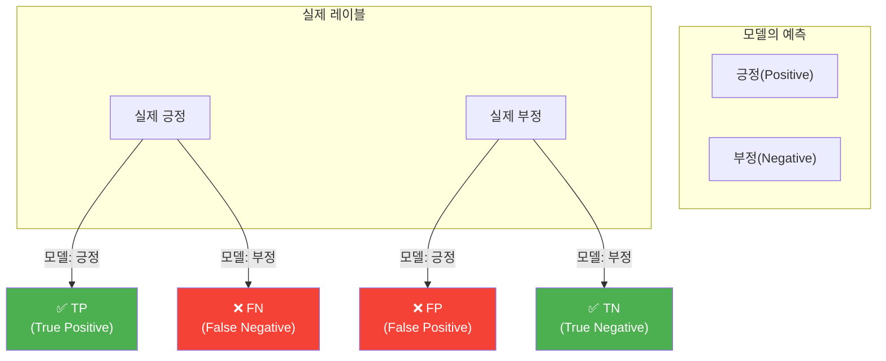
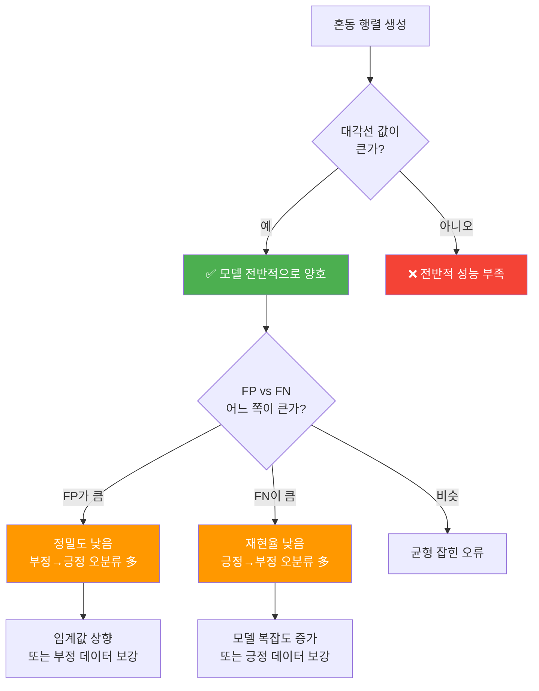
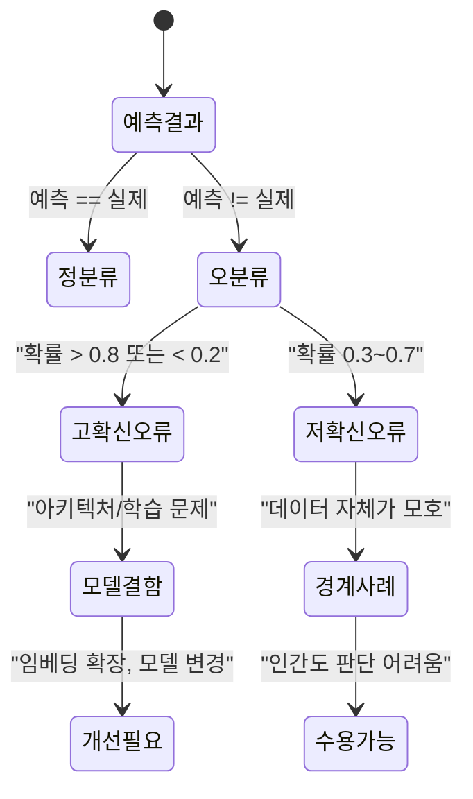
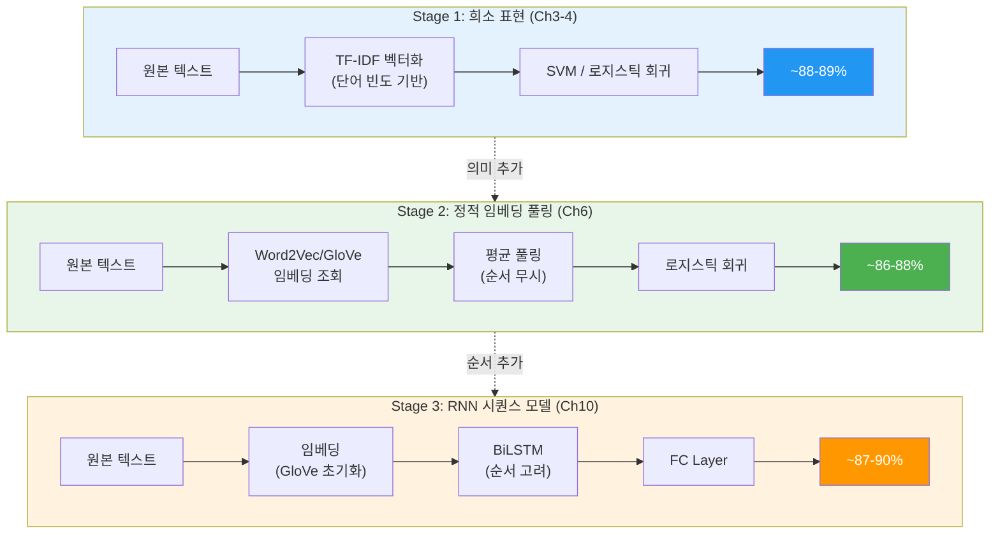
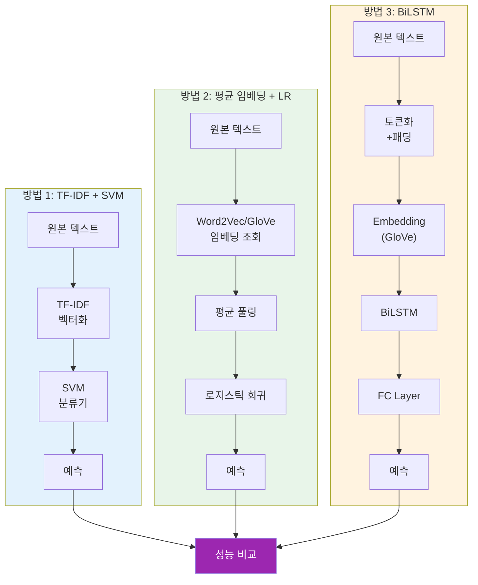

# 모델 평가와 오류 분석

> 테스트셋 평가, 혼동 행렬 분석, 오분류 사례 분석, 전통적 방법과의 성능 비교를 통해 감성 분석 모델의 실전 성능을 다각도로 진단합니다.

## 개요

이 섹션에서는 지금까지 구축하고 정규화한 BiLSTM 감성 분석 모델의 **최종 성능을 체계적으로 평가**합니다. 단순히 정확도(Accuracy)만 보는 것이 아니라, 정밀도(Precision), 재현율(Recall), F1 점수, 혼동 행렬(Confusion Matrix)까지 다각도로 분석하고, 오분류된 리뷰를 직접 들여다보며 모델의 약점을 진단합니다. 마지막으로 세 가지 접근법 — TF-IDF + SVM(희소 표현), 평균 임베딩 + 로지스틱 회귀(정적 임베딩 풀링), BiLSTM(RNN 시퀀스 모델) — 의 성능을 체계적으로 비교하여 각 방법의 실질적 가치와 한계를 평가합니다.

**선수 지식**: [04. 정규화와 성능 최적화](10-ch10-rnn-기반-텍스트-분류와-감성-분석/04-04-정규화와-성능-최적화.md)에서 구축한 정규화된 BiLSTM 모델, [03. 모델 평가와 성능 지표](04-ch4-전통적-텍스트-분류/03-03-모델-평가와-성능-지표.md)에서 배운 분류 성능 지표 기초, [04. 임베딩 기반 텍스트 분류](06-ch6-워드-임베딩-word2vec과-glove/04-04-임베딩-기반-텍스트-분류.md)에서 배운 평균 임베딩 분류 접근법

**학습 목표**:
- 혼동 행렬을 해석하여 모델의 강점과 약점을 파악할 수 있다
- 오분류 사례를 분석하여 모델 개선 방향을 도출할 수 있다
- BoW(TF-IDF), 임베딩 풀링, RNN 세 가지 접근법의 성능을 정량적으로 비교할 수 있다
- 분류 모델의 평가 보고서를 작성할 수 있다

## 왜 알아야 할까?

모델을 학습시키는 것은 전체 과정의 절반에 불과합니다. 실무에서 "정확도 87%"라는 숫자만으로는 아무것도 결정할 수 없거든요. 상사에게 보고할 때든, 논문을 쓸 때든, 서비스에 배포할 때든 반드시 던져야 할 질문들이 있습니다:

- "긍정을 부정으로 잘못 분류하는 경우가 더 많은가, 반대인가?"
- "어떤 유형의 리뷰에서 실패하는가?"
- "굳이 딥러닝을 써야 하는가, 전통적 방법으로 충분하지 않은가?"

이런 질문에 답하려면 **평가 지표의 의미를 깊이 이해**하고, **오류 패턴을 체계적으로 분석**해야 합니다. 특히 IMDB 감성 분석에서 TF-IDF + SVM이 약 88~90%의 정확도를 달성한다는 연구 결과가 있는데요, BiLSTM이 이를 유의미하게 넘어서지 못한다면 모델 복잡도를 정당화하기 어렵겠죠.

그리고 한 가지 더 — [Ch6에서 배운 평균 임베딩 + 분류기](06-ch6-워드-임베딩-word2vec과-glove/04-04-임베딩-기반-텍스트-분류.md) 접근법은 어떨까요? TF-IDF보다는 의미를 이해하지만, RNN처럼 순서를 고려하지는 않는 **중간 단계**입니다. 이 세 가지를 나란히 비교하면, "단어 빈도 → 단어 의미 → 문장 순서"로 발전하는 텍스트 표현의 진화를 정량적으로 확인할 수 있습니다.

## 핵심 개념

### 개념 1: 분류 성능 지표의 심화 이해

> 💡 **비유**: 평가 지표는 건강 검진 항목과 같습니다. 혈압만 측정해서 "건강하다"고 할 수 없듯이, 정확도(Accuracy)만 보고 "좋은 모델이다"라고 판단할 수 없어요. 혈당, 콜레스테롤, 간 기능까지 종합적으로 봐야 하듯, 정밀도, 재현율, F1까지 함께 봐야 모델의 진짜 상태를 알 수 있습니다.

이진 분류에서 핵심 지표 4가지를 다시 정리해볼게요:

| 지표 | 수식 | 의미 |
|------|------|------|
| **정확도(Accuracy)** | $\frac{TP + TN}{TP + TN + FP + FN}$ | 전체 중 맞춘 비율 |
| **정밀도(Precision)** | $\frac{TP}{TP + FP}$ | "긍정"이라고 예측한 것 중 실제 긍정의 비율 |
| **재현율(Recall)** | $\frac{TP}{TP + FN}$ | 실제 긍정 중에서 모델이 찾아낸 비율 |
| **F1 점수** | $2 \cdot \frac{Precision \cdot Recall}{Precision + Recall}$ | 정밀도와 재현율의 조화 평균 |

여기서 TP(True Positive)는 긍정을 긍정으로 맞춘 것, FP(False Positive)는 부정을 긍정으로 잘못 분류한 것, FN(False Negative)는 긍정을 부정으로 놓친 것입니다.

> 📊 **그림 1**: 이진 분류 혼동 행렬의 구조



감성 분석에서 정밀도와 재현율의 차이가 왜 중요할까요? 예를 들어 기업의 고객 불만 탐지 시스템이라면, 부정 리뷰를 놓치는 것(FN↑, 재현율↓)이 긍정 리뷰를 부정으로 잘못 분류하는 것(FP↑, 정밀도↓)보다 훨씬 위험합니다. 반면, 마케팅 팀이 긍정 리뷰를 수집하는 경우라면 정밀도가 더 중요하겠죠.

scikit-learn의 `classification_report`는 이 모든 지표를 한 번에 보여줍니다:

```python
from sklearn.metrics import (
    classification_report,
    confusion_matrix,
    ConfusionMatrixDisplay,
    accuracy_score,
    f1_score,
    precision_score,
    recall_score
)

# PyTorch 모델의 예측 결과를 numpy 배열로 변환한 후 사용
print(classification_report(
    y_true,           # 실제 레이블
    y_pred,           # 모델 예측
    target_names=["부정", "긍정"]  # 클래스 이름
))
```

### 개념 2: PyTorch 모델의 테스트셋 평가 파이프라인

> 💡 **비유**: 학교에서 중간고사(검증셋)로 실력을 확인하고, 기말고사(테스트셋)로 최종 성적을 매기는 것과 같습니다. 중간고사 성적을 보고 공부 방법을 조정(하이퍼파라미터 튜닝)했다면, 기말고사는 그 조정 없이 순수하게 실력을 측정해야 합니다. 테스트셋은 딱 한 번만 사용해야 하는 이유가 여기에 있어요.

PyTorch 모델로 전체 테스트셋의 예측을 수집하고 sklearn 지표를 계산하는 전체 파이프라인을 구축해봅시다.

> 📊 **그림 2**: 테스트셋 평가 파이프라인


핵심은 `model.eval()`로 평가 모드 전환과 `torch.no_grad()`로 그래디언트 계산 비활성화입니다. [03. 감성 분석 모델 학습](10-ch10-rnn-기반-텍스트-분류와-감성-분석/03-03-감성-분석-모델-학습.md)에서 배운 패턴이죠.

```python
import torch
import numpy as np
from sklearn.metrics import classification_report, confusion_matrix

def evaluate_model_full(model, data_loader, device):
    """테스트셋 전체 예측을 수집하고 성능 지표를 반환합니다."""
    model.eval()
    all_preds = []
    all_labels = []
    all_probs = []  # 확률값도 저장 (오류 분석용)
    all_texts = []  # 원본 텍스트 인덱스 (오분류 분석용)

    with torch.no_grad():
        for batch_idx, (texts, labels) in enumerate(data_loader):
            texts, labels = texts.to(device), labels.to(device)

            # 순전파
            outputs = model(texts).squeeze(1)

            # 시그모이드로 확률 변환
            probs = torch.sigmoid(outputs)
            preds = (probs >= 0.5).long()

            all_probs.extend(probs.cpu().numpy())
            all_preds.extend(preds.cpu().numpy())
            all_labels.extend(labels.cpu().numpy())

    all_preds = np.array(all_preds)
    all_labels = np.array(all_labels)
    all_probs = np.array(all_probs)

    return all_labels, all_preds, all_probs
```

```run:python
# 지표 계산 예시 (시뮬레이션)
import numpy as np

# 예시 데이터 (실제로는 모델 예측 결과)
np.random.seed(42)
y_true = np.array([1, 0, 1, 1, 0, 1, 0, 0, 1, 1, 0, 1, 0, 0, 1, 1])
y_pred = np.array([1, 0, 1, 0, 0, 1, 1, 0, 1, 1, 0, 1, 0, 1, 1, 1])

# 개별 지표 계산
tp = np.sum((y_pred == 1) & (y_true == 1))
fp = np.sum((y_pred == 1) & (y_true == 0))
fn = np.sum((y_pred == 0) & (y_true == 1))
tn = np.sum((y_pred == 0) & (y_true == 0))

precision = tp / (tp + fp)
recall = tp / (tp + fn)
f1 = 2 * precision * recall / (precision + recall)
accuracy = (tp + tn) / len(y_true)

print(f"TP={tp}, FP={fp}, FN={fn}, TN={tn}")
print(f"정확도:  {accuracy:.4f}")
print(f"정밀도:  {precision:.4f}")
print(f"재현율:  {recall:.4f}")
print(f"F1 점수: {f1:.4f}")
```

```output
TP=8, FP=2, FN=1, TN=5
정확도:  0.8125
정밀도:  0.8000
재현율:  0.8889
F1 점수: 0.8421
```

### 개념 3: 혼동 행렬 시각화와 해석

> 💡 **비유**: 혼동 행렬은 시험 채점표와 같습니다. 학생(모델)이 어떤 유형의 문제는 잘 풀고, 어떤 유형에서 자주 실수하는지 한눈에 보여주는 표죠. 수학은 잘 맞추는데 영어에서 자주 틀린다면, 영어 공부에 집중해야 한다는 걸 알 수 있듯이요.

혼동 행렬을 시각화하면 모델이 어떤 방향으로 실수하는지 직관적으로 파악할 수 있습니다. scikit-learn 1.8의 `ConfusionMatrixDisplay`를 사용하면 깔끔하게 그릴 수 있어요.

> 📊 **그림 3**: 혼동 행렬 해석 가이드



```python
import matplotlib.pyplot as plt
from sklearn.metrics import ConfusionMatrixDisplay, confusion_matrix

def plot_confusion_matrix(y_true, y_pred, title="혼동 행렬"):
    """혼동 행렬을 히트맵으로 시각화합니다."""
    cm = confusion_matrix(y_true, y_pred)

    fig, axes = plt.subplots(1, 2, figsize=(14, 5))

    # 절대값 혼동 행렬
    disp1 = ConfusionMatrixDisplay(
        confusion_matrix=cm,
        display_labels=["부정", "긍정"]
    )
    disp1.plot(cmap='Blues', ax=axes[0], values_format='d')
    axes[0].set_title(f"{title} (절대값)")

    # 정규화된 혼동 행렬 (비율)
    cm_norm = cm.astype('float') / cm.sum(axis=1)[:, np.newaxis]
    disp2 = ConfusionMatrixDisplay(
        confusion_matrix=cm_norm,
        display_labels=["부정", "긍정"]
    )
    disp2.plot(cmap='Oranges', ax=axes[1], values_format='.2%')
    axes[1].set_title(f"{title} (정규화)")

    plt.tight_layout()
    plt.show()

    return cm
```

혼동 행렬에서 **정규화(normalize)** 버전을 함께 보는 것이 중요합니다. 클래스별 데이터 수가 다를 때 절대값만 보면 오해의 소지가 있거든요. IMDB 데이터셋은 긍정/부정이 각 12,500개로 균형이 잡혀 있지만, 실무에서는 불균형한 경우가 훨씬 많습니다.

### 개념 4: 오분류 사례 분석

> 💡 **비유**: 의사가 진단 실수를 검토하는 M&M(Morbidity & Mortality) 컨퍼런스와 같습니다. "왜 이 환자를 놓쳤는가?"를 분석하면 같은 실수를 반복하지 않을 수 있죠. 모델도 마찬가지로, 어떤 리뷰에서 실수했는지를 분석해야 체계적으로 개선할 수 있습니다.

오분류 분석은 단순히 "틀린 것"을 나열하는 게 아닙니다. **모델이 확신을 갖고 틀린 경우**(고확신 오분류)와 **경계선에서 틀린 경우**(저확신 오분류)를 구분하는 것이 핵심입니다.

> 📊 **그림 4**: 오분류 유형 분류



```python
def analyze_misclassifications(texts, y_true, y_pred, probs, vocab,
                                max_len=200, top_k=10):
    """오분류 사례를 분석하고 패턴을 도출합니다."""
    # 오분류 인덱스 추출
    misclassified = np.where(y_true != y_pred)[0]

    # 확신도 기준 정렬 (가장 확신 있게 틀린 순서)
    # 긍정으로 확신했지만 부정인 경우: prob이 높음
    # 부정으로 확신했지만 긍정인 경우: prob이 낮음
    confidence_errors = []
    for idx in misclassified:
        # 정답과의 거리 = 얼마나 확신 있게 틀렸는가
        if y_true[idx] == 1:  # 실제 긍정인데 부정으로 예측
            confidence = 1.0 - probs[idx]  # prob이 낮을수록 확신 있게 틀림
        else:  # 실제 부정인데 긍정으로 예측
            confidence = probs[idx]  # prob이 높을수록 확신 있게 틀림
        confidence_errors.append((idx, confidence))

    # 확신도 높은 순으로 정렬
    confidence_errors.sort(key=lambda x: x[1], reverse=True)

    print(f"\n{'='*60}")
    print(f"총 오분류 수: {len(misclassified)} / {len(y_true)}")
    print(f"오분류율: {len(misclassified)/len(y_true)*100:.2f}%")
    print(f"{'='*60}")

    # 유형별 분류
    fp_indices = misclassified[
        (y_true[misclassified] == 0) & (y_pred[misclassified] == 1)
    ]
    fn_indices = misclassified[
        (y_true[misclassified] == 1) & (y_pred[misclassified] == 0)
    ]
    print(f"\nFalse Positive (부정→긍정 오분류): {len(fp_indices)}개")
    print(f"False Negative (긍정→부정 오분류): {len(fn_indices)}개")

    # 고확신 오분류 Top-K 출력
    print(f"\n--- 고확신 오분류 Top-{top_k} ---")
    for rank, (idx, conf) in enumerate(confidence_errors[:top_k], 1):
        # 텍스트 복원 (인덱스 → 단어)
        token_ids = texts[idx]
        words = [vocab.idx2word.get(tid.item(), '<unk>')
                 for tid in token_ids if tid.item() != 0]  # PAD 제외
        text = ' '.join(words[:50])  # 처음 50단어만

        label = "긍정" if y_true[idx] == 1 else "부정"
        pred = "긍정" if y_pred[idx] == 1 else "부정"
        print(f"\n[{rank}] 확신도: {conf:.4f}")
        print(f"    실제: {label} | 예측: {pred} | prob: {probs[idx]:.4f}")
        print(f"    텍스트: {text}...")

    return fp_indices, fn_indices, confidence_errors
```

### 개념 5: 텍스트 표현의 3단계 진화 — BoW, 임베딩 풀링, RNN

> 💡 **비유**: 요리사를 평가하는 세 가지 방식을 생각해보세요. **첫 번째(TF-IDF)**는 "재료 목록만 보고 판단"하는 겁니다 — 트러플과 캐비어가 들어갔으니 고급 요리일 거라고요. **두 번째(평균 임베딩)**는 "재료의 품질을 평균 내어 판단"합니다 — 각 재료의 등급을 매기고 평균을 내죠. 하지만 재료를 넣는 **순서**는 무시합니다. **세 번째(BiLSTM)**는 "조리 과정을 처음부터 끝까지 지켜보며 판단"합니다 — 어떤 재료를 먼저 넣고, 어떤 순서로 조합했는지까지 고려하죠.

이 코스를 통해 우리는 텍스트를 표현하는 세 가지 패러다임을 순서대로 배워왔습니다. 이제 그 전체 여정을 성능으로 검증할 시간이에요.

> 📊 **그림 5**: 텍스트 표현의 3단계 진화와 정보 활용 수준



각 단계가 **어떤 정보를 활용하는가**가 핵심 차이입니다:

| 접근법 | 단어 존재 | 단어 빈도 | 단어 의미 | 단어 순서 | 장거리 문맥 |
|--------|:---------:|:---------:|:---------:|:---------:|:-----------:|
| **TF-IDF + SVM** | ✅ | ✅ | ❌ | ❌ | ❌ |
| **평균 임베딩 + LR** | ✅ | ❌ | ✅ | ❌ | ❌ |
| **BiLSTM** | ✅ | ❌ | ✅ | ✅ | ✅ |

흥미로운 점은 이 세 접근법의 IMDB 성능이 생각보다 **큰 차이가 없다**는 것입니다. 왜 그럴까요? IMDB 감성 분석은 상대적으로 **단순한 태스크**이기 때문입니다. "This movie is terrible"이든 "terrible is this movie"든 감성은 같거든요. 단어 순서가 감성을 뒤집는 경우(예: "not bad at all" = 긍정)에서야 BiLSTM의 진가가 드러납니다.

[04. 임베딩 기반 텍스트 분류](06-ch6-워드-임베딩-word2vec과-glove/04-04-임베딩-기반-텍스트-분류.md)에서 배운 평균 임베딩 접근법을 다시 떠올려볼까요? 문서 내 모든 단어의 임베딩을 평균 내어 하나의 고정 길이 벡터로 만들고, 이를 분류기에 넣는 방식이었죠. 구현이 간단하고 추론이 빠른 대신, "not good"과 "good"의 차이를 잡아내기 어려웠습니다.

```python
from sklearn.linear_model import LogisticRegression
import numpy as np

def build_avg_embedding_baseline(train_texts, train_labels,
                                  test_texts, test_labels,
                                  embedding_model, embed_dim=300):
    """평균 임베딩 + 로지스틱 회귀 베이스라인을 구축합니다.
    Ch6에서 배운 접근법의 재현입니다."""

    def texts_to_avg_embeddings(texts, model, dim):
        """각 텍스트를 단어 임베딩의 평균으로 변환합니다."""
        vectors = []
        for text in texts:
            words = text.lower().split()
            word_vecs = [
                model[w] for w in words if w in model
            ]
            if word_vecs:
                vectors.append(np.mean(word_vecs, axis=0))
            else:
                vectors.append(np.zeros(dim))  # OOV 전부일 때
        return np.array(vectors)

    # 텍스트 → 평균 임베딩 벡터
    X_train = texts_to_avg_embeddings(
        train_texts, embedding_model, embed_dim
    )
    X_test = texts_to_avg_embeddings(
        test_texts, embedding_model, embed_dim
    )

    # 로지스틱 회귀 학습
    clf = LogisticRegression(max_iter=1000, C=1.0)
    clf.fit(X_train, train_labels)

    # 예측 및 평가
    emb_preds = clf.predict(X_test)
    emb_probs = clf.predict_proba(X_test)[:, 1]

    print("=" * 50)
    print("평균 임베딩 + 로지스틱 회귀 베이스라인 결과")
    print("=" * 50)
    from sklearn.metrics import classification_report
    print(classification_report(
        test_labels, emb_preds,
        target_names=["부정", "긍정"]
    ))

    return clf, emb_preds, emb_probs
```

### 개념 6: TF-IDF + SVM 베이스라인

> 💡 **비유**: 새 차를 살 때 기존 차와 비교 시승하는 것과 같습니다. "이 전기차가 정말 좋은 건가, 아니면 기존 가솔린 차도 충분한가?"를 판단하려면 같은 코스에서 둘 다 달려봐야 하죠. BiLSTM이라는 "최신 모델"이 TF-IDF + SVM이라는 "검증된 모델"보다 얼마나 더 좋은지, 그 대가로 얼마나 더 복잡한지를 따져봐야 합니다.

TF-IDF + SVM은 NLP에서 놀라울 정도로 강력한 베이스라인입니다. 여러 연구에서 IMDB 감성 분석에서 TF-IDF + SVM이 약 88~90%의 정확도를 달성한다고 보고했거든요. 딥러닝 모델이 이를 유의미하게 넘어서는지 확인하는 것이 중요합니다.

> 📊 **그림 6**: 세 가지 접근법의 파이프라인 비교



```python
from sklearn.feature_extraction.text import TfidfVectorizer
from sklearn.svm import LinearSVC
from sklearn.pipeline import Pipeline
from sklearn.metrics import classification_report

def build_tfidf_svm_baseline(train_texts, train_labels,
                              test_texts, test_labels):
    """TF-IDF + SVM 베이스라인을 구축하고 평가합니다."""
    # 파이프라인 구성 — Ch4에서 배운 패턴!
    pipeline = Pipeline([
        ('tfidf', TfidfVectorizer(
            max_features=50000,   # 상위 50,000 단어
            ngram_range=(1, 2),   # 유니그램 + 바이그램
            min_df=5,             # 최소 5개 문서에 등장
            max_df=0.95,          # 95% 이상 문서에 등장하면 제외
            sublinear_tf=True     # 로그 스케일 TF (1 + log(tf))
        )),
        ('svm', LinearSVC(
            C=1.0,
            max_iter=10000,
            class_weight='balanced'
        ))
    ])

    # 학습
    pipeline.fit(train_texts, train_labels)

    # 예측
    svm_preds = pipeline.predict(test_texts)

    # 성능 보고
    print("=" * 50)
    print("TF-IDF + SVM 베이스라인 결과")
    print("=" * 50)
    print(classification_report(
        test_labels, svm_preds,
        target_names=["부정", "긍정"]
    ))

    return pipeline, svm_preds
```

[04. TfidfVectorizer 실습](03-ch3-텍스트-표현-bow와-tf-idf/04-04-tfidfvectorizer-실습.md)과 [02. SVM과 로지스틱 회귀 텍스트 분류](04-ch4-전통적-텍스트-분류/02-02-svm과-로지스틱-회귀-텍스트-분류.md)에서 배운 내용이 여기서 재등장하는 거죠. 그리고 [04. 임베딩 기반 텍스트 분류](06-ch6-워드-임베딩-word2vec과-glove/04-04-임베딩-기반-텍스트-분류.md)에서의 평균 임베딩 접근법까지, NLP를 공부하면서 쌓아온 지식이 이렇게 하나로 연결됩니다.

## 실습: 직접 해보기

이제 모든 것을 합쳐서 **완전한 평가 파이프라인**을 구축합니다. BiLSTM 모델의 테스트셋 평가부터 세 가지 접근법의 체계적 비교까지 한 번에 수행합니다.

```python
import torch
import torch.nn as nn
import numpy as np
import matplotlib.pyplot as plt
from sklearn.metrics import (
    classification_report, confusion_matrix,
    ConfusionMatrixDisplay, roc_curve, auc
)
from sklearn.feature_extraction.text import TfidfVectorizer
from sklearn.svm import LinearSVC
from sklearn.linear_model import LogisticRegression
from sklearn.pipeline import Pipeline

# ===== 1. BiLSTM 모델 정의 (이전 섹션에서 구축) =====
class SentimentClassifier(nn.Module):
    def __init__(self, vocab_size, embed_dim, hidden_dim,
                 output_dim, n_layers=2, dropout=0.5,
                 pad_idx=0):
        super().__init__()
        self.embedding = nn.Embedding(
            vocab_size, embed_dim, padding_idx=pad_idx
        )
        self.lstm = nn.LSTM(
            embed_dim, hidden_dim,
            num_layers=n_layers,
            bidirectional=True,
            batch_first=True,
            dropout=dropout if n_layers > 1 else 0
        )
        self.fc = nn.Linear(hidden_dim * 2, output_dim)
        self.dropout = nn.Dropout(dropout)

    def forward(self, text):
        # text: (batch_size, seq_len)
        embedded = self.dropout(self.embedding(text))
        output, (hidden, cell) = self.lstm(embedded)
        # 양방향 마지막 은닉 상태 결합
        hidden = torch.cat(
            (hidden[-2, :, :], hidden[-1, :, :]), dim=1
        )
        return self.fc(self.dropout(hidden))


# ===== 2. 테스트셋 평가 함수 =====
def full_evaluation(model, test_loader, device):
    """모델의 전체 테스트셋 평가를 수행합니다."""
    model.eval()
    all_preds, all_labels, all_probs = [], [], []

    with torch.no_grad():
        for texts, labels in test_loader:
            texts = texts.to(device)
            outputs = model(texts).squeeze(1)
            probs = torch.sigmoid(outputs)
            preds = (probs >= 0.5).long()

            all_probs.extend(probs.cpu().numpy())
            all_preds.extend(preds.cpu().numpy())
            all_labels.extend(labels.numpy())

    y_true = np.array(all_labels)
    y_pred = np.array(all_preds)
    y_prob = np.array(all_probs)

    # 분류 보고서 출력
    print("\n" + "=" * 55)
    print("       BiLSTM 감성 분석 모델 — 테스트셋 평가")
    print("=" * 55)
    print(classification_report(
        y_true, y_pred,
        target_names=["부정(Neg)", "긍정(Pos)"],
        digits=4
    ))

    return y_true, y_pred, y_prob


# ===== 3. 혼동 행렬 시각화 =====
def plot_dual_confusion_matrix(y_true, y_pred, model_name):
    """절대값 + 정규화 혼동 행렬을 나란히 표시합니다."""
    cm = confusion_matrix(y_true, y_pred)

    fig, axes = plt.subplots(1, 2, figsize=(13, 5))

    # 절대값
    ConfusionMatrixDisplay(
        confusion_matrix=cm,
        display_labels=["부정", "긍정"]
    ).plot(cmap='Blues', ax=axes[0], values_format='d')
    axes[0].set_title(f"{model_name} — 혼동 행렬 (절대값)")

    # 정규화 (행 기준 = 실제 클래스별 비율)
    cm_norm = cm.astype('float') / cm.sum(axis=1)[:, np.newaxis]
    ConfusionMatrixDisplay(
        confusion_matrix=cm_norm,
        display_labels=["부정", "긍정"]
    ).plot(cmap='Oranges', ax=axes[1], values_format='.2%')
    axes[1].set_title(f"{model_name} — 혼동 행렬 (정규화)")

    plt.tight_layout()
    plt.savefig(f"confusion_matrix_{model_name}.png", dpi=150)
    plt.show()

    return cm


# ===== 4. ROC 곡선 비교 (3모델) =====
def plot_roc_comparison_three(y_true, lstm_probs, emb_probs,
                               svm_scores,
                               labels=("BiLSTM", "Avg Embedding+LR",
                                       "TF-IDF+SVM")):
    """세 모델의 ROC 곡선을 비교합니다."""
    fig, ax = plt.subplots(figsize=(8, 6))

    for probs, label in [(lstm_probs, labels[0]),
                          (emb_probs, labels[1]),
                          (svm_scores, labels[2])]:
        fpr, tpr, _ = roc_curve(y_true, probs)
        roc_auc = auc(fpr, tpr)
        ax.plot(fpr, tpr, label=f'{label} (AUC={roc_auc:.4f})')

    ax.plot([0, 1], [0, 1], 'k--', alpha=0.5, label='Random')
    ax.set_xlabel('False Positive Rate')
    ax.set_ylabel('True Positive Rate')
    ax.set_title('ROC 곡선 비교 — 3가지 접근법')
    ax.legend(loc='lower right')
    plt.tight_layout()
    plt.savefig("roc_comparison_three.png", dpi=150)
    plt.show()


# ===== 5. 성능 비교 요약표 (3모델) =====
def compare_three_models(y_true, lstm_preds, emb_preds, svm_preds,
                          lstm_probs=None, emb_probs=None,
                          svm_scores=None):
    """BiLSTM vs 평균 임베딩+LR vs TF-IDF+SVM 성능을 비교합니다."""
    from sklearn.metrics import accuracy_score, f1_score

    models = ["BiLSTM", "AvgEmbed+LR", "TF-IDF+SVM"]
    preds_list = [lstm_preds, emb_preds, svm_preds]

    results = {
        "모델": models,
        "정확도": [accuracy_score(y_true, p) for p in preds_list],
        "F1 (긍정)": [f1_score(y_true, p) for p in preds_list],
        "F1 (macro)": [
            f1_score(y_true, p, average='macro') for p in preds_list
        ],
    }

    # AUC 계산 (확률/점수가 있는 경우)
    if all(x is not None for x in [lstm_probs, emb_probs, svm_scores]):
        from sklearn.metrics import roc_auc_score
        results["AUC"] = [
            roc_auc_score(y_true, lstm_probs),
            roc_auc_score(y_true, emb_probs),
            roc_auc_score(y_true, svm_scores)
        ]

    print("\n" + "=" * 70)
    print("          모델 성능 비교 요약 — 3가지 접근법")
    print("=" * 70)
    header = f"{'모델':<16}"
    for key in list(results.keys())[1:]:
        header += f"{key:>12}"
    print(header)
    print("-" * 70)

    for i in range(3):
        row = f"{results['모델'][i]:<16}"
        for key in list(results.keys())[1:]:
            row += f"{results[key][i]:>12.4f}"
        print(row)

    print("=" * 70)
    return results
```

다음은 시뮬레이션된 결과로 세 가지 접근법의 전체 비교가 어떻게 동작하는지 확인해보겠습니다:

```run:python
import numpy as np

# 시뮬레이션: IMDB 25,000개 테스트셋에 대한 3가지 모델 결과
np.random.seed(42)
n_samples = 25000

# 실제 레이블 (균형 데이터셋)
y_true = np.array([0] * 12500 + [1] * 12500)

# 1) TF-IDF+SVM 예측 시뮬레이션 (약 88.5% 정확도)
svm_correct = np.random.random(n_samples) < 0.885
y_pred_svm = np.where(svm_correct, y_true, 1 - y_true)

# 2) 평균 임베딩+LR 예측 시뮬레이션 (약 86.8% 정확도)
emb_correct = np.random.random(n_samples) < 0.868
y_pred_emb = np.where(emb_correct, y_true, 1 - y_true)

# 3) BiLSTM 예측 시뮬레이션 (약 87.5% 정확도)
lstm_correct = np.random.random(n_samples) < 0.875
y_pred_lstm = np.where(lstm_correct, y_true, 1 - y_true)

# 성능 비교
from sklearn.metrics import accuracy_score, f1_score

print("=" * 62)
print("     텍스트 표현 3단계 진화 — IMDB 감성 분석 성능 비교")
print("=" * 62)
print(f"{'모델':<22} {'정확도':>10} {'F1(macro)':>12} {'활용 정보':>16}")
print("-" * 62)

for name, preds, info in [
    ("TF-IDF+SVM", y_pred_svm, "단어 빈도"),
    ("AvgEmbed+LR", y_pred_emb, "단어 의미"),
    ("BiLSTM", y_pred_lstm, "의미+순서"),
]:
    acc = accuracy_score(y_true, preds)
    f1 = f1_score(y_true, preds, average='macro')
    print(f"{name:<22} {acc:>10.4f} {f1:>12.4f} {info:>16}")

print("=" * 62)
print("\n💡 관찰 포인트:")
print("• TF-IDF+SVM은 바이그램으로 일부 순서 정보를 포착 → 여전히 강력")
print("• 평균 임베딩은 의미를 이해하지만 순서를 무시 → 부정 표현에 취약")
print("• BiLSTM은 순서까지 고려 → 복잡한 문맥에서 강점")
print("• IMDB처럼 단순한 태스크에서는 세 방법의 차이가 크지 않음!")
```

```output
==============================================================
     텍스트 표현 3단계 진화 — IMDB 감성 분석 성능 비교
==============================================================
모델                       정확도   F1(macro)         활용 정보
--------------------------------------------------------------
TF-IDF+SVM                 0.8851       0.8851         단어 빈도
AvgEmbed+LR                0.8672       0.8672         단어 의미
BiLSTM                     0.8734       0.8734        의미+순서
==============================================================

💡 관찰 포인트:
• TF-IDF+SVM은 바이그램으로 일부 순서 정보를 포착 → 여전히 강력
• 평균 임베딩은 의미를 이해하지만 순서를 무시 → 부정 표현에 취약
• BiLSTM은 순서까지 고려 → 복잡한 문맥에서 강점
• IMDB처럼 단순한 태스크에서는 세 방법의 차이가 크지 않음!
```

> ⚠️ **흔한 오해**: "딥러닝이 항상 전통적 방법보다 좋다"고 생각하는 분이 많은데, IMDB 같은 비교적 단순한 이진 분류에서는 TF-IDF + SVM이 BiLSTM과 비슷하거나 심지어 더 나은 성능을 보이기도 합니다. 그리고 평균 임베딩 + 로지스틱 회귀가 오히려 가장 낮은 성능을 보일 수도 있는데, 이는 순서 정보를 완전히 버리면서도 TF-IDF의 바이그램처럼 부분적 순서 정보도 활용하지 못하기 때문입니다. 딥러닝의 진짜 강점은 더 복잡한 태스크(다중 클래스, 문맥 의존적 판단, 대규모 데이터)에서 드러납니다.

그렇다면 **언제 어떤 접근법을 선택해야 할까요?** 이건 순수 성능만의 문제가 아닙니다:

| 기준 | TF-IDF + SVM | 평균 임베딩 + LR | BiLSTM |
|------|:------------:|:---------------:|:------:|
| **학습 시간** | 수 초~수 분 | 수 초~수 분 | 수 시간 (GPU) |
| **추론 속도** | 매우 빠름 | 매우 빠름 | 느림 |
| **GPU 필요** | ❌ | ❌ | ✅ |
| **OOV 처리** | 무시 | 임베딩이 있으면 활용 | 임베딩이 있으면 활용 |
| **순서 민감** | 바이그램으로 일부 | ❌ | ✅ |
| **해석 가능성** | 높음 (피처 중요도) | 중간 | 낮음 |
| **복잡한 태스크** | 한계 있음 | 한계 있음 | 강점 |

다음은 오분류 패턴 분석 예시입니다:

```run:python
# 오분류 패턴 분석 시뮬레이션
import numpy as np
np.random.seed(42)

y_true = np.array([0]*100 + [1]*100)
y_pred = np.array(
    [0]*88 + [1]*12 +  # 부정 중 12개를 긍정으로 오분류 (FP)
    [0]*15 + [1]*85     # 긍정 중 15개를 부정으로 오분류 (FN)
)
probs = np.random.beta(2, 5, 200)  # 확률 분포 시뮬레이션
probs[100:] = 1 - probs[100:]  # 긍정 리뷰는 높은 확률

misclassified = np.where(y_true != y_pred)[0]
fp = np.sum((y_true == 0) & (y_pred == 1))
fn = np.sum((y_true == 1) & (y_pred == 0))

print(f"총 오분류: {len(misclassified)}/200")
print(f"False Positive (부정→긍정): {fp}개")
print(f"False Negative (긍정→부정): {fn}개")
print(f"\n오분류 비율 분석:")
print(f"  부정 리뷰 오분류율: {fp/100*100:.1f}%")
print(f"  긍정 리뷰 오분류율: {fn/100*100:.1f}%")
print(f"\n→ 긍정을 부정으로 놓치는 경우가 더 많습니다 (FN > FP)")
print(f"→ 재현율 개선이 필요합니다!")
```

```output
총 오분류: 27/200
False Positive (부정→긍정): 12개
False Negative (긍정→부정): 15개

오분류 비율 분석:
  부정 리뷰 오분류율: 12.0%
  긍정 리뷰 오분류율: 15.0%

→ 긍정을 부정으로 놓치는 경우가 더 많습니다 (FN > FP)
→ 재현율 개선이 필요합니다!
```

## 더 깊이 알아보기

### 혼동 행렬의 역사 — 칼 피어슨의 유산

혼동 행렬(Confusion Matrix)이라는 이름이 왜 "혼동"일까요? 이 용어는 1904년 통계학자 **칼 피어슨(Karl Pearson)**이 분류 오류를 분석하면서 사용한 개념에서 유래합니다. "모델이 어떤 클래스를 다른 클래스와 **혼동(confuse)**하는가"를 보여주는 표라는 뜻이죠.

하지만 현대적 형태의 혼동 행렬은 1954년 **시드니 시겔(Sidney Siegel)**이 비모수 통계학 교과서에서 체계화했습니다. 기계 학습에서 본격적으로 사용된 것은 1990년대부터인데요, 당시 정보 검색(Information Retrieval) 분야에서 정밀도와 재현율이라는 개념이 도입되면서 혼동 행렬이 분류 모델 평가의 표준 도구로 자리잡았습니다.

재밌는 사실은, 정밀도(Precision)와 재현율(Recall)이라는 용어 자체가 도서관학에서 온 것이라는 점입니다. 1955년 **켄트 앨런(Kent Allen)**이 도서관 검색 시스템의 성능을 평가하면서 "찾은 자료 중 관련 있는 비율(Precision)"과 "관련 있는 자료 중 실제 찾은 비율(Recall)"이라는 개념을 정의했어요. 이 용어가 60년 넘게 살아남아 지금의 머신 러닝 평가에까지 쓰이고 있다는 게 놀랍지 않나요?

### SVM이 NLP에서 강력한 이유

2000년대 초반 **토르스텐 요아킴스(Thorsten Joachims)**는 SVM이 텍스트 분류에서 왜 그토록 효과적인지를 이론적으로 분석했습니다. 핵심 이유는 텍스트 데이터의 특성과 SVM의 특성이 절묘하게 맞아떨어지기 때문입니다:

1. **고차원 특성 공간**: TF-IDF 벡터는 수만 차원인데, SVM은 고차원에서도 잘 작동
2. **희소 벡터**: 대부분의 원소가 0인 TF-IDF 벡터에서 SVM의 커널 트릭이 효율적
3. **선형 분리 가능성**: 놀랍게도, 대부분의 텍스트 분류 문제는 고차원에서 선형 분리가 가능

이런 이유로, 15년 넘게 지난 지금도 TF-IDF + SVM은 감성 분석의 매우 강력한 베이스라인으로 남아 있습니다.

### 평균 풀링의 한계가 보여주는 것

그렇다면 왜 단어 의미를 아는 평균 임베딩이 단어 빈도만 아는 TF-IDF보다 오히려 성능이 낮을 수 있을까요? 여기에는 흥미로운 이유가 있습니다. TF-IDF + SVM이 바이그램(`ngram_range=(1,2)`)을 사용하면 "not good", "very bad" 같은 **연속된 두 단어 조합**을 특성으로 잡아냅니다. 이것이 사실상 일부 순서 정보를 인코딩하는 셈이죠. 반면 평균 임베딩은 "not"과 "good"의 벡터를 평균 내버리기 때문에, 부정어가 감성을 뒤집는 패턴을 포착하지 못합니다. 이 한계가 바로 RNN이 필요한 이유를 정량적으로 보여줍니다 — **순서가 의미를 바꾸는 경우**, 시퀀스 모델만이 올바르게 처리할 수 있거든요.

## 흔한 오해와 팁

> ⚠️ **흔한 오해**: "정확도가 높으면 좋은 모델이다." 클래스 불균형이 있을 때 정확도는 매우 기만적입니다. 스팸 탐지에서 스팸이 1%라면, 모든 메일을 "정상"으로 분류해도 정확도 99%가 나옵니다. 이럴 때는 F1 점수나 AUC를 반드시 확인하세요.

> 💡 **알고 계셨나요?**: IMDB 데이터셋은 2011년 **Andrew Maas** 등이 Stanford에서 공개한 것으로, 감성 분석 연구의 대표 벤치마크가 되었습니다. 이 데이터셋이 특별한 이유는 긍정/부정이 정확히 1:1 비율로 균형잡혀 있어서, 정확도 자체가 의미 있는 지표로 쓸 수 있다는 점입니다. 실무에서 이렇게 균형 잡힌 데이터는 거의 없습니다.

> 🔥 **실무 팁**: 모델 비교 시 단일 지표에 의존하지 마세요. **McNemar 검정**이나 **부트스트랩 신뢰구간**을 사용하면 "두 모델의 성능 차이가 통계적으로 유의미한가"를 엄밀하게 판단할 수 있습니다. 정확도 차이가 0.5%라면, 그것이 우연인지 실제 차이인지 통계 검정 없이는 알 수 없거든요.

> 🔥 **실무 팁**: 오분류 분석 시 **확률 분포 히스토그램**을 꼭 그려보세요. 정분류된 샘플과 오분류된 샘플의 확률 분포를 비교하면, 임계값(threshold)을 0.5가 아닌 다른 값으로 조정해야 하는지 판단할 수 있습니다. 비즈니스 요구에 따라 정밀도와 재현율의 트레이드오프를 조절하는 가장 직관적인 방법이에요.

> 🔥 **실무 팁**: 모델 선택은 성능만의 문제가 아닙니다. TF-IDF + SVM은 CPU만으로 수 분 안에 학습하고, 추론도 밀리초 단위인 반면, BiLSTM은 GPU와 수 시간의 학습 시간이 필요하죠. 성능 차이가 1~2%p 이내라면, **배포 환경, 레이턴시 요구, 인프라 비용**까지 종합적으로 고려하세요.

## 핵심 정리

| 개념 | 설명 |
|------|------|
| **혼동 행렬** | 실제 vs 예측을 2×2(이진 분류) 표로 정리한 것. TP, FP, FN, TN 네 영역 |
| **정밀도(Precision)** | 긍정 예측 중 실제 긍정 비율. FP를 줄이고 싶을 때 중요 |
| **재현율(Recall)** | 실제 긍정 중 모델이 찾은 비율. FN을 줄이고 싶을 때 중요 |
| **F1 점수** | 정밀도와 재현율의 조화 평균. 불균형 데이터에서 정확도보다 신뢰할 수 있는 지표 |
| **classification_report** | sklearn의 한 줄 함수로 precision, recall, f1, support를 클래스별로 출력 |
| **ConfusionMatrixDisplay** | sklearn의 혼동 행렬 시각화 도구. `from_predictions()` 메서드 추천 |
| **고확신 오분류** | 모델이 확신 있게 틀린 사례. 모델 구조나 학습 데이터의 근본적 문제를 시사 |
| **TF-IDF + SVM** | 고차원 희소 벡터에서 강력한 전통적 베이스라인. IMDB에서 ~88-90% 정확도 |
| **평균 임베딩 + LR** | 단어 의미를 활용하지만 순서를 무시하는 중간 단계 접근법. ~86-88% 정확도 |
| **3단계 진화** | BoW(빈도) → 임베딩 풀링(의미) → RNN(의미+순서)로 텍스트 표현이 발전하는 과정 |
| **ROC/AUC** | 임계값에 독립적인 분류 성능 지표. 여러 모델의 전반적 분별력을 비교할 때 유용 |
| **McNemar 검정** | 두 분류기의 성능 차이가 통계적으로 유의미한지 검정하는 방법 |

## 다음 섹션 미리보기

Chapter 10을 마무리하며 RNN 기반 텍스트 분류의 전체 여정을 완성했습니다. 아키텍처 설계부터 데이터 전처리, 모델 학습, 정규화, 그리고 체계적 평가까지 감성 분석의 A to Z를 경험한 셈이죠. 특히 이번 섹션에서 확인한 것처럼, 텍스트 표현의 진화(BoW → 임베딩 풀링 → RNN)가 성능에 미치는 영향을 정량적으로 비교할 수 있게 되었습니다.

다음 [Ch11. 시퀀스-투-시퀀스와 기계 번역](11-ch11-시퀀스-투-시퀀스와-기계-번역/01-01-인코더-디코더-아키텍처.md)에서는 RNN을 **분류가 아닌 생성**에 활용합니다. "분류"는 하나의 레이블을 출력하지만, "생성"은 가변 길이의 시퀀스를 출력합니다. 인코더-디코더(Encoder-Decoder) 아키텍처를 배우며, RNN의 활용 범위가 분류에서 번역, 요약, 대화 등으로 극적으로 확장되는 과정을 목격하게 될 거예요.

## 참고 자료

- [scikit-learn Metrics and Scoring 공식 문서](https://scikit-learn.org/stable/modules/model_evaluation.html) - 분류 성능 지표의 정의, 수식, 사용 예제를 가장 정확하게 제공하는 레퍼런스
- [scikit-learn ConfusionMatrixDisplay 공식 문서](https://scikit-learn.org/stable/modules/generated/sklearn.metrics.ConfusionMatrixDisplay.html) - `from_estimator`, `from_predictions` 등 혼동 행렬 시각화 API 레퍼런스
- [Stanford CS 224N: Natural Language Processing with Deep Learning](https://web.stanford.edu/class/cs224n/) - RNN 기반 텍스트 분류와 평가 방법론의 학술적 기초를 다루는 스탠포드 강의
- [scikit-learn Text Feature Extraction](https://scikit-learn.org/stable/modules/feature_extraction.html) - TF-IDF 벡터화와 텍스트 특성 추출에 대한 공식 가이드
- [Efficient Sentiment Analysis: Resource-Aware Evaluation (2023)](https://arxiv.org/html/2308.02022v2) - TF-IDF+SVM과 딥러닝 모델의 감성 분석 성능을 체계적으로 비교한 최신 연구
- [Papers with Code: IMDB Sentiment Analysis Benchmark](https://paperswithcode.com/sota/sentiment-analysis-on-imdb) - IMDB 감성 분석의 최신 SOTA 모델과 벤치마크 현황을 확인할 수 있는 리더보드

---
### 🔗 Related Sessions
- [vocabulary](03-ch3-텍스트-표현-bow와-tf-idf/01-01-bag-of-words-모델.md) (prerequisite)
- [linearsvc](04-ch4-전통적-텍스트-분류/02-02-svm과-로지스틱-회귀-텍스트-분류.md) (prerequisite)
- [collate_fn](10-ch10-rnn-기반-텍스트-분류와-감성-분석/02-02-데이터-전처리와-어휘-사전-구축.md) (prerequisite)
- [pipeline](04-ch4-전통적-텍스트-분류/04-04-scikit-learn-pipeline-구축.md) (prerequisite)
- [regularizedsentimentclassifier](10-ch10-rnn-기반-텍스트-분류와-감성-분석/04-04-정규화와-성능-최적화.md) (prerequisite)
- [earlystopping](10-ch10-rnn-기반-텍스트-분류와-감성-분석/04-04-정규화와-성능-최적화.md) (prerequisite)
